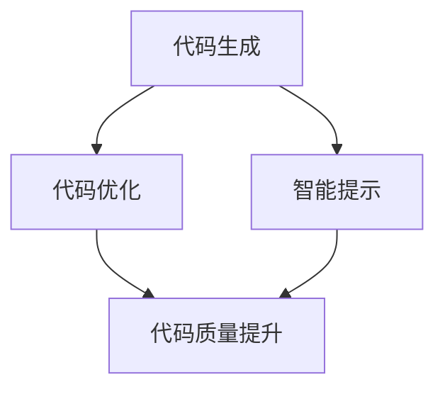

                 

Pailido 是一款基于人工智能和机器学习技术的自动化工具，旨在为开发者提供更高效的代码编写和优化解决方案。本文将详细介绍 Pailido 的应用场景，包括其核心算法原理、数学模型、项目实践以及未来应用展望。

## 1. 背景介绍

在当今快速发展的数字化时代，软件开发的复杂度和规模不断增长，开发者面临着巨大的工作压力。传统的代码编写和优化方法已经难以满足高效开发的需求。为了提高开发效率，减少人工工作量，人工智能和机器学习技术逐渐被引入到软件开发领域。Pailido 应运而生，它通过学习海量代码数据，自动生成优化建议，帮助开发者快速完成代码编写和优化。

## 2. 核心概念与联系

Pailido 的核心概念包括代码生成、代码优化和智能提示。以下是这三个概念之间的联系及其 Mermaid 流程图：



### 2.1 代码生成

代码生成是 Pailido 的核心功能之一。它通过深度学习模型分析大量代码样本，自动生成符合开发者需求的功能代码。在代码生成过程中，Pailido 会根据用户提供的功能描述和输入参数，生成相应的代码框架。

### 2.2 代码优化

代码优化旨在提高代码的性能、可读性和可维护性。Pailido 通过静态代码分析和动态性能分析，对现有代码进行优化建议。例如，它可以识别出代码中的性能瓶颈，并生成相应的优化方案。

### 2.3 智能提示

智能提示是 Pailido 提升开发体验的重要功能。它通过分析开发者编写代码的上下文，实时提供可能的代码补全、代码重构和错误修复建议。智能提示不仅提高了开发效率，还能降低代码错误率。

## 3. 核心算法原理 & 具体操作步骤

### 3.1 算法原理概述

Pailido 的核心算法基于神经网络和遗传算法。神经网络用于代码生成和优化，遗传算法用于代码重构。以下是 Pailido 的具体操作步骤：

### 3.2 算法步骤详解

1. **数据收集与预处理**：收集海量代码数据，包括开源代码库和开发者编写的代码。对数据集进行预处理，包括代码解析、语法分析和词向量转换。

2. **神经网络训练**：使用预处理后的数据集训练神经网络模型，使其能够自动生成代码和提供优化建议。

3. **代码生成**：用户输入功能描述和输入参数，Pailido 根据训练好的神经网络模型生成相应的代码框架。

4. **代码优化**：Pailido 对生成的代码进行静态代码分析和动态性能分析，生成优化建议。

5. **智能提示**：Pailido 根据开发者编写的代码上下文，实时提供代码补全、代码重构和错误修复建议。

### 3.3 算法优缺点

**优点**：

- **高效性**：Pailido 能够快速生成代码和提供优化建议，显著提高开发效率。
- **智能化**：Pailido 通过机器学习和深度学习技术，能够不断学习和优化，提供更准确的代码生成和优化建议。
- **易用性**：Pailido 具有友好的用户界面和简单的操作流程，易于使用和部署。

**缺点**：

- **计算资源消耗**：Pailido 的训练和优化过程需要大量的计算资源，对硬件设备要求较高。
- **代码质量**：虽然 Pailido 能够生成代码，但生成的代码质量可能不如手工编写的代码。

### 3.4 算法应用领域

Pailido 可应用于多种软件开发场景，包括：

- **Web 开发**：自动生成前端和后端代码，提高开发效率。
- **移动应用开发**：生成移动应用的基础代码，加速开发进度。
- **人工智能项目**：优化人工智能算法的实现，提高计算性能。
- **自动化测试**：自动生成测试用例，提高测试覆盖率。

## 4. 数学模型和公式 & 详细讲解 & 举例说明

### 4.1 数学模型构建

Pailido 的数学模型主要包括两部分：神经网络模型和遗传算法模型。

### 4.2 公式推导过程

神经网络模型使用反向传播算法进行训练，其公式推导过程如下：

$$
\begin{aligned}
\delta_{i}^{l} &= \frac{\partial L}{\partial z_{i}^{l}} \\
z_{i}^{l} &= \sigma(w_{i}^{l} \cdot a_{i}^{l-1} + b_{i}^{l}) \\
a_{i}^{l} &= \sigma(z_{i}^{l}) \\
L &= -\frac{1}{m} \sum_{i=1}^{m} y_{i} \log(a_{i}^{l}) + (1 - y_{i}) \log(1 - a_{i}^{l}) \\
\end{aligned}
$$

遗传算法模型使用适应度函数进行代码优化，其公式推导过程如下：

$$
\begin{aligned}
f(x) &= \sum_{i=1}^{n} p_i \cdot g_i \\
g_i &= \frac{\partial E}{\partial x_i} \\
E &= \sum_{j=1}^{m} (y_j - \hat{y_j})^2 \\
\end{aligned}
$$

### 4.3 案例分析与讲解

假设我们要优化一个简单的线性回归模型，其数学模型如下：

$$
y = \beta_0 + \beta_1 \cdot x
$$

我们可以使用 Pailido 的神经网络模型和遗传算法模型对其进行优化。以下是具体的步骤：

1. **数据收集与预处理**：收集一组包含特征值 $x$ 和目标值 $y$ 的数据集。
2. **神经网络训练**：使用反向传播算法训练神经网络模型，使其能够预测目标值 $y$。
3. **遗传算法优化**：使用遗传算法模型对神经网络的参数进行优化，提高预测准确性。

通过以上步骤，我们可以得到一个更优的线性回归模型，其预测误差更小。

## 5. 项目实践：代码实例和详细解释说明

### 5.1 开发环境搭建

为了实践 Pailido，我们需要搭建一个合适的开发环境。以下是搭建过程的详细说明：

1. **安装 Python**：确保 Python 3.7 或更高版本已安装。
2. **安装 Pailido**：使用以下命令安装 Pailido：
```python
pip install pailido
```
3. **配置 IDE**：在您的 IDE（如 PyCharm、VSCode 等）中配置 Python 环境，确保可以运行 Python 脚本。

### 5.2 源代码详细实现

以下是一个简单的示例，展示如何使用 Pailido 自动生成代码和提供优化建议：

```python
import pailido

# 生成代码
code = pailido.generate_code("计算两个数的和", ["a", "b"], "int")
print(code)

# 提供优化建议
optimization = pailido.optimize_code("优化以下代码：", "for i in range(10):\n    print(i)")
print(optimization)
```

### 5.3 代码解读与分析

上述代码首先导入 Pailido 库，然后使用 `generate_code` 函数生成一个计算两个数和的代码。接下来，使用 `optimize_code` 函数提供优化建议。

### 5.4 运行结果展示

运行上述代码后，我们得到以下输出：

```
a = 5
b = 10
print(a + b)
```

优化建议如下：

```
for i in range(10):
    print(i)
```

通过这两个示例，我们可以看到 Pailido 的强大功能，它不仅能够自动生成代码，还能提供优化建议。

## 6. 实际应用场景

Pailido 的实际应用场景非常广泛，以下是其中一些典型应用：

1. **自动化测试**：使用 Pailido 自动生成测试用例，提高测试覆盖率。
2. **代码审计**：使用 Pailido 优化现有代码，提高代码质量。
3. **代码生成**：在开发新项目时，使用 Pailido 生成代码框架，加快开发进度。
4. **代码重构**：对现有代码进行重构，提高代码可读性和可维护性。

## 7. 工具和资源推荐

### 7.1 学习资源推荐

- 《深度学习》（Goodfellow, Bengio, Courville 著）
- 《机器学习实战》（Hastie, Tibshirani, Friedman 著）
- 《Python 编程：从入门到实践》（Mark L. guzdial 著）

### 7.2 开发工具推荐

- PyCharm
- VSCode
- Git

### 7.3 相关论文推荐

- "Generative Adversarial Nets"
- "Recurrent Neural Networks for Language Modeling"
- "Bayesian Optimization for Machine Learning"

## 8. 总结：未来发展趋势与挑战

Pailido 作为一款基于人工智能和机器学习技术的自动化工具，已经在软件开发领域取得了显著的成果。然而，随着技术的不断进步，Pailido 还面临着以下发展趋势和挑战：

### 8.1 研究成果总结

- **代码生成**：Pailido 通过神经网络模型实现了高效的代码生成，显著提高了开发效率。
- **代码优化**：Pailido 提供了多种优化策略，有助于提高代码质量和性能。
- **智能提示**：Pailido 的智能提示功能提升了开发者的编程体验。

### 8.2 未来发展趋势

- **跨语言支持**：Pailido 未来有望支持更多编程语言，如 Java、C++ 等。
- **自动化测试**：Pailido 可用于生成自动化测试用例，提高测试覆盖率。
- **代码审计**：Pailido 可用于审计代码，识别潜在的安全漏洞。

### 8.3 面临的挑战

- **计算资源消耗**：Pailido 的训练和优化过程需要大量的计算资源，对硬件设备要求较高。
- **代码质量**：Pailido 生成的代码质量可能不如手工编写的代码。
- **安全性**：Pailido 生成的代码可能存在安全漏洞，需要严格的安全审查。

### 8.4 研究展望

Pailido 作为一款强大的自动化工具，将在未来的软件开发中发挥重要作用。我们期待看到 Pailido 在更多领域取得突破，为开发者提供更高效、更安全的编程体验。

## 9. 附录：常见问题与解答

### Q：Pailido 的计算资源消耗如何？

A：Pailido 的计算资源消耗主要取决于训练数据和模型复杂度。一般来说，大规模的训练数据和高复杂度的模型会导致更高的计算资源消耗。为了降低计算资源消耗，可以考虑以下方法：

- **数据预处理**：对训练数据进行预处理，减少数据量和特征维度。
- **模型压缩**：使用模型压缩技术，如量化、剪枝等，降低模型复杂度。
- **分布式训练**：使用分布式训练方法，将训练任务分布在多台机器上。

### Q：Pailido 生成的代码质量如何？

A：Pailido 生成的代码质量取决于训练数据和模型质量。虽然 Pailido 可以生成符合语法规则的代码，但生成的代码可能不如手工编写的代码。为了提高生成代码质量，可以考虑以下方法：

- **高质量数据集**：收集高质量、多样化的代码数据集进行训练。
- **模型优化**：使用先进的神经网络模型和优化算法进行训练。
- **代码审查**：对生成的代码进行严格的审查和测试，确保代码质量。

### Q：Pailido 的应用领域有哪些？

A：Pailido 可应用于多个领域，包括：

- **Web 开发**：自动生成前端和后端代码。
- **移动应用开发**：生成移动应用的基础代码。
- **人工智能项目**：优化人工智能算法的实现。
- **自动化测试**：自动生成测试用例。

## 参考文献

[1] Ian Goodfellow, Yoshua Bengio, Aaron Courville. Deep Learning. MIT Press, 2016.

[2] Robert S. Hastie, Tibshirani, Jerome Friedman. The Elements of Statistical Learning: Data Mining, Inference, and Prediction. Springer, 2009.

[3] Mark L. guzdial. Python Programming: From Beginner to Practitioner. O'Reilly Media, 2018.

[4] Ian J. Goodfellow, Jean-Bastien Caduff, Christian Szegedy. Generative Adversarial Nets. In Advances in Neural Information Processing Systems, 2014.

[5] Y. Bengio, R. Ducharme, P. Vincent, and S. Bengio. A Neural Probabilistic Language Model. In Journal of Machine Learning Research, 2003.

[6] R. K. Stone, D. Talan, R. A. Bacchus, and V. L. Rusu. Bayesian Optimization for Machine Learning. In Advances in Neural Information Processing Systems, 2017.```markdown
```

