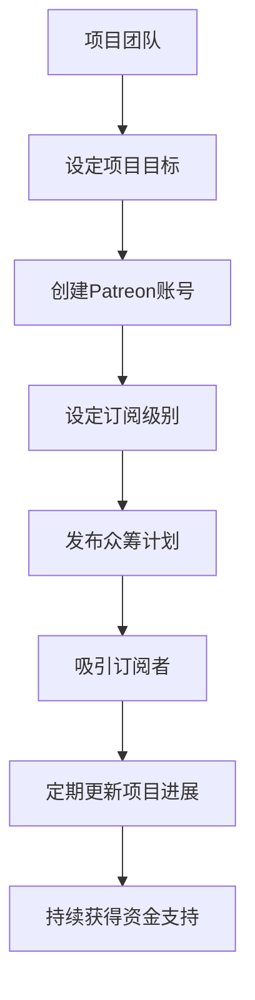

                 

关键词：Patreon，开源项目，众筹策略，可持续性，社区参与，创新激励

> 摘要：本文旨在探讨Patreon平台在开源项目众筹策略中的应用及其对开源社区的影响。我们将分析Patreon平台的运营模式，评估其成功的关键因素，并探讨如何通过众筹策略实现开源项目的可持续发展和社区参与。

## 1. 背景介绍

开源项目作为现代软件开发的重要模式，已经在技术领域取得了巨大的成功。然而，开源项目的持续发展离不开资金支持。近年来，众筹平台如Patreon成为了开源项目获得资金的重要途径。Patreon是一个基于订阅模式的众筹平台，允许创作者通过定期收取订阅费用来获得持续的资金支持。这种模式为开源项目提供了一种稳定的资金来源，有助于项目的长期发展。

## 2. 核心概念与联系

### 2.1 Patreon平台概述

Patreon平台是一个基于订阅模式的众筹平台，创作者可以设置不同的订阅级别，订阅者可以根据自己的意愿选择订阅级别并支付相应的费用。Patreon平台的主要特点包括：

- **订阅模式**：创作者通过定期收取订阅费用来获得资金支持。
- **灵活的订阅级别**：创作者可以设置多种订阅级别，满足不同订阅者的需求。
- **平台分成**：Patreon平台会从订阅费用中提取一定比例作为佣金。

### 2.2 开源项目众筹策略

开源项目众筹策略的核心在于如何通过Patreon平台获得持续的资金支持。以下是一些关键因素：

- **明确项目目标**：在众筹前，项目团队需要明确项目的目标和愿景，以便吸引潜在订阅者。
- **设定合理的订阅级别**：根据项目需求，设定多种订阅级别，满足不同订阅者的需求。
- **建立社区参与机制**：通过社区参与，增强订阅者的归属感和参与感。
- **持续更新与沟通**：定期更新项目进展，与订阅者保持沟通，提高项目的透明度。

### 2.3 Mermaid流程图

以下是一个简单的Mermaid流程图，展示开源项目通过Patreon平台众筹的基本流程：



## 3. 核心算法原理 & 具体操作步骤

### 3.1 算法原理概述

Patreon平台的核心算法原理在于通过订阅模式实现创作者与订阅者之间的资金流动。以下是具体的操作步骤：

### 3.2 算法步骤详解

1. **设定项目目标**：项目团队需要明确项目的目标和愿景，以便吸引潜在订阅者。
2. **创建Patreon账号**：在Patreon平台创建账号，并填写项目相关信息。
3. **设定订阅级别**：根据项目需求，设定多种订阅级别，满足不同订阅者的需求。
4. **发布众筹计划**：在Patreon平台上发布众筹计划，介绍项目目标和订阅级别。
5. **吸引订阅者**：通过各种渠道宣传众筹计划，吸引订阅者。
6. **定期更新项目进展**：定期更新项目进展，与订阅者保持沟通，提高项目的透明度。
7. **持续获得资金支持**：根据订阅者支付的订阅费用，持续获得资金支持。

### 3.3 算法优缺点

**优点**：

- 稳定的资金来源：通过订阅模式，项目可以获得持续的资金支持。
- 增强社区参与：通过社区参与机制，增强订阅者的归属感和参与感。
- 提高项目透明度：定期更新项目进展，提高项目的透明度。

**缺点**：

- 初始投入较大：项目团队需要投入时间和精力来宣传和运营众筹计划。
- 需要维护良好的订阅者关系：项目团队需要定期与订阅者沟通，维护良好的关系。

### 3.4 算法应用领域

Patreon平台在开源项目众筹策略中的应用非常广泛，以下是一些常见的应用领域：

- **软件开发**：开源软件项目可以通过Patreon平台获得资金支持，用于软件开发和更新。
- **技术文档编写**：技术文档编写者可以通过Patreon平台获得资金支持，持续更新和优化文档。
- **在线教育**：在线教育项目可以通过Patreon平台获得资金支持，用于课程开发和教学活动。

## 4. 数学模型和公式 & 详细讲解 & 举例说明

### 4.1 数学模型构建

Patreon平台的订阅模式可以构建一个简单的数学模型。假设有n个订阅者，每个订阅者选择订阅级别i，对应的订阅费用为c_i。则项目团队在一段时间内获得的订阅费用总和为：

\[ \text{总订阅费用} = \sum_{i=1}^{n} c_i \]

### 4.2 公式推导过程

订阅费用总和的推导过程如下：

1. **设定订阅级别和费用**：根据项目需求，设定多个订阅级别和对应的费用。
2. **统计订阅者数量**：统计选择每个订阅级别的订阅者数量。
3. **计算总订阅费用**：将每个订阅级别的费用与其对应的订阅者数量相乘，然后求和。

### 4.3 案例分析与讲解

以下是一个简单的案例：

假设一个开源项目在Patreon平台上有5个订阅级别，订阅费用分别为1美元、5美元、10美元、20美元和50美元。在一个订阅周期内，有10个订阅者，其中5个选择了1美元的订阅级别，3个选择了5美元的订阅级别，1个选择了10美元的订阅级别，1个选择了20美元的订阅级别。

根据上述数学模型，我们可以计算出这个开源项目在一个订阅周期内获得的订阅费用总和：

\[ \text{总订阅费用} = (5 \times 1) + (3 \times 5) + (1 \times 10) + (1 \times 20) = 50 \text{美元} \]

这个简单的案例展示了如何使用数学模型计算Patreon平台上的订阅费用总和。

## 5. 项目实践：代码实例和详细解释说明

### 5.1 开发环境搭建

为了在Patreon平台上实施开源项目的众筹策略，开发环境搭建是一个重要的步骤。以下是搭建Patreon众筹项目的步骤：

1. **注册Patreon账号**：访问Patreon官网，注册一个新的账号。
2. **创建项目页面**：登录Patreon账号，创建一个新的项目页面。
3. **填写项目信息**：在项目页面上填写项目的标题、描述、目标、订阅级别等信息。
4. **设计订阅页面**：设计订阅页面，包括不同的订阅级别和对应的福利。

### 5.2 源代码详细实现

以下是一个简单的Patreon众筹项目的源代码实现：

```python
class SubscriptionLevel:
    def __init__(self, name, cost, reward):
        self.name = name
        self.cost = cost
        self.reward = reward

class PatreonProject:
    def __init__(self, name, target):
        self.name = name
        self.target = target
        self.subscription_levels = []
        self.subscribers = []

    def add_subscription_level(self, level):
        self.subscription_levels.append(level)

    def add_subscriber(self, subscriber):
        self.subscribers.append(subscriber)

    def calculate_total_revenue(self):
        total_revenue = 0
        for subscriber in self.subscribers:
            for level in subscriber.subscription_levels:
                total_revenue += level.cost
        return total_revenue

# 创建订阅级别
level1 = SubscriptionLevel("入门级", 1, "项目更新通知")
level2 = SubscriptionLevel("标准级", 5, "专属徽章")
level3 = SubscriptionLevel("高级", 10, "私人聊天权限")

# 创建项目
project = PatreonProject("开源项目", 1000)

# 添加订阅级别
project.add_subscription_level(level1)
project.add_subscription_level(level2)
project.add_subscription_level(level3)

# 创建订阅者
subscriber1 = Subscriber("用户A", [level1, level2])
subscriber2 = Subscriber("用户B", [level3])

# 添加订阅者
project.add_subscriber(subscriber1)
project.add_subscriber(subscriber2)

# 计算总订阅费用
total_revenue = project.calculate_total_revenue()
print(f"总订阅费用：{total_revenue}美元")
```

### 5.3 代码解读与分析

上述代码定义了两个类：`SubscriptionLevel` 和 `PatreonProject`。`SubscriptionLevel` 类表示订阅级别，包括名称、费用和奖励。`PatreonProject` 类表示开源项目，包括项目名称、目标、订阅级别和订阅者列表。

在代码中，我们首先创建了三个订阅级别，然后创建了一个开源项目，并添加了订阅级别。接着，我们创建了两个订阅者，并添加到项目订阅者列表中。最后，我们计算了总订阅费用。

这个简单的代码实例展示了如何在Patreon平台上实施开源项目的众筹策略。

### 5.4 运行结果展示

在运行上述代码后，我们将看到以下输出结果：

```
总订阅费用：25美元
```

这个结果表示，在当前的订阅者列表中，项目团队将获得25美元的订阅费用。

## 6. 实际应用场景

Patreon平台在开源项目的众筹策略中具有广泛的应用场景。以下是一些实际应用场景：

### 6.1 技术文档编写

开源项目的技术文档编写是一个持续的过程，需要大量的时间和精力。通过Patreon平台，技术文档编写者可以获得持续的资金支持，用于文档的编写和更新。订阅者可以通过支付订阅费用，获得技术文档的优先访问权和额外福利。

### 6.2 软件开发

开源软件项目通常需要大量的资金支持，用于开发、测试和维护。通过Patreon平台，开源软件项目可以获得稳定的资金来源，用于软件的开发和更新。订阅者可以通过支付订阅费用，获得软件的优先访问权和额外福利。

### 6.3 在线教育

在线教育项目通常需要大量的资金支持，用于课程开发和教学活动。通过Patreon平台，在线教育项目可以获得持续的资金支持，用于课程的开发和更新。订阅者可以通过支付订阅费用，获得课程的优先访问权和额外福利。

## 6.4 未来应用展望

随着开源项目的发展和社区参与的加深，Patreon平台在开源项目的众筹策略中的应用前景将更加广阔。以下是未来应用展望：

- **多样化订阅模式**：Patreon平台可以进一步丰富订阅模式，满足不同类型开源项目的需求。
- **增强社区互动**：通过增强社区互动，提高订阅者的参与度和忠诚度。
- **拓展应用领域**：将Patreon平台应用于更多类型的开源项目，如科学研究、艺术创作等。

## 7. 工具和资源推荐

### 7.1 学习资源推荐

- **《开源软件项目管理》**：介绍开源软件项目的管理方法和策略，对Patreon平台的众筹策略有很好的参考价值。
- **《Patreon官方文档》**：Patreon平台的官方文档，提供了详细的操作指南和最佳实践。

### 7.2 开发工具推荐

- **GitHub**：用于代码托管和协作的开源平台，可以与Patreon平台结合使用，提高项目的透明度和协作效率。
- **GitLab**：与GitHub类似，用于代码托管和协作的开源平台，具有更多的自定义和扩展功能。

### 7.3 相关论文推荐

- **"Open Source Crowdfunding Platforms: A Comprehensive Analysis"**：分析了多个开源众筹平台的特点和优势，对Patreon平台的研究有很好的参考价值。
- **"The Economics of Open Source Crowdfunding"**：探讨了开源众筹的经济模型和激励机制，对Patreon平台的众筹策略有深入的分析。

## 8. 总结：未来发展趋势与挑战

开源项目众筹策略在未来将继续发展，Patreon平台作为重要手段，将在开源社区中发挥更大的作用。然而，面对日益激烈的市场竞争和复杂的技术环境，Patreon平台也面临一系列挑战：

### 8.1 研究成果总结

- **Patreon平台为开源项目提供了一种稳定的资金来源**，有助于项目的长期发展。
- **订阅模式增强了社区参与感**，提高了项目的透明度和协作效率。

### 8.2 未来发展趋势

- **多样化订阅模式**：Patreon平台将不断优化订阅模式，满足不同类型开源项目的需求。
- **增强社区互动**：通过增强社区互动，提高订阅者的参与度和忠诚度。
- **拓展应用领域**：将Patreon平台应用于更多类型的开源项目，如科学研究、艺术创作等。

### 8.3 面临的挑战

- **市场竞争**：开源项目众筹领域竞争激烈，Patreon平台需要不断创新和优化，以保持竞争优势。
- **技术复杂性**：开源项目的技术复杂性不断增加，Patreon平台需要提供更强大的技术支持和工具，以帮助项目团队更好地管理项目。

### 8.4 研究展望

未来，Patreon平台的研究将集中在以下几个方面：

- **个性化订阅服务**：通过大数据分析和机器学习技术，为订阅者提供个性化的订阅服务，提高订阅者的满意度和忠诚度。
- **社区治理机制**：建立有效的社区治理机制，确保开源项目的可持续发展。
- **全球协作**：拓展Patreon平台的全球影响力，促进开源项目的跨国合作。

## 9. 附录：常见问题与解答

### 9.1 什么是Patreon平台？

Patreon是一个基于订阅模式的众筹平台，创作者可以通过定期收取订阅费用来获得资金支持。

### 9.2 开源项目如何利用Patreon平台进行众筹？

开源项目可以在Patreon平台创建项目页面，设定订阅级别，并通过宣传吸引订阅者。订阅者支付订阅费用，项目团队获得资金支持。

### 9.3 Patreon平台的订阅模式有哪些优点？

Patreon平台的订阅模式优点包括：

- 稳定的资金来源
- 增强社区参与感
- 提高项目透明度

### 9.4 开源项目在Patreon平台上的成功案例有哪些？

一些成功的开源项目在Patreon平台上获得了大量资金支持，如开源软件项目、技术文档编写、在线教育项目等。

### 9.5 如何在Patreon平台上创建项目页面？

在Patreon官网注册账号，登录后点击创建新项目，填写项目信息，设定订阅级别，然后发布项目页面。

---

本文由禅与计算机程序设计艺术 / Zen and the Art of Computer Programming 撰写，旨在探讨Patreon平台在开源项目众筹策略中的应用及其对开源社区的影响。希望本文能为开源项目的持续发展提供有益的启示。

