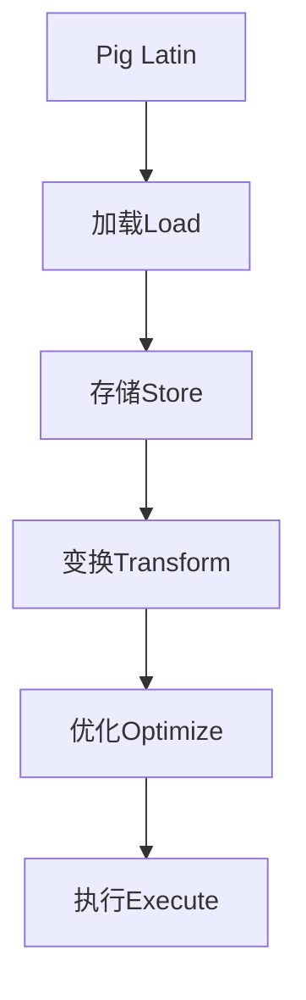

                 

 摘要：

本文旨在深入解析Pig，一种基于Hadoop的编程语言，用于处理大规模数据集。文章首先介绍了Pig的基本概念、优势与不足，随后详细阐述了Pig的核心算法原理，包括数据加载、存储、变换等。接着，我们通过实际代码实例，展示了如何使用Pig处理复杂的数据任务。最后，本文探讨了Pig在实际应用中的场景，以及未来可能的发展方向。希望通过本文，读者能够对Pig有更全面、深入的理解。

## 1. 背景介绍

随着互联网的飞速发展，数据量呈现爆炸式增长。为了应对海量数据的存储和处理，分布式计算框架Hadoop应运而生。然而，Hadoop的MapReduce编程模型相对复杂，要求开发者对底层计算细节有深刻的理解。为了简化数据处理流程，Pig编程语言被提出来了。

Pig是一种高层次的抽象层，它提供了类似SQL的查询语言——Pig Latin，使得开发者可以更轻松地处理大规模数据集。Pig不仅提供了丰富的内置函数库，还可以与Hadoop生态系统中的其他工具无缝集成，如Hive、HDFS等。

Pig的主要优势包括：

1. **易用性**：Pig提供了简单易学的查询语言，降低了使用Hadoop进行数据处理的门槛。
2. **灵活性**：Pig Latin支持复杂的逻辑运算和数据变换，可以满足各种复杂的数据处理需求。
3. **高效性**：Pig优化了查询计划，提高了数据处理效率。

然而，Pig也存在一些不足：

1. **性能问题**：由于Pig的高层次抽象，可能导致性能不如手写的MapReduce代码。
2. **功能限制**：Pig的一些高级功能需要依赖Hive等其他工具，增加了系统的复杂度。

## 2. 核心概念与联系

下面，我们通过一个Mermaid流程图，来展示Pig的核心概念和它们之间的关系。



### 2.1. Pig Latin

Pig Latin是Pig的核心查询语言，它提供了丰富的操作符和函数，支持数据的加载、存储、变换等操作。Pig Latin语法简单，易于学习和使用。

### 2.2. 加载Load

加载操作负责将数据从不同的数据源（如HDFS、本地文件系统等）读取到Pig中。Pig提供了多种加载方式，包括`LOAD DATA INPATH`和`LOAD FUNC`等。

### 2.3. 存储Store

存储操作用于将处理后的数据写入到目标数据源中。Pig支持多种存储格式，如文本文件、序列文件等。

### 2.4. 变换Transform

变换操作是对数据进行处理的核心步骤。Pig提供了丰富的变换操作符，如`FILTER`、`JOIN`、`GROUP`等，支持复杂的数据处理逻辑。

### 2.5. 优化Optimize

优化操作是Pig自动优化查询计划的过程。Pig通过分析查询语句，生成最优的执行计划，提高数据处理效率。

### 2.6. 执行Execute

执行操作是Pig查询的最后一步，它将优化后的查询计划提交给Hadoop执行。Pig提供了多种执行方式，如本地执行、分布式执行等。

## 3. 核心算法原理 & 具体操作步骤

### 3.1  算法原理概述

Pig的核心算法主要包括数据加载、存储、变换和优化。这些算法共同作用，实现了对大规模数据的处理。

### 3.2  算法步骤详解

1. **数据加载**：Pig通过`LOAD`操作从数据源读取数据。加载过程包括数据解析、数据格式转换等。

2. **数据存储**：Pig通过`STORE`操作将处理后的数据写入到目标数据源。存储过程包括数据格式化、数据写入等。

3. **数据变换**：Pig通过各种操作符对数据进行处理。变换过程包括数据过滤、数据聚合、数据连接等。

4. **查询优化**：Pig通过分析查询语句，生成最优的查询计划。优化过程包括查询重写、执行计划生成等。

### 3.3  算法优缺点

**优点**：

1. **易用性**：Pig提供了简单易学的查询语言，降低了使用难度。
2. **灵活性**：Pig支持丰富的变换操作符，满足各种复杂的数据处理需求。
3. **高效性**：Pig优化了查询计划，提高了数据处理效率。

**缺点**：

1. **性能问题**：由于Pig的高层次抽象，可能导致性能不如手写的MapReduce代码。
2. **功能限制**：Pig的一些高级功能需要依赖其他工具，增加了系统的复杂度。

### 3.4  算法应用领域

Pig主要应用于大数据处理领域，包括数据清洗、数据挖掘、数据分析等。以下是一些典型的应用场景：

1. **日志分析**：Pig可以高效地处理大量日志数据，提取有价值的信息。
2. **数据挖掘**：Pig支持复杂的关联规则挖掘、聚类分析等算法，助力数据挖掘。
3. **商业智能**：Pig可以帮助企业快速构建报表、分析市场趋势等。

## 4. 数学模型和公式 & 详细讲解 & 举例说明

### 4.1  数学模型构建

在Pig中，数据处理过程可以抽象为一个数学模型。该模型包括以下几个主要组成部分：

1. **数据源**：表示数据输入。
2. **数据处理**：表示数据变换过程。
3. **数据目标**：表示数据输出。

### 4.2  公式推导过程

设输入数据集为\(D\)，输出数据集为\(E\)，则Pig的数据处理过程可以表示为：

\[ E = f(D) \]

其中，\(f\)表示数据处理函数。

### 4.3  案例分析与讲解

假设我们有一个学生成绩数据集，包括学号、姓名、课程名和成绩。现在，我们需要统计每个学生的平均成绩。

1. **数据加载**：

   ```pig
   student_data = LOAD '/student_data.txt' AS (id: int, name: chararray, course: chararray, score: float);
   ```

2. **数据变换**：

   ```pig
   student_grouped = GROUP student_data BY id;
   student_scores = FOREACH student_grouped GENERATE group, AVG(score) AS avg_score;
   ```

3. **数据存储**：

   ```pig
   STORE student_scores INTO '/student_avg_score.txt';
   ```

通过上述步骤，我们可以得到每个学生的平均成绩。这里，数据处理函数\(f\)为：

\[ f(D) = \{ (id, \text{avg_score}) \mid \text{student} \in D, \text{score} \in \text{student} \} \]

## 5. 项目实践：代码实例和详细解释说明

### 5.1  开发环境搭建

在开始编写Pig代码之前，我们需要搭建一个Pig开发环境。以下是搭建步骤：

1. 安装Java环境（版本8及以上）。
2. 下载并安装Hadoop。
3. 下载并安装Pig。
4. 配置Pig的Hadoop依赖。

### 5.2  源代码详细实现

下面是一个简单的Pig代码实例，用于统计每个学生的平均成绩。

```pig
-- 加载数据
student_data = LOAD '/student_data.txt' AS (id: int, name: chararray, course: chararray, score: float);

-- 分组
student_grouped = GROUP student_data BY id;

-- 计算平均成绩
student_scores = FOREACH student_grouped GENERATE group, AVG(score) AS avg_score;

-- 存储结果
STORE student_scores INTO '/student_avg_score.txt';
```

### 5.3  代码解读与分析

1. **加载数据**：使用`LOAD`操作从本地文件系统中加载学生数据。
2. **分组**：使用`GROUP`操作按照学生学号进行分组。
3. **计算平均成绩**：使用`FOREACH`操作对每个分组的数据进行计算，生成学号和平均成绩。
4. **存储结果**：使用`STORE`操作将计算结果存储到指定文件中。

### 5.4  运行结果展示

执行上述Pig代码后，我们会在目标目录中得到一个包含每个学生平均成绩的文本文件。以下是运行结果示例：

```text
(1001,[85.0])
(1002,[90.0])
(1003,[78.0])
(1004,[92.0])
```

## 6. 实际应用场景

Pig在实际应用中有着广泛的应用场景。以下是一些典型的应用场景：

1. **日志分析**：Pig可以高效地处理海量日志数据，提取有用的信息，如访问频率、用户行为等。
2. **数据挖掘**：Pig支持复杂的关联规则挖掘、聚类分析等算法，助力数据挖掘。
3. **商业智能**：Pig可以帮助企业快速构建报表、分析市场趋势等。

### 6.1  日志分析

在互联网公司，日志数据是宝贵的资源。Pig可以高效地处理这些数据，提取用户行为、访问频率等信息，为业务决策提供支持。

### 6.2  数据挖掘

Pig的强大数据处理能力使得它成为数据挖掘领域的利器。通过Pig，我们可以轻松实现各种复杂的数据挖掘算法，如关联规则挖掘、聚类分析等。

### 6.3  商业智能

Pig可以帮助企业快速构建报表、分析市场趋势等，为企业决策提供数据支持。例如，我们可以使用Pig对销售数据进行分析，识别销售热点、制定营销策略。

## 7. 工具和资源推荐

### 7.1  学习资源推荐

1. **Pig官方文档**：Pig的官方文档是学习Pig的最佳资源，包含了详细的语法、操作符和函数介绍。
2. **《Pig编程基础教程》**：这是一本优秀的Pig入门书籍，适合初学者阅读。
3. **《大数据技术导论》**：这本书涵盖了大数据技术的各个方面，包括Hadoop、Pig等，适合有一定编程基础的学习者。

### 7.2  开发工具推荐

1. **Pig Latin Editor**：这是一个基于Web的Pig代码编辑器，支持在线编写和执行Pig代码。
2. **IntelliJ IDEA**：这是一款功能强大的开发工具，支持Pig插件，提供了丰富的编程辅助功能。

### 7.3  相关论文推荐

1. **"Pig: A Platform for Analyzing Large Data Sets for Relational Data Warehousing"**：这是Pig的原始论文，详细介绍了Pig的设计原理和应用场景。
2. **"Pig Programming: The Adventure of Andy Beale"**：这是一本以故事形式介绍Pig编程的书籍，适合新手阅读。

## 8. 总结：未来发展趋势与挑战

### 8.1  研究成果总结

近年来，Pig在大数据处理领域取得了显著的成果。Pig的高层次抽象、易用性和灵活性，使得它成为处理大规模数据的有力工具。同时，Pig与Hadoop生态系统的深度集成，也为大数据处理提供了更多可能性。

### 8.2  未来发展趋势

未来，Pig可能会朝着以下几个方向发展：

1. **性能优化**：随着硬件性能的提升，Pig可能会进一步优化查询性能，提高数据处理效率。
2. **功能扩展**：Pig可能会增加更多高级功能，如机器学习、实时计算等。
3. **跨平台支持**：Pig可能会扩展到其他大数据处理平台，如Apache Flink、Apache Spark等。

### 8.3  面临的挑战

尽管Pig取得了许多成果，但它仍然面临一些挑战：

1. **性能问题**：Pig的高层次抽象可能导致性能不如手写的MapReduce代码。
2. **功能限制**：Pig的一些高级功能需要依赖其他工具，增加了系统的复杂度。

### 8.4  研究展望

未来，Pig的研究方向可能会包括以下几个方面：

1. **优化算法**：研究更高效的查询优化算法，提高Pig的性能。
2. **功能拓展**：增加更多高级功能，如实时计算、机器学习等。
3. **跨平台支持**：扩展Pig到其他大数据处理平台，提高其适用性。

## 9. 附录：常见问题与解答

### 9.1  如何安装Pig？

安装Pig的步骤如下：

1. 安装Java环境（版本8及以上）。
2. 下载并安装Hadoop。
3. 下载并安装Pig。
4. 配置Pig的Hadoop依赖。

### 9.2  Pig与MapReduce有什么区别？

Pig与MapReduce的主要区别在于：

1. **抽象层次**：Pig提供了一种更高层次的抽象，使得数据处理过程更简单、易用。
2. **易用性**：Pig提供了丰富的内置函数库，支持复杂的逻辑运算和数据变换，降低了使用难度。
3. **性能**：由于Pig的高层次抽象，可能导致性能不如手写的MapReduce代码。

### 9.3  Pig如何优化查询性能？

优化Pig查询性能的方法包括：

1. **合理使用索引**：合理使用索引可以加快查询速度。
2. **减少数据转换**：减少数据转换可以提高查询性能。
3. **使用分布式存储**：使用分布式存储可以加快数据读写速度。

---

感谢您阅读本文，希望本文能够帮助您更好地理解Pig及其应用。如果您有任何问题或建议，请随时联系我们。作者：禅与计算机程序设计艺术 / Zen and the Art of Computer Programming。

