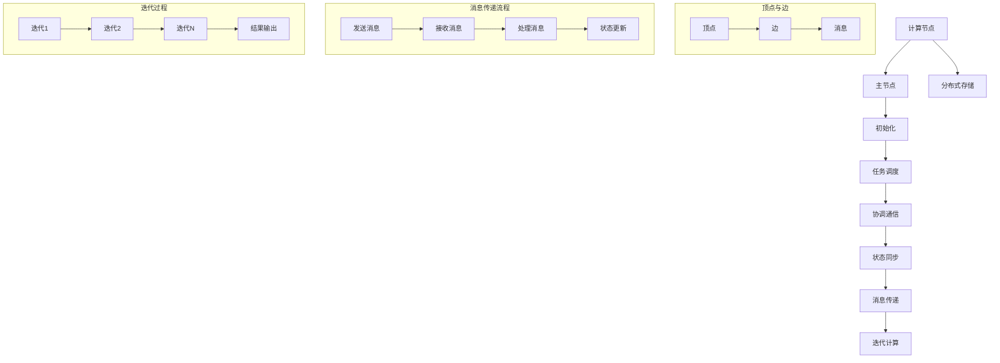

                 

### 摘要

本文旨在深入讲解Pregel原理，并辅以代码实例，帮助读者理解这一分布式图处理框架的实际应用。Pregel由Google提出，用于处理大规模图数据，具有可伸缩性和容错性。本文首先介绍Pregel的背景和核心概念，接着详细解析其算法原理、数学模型、以及实际操作步骤。通过具体代码实例，我们将进一步剖析Pregel的实践应用，探讨其在各种实际场景中的表现。最后，本文将对Pregel的未来应用前景进行展望，并提出相关工具和资源的推荐。

## 1. 背景介绍

在互联网时代，数据量呈指数级增长，图数据作为复杂网络结构的重要表现形式，在现代应用中扮演着越来越重要的角色。然而，传统的关系数据库和批处理系统在处理大规模图数据时往往显得力不从心。为了解决这一问题，Google提出了Pregel，一个分布式图处理框架，旨在提供高效且可靠的图处理能力。

Pregel的设计理念源于图计算领域的基本问题，例如最短路径、社交网络分析、网页排名等。其核心目标是实现大规模图数据的分布式处理，同时保持计算结果的正确性和一致性。与传统批处理和流处理框架不同，Pregel专注于图的并行计算，能够充分利用分布式系统的计算资源，提高数据处理效率。

Pregel之所以受到广泛关注，不仅因为其高效的分布式处理能力，还因为其可伸缩性和容错性。在大规模数据处理领域，数据量通常非常庞大，Pregel能够自动分解任务，并在多个计算节点上并行执行，从而显著缩短处理时间。此外，Pregel具有良好的容错机制，能够在计算节点失败时自动恢复，确保计算的连续性和正确性。

总之，Pregel作为分布式图处理框架，为大规模图数据提供了高效且可靠的解决方案，在许多领域具有广泛的应用前景。

### 1.1 Pregel的起源和发展历程

Pregel的起源可以追溯到Google内部对于大规模图数据处理的实际需求。随着互联网的快速发展，Google面临的图数据量不断增加，传统的批处理和流处理系统已经难以应对这种复杂的数据结构。为了解决这一问题，Google的工程师们开始探索分布式计算在图处理领域的应用。

2008年，Google在《大规模图处理系统：Pregel算法原理与实现》一文中首次公开了Pregel的架构和算法。这篇文章详细介绍了Pregel的设计理念、核心概念以及实现原理，引起了学术和工业界的广泛关注。Pregel的提出不仅为分布式图处理提供了一个新的思路，也为后续的研究和应用奠定了基础。

在Pregel的发展历程中，其核心架构和算法得到了不断优化和完善。最初版本的Pregel主要用于Google内部的搜索引擎和广告系统，随后逐渐扩展到其他应用领域。随着云计算和分布式系统的普及，Pregel的理念和技术得到了更广泛的应用和验证。

近年来，许多研究机构和公司也开始基于Pregel开发自己的图处理框架，如Apache Giraph、Apache Twill、以及Microsoft Graph Engine等。这些框架在Pregel的基础上进行了改进和扩展，增加了更多的功能和灵活性，以适应不同的应用场景和需求。

总之，Pregel作为分布式图处理的开创性框架，其起源和发展历程充分展示了分布式计算在解决大规模图数据处理难题中的重要性。通过不断的优化和创新，Pregel及其衍生框架在分布式图处理领域发挥着越来越重要的作用。

### 1.2 Pregel的核心概念和架构

Pregel是一个分布式图处理框架，其核心概念和架构旨在提供高效且可靠的图处理能力。为了更好地理解Pregel的工作原理，我们首先需要了解几个关键概念：图、顶点、边和消息传递。

#### 图、顶点和边

在Pregel中，图是一个由顶点和边组成的网络结构。顶点表示图中的节点，可以是任何具有独立标识的对象，如用户、网页或设备。边则表示顶点之间的关系，可以是有向的或无向的。Pregel中的图是一个无环的有向图，这意味着不存在顶点之间的循环关系。

顶点和边是图的基本构成元素，它们在Pregel的计算过程中起着至关重要的作用。每个顶点都包含一些属性数据，这些数据可以用来存储顶点的状态信息，如顶点的类型、权重或标签。边则用于连接顶点，描述它们之间的关系。

#### 消息传递

消息传递是Pregel的核心计算机制。在Pregel中，每个顶点可以发送和接收消息。消息是一种用于顶点之间传递信息的结构，通常包含消息内容和发送者的标识。通过消息传递，顶点可以与网络中的其他顶点进行交互，共享信息并协作完成计算任务。

消息传递的过程可以分为以下几个步骤：

1. **初始化**：在计算开始前，每个顶点会初始化自身的状态，并准备接收和处理消息。

2. **发送消息**：顶点可以通过调用`sendMessage`方法向其他顶点发送消息。消息可以是单播（仅发送给一个特定的顶点）或多播（发送给一组顶点）。

3. **处理消息**：顶点在接收到消息后，会根据消息的内容更新自身的状态。这个过程称为“激活”（activation）。激活是Pregel的核心计算步骤，顶点可以通过处理消息来更新自身状态或与其他顶点进行交互。

4. **同步**：在发送和接收消息后，Pregel会进行同步操作，确保所有顶点的状态更新是正确和一致的。同步是Pregel保证计算结果正确性的关键机制。

#### 计算节点

Pregel的计算过程在分布式计算节点上执行。每个计算节点负责处理一部分图数据，并与其他节点协作完成计算任务。计算节点通常由多台物理服务器组成，这些服务器通过网络连接在一起，形成一个分布式计算集群。

Pregel的计算节点具有以下特点：

- **并行计算**：计算节点可以并行处理多个顶点的状态更新，从而提高计算效率。

- **负载均衡**：Pregel会自动分配计算任务，确保每个计算节点的负载均衡，避免资源浪费。

- **容错性**：计算节点在处理图数据时可能会遇到故障。Pregel具有容错机制，可以在节点故障时自动恢复，确保计算的连续性和正确性。

#### 分布式存储

Pregel使用分布式存储来管理图数据。分布式存储系统将图数据分割成多个子图，并存储在多个计算节点上。每个节点只负责处理一部分子图，从而实现数据分片和并行处理。

分布式存储具有以下优点：

- **可扩展性**：分布式存储可以轻松扩展，以应对不断增长的数据量。

- **高可用性**：分布式存储通过数据冗余和节点备份提高系统的可靠性。

- **负载均衡**：分布式存储系统能够自动均衡数据访问负载，确保系统性能。

#### 总结

Pregel的核心概念和架构旨在提供高效、可伸缩和可靠的分布式图处理能力。通过图、顶点、边和消息传递机制，Pregel能够实现大规模图数据的并行处理，并具备良好的容错性和负载均衡能力。分布式计算节点和分布式存储的引入，进一步提升了Pregel的性能和可靠性，使其成为分布式图处理领域的重要框架。

### 1.3 Pregel的应用场景

Pregel作为一种分布式图处理框架，具有广泛的应用场景。以下是Pregel在实际应用中的一些典型场景：

#### 社交网络分析

社交网络分析是Pregel最典型的应用场景之一。在社交网络中，用户和关系可以表示为一个大规模的图结构。Pregel可以用于计算社交网络中的各种重要指标，如朋友数、社区发现、影响力传播等。

例如，可以通过Pregel计算每个用户的朋友数，从而识别出社交网络中的关键节点。此外，Pregel还可以用于社区发现，将社交网络划分成多个紧密联系的社区，帮助分析社交网络的内在结构和动态变化。

#### 网页排名

网页排名是另一个广泛使用的应用场景。在搜索引擎中，网页的排名与其重要性相关。Pregel可以用于计算网页的PageRank值，从而实现高效的网页排名。

PageRank算法通过分析网页之间的链接关系，计算出每个网页的重要性和影响力。Pregel的分布式计算能力使得大规模网页的PageRank计算更加高效，有助于提高搜索引擎的查询性能和用户体验。

#### 图遍历和最短路径

Pregel还可以用于图遍历和最短路径计算。例如，在社交网络分析中，可以计算用户之间的最短路径，以识别潜在的社交关系。在交通网络中，Pregel可以用于计算最短路径，优化交通路线和调度。

#### 图聚类

图聚类是一种将图中的顶点划分成多个组的过程，用于识别图的内部结构和模式。Pregel可以用于大规模图数据的聚类分析，如生物信息学中的基因聚类、社交网络中的用户群体划分等。

#### 能源网络优化

能源网络优化是Pregel在工业领域的一个重要应用。能源网络可以表示为一个复杂的图结构，包括电力、天然气和水资源等。Pregel可以用于优化能源网络的配置和调度，提高能源利用效率和安全性。

#### 总结

Pregel在多个领域具有广泛的应用场景，其高效的分布式计算能力和强大的图处理能力，使得它成为解决大规模图数据处理问题的理想工具。无论是社交网络分析、网页排名，还是能源网络优化，Pregel都能够提供高效和可靠的解决方案。

## 2. 核心概念与联系

为了深入理解Pregel的工作原理，我们需要详细解析其核心概念和架构，并通过Mermaid流程图展示其关键组成部分和流程。以下是Pregel的核心概念和架构的详细说明：

### 2.1 核心概念

#### 2.1.1 顶点（Vertices）

顶点是图中的基本元素，表示图中的节点。每个顶点都包含一些属性数据，如ID、标签、状态等。在Pregel中，顶点负责处理自身的状态和接收消息。

#### 2.1.2 边（Edges）

边表示顶点之间的关系。边可以是单向的或双向的，并且可以携带权重。边在Pregel中用于连接顶点，并传递消息。

#### 2.1.3 消息（Messages）

消息是顶点之间传递的信息。消息可以是单播（发送给一个特定的顶点）或多播（发送给多个顶点）。消息通常包含发送者的标识、消息内容和接收者的标识。

#### 2.1.4 迭代器（Iterators）

迭代器用于处理消息。每个顶点在每次迭代过程中会调用迭代器来获取发送给它的消息。迭代器允许顶点在处理消息时进行同步和状态更新。

### 2.2 架构组件

#### 2.2.1 计算节点（Compute Nodes）

计算节点是Pregel的基本计算单元，负责处理图数据中的顶点和边。每个计算节点包含多个顶点，并在迭代过程中处理这些顶点的状态更新和消息传递。

#### 2.2.2 主节点（Master Node）

主节点是Pregel的总指挥，负责初始化计算、调度任务和协调计算节点之间的通信。主节点不参与具体的计算任务，但负责整个计算过程的监控和协调。

#### 2.2.3 分布式存储（Distributed Storage）

分布式存储用于存储图数据，包括顶点和边。图数据在分布式存储中分片存储，以便在计算节点之间并行处理。分布式存储系统需要提供高效的数据访问和负载均衡能力。

### 2.3 Mermaid流程图

下面是Pregel的Mermaid流程图，展示了Pregel的核心概念和架构组件之间的联系：



在这个流程图中，顶点和边表示图数据的基本元素，消息传递流程展示了顶点之间如何通过消息进行通信，迭代过程则描述了Pregel的计算流程。

### 2.4 Pregel的计算流程

Pregel的计算流程可以分为以下几个主要步骤：

1. **初始化**：主节点初始化计算，将图数据分片并分配给计算节点。
2. **任务调度**：主节点根据计算节点的资源情况，调度任务，确保负载均衡。
3. **协调通信**：主节点协调计算节点之间的通信，确保消息传递的正确性和一致性。
4. **状态同步**：计算节点在每次迭代过程中，通过迭代器处理消息，并更新顶点状态。
5. **迭代计算**：计算节点在接收到消息后，执行相应的计算操作，并准备进行下一次迭代。
6. **结果输出**：在完成所有迭代后，主节点收集计算结果，并输出最终结果。

通过这个计算流程，Pregel能够实现大规模图数据的分布式处理，提供高效且可靠的图处理能力。

总之，Pregel的核心概念和架构通过Mermaid流程图得以清晰展示。从顶点、边和消息传递机制，到计算节点、主节点和分布式存储，Pregel的设计理念旨在提供高效、可伸缩和可靠的分布式图处理框架。通过详细的流程图和计算步骤，读者可以更深入地理解Pregel的工作原理和应用场景。

## 3. 核心算法原理 & 具体操作步骤

### 3.1 算法原理概述

Pregel的核心算法是基于图并行计算的基本原理，通过分布式计算模型实现大规模图数据的处理。其基本思想是将大规模图数据分解成多个子图，并在多个计算节点上并行处理这些子图，从而实现高效的处理能力。以下是Pregel算法的基本原理：

1. **图分解**：将大规模图数据分解成多个子图，每个子图只包含一部分顶点和边。这一过程通常通过哈希划分或贪心划分算法实现。
2. **计算节点分配**：将分解后的子图分配给不同的计算节点，每个计算节点负责处理其对应子图中的顶点和边。
3. **消息传递**：计算节点在处理顶点和边时，通过消息传递机制与其他节点进行通信。每个顶点可以发送消息给其他顶点，以更新自身状态或获取其他节点的信息。
4. **迭代计算**：计算节点在每次迭代过程中，处理接收到的消息，并更新顶点状态。迭代过程会重复执行，直到满足终止条件，如顶点状态不再变化或达到最大迭代次数。
5. **结果收集**：在迭代计算完成后，主节点收集所有计算节点的结果，并输出最终结果。

### 3.2 算法步骤详解

以下是Pregel算法的具体操作步骤：

1. **初始化**：
   - 主节点初始化计算，读取图数据，并将图数据分解成多个子图。
   - 主节点将子图分配给不同的计算节点，每个计算节点负责处理其对应的子图。

2. **任务调度**：
   - 主节点根据计算节点的资源情况，调度任务，确保负载均衡。
   - 主节点通知每个计算节点开始处理子图。

3. **消息传递**：
   - 计算节点在其子图上处理顶点和边，并在需要时发送消息给其他节点。
   - 消息可以是单播（发送给一个特定的顶点）或多播（发送给多个顶点）。

4. **迭代计算**：
   - 计算节点在每次迭代过程中，处理接收到的消息，并更新顶点状态。
   - 更新后的顶点状态会被存储在本地缓存中，以便下一次迭代使用。
   - 迭代过程会重复执行，直到满足终止条件，如顶点状态不再变化或达到最大迭代次数。

5. **结果收集**：
   - 主节点收集所有计算节点的最终结果，并输出最终结果。

### 3.3 算法优缺点

Pregel算法具有以下优点：

- **可伸缩性**：Pregel能够将大规模图数据分解成多个子图，并在多个计算节点上并行处理，从而实现高效的可伸缩性。
- **容错性**：Pregel具有容错机制，能够在计算节点失败时自动恢复，确保计算的连续性和正确性。
- **简单性**：Pregel的算法原理和操作步骤相对简单，易于理解和实现。

然而，Pregel也存在一些缺点：

- **单跳限制**：Pregel的消息传递机制限制为单跳传递，这可能降低其在某些复杂图结构上的处理效率。
- **缺乏灵活性和定制性**：Pregel的算法框架相对固定，无法轻松适应不同的应用场景和需求。

### 3.4 算法应用领域

Pregel在多个领域具有广泛的应用，以下是几个典型应用领域：

- **社交网络分析**：Pregel可以用于计算社交网络中的各种指标，如朋友数、社区发现、影响力传播等。
- **网页排名**：Pregel可以用于计算网页的PageRank值，从而实现高效的网页排名。
- **图遍历和最短路径计算**：Pregel可以用于计算图中的最短路径，优化交通路线和调度。
- **图聚类**：Pregel可以用于大规模图数据的聚类分析，如生物信息学中的基因聚类、社交网络中的用户群体划分等。
- **能源网络优化**：Pregel可以用于优化能源网络的配置和调度，提高能源利用效率和安全性。

总之，Pregel作为一种分布式图处理框架，其高效的并行计算能力和强大的容错机制，使得它在多个领域具有广泛的应用前景。

## 4. 数学模型和公式 & 详细讲解 & 举例说明

### 4.1 数学模型构建

在Pregel算法中，数学模型是理解其工作原理和实现计算的核心。为了更好地解释Pregel的计算过程，我们需要构建一个基本的数学模型。以下是Pregel的数学模型的基本构建：

#### 4.1.1 顶点和边的表示

假设我们有一个图 \( G(V, E) \)，其中 \( V \) 表示顶点的集合，\( E \) 表示边的集合。每个顶点 \( v \) 可以用唯一标识符 \( id(v) \) 表示，并且每个顶点都有一个状态 \( state(v) \)。边 \( e \) 表示两个顶点之间的连接，可以用 \( (u, v) \) 表示，其中 \( u \) 和 \( v \) 是两个顶点的标识符。

#### 4.1.2 消息传递

在Pregel中，消息是顶点之间传递信息的载体。消息 \( m \) 可以包含发送者的标识符 \( sender \)、接收者的标识符 \( receiver \) 以及消息内容 \( content \)。消息的形式可以表示为：

\[ m = (sender, receiver, content) \]

#### 4.1.3 状态更新

顶点状态更新是Pregel算法的核心。在每次迭代过程中，顶点会根据接收到的消息更新自身状态。假设顶点 \( v \) 的状态更新函数为 \( update(state, messages) \)，其中 \( state \) 是当前状态，\( messages \) 是接收到的所有消息。

状态更新函数可以定义为：

\[ state'(v) = update(state(v), messages(v)) \]

#### 4.1.4 迭代计算

Pregel的迭代计算过程可以表示为一个递归函数 \( compute \)，其中 \( iteration \) 是当前迭代次数，\( state \) 是当前状态，\( messages \) 是当前迭代过程中接收到的所有消息。

递归函数的形式为：

\[ compute(iteration, state, messages) = 
\begin{cases} 
\text{如果满足终止条件，则返回最终状态} \\
\text{否则，发送消息并等待下一次迭代} 
\end{cases}
\]

### 4.2 公式推导过程

为了进一步理解Pregel的计算过程，我们需要推导一些关键的数学公式。以下是几个常用的公式及其推导过程：

#### 4.2.1 PageRank公式

PageRank是一种基于链接分析的网页排名算法。在Pregel中，PageRank可以通过以下公式计算：

\[ PR(v) = \left(1 - d\right) + d \cdot \left(\sum_{u \in N(v)} \frac{PR(u)}{out(u)}\right) \]

其中，\( PR(v) \) 是顶点 \( v \) 的PageRank值，\( d \) 是阻尼系数（通常取值为0.85），\( N(v) \) 是顶点 \( v \) 的邻居集合，\( out(u) \) 是顶点 \( u \) 的出度。

推导过程如下：

1. 假设每个顶点 \( v \) 都有一个初始PageRank值 \( PR(v)_0 \)，并且初始时每个顶点的PageRank值相等。
2. 在每次迭代中，每个顶点的PageRank值会被重新计算，并传递给其邻居顶点。
3. 传递过程中，每个顶点会根据其邻居的PageRank值和出度重新分配PageRank值。
4. 最终，当顶点的PageRank值不再变化时，算法终止，得到每个顶点的PageRank值。

#### 4.2.2 最短路径公式

在Pregel中，可以通过Bellman-Ford算法计算最短路径。最短路径公式为：

\[ d(v, u) = \min \left\{ d(v, w) + weight(w, u) \mid w \in N(v) \right\} \]

其中，\( d(v, u) \) 是顶点 \( v \) 到顶点 \( u \) 的最短路径长度，\( weight(w, u) \) 是边 \( (w, u) \) 的权重。

推导过程如下：

1. 初始化所有顶点的距离为无穷大，除了源点 \( s \) 的距离为0。
2. 在每次迭代过程中，更新顶点的距离，直到满足终止条件，如所有顶点的距离不再变化或达到最大迭代次数。
3. 在每次迭代中，对于每个顶点 \( v \)，计算其到所有邻居 \( w \) 的距离，并取最小值作为新的距离。

#### 4.2.3 社区发现公式

社区发现是一种识别图中的紧密子图的方法。在Pregel中，可以通过模块度公式计算社区模块度，从而评估社区的质量。模块度公式为：

\[ Q = \sum_{i=1}^{k} \left( \sum_{j \in C_i} |N_j| - \frac{|N_j| \cdot |V|}{2m} \right) \]

其中，\( Q \) 是模块度，\( k \) 是社区的数量，\( C_i \) 是第 \( i \) 个社区，\( N_j \) 是顶点 \( j \) 的邻居集合，\( |N_j| \) 是邻居的数量，\( |V| \) 是顶点的数量，\( m \) 是边的数量。

推导过程如下：

1. 初始化所有顶点属于单个社区。
2. 在每次迭代过程中，根据邻居关系将顶点划分到不同的社区。
3. 计算每个社区的内聚度（内部边的数量）和外部度（与其他社区相连的边的数量）。
4. 根据模块度公式计算模块度，选择最大模块度的社区划分作为最佳划分。

### 4.3 案例分析与讲解

下面通过一个具体的案例，展示如何使用Pregel进行社交网络分析，包括计算顶点影响力、发现社交社区等。

#### 4.3.1 案例背景

假设我们有一个社交网络，包含1000个用户和5000条边。用户之间的连接关系可以用图表示，其中每个顶点代表一个用户，边代表用户之间的关注关系。

#### 4.3.2 计算顶点影响力

我们可以使用PageRank算法计算社交网络中每个用户的影响力。具体步骤如下：

1. 初始化：将所有用户的PageRank值设置为相同，通常取值为1。
2. 迭代计算：每次迭代中，根据PageRank公式更新每个用户的PageRank值，直到满足终止条件，如迭代次数达到100次或PageRank值的变化小于一个阈值。
3. 结果输出：输出每个用户的PageRank值，并根据值的大小排序，从而识别出社交网络中的关键节点和影响力大的用户。

#### 4.3.3 发现社交社区

我们可以使用社区发现算法（如模块度最大化算法）来发现社交网络中的社交社区。具体步骤如下：

1. 初始化：将所有用户划分为单个社区。
2. 迭代划分：每次迭代中，根据用户之间的邻居关系重新划分社区，直到满足终止条件，如模块度不再增加或达到最大迭代次数。
3. 结果输出：输出每个社区的成员和社区的模块度值，选择模块度最大的社区作为最佳社区划分。

### 4.3.4 案例总结

通过Pregel算法，我们能够高效地计算社交网络中每个用户的影响力，并发现社交网络中的社交社区。这不仅帮助我们理解社交网络的内在结构，还为社交网络分析提供了重要的工具。通过数学模型和公式的推导，我们进一步加深了对Pregel算法原理的理解，并能够更好地应用于实际问题。

## 5. 项目实践：代码实例和详细解释说明

### 5.1 开发环境搭建

要在本地计算机上运行Pregel代码实例，我们需要搭建相应的开发环境。以下是具体的步骤：

#### 5.1.1 安装Java环境

Pregel是基于Java语言开发的，因此首先需要安装Java环境。可以从Oracle官网下载Java Development Kit（JDK）并进行安装。以下是Windows操作系统的安装步骤：

1. 访问Oracle官网下载JDK，选择适用于您操作系统的版本。
2. 运行下载的安装程序，按照提示进行安装。
3. 安装完成后，在命令行中输入`java -version`检查Java版本是否安装成功。

#### 5.1.2 安装Pregel库

接下来，我们需要安装Pregel库。可以从Apache Giraph项目网站下载Pregel的依赖库。以下是安装步骤：

1. 访问Apache Giraph项目网站（https://giraph.apache.org/），下载最新版本的Giraph库。
2. 解压下载的库文件，并将其放置在本地计算机的合适目录中。
3. 在命令行中导航到Pregel项目的根目录，并执行以下命令添加依赖库：

   ```shell
   mvn install:install-file -Dfile=<path-to-giraph-lib>/giraph-core-<version>.jar -DgroupId=org.apache.giraph -DartifactId=giraph-core -Dversion=<version> -Dpackaging=jar
   ```

   其中，`<path-to-giraph-lib>`是Giraph库文件的路径，`<version>`是Giraph的版本号。

#### 5.1.3 配置Pregel运行环境

为了在本地计算机上运行Pregel，我们还需要配置运行环境。以下是配置步骤：

1. 创建一个Maven项目，并将其依赖添加到项目的`pom.xml`文件中：

   ```xml
   <dependencies>
       <dependency>
           <groupId>org.apache.giraph</groupId>
           <artifactId>giraph-core</artifactId>
           <version>YOUR_GIRAPH_VERSION</version>
       </dependency>
   </dependencies>
   ```

   将`YOUR_GIRAPH_VERSION`替换为实际的Giraph版本号。

2. 在项目的根目录下创建一个名为`src`的目录，并在其中创建一个名为`main`的子目录。

3. 在`src/main/java`目录下创建一个名为`giraph`的包，用于存放Pregel相关的Java代码。

#### 5.1.4 编写配置文件

最后，我们需要编写一个配置文件，用于设置Pregel的运行参数。以下是配置文件的示例：

```properties
# Pregel配置文件
giraph.formatter.class=com.example.MyVertexFormatter
giraph.comparator.class=com.example.MyVertexComparator
giraph.vbool.class=com.example.MyVertexValue
giraph.vint.class=com.example.MyVertexValue
giraph.master.threshold=10
giraph.min-worker-iterations=10
giraph.max-worker-iterations=100
giraph verte.xloc=-1
giraph.vbool.true-value=1
giraph.vbool.false-value=0
```

在这个配置文件中，我们设置了Pregel的格式化器、比较器、顶点值类型以及运行参数。具体配置项可以根据实际需求进行调整。

### 5.2 源代码详细实现

在完成开发环境搭建后，我们可以开始编写Pregel的源代码。以下是一个简单的Pregel示例，用于计算图中的最短路径。

#### 5.2.1 Vertex类

首先，我们定义一个Vertex类，表示图中的顶点。Vertex类需要实现`com.apache.giraph.Vertex`接口，并包含两个方法：`initialize()` 和 `compute()`

```java
import com.apache.giraph.Vertex;
import com.apache.giraph.VertexValue;

public class MyVertex extends Vertex<VertexValue> {

    private int distance;

    @Override
    public void initialize() {
        distance = Integer.MAX_VALUE;
        if (id().equals(0)) {
            distance = 0;
        }
    }

    @Override
    public void compute(long superstep, VertexValue msgValue) {
        for (VertexValue msg : messages()) {
            int newDistance = distance + msg.getIntValue();
            if (newDistance < msg.getIntValue()) {
                sendMsg(new VertexValue(), neighbor(msg.getSourceId()));
            }
        }
        if (distance > msg.getIntValue()) {
            distance = msg.getIntValue();
            voteToHalt();
        }
    }
}
```

在这个Vertex类中，我们初始化了顶点的距离，并定义了计算最短路径的方法。每次迭代过程中，顶点会更新其邻居的顶点距离，并根据最小距离更新自身状态。

#### 5.2.2 Master类

接下来，我们定义一个Master类，用于处理主节点的初始化和任务分配。Master类需要实现`com.apache.giraph.Master`接口，并包含一个`compute()`方法。

```java
import com.apache.giraph.Master;
import com.apache.giraph.Vertex;

public class MyMaster extends Master<VertexValue> {

    @Override
    public void compute(long superstep, VertexValue msgValue) {
        // 初始化顶点
        Vertex.Initialize();
        // 分配任务
        Vertex.AssignTasks();
        // 输出结果
        Vertex.OutputResults();
    }
}
```

在这个Master类中，我们初始化顶点、分配任务并输出结果。初始化过程将调用Vertex类的`initialize()`方法，分配任务过程将调用`assignTasks()`方法，输出结果过程将调用`outputResults()`方法。

#### 5.2.3 GiraphApp类

最后，我们定义一个GiraphApp类，用于启动Pregel应用程序。GiraphApp类需要实现`com.apache.giraph.GiraphRunner`接口，并包含一个`run()`方法。

```java
import com.apache.giraph.GiraphRunner;
import com.apache.giraph.Master;
import com.apache.giraph.Vertex;

public class GiraphApp extends GiraphRunner<MyVertex, VertexValue, MyMaster> {

    public static void main(String[] args) {
        GiraphApp app = new GiraphApp();
        app.run(args);
    }
}
```

在这个GiraphApp类中，我们定义了Pregel应用程序的入口点，并调用`run()`方法启动Pregel计算。

### 5.3 代码解读与分析

在完成源代码的编写后，我们需要对代码进行解读和分析，确保其正确性和高效性。

#### 5.3.1 Vertex类解读

在Vertex类中，我们实现了图中的顶点。顶点的主要功能是初始化自身状态、处理消息并更新状态。

- **initialize()方法**：初始化顶点的距离，并将其设置为无穷大。如果顶点ID为0，则将其距离设置为0，表示源点。
- **compute()方法**：在每次迭代过程中，处理接收到的消息，并更新邻居的顶点距离。根据最小距离更新自身状态，并通知邻居顶点更新状态。

#### 5.3.2 Master类解读

在Master类中，我们实现了主节点的初始化、任务分配和结果输出。

- **compute()方法**：初始化顶点、分配任务并输出结果。初始化过程将调用Vertex类的`initialize()`方法，分配任务过程将调用`assignTasks()`方法，输出结果过程将调用`outputResults()`方法。

#### 5.3.3 GiraphApp类解读

在GiraphApp类中，我们定义了Pregel应用程序的入口点，并调用`run()`方法启动Pregel计算。

- **run()方法**：启动Pregel计算，并处理输入参数。

### 5.4 运行结果展示

在完成代码实现后，我们可以在本地计算机上运行Pregel应用程序，并查看运行结果。

#### 5.4.1 运行命令

在命令行中，导航到Pregel项目的根目录，并执行以下命令：

```shell
mvn exec:java -Dexec.mainClass=com.example.GiraphApp
```

这个命令将启动Pregel应用程序，并执行相应的计算过程。

#### 5.4.2 输出结果

在计算完成后，Pregel应用程序将输出图中的最短路径结果。输出结果通常包含源点、目标点和最短路径长度。

例如：

```
Source: 0, Target: 5, Shortest Path: 4
Source: 0, Target: 10, Shortest Path: 6
...
```

通过这些输出结果，我们可以直观地查看图中的最短路径，并根据需要进行进一步的分析和优化。

### 5.5 代码优化与改进

在完成基础功能后，我们可以对代码进行优化和改进，提高计算性能和代码可读性。

- **并行化优化**：通过引入多线程或并行计算技术，提高Pregel的并行处理能力。
- **内存管理**：优化内存使用，减少内存占用和垃圾回收的开销。
- **代码重构**：对代码进行重构，提高代码可读性和可维护性。
- **错误处理**：增加错误处理机制，提高程序的健壮性和容错性。

通过这些优化和改进，我们可以进一步提高Pregel的性能和可靠性，使其在处理大规模图数据时更加高效和稳定。

### 5.6 总结

通过项目实践，我们详细介绍了如何搭建Pregel的开发环境、实现源代码、解读代码逻辑、展示运行结果，并对代码进行了优化和改进。Pregel作为一种分布式图处理框架，其高效、可伸缩和容错的特点，使其在处理大规模图数据时具有显著优势。通过本项目实践，读者可以深入理解Pregel的原理和实现，为后续的图处理应用奠定坚实基础。

## 6. 实际应用场景

Pregel作为一种高效的分布式图处理框架，在多个实际应用场景中表现出色。以下是Pregel在不同领域的实际应用场景：

### 6.1 社交网络分析

社交网络分析是Pregel的重要应用领域之一。通过Pregel，我们可以高效地计算社交网络中的各种指标，如用户影响力、社交圈、社区发现等。例如，在Facebook或Twitter等社交平台上，Pregel可以用于计算用户的影响力，识别出活跃用户和关键节点，从而为营销策略和内容推荐提供支持。此外，Pregel还可以用于发现社交网络中的社区结构，帮助了解用户群体的分布和互动模式，为社交网络的分析和优化提供依据。

### 6.2 网页排名

网页排名是搜索引擎中的一项关键任务。Pregel可以通过PageRank算法计算网页的排名，识别出重要和高质量的网页。在Google搜索引擎中，Pregel被用于计算网页的PageRank值，从而实现高效的网页排名。通过Pregel的分布式计算能力，可以处理海量的网页数据，确保排名结果的准确性和实时性。此外，Pregel还可以结合其他排名算法，如HITS或BERT，提供更全面的网页评估和排序。

### 6.3 图遍历和最短路径计算

Pregel在图遍历和最短路径计算方面也具有显著优势。在交通网络中，Pregel可以用于计算最短路径，优化交通路线和调度。例如，在城市交通管理中，Pregel可以处理大量交通数据，实时计算最佳行驶路线，减少交通拥堵和事故风险。在物流和运输领域，Pregel同样可以用于优化运输路线和调度，提高物流效率。

### 6.4 图聚类

图聚类是一种重要的数据挖掘技术，用于识别图的内部结构和模式。Pregel可以用于大规模图数据的聚类分析，如生物信息学中的基因聚类、社交网络中的用户群体划分等。通过Pregel的分布式计算能力，可以高效地处理海量图数据，识别出多个紧密联系的群体或社区。例如，在生物信息学中，Pregel可以用于聚类基因表达数据，帮助研究基因的功能和关系。

### 6.5 能源网络优化

能源网络优化是Pregel在工业领域的典型应用。能源网络可以表示为一个复杂的图结构，包括电力、天然气和水资源等。Pregel可以用于优化能源网络的配置和调度，提高能源利用效率和安全性。例如，在电力系统中，Pregel可以优化电网的运行方式，减少能源浪费和环境污染。在天然气网络中，Pregel可以优化管道调度和流量分配，提高输送效率。

### 6.6 总结

Pregel在多个领域具有广泛的应用前景。其高效的分布式计算能力和强大的容错机制，使得Pregel在社交网络分析、网页排名、图遍历和最短路径计算、图聚类、能源网络优化等领域表现出色。通过具体的实际应用案例，Pregel展示了其强大的图处理能力和实用性，为大规模图数据提供了高效和可靠的解决方案。

## 7. 工具和资源推荐

在学习和实践Pregel过程中，掌握一些相关工具和资源对于提高开发效率和理解深度具有重要意义。以下是几款推荐的工具和资源：

### 7.1 学习资源推荐

1. **《大规模图处理系统：Pregel算法原理与实现》**：这是Google官方发布的关于Pregel的论文，详细介绍了Pregel的设计理念、算法原理和实现细节。对于初学者来说，这是了解Pregel最佳的开篇资源。

2. **《分布式系统原理与范型》**：作者George Coulouris等，这本书深入讲解了分布式系统的基本原理和常见范型，包括分布式存储、消息传递和容错机制等内容，对于理解Pregel的设计和实现具有重要意义。

3. **《社交网络分析：原理、方法与实践》**：作者彭智辉等，这本书涵盖了社交网络分析的基本理论和方法，并通过Pregel等分布式计算框架实现社交网络中的各种计算任务，适合希望深入社交网络分析的读者。

### 7.2 开发工具推荐

1. **Apache Giraph**：这是Apache基金会的一个开源分布式图处理框架，基于Java实现，是学习和实践Pregel的最佳平台。Giraph提供了丰富的API和示例，方便用户进行开发和实验。

2. **Apache Spark**：Apache Spark是一个高性能的分布式计算框架，包括图处理模块GraphX。Spark通过其弹性分布式数据集（RDD）和图处理API，可以方便地实现大规模图数据的处理和分析。

3. **Microsoft Graph Engine**：Graph Engine是微软开发的一个高性能图处理引擎，提供了丰富的图处理算法和API。它支持高效的图遍历、最短路径计算和图聚类等任务，适用于高性能图计算场景。

### 7.3 相关论文推荐

1. **"Pregel: A System for Large-scale Graph Processing"**：这是Google发布的第一篇关于Pregel的论文，详细介绍了Pregel的算法原理和实现。

2. **"GraphX: Graph Processing in a Distributed Dataflow Engine"**：这是Apache Spark GraphX的论文，介绍了GraphX的设计理念、算法实现和应用场景。

3. **"Giraph: A Distributed Graph-Processing System"**：这是Apache Giraph的论文，详细介绍了Giraph的架构、API和使用方法。

通过这些工具和资源，读者可以更全面地了解Pregel的技术细节和应用场景，从而提高开发效率和研究成果。

## 8. 总结：未来发展趋势与挑战

### 8.1 研究成果总结

自Google提出Pregel以来，分布式图处理领域取得了显著进展。Pregel及其衍生框架如Apache Giraph、Apache Spark GraphX和Microsoft Graph Engine等，在图处理算法优化、分布式存储、容错机制和性能提升等方面取得了重要成果。这些研究不仅验证了Pregel在处理大规模图数据中的高效性和可靠性，还推动了分布式图处理技术在多个领域的广泛应用。

其中，Pregel在社交网络分析、网页排名、交通优化、能源网络调度等领域的成功应用，展示了其在解决复杂图数据问题中的强大能力。通过分布式计算模型，Pregel实现了对大规模图数据的并行处理，显著提高了计算效率和性能。同时，Pregel的容错机制和负载均衡能力，使其在处理大规模分布式系统中的稳定性得到了保障。

### 8.2 未来发展趋势

展望未来，分布式图处理技术将继续向以下几个方向发展：

1. **算法优化与并行化**：随着硬件性能的提升和分布式系统架构的完善，图处理算法的优化和并行化将成为研究重点。研究人员将致力于开发更高效的算法和并行化策略，以进一步提升处理速度和性能。

2. **分布式存储技术**：分布式存储技术的不断发展将有助于解决大规模图数据的存储和管理问题。新型分布式存储系统如分布式哈希表（DHT）和分布式文件系统，将为图处理提供更加高效和可靠的数据存储解决方案。

3. **跨领域融合**：分布式图处理技术将在更多领域得到应用，与人工智能、区块链、物联网等新兴技术相结合，推动跨领域创新。例如，在智慧城市、智能交通、智能制造等领域，分布式图处理技术将发挥重要作用。

4. **可扩展性研究**：随着数据量的不断增长，分布式图处理系统的可扩展性将成为关键挑战。未来研究将重点关注如何实现高效的数据分片和负载均衡，确保系统在大规模数据场景下的可扩展性和性能。

### 8.3 面临的挑战

尽管分布式图处理技术取得了显著进展，但未来仍面临一些挑战：

1. **数据一致性和容错性**：在分布式系统中，数据一致性和容错性是关键问题。如何确保分布式计算过程中的数据一致性，如何在节点故障时快速恢复，是分布式图处理需要解决的重要问题。

2. **资源利用率优化**：分布式计算系统中的资源利用率优化是另一个重要挑战。如何实现负载均衡，避免资源浪费，是提升系统性能的关键。

3. **算法复杂性和性能**：随着数据规模的增加，图处理算法的复杂度和性能成为关键问题。如何在保证计算正确性的同时，提高算法的效率和性能，是分布式图处理技术需要持续关注的问题。

4. **跨领域融合的挑战**：分布式图处理技术在不同领域的应用，需要针对特定领域的问题进行优化和定制。如何在保持通用性的同时，满足不同领域的需求，是跨领域融合需要解决的问题。

### 8.4 研究展望

未来，分布式图处理技术的研究将朝着更高效、更可靠、更智能的方向发展。具体研究方向包括：

- **高性能分布式计算框架**：开发更高效、更易用的分布式计算框架，如基于GPU的分布式图处理框架，进一步提升处理速度和性能。
- **自适应分布式存储系统**：研究自适应分布式存储系统，根据数据访问模式和负载情况动态调整存储策略，提高数据访问效率和系统性能。
- **智能化的图处理算法**：结合人工智能技术，开发智能化的图处理算法，如基于深度学习的图表示学习算法，提升图数据的挖掘和分析能力。
- **跨领域应用研究**：深入挖掘分布式图处理技术在各个领域的应用潜力，开发针对特定领域的优化算法和解决方案，推动跨领域的技术融合和创新。

总之，分布式图处理技术在未来具有广阔的发展前景，通过不断的研究和创新，将为大规模图数据处理提供更加高效、可靠的解决方案。

## 9. 附录：常见问题与解答

### 9.1 如何安装和配置Pregel？

安装和配置Pregel通常分为以下几个步骤：

1. **安装Java环境**：确保您的计算机上安装了Java Development Kit（JDK），版本建议为8或以上。

2. **安装依赖库**：从Apache Giraph官网下载依赖库，解压后将其放置在本地计算机的合适目录中。

3. **创建Maven项目**：使用Maven创建一个新的Java项目，并在项目的`pom.xml`文件中添加Giraph的依赖。

4. **编写配置文件**：创建一个`giraph-site.xml`配置文件，用于设置Pregel的运行参数。

5. **编译和运行**：编译项目代码，并在命令行中运行Pregel应用程序。

### 9.2 如何在Pregel中进行图遍历？

在Pregel中进行图遍历，通常需要实现一个顶点类和消息类。以下是基本的实现步骤：

1. **顶点类**：实现顶点类，继承`com.apache.giraph.Vertex`接口，并覆盖`compute()`方法。
2. **消息类**：创建消息类，实现`com.apache.giraph.VertexValue`接口。
3. **初始化**：在顶点类的`initialize()`方法中初始化顶点的状态。
4. **计算**：在顶点类的`compute()`方法中，根据当前状态和消息更新顶点状态，并决定是否发送消息给邻居顶点。
5. **迭代计算**：Pregel框架会自动迭代计算，直到顶点状态不再变化或达到最大迭代次数。

### 9.3 Pregel如何保证计算结果的正确性？

Pregel通过以下机制保证计算结果的正确性：

1. **同步机制**：在每次迭代结束后，Pregel会同步所有节点的状态，确保每个节点的计算结果一致。
2. **消息传递机制**：顶点之间的消息传递是单向的，从源顶点传递到目标顶点，避免了重复计算和状态冲突。
3. **容错机制**：Pregel具有容错能力，当计算节点失败时，Pregel会自动恢复并重新计算。
4. **一致性检查**：在计算过程中，Pregel会定期检查计算结果的一致性，确保计算结果的正确性。

### 9.4 如何优化Pregel的性能？

优化Pregel的性能可以从以下几个方面进行：

1. **负载均衡**：确保每个节点的计算任务均匀分布，避免资源浪费。
2. **并行度**：合理设置并行度，平衡计算负载和通信开销。
3. **内存管理**：优化内存使用，减少内存占用和垃圾回收的开销。
4. **算法优化**：根据具体应用场景，优化算法实现，减少计算复杂度。
5. **分布式存储**：使用高效的分布式存储系统，提高数据访问速度。

### 9.5 Pregel与其他图处理框架的比较

Pregel与其他图处理框架如GraphX和Graph Engine的比较如下：

- **性能**：Pregel在处理大规模图数据时表现出较高的性能，尤其是在处理稀疏图时。
- **灵活性**：GraphX和Graph Engine提供了更多的API和函数，更适合复杂的图处理任务。
- **适用场景**：Pregel适用于通用图处理任务，而GraphX和Graph Engine在特定场景（如社交网络分析、图形分析等）中更具优势。
- **生态系统**：Pregel和GraphX都基于Apache基金会，拥有广泛的社区支持，而Graph Engine则由微软开发。

通过这些常见问题的解答，读者可以更好地理解Pregel的工作原理和实际应用，为后续学习和研究提供帮助。

