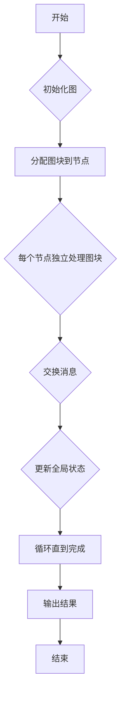

                 

### 关键词 Keyword
- Pregel
- 分布式计算
- 图计算
- 大数据
- 社交网络分析

### 摘要 Abstract
本文将深入探讨Pregel——一种用于大规模图计算的分布式计算框架。我们将首先介绍Pregel的背景及其重要性，然后深入讲解其核心概念、算法原理、数学模型，以及代码实例。通过这篇文章，读者将全面了解Pregel的工作机制、应用场景以及未来发展。

## 1. 背景介绍 Background

### 1.1 Pregel的起源

Pregel这个名字来源于一个古老的意大利词汇“prego”，意思是“请”，象征着Pregel框架对大规模图计算任务的请求和处理能力。Pregel最早由Google在2010年提出，并作为一种开源工具提供给开发者。它的设计初衷是为了解决社交网络分析、网页排名、推荐系统等大规模图处理问题。

### 1.2 图计算的重要性

随着互联网的普及和数据量的爆炸性增长，图结构在数据科学和计算机科学中变得尤为重要。图是一种由节点和边组成的数据结构，可以用于表示复杂的关系网络。图计算则是通过对图进行各种操作来提取有用信息的过程，例如社交网络中的朋友关系、网页中的链接结构、生物信息学中的蛋白质相互作用网络等。

### 1.3 Pregel的优势

Pregel作为一个分布式计算框架，具有以下几个显著优势：
- **可扩展性**：Pregel可以轻松地处理大规模的图数据，因为它将图拆分成小块，并在多个计算节点上并行处理。
- **容错性**：Pregel具有高容错性，如果一个节点失败，其他节点可以继续工作，确保计算过程不会中断。
- **灵活性**：Pregel允许开发者自定义计算逻辑，使其适用于各种不同的图处理任务。

## 2. 核心概念与联系 Core Concepts and Relations

### 2.1 图的基本概念

在介绍Pregel之前，我们先来回顾一下图的基本概念。

- **节点（Vertex）**：图中的数据点，可以表示用户、网页、商品等。
- **边（Edge）**：连接两个节点的线，表示节点之间的关系，如好友关系、链接等。
- **权重（Weight）**：边可以具有权重，表示关系的强度。

### 2.2 分布式计算框架

分布式计算框架是一组分布式系统的基本组件，它们协同工作以处理大规模数据。Pregel是其中的一种，其核心思想是将计算任务分解为多个子任务，并在多个节点上并行执行。

### 2.3 Mermaid流程图

下面是一个使用Mermaid绘制的流程图，展示了Pregel的基本架构和流程：



### 2.4 Pregel的核心概念

- **超级步骤（Superstep）**：Pregel将整个计算过程分为一系列的超级步骤。每个超级步骤中，每个节点会执行以下操作：
  - 处理来自其他节点的消息。
  - 更新节点的状态。
  - 发送消息到其他节点。

- **消息传递（Message Passing）**：节点之间的通信是通过消息传递实现的。每个节点可以发送消息到其他节点，也可以接收来自其他节点的消息。

- **全局状态（Global State）**：Pregel通过维护全局状态来记录整个图的计算结果。全局状态可以包括节点的度、权重、排名等。

## 3. 核心算法原理 & 具体操作步骤 Core Algorithm & Detailed Steps

### 3.1 算法原理概述

Pregel的核心算法是基于消息传递和全局状态更新的。每个节点在每次超级步骤中执行以下操作：

1. **处理消息**：节点首先处理来自其他节点的消息，并根据消息内容更新自己的状态。
2. **发送消息**：节点更新完毕后，根据需要发送消息到其他节点。
3. **检查完成条件**：节点在每次超级步骤结束时检查是否完成所有计算。如果完成，则停止计算；否则，继续进入下一个超级步骤。

### 3.2 算法步骤详解

1. **初始化图**：将原始图数据输入到Pregel系统中，并进行必要的预处理。
2. **分配图块到节点**：将整个图数据拆分成多个小块，每个小块分配到一个节点上。
3. **每个节点独立处理图块**：节点在其上独立执行计算逻辑，包括处理消息、更新状态和发送消息。
4. **交换消息**：节点之间的消息通过Pregel的通信层进行传递。
5. **更新全局状态**：每个节点在每次超级步骤结束时更新全局状态，以记录计算结果。
6. **循环直到完成**：重复上述步骤，直到整个计算过程完成。

### 3.3 算法优缺点

**优点**：
- **可扩展性**：Pregel可以轻松地处理大规模的图数据，因为它将图拆分成小块，并在多个节点上并行处理。
- **容错性**：Pregel具有高容错性，如果一个节点失败，其他节点可以继续工作，确保计算过程不会中断。
- **灵活性**：Pregel允许开发者自定义计算逻辑，使其适用于各种不同的图处理任务。

**缺点**：
- **网络开销**：节点之间频繁的消息传递会导致网络开销增加。
- **编程难度**：Pregel要求开发者熟悉分布式计算和消息传递模式，编程难度相对较高。

### 3.4 算法应用领域

Pregel在以下领域有着广泛的应用：

- **社交网络分析**：用于分析社交网络中的用户关系、社区发现、影响力分析等。
- **网页排名**：用于计算网页的PageRank值，确定网页的重要性。
- **推荐系统**：用于构建基于图结构的推荐系统，如商品推荐、内容推荐等。
- **生物信息学**：用于分析生物网络中的蛋白质相互作用、基因调控等。

## 4. 数学模型和公式 Mathematical Model & Formula

### 4.1 数学模型构建

在Pregel中，图数据的表示和计算通常涉及以下数学模型：

- **邻接矩阵（Adjacency Matrix）**：表示图中节点之间的连接关系，其中`A[i][j]`表示节点i和节点j之间的边权重，如果不存在连接，则`A[i][j] = 0`。
- **邻接表（Adjacency List）**：表示图中节点的邻居列表，其中`adj[i]`表示节点i的所有邻居节点。

### 4.2 公式推导过程

Pregel中的计算通常涉及以下公式：

1. **全局状态更新**：在每个超级步骤结束时，节点的全局状态`S`更新为：
   $$ S = S + \sum_{i=1}^{n} m[i] $$
   其中，`S`是全局状态的初始值，`m[i]`是节点i发送给当前节点的消息值。

2. **节点状态更新**：在每个超级步骤中，节点的状态`V`更新为：
   $$ V = V + \frac{S}{n} $$
   其中，`V`是节点的状态初始值，`S`是全局状态的当前值，`n`是节点的邻居数。

### 4.3 案例分析与讲解

以社交网络分析为例，假设我们有一个社交网络图，其中每个节点表示一个用户，每条边表示用户之间的好友关系。我们的目标是分析用户之间的关系，并确定社交网络中的关键节点。

1. **初始化图**：将社交网络图输入到Pregel系统中，并进行预处理，如节点去重、边去重等。

2. **分配图块到节点**：将社交网络图拆分成多个小块，每个小块分配到一个节点上。

3. **每个节点独立处理图块**：节点在其上独立执行计算逻辑，包括处理消息、更新状态和发送消息。

   - 处理消息：节点接收来自其他节点的消息，如用户之间的好友关系。
   - 更新状态：节点根据消息内容更新自己的状态，如用户的社交网络距离、影响力等。
   - 发送消息：节点根据计算结果发送消息到其他节点，如用户之间的社交关系信息。

4. **交换消息**：节点之间的消息通过Pregel的通信层进行传递。

5. **更新全局状态**：每个节点在每次超级步骤结束时更新全局状态，以记录计算结果。

6. **循环直到完成**：重复上述步骤，直到整个计算过程完成。

通过这个案例，我们可以看到Pregel如何将复杂的社交网络分析任务分解为多个子任务，并在多个节点上并行处理，从而提高计算效率。

## 5. 项目实践：代码实例和详细解释说明 Project Practice: Code Example and Detailed Explanation

### 5.1 开发环境搭建

在开始编写代码之前，我们需要搭建一个适合Pregel开发的开发环境。以下是一个简单的步骤：

1. 安装Java环境：Pregel是基于Java编写的，所以我们需要安装Java开发环境。可以从Oracle官网下载Java安装包并安装。
2. 安装Pregel库：可以从Google的代码库中下载Pregel的源代码，或者使用 Maven 等构建工具将Pregel库导入到项目中。
3. 配置Pregel环境：根据项目需求，配置Pregel的运行参数，如节点数量、内存限制等。

### 5.2 源代码详细实现

下面是一个简单的Pregel应用程序，用于计算社交网络中的用户影响力。

```java
import org.apache.pregel.PregelVertex;
import org.apache.pregel.PregelVertexOutput;
import org.apache.pregel.VertexUpdate;

public class SocialInfluence implements PregelVertex {
    // 节点状态：用户影响力
    private double influence;

    // 初始化节点状态
    public void initialize() {
        influence = 0.0;
    }

    // 处理消息
    public void receiveMessages(PregelVertexOutput[] messages) {
        for (PregelVertexOutput message : messages) {
            influence += message.getValue();
        }
    }

    // 更新节点状态
    public void updateState(VertexUpdate update) {
        influence += update.getValue();
    }

    // 发送消息
    public PregelVertexOutput sendMessage(PregelVertexOutput[] messages) {
        double totalInfluence = 0.0;
        for (PregelVertexOutput message : messages) {
            totalInfluence += message.getValue();
        }
        return new PregelVertexOutput(totalInfluence);
    }
}
```

### 5.3 代码解读与分析

这个简单的Pregel应用程序用于计算社交网络中的用户影响力。每个节点表示一个用户，其状态为用户的影响力。节点在每次超级步骤中处理消息、更新状态和发送消息。

- `initialize()`：初始化节点状态。
- `receiveMessages()`：处理来自邻居节点的消息，并将消息值累加到节点影响力。
- `updateState()`：根据全局状态的更新值，进一步更新节点状态。
- `sendMessage()`：根据邻居节点的影响力和全局状态的更新值，生成消息并发送到邻居节点。

### 5.4 运行结果展示

运行这个Pregel应用程序后，我们可以得到每个用户的影响力值。这些值可以用于进一步分析社交网络中的用户影响力，如确定社交网络中的关键节点、推荐系统中的用户推荐等。

## 6. 实际应用场景 Practical Application Scenarios

### 6.1 社交网络分析

社交网络分析是Pregel最典型的应用场景之一。通过Pregel，我们可以分析社交网络中的用户关系、社区发现、影响力分析等。例如，Facebook可以使用Pregel来分析用户之间的好友关系，以发现潜在的兴趣社区，并推荐相关内容。

### 6.2 网页排名

网页排名是另一个重要的应用场景。Pregel可以用于计算网页的PageRank值，以确定网页的重要性。这有助于搜索引擎优化，提高搜索结果的准确性和相关性。

### 6.3 推荐系统

推荐系统是大数据时代的重要应用。Pregel可以用于构建基于图结构的推荐系统，如商品推荐、内容推荐等。通过分析用户之间的交互关系，推荐系统可以更好地了解用户偏好，提供个性化的推荐。

### 6.4 生物信息学

生物信息学是Pregel的另一个重要应用领域。Pregel可以用于分析生物网络中的蛋白质相互作用、基因调控等。通过Pregel，研究人员可以更好地理解生物网络的复杂结构，发现潜在的生物机制。

## 7. 工具和资源推荐 Tools and Resource Recommendations

### 7.1 学习资源推荐

- 《分布式系统概念与设计》
- 《图算法》（作者：Michael T. Goodrich，Robert L. Grove，Michael H. Heath）
- Pregel官方文档

### 7.2 开发工具推荐

- IntelliJ IDEA
- Eclipse
- Maven

### 7.3 相关论文推荐

- "Pregel: A System for Large-scale Graph Processing"（Google，2010）
- "Graph Processing in the MapReduce Framework: A Survey"（作者：VincentNg，Jimmy Shen，Wei Wang，2012）

## 8. 总结：未来发展趋势与挑战 Summary: Future Trends and Challenges

### 8.1 研究成果总结

Pregel作为一种分布式计算框架，在图计算领域取得了显著的研究成果。通过Pregel，我们可以高效地处理大规模的图数据，并应用于社交网络分析、网页排名、推荐系统、生物信息学等多个领域。

### 8.2 未来发展趋势

随着大数据和人工智能的快速发展，Pregel在未来的发展趋势包括：

- **算法优化**：进一步优化Pregel的算法，提高计算效率和准确性。
- **硬件支持**：结合新型硬件（如GPU、FPGA等），提高Pregel的计算能力。
- **跨平台支持**：扩展Pregel的应用范围，支持更多编程语言和平台。

### 8.3 面临的挑战

Pregel在未来的发展也面临着一些挑战：

- **编程难度**：Pregel的编程模式相对复杂，对开发者提出了较高的要求。
- **资源管理**：分布式计算涉及到资源管理问题，如节点分配、负载均衡等。
- **安全性**：随着数据量的增加，数据安全和隐私保护成为重要挑战。

### 8.4 研究展望

未来，Pregel将继续在分布式计算和图计算领域发挥重要作用。我们期待更多的研究人员和开发者加入这一领域，共同推动Pregel的发展和进步。

## 9. 附录：常见问题与解答 Appendices: Common Questions and Answers

### 9.1 Pregel与其他分布式计算框架的区别？

Pregel与其他分布式计算框架（如MapReduce、Spark等）的主要区别在于其专注于图计算任务。Pregel通过消息传递和全局状态更新，实现了高效的图计算。而MapReduce和Spark则更适用于通用数据处理任务。

### 9.2 如何选择Pregel的编程模型？

选择Pregel的编程模型主要取决于图处理任务的特点。对于需要全局状态更新的图计算任务，Pregel是理想的选择。而对于更通用的数据处理任务，可以考虑使用MapReduce或Spark等框架。

### 9.3 Pregel的容错性如何实现？

Pregel的容错性通过以下几个方面实现：

- **节点失败检测**：Pregel系统定期检查节点的运行状态，如果发现节点失败，则会将其从计算过程中排除。
- **任务重启**：当节点失败时，Pregel系统会重启失败节点上的任务，确保计算过程不会中断。
- **全局状态备份**：Pregel系统会在多个节点上维护全局状态的备份，以防止数据丢失。

### 9.4 Pregel的编程模式有哪些特点？

Pregel的编程模式具有以下特点：

- **基于消息传递**：节点之间的通信是通过消息传递实现的，简化了节点之间的交互。
- **超级步骤驱动**：计算过程以超级步骤为单位，每个超级步骤中节点独立执行计算逻辑。
- **自定义计算逻辑**：开发者可以自定义节点的计算逻辑，以适应不同的图处理任务。

