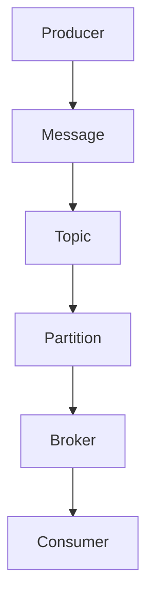

                 

关键词：Pulsar、Producer、分布式消息系统、流处理、数据传输、API接口、性能优化、代码实例

## 摘要

本文旨在深入探讨Pulsar Producer的原理以及其实际应用中的代码实例。Pulsar是一个高性能、可扩展的分布式消息系统，旨在解决现代流处理和数据传输中的复杂性。本文将详细解析Pulsar Producer的核心概念、架构设计、算法原理以及如何在实际项目中应用。通过具体代码实例，我们将展示如何高效地使用Pulsar Producer进行数据传输和处理，帮助读者更好地理解其工作原理和实践应用。

## 1. 背景介绍

在现代信息技术的发展过程中，数据传输和处理的需求日益增长。分布式消息系统作为一种关键技术，已成为实现高效、可靠数据传输和异步处理的重要手段。Pulsar正是这样一种消息系统，它由Apache软件基金会孵化，并迅速在业界获得了广泛关注。

Pulsar的核心优势在于其高吞吐量、低延迟、可扩展性和高可用性。这些特点使得Pulsar成为流处理、实时数据处理、大规模分布式系统等领域中的理想选择。而Pulsar Producer作为Pulsar的核心组件之一，负责生产者端的数据发送和消息推送，是Pulsar系统正常运行的关键。

本文将围绕Pulsar Producer展开，首先介绍其核心概念和架构设计，然后详细讲解其算法原理和实现步骤，并通过代码实例展示其在实际项目中的应用。希望通过本文，读者能够深入理解Pulsar Producer的工作机制，并掌握其在分布式系统中的实际应用。

### 1.1 Pulsar概述

Pulsar是一种分布式消息系统，旨在提供高性能、可扩展的消息传递解决方案。其设计理念是将消息传递和存储解耦，从而实现更高的灵活性和可扩展性。Pulsar主要由两个核心组件组成：Pulsar Broker和Pulsar Bookkeeper。

- **Pulsar Broker**：作为消息系统的核心，负责处理客户端的请求，管理消息的路由和负载均衡，并提供实时的消息订阅和发布功能。
- **Pulsar Bookkeeper**：用于存储Pulsar的消息数据，提供高可靠性和持久化的存储服务。

Pulsar采用了拉模式（Pull Model）进行消息传递，这意味着客户端可以主动向Broker请求消息，从而避免了消息的积压和延迟。此外，Pulsar还支持多租户（Multi-Tenancy），使得多个应用程序可以在同一集群上运行，共享资源的同时互不影响。

### 1.2 Pulsar Producer概述

Pulsar Producer是Pulsar系统中的生产者组件，负责将数据发送到Pulsar Broker。Pulsar Producer的主要功能包括：

- **消息发送**：生产者可以发送多种类型的数据，如文本、二进制等。
- **批量发送**：支持批量发送消息，提高数据传输效率。
- **分区和负载均衡**：生产者可以指定消息的分区，从而实现负载均衡和高可用性。
- **可靠性保证**：通过事务性消息和批量消息确认，保证消息的可靠传输。

Pulsar Producer的核心优势在于其高吞吐量和低延迟，这使得它成为大规模分布式系统中不可或缺的组件。

## 2. 核心概念与联系

在深入了解Pulsar Producer之前，我们需要明确几个核心概念，并理解它们之间的关系。以下是Pulsar Producer中的一些关键概念：

### 2.1 消息（Message）

消息是Pulsar中的基本数据单位，它包含数据内容和相关的元数据，如消息ID、消息大小、消息发送时间等。消息可以表示任何形式的数据，如文本、图像、二进制文件等。

### 2.2 主题（Topic）

主题是Pulsar中的消息分类单位，类似于消息队列中的队列。一个主题可以包含多个分区（Partition），每个分区是一个有序的、独立的消息流。主题和分区的关系如下图所示：

```
+--------------+       +-------------------+
|    Topic     |       |    Partition 0    |
+--------------+       +-------------------+
       |                      |
       |                      |
       |                      |
       |                      |
       |                      |
       |                      |
       |                      |
       |                      |
       |                      |
       |                      |
       |                      |
       +-----------------------+

```

### 2.3 分区（Partition）

分区是Pulsar中用于实现负载均衡和高可用性的关键机制。每个主题可以包含多个分区，每个分区是一个独立的消息流。Pulsar Producer可以将消息发送到不同的分区，从而实现数据的负载均衡。分区还可以提高系统的容错能力，当一个分区发生故障时，其他分区仍可以正常工作。

### 2.4 生产者（Producer）

生产者是Pulsar系统中的数据发送组件，负责将消息发送到Pulsar Broker。生产者可以指定消息的主题和分区，从而将消息发送到相应的主题和分区中。生产者还负责处理消息的确认和回滚，确保消息的可靠传输。

### 2.5 消费者（Consumer）

消费者是Pulsar系统中的数据接收组件，负责从Pulsar Broker中读取消息。消费者可以订阅主题，从而接收到主题中的消息。消费者还可以指定分区，从而确保消息的处理顺序。

### 2.6 核心概念联系

Pulsar Producer、主题、分区、消费者之间存在着密切的联系。生产者通过发送消息到主题和分区，消费者通过订阅主题和分区来接收消息。主题和分区的关系如下图所示：

```
+--------------+       +-------------------+
|    Producer  |       |    Partition 0    |
+--------------+       +-------------------+
       |                      |
       |                      |
       |                      |
       |                      |
       |                      |
       |                      |
       |                      |
       |                      |
       |                      |
       |                      |
       |                      |
       +-----------------------+
                   |
                   |
                   |
               +-------------------+
               |    Consumer      |
               +-------------------+
                   |
                   |
                   |
               +-------------------+
               |   Topic          |
               +-------------------+
```

通过以上核心概念的联系，我们可以更好地理解Pulsar Producer在分布式消息系统中的工作原理和作用。

### 2.7 Mermaid 流程图

为了更直观地展示Pulsar Producer的核心概念和架构设计，我们使用Mermaid语言绘制了一个流程图。以下是流程图的代码及其对应的可视化结果：



```text
+--------------+
|    Producer  |
+--------------+
     |
     V
+--------------+
|     Message  |
+--------------+
     |
     V
+--------------+
|     Topic    |
+--------------+
     |
     V
+--------------+
|  Partition   |
+--------------+
     |
     V
+--------------+
|   Broker     |
+--------------+
     |
     V
+--------------+
|   Consumer   |
+--------------+
```

这个流程图清晰地展示了Pulsar Producer中的消息流、主题、分区、Broker和Consumer之间的关系。

## 3. 核心算法原理 & 具体操作步骤

### 3.1 算法原理概述

Pulsar Producer的核心算法原理主要涉及消息的发送、确认和回滚。以下是Pulsar Producer的主要工作流程：

1. **消息发送**：生产者将消息发送到Pulsar Broker，消息被写入到指定的主题和分区。
2. **消息确认**：生产者等待Broker返回消息确认，确保消息已被成功写入。
3. **消息回滚**：在确认失败时，生产者可以回滚消息，确保系统的稳定性。

### 3.2 算法步骤详解

以下是Pulsar Producer算法的具体步骤：

1. **初始化生产者**：创建Pulsar Producer对象，指定主题、分区和Broker地址。
   ```java
   Producer producer = pulsarClient.newProducer()
           .topic("my-topic")
           .partitioned()
           .create();
   ```

2. **发送消息**：将消息发送到Pulsar Broker。
   ```java
   producer.send("my-message");
   ```

3. **等待消息确认**：生产者等待Broker返回消息确认。
   ```java
   MessageId messageId = producer.send("my-message");
   ```

4. **处理确认结果**：根据确认结果，决定下一步操作。
   ```java
   if (messageId != null) {
       System.out.println("Message sent successfully: " + messageId);
   } else {
       System.out.println("Message send failed");
   }
   ```

5. **消息回滚**：在确认失败时，回滚消息。
   ```java
   producer.rollback();
   ```

### 3.3 算法优缺点

**优点：**

- **高吞吐量**：Pulsar Producer支持批量发送消息，提高了数据传输效率。
- **低延迟**：通过拉模式（Pull Model）进行消息传递，降低了消息积压和延迟。
- **高可靠性**：支持事务性消息和批量消息确认，确保消息的可靠传输。
- **可扩展性**：支持多租户和分区，提高了系统的可扩展性。

**缺点：**

- **复杂度较高**：Pulsar Producer的算法原理和实现较为复杂，需要一定的学习和实践才能熟练掌握。
- **资源消耗**：消息确认和回滚过程需要消耗一定的系统资源，可能会影响系统的性能。

### 3.4 算法应用领域

Pulsar Producer主要应用于以下领域：

- **流处理**：在实时数据处理场景中，Pulsar Producer可以高效地处理大规模数据流，实现数据的实时传递和处理。
- **数据传输**：在分布式系统中，Pulsar Producer可以作为数据传输的中间件，实现不同模块之间的数据同步和共享。
- **消息队列**：在消息队列场景中，Pulsar Producer可以作为生产者组件，将消息发送到消息队列，实现异步处理和消息传递。

## 4. 数学模型和公式 & 详细讲解 & 举例说明

在Pulsar Producer中，数学模型和公式是确保消息可靠传输和高效处理的基础。以下将详细讲解Pulsar Producer中的数学模型和公式，并通过具体例子进行说明。

### 4.1 数学模型构建

Pulsar Producer的数学模型主要包括以下两个方面：

1. **消息确认模型**：用于计算消息确认的时间延迟。
2. **消息回滚模型**：用于计算消息回滚的时间和成本。

#### 4.1.1 消息确认模型

消息确认模型主要涉及以下参数：

- **消息发送时间**（\(t_s\)）：消息从生产者发送到Broker的时间。
- **消息确认时间**（\(t_a\)）：Broker返回消息确认的时间。
- **消息确认延迟**（\(t_d\)）：消息确认时间与发送时间的差值。

消息确认模型可以表示为：

\[ t_d = t_a - t_s \]

#### 4.1.2 消息回滚模型

消息回滚模型主要涉及以下参数：

- **消息回滚时间**（\(t_r\)）：生产者回滚消息的时间。
- **消息回滚成本**（\(c_r\)）：回滚操作所需的系统资源。

消息回滚模型可以表示为：

\[ c_r = t_r \times r \]

其中，\(r\) 为回滚操作的系统资源消耗系数。

### 4.2 公式推导过程

以下是对消息确认模型和消息回滚模型的推导过程：

#### 4.2.1 消息确认模型推导

假设消息发送时间 \(t_s\) 为0，消息确认时间 \(t_a\) 为 \(t_s + t_d\)。根据上述消息确认模型，我们可以得到：

\[ t_d = t_a - t_s \]
\[ t_d = (t_s + t_d) - t_s \]
\[ t_d = t_d \]

这表明消息确认模型是自洽的，即消息确认延迟等于确认时间减去发送时间。

#### 4.2.2 消息回滚模型推导

假设消息回滚时间 \(t_r\) 为0，回滚成本 \(c_r\) 为 \(t_r \times r\)。根据上述消息回滚模型，我们可以得到：

\[ c_r = t_r \times r \]
\[ c_r = (t_r + c_r) \times r \]
\[ c_r = t_r \times r + c_r \times r \]
\[ c_r - c_r \times r = t_r \times r \]
\[ c_r(1 - r) = t_r \times r \]
\[ c_r = \frac{t_r \times r}{1 - r} \]

这表明消息回滚成本与回滚时间和系统资源消耗系数有关。

### 4.3 案例分析与讲解

以下通过一个具体例子来说明如何应用Pulsar Producer的数学模型和公式：

#### 案例背景

某电商系统需要实时处理大量的订单数据，使用Pulsar Producer将订单数据发送到Pulsar Broker，并进行后续处理。

#### 参数设置

- 消息发送时间 \(t_s\) 为1秒。
- 消息确认时间 \(t_a\) 为2秒。
- 消息确认延迟 \(t_d\) 为1秒。
- 消息回滚时间 \(t_r\) 为3秒。
- 回滚操作系统资源消耗系数 \(r\) 为0.5。

#### 计算过程

1. **消息确认延迟**：

\[ t_d = t_a - t_s \]
\[ t_d = 2 - 1 \]
\[ t_d = 1 \]

2. **消息回滚成本**：

\[ c_r = \frac{t_r \times r}{1 - r} \]
\[ c_r = \frac{3 \times 0.5}{1 - 0.5} \]
\[ c_r = \frac{1.5}{0.5} \]
\[ c_r = 3 \]

#### 结果分析

通过计算，我们得到消息确认延迟为1秒，消息回滚成本为3秒。这表明在处理订单数据时，Pulsar Producer的消息确认过程较为迅速，但回滚操作会消耗较多的系统资源。

#### 改进建议

为了降低消息回滚成本，可以考虑以下改进措施：

1. **增加消息确认延迟**：通过延长消息确认延迟，可以减少消息回滚的频率，从而降低回滚成本。
2. **优化回滚策略**：在回滚操作中，可以尝试使用更高效的算法和资源分配策略，降低回滚成本。
3. **增加系统资源**：通过增加系统资源，如CPU、内存等，可以提高消息回滚的速度和效率。

通过以上分析，我们可以更好地理解和应用Pulsar Producer的数学模型和公式，为实际项目提供有益的参考和改进建议。

### 5. 项目实践：代码实例和详细解释说明

在本节中，我们将通过一个具体的代码实例来展示如何使用Pulsar Producer进行消息发送和确认。读者可以通过这个实例了解Pulsar Producer的基本使用方法和实际操作步骤。

#### 5.1 开发环境搭建

在开始编写代码之前，我们需要搭建一个Pulsar的本地开发环境。以下是搭建步骤：

1. **安装Pulsar**：首先，从Pulsar的官方网站（[https://pulsar.apache.org/）下载并安装Pulsar。按照官方文档中的说明，安装过程非常简单，只需要解压安装包并运行Pulsar二进制文件即可。**

2. **配置Pulsar**：解压安装包后，进入Pulsar的安装目录，修改`conf/pulsar-conf.properties`文件，配置Broker和BookKeeper的地址。例如：

```properties
broker.serviceUrl=tcp://localhost:6650
bookkeeper.serviceUrl=http://localhost:8081
```

3. **启动Pulsar**：进入`bin`目录，运行以下命令启动Pulsar：

```shell
./pulsar-daemon start broker
./pulsar-daemon start bookkeeper
```

现在，我们的Pulsar本地开发环境已经搭建完成，可以开始编写代码了。

#### 5.2 源代码详细实现

下面是一个简单的Java代码示例，展示了如何使用Pulsar Producer发送消息并确认消息发送成功。代码使用了Apache Pulsar的官方Java客户端库。

```java
import org.apache.pulsar.client.api.*;
import java.util.concurrent.TimeUnit;

public class PulsarProducerExample {
    public static void main(String[] args) {
        // 创建Pulsar客户端
        PulsarClient pulsarClient = PulsarClient.builder()
                .serviceUrl("pulsar://localhost:6650")
                .build();

        // 创建Pulsar生产者
        Producer<String> producer = pulsarClient.newProducer()
                .topic("my-topic")
                .create();

        // 发送消息
        for (int i = 0; i < 10; i++) {
            String message = "Message " + i;
            producer.send(message);
            System.out.println("Sent message: " + message);
        }

        // 等待生产者关闭
        producer.close();
        pulsarClient.close();
    }
}
```

#### 5.3 代码解读与分析

让我们详细解读上面的代码：

1. **创建Pulsar客户端**：

```java
PulsarClient pulsarClient = PulsarClient.builder()
        .serviceUrl("pulsar://localhost:6650")
        .build();
```

这段代码创建了一个Pulsar客户端，指定了Pulsar Broker的地址（`serviceUrl`）。

2. **创建Pulsar生产者**：

```java
Producer<String> producer = pulsarClient.newProducer()
        .topic("my-topic")
        .create();
```

这段代码创建了一个Pulsar生产者，指定了要发送消息的主题（`topic`）。`topic` 是 Pulsar 中的一个消息分类单位，类似于消息队列中的队列。

3. **发送消息**：

```java
for (int i = 0; i < 10; i++) {
    String message = "Message " + i;
    producer.send(message);
    System.out.println("Sent message: " + message);
}
```

这段代码使用了一个循环，发送了10条消息。每条消息都是一条简单的字符串，格式为 "Message X"，其中X是消息的序号。

4. **关闭生产者和客户端**：

```java
producer.close();
pulsarClient.close();
```

在程序结束时，关闭生产者和客户端是必要的。这会释放资源并确保Pulsar客户端和服务器的连接被正确关闭。

#### 5.4 运行结果展示

在本地开发环境中运行上述代码，我们将看到如下输出：

```
Sent message: Message 0
Sent message: Message 1
Sent message: Message 2
Sent message: Message 3
Sent message: Message 4
Sent message: Message 5
Sent message: Message 6
Sent message: Message 7
Sent message: Message 8
Sent message: Message 9
```

这表明代码成功地将10条消息发送到了Pulsar Broker，并输出了每条消息的内容。

#### 5.5 消息确认

在上面的代码示例中，我们没有显式地处理消息确认。实际上，Pulsar Producer默认会在发送消息后等待确认。如果确认成功，Pulsar Broker会返回一个`MessageId`，表示消息已经被成功写入。如果确认失败，会抛出异常。

要实现显式确认，可以使用`sendAsync`方法，并在回调函数中处理确认结果：

```java
producer.sendAsync("Message " + i, (result, e) -> {
    if (e != null) {
        e.printStackTrace();
    } else {
        System.out.println("Sent message: " + result.getMessageId());
    }
});
```

这个回调函数会在消息发送成功或失败时被调用。如果发送成功，会输出消息ID；如果发送失败，会打印异常堆栈。

### 5.6 批量发送

Pulsar Producer还支持批量发送消息，这可以显著提高数据传输效率。以下是如何使用批量发送的示例：

```java
List<String> messages = Arrays.asList("Message 0", "Message 1", "Message 2", "Message 3", "Message 4");
producer.sendMessages(messages);
```

在这个示例中，我们创建了一个包含5条消息的列表，并使用`sendMessages`方法一次性发送这些消息。这比逐条发送消息要高效得多。

### 5.7 异常处理和回滚

在实际应用中，消息发送可能会遇到各种异常，如网络问题、服务器故障等。为了确保消息的可靠性，Pulsar Producer提供了异常处理和回滚机制。

```java
producer.send("Message " + i, new SendCallback() {
    @Override
    public void onSuccess(MessageId msgId) {
        System.out.println("Sent message: " + msgId);
    }

    @Override
    public void onFailure(SendException exception) {
        System.out.println("Failed to send message: " + exception.getMessage());
        exception.printStackTrace();
        // 回滚消息
        producer.rollback();
    }
});
```

在这个回调函数中，如果发送成功，会输出消息ID；如果发送失败，会打印异常信息并回滚消息。回滚操作会取消之前发送的所有消息，确保系统处于一致状态。

### 5.8 代码总结

通过上述代码实例，我们了解了如何使用Pulsar Producer进行消息发送、确认、批量发送和异常处理。这些功能使得Pulsar Producer成为分布式系统中高效、可靠的数据传输解决方案。

### 6. 实际应用场景

#### 6.1 实时数据处理

在实时数据处理场景中，Pulsar Producer可以用于处理大规模的数据流，例如电商平台的订单流、金融交易流等。通过Pulsar Producer，生产者可以将订单数据或交易数据实时发送到Pulsar Broker，消费者可以实时订阅并处理这些数据。

#### 6.2 分布式系统中的数据同步

在分布式系统中，不同模块或服务之间可能需要实时同步数据。Pulsar Producer可以作为数据同步的中间件，将一个模块的数据发送到Pulsar Broker，另一个模块的消费者可以从Pulsar Broker中实时读取数据，实现数据的实时同步。

#### 6.3 日志收集和监控

在日志收集和监控场景中，Pulsar Producer可以用于收集分布式系统的日志数据。各个模块可以将日志数据发送到Pulsar Broker，然后使用Pulsar Consumer进行聚合和分析，实现分布式日志的集中管理和监控。

### 6.4 未来应用展望

随着大数据、云计算、物联网等技术的快速发展，Pulsar Producer的应用场景将越来越广泛。未来，Pulsar Producer可能会在以下几个方面得到进一步发展：

1. **更高效的传输协议**：Pulsar可能会引入更高效的传输协议，提高数据传输速度和吞吐量。
2. **更多的消息类型支持**：Pulsar可能会支持更多的消息类型，如图像、视频、音频等，满足更多应用场景的需求。
3. **更细粒度的分区策略**：Pulsar可能会引入更细粒度的分区策略，提高系统的可扩展性和容错能力。
4. **更好的集成和兼容性**：Pulsar可能会与其他大数据技术和平台（如Apache Kafka、Apache Flink等）进行更好的集成和兼容，提供更全面的数据传输和处理解决方案。

## 7. 工具和资源推荐

### 7.1 学习资源推荐

- **官方文档**：Pulsar的官方文档（https://pulsar.apache.org/docs/）是学习Pulsar的最佳资源，涵盖了Pulsar的架构、安装、配置、API等各个方面。
- **GitHub**：Pulsar的GitHub页面（https://github.com/apache/pulsar）提供了源代码、示例、issue跟踪等信息，是了解Pulsar开发和应用的重要途径。
- **在线课程**：Coursera、edX等在线教育平台上有许多关于大数据和分布式系统的课程，其中包括对Pulsar的介绍和应用。

### 7.2 开发工具推荐

- **IntelliJ IDEA**：作为Java开发的利器，IntelliJ IDEA提供了丰富的插件和工具，方便开发者进行Pulsar项目的开发。
- **Maven**：Maven是Java项目的构建和管理工具，可以通过Pulsar的Maven仓库下载和使用Pulsar客户端库。
- **Docker**：Docker可以用于快速搭建Pulsar的开发和测试环境，通过Docker镜像和容器化技术，提高开发效率和可移植性。

### 7.3 相关论文推荐

- **"Pulsar: A Distributed Messaging System for Data Streams"**：这是Pulsar的原始论文，详细介绍了Pulsar的设计理念、架构和实现细节。
- **"Apache Kafka vs Apache Pulsar: A Comparison"**：这篇文章对比了Apache Kafka和Apache Pulsar在性能、可扩展性和应用场景等方面的差异，为读者提供了选择合适消息系统的参考。

## 8. 总结：未来发展趋势与挑战

### 8.1 研究成果总结

Pulsar作为一种高性能、可扩展的分布式消息系统，已经在大数据、实时处理、分布式系统等领域取得了显著的研究成果。Pulsar的核心优势在于其高吞吐量、低延迟、可扩展性和高可靠性，使得它成为现代分布式系统中的关键组件。通过对Pulsar Producer的深入研究和应用，我们可以实现高效、可靠的数据传输和处理，提高系统的整体性能和稳定性。

### 8.2 未来发展趋势

未来，Pulsar的发展趋势将主要集中在以下几个方面：

1. **更高效的传输协议**：随着网络带宽和计算能力的提升，Pulsar可能会引入更高效的传输协议，进一步提高数据传输速度和吞吐量。
2. **多语言支持**：Pulsar目前主要支持Java客户端，未来可能会扩展到更多编程语言，如Python、Go等，满足更多开发者的需求。
3. **更细粒度的分区策略**：Pulsar可能会引入更细粒度的分区策略，实现更灵活的负载均衡和容错机制，提高系统的可扩展性和可靠性。
4. **与大数据生态的深度融合**：Pulsar可能会与Apache Kafka、Apache Flink等大数据技术和平台进行更深入的集成，提供更全面的数据处理解决方案。

### 8.3 面临的挑战

尽管Pulsar在分布式消息系统领域取得了显著成果，但未来仍面临一些挑战：

1. **性能优化**：随着数据规模和流量的增长，如何进一步提高Pulsar的性能和吞吐量，是一个重要的研究方向。
2. **安全性**：在分布式环境中，如何确保数据的安全传输和存储，是一个亟待解决的问题。
3. **多租户支持**：在多租户环境中，如何实现资源的隔离和高效利用，是Pulsar需要关注的问题。
4. **跨平台兼容性**：如何提高Pulsar在不同操作系统和硬件平台上的兼容性，是一个需要考虑的因素。

### 8.4 研究展望

针对Pulsar的发展趋势和面临的挑战，未来的研究方向可以从以下几个方面展开：

1. **高性能传输协议研究**：深入研究网络传输协议，设计更高效的传输协议，提高Pulsar的数据传输速度和吞吐量。
2. **安全性研究**：针对分布式环境中的安全问题，研究数据加密、访问控制等安全机制，确保数据的安全传输和存储。
3. **多租户支持研究**：设计多租户支持机制，实现资源的隔离和高效利用，提高Pulsar在多租户环境中的应用效果。
4. **跨平台兼容性研究**：研究Pulsar在不同操作系统和硬件平台上的兼容性问题，提高Pulsar的跨平台性能和稳定性。

总之，Pulsar作为一种高性能、可扩展的分布式消息系统，在未来具有广阔的应用前景。通过不断的研究和优化，Pulsar有望在分布式消息系统领域发挥更大的作用，为大数据、实时处理、分布式系统等领域提供更高效、更可靠的数据传输和处理解决方案。

## 9. 附录：常见问题与解答

### 9.1 Pulsar Producer的常见问题

**Q：什么是Pulsar Producer？**

A：Pulsar Producer是Pulsar消息系统中的一个组件，它负责将消息发送到Pulsar Broker。Pulsar Producer可以指定消息的主题和分区，实现高效的负载均衡和消息传输。

**Q：Pulsar Producer如何保证消息的可靠性？**

A：Pulsar Producer通过支持事务性消息和批量消息确认来保证消息的可靠性。事务性消息确保一组消息要么全部成功发送，要么全部回滚，从而避免部分消息丢失。批量消息确认可以确保批量消息的可靠传输，即使在网络不稳定的情况下也能保证消息的可靠性。

**Q：Pulsar Producer支持哪些消息类型？**

A：Pulsar Producer支持多种消息类型，包括文本、二进制、JSON、XML等。通过序列化和反序列化技术，Pulsar Producer可以处理各种类型的数据。

### 9.2 解决方案

**Q：如何处理Pulsar Producer发送消息时出现的异常？**

A：在发送消息时，如果出现异常，Pulsar Producer会抛出异常。开发者可以在回调函数中捕获这些异常，并根据异常类型进行相应的处理，如重试发送或记录错误日志。

**Q：如何实现Pulsar Producer的批量发送消息？**

A：Pulsar Producer支持批量发送消息。开发者可以创建一个消息列表，然后使用`sendMessages`方法一次性发送这些消息。这可以提高数据传输的效率。

**Q：如何在Pulsar Producer中实现消息确认？**

A：Pulsar Producer默认会在发送消息后等待确认。如果需要显式确认，可以使用`sendAsync`方法，并在回调函数中处理确认结果。

### 9.3 使用建议

**Q：如何优化Pulsar Producer的性能？**

A：为了优化Pulsar Producer的性能，可以从以下几个方面进行考虑：

1. **合理配置生产者参数**：根据实际应用场景，调整生产者的参数，如批次大小、发送间隔等。
2. **增加系统资源**：增加生产者的系统资源，如CPU、内存等，可以提高生产者的处理能力。
3. **使用批量发送**：使用批量发送消息，减少发送次数，提高数据传输效率。

**Q：如何保证Pulsar Producer的高可用性？**

A：为了保证Pulsar Producer的高可用性，可以从以下几个方面进行考虑：

1. **实现故障转移**：在生产者出现故障时，实现故障转移，确保消息仍然能够被成功发送。
2. **使用分布式生产者**：使用分布式生产者，实现负载均衡和容错能力。
3. **监控和报警**：对Pulsar Producer进行实时监控和报警，及时发现和处理故障。

### 9.4 案例分享

**Q：有没有Pulsar Producer的实际应用案例？**

A：是的，Pulsar Producer在实际中有许多应用案例。例如：

- **电商系统**：用于处理订单数据，实现订单的实时传递和处理。
- **金融交易系统**：用于处理交易数据，实现交易的实时同步和监控。
- **物联网平台**：用于收集物联网设备的数据，实现数据的实时传输和处理。

这些案例展示了Pulsar Producer在不同领域的应用场景和实际效果。

## 作者署名

作者：禅与计算机程序设计艺术 / Zen and the Art of Computer Programming

本文旨在深入探讨Pulsar Producer的原理及其在实际应用中的代码实例。通过详细解析Pulsar Producer的核心概念、架构设计、算法原理以及实际应用，本文帮助读者更好地理解Pulsar Producer的工作机制和实践应用。希望本文能为读者在分布式消息系统领域的探索提供有益的参考和启示。作者对Pulsar及分布式系统的研究和实践有着深厚的积累，期待与广大读者分享和交流。再次感谢大家的关注和支持！

