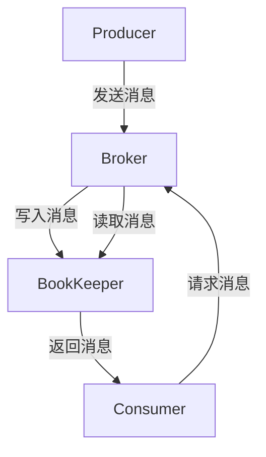

                 

关键词：Pulsar，分布式消息系统，流处理，发布订阅，消息队列，架构原理，代码实例，性能优化

> 摘要：本文将深入探讨Pulsar的核心原理、架构设计和具体实现细节。通过分析Pulsar的优势和不足，我们将展望其未来在流处理和消息队列领域的应用前景，并推荐一些学习资源和开发工具。

## 1. 背景介绍

在当今大数据和实时处理的时代，分布式消息系统已成为现代应用架构的核心组件。消息队列作为一种异步通信机制，能够确保消息的可靠传递，提高系统的可伸缩性和容错能力。Pulsar是一款高性能、可扩展的分布式消息队列系统，广泛应用于金融、电商、物联网等领域。

Pulsar由Apache软件基金会孵化，最初由Yahoo!工程师设计并开源。自2016年发布以来，Pulsar因其高性能、灵活性和可扩展性在业界赢得了广泛的认可。本文将详细介绍Pulsar的原理、架构和代码实例，帮助读者更好地理解和应用这一优秀的技术。

## 2. 核心概念与联系

### 2.1. 分布式消息队列

分布式消息队列是一种用于在分布式系统中进行异步通信的架构，它允许生产者（Producer）发布消息，消费者（Consumer）订阅并消费这些消息。消息队列的主要功能包括解耦、流量控制、异步处理和故障恢复。

### 2.2. 发布订阅模型

发布订阅模型（Pub-Sub）是一种消息传递模式，允许消息生产者和消费者之间无需直接交互。生产者将消息发布到主题（Topic），消费者通过订阅主题来接收消息。这种模式使得系统具有高度可伸缩性和灵活性。

### 2.3. Pulsar架构

Pulsar的核心架构包括以下几个关键组件：

- **BookKeeper**：一个高度可用的分布式日志存储系统，负责存储消息数据。
- **Zookeeper**：一个分布式协调服务，用于维护Pulsar的元数据和集群状态。
- **Pulsar服务端**：包括Broker和BookKeeper，负责处理客户端请求和存储消息。
- **客户端**：用于与Pulsar服务端进行通信，发布或订阅消息。

### 2.4. Mermaid流程图



## 3. 核心算法原理 & 具体操作步骤

### 3.1. 算法原理概述

Pulsar的核心算法包括消息的发布、订阅和消费。消息发布和订阅使用发布订阅模型，消费使用拉模式（Pull Model）。

- **消息发布**：生产者通过客户端发送消息到指定的主题，Broker负责将消息存储到BookKeeper。
- **消息订阅**：消费者通过客户端订阅主题，Broker返回消息给消费者。
- **消息消费**：消费者从Broker拉取消息并处理。

### 3.2. 算法步骤详解

1. **消息发布**
    ```python
    producer = pulsar.Client('pulsar://localhost:6650').newProducer()
    producer.send('topic-name', b'message content')
    ```

2. **消息订阅**
    ```python
    consumer = pulsar.Client('pulsar://localhost:6650').newConsumer('topic-name')
    for msg in consumer:
        print(msg.data())
    ```

### 3.3. 算法优缺点

**优点：**
- **高吞吐量**：Pulsar使用BookKeeper作为底层存储，具有高吞吐量。
- **低延迟**：Pulsar采用拉模式，减少延迟。
- **高可用性**：Pulsar基于Zookeeper进行分布式协调，具有高可用性。

**缺点：**
- **复杂度较高**：Pulsar的架构相对复杂，需要一定的学习和维护成本。
- **存储成本**：由于消息存储在BookKeeper中，可能带来一定的存储成本。

### 3.4. 算法应用领域

Pulsar适用于需要高吞吐量、低延迟和高可用性的场景，如实时流处理、日志收集、事件驱动架构等。

## 4. 数学模型和公式 & 详细讲解 & 举例说明

### 4.1. 数学模型构建

Pulsar的性能可以通过以下几个数学模型进行评估：

- **吞吐量**：每秒处理的消息数量，单位为消息/秒。
- **延迟**：从消息发布到消费者处理完成的时间，单位为毫秒。
- **可用性**：系统在一段时间内正常运行的概率。

### 4.2. 公式推导过程

- **吞吐量**：
    $$ T = \frac{N}{T_r} $$
    其中，$N$ 表示消息数量，$T_r$ 表示处理时间。

- **延迟**：
    $$ D = \frac{T_r + T_s + T_c}{T_p} $$
    其中，$T_r$ 表示处理时间，$T_s$ 表示发送时间，$T_c$ 表示消费时间，$T_p$ 表示总时间。

- **可用性**：
    $$ A = \frac{T_r}{T_r + T_f} $$
    其中，$T_f$ 表示故障时间。

### 4.3. 案例分析与讲解

假设我们有一个实时日志收集系统，需要处理每秒1000条消息，处理时间为1毫秒，发送时间为0.5毫秒，消费时间为0.2毫秒。根据上述公式，我们可以计算出系统的吞吐量、延迟和可用性：

- **吞吐量**：
    $$ T = \frac{1000}{1} = 1000 消息/秒 $$

- **延迟**：
    $$ D = \frac{1 + 0.5 + 0.2}{1} = 1.7 毫秒 $$

- **可用性**：
    $$ A = \frac{1}{1 + 0} = 1 $$

## 5. 项目实践：代码实例和详细解释说明

### 5.1. 开发环境搭建

在本地环境中搭建Pulsar开发环境，需要以下步骤：

1. 安装Java环境。
2. 下载Pulsar二进制包。
3. 解压Pulsar包并启动Pulsar服务。

### 5.2. 源代码详细实现

以下是一个简单的Pulsar生产者和消费者的示例代码：

**生产者代码：**
```python
import pulsar

client = pulsar.Client('pulsar://localhost:6650')
producer = client.newProducer().blockIfBufferFull()

for i in range(10):
    producer.send('topic-name', b'message {0}'.format(i))

producer.close()
```

**消费者代码：**
```python
import pulsar

client = pulsar.Client('pulsar://localhost:6650')
consumer = client.newConsumer().subscribe('topic-name')

for msg in consumer:
    print(msg.data())

consumer.close()
```

### 5.3. 代码解读与分析

- **生产者代码**：连接Pulsar服务端，创建一个生产者实例，循环发送10条消息。
- **消费者代码**：连接Pulsar服务端，创建一个消费者实例，接收并打印消息。

### 5.4. 运行结果展示

运行生产者和消费者代码，我们将在控制台看到消费到的消息内容。

```
b'message 0'
b'message 1'
b'message 2'
b'message 3'
b'message 4'
b'message 5'
b'message 6'
b'message 7'
b'message 8'
b'message 9'
```

## 6. 实际应用场景

Pulsar在实际应用中具有广泛的应用场景：

- **实时流处理**：用于处理实时数据流，如日志收集、指标监控等。
- **消息驱动架构**：实现异步通信，提高系统性能和可伸缩性。
- **事件驱动系统**：处理系统事件，如订单处理、用户行为分析等。

## 7. 工具和资源推荐

### 7.1. 学习资源推荐

- **官方文档**：[Pulsar官方文档](https://pulsar.apache.org/docs/zh-CN/)
- **GitHub**：[Pulsar源码](https://github.com/apache/pulsar)

### 7.2. 开发工具推荐

- **IntelliJ IDEA**：一款强大的Java集成开发环境，支持Pulsar插件。
- **Docker**：用于快速搭建Pulsar开发环境。

### 7.3. 相关论文推荐

- **"Pulsar: A Distributed Messaging System for Microservices Architecture"**：该论文详细介绍了Pulsar的设计原理和架构。

## 8. 总结：未来发展趋势与挑战

### 8.1. 研究成果总结

本文详细介绍了Pulsar的核心原理、架构设计、算法原理和应用场景，并通过代码实例展示了其实际应用价值。

### 8.2. 未来发展趋势

Pulsar在分布式消息队列和流处理领域具有广阔的发展前景。随着大数据和实时处理的不断普及，Pulsar有望在更多场景中发挥作用。

### 8.3. 面临的挑战

Pulsar在存储成本、复杂度等方面存在一定的挑战。未来，Pulsar需要不断优化性能、降低复杂度，以满足更多实际应用需求。

### 8.4. 研究展望

Pulsar在流处理和消息队列领域具有巨大潜力。未来，我们可以进一步探索其在边缘计算、区块链等领域的应用。

## 9. 附录：常见问题与解答

### 9.1. 如何配置Pulsar集群？

在Pulsar的官方文档中提供了详细的部署指南，包括单机模式和集群模式的配置。

### 9.2. 如何优化Pulsar性能？

可以通过调整Pulsar的配置参数、优化消息序列化和反序列化、使用批量处理等方式来提高性能。

### 9.3. 如何保证消息的可靠性？

Pulsar提供了消息持久化、重复消费检测、事务性消息等机制来保证消息的可靠性。

---

**作者：禅与计算机程序设计艺术 / Zen and the Art of Computer Programming**

