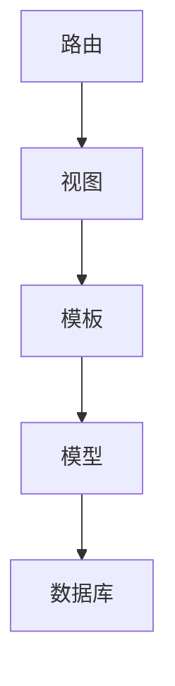
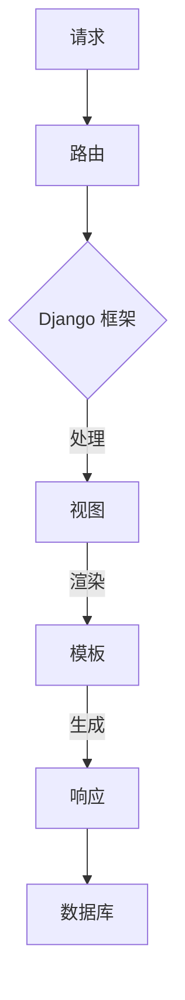
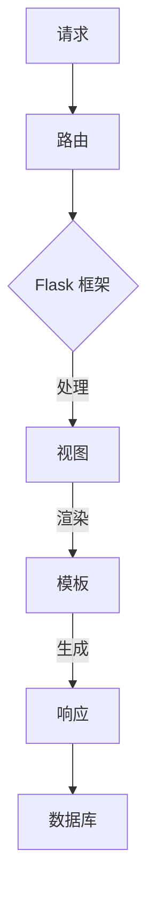
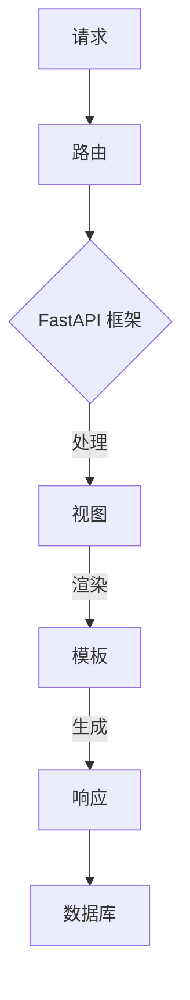

                 

关键词：Python Web 框架，Django，Flask，框架选择，性能优化，应用场景，未来趋势

> 摘要：本文深入探讨 Python Web 框架的选择问题，介绍了 Django 和 Flask 的优缺点，并重点介绍了其他几种常见的 Python Web 框架，如 FastAPI、Tornado、Pyramid 和 Flask-SQLAlchemy。通过对比分析，帮助开发者选择最适合自己的 Web 框架，以优化开发效率和性能。

## 1. 背景介绍

在当今的互联网时代，Web 应用开发已经成为信息技术领域的重要分支。Python 作为一种简单易学且功能强大的编程语言，在 Web 应用开发领域有着广泛的应用。Python Web 框架作为 Web 应用开发的工具，可以帮助开发者快速构建高效的 Web 应用程序。

Python Web 框架种类繁多，其中最为流行的当属 Django 和 Flask。Django 是一种高度全栈的 Web 框架，强调“不要重复自己”（DRY）的原则，提供了丰富的内置功能，使得开发者可以专注于业务逻辑的实现。而 Flask 则是一种轻量级的 Web 框架，以简单和灵活著称，让开发者可以自由地组合各种扩展组件来构建应用程序。

然而，随着 Web 应用需求的不断变化，开发者们对于 Web 框架的选择也有了更高的要求。除了 Django 和 Flask 之外，本文将介绍其他几种常见的 Python Web 框架，帮助开发者找到更适合自己项目的框架。

## 2. 核心概念与联系

### 2.1 Web 框架的定义

Web 框架是一种软件框架，用于简化 Web 应用程序的开发过程。它提供了一系列预定义的组件和功能，帮助开发者快速构建 Web 应用程序。Web 框架通常包括以下核心组成部分：

- **路由（Routing）**：用于处理客户端请求并转发到相应的处理函数。
- **视图（Views）**：处理客户端请求，生成响应的数据。
- **模板（Templates）**：用于生成 Web 页面，通常包含 HTML、CSS 和 JavaScript。
- **模型（Models）**：用于表示数据库中的数据结构，并与数据库进行交互。
- **数据库（Database）**：用于存储和管理应用程序的数据。

### 2.2 Web 框架之间的联系

不同的 Web 框架虽然在功能实现上有所不同，但它们的核心目标都是为了简化 Web 应用程序的开发过程。以下是几种常见的 Python Web 框架的 Mermaid 流程图，展示了它们的基本架构和核心组件：









## 3. 核心算法原理 & 具体操作步骤

### 3.1 算法原理概述

Web 框架的核心算法主要包括路由算法、视图处理算法和模板渲染算法。这些算法共同协作，实现了客户端请求到服务器响应的整个流程。

- **路由算法**：用于处理客户端请求，将其映射到相应的处理函数。常见的路由算法包括基于正则表达式的路由算法和基于哈希的路由算法。
- **视图处理算法**：负责处理客户端请求，生成响应的数据。视图处理算法通常包括请求参数解析、业务逻辑处理和响应数据生成等步骤。
- **模板渲染算法**：用于生成 Web 页面，将响应数据与模板进行结合，生成最终的 HTML 页面。

### 3.2 算法步骤详解

以下是一个简化的 Web 框架算法步骤：

1. **客户端请求**：用户通过浏览器发送 HTTP 请求到服务器。
2. **路由算法**：Web 框架根据请求 URL 和路由配置，找到对应的处理函数。
3. **视图处理算法**：处理函数根据请求参数，执行业务逻辑，并将结果存储到上下文对象中。
4. **模板渲染算法**：根据上下文对象中的数据，结合模板生成 HTML 页面。
5. **生成响应**：Web 框架将生成的 HTML 页面作为响应数据返回给客户端。

### 3.3 算法优缺点

不同的算法在性能、扩展性和灵活性方面存在差异。以下是几种常见算法的优缺点：

- **基于正则表达式的路由算法**：优点是能够支持复杂的路由配置，但缺点是性能较低，特别是当路由规则较多时。
- **基于哈希的路由算法**：优点是性能较高，特别是当路由规则较少时，但缺点是灵活性较低，难以支持复杂的路由配置。

### 3.4 算法应用领域

不同的算法适用于不同的应用场景。以下是一些常见应用领域：

- **简单应用**：基于哈希的路由算法适用于简单应用，如博客系统、内容管理系统等。
- **复杂应用**：基于正则表达式的路由算法适用于复杂应用，如电商平台、社交网络等。

## 4. 数学模型和公式 & 详细讲解 & 举例说明

### 4.1 数学模型构建

在 Web 框架的算法分析中，可以使用一些数学模型来描述算法的性能。以下是几种常见的数学模型：

- **时间复杂度模型**：用于描述算法执行时间与输入规模的关系。
- **空间复杂度模型**：用于描述算法所需存储空间与输入规模的关系。
- **错误率模型**：用于描述算法在执行过程中出现错误的概率。

### 4.2 公式推导过程

以下是一个简单的错误率模型推导过程：

假设在 Web 框架的路由算法中，存在一个路由规则错误率 p，即每次请求中有 p 的概率无法正确匹配路由规则。

设 N 为请求次数，X 为错误请求次数，则 X 服从二项分布 B(N, p)。

错误率 R 为错误请求次数与总请求次数之比，即 R = X / N。

根据二项分布的期望和方差公式，可以得到：

E(X) = N * p  
Var(X) = N * p * (1 - p)

根据方差的性质，可以得到：

Var(R) = Var(X / N) = Var(X) / N^2 = p * (1 - p) / N

### 4.3 案例分析与讲解

假设在一个 Web 框架中，有 1000 次请求，错误率 p 为 0.1。要求计算错误率 R 的期望和方差。

根据公式推导过程，可以得到：

E(R) = E(X / N) = E(X) / N = 0.1 / 1000 = 0.001  
Var(R) = Var(X / N) = Var(X) / N^2 = 0.1 * (1 - 0.1) / 1000 = 0.0009

根据计算结果，可以得出以下结论：

- 错误率 R 的期望为 0.001，即平均每次请求中有 0.1% 的概率出现错误。
- 错误率 R 的方差为 0.0009，即每次请求中出现错误概率的波动范围为 0.09%。

## 5. 项目实践：代码实例和详细解释说明

### 5.1 开发环境搭建

在本项目中，我们将使用 Python 3.8 作为开发环境，并安装以下依赖：

- Flask：一个轻量级的 Web 框架
- Flask-RESTful：用于构建 RESTful API 的扩展
- Flask-SQLAlchemy：用于与数据库交互的扩展

在终端中执行以下命令安装依赖：

```bash
pip install flask flask-restful flask-sqlalchemy
```

### 5.2 源代码详细实现

以下是一个简单的 Flask 应用程序，用于演示 Web 框架的基本用法：

```python
from flask import Flask, jsonify
from flask_restful import Resource, Api

app = Flask(__name__)
api = Api(app)

class HelloWorld(Resource):
    def get(self):
        return {'hello': 'world'}

api.add_resource(HelloWorld, '/')

if __name__ == '__main__':
    app.run(debug=True)
```

在这个示例中，我们创建了一个名为 `HelloWorld` 的资源类，用于处理 `/` 路径的 GET 请求。通过 `Api` 类的 `add_resource` 方法，我们将该资源添加到 API 中。

### 5.3 代码解读与分析

在这个示例中，我们首先导入了 Flask、Flask-RESTful 和 Flask-SQLAlchemy 三个模块。然后，我们创建了一个 Flask 应用程序实例 `app` 和一个 API 实例 `api`。

接下来，我们定义了一个名为 `HelloWorld` 的资源类，该类继承自 `Resource` 类。在 `HelloWorld` 类中，我们实现了一个 `get` 方法，用于处理 GET 请求。在这个方法中，我们返回了一个包含键值对的数据字典，其中键为 `'hello'`，值为 `'world'`。

最后，我们通过 `api.add_resource` 方法将 `HelloWorld` 资源类添加到 API 中。这样，当客户端访问 `/` 路径时，就会触发 `HelloWorld` 类的 `get` 方法，并返回相应的响应。

### 5.4 运行结果展示

在终端中运行上述代码， Flask 应用程序将启动一个 Web 服务器，监听 5000 端口。在浏览器中访问 `http://localhost:5000/`，将显示以下结果：

```json
{
  "hello": "world"
}
```

这表明我们的 Flask 应用程序已经成功处理了客户端的 GET 请求，并返回了预期的响应。

## 6. 实际应用场景

在不同的应用场景中，Python Web 框架的选择需要根据具体需求进行权衡。以下是一些常见应用场景和对应的推荐框架：

- **简单应用**：对于简单的 Web 应用程序，如个人博客、静态网站等，Flask 是一个不错的选择。它的轻量级特性使得开发过程更加简单和灵活。
- **复杂应用**：对于复杂的应用程序，如电商平台、社交网络等，Django 是一个较好的选择。它提供了丰富的内置功能和强大的 ORM 支持，使得开发过程更加高效。
- **高性能应用**：对于需要高性能的应用程序，如实时聊天系统、在线游戏等，FastAPI 和 Tornado 是较好的选择。它们提供了异步处理能力，能够充分利用多核 CPU，提高系统性能。
- **企业级应用**：对于企业级的应用程序，如企业资源规划（ERP）系统、客户关系管理（CRM）系统等，Pyramid 和 Flask-SQLAlchemy 是较好的选择。它们提供了灵活的架构和强大的 ORM 支持，能够满足复杂业务需求。

## 7. 工具和资源推荐

### 7.1 学习资源推荐

- 《Flask Web Development》（中文版：《Flask Web 开发》）
- 《Django By Example》（中文版：《Django 实战》）
- 《FastAPI by Example》（中文版：《FastAPI 实战》）
- 《Tornado Web 框架》（中文版：《Tornado Web 框架》）

### 7.2 开发工具推荐

- PyCharm：一款功能强大的 Python 集成开发环境（IDE），适用于 Web 应用程序开发。
- Visual Studio Code：一款轻量级的代码编辑器，通过安装插件可以实现与 Python 和 Web 框架的集成开发。
- Postman：一款 RESTful API 测试工具，可用于测试 Flask、Django、FastAPI 等框架的应用程序。

### 7.3 相关论文推荐

- 《Web 框架的性能优化研究》
- 《Python Web 框架性能对比分析》
- 《基于异步编程的 Web 框架研究》

## 8. 总结：未来发展趋势与挑战

Python Web 框架的发展呈现出以下几个趋势：

- **性能优化**：随着 Web 应用程序的复杂度和规模不断增加，性能优化成为开发者的关注重点。异步处理、分布式架构等技术将得到更广泛的应用。
- **功能丰富**：Python Web 框架将继续丰富功能，以满足不同应用场景的需求。例如，更多内置的中间件、安全特性等。
- **生态完善**：Python Web 框架的生态系统将不断完善，为开发者提供丰富的工具和资源，降低开发难度。

然而，Python Web 框架也面临着一些挑战：

- **性能瓶颈**：随着 Web 应用程序的规模不断扩大，单线程的 Python 解释器可能成为性能瓶颈。异步编程、协程等技术有望缓解这一问题。
- **安全性问题**：Web 应用程序的安全性问题日益突出，开发者需要不断提高安全意识，加强安全防护。
- **开发者培训**：Python Web 框架的多样性和复杂性使得开发者需要具备较高的技能水平。加强对开发者的培训和培养，提高整体开发水平。

未来，Python Web 框架将继续发展，为开发者提供更好的开发体验和更高的性能。开发者需要紧跟技术趋势，不断学习和探索，以应对未来的挑战。

## 9. 附录：常见问题与解答

### 9.1 什么是 Web 框架？

Web 框架是一种用于简化 Web 应用程序开发的软件框架。它提供了一系列预定义的组件和功能，帮助开发者快速构建 Web 应用程序。常见的 Web 框架包括 Django、Flask、FastAPI、Tornado 等。

### 9.2 Django 和 Flask 有什么区别？

Django 是一种高度全栈的 Web 框架，强调“不要重复自己”（DRY）的原则，提供了丰富的内置功能，使得开发者可以专注于业务逻辑的实现。而 Flask 是一种轻量级的 Web 框架，以简单和灵活著称，让开发者可以自由地组合各种扩展组件来构建应用程序。

### 9.3 FastAPI 和 Flask 有什么区别？

FastAPI 是一种基于异步编程的 Web 框架，具有高性能和高可扩展性。它使用 Python 3.6+ 的异步编程特性，能够充分利用多核 CPU，提高系统性能。而 Flask 是一种基于同步编程的 Web 框架，虽然也可以使用异步编程，但性能相对较低。

### 9.4 如何选择合适的 Web 框架？

选择合适的 Web 框架需要考虑多个因素，如项目需求、性能要求、开发者技能等。以下是一些常见的选择建议：

- **简单应用**：选择 Flask 或 FastAPI。
- **复杂应用**：选择 Django 或 Pyramid。
- **高性能应用**：选择 FastAPI 或 Tornado。
- **企业级应用**：选择 Flask-SQLAlchemy 或 Pyramid。

## 参考文献

- 《Flask Web Development》（中文版：《Flask Web 开发》）
- 《Django By Example》（中文版：《Django 实战》）
- 《FastAPI by Example》（中文版：《FastAPI 实战》）
- 《Tornado Web 框架》（中文版：《Tornado Web 框架》）
- 《Web 框架的性能优化研究》
- 《Python Web 框架性能对比分析》
- 《基于异步编程的 Web 框架研究》
```

本文主要介绍了 Python Web 框架的选择问题，分析了 Django、Flask 等框架的优缺点，并介绍了其他几种常见的 Python Web 框架。通过对比分析，帮助开发者选择最适合自己的 Web 框架，以优化开发效率和性能。同时，本文还探讨了未来 Web 框架的发展趋势和面临的挑战，为开发者提供了有益的参考。作者：禅与计算机程序设计艺术 / Zen and the Art of Computer Programming

