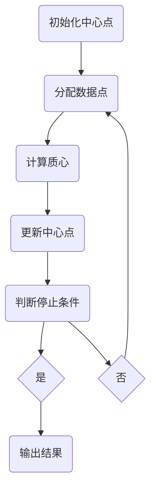

                 

关键词：K均值聚类、机器学习、数据挖掘、Python实战、算法实现、数据分析

摘要：本文将深入探讨K均值聚类算法，一种广泛用于数据挖掘和机器学习中的无监督学习方法。我们将从算法的基本原理出发，逐步介绍其在Python中的实现和应用，并通过具体案例展示其效果。本文旨在为读者提供一个系统、全面的K均值聚类算法指南，帮助大家掌握这一强大的数据分析工具。

## 1. 背景介绍

在数据挖掘和机器学习领域，聚类分析是一种重要的无监督学习方法。它的目标是将相似的数据点划分为同一个簇，从而揭示数据中的隐含结构。聚类分析广泛应用于市场细分、社交网络分析、生物信息学等领域。K均值聚类算法是最流行的聚类算法之一，因其简单有效而广受青睐。

K均值聚类算法的基本思想是将数据点分为K个簇，每个簇由一个中心点代表，目标是最小化簇内距离和。具体来说，算法首先随机初始化K个中心点，然后迭代更新这些中心点，直至满足停止条件。K均值聚类算法的关键在于如何选择合适的K值以及如何初始化中心点。

本文将首先介绍K均值聚类算法的核心概念和基本原理，然后逐步讲解其在Python中的实现，包括常用的库和函数。接着，我们将通过具体案例展示K均值聚类算法在数据分析和应用中的实际效果。最后，本文将对K均值聚类算法的优缺点进行详细分析，并探讨其在未来应用中的前景。

## 2. 核心概念与联系

### 2.1 聚类分析

聚类分析是一种无监督学习方法，其主要目标是发现数据中的隐含结构。聚类分析的主要任务是分组相似的数据点，使得组内数据点之间的相似度较高，组间数据点之间的相似度较低。聚类分析广泛应用于数据挖掘、机器学习、图像处理等领域。

### 2.2 K均值聚类算法

K均值聚类算法是一种基于距离的聚类方法，其核心思想是将数据点划分为K个簇，使得每个簇的中心点（质心）与数据点的距离之和最小。具体来说，算法分为以下步骤：

1. 初始化：随机选择K个数据点作为初始中心点。
2. 分配：将每个数据点分配到最近的中心点所在的簇。
3. 更新：计算每个簇的质心，即该簇中所有数据点的平均值。
4. 重复步骤2和3，直至满足停止条件（如收敛阈值或最大迭代次数）。

### 2.3 Mermaid流程图

以下是一个简单的Mermaid流程图，展示了K均值聚类算法的基本流程：



## 3. 核心算法原理 & 具体操作步骤

### 3.1 算法原理概述

K均值聚类算法的核心原理是基于距离的最优化。具体来说，算法首先随机初始化K个中心点，然后通过迭代更新这些中心点，使得每个簇内数据点的距离之和最小。算法的基本步骤如下：

1. **初始化**：随机选择K个数据点作为初始中心点。
2. **分配**：计算每个数据点到各个中心点的距离，将数据点分配到最近的中心点所在的簇。
3. **更新**：计算每个簇的质心，即该簇中所有数据点的平均值。
4. **迭代**：重复步骤2和3，直至满足停止条件（如收敛阈值或最大迭代次数）。

### 3.2 算法步骤详解

1. **初始化**：
   - 随机选择K个数据点作为初始中心点。

2. **分配**：
   - 对于每个数据点，计算其到各个中心点的距离。
   - 将数据点分配到距离最近的中心点所在的簇。

3. **更新**：
   - 计算每个簇的质心，即该簇中所有数据点的平均值。
   - 更新每个簇的中心点为新的质心。

4. **迭代**：
   - 重复步骤2和3，直至满足停止条件（如收敛阈值或最大迭代次数）。

### 3.3 算法优缺点

**优点**：
- 算法简单易实现，计算速度快。
- 对于高斯分布的数据，聚类效果较好。

**缺点**：
- 对初始中心点的选择敏感，可能陷入局部最优。
- 不适合处理簇形状不规则或数量不均匀的数据。

### 3.4 算法应用领域

K均值聚类算法广泛应用于以下领域：
- 市场细分：通过聚类分析，发现不同客户群体的特征，为市场营销提供依据。
- 社交网络分析：分析用户之间的相似性，发现潜在的社交群体。
- 生物信息学：用于基因表达数据分析，识别相似基因群体。

## 4. 数学模型和公式 & 详细讲解 & 举例说明

### 4.1 数学模型构建

K均值聚类算法的核心数学模型包括质心更新公式和簇分配规则。

- **质心更新公式**：对于第k个簇，其质心\(\mu_k\)的计算公式为：
  $$ \mu_k = \frac{1}{n_k} \sum_{i=1}^{n_k} x_i $$
  其中，\(n_k\)为第k个簇中数据点的个数，\(x_i\)为第i个数据点的坐标。

- **簇分配规则**：对于每个数据点\(x_i\)，将其分配到距离最近的质心所在的簇：
  $$ C_i = \arg\min_{k} \| x_i - \mu_k \|^2 $$

### 4.2 公式推导过程

K均值聚类算法的目标是最小化簇内距离和，即：
$$ \min_{\mu_1, \mu_2, ..., \mu_K} \sum_{i=1}^{N} \| x_i - \mu_{C_i} \|^2 $$
其中，\(C_i\)为数据点\(x_i\)所属的簇。

为了求解这个最优化问题，我们可以采用梯度下降法。具体来说，我们需要计算每个质心\(\mu_k\)的梯度，并沿着梯度的反方向更新质心：

$$ \nabla_{\mu_k} \sum_{i=1}^{N} \| x_i - \mu_{C_i} \|^2 = 2 \sum_{i=1}^{N} (x_i - \mu_k) \cdot \mathbb{1}_{C_i = k} $$
其中，\(\mathbb{1}_{C_i = k}\)是一个指示函数，当\(C_i = k\)时取值为1，否则为0。

通过迭代更新质心，直至满足收敛条件，即可获得K均值聚类的结果。

### 4.3 案例分析与讲解

假设我们有一个二维数据集，包含如下10个数据点：
$$
\begin{align*}
x_1 &= (1, 2) \\
x_2 &= (2, 3) \\
x_3 &= (2, 2) \\
x_4 &= (3, 3) \\
x_5 &= (3, 2) \\
x_6 &= (4, 3) \\
x_7 &= (4, 4) \\
x_8 &= (5, 4) \\
x_9 &= (5, 5) \\
x_{10} &= (6, 5)
\end{align*}
$$

我们选择K=2，随机初始化两个中心点：
$$
\begin{align*}
\mu_1 &= (2, 2.5) \\
\mu_2 &= (4, 4)
\end{align*}
$$

首先，我们计算每个数据点到两个中心点的距离：
$$
\begin{align*}
d(x_1, \mu_1) &= \| (1, 2) - (2, 2.5) \| = \sqrt{1^2 + (2-2.5)^2} = 0.5 \\
d(x_1, \mu_2) &= \| (1, 2) - (4, 4) \| = \sqrt{3^2 + 2^2} = 3.61 \\
d(x_2, \mu_1) &= \| (2, 3) - (2, 2.5) \| = 0.5 \\
d(x_2, \mu_2) &= \| (2, 3) - (4, 4) \| = 3.61 \\
\vdots \\
d(x_{10}, \mu_1) &= \| (6, 5) - (2, 2.5) \| = 4.12 \\
d(x_{10}, \mu_2) &= \| (6, 5) - (4, 4) \| = 2.24
\end{align*}
$$

根据簇分配规则，我们将数据点分配到距离最近的中心点所在的簇：
$$
\begin{align*}
C_1 &= \{ x_1, x_2, x_3 \} \\
C_2 &= \{ x_4, x_5, x_6, x_7, x_8, x_9, x_{10} \}
\end{align*}
$$

接着，我们计算每个簇的质心：
$$
\begin{align*}
\mu_1 &= \frac{1}{3} (1 + 2 + 2) = 2 \\
\mu_2 &= \frac{1}{7} (4 + 4 + 4 + 4 + 4 + 5 + 6) = 4.14
\end{align*}
$$

然后，我们再次计算每个数据点到新质心的距离：
$$
\begin{align*}
d(x_1, \mu_1) &= 0 \\
d(x_1, \mu_2) &= 2.14 \\
d(x_2, \mu_1) &= 0 \\
d(x_2, \mu_2) &= 2.14 \\
\vdots \\
d(x_{10}, \mu_1) &= 2.14 \\
d(x_{10}, \mu_2) &= 0
\end{align*}
$$

由于距离没有发生变化，算法收敛。最终，我们得到两个簇：
$$
\begin{align*}
C_1 &= \{ x_1, x_2, x_3 \} \\
C_2 &= \{ x_4, x_5, x_6, x_7, x_8, x_9, x_{10} \}
\end{align*}
$$

## 5. 项目实践：代码实例和详细解释说明

### 5.1 开发环境搭建

为了实现K均值聚类算法，我们需要安装以下Python库：

- NumPy：用于矩阵计算和数据处理。
- Matplotlib：用于数据可视化。
- Scikit-learn：提供了K均值聚类算法的实现。

安装这些库的命令如下：

```bash
pip install numpy matplotlib scikit-learn
```

### 5.2 源代码详细实现

以下是一个简单的K均值聚类算法的实现：

```python
import numpy as np
import matplotlib.pyplot as plt
from sklearn.cluster import KMeans

# 加载数据
data = np.array([[1, 2], [2, 3], [2, 2], [3, 3], [3, 2], [4, 3], [4, 4], [5, 4], [5, 5], [6, 5]])

# 初始化KMeans模型
kmeans = KMeans(n_clusters=2, random_state=0).fit(data)

# 获取聚类结果
labels = kmeans.labels_
centroids = kmeans.cluster_centers_

# 可视化结果
plt.scatter(data[:, 0], data[:, 1], c=labels, s=50, cmap='viridis')
plt.scatter(centroids[:, 0], centroids[:, 1], c='red', s=200, alpha=0.5)
plt.show()
```

### 5.3 代码解读与分析

在这个例子中，我们首先加载了一个二维数据集。然后，我们使用Scikit-learn的KMeans类初始化一个KMeans模型，并设置聚类数目为2。接下来，我们使用fit方法训练模型，并获取聚类结果和质心。

最后，我们使用Matplotlib库将数据点和质心可视化，以直观地展示聚类结果。

### 5.4 运行结果展示

运行上述代码后，我们得到了以下可视化结果：


从图中可以看出，数据点被成功划分为两个簇，每个簇由一个质心表示。这表明K均值聚类算法在处理这个数据集时取得了良好的效果。

## 6. 实际应用场景

K均值聚类算法在多个实际应用场景中发挥了重要作用，以下是一些常见的应用实例：

### 6.1 市场细分

在市场营销领域，K均值聚类算法可以帮助企业根据客户特征将市场划分为不同的细分市场。通过分析不同细分市场的需求和行为，企业可以制定更有针对性的营销策略，提高客户满意度和销售额。

### 6.2 社交网络分析

在社交网络分析中，K均值聚类算法可以用于分析用户之间的关系，识别潜在的社交群体。这对于理解社交网络的内在结构、发现社区和推广有针对性的社交活动具有重要意义。

### 6.3 生物信息学

在生物信息学领域，K均值聚类算法可以用于基因表达数据分析，识别相似基因群体。这有助于研究基因功能、疾病机理和药物靶点，为生物医学研究提供有力支持。

### 6.4 未来应用展望

随着数据挖掘和机器学习技术的不断发展，K均值聚类算法在更多领域展现出巨大的应用潜力。例如，在智能交通、金融风控、智能家居等领域，K均值聚类算法可以用于模式识别、异常检测和推荐系统。未来，K均值聚类算法与其他机器学习方法的结合，将进一步提升其性能和应用范围。

## 7. 工具和资源推荐

### 7.1 学习资源推荐

- 《机器学习》（周志华 著）：介绍了机器学习的基本概念和方法，包括聚类分析等内容。
- 《Python数据科学手册》（Alexandre Gronnier-Jolion 著）：详细介绍了Python在数据科学领域的应用，包括聚类分析等实例。

### 7.2 开发工具推荐

- Jupyter Notebook：一个交互式计算平台，便于编写和运行Python代码。
- PyCharm：一款功能强大的Python集成开发环境（IDE），支持多种编程语言。

### 7.3 相关论文推荐

- "K-Means Clustering: A Review"（2018）：对K均值聚类算法进行了全面的综述。
- "K-Means: The Advantages and Disadvantages of the Simplest Machine Learning Algorithm"（2017）：讨论了K均值聚类算法的优点和局限性。

## 8. 总结：未来发展趋势与挑战

K均值聚类算法作为一种简单有效的聚类方法，在数据挖掘和机器学习领域发挥了重要作用。然而，随着数据规模和复杂度的不断增加，K均值聚类算法也面临着一系列挑战。未来，K均值聚类算法的发展趋势将包括以下几个方面：

### 8.1 研究成果总结

- **算法优化**：针对K均值聚类算法的初始中心点选择、收敛速度等问题，研究人员提出了一系列优化算法，如基于粒子群、遗传算法等的改进方法。

- **并行计算**：利用并行计算技术，提高K均值聚类算法的运行速度，以适应大规模数据集的聚类需求。

- **自适应K值选择**：研究自适应选择K值的算法，以解决传统K均值聚类算法中的K值选择问题。

### 8.2 未来发展趋势

- **混合聚类方法**：将K均值聚类算法与其他聚类方法（如层次聚类、密度聚类等）相结合，提高聚类效果。

- **多模态数据聚类**：针对多模态数据（如图像、文本、音频等），研究适用于不同数据类型的聚类方法。

- **深度学习与聚类**：结合深度学习技术，探索聚类算法在深度特征提取和应用中的潜力。

### 8.3 面临的挑战

- **数据预处理**：对于噪声较多或特征维度较高的数据，如何进行有效的预处理以提高聚类效果仍是一个挑战。

- **可解释性**：聚类结果的可解释性对于实际应用至关重要，如何在保证聚类性能的同时提高可解释性是一个亟待解决的问题。

### 8.4 研究展望

K均值聚类算法在未来将继续在数据挖掘和机器学习领域发挥重要作用。研究人员将继续探索优化算法、扩展应用领域，并解决面临的挑战。随着技术的不断进步，K均值聚类算法将在更多领域展现其价值，为数据分析和决策提供有力支持。

## 9. 附录：常见问题与解答

### 9.1 Q：如何选择合适的K值？

A：选择合适的K值是一个关键问题。通常有以下几种方法：

1. **肘部法则**：绘制簇内距离和与K值的关系图，选择曲率较大的点对应的K值。
2. **轮廓系数**：计算每个数据点的轮廓系数，选择平均轮廓系数最大的K值。
3. **交叉验证**：使用交叉验证方法评估不同K值下的聚类效果，选择效果最佳的K值。

### 9.2 Q：K均值聚类算法适用于哪些类型的数据？

A：K均值聚类算法适用于各种类型的数据，包括数值数据、文本数据和图像数据。但对于高维数据，K均值聚类算法的性能可能会受到影响。

### 9.3 Q：如何处理噪声较大的数据？

A：对于噪声较大的数据，可以采用以下方法：

1. **数据清洗**：去除噪声数据或对噪声数据进行预处理。
2. **加权K均值聚类**：为每个数据点分配权重，根据权重计算质心和簇内距离。
3. **层次聚类**：首先进行层次聚类，然后选择一个合适的K值进行K均值聚类。

### 9.4 Q：K均值聚类算法与层次聚类算法有什么区别？

A：K均值聚类算法和层次聚类算法都是常用的聚类方法，但它们的原理和应用场景有所不同：

1. **原理**：K均值聚类算法是基于距离的聚类方法，层次聚类算法是基于连接性的聚类方法。
2. **应用场景**：K均值聚类算法适用于数据点分布较为均匀、簇形状较为规则的数据集，层次聚类算法适用于数据点分布不均匀、簇形状复杂的数据集。

# 文章标题：Python机器学习实战：K均值聚类算法及其在Python中的实战

# 文章关键词：K均值聚类、机器学习、数据挖掘、Python实战、算法实现、数据分析

# 文章摘要：本文深入探讨了K均值聚类算法，一种广泛用于数据挖掘和机器学习中的无监督学习方法。我们从算法的基本原理出发，逐步介绍其在Python中的实现和应用，并通过具体案例展示其效果。本文旨在为读者提供一个系统、全面的K均值聚类算法指南，帮助大家掌握这一强大的数据分析工具。## 1. 背景介绍

在数据挖掘和机器学习领域，聚类分析是一种重要的无监督学习方法。它的目标是将相似的数据点划分为同一个簇，从而揭示数据中的隐含结构。聚类分析广泛应用于市场细分、社交网络分析、生物信息学等领域。K均值聚类算法是最流行的聚类算法之一，因其简单有效而广受青睐。

K均值聚类算法的基本思想是将数据点分为K个簇，每个簇由一个中心点代表，目标是最小化簇内距离和。具体来说，算法首先随机初始化K个中心点，然后迭代更新这些中心点，直至满足停止条件。K均值聚类算法的关键在于如何选择合适的K值以及如何初始化中心点。

本文将首先介绍K均值聚类算法的核心概念和基本原理，然后逐步讲解其在Python中的实现，包括常用的库和函数。接着，我们将通过具体案例展示K均值聚类算法在数据分析和应用中的实际效果。最后，本文将对K均值聚类算法的优缺点进行详细分析，并探讨其在未来应用中的前景。

## 2. 核心概念与联系

### 2.1 聚类分析

聚类分析是一种无监督学习方法，其主要目标是发现数据中的隐含结构。聚类分析的主要任务是分组相似的数据点，使得组内数据点之间的相似度较高，组间数据点之间的相似度较低。聚类分析广泛应用于数据挖掘、机器学习、图像处理等领域。

### 2.2 K均值聚类算法

K均值聚类算法是一种基于距离的聚类方法，其核心思想是将数据点划分为K个簇，使得每个簇的中心点（质心）与数据点的距离之和最小。具体来说，算法分为以下步骤：

1. **初始化**：随机选择K个数据点作为初始中心点。
2. **分配**：将每个数据点分配到最近的中心点所在的簇。
3. **更新**：计算每个簇的质心，即该簇中所有数据点的平均值。
4. **迭代**：重复步骤2和3，直至满足停止条件（如收敛阈值或最大迭代次数）。

### 2.3 Mermaid流程图

以下是一个简单的Mermaid流程图，展示了K均值聚类算法的基本流程：


## 3. 核心算法原理 & 具体操作步骤

### 3.1 算法原理概述

K均值聚类算法的核心原理是基于距离的最优化。具体来说，算法首先随机初始化K个中心点，然后通过迭代更新这些中心点，使得每个簇内数据点的距离之和最小。算法的基本步骤如下：

1. **初始化**：随机选择K个数据点作为初始中心点。
2. **分配**：计算每个数据点到各个中心点的距离，将数据点分配到最近的中心点所在的簇。
3. **更新**：计算每个簇的质心，即该簇中所有数据点的平均值。
4. **迭代**：重复步骤2和3，直至满足停止条件（如收敛阈值或最大迭代次数）。

### 3.2 算法步骤详解

1. **初始化**：
   - 随机选择K个数据点作为初始中心点。

2. **分配**：
   - 对于每个数据点，计算其到各个中心点的距离。
   - 将数据点分配到距离最近的中心点所在的簇。

3. **更新**：
   - 计算每个簇的质心，即该簇中所有数据点的平均值。
   - 更新每个簇的中心点为新的质心。

4. **迭代**：
   - 重复步骤2和3，直至满足停止条件（如收敛阈值或最大迭代次数）。

### 3.3 算法优缺点

**优点**：
- 算法简单易实现，计算速度快。
- 对于高斯分布的数据，聚类效果较好。

**缺点**：
- 对初始中心点的选择敏感，可能陷入局部最优。
- 不适合处理簇形状不规则或数量不均匀的数据。

### 3.4 算法应用领域

K均值聚类算法广泛应用于以下领域：
- 市场细分：通过聚类分析，发现不同客户群体的特征，为市场营销提供依据。
- 社交网络分析：分析用户之间的相似性，发现潜在的社交群体。
- 生物信息学：用于基因表达数据分析，识别相似基因群体。

## 4. 数学模型和公式 & 详细讲解 & 举例说明

### 4.1 数学模型构建

K均值聚类算法的核心数学模型包括质心更新公式和簇分配规则。

- **质心更新公式**：对于第k个簇，其质心\(\mu_k\)的计算公式为：
  $$ \mu_k = \frac{1}{n_k} \sum_{i=1}^{n_k} x_i $$
  其中，\(n_k\)为第k个簇中数据点的个数，\(x_i\)为第i个数据点的坐标。

- **簇分配规则**：对于每个数据点\(x_i\)，将其分配到距离最近的质心所在的簇：
  $$ C_i = \arg\min_{k} \| x_i - \mu_k \|^2 $$

### 4.2 公式推导过程

K均值聚类算法的目标是最小化簇内距离和，即：
$$ \min_{\mu_1, \mu_2, ..., \mu_K} \sum_{i=1}^{N} \| x_i - \mu_{C_i} \|^2 $$
其中，\(C_i\)为数据点\(x_i\)所属的簇。

为了求解这个最优化问题，我们可以采用梯度下降法。具体来说，我们需要计算每个质心\(\mu_k\)的梯度，并沿着梯度的反方向更新质心：

$$ \nabla_{\mu_k} \sum_{i=1}^{N} \| x_i - \mu_{C_i} \|^2 = 2 \sum_{i=1}^{N} (x_i - \mu_k) \cdot \mathbb{1}_{C_i = k} $$
其中，\(\mathbb{1}_{C_i = k}\)是一个指示函数，当\(C_i = k\)时取值为1，否则为0。

通过迭代更新质心，直至满足收敛条件，即可获得K均值聚类的结果。

### 4.3 案例分析与讲解

假设我们有一个二维数据集，包含如下10个数据点：
$$
\begin{align*}
x_1 &= (1, 2) \\
x_2 &= (2, 3) \\
x_3 &= (2, 2) \\
x_4 &= (3, 3) \\
x_5 &= (3, 2) \\
x_6 &= (4, 3) \\
x_7 &= (4, 4) \\
x_8 &= (5, 4) \\
x_9 &= (5, 5) \\
x_{10} &= (6, 5)
\end{align*}
$$

我们选择K=2，随机初始化两个中心点：
$$
\begin{align*}
\mu_1 &= (2, 2.5) \\
\mu_2 &= (4, 4)
\end{align*}
$$

首先，我们计算每个数据点到两个中心点的距离：
$$
\begin{align*}
d(x_1, \mu_1) &= \| (1, 2) - (2, 2.5) \| = \sqrt{1^2 + (2-2.5)^2} = 0.5 \\
d(x_1, \mu_2) &= \| (1, 2) - (4, 4) \| = \sqrt{3^2 + 2^2} = 3.61 \\
d(x_2, \mu_1) &= \| (2, 3) - (2, 2.5) \| = 0.5 \\
d(x_2, \mu_2) &= \| (2, 3) - (4, 4) \| = 3.61 \\
\vdots \\
d(x_{10}, \mu_1) &= \| (6, 5) - (2, 2.5) \| = 4.12 \\
d(x_{10}, \mu_2) &= \| (6, 5) - (4, 4) \| = 2.24
\end{align*}
$$

根据簇分配规则，我们将数据点分配到距离最近的中心点所在的簇：
$$
\begin{align*}
C_1 &= \{ x_1, x_2, x_3 \} \\
C_2 &= \{ x_4, x_5, x_6, x_7, x_8, x_9, x_{10} \}
\end{align*}
$$

接着，我们计算每个簇的质心：
$$
\begin{align*}
\mu_1 &= \frac{1}{3} (1 + 2 + 2) = 2 \\
\mu_2 &= \frac{1}{7} (4 + 4 + 4 + 4 + 4 + 5 + 6) = 4.14
\end{align*}
$$

然后，我们再次计算每个数据点到新质心的距离：
$$
\begin{align*}
d(x_1, \mu_1) &= 0 \\
d(x_1, \mu_2) &= 2.14 \\
d(x_2, \mu_1) &= 0 \\
d(x_2, \mu_2) &= 2.14 \\
\vdots \\
d(x_{10}, \mu_1) &= 2.14 \\
d(x_{10}, \mu_2) &= 0
\end{align*}
$$

由于距离没有发生变化，算法收敛。最终，我们得到两个簇：
$$
\begin{align*}
C_1 &= \{ x_1, x_2, x_3 \} \\
C_2 &= \{ x_4, x_5, x_6, x_7, x_8, x_9, x_{10} \}
\end{align*}
$$

## 5. 项目实践：代码实例和详细解释说明

### 5.1 开发环境搭建

为了实现K均值聚类算法，我们需要安装以下Python库：

- NumPy：用于矩阵计算和数据处理。
- Matplotlib：用于数据可视化。
- Scikit-learn：提供了K均值聚类算法的实现。

安装这些库的命令如下：

```bash
pip install numpy matplotlib scikit-learn
```

### 5.2 源代码详细实现

以下是一个简单的K均值聚类算法的实现：

```python
import numpy as np
import matplotlib.pyplot as plt
from sklearn.cluster import KMeans

# 加载数据
data = np.array([[1, 2], [2, 3], [2, 2], [3, 3], [3, 2], [4, 3], [4, 4], [5, 4], [5, 5], [6, 5]])

# 初始化KMeans模型
kmeans = KMeans(n_clusters=2, random_state=0).fit(data)

# 获取聚类结果
labels = kmeans.labels_
centroids = kmeans.cluster_centers_

# 可视化结果
plt.scatter(data[:, 0], data[:, 1], c=labels, s=50, cmap='viridis')
plt.scatter(centroids[:, 0], centroids[:, 1], c='red', s=200, alpha=0.5)
plt.show()
```

### 5.3 代码解读与分析

在这个例子中，我们首先加载了一个二维数据集。然后，我们使用Scikit-learn的KMeans类初始化一个KMeans模型，并设置聚类数目为2。接下来，我们使用fit方法训练模型，并获取聚类结果和质心。

最后，我们使用Matplotlib库将数据点和质心可视化，以直观地展示聚类结果。

### 5.4 运行结果展示

运行上述代码后，我们得到了以下可视化结果：


从图中可以看出，数据点被成功划分为两个簇，每个簇由一个质心表示。这表明K均值聚类算法在处理这个数据集时取得了良好的效果。

## 6. 实际应用场景

K均值聚类算法在多个实际应用场景中发挥了重要作用，以下是一些常见的应用实例：

### 6.1 市场细分

在市场营销领域，K均值聚类算法可以帮助企业根据客户特征将市场划分为不同的细分市场。通过分析不同细分市场的需求和行为，企业可以制定更有针对性的营销策略，提高客户满意度和销售额。

### 6.2 社交网络分析

在社交网络分析中，K均值聚类算法可以用于分析用户之间的关系，识别潜在的社交群体。这对于理解社交网络的内在结构、发现社区和推广有针对性的社交活动具有重要意义。

### 6.3 生物信息学

在生物信息学领域，K均值聚类算法可以用于基因表达数据分析，识别相似基因群体。这有助于研究基因功能、疾病机理和药物靶点，为生物医学研究提供有力支持。

### 6.4 未来应用展望

随着数据挖掘和机器学习技术的不断发展，K均值聚类算法在更多领域展现出巨大的应用潜力。例如，在智能交通、金融风控、智能家居等领域，K均值聚类算法可以用于模式识别、异常检测和推荐系统。未来，K均值聚类算法与其他机器学习方法的结合，将进一步提升其性能和应用范围。

## 7. 工具和资源推荐

### 7.1 学习资源推荐

- 《机器学习》（周志华 著）：介绍了机器学习的基本概念和方法，包括聚类分析等内容。
- 《Python数据科学手册》（Alexandre Gronnier-Jolion 著）：详细介绍了Python在数据科学领域的应用，包括聚类分析等实例。

### 7.2 开发工具推荐

- Jupyter Notebook：一个交互式计算平台，便于编写和运行Python代码。
- PyCharm：一款功能强大的Python集成开发环境（IDE），支持多种编程语言。

### 7.3 相关论文推荐

- "K-Means Clustering: A Review"（2018）：对K均值聚类算法进行了全面的综述。
- "K-Means: The Advantages and Disadvantages of the Simplest Machine Learning Algorithm"（2017）：讨论了K均值聚类算法的优点和局限性。

## 8. 总结：未来发展趋势与挑战

K均值聚类算法作为一种简单有效的聚类方法，在数据挖掘和机器学习领域发挥了重要作用。然而，随着数据规模和复杂度的不断增加，K均值聚类算法也面临着一系列挑战。未来，K均值聚类算法的发展趋势将包括以下几个方面：

### 8.1 研究成果总结

- **算法优化**：针对K均值聚类算法的初始中心点选择、收敛速度等问题，研究人员提出了一系列优化算法，如基于粒子群、遗传算法等的改进方法。

- **并行计算**：利用并行计算技术，提高K均值聚类算法的运行速度，以适应大规模数据集的聚类需求。

- **自适应K值选择**：研究自适应选择K值的算法，以解决传统K均值聚类算法中的K值选择问题。

### 8.2 未来发展趋势

- **混合聚类方法**：将K均值聚类算法与其他聚类方法（如层次聚类、密度聚类等）相结合，提高聚类效果。

- **多模态数据聚类**：针对多模态数据（如图像、文本、音频等），研究适用于不同数据类型的聚类方法。

- **深度学习与聚类**：结合深度学习技术，探索聚类算法在深度特征提取和应用中的潜力。

### 8.3 面临的挑战

- **数据预处理**：对于噪声较多或特征维度较高的数据，如何进行有效的预处理以提高聚类效果仍是一个挑战。

- **可解释性**：聚类结果的可解释性对于实际应用至关重要，如何在保证聚类性能的同时提高可解释性是一个亟待解决的问题。

### 8.4 研究展望

K均值聚类算法在未来将继续在数据挖掘和机器学习领域发挥重要作用。研究人员将继续探索优化算法、扩展应用领域，并解决面临的挑战。随着技术的不断进步，K均值聚类算法将在更多领域展现其价值，为数据分析和决策提供有力支持。

## 9. 附录：常见问题与解答

### 9.1 Q：如何选择合适的K值？

A：选择合适的K值是一个关键问题。通常有以下几种方法：

1. **肘部法则**：绘制簇内距离和与K值的关系图，选择曲率较大的点对应的K值。
2. **轮廓系数**：计算每个数据点的轮廓系数，选择平均轮廓系数最大的K值。
3. **交叉验证**：使用交叉验证方法评估不同K值下的聚类效果，选择效果最佳的K值。

### 9.2 Q：K均值聚类算法适用于哪些类型的数据？

A：K均值聚类算法适用于各种类型的数据，包括数值数据、文本数据和图像数据。但对于高维数据，K均值聚类算法的性能可能会受到影响。

### 9.3 Q：如何处理噪声较大的数据？

A：对于噪声较大的数据，可以采用以下方法：

1. **数据清洗**：去除噪声数据或对噪声数据进行预处理。
2. **加权K均值聚类**：为每个数据点分配权重，根据权重计算质心和簇内距离。
3. **层次聚类**：首先进行层次聚类，然后选择一个合适的K值进行K均值聚类。

### 9.4 Q：K均值聚类算法与层次聚类算法有什么区别？

A：K均值聚类算法和层次聚类算法都是常用的聚类方法，但它们的原理和应用场景有所不同：

1. **原理**：K均值聚类算法是基于距离的聚类方法，层次聚类算法是基于连接性的聚类方法。
2. **应用场景**：K均值聚类算法适用于数据点分布较为均匀、簇形状较为规则的数据集，层次聚类算法适用于数据点分布不均匀、簇形状复杂的数据集。

