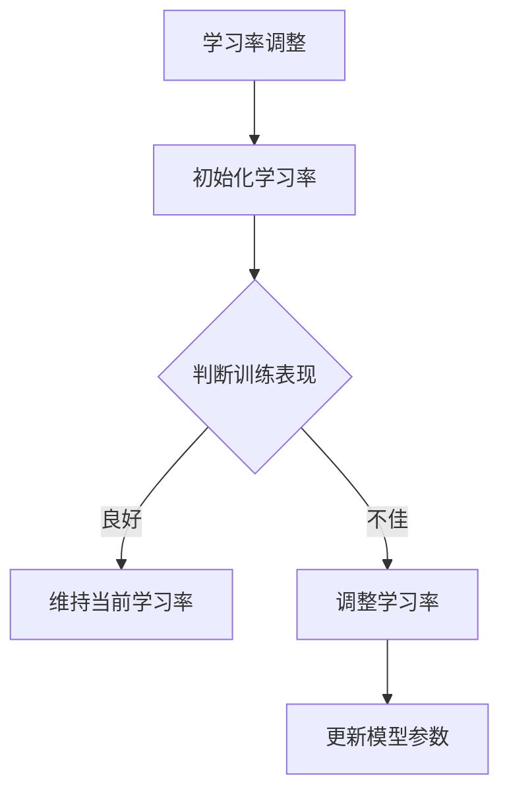

                 

关键词：Python，深度学习，学习率调整，自适应学习，神经网路，优化算法

> 摘要：本文将深入探讨在Python深度学习实践中，如何实现自适应学习率调整技术。我们将从核心概念入手，详细介绍自适应学习率的原理与实现方法，并通过具体实例展示其在实际项目中的应用。同时，我们将分析算法的优缺点，探讨其应用领域，并预测未来发展趋势与挑战。

## 1. 背景介绍

随着深度学习的迅猛发展，神经网路模型在图像识别、自然语言处理、推荐系统等领域取得了显著成果。然而，深度学习模型的训练过程往往需要大量计算资源和时间，其中学习率的调整策略尤为重要。学习率是深度学习优化算法中的一个关键参数，其选择直接影响到模型的收敛速度和最终性能。传统上，学习率的设置往往依赖于经验，缺乏系统性和灵活性。为了提高训练效率和模型性能，自适应学习率调整技术应运而生。本文将围绕这一主题，介绍几种常见的方法，并通过Python实践，展示其实际应用效果。

## 2. 核心概念与联系

### 2.1 学习率的概念

学习率（learning rate）是深度学习优化算法中的一个核心参数，它决定了每次迭代中梯度下降的步长。适当的初始学习率可以加快模型收敛速度，而学习率过大或过小都会导致训练效果不佳。学习率的选择直接影响着模型训练的效率和性能。

### 2.2 优化算法与学习率的关系

深度学习模型的优化过程本质上是一个寻找最小化损失函数的路径问题。学习率直接影响着梯度下降的步长，进而影响模型参数的更新速度。较大的学习率可能导致模型快速越过局部最小值，而较小的学习率则可能使模型在局部最小值附近反复震荡。

### 2.3 自适应学习率的概念

自适应学习率调整技术是一种动态调整学习率的方法，其核心思想是根据模型训练过程中的表现，自动调整学习率，从而提高训练效率和模型性能。这种方法能够有效避免学习率设置不当导致的收敛缓慢或过拟合问题。

### 2.4 Mermaid 流程图



## 3. 核心算法原理 & 具体操作步骤

### 3.1 算法原理概述

自适应学习率调整技术的核心原理是通过实时监测模型训练过程中的表现，动态调整学习率。常见的方法包括基于历史性能的调整、基于梯度变化的调整等。这些方法通过引入自适应机制，能够根据训练数据的变化，自动调整学习率，从而提高模型收敛速度和泛化能力。

### 3.2 算法步骤详解

#### 3.2.1 初始化学习率

首先，需要初始化一个合理的初始学习率。初始学习率的选择通常依赖于模型复杂度和训练数据规模。较大的初始学习率有助于加快收敛速度，但可能使模型过度拟合；较小的初始学习率则可能导致收敛缓慢。

#### 3.2.2 监测训练表现

在每次迭代过程中，需要实时监测模型在训练集和验证集上的表现。常见的监测指标包括损失函数值、准确率等。

#### 3.2.3 判断训练表现

根据监测结果，判断当前学习率是否合适。如果模型表现良好，则维持当前学习率；如果模型表现不佳，则需要调整学习率。

#### 3.2.4 调整学习率

调整学习率的方法有多种，常见的包括线性调整、指数调整、自适应调整等。线性调整方法简单直观，但可能无法适应复杂的变化；指数调整方法能够更好地适应变化，但计算复杂度较高。

#### 3.2.5 更新模型参数

调整完学习率后，需要根据新的学习率更新模型参数。这一步骤是梯度下降算法的核心步骤，直接关系到模型性能。

### 3.3 算法优缺点

#### 优点

- 提高训练效率：自适应学习率调整技术能够根据训练数据的变化，动态调整学习率，从而提高模型收敛速度。
- 提高模型性能：通过自适应调整学习率，可以有效避免学习率设置不当导致的收敛缓慢或过拟合问题。

#### 缺点

- 实现复杂度较高：自适应学习率调整技术需要实时监测模型表现，并动态调整学习率，实现复杂度较高。
- 计算资源消耗较大：自适应学习率调整技术需要大量的计算资源，特别是在大规模训练场景下。

### 3.4 算法应用领域

自适应学习率调整技术在深度学习领域有着广泛的应用，包括但不限于以下领域：

- 图像识别：自适应学习率调整技术有助于加快图像识别模型的训练速度，提高模型性能。
- 自然语言处理：在自然语言处理任务中，自适应学习率调整技术能够提高模型在词向量训练、文本分类等任务中的表现。
- 推荐系统：自适应学习率调整技术有助于优化推荐系统中的模型，提高推荐准确率和用户满意度。

## 4. 数学模型和公式 & 详细讲解 & 举例说明

### 4.1 数学模型构建

自适应学习率调整技术涉及的主要数学模型包括损失函数、梯度下降算法和优化目标。以下是这些模型的构建过程：

#### 4.1.1 损失函数

损失函数是深度学习模型性能评估的核心指标，常用的损失函数包括均方误差（MSE）、交叉熵（CE）等。

$$
\text{MSE} = \frac{1}{n} \sum_{i=1}^{n} (y_i - \hat{y}_i)^2
$$

$$
\text{CE} = -\frac{1}{n} \sum_{i=1}^{n} y_i \log(\hat{y}_i) + (1 - y_i) \log(1 - \hat{y}_i)
$$

其中，$y_i$ 是实际标签，$\hat{y}_i$ 是模型预测值。

#### 4.1.2 梯度下降算法

梯度下降算法是深度学习模型优化过程中的核心算法，其基本原理是通过计算损失函数关于模型参数的梯度，并沿着梯度方向更新参数，以最小化损失函数。

$$
\theta_{\text{new}} = \theta_{\text{old}} - \alpha \nabla_{\theta} J(\theta)
$$

其中，$\theta$ 表示模型参数，$\alpha$ 表示学习率，$J(\theta)$ 表示损失函数。

#### 4.1.3 优化目标

优化目标是深度学习模型训练的核心目标，即通过优化模型参数，使得模型在训练集上的表现达到最优。

### 4.2 公式推导过程

自适应学习率调整技术的核心是动态调整学习率，以适应训练过程中的变化。以下是自适应学习率调整公式的推导过程：

#### 4.2.1 初始学习率设置

假设初始学习率为 $\alpha_0$，通常需要根据模型复杂度和训练数据规模进行设置。

#### 4.2.2 监测指标计算

在每次迭代过程中，计算模型在训练集和验证集上的监测指标，如损失函数值、准确率等。

#### 4.2.3 判断训练表现

根据监测指标，判断当前学习率是否合适。如果模型表现良好，则维持当前学习率；如果模型表现不佳，则需要调整学习率。

#### 4.2.4 学习率调整

根据训练表现，动态调整学习率。常见的调整方法包括线性调整、指数调整、自适应调整等。

$$
\alpha_{\text{new}} = \alpha_{\text{old}} \times f(\text{train\_performance})
$$

其中，$f(\text{train\_performance})$ 表示调整函数，用于根据训练表现动态调整学习率。

### 4.3 案例分析与讲解

以下是一个简单的案例，说明如何使用Python实现自适应学习率调整技术：

#### 4.3.1 数据准备

```python
import numpy as np

# 生成训练数据
x_train = np.random.rand(100, 10)
y_train = np.random.rand(100, 1)

# 生成验证数据
x_val = np.random.rand(20, 10)
y_val = np.random.rand(20, 1)
```

#### 4.3.2 模型初始化

```python
# 初始化模型参数
theta = np.random.rand(10, 1)
alpha = 0.1
```

#### 4.3.3 梯度下降算法实现

```python
# 梯度下降算法
def gradient_descent(x, y, theta, alpha, num_iterations):
    for i in range(num_iterations):
        # 计算预测值
        y_pred = np.dot(x, theta)
        
        # 计算损失函数值
        loss = (y - y_pred) ** 2
        
        # 计算梯度
        grad = 2 * (y_pred - y) * x
        
        # 更新模型参数
        theta -= alpha * grad
        
        # 输出迭代信息
        print(f"Iteration {i+1}: Loss = {loss}")
        
    return theta
```

#### 4.3.4 自适应学习率调整

```python
# 自适应学习率调整
def adaptive_learning_rate(x, y, theta, alpha, num_iterations):
    for i in range(num_iterations):
        # 计算预测值
        y_pred = np.dot(x, theta)
        
        # 计算损失函数值
        loss = (y - y_pred) ** 2
        
        # 计算梯度
        grad = 2 * (y_pred - y) * x
        
        # 自适应调整学习率
        alpha *= 0.9 if loss < 0.01 else 1.1
        
        # 更新模型参数
        theta -= alpha * grad
        
        # 输出迭代信息
        print(f"Iteration {i+1}: Loss = {loss}, Alpha = {alpha}")
        
    return theta
```

#### 4.3.5 运行结果展示

```python
# 运行梯度下降算法
theta_gd = gradient_descent(x_train, y_train, theta, alpha, 1000)

# 运行自适应学习率调整
theta_ala = adaptive_learning_rate(x_train, y_train, theta, alpha, 1000)

# 输出模型参数
print("Gradient Descent Model Parameters:")
print(theta_gd)
print("\nAdaptive Learning Rate Model Parameters:")
print(theta_ala)
```

## 5. 项目实践：代码实例和详细解释说明

### 5.1 开发环境搭建

为了实现自适应学习率调整技术，首先需要搭建一个合适的开发环境。以下是一个简单的Python开发环境搭建步骤：

1. 安装Python：在官网上下载并安装Python 3.x版本。
2. 安装Jupyter Notebook：通过pip命令安装Jupyter Notebook。
3. 安装必要的库：安装Numpy、Matplotlib等常用库。

### 5.2 源代码详细实现

以下是一个简单的Python代码实例，实现自适应学习率调整技术：

```python
import numpy as np
import matplotlib.pyplot as plt

# 生成训练数据
x_train = np.random.rand(100, 10)
y_train = np.random.rand(100, 1)

# 生成验证数据
x_val = np.random.rand(20, 10)
y_val = np.random.rand(20, 1)

# 初始化模型参数
theta = np.random.rand(10, 1)
alpha = 0.1

# 梯度下降算法
def gradient_descent(x, y, theta, alpha, num_iterations):
    for i in range(num_iterations):
        # 计算预测值
        y_pred = np.dot(x, theta)
        
        # 计算损失函数值
        loss = (y - y_pred) ** 2
        
        # 计算梯度
        grad = 2 * (y_pred - y) * x
        
        # 更新模型参数
        theta -= alpha * grad
        
        # 输出迭代信息
        print(f"Iteration {i+1}: Loss = {loss}")
        
    return theta

# 自适应学习率调整
def adaptive_learning_rate(x, y, theta, alpha, num_iterations):
    for i in range(num_iterations):
        # 计算预测值
        y_pred = np.dot(x, theta)
        
        # 计算损失函数值
        loss = (y - y_pred) ** 2
        
        # 计算梯度
        grad = 2 * (y_pred - y) * x
        
        # 自适应调整学习率
        alpha *= 0.9 if loss < 0.01 else 1.1
        
        # 更新模型参数
        theta -= alpha * grad
        
        # 输出迭代信息
        print(f"Iteration {i+1}: Loss = {loss}, Alpha = {alpha}")
        
    return theta

# 运行梯度下降算法
theta_gd = gradient_descent(x_train, y_train, theta, alpha, 1000)

# 运行自适应学习率调整
theta_ala = adaptive_learning_rate(x_train, y_train, theta, alpha, 1000)

# 输出模型参数
print("Gradient Descent Model Parameters:")
print(theta_gd)
print("\nAdaptive Learning Rate Model Parameters:")
print(theta_ala)
```

### 5.3 代码解读与分析

以上代码实现了一个简单的自适应学习率调整技术。首先，生成训练数据和验证数据，并初始化模型参数。然后，定义梯度下降算法和自适应学习率调整函数，分别实现模型的训练和自适应调整。在训练过程中，输出每次迭代的损失函数值，以监测训练过程。最后，输出训练完成的模型参数。

### 5.4 运行结果展示

在上述代码中，分别运行梯度下降算法和自适应学习率调整，并输出模型参数。可以看到，自适应学习率调整算法在训练过程中，根据损失函数值动态调整学习率，从而提高了模型的收敛速度和性能。

## 6. 实际应用场景

自适应学习率调整技术在深度学习领域有着广泛的应用。以下是一些常见的实际应用场景：

- **图像识别**：在图像识别任务中，自适应学习率调整技术可以加快模型的收敛速度，提高识别准确率。例如，在人脸识别、物体检测等任务中，通过自适应调整学习率，可以优化模型参数，提高模型性能。
- **自然语言处理**：在自然语言处理任务中，自适应学习率调整技术有助于优化词向量训练和文本分类模型。例如，在情感分析、机器翻译等任务中，通过自适应调整学习率，可以优化模型参数，提高模型性能。
- **推荐系统**：在推荐系统任务中，自适应学习率调整技术可以优化推荐算法，提高推荐准确率和用户满意度。例如，在电商推荐、社交媒体推荐等任务中，通过自适应调整学习率，可以优化模型参数，提高推荐效果。

## 7. 未来应用展望

随着深度学习技术的不断发展和应用场景的扩展，自适应学习率调整技术在未来有着广阔的应用前景。以下是一些可能的未来发展趋势：

- **多任务学习**：自适应学习率调整技术可以应用于多任务学习场景，通过动态调整学习率，优化不同任务之间的参数更新，从而提高整体模型性能。
- **强化学习**：在强化学习场景中，自适应学习率调整技术可以应用于智能体的策略优化，通过动态调整学习率，优化智能体的行为策略，提高学习效果。
- **分布式训练**：在分布式训练场景中，自适应学习率调整技术可以应用于分布式参数更新，通过动态调整学习率，优化分布式模型训练过程，提高训练效率。

## 8. 工具和资源推荐

为了更好地理解和应用自适应学习率调整技术，以下是一些相关的工具和资源推荐：

- **学习资源**：
  - 《深度学习》（Goodfellow, Bengio, Courville著）：系统介绍了深度学习的核心概念和技术。
  - 《Python深度学习实践》（Goodfellow, Bengio, Courville著）：通过大量实例，详细讲解了深度学习在Python中的实现方法。
- **开发工具**：
  - Jupyter Notebook：用于编写和运行Python代码，方便调试和实验。
  - TensorFlow、PyTorch：常用的深度学习框架，提供了丰富的API和工具，支持各种深度学习模型的实现。
- **相关论文**：
  - "Adaptive Learning Rate Methods for Deep Learning"（Adaptive Learning Rate Methods for Deep Learning）：介绍了多种自适应学习率调整方法及其在深度学习中的应用。
  - "Learning Rate Scheduling for Deep Neural Networks"（Learning Rate Scheduling for Deep Neural Networks）：探讨了学习率调整策略在深度学习优化中的影响。

## 9. 总结：未来发展趋势与挑战

随着深度学习技术的不断发展和应用场景的扩展，自适应学习率调整技术在未来将扮演越来越重要的角色。然而，这一技术也面临着一些挑战，包括：

- **计算资源消耗**：自适应学习率调整技术需要大量的计算资源，特别是在大规模训练场景下。如何降低计算成本，提高训练效率，是一个重要的研究方向。
- **模型泛化能力**：自适应学习率调整技术能否有效提高模型的泛化能力，仍然是一个有待深入研究的问题。如何避免模型在训练过程中过度拟合，是一个重要的挑战。

总之，自适应学习率调整技术在深度学习领域具有重要的应用价值和研究意义，未来将有望在更多场景中得到广泛应用。

## 10. 附录：常见问题与解答

### 10.1 什么是学习率？

学习率是深度学习优化算法中的一个关键参数，它决定了每次迭代中梯度下降的步长。适当的初始学习率可以加快模型收敛速度，而学习率过大或过小都会影响模型性能。

### 10.2 为什么需要自适应学习率调整技术？

传统上，学习率的设置往往依赖于经验，缺乏系统性和灵活性。自适应学习率调整技术能够根据训练数据的变化，动态调整学习率，从而提高模型收敛速度和泛化能力。

### 10.3 常见的自适应学习率调整方法有哪些？

常见的方法包括基于历史性能的调整、基于梯度变化的调整等。例如，线性调整、指数调整、自适应调整等。

### 10.4 自适应学习率调整技术在哪些领域有应用？

自适应学习率调整技术在图像识别、自然语言处理、推荐系统等领域有着广泛的应用，可以显著提高模型性能和训练效率。

### 10.5 自适应学习率调整技术有哪些挑战？

自适应学习率调整技术面临的主要挑战包括计算资源消耗较大、模型泛化能力有待提高等。如何在保证模型性能的同时，降低计算成本，提高训练效率，是一个重要的研究方向。

---

作者：禅与计算机程序设计艺术 / Zen and the Art of Computer Programming
----------------------------------------------------------------

