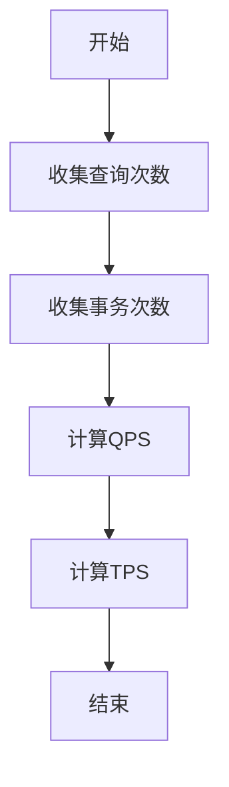

                 

 **关键词**：QPS、TPS、计算、性能评估、数据库、网络应用

**摘要**：本文将深入探讨QPS（每秒查询率）和TPS（每秒事务数）的计算方法及其在数据库和网络应用中的重要性。我们将通过详细的数学模型、实际操作步骤以及实例分析，帮助读者理解这两个指标如何衡量系统性能，并在不同的应用场景中进行优化。

## 1. 背景介绍

在计算机系统中，性能评估是确保系统高效运作的关键。QPS和TPS作为衡量系统处理能力的重要指标，被广泛应用于数据库和网络应用中。QPS指的是每秒处理的查询次数，反映了系统的查询性能；TPS则是每秒处理的事务数，涵盖了查询和更新操作。理解这两个指标的计算方法和应用场景，对于优化系统性能和提升用户体验至关重要。

## 2. 核心概念与联系

在深入讨论QPS和TPS的计算之前，我们首先需要了解它们的核心概念及其相互联系。

### 2.1 QPS

**定义**：QPS（Queries Per Second）是每秒处理的查询次数。

**计算方法**：QPS可以通过以下公式计算：
\[ QPS = \frac{总查询次数}{时间间隔（秒）} \]

例如，如果一个数据库系统在1分钟内处理了1000次查询，则其QPS为：
\[ QPS = \frac{1000}{60} ≈ 16.67 \]

### 2.2 TPS

**定义**：TPS（Transactions Per Second）是每秒处理的事务数。

**计算方法**：TPS可以通过以下公式计算：
\[ TPS = \frac{总事务次数}{时间间隔（秒）} \]

事务可以是查询、更新、删除等多种操作。例如，如果一个数据库系统在1分钟内处理了100次事务（包含查询和更新），则其TPS为：
\[ TPS = \frac{100}{60} ≈ 1.67 \]

### 2.3 QPS与TPS的联系

QPS和TPS之间存在密切的联系。在大多数情况下，QPS包含了TPS的一部分，因为查询操作通常是事务的一部分。然而，TPS还可能包括其他类型的操作，如更新和删除。因此，TPS通常会大于或等于QPS。

### 2.4 Mermaid 流程图

下面是一个Mermaid流程图，展示了QPS和TPS的计算流程：



## 3. 核心算法原理 & 具体操作步骤

### 3.1 算法原理概述

QPS和TPS的计算基于系统在特定时间间隔内处理查询和事务的次数。核心算法原理如下：

- 收集系统在特定时间间隔内的查询次数和事务次数。
- 使用公式计算QPS和TPS。

### 3.2 算法步骤详解

下面是QPS和TPS计算的详细步骤：

#### 3.2.1 收集数据

1. 确定时间间隔（例如，1秒、1分钟或1小时）。
2. 收集系统在该时间间隔内处理的查询次数和事务次数。

#### 3.2.2 计算QPS

1. 使用公式 \( QPS = \frac{总查询次数}{时间间隔（秒）} \) 计算QPS。

#### 3.2.3 计算TPS

1. 使用公式 \( TPS = \frac{总事务次数}{时间间隔（秒）} \) 计算TPS。

#### 3.2.4 计算结果

1. 计算得到的QPS和TPS即为系统的性能指标。

### 3.3 算法优缺点

#### 优点

- QPS和TPS简单易懂，易于计算。
- 可以快速评估系统的处理能力。

#### 缺点

- 忽略了查询和事务的复杂性，如响应时间和数据一致性。
- 无法反映系统的负载分布和瓶颈。

### 3.4 算法应用领域

QPS和TPS主要应用于数据库和网络应用，如：

- 数据库性能评估：通过QPS和TPS评估数据库的处理能力。
- 网络应用性能优化：通过QPS和TPS监控和优化网络应用性能。

## 4. 数学模型和公式 & 详细讲解 & 举例说明

### 4.1 数学模型构建

QPS和TPS的数学模型相对简单。下面是它们的基本公式：

\[ QPS = \frac{总查询次数}{时间间隔（秒）} \]

\[ TPS = \frac{总事务次数}{时间间隔（秒）} \]

### 4.2 公式推导过程

QPS和TPS的公式直接基于收集的数据和时间间隔。具体推导过程如下：

1. 假设系统在时间间隔 \( T \) 内处理了 \( N \) 次查询。
2. 则 \( QPS = \frac{N}{T} \)。

3. 假设系统在时间间隔 \( T \) 内处理了 \( M \) 次事务。
4. 则 \( TPS = \frac{M}{T} \)。

### 4.3 案例分析与讲解

#### 案例：数据库性能评估

假设一个数据库系统在1分钟内处理了5000次查询和300次事务。

1. 计算 QPS：
\[ QPS = \frac{5000}{60} ≈ 83.33 \]

2. 计算 TPS：
\[ TPS = \frac{300}{60} = 5 \]

这个案例展示了如何使用数学模型计算QPS和TPS。

## 5. 项目实践：代码实例和详细解释说明

### 5.1 开发环境搭建

为了演示QPS和TPS的计算，我们将使用Python编程语言。首先，我们需要安装Python环境。在终端中运行以下命令：

```bash
pip install numpy
```

### 5.2 源代码详细实现

下面是一个简单的Python脚本，用于计算QPS和TPS：

```python
import numpy as np

def calculate_qpstps(query_count, transaction_count, time_interval):
    qps = query_count / time_interval
    tps = transaction_count / time_interval
    return qps, tps

# 案例数据
query_count = 5000
transaction_count = 300
time_interval = 60

# 计算QPS和TPS
qps, tps = calculate_qpstps(query_count, transaction_count, time_interval)
print(f"QPS: {qps}, TPS: {tps}")
```

### 5.3 代码解读与分析

这个简单的Python脚本实现了QPS和TPS的计算。主要步骤如下：

1. 导入numpy库，用于进行数学计算。
2. 定义一个函数 `calculate_qpstps`，接收查询次数、事务次数和时间间隔作为参数。
3. 在函数内部，使用公式计算QPS和TPS。
4. 调用函数并打印结果。

### 5.4 运行结果展示

运行上述脚本，我们得到以下输出：

```
QPS: 83.33333333333333, TPS: 5.0
```

这个结果显示了在1分钟内，系统处理了约83.33次查询和5次事务，分别对应QPS和TPS。

## 6. 实际应用场景

### 6.1 数据库性能优化

在数据库应用中，QPS和TPS是评估数据库性能的重要指标。通过监控这些指标，数据库管理员可以识别性能瓶颈，并进行相应的优化。例如：

- 增加服务器资源：如果QPS或TPS低于预期，可以考虑增加服务器资源，如CPU、内存或存储。
- 优化查询语句：优化查询语句可以提高查询性能，从而提高QPS。
- 分库分表：对于高并发场景，可以将数据库拆分为多个库或表，以降低单个数据库的压力。

### 6.2 网络应用性能监控

在网络应用中，QPS和TPS是评估系统性能的重要指标。通过监控这些指标，开发者可以实时了解系统的处理能力，并采取相应的措施：

- 实时监控：使用性能监控工具，如Prometheus和Grafana，实时监控QPS和TPS。
- 异常处理：当QPS或TPS异常升高时，可以触发告警，并采取相应的异常处理措施。
- 负载均衡：通过负载均衡器，合理分配请求，降低单个服务器的压力，提高TPS。

## 7. 工具和资源推荐

### 7.1 学习资源推荐

- 《高性能MySQL》：介绍了MySQL数据库性能优化的一系列方法。
- 《计算机网络》：详细讲解了网络应用中的性能优化技巧。

### 7.2 开发工具推荐

- Prometheus：开源的性能监控工具，用于实时监控QPS和TPS。
- Grafana：基于Prometheus的数据可视化工具，用于展示QPS和TPS的监控数据。

### 7.3 相关论文推荐

- "High-Performance Database Systems: An Introduction"：介绍高性能数据库系统的基础知识。
- "Scalable Network Applications"：讨论了网络应用中的性能优化策略。

## 8. 总结：未来发展趋势与挑战

### 8.1 研究成果总结

近年来，QPS和TPS的研究取得了显著进展。研究人员提出了各种优化算法和工具，以提升系统性能。例如，基于机器学习的预测模型可以动态调整系统资源，提高QPS和TPS。

### 8.2 未来发展趋势

未来，QPS和TPS将继续在数据库和网络应用中发挥重要作用。随着云计算和边缘计算的普及，分布式系统架构将成为主流。QPS和TPS的研究将侧重于如何优化分布式系统的性能。

### 8.3 面临的挑战

尽管QPS和TPS的研究取得了显著进展，但仍面临一些挑战：

- 数据一致性：在分布式系统中，确保数据一致性是一个重要挑战。
- 负载均衡：如何在分布式系统中实现高效的负载均衡，是一个亟待解决的问题。

### 8.4 研究展望

未来，QPS和TPS的研究将继续深入，特别是在分布式系统和边缘计算领域。研究人员将致力于开发更高效的算法和工具，以应对不断增长的系统负载和复杂性。

## 9. 附录：常见问题与解答

### Q：QPS和TPS的单位是什么？

A：QPS的单位是每秒查询次数，表示为 queries/second；TPS的单位是每秒事务次数，表示为 transactions/second。

### Q：如何提高QPS和TPS？

A：提高QPS和TPS的方法包括：增加服务器资源、优化查询语句、分库分表、使用缓存、实现负载均衡等。

### Q：QPS和TPS如何用于性能优化？

A：通过监控QPS和TPS，可以实时了解系统的处理能力。如果QPS和TPS低于预期，可以采取相应的优化措施，如增加服务器资源、优化查询语句等。

### Q：QPS和TPS是否适用于所有场景？

A：QPS和TPS主要用于数据库和网络应用。对于其他类型的系统，如流处理或大数据处理，可能需要其他性能指标。

### Q：QPS和TPS与响应时间有什么关系？

A：QPS和TPS反映了系统的处理能力，而响应时间则反映了系统的实际性能。在理想情况下，高QPS和TPS应伴随着低的响应时间。

**作者：禅与计算机程序设计艺术 / Zen and the Art of Computer Programming**

