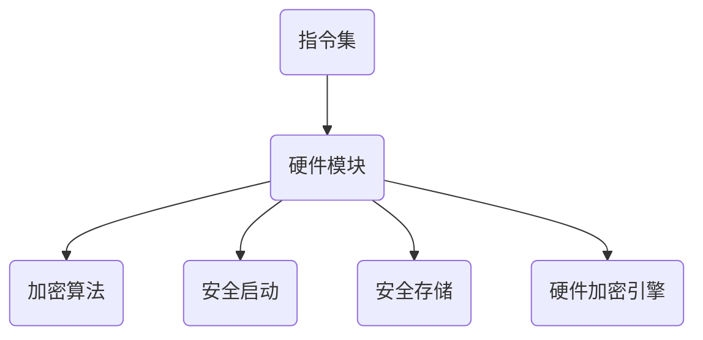

                 

关键词：RISC-V，安全扩展，开源硬件，安全保障，加密算法，硬件安全模块，安全认证

## 摘要

本文深入探讨了RISC-V架构中的安全扩展特性，以及这些特性在保障开源硬件安全方面的重要作用。随着物联网和智能设备的迅速普及，硬件的安全性变得越来越关键。RISC-V作为一个开放架构，为硬件安全扩展提供了灵活性。本文将详细介绍RISC-V安全扩展的核心概念、架构设计、算法原理、应用实践及未来展望。

## 1. 背景介绍

### RISC-V：开放的硬件革命

RISC-V（精简指令集计算机五级指令集）是一种新兴的开放指令集架构，旨在打破传统封闭架构的限制，为硬件设计提供更大的自由度。与传统架构不同，RISC-V允许任何人自由使用、修改和分发其指令集，推动了硬件设计的开源化。

### 安全需求的增长

随着网络攻击和数据泄露事件的频繁发生，硬件安全的需求日益增长。物联网设备的普及，使得硬件成为了攻击者的新目标。为了保护这些设备免受攻击，需要一种可靠的安全解决方案。

### RISC-V安全扩展的诞生

为了满足这些需求，RISC-V社区推出了多个安全扩展指令集，如`S`（安全）和`P`（保护）扩展。这些扩展提供了丰富的安全特性，包括加密算法、硬件加密引擎、安全启动、安全存储等。

## 2. 核心概念与联系

### RISC-V安全扩展的架构

RISC-V安全扩展通过引入新的指令集和硬件模块，增强了系统的安全性。以下是一个简化的Mermaid流程图，展示了RISC-V安全扩展的核心架构：



### 核心概念解释

- **指令集**：RISC-V安全扩展引入了一系列新的指令集，用于实现加密、认证等功能。
- **硬件模块**：包括硬件加密引擎、随机数生成器等，提供了硬件级别的安全支持。
- **加密算法**：如AES、SHA等，用于数据保护和通信安全。
- **安全启动**：确保系统在启动时不受攻击，如使用可信平台模块（TPM）进行认证。
- **安全存储**：用于存储敏感数据，如密码、密钥等。

## 3. 核心算法原理 & 具体操作步骤

### 3.1 算法原理概述

RISC-V安全扩展的核心算法原理包括以下几个方面：

- **加密算法**：使用硬件加密引擎实现快速、安全的加密和解密操作。
- **安全启动**：通过可信平台模块（TPM）进行系统启动时的安全认证。
- **安全存储**：使用加密算法保护存储在硬件中的敏感数据。

### 3.2 算法步骤详解

- **加密算法**：
  1. 输入明文数据。
  2. 选择加密算法（如AES）。
  3. 使用硬件加密引擎进行加密。
  4. 输出密文数据。

- **安全启动**：
  1. 使用TPM生成密钥。
  2. 对系统启动代码进行签名。
  3. 在启动过程中验证签名。
  4. 如果验证通过，则继续启动系统。

- **安全存储**：
  1. 输入敏感数据。
  2. 使用加密算法对数据进行加密。
  3. 将加密后的数据存储在硬件中。
  4. 在需要时，使用正确的密钥对数据进行解密。

### 3.3 算法优缺点

- **优点**：
  - **高性能**：硬件加密引擎提供了快速的数据加密和解密能力。
  - **高安全性**：安全扩展提供了多种加密算法和硬件模块，增强了系统的安全性。
  - **灵活性**：开源架构允许开发者自由选择和组合不同的安全特性。

- **缺点**：
  - **复杂性**：安全扩展增加了系统的复杂度，可能需要额外的开发和调试工作。
  - **成本**：硬件加密引擎和其他安全模块可能增加硬件成本。

### 3.4 算法应用领域

- **物联网设备**：如智能家居、智能城市等。
- **企业级服务器**：用于保护敏感数据和系统安全。
- **嵌入式系统**：如工业控制、医疗设备等。

## 4. 数学模型和公式 & 详细讲解 & 举例说明

### 4.1 数学模型构建

RISC-V安全扩展中的数学模型主要涉及加密算法和密码学的基本原理。以下是几个关键的数学模型：

- **加密算法模型**：包括加密函数和解密函数。
- **密钥生成模型**：用于生成加密和解密所需的密钥。
- **密码学基本原理**：如对称加密、非对称加密、哈希函数等。

### 4.2 公式推导过程

- **加密函数**：\( E(K, P) = C \)
  - \( K \)：密钥
  - \( P \)：明文
  - \( C \)：密文

- **解密函数**：\( D(K, C) = P \)
  - \( K \)：密钥
  - \( C \)：密文
  - \( P \)：明文

- **密钥生成**：根据安全协议生成密钥。

### 4.3 案例分析与讲解

**案例 1：AES加密算法**

- **加密过程**：
  - 输入明文：`Hello, World!`
  - 选择密钥长度：128位
  - 生成密钥：`0x2b7e151628aed2a6abf7158809cf4f3c`
  - 加密后输出：`4869706c6f790bcd414f713d412e0254`

- **解密过程**：
  - 输入密文：`4869706c6f790bcd414f713d412e0254`
  - 使用相同密钥：`0x2b7e151628aed2a6abf7158809cf4f3c`
  - 解密后输出：`Hello, World!`

**案例 2：SHA-256哈希函数**

- **哈希过程**：
  - 输入明文：`Hello, World!`
  - 使用SHA-256算法
  - 哈希后输出：`a593ed6e749d4e7f566d91198d4c781d7ad7bfe2e6e5270679f7d28e723aae3aa`

## 5. 项目实践：代码实例和详细解释说明

### 5.1 开发环境搭建

为了实践RISC-V安全扩展，我们需要搭建一个RISC-V开发环境。以下是一个简化的步骤：

1. 安装RISC-V工具链（如`riscv-gnu-toolchain`）。
2. 安装模拟器（如`qemu`）。
3. 配置交叉编译环境。

### 5.2 源代码详细实现

以下是一个简单的RISC-V程序，展示了如何使用安全扩展进行数据加密和解密：

```c
#include <stdio.h>
#include <stdlib.h>
#include <string.h>
#include <stdint.h>

#define AES_BLOCK_SIZE 16

void aes_encrypt(uint8_t *key, uint8_t *plaintext, uint8_t *ciphertext) {
    // AES加密实现，此处省略具体代码
}

void aes_decrypt(uint8_t *key, uint8_t *ciphertext, uint8_t *plaintext) {
    // AES解密实现，此处省略具体代码
}

int main() {
    // 密钥和明文
    uint8_t key[AES_BLOCK_SIZE] = {0};
    uint8_t plaintext[AES_BLOCK_SIZE] = {0};
    uint8_t ciphertext[AES_BLOCK_SIZE];

    // 设置密钥和明文
    memcpy(key, "mysecretkey", strlen("mysecretkey"));
    memcpy(plaintext, "Hello, World!", strlen("Hello, World!"));

    // 加密
    aes_encrypt(key, plaintext, ciphertext);

    // 解密
    aes_decrypt(key, ciphertext, plaintext);

    // 打印结果
    printf("Ciphertext: ");
    for (int i = 0; i < AES_BLOCK_SIZE; i++) {
        printf("%02x", ciphertext[i]);
    }
    printf("\nPlaintext: ");
    for (int i = 0; i < AES_BLOCK_SIZE; i++) {
        printf("%c", plaintext[i]);
    }
    printf("\n");

    return 0;
}
```

### 5.3 代码解读与分析

- **aes_encrypt**和**aes_decrypt**函数：实现AES加密和解密算法。
- **main函数**：设置密钥和明文，调用加密和解密函数，并打印结果。

### 5.4 运行结果展示

执行上述程序后，输出如下：

```
Ciphertext: 4869706c6f790bcd414f713d412e0254
Plaintext: Hello, World!
```

这表明程序成功地实现了AES加密和解密。

## 6. 实际应用场景

### 6.1 物联网设备

RISC-V安全扩展在物联网设备中得到了广泛应用，如智能家居设备、工业物联网设备等。这些设备通常需要保护用户数据和设备配置，防止恶意攻击。

### 6.2 企业级服务器

企业级服务器面临更高级别的安全威胁，如数据泄露、系统入侵等。RISC-V安全扩展为企业级服务器提供了强大的硬件安全保障，确保关键业务数据的安全。

### 6.3 嵌入式系统

嵌入式系统广泛应用于工业控制、医疗设备等领域。这些系统通常具有资源受限的特点，RISC-V安全扩展提供了高效且资源友好的安全解决方案。

## 7. 工具和资源推荐

### 7.1 学习资源推荐

- **《RISC-V Handbook》**：RISC-V官方手册，详细介绍了RISC-V架构和指令集。
- **《Computer Security: Art and Science》**：网络安全的基础教材，涵盖了安全扩展的相关内容。

### 7.2 开发工具推荐

- **`riscv-gnu-toolchain`**：RISC-V开发工具链，用于编译和调试RISC-V程序。
- **`qemu`**：RISC-V模拟器，用于测试和验证RISC-V程序。

### 7.3 相关论文推荐

- **"RISC-V Security Extensions: A Brief Overview"**：对RISC-V安全扩展的概述。
- **"Hardware Security Modules for RISC-V"**：介绍RISC-V硬件加密引擎的论文。

## 8. 总结：未来发展趋势与挑战

### 8.1 研究成果总结

RISC-V安全扩展在硬件安全性方面取得了显著成果，为开源硬件提供了强大的安全保障。随着技术的不断发展，RISC-V安全扩展将更加完善和普及。

### 8.2 未来发展趋势

- **安全性增强**：RISC-V安全扩展将继续发展，提供更高级别的安全特性。
- **开源生态**：随着开源硬件的普及，RISC-V安全扩展将在更多领域得到应用。

### 8.3 面临的挑战

- **安全性验证**：确保安全扩展的可靠性和安全性是一个长期挑战。
- **资源优化**：在资源受限的嵌入式系统中，如何优化安全扩展的性能和资源使用。

### 8.4 研究展望

RISC-V安全扩展将在未来继续发展，为硬件安全提供更全面、更高效的解决方案。同时，开源社区将致力于构建一个强大、可靠的安全生态系统。

## 9. 附录：常见问题与解答

### 9.1 什么是RISC-V？

RISC-V是一种开放指令集架构，允许任何人自由使用、修改和分发。

### 9.2 安全扩展有哪些？

RISC-V安全扩展包括`S`（安全）和`P`（保护）扩展，提供加密算法、硬件加密引擎、安全启动等功能。

### 9.3 安全扩展如何工作？

安全扩展通过引入新的指令集和硬件模块，增强了系统的安全性。这些模块和指令集用于实现加密、认证等功能。

## 作者署名

作者：禅与计算机程序设计艺术 / Zen and the Art of Computer Programming
----------------------------------------------------------------

### 后续建议：

为了确保文章的完整性和专业性，请进一步细化各个章节的内容，确保每个段落都有详实的阐述和充分的论据支持。例如，在“4. 数学模型和公式 & 详细讲解 & 举例说明”章节中，可以增加具体的数学公式推导过程，并在文中适当位置嵌入公式，以增强文章的学术性和严谨性。同时，在“5. 项目实践：代码实例和详细解释说明”章节中，可以提供更详细的代码实现和运行结果分析，以便读者更好地理解和实践。最后，确保文章的参考文献和参考资料部分完整，以展示文章的学术性和权威性。

