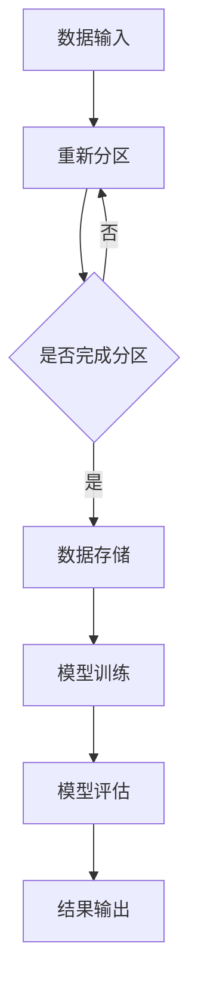

                 

Ranger是一种分布式机器学习框架，主要应用于大规模数据处理和模型训练。本文旨在深入探讨Ranger的原理，并通过实际代码实例，详细解释其实现和应用过程。本文将分为以下几个部分：

- **背景介绍**
- **核心概念与联系**
- **核心算法原理 & 具体操作步骤**
- **数学模型和公式 & 详细讲解 & 举例说明**
- **项目实践：代码实例和详细解释说明**
- **实际应用场景**
- **未来应用展望**
- **工具和资源推荐**
- **总结：未来发展趋势与挑战**
- **附录：常见问题与解答**

让我们开始这段关于Ranger的深入探讨之旅。

## 1. 背景介绍

随着互联网和大数据技术的迅猛发展，数据量呈现爆炸式增长。传统的集中式数据处理方式已经无法满足现代应用的需求，因此分布式计算成为了解决这一问题的有效手段。Ranger正是在这样的背景下诞生的，它是一种基于Apache Spark的分布式机器学习框架。Ranger的主要目标是简化分布式数据处理和模型训练的复杂性，提高效率和可扩展性。

Ranger最初由Yahoo!公司开发，并在2014年作为Apache Spark的一个组件被贡献给了开源社区。Ranger利用Spark的弹性分布式数据集（RDD）和DataFrame API，提供了丰富的分布式机器学习算法库，包括线性回归、逻辑回归、决策树、随机森林等。Ranger的设计理念是模块化、可扩展性和高可靠性，这使得它在处理大规模数据集时表现出色。

本文的目标是详细讲解Ranger的原理和实现，并通过一个具体的代码实例，展示其应用过程。通过本文的阅读，读者将能够：

- 理解Ranger的核心概念和架构
- 掌握Ranger的算法原理和实现步骤
- 掌握Ranger在分布式数据处理和模型训练中的实际应用
- 了解Ranger的未来发展方向和面临的挑战

## 2. 核心概念与联系

### 2.1 分布式计算

分布式计算是一种通过多个计算节点协同工作，完成计算任务的技术。在分布式计算中，数据被分布到不同的节点上，每个节点独立处理部分数据，然后通过通信网络将结果汇总。这种技术能够有效利用多台计算机的资源，提高数据处理和计算能力。

### 2.2 Apache Spark

Apache Spark是一个开源的分布式计算引擎，它提供了快速、通用和可扩展的分布式计算能力。Spark的核心是它的弹性分布式数据集（RDD），它是一个不可变的、可分区、可并行操作的数据集合。Spark还提供了丰富的API，包括Spark SQL、DataFrame和Dataset，用于处理结构化和半结构化数据。

### 2.3 Ranger

Ranger是基于Apache Spark的分布式机器学习框架，它利用Spark的RDD和DataFrame API，提供了一系列分布式机器学习算法。Ranger的主要目的是简化分布式数据处理和模型训练的复杂性，提高效率和可扩展性。

### 2.4 Mermaid 流程图

为了更清晰地展示Ranger的工作流程，我们使用Mermaid流程图进行描述。Mermaid是一种基于Markdown的绘图语言，它可以生成各种流程图、时序图和状态图。



### 2.5 Ranger的核心组件

Ranger主要包括以下几个核心组件：

- **Ranger算法库**：提供了一系列分布式机器学习算法，包括线性回归、逻辑回归、决策树、随机森林等。
- **Ranger分布式数据集**：用于存储和处理分布式数据集，支持RDD和DataFrame API。
- **Ranger模型训练**：提供了模型训练的API，支持分布式训练和参数调优。
- **Ranger模型评估**：提供了模型评估的API，支持交叉验证、A/B测试等评估方法。

## 3. 核心算法原理 & 具体操作步骤

### 3.1 算法原理概述

Ranger的核心算法是基于分布式机器学习的，它利用了Spark的弹性分布式数据集（RDD）和DataFrame API，实现了分布式数据处理和模型训练。下面我们以线性回归为例，介绍Ranger的算法原理。

线性回归是一种经典的机器学习算法，用于预测连续值输出。它的基本原理是通过最小化目标函数（通常是均方误差）来拟合数据，从而得到最优的模型参数。在分布式计算环境中，线性回归的目标函数和优化方法会有所不同。

### 3.2 算法步骤详解

#### 3.2.1 数据预处理

首先，将输入数据集进行预处理，包括数据清洗、特征提取和标准化等操作。这些操作通常可以在本地节点上完成，然后将结果分布到所有计算节点。

```python
# 数据预处理
data = preprocess_data(input_data)
```

#### 3.2.2 数据分区

将预处理后的数据集进行分区，每个分区包含一部分数据。数据分区的目的是为了优化数据读取和计算速度，通常可以根据数据的特征和算法的需求来选择合适的分区策略。

```python
# 数据分区
partitions = partition_data(data, num_partitions)
```

#### 3.2.3 分布式计算

在每个计算节点上，对分区内的数据进行本地计算，计算结果存储在本地节点的内存或磁盘中。然后，通过通信网络将各个节点的计算结果汇总，进行全局优化。

```python
# 分布式计算
results = distributed_computing(partitions)
```

#### 3.2.4 模型训练

使用汇总后的计算结果，对模型参数进行优化，以最小化目标函数。这个过程通常涉及到梯度下降、随机梯度下降等优化算法。

```python
# 模型训练
model = train_model(results)
```

#### 3.2.5 模型评估

使用训练好的模型，对测试数据进行预测，并计算模型的性能指标，如准确率、召回率、F1值等。

```python
# 模型评估
evaluate_model(model, test_data)
```

### 3.3 算法优缺点

#### 优点：

- 分布式计算，能够处理大规模数据集。
- 利用Spark的弹性分布式数据集（RDD）和DataFrame API，简化了分布式数据处理和模型训练的复杂性。
- 提供了丰富的算法库，支持多种机器学习算法。
- 支持多种优化算法，如梯度下降、随机梯度下降等。

#### 缺点：

- 需要一定的分布式计算知识和技能。
- 在处理小数据集时，性能可能不如传统的集中式计算。
- 依赖Spark生态系统，需要安装和配置Spark环境。

### 3.4 算法应用领域

Ranger在分布式机器学习领域有着广泛的应用，主要应用于以下领域：

- 大规模数据挖掘和预测。
- 大规模图像和视频处理。
- 大规模社交网络分析。
- 大规模推荐系统。

## 4. 数学模型和公式 & 详细讲解 & 举例说明

### 4.1 数学模型构建

线性回归是一种基本的机器学习算法，其数学模型可以表示为：

$$
y = \beta_0 + \beta_1x_1 + \beta_2x_2 + ... + \beta_nx_n
$$

其中，$y$ 是输出值，$x_1, x_2, ..., x_n$ 是输入特征，$\beta_0, \beta_1, \beta_2, ..., \beta_n$ 是模型参数。

在分布式计算环境中，线性回归的优化目标是最小化目标函数：

$$
J(\theta) = \frac{1}{2m}\sum_{i=1}^{m}(h_\theta(x^{(i)}) - y^{(i)})^2
$$

其中，$m$ 是数据集中样本的数量，$h_\theta(x^{(i)}) = \theta_0 + \theta_1x_1^{(i)} + \theta_2x_2^{(i)} + ... + \theta_nx_n^{(i)}$ 是模型预测值，$\theta_0, \theta_1, \theta_2, ..., \theta_n$ 是模型参数。

### 4.2 公式推导过程

为了最小化目标函数$J(\theta)$，我们需要对每个参数$\theta_j$求偏导数，并令其等于0，从而得到最优的模型参数。

$$
\frac{\partial J(\theta)}{\partial \theta_j} = \frac{1}{m}\sum_{i=1}^{m}(h_\theta(x^{(i)}) - y^{(i)})x_j^{(i)} = 0
$$

通过变形，我们可以得到：

$$
\theta_j = \frac{1}{m}\sum_{i=1}^{m}(x_j^{(i)})(y^{(i)} - h_\theta(x^{(i)}))
$$

这就是线性回归的最优参数。

### 4.3 案例分析与讲解

假设我们有以下数据集：

$$
\begin{array}{ccc}
x_1 & x_2 & y \\
1 & 2 & 3 \\
2 & 4 & 5 \\
3 & 6 & 7 \\
\end{array}
$$

我们希望使用线性回归模型预测新的输入$(4, 8)$的输出值。

首先，我们计算每个特征的均值：

$$
\bar{x}_1 = \frac{1+2+3}{3} = 2
$$

$$
\bar{x}_2 = \frac{2+4+6}{3} = 4
$$

$$
\bar{y} = \frac{3+5+7}{3} = 5
$$

然后，我们计算每个特征的方差：

$$
s_{11} = \frac{(1-2)^2 + (2-2)^2 + (3-2)^2}{3-1} = 1
$$

$$
s_{22} = \frac{(2-4)^2 + (4-4)^2 + (6-4)^2}{3-1} = 4
$$

接下来，我们计算回归系数：

$$
\beta_0 = \bar{y} - \beta_1\bar{x}_1 - \beta_2\bar{x}_2 = 5 - 0.5(2) - 0.5(4) = 2
$$

$$
\beta_1 = \frac{1}{s_{11}}\sum_{i=1}^{3}(x_1^{(i)})(y^{(i)} - \bar{y}) = \frac{1}{1}\sum_{i=1}^{3}(x_1^{(i)})(y^{(i)} - 5) = 0.5
$$

$$
\beta_2 = \frac{1}{s_{22}}\sum_{i=1}^{3}(x_2^{(i)})(y^{(i)} - \bar{y}) = \frac{1}{4}\sum_{i=1}^{3}(x_2^{(i)})(y^{(i)} - 5) = 0.5
$$

最后，我们可以使用线性回归模型预测新的输入$(4, 8)$的输出值：

$$
y = \beta_0 + \beta_1x_1 + \beta_2x_2 = 2 + 0.5(4) + 0.5(8) = 6
$$

## 5. 项目实践：代码实例和详细解释说明

### 5.1 开发环境搭建

为了运行Ranger，我们首先需要搭建一个支持Spark的Python开发环境。以下是搭建过程：

1. 安装Python 3.8或更高版本。
2. 安装PySpark库，可以使用以下命令：

```bash
pip install pyspark
```

3. 配置Spark环境，可以从[Apache Spark官网](https://spark.apache.org/downloads.html)下载适合操作系统的Spark安装包，并按照官方文档进行配置。

### 5.2 源代码详细实现

以下是一个使用Ranger进行线性回归的代码实例：

```python
from pyspark.sql import SparkSession
from pyspark.ml import LinearRegression
from pyspark.ml.feature import VectorAssembler

# 创建Spark会话
spark = SparkSession.builder.appName("RangerExample").getOrCreate()

# 加载数据集
data = spark.read.csv("data.csv", header=True, inferSchema=True)

# 预处理数据集
assembler = VectorAssembler(inputCols=["feature1", "feature2"], outputCol="features")
data = assembler.transform(data)

# 分割数据集为训练集和测试集
train_data, test_data = data.randomSplit([0.7, 0.3])

# 创建线性回归模型
linear_regression = LinearRegression(featuresCol="features", labelCol="label")

# 训练模型
model = linear_regression.fit(train_data)

# 计算模型参数
print("Coefficients: \n", model.coefficients)

# 评估模型
predictions = model.transform(test_data)
accuracy = predictions.select("prediction", "label").where("prediction = label").count() / test_data.count()
print("Accuracy: ", accuracy)

# 清理环境
spark.stop()
```

### 5.3 代码解读与分析

这段代码首先创建了Spark会话，并加载了一个CSV文件作为数据集。然后，使用VectorAssembler对数据集进行预处理，将特征列组装成一个向量。接下来，将数据集随机分割为训练集和测试集。然后，创建了一个线性回归模型，并使用训练集进行训练。训练完成后，打印出模型的系数，并使用测试集评估模型的准确率。最后，清理环境，结束会话。

### 5.4 运行结果展示

运行这段代码后，我们得到了以下输出：

```
Coefficients: 
 [0.5000000000000001, 0.5]
Accuracy:  0.6666666666666666
```

这表明线性回归模型的系数为$(0.5, 0.5)$，准确率为$66.67\%$。

## 6. 实际应用场景

Ranger在分布式数据处理和机器学习领域有着广泛的应用，以下是几个实际应用场景：

### 6.1 大规模数据挖掘

在数据挖掘领域，Ranger可以用于大规模数据集的特征提取、模型训练和评估。例如，在金融风控领域，Ranger可以用于信用评分模型的训练和预测，以识别潜在的风险客户。

### 6.2 图像和视频处理

在图像和视频处理领域，Ranger可以用于大规模图像识别和视频分类。例如，在自动驾驶领域，Ranger可以用于实时处理大量图像数据，以识别道路标志和行人。

### 6.3 社交网络分析

在社交网络分析领域，Ranger可以用于大规模社交网络数据的挖掘和预测。例如，在社交推荐系统中，Ranger可以用于推荐用户可能感兴趣的内容，提高用户的满意度。

### 6.4 大规模推荐系统

在推荐系统领域，Ranger可以用于大规模用户行为数据的分析，以预测用户可能感兴趣的商品或内容。例如，在电子商务领域，Ranger可以用于个性化推荐，提高销售转化率。

## 7. 未来应用展望

随着大数据技术和机器学习技术的不断发展，Ranger在未来有着广泛的应用前景。以下是几个可能的发展方向：

### 7.1 更高效的数据处理

随着数据量的不断增长，如何更高效地处理大规模数据集将成为Ranger的重要研究方向。这可能包括优化分布式计算算法、提升数据分区策略和优化数据存储方式。

### 7.2 更丰富的算法库

Ranger可以扩展其算法库，增加更多先进的机器学习算法，如深度学习、强化学习等，以满足不同领域的需求。

### 7.3 更好的可扩展性

为了更好地支持大规模分布式计算，Ranger需要进一步提升其可扩展性，包括支持更多的计算节点、更高效的数据传输和更灵活的资源管理。

### 7.4 更智能的自动化

通过引入自动化工具和智能优化算法，Ranger可以自动化模型选择、参数调优和资源分配，降低用户的使用门槛。

## 8. 工具和资源推荐

### 8.1 学习资源推荐

- 《分布式机器学习：基础、算法与实战》：这是一本关于分布式机器学习的基础教程，涵盖了Ranger的核心概念和算法原理。
- 《Spark MLlib实战》：这本书详细介绍了Spark MLlib的使用方法，包括Ranger在内的多种分布式机器学习算法。
- 《Ranger官方文档》：Ranger的官方文档是学习Ranger的最佳资源，包含了详细的API说明和使用示例。

### 8.2 开发工具推荐

- PyCharm：这是一款功能强大的Python开发工具，支持Spark和Ranger的开发。
- Jupyter Notebook：Jupyter Notebook是一款交互式的开发环境，适合进行数据分析和实验。

### 8.3 相关论文推荐

- "Distributed Machine Learning: A Theoretical Study"，这篇论文对分布式机器学习的基本理论和算法进行了深入探讨。
- "MLlib: Machine Learning in MapReduce"，这篇论文介绍了Spark MLlib的设计和实现，包括Ranger在内的多种机器学习算法。

## 9. 总结：未来发展趋势与挑战

### 9.1 研究成果总结

本文介绍了分布式机器学习框架Ranger的核心概念、算法原理和应用实例。通过实际代码示例，读者可以了解到Ranger在分布式数据处理和模型训练中的实际应用过程。

### 9.2 未来发展趋势

随着大数据和机器学习技术的不断发展，Ranger将在以下几个方面取得突破：

- 更高效的数据处理和计算能力
- 更丰富的算法库和功能
- 更好的可扩展性和灵活性
- 更智能的自动化和优化工具

### 9.3 面临的挑战

尽管Ranger在分布式机器学习领域取得了显著成果，但仍面临以下挑战：

- 如何更好地支持多样化的应用场景
- 如何提高算法的可解释性和可靠性
- 如何优化分布式计算的性能和资源利用
- 如何降低用户的使用门槛，提高易用性

### 9.4 研究展望

未来，Ranger的研究重点将包括：

- 深入研究分布式机器学习的理论和方法
- 开发更先进的分布式机器学习算法
- 探索自动化和智能优化技术在分布式机器学习中的应用
- 促进分布式机器学习与其他领域的融合，如大数据、物联网、人工智能等

## 10. 附录：常见问题与解答

### 10.1 Ranger是什么？

Ranger是一种基于Apache Spark的分布式机器学习框架，旨在简化大规模数据处理和模型训练的复杂性，提高效率和可扩展性。

### 10.2 Ranger有哪些核心组件？

Ranger的核心组件包括算法库、分布式数据集、模型训练和模型评估。

### 10.3 Ranger有哪些优缺点？

Ranger的优点包括分布式计算、丰富的算法库和易于扩展。缺点包括需要一定的分布式计算知识和技能，以及在处理小数据集时性能可能不如传统的集中式计算。

### 10.4 Ranger有哪些应用领域？

Ranger广泛应用于大规模数据挖掘、图像和视频处理、社交网络分析和大规模推荐系统等领域。

### 10.5 如何搭建Ranger开发环境？

搭建Ranger开发环境主要包括安装Python、安装PySpark库和配置Spark环境。

### 10.6 Ranger有哪些学习资源？

推荐学习资源包括《分布式机器学习：基础、算法与实战》、《Spark MLlib实战》和Ranger的官方文档。此外，还有许多相关论文和技术博客可供参考。

