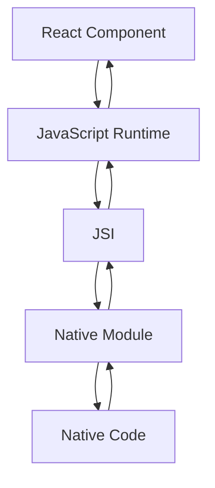

                 

关键词：React Native、原生交互、跨平台开发、性能优化、组件通信、最佳实践

摘要：本文将深入探讨React Native与原生交互的核心概念、原理、算法、应用场景以及未来发展趋势。通过详细的分析和实例代码展示，帮助开发者理解如何有效地将React Native与原生代码结合，实现高性能的跨平台应用开发。

## 1. 背景介绍

随着移动设备的普及和跨平台应用需求的增加，开发者们迫切需要一种能够同时服务于iOS和Android平台的技术。React Native作为一种流行的跨平台开发框架，凭借其高效的热更新能力和组件化设计，成为众多开发者的首选。然而，在实际应用中，React Native往往需要与原生代码进行交互，以充分利用原生平台的优势。

原生交互不仅涉及到UI层面的渲染优化，还包括组件间的通信、性能调优以及安全性考虑。因此，掌握React Native与原生代码的交互机制，对于开发者来说至关重要。

## 2. 核心概念与联系

### 2.1 React Native核心概念

React Native通过JavaScript核心库和原生模块封装，使得开发者可以使用JavaScript编写应用程序。核心概念包括：

- **组件（Components）**：React Native的基本构建块，类似于原生视图。
- **状态（State）**：组件内部的数据存储，用于响应用户交互。
- **属性（Props）**：组件外部传递的数据，用于控制组件的展现和行为。
- **生命周期（Lifecycle）**：组件从创建到销毁的各个阶段的回调函数。

### 2.2 原生模块与React Native模块的交互

原生模块（Native Modules）是React Native与原生代码交互的桥梁。原生模块通过Objective-C/Swift（iOS）和Java/Kotlin（Android）实现，能够提供原生功能，如GPS、相机、推送通知等。

- **JSI（JavaScript Interface）**：JavaScript与原生代码的交互接口，用于调用原生模块和从原生模块接收数据。
- **Bridge（桥接器）**：在JavaScript和原生代码之间传递数据的中间层，负责方法调用和数据转换。

### 2.3 Mermaid 流程图

以下是一个简单的Mermaid流程图，展示React Native组件与原生模块的交互过程：



### 3. 核心算法原理 & 具体操作步骤

#### 3.1 算法原理概述

React Native与原生交互的核心在于JSI和Bridge。当React Native组件需要调用原生模块时，通过JSI接口将请求发送到Bridge，Bridge再将请求转换为原生代码可识别的格式，并执行相应的原生方法。执行完成后，原生模块将结果返回给Bridge，最终通过JSI传递回JavaScript代码。

#### 3.2 算法步骤详解

1. **初始化Bridge**：启动React Native应用时，Bridge会被初始化，建立JavaScript和原生代码之间的通信通道。
2. **发送请求**：当React Native组件需要调用原生模块时，通过JSI接口发送请求。
3. **请求处理**：Bridge接收到请求后，将其转换为原生代码可识别的格式，并调用原生模块的方法。
4. **数据传输**：原生模块执行完成后，将结果通过Bridge返回给React Native代码。
5. **更新UI**：React Native组件接收到数据后，根据数据更新UI。

#### 3.3 算法优缺点

- **优点**：React Native与原生交互使得开发者可以同时编写iOS和Android平台的应用，提高开发效率。原生模块提供了丰富的功能，如GPS、相机等，能够充分利用原生平台的优势。
- **缺点**：Bridge的存在可能导致性能下降，尤其是在频繁调用原生模块时。同时，由于JavaScript和原生代码的隔离，开发过程中可能会遇到一些难以调试的问题。

#### 3.4 算法应用领域

React Native与原生交互广泛应用于移动应用开发，如社交媒体、电商、新闻应用等。通过合理的原生交互设计，可以提升应用的性能和用户体验。

### 4. 数学模型和公式 & 详细讲解 & 举例说明

#### 4.1 数学模型构建

在React Native与原生交互的过程中，我们可以使用数学模型来描述交互性能。以下是一个简单的模型：

\[ P = f(\alpha, \beta, \gamma) \]

其中：
- \( P \) 表示交互性能；
- \( \alpha \) 表示Bridge的延迟；
- \( \beta \) 表示原生模块的处理时间；
- \( \gamma \) 表示网络延迟。

#### 4.2 公式推导过程

1. **Bridge延迟**：Bridge延迟主要由JavaScript引擎和原生代码的通信开销决定，假设为 \( \alpha \)。
2. **原生模块处理时间**：原生模块处理时间取决于具体操作的复杂度，假设为 \( \beta \)。
3. **网络延迟**：网络延迟主要由数据传输距离和带宽决定，假设为 \( \gamma \)。

根据以上假设，我们可以推导出：

\[ P = \alpha + \beta + \gamma \]

#### 4.3 案例分析与讲解

假设一个场景：用户在应用中调用相机拍照。此时，交互性能可以表示为：

\[ P = \alpha + \beta + \gamma \]

其中：
- \( \alpha \) 为Bridge的延迟，假设为 20ms；
- \( \beta \) 为相机模块的处理时间，假设为 100ms；
- \( \gamma \) 为网络延迟，假设为 50ms。

根据公式计算：

\[ P = 20ms + 100ms + 50ms = 170ms \]

这意味着，用户调用相机拍照时，总交互时间约为 170ms。为了提高性能，我们可以优化Bridge延迟、减少原生模块处理时间或提高网络带宽。

### 5. 项目实践：代码实例和详细解释说明

#### 5.1 开发环境搭建

首先，我们需要搭建React Native开发环境。以下是详细的步骤：

1. **安装Node.js**：从[Node.js官网](https://nodejs.org/)下载并安装Node.js。
2. **安装React Native CLI**：在终端中运行以下命令：

   ```bash
   npm install -g react-native-cli
   ```

3. **创建React Native项目**：在终端中运行以下命令：

   ```bash
   npx react-native init MyProject
   ```

4. **启动模拟器**：在终端中运行以下命令：

   ```bash
   npx react-native run-android
   ```

或

   ```bash
   npx react-native run-ios
   ```

#### 5.2 源代码详细实现

以下是一个简单的React Native组件，用于调用原生相机模块：

```javascript
import React from 'react';
import { Button, View, Text } from 'react-native';
import { RNCamera } from 'react-native-camera';

const CameraApp = () => {
  const handleTakePicture = async () => {
    try {
      const options = { quality: 0.5, base64: true };
      const data = await camera.takePictureAsync(options);
      console.log(data);
    } catch (error) {
      console.error(error);
    }
  };

  return (
    <View style={{ flex: 1 }}>
      <RNCamera
        style={{ flex: 1 }}
        ref={(ref) => {
          camera = ref;
        }}
        type={RNCamera.Type.front}
      >
        <View
          style={{
            flex: 1,
            backgroundColor: 'transparent',
            flexDirection: 'row',
          }}
        >
          <Button title="Take Picture" onPress={handleTakePicture} />
        </View>
      </RNCamera>
    </View>
  );
};

export default CameraApp;
```

#### 5.3 代码解读与分析

- **组件引入**：引入React Native基础组件，如 `View`、`Text`、`Button` 和 `RNCamera`。
- **状态管理**：组件内部定义一个状态变量 `camera`，用于存储 `RNCamera` 实例。
- **事件处理**：定义 `handleTakePicture` 函数，用于处理拍照按钮点击事件。在函数中，调用 `camera.takePictureAsync` 方法，并传递拍照选项。
- **UI布局**：使用 `RNCamera` 组件作为根视图，并在其上添加一个透明视图，用于放置拍照按钮。

#### 5.4 运行结果展示

当运行该组件时，将显示一个带有拍照按钮的相机界面。点击拍照按钮后，应用将调用相机模块进行拍照，并在控制台输出拍照结果。

### 6. 实际应用场景

React Native与原生交互在实际应用场景中具有广泛的应用。以下是一些典型的应用场景：

- **社交媒体应用**：使用React Native开发跨平台社交媒体应用，通过原生交互实现相机、录音、推送通知等功能。
- **电商应用**：电商应用需要高效的性能和流畅的用户体验。React Native与原生交互可以帮助实现商品筛选、支付、订单管理等功能的优化。
- **新闻应用**：新闻应用需要实时更新内容。React Native与原生交互可以实现快速的内容加载和推送通知。

### 6.4 未来应用展望

随着React Native的不断发展，未来应用场景将更加广泛。以下是一些未来应用展望：

- **混合开发**：React Native将逐渐与原生开发相结合，形成混合开发模式。开发者可以在React Native组件中引入原生模块，同时保留原生平台的特有功能。
- **性能优化**：随着Bridge优化和编译技术的提升，React Native的性能将得到显著提升，为开发者提供更高效的跨平台开发体验。
- **新功能引入**：React Native将引入更多原生功能，如语音识别、AR/VR等，进一步丰富跨平台应用的可能性。

### 7. 工具和资源推荐

#### 7.1 学习资源推荐

- **React Native官方文档**：[React Native官方文档](https://reactnative.dev/docs/getting-started)
- **《React Native实战》**：由徐正华著，详细介绍了React Native的开发流程和最佳实践。
- **《React Native与原生交互实战》**：由李明辉著，深入探讨了React Native与原生交互的原理和实践。

#### 7.2 开发工具推荐

- **React Native CLI**：用于创建、运行和调试React Native项目。
- **Expo**：用于快速开发和部署React Native应用。
- **React Native Debugger**：用于调试React Native应用。

#### 7.3 相关论文推荐

- **"React Native: An Overview of the Framework and Its Advantages"**：介绍了React Native的基本原理和应用优势。
- **"Cross-Platform Mobile Development with React Native: A Comparative Study"**：比较了React Native与其他跨平台开发框架的性能和适用性。

### 8. 总结：未来发展趋势与挑战

React Native作为跨平台开发框架，在未来将继续发展壮大。然而，也面临着一些挑战，如性能优化、开发复杂性等。随着技术的不断进步，React Native将不断完善，为开发者提供更加高效、易用的开发工具。

### 9. 附录：常见问题与解答

**Q：如何优化React Native与原生交互的性能？**

A：优化React Native与原生交互性能的方法包括：
- 减少Bridge调用次数；
- 优化原生模块的实现；
- 使用异步加载和懒加载技术；
- 优化网络请求。

**Q：React Native与原生交互的安全性问题如何解决？**

A：React Native与原生交互的安全性问题可以通过以下方法解决：
- 限制Bridge调用的权限；
- 对Bridge调用进行加密；
- 定期更新React Native和原生模块，修复已知漏洞。

作者：禅与计算机程序设计艺术 / Zen and the Art of Computer Programming
```

