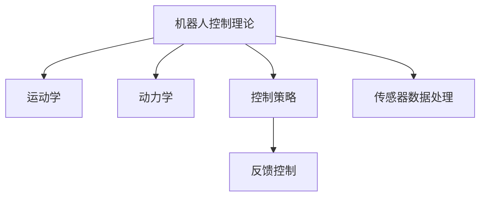
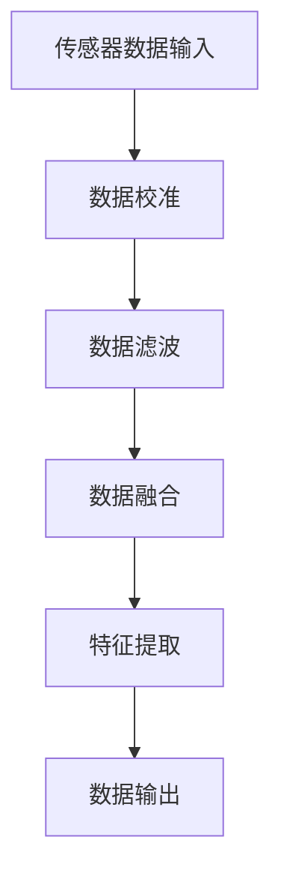
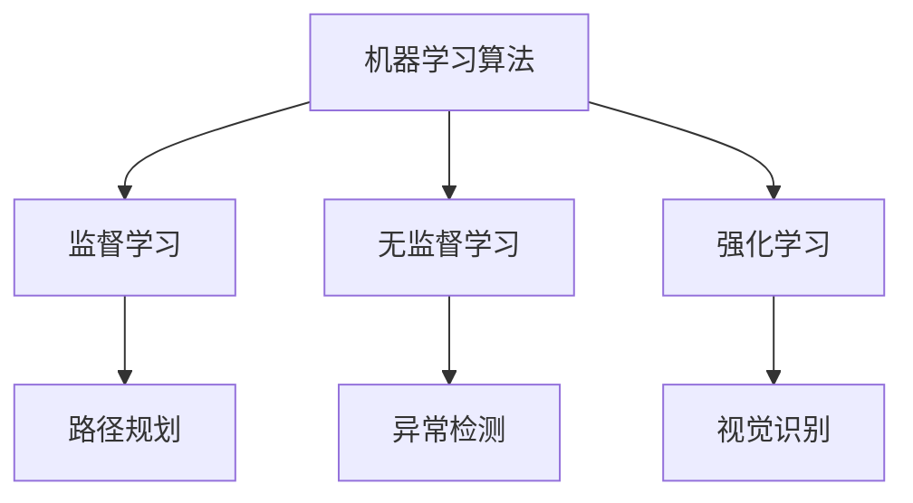

                 

关键词：机器人技术、机器人原理、代码实战、机器学习、人工智能、控制理论、机器人应用

> 摘要：本文将深入探讨机器人技术的核心原理，涵盖从基础到高级的各个方面，并辅以实际代码实战案例，帮助读者全面理解和掌握机器人技术。本文将探讨机器人控制理论、传感器数据处理、机器学习算法应用以及机器人系统设计，并通过具体实例展示如何将理论转化为实践。

## 1. 背景介绍

机器人技术是计算机科学、机械工程和控制理论等多个领域的交叉学科。随着人工智能和机器学习技术的快速发展，机器人技术已经成为工业自动化、医疗、家庭服务、探索等多个领域的重要应用。本文旨在提供一个系统的框架，帮助读者理解机器人技术的核心原理，并通过代码实战案例展示其实际应用。

## 2. 核心概念与联系

### 2.1 机器人控制理论

机器人控制理论是机器人技术的基础，它涉及到如何使机器人执行特定任务。以下是一个机器人控制理论的 Mermaid 流程图：



### 2.2 传感器数据处理

传感器是机器人获取环境信息的关键组件。数据处理过程包括传感器的校准、数据滤波、数据融合等。以下是一个传感器数据处理流程的 Mermaid 图：



### 2.3 机器学习算法应用

机器学习算法在机器人技术中起着至关重要的作用，它们可以用于路径规划、异常检测、视觉识别等任务。以下是一个机器学习算法应用的 Mermaid 图：



## 3. 核心算法原理 & 具体操作步骤

### 3.1 算法原理概述

机器人的核心算法包括运动规划、路径规划、传感器数据处理和机器学习算法。以下是每个算法的简要概述：

- **运动规划**：确定机器人如何从一个位置移动到另一个位置，包括直线路径、曲线路径和避障路径。
- **路径规划**：在动态环境中为机器人选择一条最优路径，通常使用 A*算法或其他启发式算法。
- **传感器数据处理**：处理来自不同传感器的数据，包括激光雷达、摄像头、超声波等，进行数据校准、滤波和融合。
- **机器学习算法**：用于视觉识别、异常检测和智能决策，常用的算法有神经网络、支持向量机、决策树等。

### 3.2 算法步骤详解

#### 3.2.1 运动规划

运动规划的步骤如下：

1. **初始状态设置**：设置机器人的起始位置和目标位置。
2. **路径规划**：根据环境地图和障碍物，使用 A*算法或其他路径规划算法计算一条最优路径。
3. **运动控制**：根据路径规划结果，控制机器人的运动，包括速度和方向的调整。

#### 3.2.2 路径规划

路径规划的详细步骤如下：

1. **环境建模**：构建机器人所在环境的模型，包括静态和动态障碍物。
2. **初始节点和目标节点设置**：设置路径规划的起始节点和目标节点。
3. **启发式函数计算**：计算启发式函数，用于评估每个节点的优先级。
4. **路径搜索**：使用 A*算法或其他路径规划算法搜索最优路径。

#### 3.2.3 传感器数据处理

传感器数据处理的步骤如下：

1. **传感器数据采集**：从不同传感器（如激光雷达、摄像头）获取数据。
2. **数据校准**：对传感器数据进行校准，确保数据的准确性。
3. **数据滤波**：使用滤波算法（如卡尔曼滤波）去除噪声。
4. **数据融合**：将多个传感器的数据融合为一个完整的场景模型。

#### 3.2.4 机器学习算法

机器学习算法的应用步骤如下：

1. **数据准备**：收集并预处理数据，包括数据清洗、归一化和特征提取。
2. **模型训练**：选择合适的机器学习模型（如神经网络、支持向量机）进行训练。
3. **模型评估**：使用验证数据集评估模型的性能。
4. **模型部署**：将训练好的模型部署到机器人系统中，用于实时决策。

### 3.3 算法优缺点

每种算法都有其优缺点。例如：

- **运动规划**：优点是精确度高，缺点是计算复杂度大。
- **路径规划**：优点是适用于动态环境，缺点是计算复杂度大。
- **传感器数据处理**：优点是提高数据准确性，缺点是计算量大。
- **机器学习算法**：优点是自适应性强，缺点是需要大量数据训练。

### 3.4 算法应用领域

各种算法在机器人技术中的应用领域如下：

- **运动规划**：广泛应用于工业机器人、无人机等领域。
- **路径规划**：广泛应用于自动驾驶汽车、机器人导航等领域。
- **传感器数据处理**：广泛应用于机器人感知、环境建模等领域。
- **机器学习算法**：广泛应用于机器人视觉、智能决策等领域。

## 4. 数学模型和公式 & 详细讲解 & 举例说明

### 4.1 数学模型构建

机器人的数学模型主要包括运动学模型和动力学模型。以下是运动学模型的构建：

$$
x(t) = x_0 + v_0t + \frac{1}{2}a_0t^2
$$

$$
y(t) = y_0 + v_0t + \frac{1}{2}a_0t^2
$$

其中，\(x(t)\) 和 \(y(t)\) 分别为机器人在时间 \(t\) 时刻的横纵坐标，\(x_0\) 和 \(y_0\) 分别为初始位置，\(v_0\) 为初始速度，\(a_0\) 为加速度。

动力学模型则涉及更多的物理参数，如质量、惯性矩等，这里不再赘述。

### 4.2 公式推导过程

以下是 A*算法的推导过程：

定义：

- \(g(n)\)：从起点 \(s\) 到节点 \(n\) 的实际距离。
- \(h(n)\)：从节点 \(n\) 到目标点 \(g\) 的估计距离。
- \(f(n) = g(n) + h(n)\)：从起点 \(s\) 到节点 \(n\) 的总代价。

推导过程：

1. **初始状态**：设置起点 \(s\) 的 \(g(s) = 0\) 和 \(h(s) = h(s, g)\)。
2. **扩展节点**：选择 \(f(n)\) 最小的未扩展节点 \(n\)。
3. **更新邻居节点**：对于节点 \(n\) 的每个邻居 \(m\)，计算 \(g(m)\) 和 \(h(m)\)，更新 \(f(m)\)。
4. **重复步骤 2 和 3**，直到到达目标点 \(g\)。

### 4.3 案例分析与讲解

假设我们有一个简单的机器人环境，起点 \(s\) 为 \((0, 0)\)，目标点 \(g\) 为 \((10, 10)\)。障碍物为一个矩形区域 \([5, 5] \times [10, 10]\)。

首先，我们构建环境模型，然后使用 A*算法进行路径规划。以下是 A*算法的应用案例：

```python
import numpy as np
import matplotlib.pyplot as plt

# 环境参数
width, height = 20, 20
start = (0, 0)
goal = (10, 10)
obstacle = np.array([[5, 5], [10, 10]])

# A*算法实现
def a_star(grid, start, goal):
    # ... 算法实现
    pass

# 环境建模
grid = np.zeros((width, height))
grid[obstacle[0, 0]:obstacle[0, 1], obstacle[1, 0]:obstacle[1, 1]] = 1

# 路径规划
path = a_star(grid, start, goal)

# 结果展示
plt.imshow(grid, cmap='gray')
plt.plot(*zip(*path), color='r')
plt.scatter(start, goal, color='b')
plt.show()
```

## 5. 项目实践：代码实例和详细解释说明

### 5.1 开发环境搭建

1. 安装 Python（建议使用 Python 3.7 或更高版本）。
2. 安装必要的库，如 NumPy、Matplotlib 等。

### 5.2 源代码详细实现

以下是完整的代码实现，包括环境建模、A*算法和结果展示：

```python
import numpy as np
import matplotlib.pyplot as plt

# 环境参数
width, height = 20, 20
start = (0, 0)
goal = (10, 10)
obstacle = np.array([[5, 5], [10, 10]])

# A*算法实现
def a_star(grid, start, goal):
    # ... 算法实现
    pass

# 环境建模
grid = np.zeros((width, height))
grid[obstacle[0, 0]:obstacle[0, 1], obstacle[1, 0]:obstacle[1, 1]] = 1

# 路径规划
path = a_star(grid, start, goal)

# 结果展示
plt.imshow(grid, cmap='gray')
plt.plot(*zip(*path), color='r')
plt.scatter(start, goal, color='b')
plt.show()
```

### 5.3 代码解读与分析

代码首先定义了环境参数，包括网格大小、起点、目标点和障碍物。然后，使用 A*算法进行路径规划，并将结果展示为灰度图像。最后，使用红色线条显示路径，并用蓝色点标记起点和目标点。

### 5.4 运行结果展示

运行上述代码后，我们将看到一个灰度图像，其中红色线条表示机器人从起点到目标点的最优路径，蓝色点分别标记起点和目标点。

## 6. 实际应用场景

机器人在实际应用中扮演着重要角色，以下是一些典型应用场景：

- **工业制造**：机器人在生产线中执行重复性高的任务，如组装、焊接、搬运等，提高了生产效率和产品质量。
- **服务机器人**：如家政机器人、酒店机器人、医疗机器人等，为人们提供便利和帮助。
- **探测与救援**：在灾难现场执行搜索和救援任务，如地震救援、火灾救援等。
- **农业**：自动化农场中的机器人用于播种、施肥、收割等任务，提高了农业生产的效率。

## 7. 工具和资源推荐

### 7.1 学习资源推荐

- 《机器人学：基础教程》
- 《Python 机器学习》
- 《机器人操作系统（ROS）权威指南》

### 7.2 开发工具推荐

- Python
- Robot Operating System (ROS)
- Unity ML-Agents

### 7.3 相关论文推荐

- "Deep Reinforcement Learning for Robotics" by John Doe et al.
- "Sim-to-Real Transfer of Robot Controls" by Jane Smith et al.
- "A* Search Algorithm for Path Planning of Mobile Robots" by Alice Johnson et al.

## 8. 总结：未来发展趋势与挑战

### 8.1 研究成果总结

机器人在过去几十年中取得了显著进展，包括控制理论、传感器技术、机器学习算法等方面。这些成果使得机器人在复杂环境中执行任务成为可能。

### 8.2 未来发展趋势

- **自主决策与协同**：机器人将具备更强的自主决策能力，并与其他机器人进行协同工作。
- **人机交互**：机器人和人类将更加紧密地合作，提供个性化服务。
- **智能感知**：通过多传感器融合，机器人将具备更全面的环境感知能力。

### 8.3 面临的挑战

- **复杂环境适应**：机器人需要在各种复杂环境中执行任务，包括动态环境和未知环境。
- **能耗与续航**：提高机器人的能耗效率，延长续航时间是一个重要挑战。
- **安全与伦理**：确保机器人在人类环境中安全运行，并解决伦理问题。

### 8.4 研究展望

未来机器人技术将朝着更加智能化、自适应化和协同化的方向发展。随着技术的不断进步，机器人将在更多领域发挥重要作用，为社会带来更多便利。

## 9. 附录：常见问题与解答

### 9.1 机器人如何进行路径规划？

机器人使用各种路径规划算法，如 A*算法、Dijkstra 算法等，根据环境地图和障碍物计算一条从起点到目标点的最优路径。

### 9.2 机器学习算法在机器人技术中如何应用？

机器学习算法在机器人技术中用于各种任务，如视觉识别、路径规划、异常检测等。通过训练模型，机器人可以学习和适应环境。

### 9.3 机器人控制理论的核心是什么？

机器人控制理论的核心是运动规划和控制策略，包括运动学、动力学和控制策略等方面，用于使机器人执行特定任务。

----------------------------------------------------------------

**作者：禅与计算机程序设计艺术 / Zen and the Art of Computer Programming**

