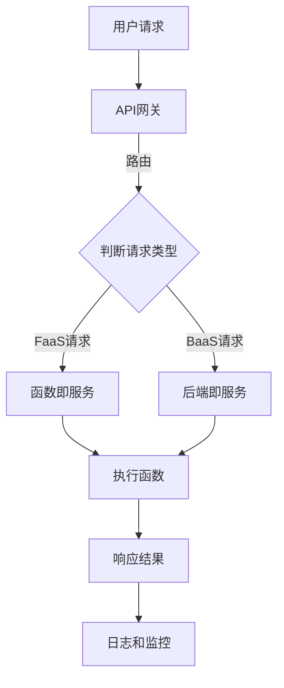

                 

关键词：Serverless架构、事件驱动、云计算、微服务、无服务器、Lambda架构、自动扩展、弹性、API网关、容器化、Kubernetes、FaaS、BaaS、无服务器数据库、函数即服务、后端即服务、API管理、动态资源分配、开发者体验、成本优化。

## 摘要

本文深入探讨了Serverless架构——一种以事件驱动为核心的云计算模型。Serverless架构正在逐步改变现代软件开发的方式，通过抽象底层基础设施，提供了一种全新的开发和部署应用程序的方法。本文将介绍Serverless架构的核心概念、优势、挑战以及其在实际应用中的多种实现方式。我们将通过详细的数学模型和实际项目案例，展示如何利用Serverless架构构建高效、弹性、成本优化的应用程序。最后，我们将展望Serverless架构的未来发展趋势，并探讨其在面对复杂性和安全性挑战时的解决方案。

## 1. 背景介绍

### 1.1 Serverless架构的起源

Serverless架构的起源可以追溯到云计算的早期阶段。随着云服务的普及，开发者逐渐意识到传统虚拟机模型存在的一些问题，如资源利用率低、运维成本高、扩展性差等。为了解决这些问题，Amazon Web Services（AWS）在2014年推出了Lambda函数服务，这是Serverless架构的雏形。Lambda允许开发者编写小型的函数，这些函数仅在有请求时才会执行，无需关注底层基础设施的管理。

### 1.2 事件驱动的核心

Serverless架构的核心在于其事件驱动模型。与传统的请求-响应模型不同，事件驱动模型强调系统应根据外部事件（如HTTP请求、数据库变更、文件上传等）来触发函数的执行。这种模型带来了更高的灵活性和更低的延迟，因为它仅当需要时才分配资源。

### 1.3 无服务器的概念

无服务器（Serverless）这个名字并不代表没有服务器，而是指开发者无需关心底层服务器和资源的配置与管理。云服务提供商（如AWS、Azure、Google Cloud等）负责管理基础设施，确保函数的可靠运行和自动扩展。

### 1.4 Serverless与微服务的关系

Serverless架构与微服务架构有许多相似之处，都强调模块化、独立部署和横向扩展。然而，Serverless架构通过事件驱动和函数即服务（FaaS）模型，进一步简化了服务之间的交互和部署过程。

## 2. 核心概念与联系

### 2.1 Serverless架构的核心概念

Serverless架构的核心概念包括函数即服务（FaaS）、后端即服务（BaaS）和API网关。以下是这些概念的定义和联系：

#### 函数即服务（FaaS）

FaaS是一种提供可编程、事件驱动的云计算服务的方式。开发者只需编写和管理函数代码，无需关注底层基础设施的配置和管理。AWS Lambda、Google Cloud Functions和Azure Functions都是FaaS服务的典型例子。

#### 后端即服务（BaaS）

BaaS提供了一种无需编写后端代码的云计算服务，开发者可以专注于应用程序的前端和业务逻辑。常见的BaaS服务包括数据库、文件存储、身份验证和推送通知等。

#### API网关

API网关是Serverless架构中的关键组件，它负责处理客户端请求，并将请求路由到相应的函数或服务。API网关还提供负载均衡、安全性和监控等功能。

### 2.2 Serverless架构的Mermaid流程图

以下是Serverless架构的Mermaid流程图：



### 2.3 核心概念的联系

Serverless架构通过FaaS和API网关结合，提供了一种简化和优化应用程序开发的方法。FaaS使得开发者可以专注于业务逻辑的实现，而无需关心底层基础设施的配置。API网关则提供了一种统一的方式来处理外部请求，确保请求的高效路由和响应。

## 3. 核心算法原理 & 具体操作步骤

### 3.1 算法原理概述

Serverless架构的核心算法原理在于事件驱动的函数调度和执行。以下是其主要组成部分：

#### 事件源

事件源可以是各种外部触发器，如HTTP请求、定时任务、数据库变更、文件上传等。

#### 函数调度

函数调度系统负责监听事件源，当有事件触发时，系统会根据配置选择合适的函数进行执行。

#### 函数执行

函数执行过程中，系统会为函数分配必要的计算资源，并在函数执行完成后释放资源。

#### 结果返回

函数执行完成后，结果会被返回给事件源或通过API网关发送给客户端。

### 3.2 算法步骤详解

#### 步骤1：配置事件源

首先，开发者需要配置事件源，如设置定时任务或连接数据库监听变更。

#### 步骤2：编写函数

开发者根据业务需求编写函数，这些函数可以是简单的逻辑处理，也可以是复杂的业务逻辑。

#### 步骤3：上传函数

将编写的函数上传到函数即服务（FaaS）平台，如AWS Lambda或Google Cloud Functions。

#### 步骤4：配置函数

在FaaS平台中，开发者需要配置函数的触发器，如设置定时任务或数据库变更监听。

#### 步骤5：测试函数

在配置完成后，开发者可以通过API网关或直接调用函数来进行测试。

#### 步骤6：部署函数

在测试通过后，开发者可以将函数部署到生产环境中。

### 3.3 算法优缺点

#### 优点

- **简化开发**：无需关注底层基础设施，开发者可以专注于业务逻辑的实现。
- **高弹性**：根据请求自动扩展和缩放，确保系统的高可用性。
- **低成本**：仅当函数运行时才计费，有助于降低成本。

#### 缺点

- **复杂性**：在复杂的系统中，事件驱动和函数调度的管理可能变得复杂。
- **性能限制**：由于函数的执行时间和资源限制，某些复杂任务可能不适合使用Serverless架构。

### 3.4 算法应用领域

Serverless架构适用于多种应用场景，如：

- **后台数据处理**：如日志分析、数据分析等。
- **移动应用后端**：提供API接口、身份验证和推送通知等。
- **物联网应用**：处理传感器数据、设备管理等。

## 4. 数学模型和公式 & 详细讲解 & 举例说明

### 4.1 数学模型构建

Serverless架构的数学模型主要涉及函数的执行时间和资源消耗。以下是一个简化的模型：

\[ \text{执行时间} = \text{函数代码大小} \times \text{执行速度} \]

\[ \text{资源消耗} = \text{函数执行时间} \times \text{资源单价} \]

### 4.2 公式推导过程

假设有一个函数，其代码大小为 \( C \) KB，执行速度为 \( S \) KB/s，资源单价为 \( P \) $/s。

- 执行时间 \( T \) 为：

\[ T = \frac{C}{S} \]

- 资源消耗 \( R \) 为：

\[ R = T \times P = \frac{C}{S} \times P \]

### 4.3 案例分析与讲解

假设一个函数的代码大小为100 KB，执行速度为10 KB/s，资源单价为1 $/s。

- 执行时间 \( T \) 为：

\[ T = \frac{100}{10} = 10 \text{秒} \]

- 资源消耗 \( R \) 为：

\[ R = 10 \times 1 = 10 \text{美元} \]

这意味着每次函数执行的成本为10美元。

### 4.4 案例分析与讲解

假设一个函数的代码大小为500 KB，执行速度为20 KB/s，资源单价为0.5 $/s。

- 执行时间 \( T \) 为：

\[ T = \frac{500}{20} = 25 \text{秒} \]

- 资源消耗 \( R \) 为：

\[ R = 25 \times 0.5 = 12.5 \text{美元} \]

这意味着每次函数执行的成本为12.5美元。

## 5. 项目实践：代码实例和详细解释说明

### 5.1 开发环境搭建

在本节中，我们将以AWS Lambda为例，介绍如何搭建Serverless开发环境。

#### 步骤1：注册AWS账号

首先，需要在AWS官方网站注册一个账号。

#### 步骤2：安装AWS CLI

在本地计算机上安装AWS CLI，以便通过命令行与AWS服务交互。

```bash
pip install awscli
```

#### 步骤3：配置AWS CLI

配置AWS CLI，设置访问密钥和秘密密钥。

```bash
aws configure
```

输入访问密钥、秘密密钥、默认区域和默认输出格式。

### 5.2 源代码详细实现

以下是一个简单的AWS Lambda函数示例，用于计算两个数字的和。

```python
# lambda_function.py

def lambda_handler(event, context):
    a = int(event['a'])
    b = int(event['b'])
    result = a + b
    return {
        'statusCode': 200,
        'body': json.dumps(result)
    }
```

### 5.3 代码解读与分析

这个Lambda函数接收一个包含两个数字的JSON对象作为输入，计算这两个数字的和，并将结果作为JSON对象返回。

### 5.4 运行结果展示

通过AWS CLI上传函数并测试。

```bash
aws lambda create-function --function-name add_two_numbers --zip-file fileb://lambda_function.py --runtime python3.8 --handler lambda_function.lambda_handler
aws lambda invoke --function-name add_two_numbers --payload file://input.json output.txt
```

输出结果将显示在output.txt文件中，如：

```json
{
  "a": 3,
  "b": 5
}
```

这意味着两个数字3和5的和为8。

## 6. 实际应用场景

### 6.1 后端服务

Serverless架构非常适合构建后端服务，如API接口、身份验证、通知服务等。通过FaaS和BaaS服务，开发者可以快速构建和部署高性能、高可用的后端服务。

### 6.2 物联网

Serverless架构在物联网（IoT）应用中也非常有优势。通过Lambda函数，可以实时处理来自传感器的数据，进行实时分析和决策。

### 6.3 数据分析

Serverless架构非常适合大规模数据处理任务。通过FaaS服务，可以轻松处理大量数据，实现实时分析和处理。

### 6.4 未来应用展望

随着技术的不断发展，Serverless架构将在更多领域得到应用。例如，在边缘计算、人工智能和区块链等领域，Serverless架构有望发挥重要作用。

## 7. 工具和资源推荐

### 7.1 学习资源推荐

- 《Serverless Architectures on AWS》
- 《Building Serverless Applications》
- 《Serverless Framework Documentation`

### 7.2 开发工具推荐

- AWS Lambda
- Google Cloud Functions
- Azure Functions
- Serverless Framework

### 7.3 相关论文推荐

- "Serverless Computing: Everything You Need to Know"
- "Serverless Architectures: The Evolution of Cloud Computing"
- "Designing and Implementing Serverless Systems"

## 8. 总结：未来发展趋势与挑战

### 8.1 研究成果总结

Serverless架构通过抽象底层基础设施，提供了一种高效、弹性、低成本的应用程序开发方法。研究成果表明，Serverless架构在多个领域具有广泛应用前景。

### 8.2 未来发展趋势

未来，Serverless架构将在更多领域得到应用，如边缘计算、人工智能和区块链。随着技术的发展，Serverless架构也将变得更加成熟和易用。

### 8.3 面临的挑战

尽管Serverless架构具有许多优势，但在复杂的系统中，事件驱动和函数调度的管理可能变得复杂。此外，性能限制和安全性问题也是Serverless架构面临的挑战。

### 8.4 研究展望

未来的研究将重点关注如何提高Serverless架构的性能和安全性，以及如何更好地适应复杂的应用场景。

## 9. 附录：常见问题与解答

### 9.1 什么是Serverless架构？

Serverless架构是一种云计算模型，通过抽象底层基础设施，提供了一种无需关注服务器配置和管理的应用程序开发方法。

### 9.2 Serverless架构的优势是什么？

Serverless架构的优势包括：简化开发、高弹性、低成本、易于扩展。

### 9.3 Serverless架构的缺点是什么？

Serverless架构的缺点包括：复杂性、性能限制、安全性问题。

### 9.4 Serverless架构适用于哪些场景？

Serverless架构适用于后端服务、物联网、数据分析等场景。

### 9.5 如何选择Serverless平台？

选择Serverless平台时，需要考虑成本、性能、易用性、生态支持等因素。

----------------------------------------------------------------

### 作者署名

作者：禅与计算机程序设计艺术 / Zen and the Art of Computer Programming

