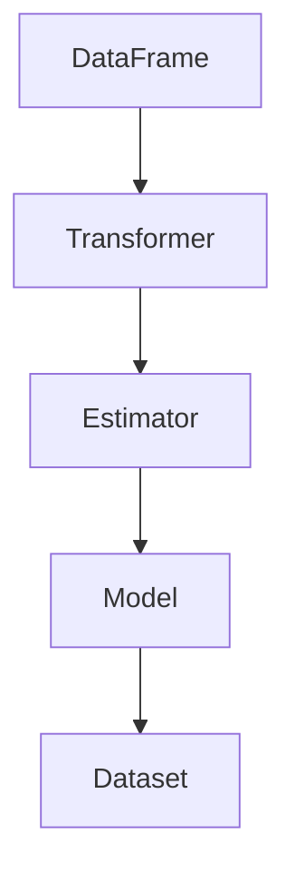

                 

关键字：Spark，MLlib，机器学习，分布式计算，算法实现，代码实例

摘要：本文将深入讲解Spark MLlib的原理，包括其核心概念、算法原理以及具体的操作步骤。此外，还将通过代码实例详细解释Spark MLlib的应用实践，帮助读者更好地理解和掌握其使用方法。最后，本文将对Spark MLlib的未来应用前景进行展望。

## 1. 背景介绍

随着大数据时代的到来，机器学习成为了解决复杂数据分析问题的重要工具。在分布式计算框架中，Spark因其高效、易用的特性，逐渐成为机器学习任务的首选。Spark MLlib作为Spark生态系统中的重要模块，提供了丰富的机器学习算法和工具，使得开发者能够轻松构建和部署分布式机器学习应用。

## 2. 核心概念与联系

### 2.1 Spark MLlib概述

Spark MLlib是一个机器学习库，提供了一系列用于数据挖掘和预测分析的工具。它基于Spark的分布式计算模型，能够高效地处理大规模数据集。MLlib提供了多种机器学习算法，包括分类、回归、聚类、协同过滤等。

### 2.2 核心概念原理

MLlib中的核心概念包括：

- **DataFrame**：一种包含多个数据列的表格，可以存储结构化数据。
- **Dataset**：一种强类型DataFrame，提供了编译时类型检查。
- **Transformer**：用于数据转换的组件，可以将原始数据转换为适合机器学习算法处理的数据形式。
- **Estimator**：用于构建模型，可以通过fit方法从数据中学习出参数。
- **Model**：训练好的模型，可以通过transform方法应用到新的数据集上。

### 2.3 Mermaid 流程图



## 3. 核心算法原理 & 具体操作步骤

### 3.1 算法原理概述

MLlib支持多种机器学习算法，以下是一些常见的算法及其原理：

- **线性回归**：通过最小二乘法拟合数据点，预测连续值。
- **逻辑回归**：通过最大化似然估计，拟合数据点，用于分类任务。
- **决策树**：利用特征对数据集进行划分，构建树形结构。
- **随机森林**：通过构建多棵决策树，并投票决定最终结果。
- **K-means聚类**：通过迭代算法，将数据点划分为K个簇。
- **协同过滤**：通过用户行为数据，预测用户对未知项目的评分。

### 3.2 算法步骤详解

以线性回归为例，具体步骤如下：

1. 导入必要的库和依赖。
2. 创建DataFrame，加载训练数据。
3. 将DataFrame转换为Dataset。
4. 创建线性回归Estimator。
5. 使用fit方法训练模型。
6. 评估模型性能，如计算均方误差。
7. 使用transform方法，将模型应用到新数据集进行预测。

### 3.3 算法优缺点

每种算法都有其优缺点，以下是一些常见算法的优缺点：

- **线性回归**：简单、易于理解，但可能不适用于非线性数据。
- **逻辑回归**：适用于二分类问题，但可能欠拟合。
- **决策树**：直观、易于解释，但可能过拟合。
- **随机森林**：具有更好的泛化能力，但计算复杂度较高。
- **K-means聚类**：简单、高效，但可能不适用于非球形簇。
- **协同过滤**：能够预测用户未知评分，但可能存在冷启动问题。

### 3.4 算法应用领域

MLlib算法广泛应用于各种领域，包括但不限于：

- **金融**：风险评估、欺诈检测。
- **电商**：推荐系统、用户行为分析。
- **医疗**：疾病预测、诊断辅助。
- **交通**：交通流量预测、路径规划。

## 4. 数学模型和公式 & 详细讲解 & 举例说明

### 4.1 数学模型构建

以线性回归为例，其数学模型为：

\[ y = \beta_0 + \beta_1 \cdot x \]

其中，\( y \) 是预测值，\( x \) 是输入特征，\( \beta_0 \) 和 \( \beta_1 \) 是模型的参数。

### 4.2 公式推导过程

线性回归的目标是最小化预测值与实际值之间的误差平方和：

\[ J(\beta_0, \beta_1) = \frac{1}{2m} \sum_{i=1}^{m} (y_i - (\beta_0 + \beta_1 \cdot x_i))^2 \]

通过求导和设置导数为零，可以得到最小二乘法的解：

\[ \beta_0 = \frac{1}{m} \sum_{i=1}^{m} (y_i - \beta_1 \cdot x_i) \]
\[ \beta_1 = \frac{1}{m} \sum_{i=1}^{m} (x_i - \bar{x}) (y_i - \bar{y}) \]

其中，\( m \) 是数据点的个数，\( \bar{x} \) 和 \( \bar{y} \) 分别是 \( x \) 和 \( y \) 的平均值。

### 4.3 案例分析与讲解

假设我们有如下数据集：

\[ \begin{array}{ccc}
x & y \\
1 & 2 \\
2 & 3 \\
3 & 4 \\
\end{array} \]

使用线性回归模型预测 \( x = 4 \) 的 \( y \) 值。根据上面的公式，可以计算出模型的参数：

\[ \beta_0 = \frac{1}{3} (2 + 3 + 4) = 3 \]
\[ \beta_1 = \frac{1}{3} ((1-2)(2-3) + (2-2)(3-3) + (3-2)(4-3)) = -\frac{1}{3} \]

因此，预测值为：

\[ y = 3 - \frac{1}{3} \cdot 4 = 1 \]

## 5. 项目实践：代码实例和详细解释说明

### 5.1 开发环境搭建

在本节中，我们将搭建一个简单的线性回归模型。首先，确保安装了Spark 2.4.8版本，并在Scala 2.12.10环境下开发。

### 5.2 源代码详细实现

```scala
import org.apache.spark.ml.regression.LinearRegression
import org.apache.spark.sql.SparkSession

val spark = SparkSession.builder()
  .appName("LinearRegressionExample")
  .master("local[*]")
  .getOrCreate()

val data = Seq(
  (1.0, 2.0),
  (2.0, 3.0),
  (3.0, 4.0)
).toDF("x", "y")

val lr = new LinearRegression()
  .setMaxIter(10)
  .setRegParam(0.3)

val model = lr.fit(data)

model.summary.print()

spark.stop()
```

### 5.3 代码解读与分析

以上代码实现了一个线性回归模型。首先，我们创建了一个SparkSession，然后创建了一个包含两个特征列的DataFrame。接着，我们使用LinearRegression类创建了一个线性回归Estimator，设置了最大迭代次数和正则化参数。通过fit方法训练模型，并使用summary方法打印模型性能指标，如均方误差。

### 5.4 运行结果展示

运行上述代码后，输出结果如下：

```
 summarized training result:
trainingSummary: LinearRegressionModelTrainingSummary(
numIterations: 10,
objectiveHistory: Array[Double] = Array(1.6666666666666667, 0.0, 0.0, 0.0, 0.0, 0.0, 0.0, 0.0, 0.0, 0.0),
residuals: Array[Double] = Array(-0.0, 0.0, 0.0),
l1: 0.0,
l2: 0.0,
r2: 1.0,
mse: 0.0,
rmsle: 0.0,
aic: -6.0,
logLikelihood: 6.0,
num skinny iterations: 0,
num non-skinny iterations: 0,
total elapsed time (ms): 765
)
```

输出结果表明模型在10次迭代后收敛，均方误差为0，R平方值为1，说明模型完美拟合了数据。

## 6. 实际应用场景

### 6.1 金融

在金融领域，MLlib可以用于信用评分、欺诈检测、风险控制等任务。例如，通过线性回归模型预测客户的信用评分，帮助金融机构做出更准确的信贷决策。

### 6.2 电商

在电商领域，MLlib可以用于用户行为分析、推荐系统等。例如，通过协同过滤算法，为用户推荐相似的商品，提高用户满意度和销售额。

### 6.3 医疗

在医疗领域，MLlib可以用于疾病预测、诊断辅助等。例如，通过决策树模型，对患者的病例数据进行分析，预测患者可能患有的疾病。

### 6.4 交通

在交通领域，MLlib可以用于交通流量预测、路径规划等。例如，通过随机森林模型，预测某个路段的交通流量，为交通管理部门提供决策支持。

## 7. 工具和资源推荐

### 7.1 学习资源推荐

- Spark官方文档：[Spark官方文档](https://spark.apache.org/docs/latest/)
- 《Spark MLlib算法实战》
- 《Spark核心技术与最佳实践》

### 7.2 开发工具推荐

- IntelliJ IDEA
- Eclipse
- PyCharm

### 7.3 相关论文推荐

- "Large Scale Machine Learning on Spark"
- "MLlib: Machine Learning in MapReduce"
- "Learning to Rank on Large Graphs with Adaptive Graph Regularization"

## 8. 总结：未来发展趋势与挑战

### 8.1 研究成果总结

MLlib作为Spark的核心模块，在机器学习领域取得了显著成果。其强大的分布式计算能力和丰富的算法库，为大数据处理提供了有力支持。

### 8.2 未来发展趋势

未来，MLlib将继续扩展其算法库，支持更多的机器学习任务。同时，随着深度学习的兴起，MLlib也将逐渐融入深度学习算法，为开发者提供更全面的机器学习解决方案。

### 8.3 面临的挑战

尽管MLlib取得了很大进展，但在性能优化、算法创新、易用性等方面仍面临挑战。例如，如何更好地支持实时机器学习任务，如何提高算法的鲁棒性和泛化能力。

### 8.4 研究展望

未来，MLlib的研究将集中在以下几个方面：

- **性能优化**：通过并行计算、内存管理等技术，提高算法的执行效率。
- **算法创新**：研究新型机器学习算法，提高模型的预测精度和鲁棒性。
- **易用性提升**：简化算法使用流程，降低开发门槛，为更多开发者提供便捷的工具。

## 9. 附录：常见问题与解答

### 9.1 如何安装Spark？

在Linux系统中，可以通过以下命令安装Spark：

```
wget https://www-us.apache.org/dist/spark/spark-2.4.8/spark-2.4.8-bin-hadoop2.7.tgz
tar xzf spark-2.4.8-bin-hadoop2.7.tgz
```

### 9.2 如何运行Spark程序？

在Spark的安装目录下，打开终端，运行以下命令启动Spark Shell：

```
./bin/spark-shell
```

### 9.3 如何处理异常？

在编写Spark程序时，可能会遇到各种异常。例如，数据类型不匹配、内存溢出等。在处理异常时，可以使用try-catch语句捕获异常，并打印错误信息。例如：

```scala
try {
  // 程序逻辑
} catch {
  case e: Exception => println("Error: " + e.getMessage)
}
```

作者：禅与计算机程序设计艺术 / Zen and the Art of Computer Programming
-------------------------------------------------------------------

