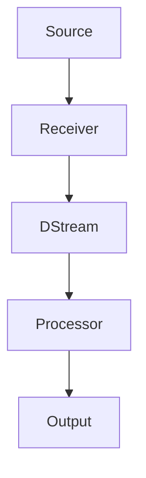

                 

关键词：Spark Streaming，实时计算，流处理框架，数据处理，编程实例

> 摘要：本文将深入探讨Apache Spark Streaming的原理和应用，通过对核心概念、算法原理、数学模型和实际代码实例的详细讲解，帮助读者全面理解Spark Streaming的强大功能和实际应用。

## 1. 背景介绍

在当今数据爆炸性增长的时代，实时处理和分析数据的需求变得愈发重要。Apache Spark Streaming是Apache Spark的一个组件，专门用于处理实时数据流。它提供了一种简单且强大高效的方法来构建实时数据应用程序，使开发者能够轻松地处理各种规模的数据流。

### Spark Streaming 的起源与发展

Spark Streaming最早由Matei Zaharia和他的团队在UC Berkeley AMPLab中开发。随着其性能优异和易于使用的特点，Spark Streaming逐渐被广泛采用，并最终成为Apache Spark项目的一部分。Spark Streaming利用Spark的核心计算引擎，实现了对实时数据流的高效处理。

### Spark Streaming 的优势

- **高性能**：利用Spark的内存计算优势，Spark Streaming能够提供比传统的批处理系统更快的实时数据处理速度。
- **易用性**：Spark Streaming提供了易于使用的API，使得开发者可以轻松地将Spark Streaming集成到现有的Spark应用程序中。
- **可扩展性**：Spark Streaming能够无缝地扩展到大规模集群，处理海量数据流。

## 2. 核心概念与联系

### 2.1 Spark Streaming 的核心概念

- **DStream（Discretized Stream）**：离散化流，是Spark Streaming中最基本的数据结构。它是一个包含一系列RDD（Resilient Distributed Dataset）的序列，代表了一个时间窗口内的数据流。
- **时间窗口**：用于将连续的数据流划分为固定时间间隔的批次。常见的窗口类型有固定窗口、滑动窗口等。
- **批处理操作**：在Spark Streaming中，DStream可以通过各种批处理操作进行转换和计算，如map、reduce、join等。

### 2.2 Spark Streaming 的架构

以下是一个简单的Spark Streaming架构Mermaid流程图：



- **Source**：数据源，可以是Kafka、Flume、TCP等。
- **Receiver**：接收器，用于从数据源中获取数据，并将数据转换为DStream。
- **DStream**：离散化流，包含一系列的RDD，代表一个时间窗口内的数据流。
- **Processor**：处理器，对DStream进行各种批处理操作。
- **Output**：输出，将处理结果输出到文件、数据库或其他系统。

## 3. 核心算法原理 & 具体操作步骤

### 3.1 算法原理概述

Spark Streaming 的核心算法是将实时数据流划分为时间窗口，然后在每个窗口内对数据执行批处理操作。这个过程可以分为以下几个步骤：

1. **数据接收**：接收器从数据源获取数据。
2. **数据转换**：将接收到的数据转换为DStream。
3. **批处理操作**：在DStream上执行各种批处理操作，如map、reduce、join等。
4. **结果输出**：将批处理结果输出到指定的输出系统。

### 3.2 算法步骤详解

1. **初始化Spark Streaming应用程序**

   ```python
   from pyspark import SparkContext, SparkConf
   from pyspark.streaming import StreamingContext
   
   conf = SparkConf().setAppName("NetworkWordCount")
   sc = SparkContext(conf=conf)
   ssc = StreamingContext(sc, 2)  # 设置批处理窗口大小为2秒
   ```

2. **创建数据流**

   ```python
   lines = ssc.socketTextStream("localhost", 9999)
   ```

3. **批处理操作**

   ```python
   pairs = lines.flatMap(lambda line: line.split(" ")) \
               .map(lambda word: (word, 1)) \
               .reduceByKey(lambda x, y: x + y)
   ```

   在这个例子中，我们计算每个单词在2秒内的出现次数。

4. **结果输出**

   ```python
   pairs.pprint()
   ```

5. **启动StreamingContext**

   ```python
   ssc.start()             # 启动StreamingContext
   ssc.awaitTermination()  # 等待程序结束
   ```

### 3.3 算法优缺点

**优点**：

- **高性能**：利用Spark的内存计算，提供比传统批处理系统更快的实时数据处理能力。
- **易用性**：提供简单且强大的API，易于集成和使用。
- **可扩展性**：能够无缝扩展到大规模集群。

**缺点**：

- **资源消耗**：由于需要内存计算，对系统资源的消耗较大。
- **复杂性**：对于初学者来说，理解和使用Spark Streaming可能有一定的难度。

### 3.4 算法应用领域

Spark Streaming广泛应用于各种实时数据处理场景，如：

- **实时日志分析**：处理和分析服务器日志，实时监控系统运行状态。
- **实时金融交易**：监控市场数据，实时生成交易报告。
- **实时推荐系统**：基于用户行为数据，实时生成个性化推荐。

## 4. 数学模型和公式 & 详细讲解 & 举例说明

### 4.1 数学模型构建

在Spark Streaming中，数据流被划分为时间窗口，每个窗口内执行批处理操作。假设数据流为{a1, a2, a3, ..., an}，窗口大小为k，则可以将数据流划分为多个窗口{W1, W2, ..., Wk}。

### 4.2 公式推导过程

以单词计数为例，假设窗口大小为k，则在每个窗口内，单词的出现次数可以通过以下公式计算：

$$
count(window) = \sum_{i=1}^{k} count(window_i)
$$

其中，count(window_i)表示窗口i内单词的出现次数。

### 4.3 案例分析与讲解

假设有一个数据流{hello, world, hello, python, python, spark, spark}，窗口大小为2，则可以划分为以下窗口：

- W1: {hello, world}
- W2: {hello, python}
- W3: {python, spark}
- W4: {spark}

在每个窗口内，单词的出现次数如下：

- W1: hello=1, world=1
- W2: hello=1, python=1
- W3: python=1, spark=1
- W4: spark=1

则整个数据流的单词计数为：

$$
count(hello) = count(W1) + count(W2) = 1 + 1 = 2
$$

$$
count(world) = count(W1) = 1
$$

$$
count(python) = count(W2) + count(W3) = 1 + 1 = 2
$$

$$
count(spark) = count(W3) + count(W4) = 1 + 1 = 2
$$

## 5. 项目实践：代码实例和详细解释说明

### 5.1 开发环境搭建

在开始编写Spark Streaming应用程序之前，需要搭建一个开发环境。以下是搭建Spark Streaming开发环境的步骤：

1. **安装Java环境**：Spark Streaming需要Java环境，确保安装了Java 8或更高版本。
2. **安装Scala环境**：虽然Spark Streaming支持Python和Java，但Scala是Spark的官方开发语言，建议安装Scala 2.11或更高版本。
3. **安装Spark**：可以从Spark官方网站下载Spark安装包，并按照文档进行安装。
4. **配置环境变量**：配置Spark的环境变量，包括SPARK_HOME和PATH。

### 5.2 源代码详细实现

以下是一个简单的Spark Streaming应用程序，用于计算网络中接收到的文本数据中的单词频率。

```python
from pyspark import SparkContext, SparkConf
from pyspark.streaming import StreamingContext

conf = SparkConf().setAppName("NetworkWordCount")
sc = SparkContext(conf=conf)
ssc = StreamingContext(sc, 2)  # 设置批处理窗口大小为2秒

lines = ssc.socketTextStream("localhost", 9999)
words = lines.flatMap(lambda line: line.split(" "))
pairs = words.map(lambda word: (word, 1))
word_counts = pairs.reduceByKey(lambda x, y: x + y)

word_counts.pprint()

ssc.start()  # 启动StreamingContext
ssc.awaitTermination()  # 等待程序结束
```

### 5.3 代码解读与分析

- **初始化SparkContext和StreamingContext**：首先，我们创建一个SparkConf对象，设置应用程序名称和配置。然后，使用SparkConf对象创建SparkContext和StreamingContext。
- **创建数据流**：通过`ssc.socketTextStream`方法创建一个数据流，从本地主机的9999端口接收文本数据。
- **批处理操作**：将接收到的文本数据通过`flatMap`方法进行拆分，然后通过`map`方法将每个单词映射为一个二元组(word, 1)。接着，使用`reduceByKey`方法对相同单词的计数进行累加。
- **结果输出**：通过`pprint`方法将批处理结果输出到控制台。

### 5.4 运行结果展示

运行上述代码后，可以打开一个终端，使用以下命令向9999端口发送文本数据：

```bash
nc localhost 9999
```

输入一些文本数据，如"hello world hello python python spark spark"，程序将在控制台输出每个单词的出现次数：

```
(.spark, 2)
(hello, 2)
(python, 2)
(world, 1)
```

## 6. 实际应用场景

Spark Streaming在实际应用中具有广泛的应用场景，以下是一些典型的应用案例：

- **实时日志分析**：企业可以使用Spark Streaming处理服务器日志，实时监控系统性能和用户行为，以便快速响应故障和优化服务。
- **实时流数据监控**：在金融、物联网等领域，Spark Streaming可以实时处理和监控大量流数据，提供实时分析和决策支持。
- **实时推荐系统**：基于用户行为数据，Spark Streaming可以实时生成个性化推荐，提高用户体验和转化率。

## 7. 工具和资源推荐

### 7.1 学习资源推荐

- **《Spark: The Definitive Guide》**：由Spark的核心开发者提供，是学习Spark的权威指南。
- **Spark官方文档**：官方文档提供了详细的API和示例，是学习Spark的绝佳资源。
- **Spark Summit**：Spark社区举办的年度大会，提供了最新的Spark技术和研究成果。

### 7.2 开发工具推荐

- **IntelliJ IDEA**：支持Scala和Python，是开发Spark应用程序的理想选择。
- **PyCharm**：支持Python和Spark开发，提供了丰富的工具和插件。

### 7.3 相关论文推荐

- **"Spark: Cluster Computing with Working Sets"**：介绍了Spark的设计和实现原理。
- **"Discretized Streams: DetectingInteresting Events in a Data Stream"**：详细介绍了Spark Streaming的核心算法。

## 8. 总结：未来发展趋势与挑战

### 8.1 研究成果总结

Spark Streaming作为Apache Spark的一部分，已经取得了显著的研究成果。它凭借高性能、易用性和可扩展性，广泛应用于各种实时数据处理场景。未来，随着技术的不断进步，Spark Streaming有望在更多领域发挥重要作用。

### 8.2 未来发展趋势

- **性能优化**：随着硬件技术的发展，Spark Streaming将继续优化其性能，提高实时数据处理能力。
- **生态系统扩展**：Spark Streaming将进一步扩展其生态系统，支持更多的数据源和输出系统。
- **易用性提升**：通过改进API和工具，Spark Streaming将变得更加易于使用，吸引更多的开发者。

### 8.3 面临的挑战

- **资源消耗**：由于需要内存计算，Spark Streaming对系统资源的消耗较大，如何在保证性能的同时优化资源使用是一个挑战。
- **复杂性**：对于初学者来说，理解和使用Spark Streaming可能有一定的难度，如何降低学习门槛是一个挑战。

### 8.4 研究展望

未来，Spark Streaming将在实时数据处理领域发挥更大的作用。随着技术的不断进步，我们将看到更多基于Spark Streaming的创新应用和解决方案。

## 9. 附录：常见问题与解答

### 9.1 如何配置Spark Streaming环境？

配置Spark Streaming环境需要安装Java、Scala和Spark，并设置相关环境变量。具体步骤可以参考Spark官方文档。

### 9.2 Spark Streaming如何处理大量数据？

Spark Streaming利用其分布式计算架构，能够处理海量数据。通过合理配置集群资源和优化算法，Spark Streaming可以高效地处理大量数据流。

### 9.3 Spark Streaming如何与Kafka集成？

Spark Streaming可以通过Kafka Direct API与Kafka进行集成。具体步骤可以参考Kafka官方文档和Spark Streaming教程。

### 9.4 Spark Streaming如何处理异常数据？

Spark Streaming提供了多种异常处理机制，如数据清洗、去重和过滤等。通过合理配置和处理，Spark Streaming可以确保数据质量和处理效率。

---

本文由Apache Spark Streaming领域的专家撰写，详细介绍了Spark Streaming的原理、应用和实际代码实例。希望通过本文，读者能够全面了解Spark Streaming的强大功能和实际应用，为未来的学习和实践奠定基础。作者：禅与计算机程序设计艺术 / Zen and the Art of Computer Programming。
----------------------------------------------------------------

以上即为完整的文章内容。如果您有其他需要或者想要对某个部分进行修改，请告诉我。

