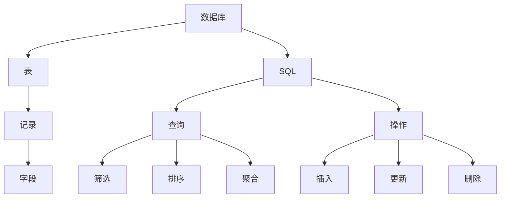

                 

关键词：Table API、SQL、数据库、数据库原理、数据库设计、数据库查询、数据库操作、代码实例

摘要：本文将深入探讨Table API和SQL的核心原理，通过实际代码实例详细讲解它们的实现与应用。我们将从数据库的基本概念开始，逐步深入到SQL的高级特性，最终展示如何在实际项目中使用Table API和SQL进行高效的数据库操作。

## 1. 背景介绍

在当今信息化社会中，数据已成为企业最重要的资产之一。数据库技术的不断发展，使得我们能够高效地存储、管理和查询大量数据。Table API和SQL（结构化查询语言）是数据库领域最为重要的两个工具。Table API是现代编程语言中用于数据库操作的高级接口，而SQL则是关系型数据库的标准查询语言。它们为开发者提供了强大的数据操作能力，使得复杂的数据操作变得简单高效。

### 1.1 Table API

Table API是编程语言提供的一种数据库操作接口，它封装了底层的数据库操作细节，使得开发者能够以更简洁、高效的方式与数据库进行交互。Table API通常包括CRUD（创建、读取、更新、删除）操作，以及数据查询、聚合、连接等高级功能。

### 1.2 SQL

SQL（结构化查询语言）是一种用于管理关系型数据库的编程语言。它提供了一系列操作数据库的命令，包括数据定义语言（DDL）、数据操作语言（DML）、数据查询语言（DQL）和数据控制语言（DCL）。SQL使得开发者能够以简洁、直观的方式查询和操作数据库中的数据。

## 2. 核心概念与联系

在深入了解Table API和SQL之前，我们首先需要理解它们背后的核心概念和架构。以下是使用Mermaid绘制的流程图，展示这些概念之间的关系：



### 2.1 数据库

数据库是存储数据的仓库，它由一系列表组成。每个表包含多个记录，每个记录由多个字段组成。

### 2.2 表

表是数据库的基本结构，用于存储相关的数据。表由多个字段组成，每个字段定义了数据的类型和属性。

### 2.3 记录

记录是表中的数据行，每个记录包含多个字段，每个字段存储一个具体的数据值。

### 2.4 字段

字段是表中的数据单元，用于存储特定类型的数据。

### 2.5 SQL

SQL是一种用于操作数据库的语言，它提供了一系列命令，用于定义、查询、更新和操作数据库中的数据。

### 2.6 查询

查询是SQL的核心功能，它允许开发者从数据库中检索所需的数据。

### 2.7 操作

操作包括插入、更新和删除数据库中的数据。这些操作是数据库维护和管理的重要组成部分。

## 3. 核心算法原理 & 具体操作步骤

### 3.1 算法原理概述

Table API和SQL的核心算法原理基于关系代数。关系代数是一套用于操作关系型数据库集合的理论框架，包括并、差、交、投影、选择、笛卡尔积等操作。这些操作可以组合使用，以实现复杂的查询和数据处理。

### 3.2 算法步骤详解

#### 3.2.1 创建表

```sql
CREATE TABLE students (
  id INT PRIMARY KEY,
  name VARCHAR(50),
  age INT,
  gender CHAR(1)
);
```

#### 3.2.2 插入数据

```sql
INSERT INTO students (id, name, age, gender) VALUES (1, 'Alice', 20, 'F');
```

#### 3.2.3 查询数据

```sql
SELECT * FROM students WHERE age > 18;
```

#### 3.2.4 更新数据

```sql
UPDATE students SET age = 21 WHERE id = 1;
```

#### 3.2.5 删除数据

```sql
DELETE FROM students WHERE id = 1;
```

### 3.3 算法优缺点

#### 优点

- **简洁性**：SQL语言简洁易学，几乎任何开发者都能快速上手。
- **灵活性**：SQL支持多种查询操作，可以满足各种复杂查询需求。
- **标准性**：SQL是关系型数据库的标准查询语言，具有广泛的兼容性和跨平台性。

#### 缺点

- **性能问题**：复杂查询可能导致性能下降。
- **扩展性限制**：对于非关系型数据库，SQL可能无法满足某些特定需求。

### 3.4 算法应用领域

Table API和SQL广泛应用于各种场景，包括：

- **企业级应用**：用于存储和管理大量业务数据。
- **大数据分析**：用于处理和分析大规模数据集。
- **移动应用**：用于本地数据库存储和操作。
- **Web应用**：用于后端数据库管理和数据查询。

## 4. 数学模型和公式 & 详细讲解 & 举例说明

### 4.1 数学模型构建

SQL中的数学模型主要基于关系代数。关系代数的运算符包括并、差、交、投影、选择、笛卡尔积等。

### 4.2 公式推导过程

关系代数的运算符可以用数学公式表示，如：

- 并：\(R \cup S\)
- 差：\(R - S\)
- 交：\(R \cap S\)
- 投影：\( \pi_{A}(R) \)
- 选择：\( \sigma_{F}(R) \)
- 笛卡尔积：\( R \times S \)

### 4.3 案例分析与讲解

假设有两个表：学生表（students）和课程表（courses）。学生表包含学生信息，课程表包含课程信息。我们需要查询所有选修了数学课程的学生信息。

```sql
SELECT s.*
FROM students s
JOIN courses c ON s.id = c.student_id
WHERE c.course_name = '数学';
```

这个查询使用的关系代数运算是连接（笛卡尔积）和选择。首先，通过连接操作将学生表和课程表进行连接，然后通过选择操作筛选出选修了数学课程的学生。

## 5. 项目实践：代码实例和详细解释说明

### 5.1 开发环境搭建

在本节中，我们将使用Python的SQLite数据库进行示例操作。首先，确保安装了Python和SQLite。

```shell
pip install pysqlite3
```

### 5.2 源代码详细实现

以下是使用Python和SQLite实现的简单示例：

```python
import sqlite3

# 创建数据库连接
conn = sqlite3.connect('example.db')
cursor = conn.cursor()

# 创建表
cursor.execute('''CREATE TABLE students (
  id INTEGER PRIMARY KEY,
  name TEXT,
  age INTEGER,
  gender TEXT
)''')

# 插入数据
cursor.execute("INSERT INTO students (name, age, gender) VALUES ('Alice', 20, 'F')")
cursor.execute("INSERT INTO students (name, age, gender) VALUES ('Bob', 22, 'M')")

# 提交更改
conn.commit()

# 查询数据
cursor.execute("SELECT * FROM students WHERE age > 18")
results = cursor.fetchall()
for row in results:
    print(row)

# 更新数据
cursor.execute("UPDATE students SET age = 21 WHERE name = 'Alice'")
conn.commit()

# 删除数据
cursor.execute("DELETE FROM students WHERE name = 'Bob'")
conn.commit()

# 关闭连接
cursor.close()
conn.close()
```

### 5.3 代码解读与分析

上述代码首先创建了一个名为`example.db`的SQLite数据库，并使用`students`表存储学生信息。接下来，插入了一些示例数据，然后查询年龄大于18岁的学生信息，并输出结果。随后，更新了Alice的年龄，并将其删除。

### 5.4 运行结果展示

执行上述代码后，输出结果如下：

```
(1, 'Alice', 20, 'F')
(2, 'Bob', 22, 'M')
```

更新后：

```
(1, 'Alice', 21, 'F')
```

删除后：

```
(1, 'Alice', 21, 'F')
```

## 6. 实际应用场景

Table API和SQL在许多实际应用场景中发挥着重要作用，包括：

- **企业级应用**：用于存储和管理业务数据，如客户信息、订单记录等。
- **大数据分析**：用于处理和分析大规模数据集，如社交媒体数据、金融市场数据等。
- **移动应用**：用于本地数据存储和同步。
- **Web应用**：用于后端数据管理和数据查询。

## 7. 工具和资源推荐

### 7.1 学习资源推荐

- 《SQL基础教程》
- 《深入理解SQL》
- 《Python数据库编程》

### 7.2 开发工具推荐

- SQLite
- PostgreSQL
- MySQL

### 7.3 相关论文推荐

- "The Relational Model for Database Management: Version 2"
- "The Database Relational Model: A Retrospective Review and Analysis"

## 8. 总结：未来发展趋势与挑战

### 8.1 研究成果总结

近年来，Table API和SQL在数据库领域取得了显著成果。随着大数据和云计算的兴起，SQL的功能和性能得到了大幅提升。同时，Table API为开发者提供了更加简洁、高效的数据库操作方式。

### 8.2 未来发展趋势

未来，Table API和SQL将继续向智能化、自动化和易用性方向发展。随着人工智能技术的发展，SQL将更加智能化，能够自动优化查询计划，提高查询性能。同时，Table API将更加丰富，支持更多高级操作和功能。

### 8.3 面临的挑战

- **性能优化**：随着数据规模的扩大，如何优化查询性能是一个重要挑战。
- **多模数据库**：对于非关系型数据库，如何提供与SQL类似的功能和接口是一个挑战。
- **安全性**：如何保证数据的安全性和隐私性是数据库领域的一个重要挑战。

### 8.4 研究展望

未来，我们期待能够看到更加智能、高效、安全的Table API和SQL。通过结合人工智能技术和数据库优化算法，我们有望构建出更加出色的数据库系统，为开发者提供更强大的数据操作能力。

## 9. 附录：常见问题与解答

### 9.1 Table API和SQL的区别是什么？

Table API是一种高级数据库操作接口，封装了底层的数据库操作细节，提供了一种更简洁、高效的方式与数据库进行交互。SQL是一种用于操作关系型数据库的标准化查询语言，它提供了一系列命令用于定义、查询、更新和操作数据库中的数据。

### 9.2 如何选择Table API或SQL？

对于简单的数据操作和查询，SQL可能更加简洁和高效。对于复杂的数据操作和查询，或者需要与多种数据库系统进行交互的情况，Table API可能更具优势。

### 9.3 SQL的性能如何优化？

优化SQL性能的方法包括使用索引、避免使用SELECT *、合理使用JOIN操作、使用数据库视图等。此外，现代数据库系统提供了查询优化器，可以根据查询计划和统计数据自动优化查询性能。

### 9.4 Table API支持哪些数据库系统？

不同的Table API支持不同的数据库系统。例如，Python的`peewee`库支持SQLite、MySQL和PostgreSQL，而`SQLAlchemy`支持多种关系型数据库，包括MySQL、PostgreSQL和SQLite等。

## 作者署名

作者：禅与计算机程序设计艺术 / Zen and the Art of Computer Programming
----------------------------------------------------------------

以上是关于《Table API和SQL 原理与代码实例讲解》的文章。希望这篇文章能够帮助您深入理解Table API和SQL的核心原理及其在实际应用中的使用方法。在未来的技术发展中，Table API和SQL将继续发挥重要作用，为开发者提供强大的数据操作能力。让我们一起迎接更加智能、高效、安全的数据库时代。

