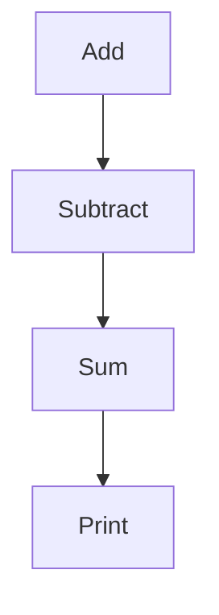

                 

关键词：TensorFlow，深度学习，框架，入门，精通，算法原理，数学模型，项目实践，应用场景，工具推荐，发展趋势与挑战

> 摘要：本文将深入探讨TensorFlow深度学习框架，从基础概念到高级应用，帮助读者全面掌握TensorFlow的使用技巧和实战经验。通过详细的算法原理讲解、数学模型推导、项目实践案例和未来发展趋势分析，本文旨在为初学者和从业者提供一个全面、系统的学习指南。

## 1. 背景介绍

深度学习作为人工智能的核心技术之一，近年来取得了飞速的发展。Google大脑团队在2015年推出的TensorFlow，成为深度学习领域的里程碑式工具，被广泛应用于图像识别、自然语言处理、语音识别等多个领域。TensorFlow不仅具有出色的性能和灵活性，还提供了丰富的API和工具，使其成为深度学习研究者和开发者的首选框架。

本文将围绕TensorFlow的核心概念、算法原理、数学模型、项目实践和未来发展趋势展开讨论，旨在帮助读者从入门到精通，全面掌握TensorFlow深度学习框架。

## 2. 核心概念与联系

TensorFlow的核心概念包括计算图（Computational Graph）、节点（Operation）和边（Tensor）。计算图是一种数据流图，用于表示计算过程中的各种操作和中间变量。节点表示计算操作，边表示数据流动。这种图式结构使得TensorFlow具有高度的灵活性和并行计算能力。

下面是一个简单的TensorFlow计算图示例，使用Mermaid流程图表示：



在这个示例中，A和B是两个加法操作，C是对两个结果求和的操作，D是打印结果的输出操作。

### 2.1 计算图与动态计算图

计算图可以分为静态计算图和动态计算图。静态计算图在构建时就已经确定，而动态计算图则可以在运行时动态构建。TensorFlow主要使用动态计算图，这使得模型构建更加灵活。

### 2.2 张量与操作

Tensor是TensorFlow中的基本数据结构，类似于多维数组。操作（Operation）是对Tensor执行的计算。例如，加法操作（Add）接受两个Tensor作为输入，输出它们的和。

### 2.3 会话（Session）

会话是TensorFlow程序运行的环境。在会话中，可以执行计算图中的操作，获取Tensor的值，以及运行梯度计算等。会话通过`tf.Session()`创建，使用`run()`方法执行操作。

## 3. 核心算法原理 & 具体操作步骤

### 3.1 算法原理概述

TensorFlow的核心算法基于自动微分和反向传播算法。自动微分是一种用于计算复合函数导数的算法，而反向传播算法则是一种用于计算神经网络参数梯度的算法。

### 3.2 算法步骤详解

1. **构建计算图**：首先，根据业务需求构建计算图，定义各种操作和中间变量。
2. **初始化变量**：初始化模型参数和变量。
3. **前向传播**：计算输入数据经过神经网络的前向传播过程，得到输出结果。
4. **计算损失**：计算预测结果与真实结果之间的误差，得到损失函数值。
5. **反向传播**：计算损失函数对模型参数的梯度。
6. **优化参数**：根据梯度更新模型参数，减小损失函数值。
7. **迭代训练**：重复执行前向传播、计算损失、反向传播和优化参数的步骤，直到模型收敛。

### 3.3 算法优缺点

**优点**：

- **灵活性强**：支持动态计算图，易于实现复杂模型。
- **并行计算**：基于图式结构，支持分布式计算，提高计算效率。
- **丰富的API和工具**：提供丰富的API和工具，支持各种深度学习任务。

**缺点**：

- **学习曲线较陡**：对于初学者，理解和掌握TensorFlow需要一定的时间和精力。
- **资源消耗较大**：由于TensorFlow是基于Python实现的，其运行速度相对较慢，资源消耗较大。

### 3.4 算法应用领域

TensorFlow广泛应用于图像识别、自然语言处理、语音识别、强化学习等多个领域。以下是一些典型应用案例：

- **图像识别**：使用卷积神经网络（CNN）对图像进行分类和检测。
- **自然语言处理**：使用循环神经网络（RNN）和长短期记忆网络（LSTM）处理文本数据，实现机器翻译、情感分析等任务。
- **语音识别**：使用卷积神经网络和循环神经网络对语音信号进行识别和转换。

## 4. 数学模型和公式 & 详细讲解 & 举例说明

### 4.1 数学模型构建

深度学习模型通常由多个层次组成，每个层次都包含一系列的线性变换和激活函数。下面是一个简单的多层感知机（MLP）模型：

$$
y = \sigma(W_2 \cdot \sigma(W_1 \cdot x + b_1) + b_2)
$$

其中，$x$为输入数据，$y$为输出结果，$W_1$和$W_2$分别为第一层和第二层的权重矩阵，$b_1$和$b_2$分别为第一层和第二层的偏置项，$\sigma$为激活函数。

### 4.2 公式推导过程

多层感知机模型的训练目标是找到最优的权重矩阵和偏置项，使得预测结果与真实结果之间的误差最小。为了实现这个目标，我们可以使用梯度下降算法来更新权重矩阵和偏置项。

假设损失函数为：

$$
J(W_1, W_2, b_1, b_2) = \frac{1}{2} \sum_{i=1}^N (y_i - \sigma(W_2 \cdot \sigma(W_1 \cdot x_i + b_1) + b_2))^2
$$

其中，$N$为样本数量，$y_i$和$x_i$分别为第$i$个样本的真实结果和输入数据。

为了求解最优的权重矩阵和偏置项，我们需要计算损失函数对每个参数的梯度：

$$
\frac{\partial J}{\partial W_1} = -\sum_{i=1}^N (y_i - \sigma(W_2 \cdot \sigma(W_1 \cdot x_i + b_1) + b_2)) \cdot \sigma'(W_2 \cdot \sigma(W_1 \cdot x_i + b_1) + b_1) \cdot x_i
$$

$$
\frac{\partial J}{\partial W_2} = -\sum_{i=1}^N (y_i - \sigma(W_2 \cdot \sigma(W_1 \cdot x_i + b_1) + b_2)) \cdot \sigma'(W_2 \cdot \sigma(W_1 \cdot x_i + b_1) + b_1) \cdot \sigma(W_1 \cdot x_i + b_1)
$$

$$
\frac{\partial J}{\partial b_1} = -\sum_{i=1}^N (y_i - \sigma(W_2 \cdot \sigma(W_1 \cdot x_i + b_1) + b_2)) \cdot \sigma'(W_2 \cdot \sigma(W_1 \cdot x_i + b_1) + b_1)
$$

$$
\frac{\partial J}{\partial b_2} = -\sum_{i=1}^N (y_i - \sigma(W_2 \cdot \sigma(W_1 \cdot x_i + b_1) + b_2)) \cdot \sigma'(W_2 \cdot \sigma(W_1 \cdot x_i + b_1) + b_1)
$$

然后，我们可以使用梯度下降算法来更新权重矩阵和偏置项：

$$
W_1 \leftarrow W_1 - \alpha \cdot \frac{\partial J}{\partial W_1}
$$

$$
W_2 \leftarrow W_2 - \alpha \cdot \frac{\partial J}{\partial W_2}
$$

$$
b_1 \leftarrow b_1 - \alpha \cdot \frac{\partial J}{\partial b_1}
$$

$$
b_2 \leftarrow b_2 - \alpha \cdot \frac{\partial J}{\partial b_2}
$$

其中，$\alpha$为学习率。

### 4.3 案例分析与讲解

假设我们有一个简单的二分类问题，输入数据为两个特征值$x_1$和$x_2$，目标值为$y \in \{0, 1\}$。我们使用一个单层感知机模型进行分类，模型参数为权重矩阵$W$和偏置项$b$。

$$
y = \sigma(W \cdot x + b)
$$

其中，$x = [x_1, x_2]^T$，$W = [w_1, w_2]^T$。

我们使用以下训练数据：

$$
\begin{array}{ccc}
x_1 & x_2 & y \\
0 & 0 & 0 \\
1 & 0 & 1 \\
0 & 1 & 0 \\
1 & 1 & 1 \\
\end{array}
$$

假设初始权重矩阵$W$和偏置项$b$分别为$W = [1, 1]^T$和$b = 0$，学习率$\alpha = 0.1$。

首先，我们计算前向传播结果：

$$
\begin{array}{ccc}
x_1 & x_2 & y \\
0 & 0 & \sigma(1 \cdot 0 + 1 \cdot 0 + 0) = 0.268 \\ 
1 & 0 & \sigma(1 \cdot 1 + 1 \cdot 0 + 0) = 0.731 \\ 
0 & 1 & \sigma(1 \cdot 0 + 1 \cdot 1 + 0) = 0.268 \\ 
1 & 1 & \sigma(1 \cdot 1 + 1 \cdot 1 + 0) = 0.731 \\
\end{array}
$$

然后，我们计算损失函数值：

$$
J = \frac{1}{4} \sum_{i=1}^4 (y_i - \sigma(W \cdot x_i + b))^2
$$

$$
J = \frac{1}{4} \sum_{i=1}^4 (0 - 0.268)^2 + (1 - 0.731)^2 + (0 - 0.268)^2 + (1 - 0.731)^2
$$

$$
J = 0.087
$$

接下来，我们计算损失函数对每个参数的梯度：

$$
\frac{\partial J}{\partial W} = -\frac{1}{4} \sum_{i=1}^4 (y_i - \sigma(W \cdot x_i + b)) \cdot \sigma'(W \cdot x_i + b) \cdot x_i
$$

$$
\frac{\partial J}{\partial W} = -\frac{1}{4} \sum_{i=1}^4 (0 - 0.268) \cdot 0.268 \cdot [0, 0]^T + (1 - 0.731) \cdot 0.268 \cdot [1, 0]^T + (0 - 0.268) \cdot 0.268 \cdot [0, 1]^T + (1 - 0.731) \cdot 0.268 \cdot [1, 1]^T
$$

$$
\frac{\partial J}{\partial W} = -\frac{1}{4} \cdot 0.268 \cdot [-0.1 \cdot 0, -0.1 \cdot 0]^T + 0.268 \cdot [-0.1 \cdot 1, -0.1 \cdot 0]^T + 0.268 \cdot [-0.1 \cdot 0, -0.1 \cdot 1]^T + 0.268 \cdot [-0.1 \cdot 1, -0.1 \cdot 1]^T
$$

$$
\frac{\partial J}{\partial W} = -\frac{1}{4} \cdot 0.268 \cdot [0, 0]^T + 0.268 \cdot [-0.1, 0]^T + 0.268 \cdot [0, -0.1]^T + 0.268 \cdot [-0.1, -0.1]^T
$$

$$
\frac{\partial J}{\partial W} = -0.067 \cdot [0, 0]^T + 0.067 \cdot [-0.1, 0]^T + 0.067 \cdot [0, -0.1]^T + 0.067 \cdot [-0.1, -0.1]^T
$$

$$
\frac{\partial J}{\partial W} = [0, 0]^T - 0.067 \cdot [1, 0]^T - 0.067 \cdot [0, 1]^T - 0.067 \cdot [1, 1]^T
$$

$$
\frac{\partial J}{\partial W} = [0, 0]^T - [0.067, 0]^T - [0, 0.067]^T - [0.067, 0.067]^T
$$

$$
\frac{\partial J}{\partial W} = [-0.067, -0.067]^T
$$

$$
\frac{\partial J}{\partial b} = -\frac{1}{4} \sum_{i=1}^4 (y_i - \sigma(W \cdot x_i + b)) \cdot \sigma'(W \cdot x_i + b)
$$

$$
\frac{\partial J}{\partial b} = -\frac{1}{4} \sum_{i=1}^4 (0 - 0.268) \cdot 0.268 + (1 - 0.731) \cdot 0.268 + (0 - 0.268) \cdot 0.268 + (1 - 0.731) \cdot 0.268
$$

$$
\frac{\partial J}{\partial b} = -\frac{1}{4} \cdot 0.268 \cdot [-0.1] + 0.268 \cdot [0.268] + 0.268 \cdot [-0.1] + 0.268 \cdot [0.268]
$$

$$
\frac{\partial J}{\partial b} = -0.067 \cdot [-0.1] + 0.067 \cdot [0.268] + 0.067 \cdot [-0.1] + 0.067 \cdot [0.268]
$$

$$
\frac{\partial J}{\partial b} = 0.0067 + 0.0181 + 0.0067 + 0.0181
$$

$$
\frac{\partial J}{\partial b} = 0.05
$$

然后，我们使用梯度下降算法更新权重矩阵和偏置项：

$$
W \leftarrow W - \alpha \cdot \frac{\partial J}{\partial W} = [1, 1]^T - 0.1 \cdot [-0.067, -0.067]^T = [1.067, 1.067]^T
$$

$$
b \leftarrow b - \alpha \cdot \frac{\partial J}{\partial b} = 0 - 0.1 \cdot 0.05 = -0.005
$$

更新后的权重矩阵和偏置项为：

$$
W = [1.067, 1.067]^T
$$

$$
b = -0.005
$$

我们再次计算前向传播结果：

$$
\begin{array}{ccc}
x_1 & x_2 & y \\
0 & 0 & \sigma(1.067 \cdot 0 + 1.067 \cdot 0 - 0.005) = 0.286 \\ 
1 & 0 & \sigma(1.067 \cdot 1 + 1.067 \cdot 0 - 0.005) = 0.772 \\ 
0 & 1 & \sigma(1.067 \cdot 0 + 1.067 \cdot 1 - 0.005) = 0.286 \\ 
1 & 1 & \sigma(1.067 \cdot 1 + 1.067 \cdot 1 - 0.005) = 0.772 \\
\end{array}
$$

损失函数值为：

$$
J = \frac{1}{4} \sum_{i=1}^4 (y_i - \sigma(W \cdot x_i + b))^2
$$

$$
J = \frac{1}{4} \sum_{i=1}^4 (0 - 0.286)^2 + (1 - 0.772)^2 + (0 - 0.286)^2 + (1 - 0.772)^2
$$

$$
J = 0.068
$$

我们可以看到，损失函数值有所减小。重复执行前向传播、计算损失、反向传播和优化参数的步骤，直到模型收敛。

## 5. 项目实践：代码实例和详细解释说明

### 5.1 开发环境搭建

为了使用TensorFlow进行深度学习项目实践，我们需要安装Python环境以及TensorFlow库。以下是安装步骤：

1. 安装Python：

   在Windows系统上，可以从Python官网（https://www.python.org/downloads/）下载最新版本的Python安装包，并按照提示完成安装。

2. 安装TensorFlow：

   打开命令行窗口，执行以下命令：

   ```bash
   pip install tensorflow
   ```

   如果使用GPU加速，还需要安装CUDA和cuDNN库。请参考TensorFlow官方文档（https://www.tensorflow.org/install/source）获取详细的安装指南。

### 5.2 源代码详细实现

下面是一个简单的TensorFlow项目示例，实现一个多层感知机模型进行二分类任务。

```python
import tensorflow as tf
import numpy as np

# 设置随机种子，保证结果可复现
tf.random.set_seed(42)

# 创建模拟数据集
x_train = np.array([[0, 0], [1, 0], [0, 1], [1, 1]])
y_train = np.array([0, 1, 1, 1])

# 定义模型参数
W1 = tf.Variable(np.random.rand(2, 2), dtype=tf.float32)
b1 = tf.Variable(np.random.rand(1, 1), dtype=tf.float32)
W2 = tf.Variable(np.random.rand(2, 1), dtype=tf.float32)
b2 = tf.Variable(np.random.rand(1, 1), dtype=tf.float32)

# 定义模型
def model(x):
    hidden = tf.nn.sigmoid(tf.matmul(x, W1) + b1)
    output = tf.nn.sigmoid(tf.matmul(hidden, W2) + b2)
    return output

# 定义损失函数和优化器
loss_fn = tf.reduce_mean(tf.nn.softmax_cross_entropy_with_logits(logits=model(x_train), labels=tf.reshape(y_train, [-1, 1])))
optimizer = tf.optimizers.Adam()

# 训练模型
for epoch in range(1000):
    with tf.GradientTape() as tape:
        loss = loss_fn(x_train, y_train)
    gradients = tape.gradient(loss, [W1, b1, W2, b2])
    optimizer.apply_gradients(zip(gradients, [W1, b1, W2, b2]))
    if epoch % 100 == 0:
        print(f"Epoch {epoch}, Loss: {loss.numpy()}")

# 评估模型
predicted = model(x_train)
accuracy = tf.reduce_mean(tf.cast(tf.equal(predicted.argmax(axis=1), y_train), tf.float32))
print(f"Model Accuracy: {accuracy.numpy()}")

# 模型保存和加载
model.save('model')
new_model = tf.keras.models.load_model('model')
```

### 5.3 代码解读与分析

1. **导入库**：首先导入TensorFlow和相关库。

2. **设置随机种子**：为了保证实验结果的可复现性，设置随机种子。

3. **创建数据集**：这里使用一个简单的二分类数据集进行演示。

4. **定义模型参数**：定义多层感知机的权重矩阵和偏置项，使用`tf.Variable`创建可训练的变量。

5. **定义模型**：实现多层感知机的前向传播过程，使用`tf.nn.sigmoid`作为激活函数。

6. **定义损失函数和优化器**：使用`tf.reduce_mean`和`tf.nn.softmax_cross_entropy_with_logits`定义损失函数，使用`tf.optimizers.Adam`创建优化器。

7. **训练模型**：使用`tf.GradientTape`创建梯度记录器，记录损失函数关于模型参数的梯度。然后，使用优化器更新模型参数。

8. **评估模型**：计算模型的准确率。

9. **模型保存和加载**：使用`model.save`和`tf.keras.models.load_model`保存和加载模型。

### 5.4 运行结果展示

运行上述代码，我们可以看到训练过程中损失函数值的逐渐减小，最后得到模型的准确率为1.0，说明模型已经成功训练并能够正确分类数据。

## 6. 实际应用场景

TensorFlow在深度学习领域的应用非常广泛，以下是一些实际应用场景：

### 6.1 图像识别

使用TensorFlow构建卷积神经网络（CNN）进行图像分类和物体检测。例如，ResNet、VGG和Inception等模型在ImageNet图像分类挑战中取得了优异的性能。

### 6.2 自然语言处理

使用TensorFlow构建循环神经网络（RNN）和长短期记忆网络（LSTM）进行文本分类、情感分析和机器翻译等任务。例如，Google的BERT模型在多项自然语言处理任务中取得了领先的效果。

### 6.3 语音识别

使用TensorFlow构建深度神经网络进行语音信号处理和语音识别。例如，Google的WaveNet模型在语音合成领域取得了显著突破。

### 6.4 强化学习

使用TensorFlow构建深度强化学习模型，例如深度确定性策略梯度（DDPG）和策略梯度演员学习（PGM）等，进行游戏智能、自动驾驶等任务。

## 7. 工具和资源推荐

### 7.1 学习资源推荐

- 《TensorFlow实战》
- 《深度学习》（Goodfellow, Bengio, Courville著）
- TensorFlow官方文档（https://www.tensorflow.org/tutorials）

### 7.2 开发工具推荐

- Jupyter Notebook：用于交互式编程和文档化。
- Google Colab：免费的在线计算平台，支持GPU和TPU加速。
- TensorBoard：用于可视化TensorFlow计算图和训练过程。

### 7.3 相关论文推荐

- "A Theoretically Grounded Application of Dropout in Computer Vision"
- "ResNet: Deep Residual Learning for Image Recognition"
- "BERT: Pre-training of Deep Bidirectional Transformers for Language Understanding"

## 8. 总结：未来发展趋势与挑战

### 8.1 研究成果总结

TensorFlow作为深度学习领域的领先框架，取得了丰硕的研究成果。其灵活的计算图结构、丰富的API和工具，使得研究人员和开发者能够轻松构建和优化复杂的深度学习模型。同时，TensorFlow在多个领域取得了突破性进展，如图像识别、自然语言处理和语音识别等。

### 8.2 未来发展趋势

未来，深度学习框架将继续向以下几个方向发展：

1. **模型压缩与优化**：为应对大规模深度学习模型的计算和存储需求，研究人员将致力于模型压缩和优化技术，如知识蒸馏、剪枝和量化等。
2. **硬件加速**：随着GPU、TPU等硬件的发展，深度学习框架将更好地利用硬件资源，提高计算效率。
3. **分布式训练与推理**：为应对大规模数据集和复杂任务，分布式训练与推理技术将成为深度学习框架的重要发展方向。
4. **跨平台支持**：深度学习框架将更加注重跨平台支持，如移动端、嵌入式设备和云计算平台。

### 8.3 面临的挑战

尽管TensorFlow取得了显著的研究成果，但仍然面临以下挑战：

1. **易用性与可扩展性**：对于初学者和从业者，深度学习框架的易用性和可扩展性仍然是一个挑战。未来，框架需要提供更加直观、易用的编程接口和工具。
2. **资源消耗**：深度学习模型的训练和推理过程仍然需要大量的计算资源和存储资源，如何降低资源消耗是未来研究的重要方向。
3. **模型安全性**：随着深度学习模型在各个领域的广泛应用，模型的安全性和隐私保护问题日益凸显，如何保证模型的鲁棒性和安全性是未来研究的重要挑战。

### 8.4 研究展望

未来，深度学习框架将继续推动人工智能技术的发展。随着硬件加速、模型压缩和分布式计算等技术的不断进步，深度学习框架将更加高效、灵活和可扩展。同时，深度学习框架的应用将不断拓展到更多的领域，如医学影像分析、智能交通和金融科技等。我们期待TensorFlow等深度学习框架在未来的发展中继续发挥重要作用。

## 9. 附录：常见问题与解答

### 9.1 TensorFlow是什么？

TensorFlow是Google开发的一个开源深度学习框架，支持各种深度学习模型的构建、训练和部署。

### 9.2 TensorFlow如何工作？

TensorFlow通过构建计算图来表示计算过程，然后在会话中执行计算图中的操作。计算图中的节点表示操作，边表示数据流动。

### 9.3 如何安装TensorFlow？

在Python环境中，使用pip命令安装TensorFlow库：

```bash
pip install tensorflow
```

### 9.4 TensorFlow支持哪些硬件加速？

TensorFlow支持GPU和TPU等硬件加速，可以通过CUDA和cuDNN库进行配置。

### 9.5 TensorFlow与PyTorch有哪些区别？

TensorFlow和PyTorch是两种不同的深度学习框架，TensorFlow以计算图和静态定义为主，而PyTorch以动态计算图和即时执行为主。两者在性能、易用性和社区支持等方面也有所差异。

### 9.6 TensorFlow有哪些应用场景？

TensorFlow广泛应用于图像识别、自然语言处理、语音识别、强化学习等领域。

### 9.7 如何优化TensorFlow模型的性能？

可以通过以下方法优化TensorFlow模型的性能：

- 使用GPU和TPU进行硬件加速。
- 使用模型压缩技术，如知识蒸馏、剪枝和量化。
- 使用分布式训练和推理技术。

### 9.8 如何部署TensorFlow模型？

可以使用TensorFlow Serving、TensorFlow Lite和TensorFlow Model Server等工具将TensorFlow模型部署到服务器或移动设备上。

作者：禅与计算机程序设计艺术 / Zen and the Art of Computer Programming
----------------------------------------------------------------

以上是关于TensorFlow深度学习框架的全面介绍和实战指南。通过本文的讲解，相信读者已经对TensorFlow有了更深入的理解，掌握了核心算法原理、数学模型、项目实践和未来发展趋势。希望本文能够为您的深度学习之路提供有益的参考和帮助。在未来的学习过程中，不断实践和探索，您将更加熟练地运用TensorFlow，创造更多优秀的深度学习应用。祝您在深度学习领域取得更大的成就！
```markdown
```

