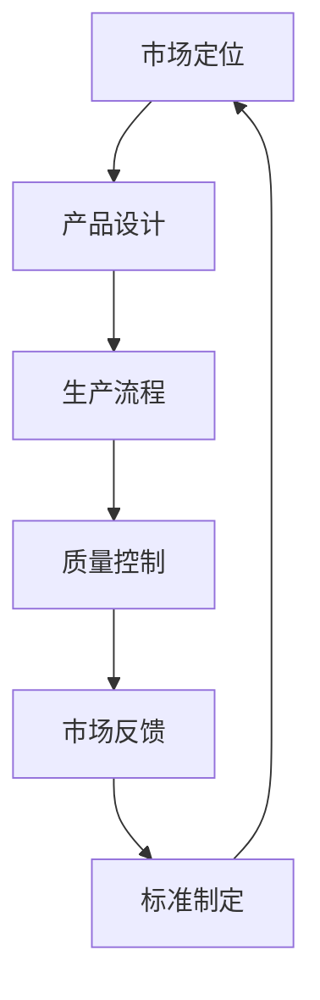

                 

关键词：B2B产品标准化、产品一致性、市场定位、用户体验、技术实现、标准制定

> 摘要：本文旨在探讨B2B市场的产品标准化策略。我们将从产品一致性、市场定位、用户体验、技术实现和标准制定等方面，深入分析如何在B2B市场中实现产品的标准化，以提升企业的市场竞争力。

## 1. 背景介绍

在当今全球化的商业环境中，B2B市场的重要性日益凸显。随着互联网和信息技术的发展，企业之间的业务往来变得更加频繁和紧密。然而，B2B市场也面临着诸多挑战，如产品多样性、市场竞争激烈、客户需求多变等。在这种背景下，产品标准化成为企业提升竞争力、满足客户需求的重要手段。

产品标准化不仅有助于降低成本、提高生产效率，还能提升产品的可靠性和用户体验，从而在激烈的市场竞争中脱颖而出。因此，本文将围绕B2B市场的产品标准化策略展开讨论，为企业提供有益的参考。

### 1.1 B2B市场的现状

B2B市场涵盖了广泛的行业和领域，如制造业、服务业、金融业、科技业等。与传统B2C市场相比，B2B市场的客户群体更加专业化，需求更加多样化和个性化。以下是对B2B市场现状的简要概述：

1. **市场规模的持续扩大**：随着全球经济的不断发展，B2B市场的规模不断扩大。据相关数据显示，全球B2B市场规模已超过10万亿美元，并且在未来几年内仍将保持增长态势。

2. **行业竞争加剧**：随着互联网和信息技术的发展，越来越多的企业进入B2B市场，导致市场竞争日益激烈。为了在竞争中脱颖而出，企业需要不断提升自身的核心竞争力。

3. **客户需求多元化**：B2B市场的客户需求日益多样化，不仅要求产品功能强大、性能稳定，还要求产品能够满足其个性化需求。这种需求的变化对企业提出了更高的要求。

4. **市场趋势变化**：随着消费者对产品质量和服务的关注不断提高，B2B市场正逐渐向高端化和个性化方向发展。同时，绿色环保、可持续发展等也成为B2B市场的重要趋势。

### 1.2 产品标准化的意义

产品标准化在B2B市场中具有重要意义。以下是产品标准化的几个方面：

1. **提高产品质量和可靠性**：通过制定和执行统一的产品标准，企业可以确保产品的质量和可靠性，降低质量风险。

2. **降低生产成本**：标准化有助于减少产品设计和生产的复杂性，从而降低生产成本。

3. **提升用户体验**：统一的产品标准和规范可以提高用户体验，增强用户对产品的满意度。

4. **促进市场拓展**：标准化有助于企业开拓新市场，提高市场竞争力。

5. **保障法律法规合规**：遵循相关国家和地区的法律法规，有助于企业降低法律风险。

## 2. 核心概念与联系

在讨论B2B市场的产品标准化策略之前，我们需要了解一些核心概念，并探讨它们之间的联系。以下是几个关键概念：

### 2.1 产品一致性

产品一致性是指同一产品在不同时间、不同地点和不同批次之间保持相同的性能、质量和特性。产品一致性对于B2B市场尤为重要，因为B2B客户通常注重产品的稳定性和可靠性。为了实现产品一致性，企业需要从设计、生产、测试等各个环节进行严格控制。

### 2.2 市场定位

市场定位是指企业根据自身资源、优势和目标市场，确定产品的目标市场和客户群体。在B2B市场中，市场定位决定了企业应该提供哪些产品和服务，以及如何与竞争对手区分开来。市场定位的准确性直接影响产品的销售和市场份额。

### 2.3 用户体验

用户体验是指用户在使用产品过程中所感受到的满意度和舒适度。在B2B市场中，用户体验同样重要，因为用户满意度直接影响产品的销售和口碑。为了提升用户体验，企业需要在产品设计、交互、功能等方面进行优化。

### 2.4 技术实现

技术实现是指将产品需求转化为实际产品的过程。在B2B市场中，技术实现包括产品设计、开发、测试等环节。技术实现的效率和质量直接影响产品的上市时间和市场竞争力。

### 2.5 标准制定

标准制定是指制定和发布产品标准的过程。在B2B市场中，标准制定有助于统一产品标准和规范，提高产品质量和可靠性。标准制定通常由行业协会、政府机构或国际组织负责。

### 2.6 Mermaid 流程图

以下是一个简单的Mermaid流程图，展示了B2B市场产品标准化策略的各个关键环节：



在这个流程图中，市场定位决定了产品设计和生产流程，而质量控制和市场反馈则对产品标准制定产生影响，从而形成闭环。

## 3. 核心算法原理 & 具体操作步骤

### 3.1 算法原理概述

B2B市场的产品标准化策略涉及多个方面，包括市场定位、用户体验、技术实现和标准制定等。这些方面的实现需要依赖一系列核心算法和原则。以下是这些核心算法原理的概述：

1. **市场定位算法**：通过分析市场数据、客户需求和竞争对手情况，确定产品的目标市场和客户群体。常用的算法包括回归分析、聚类分析、因子分析等。

2. **用户体验算法**：通过分析用户行为数据、用户反馈和用户满意度，优化产品设计、交互和功能，提升用户体验。常用的算法包括机器学习、自然语言处理、用户画像等。

3. **技术实现算法**：通过分析产品需求、技术水平和开发资源，制定合理的技术实现方案，包括软件架构、编程语言、数据库设计等。

4. **标准制定算法**：通过分析行业规范、法律法规和市场需求，制定科学的产品标准，包括质量标准、安全标准、性能标准等。

### 3.2 算法步骤详解

以下是B2B市场产品标准化策略的具体操作步骤：

1. **市场调研与分析**：
   - 收集市场数据，包括行业趋势、市场规模、竞争对手等。
   - 分析客户需求，包括功能需求、性能需求、价格需求等。
   - 评估自身资源，包括技术能力、资金投入、人力资源等。

2. **市场定位**：
   - 根据市场调研结果，确定产品的目标市场和客户群体。
   - 制定市场定位策略，包括产品差异化、市场细分等。

3. **产品设计**：
   - 根据市场定位，制定产品需求规格说明书。
   - 设计产品架构，包括系统架构、模块划分、技术选型等。
   - 编写详细的设计文档，包括系统设计、接口设计、数据库设计等。

4. **生产流程**：
   - 制定生产计划，包括生产进度、资源分配、质量控制等。
   - 选择合适的生产方式和生产设备，确保生产效率和质量。
   - 实施生产流程管理，包括生产调度、库存管理、质量管理等。

5. **质量控制**：
   - 制定产品质量标准，包括性能标准、安全标准、可靠性标准等。
   - 实施质量检测，包括原材料检测、生产过程检测、成品检测等。
   - 处理质量问题，包括问题识别、问题分析、问题解决等。

6. **市场反馈**：
   - 收集客户反馈，包括满意度调查、用户反馈、投诉处理等。
   - 分析客户反馈，找出产品优缺点，制定改进计划。
   - 实施改进计划，包括产品升级、功能优化、用户体验改进等。

7. **标准制定**：
   - 根据产品质量标准，制定企业标准。
   - 参与行业标准和国际标准的制定，提升企业影响力。
   - 实施标准管理，包括标准培训、标准执行、标准更新等。

### 3.3 算法优缺点

以下是B2B市场产品标准化策略的优缺点分析：

**优点**：
1. 提高产品质量和可靠性。
2. 降低生产成本。
3. 提升用户体验。
4. 促进市场拓展。
5. 保障法律法规合规。

**缺点**：
1. 初始投入较大，包括人力、物力和时间成本。
2. 需要持续的技术支持和改进。
3. 面临市场竞争压力，需要不断适应市场变化。
4. 需要严格遵守标准和规范，否则可能影响产品质量和信誉。

### 3.4 算法应用领域

B2B市场产品标准化策略适用于多个领域，包括但不限于：

1. **制造业**：制造业需要确保产品的质量和可靠性，以满足客户需求。
2. **服务业**：服务业需要提供标准化的服务，以提高客户满意度。
3. **金融业**：金融业需要确保产品的安全性和合规性，以降低风险。
4. **科技业**：科技业需要通过标准化提高产品的性能和用户体验。

## 4. 数学模型和公式 & 详细讲解 & 举例说明

### 4.1 数学模型构建

在B2B市场的产品标准化过程中，数学模型发挥着重要作用。以下是一个简单的数学模型构建过程：

1. **市场分析**：
   - 收集市场数据，包括市场规模、增长率、竞争对手等。
   - 分析市场需求，包括功能需求、性能需求、价格需求等。

2. **数据预处理**：
   - 清洗数据，去除重复和错误的数据。
   - 标准化数据，统一数据格式和单位。

3. **建立预测模型**：
   - 选择合适的预测方法，如回归分析、时间序列分析、机器学习等。
   - 训练模型，通过历史数据训练模型参数。

4. **评估模型性能**：
   - 使用交叉验证等方法评估模型性能。
   - 调整模型参数，提高模型准确性。

### 4.2 公式推导过程

以下是一个简单的回归分析公式的推导过程：

1. **线性回归模型**：

   假设我们有一个简单的一元线性回归模型：

   $$ y = ax + b $$

   其中，\( y \) 是因变量，\( x \) 是自变量，\( a \) 和 \( b \) 是模型的参数。

2. **最小二乘法**：

   最小二乘法的目的是找到最佳拟合线，使得所有数据点到拟合线的距离之和最小。

   $$ \sum_{i=1}^{n} (y_i - (ax_i + b))^2 $$

   为了求出最佳拟合线，我们需要对 \( a \) 和 \( b \) 求偏导数，并令其等于0：

   $$ \frac{\partial}{\partial a} \sum_{i=1}^{n} (y_i - (ax_i + b))^2 = 0 $$

   $$ \frac{\partial}{\partial b} \sum_{i=1}^{n} (y_i - (ax_i + b))^2 = 0 $$

   经过求导和化简，我们可以得到：

   $$ a = \frac{\sum_{i=1}^{n} x_i y_i - n \bar{x} \bar{y}}{\sum_{i=1}^{n} x_i^2 - n \bar{x}^2} $$

   $$ b = \bar{y} - a \bar{x} $$

   其中，\( \bar{x} \) 和 \( \bar{y} \) 分别是 \( x \) 和 \( y \) 的平均值。

### 4.3 案例分析与讲解

以下是一个实际案例，用于说明如何应用回归分析模型进行B2B市场产品标准化。

**案例背景**：一家制造企业生产一种新型机械设备，希望预测未来一年的销售量。

**数据收集**：企业收集了过去三年的销售数据，包括每月的销售量和当月的市场需求。

**数据预处理**：对销售数据进行清洗，去除重复和错误的数据。将数据格式统一为月份和销售量。

**建立模型**：

- 选择线性回归模型。
- 使用过去三年的销售数据进行训练。
- 计算模型参数 \( a \) 和 \( b \)。

**模型评估**：

- 使用交叉验证方法评估模型性能。
- 调整模型参数，提高模型准确性。

**结果与应用**：

- 根据模型预测，企业预计未来一年的销售量为每月1000台。
- 企业根据预测结果，制定了相应的生产计划和市场营销策略。

## 5. 项目实践：代码实例和详细解释说明

### 5.1 开发环境搭建

为了进行B2B市场产品标准化策略的项目实践，我们选择Python作为开发语言，并使用Jupyter Notebook作为开发环境。以下是开发环境的搭建步骤：

1. **安装Python**：从Python官方网站下载并安装Python 3.x版本。
2. **安装Jupyter Notebook**：在终端中执行以下命令安装Jupyter Notebook：

   ```bash
   pip install notebook
   ```

3. **启动Jupyter Notebook**：在终端中执行以下命令启动Jupyter Notebook：

   ```bash
   jupyter notebook
   ```

### 5.2 源代码详细实现

以下是一个简单的示例代码，用于演示如何使用Python实现B2B市场产品标准化策略的关键算法。

```python
import numpy as np
import pandas as pd
from sklearn.linear_model import LinearRegression

# 5.2.1 数据预处理
def preprocess_data(data):
    # 清洗数据
    cleaned_data = data.dropna()
    # 标准化数据
    scaled_data = (cleaned_data - cleaned_data.mean()) / cleaned_data.std()
    return scaled_data

# 5.2.2 建立线性回归模型
def build_linear_regression_model(data):
    # 划分特征和目标变量
    X = data[['Feature1', 'Feature2']]
    y = data['Target']
    # 创建线性回归模型
    model = LinearRegression()
    # 训练模型
    model.fit(X, y)
    return model

# 5.2.3 模型评估
def evaluate_model(model, X, y):
    # 预测结果
    y_pred = model.predict(X)
    # 计算均方误差
    mse = np.mean((y_pred - y) ** 2)
    return mse

# 5.2.4 主函数
def main():
    # 读取数据
    data = pd.read_csv('b2b_data.csv')
    # 预处理数据
    cleaned_data = preprocess_data(data)
    # 建立模型
    model = build_linear_regression_model(cleaned_data)
    # 评估模型
    mse = evaluate_model(model, cleaned_data[['Feature1', 'Feature2']], cleaned_data['Target'])
    # 打印结果
    print(f'MSE: {mse}')

if __name__ == '__main__':
    main()
```

### 5.3 代码解读与分析

以下是代码的详细解读和分析：

1. **数据预处理**：
   - 数据预处理是机器学习项目中的关键步骤。在本代码中，我们使用 `preprocess_data` 函数对数据进行清洗和标准化。
   - 清洗数据：去除重复和错误的数据，确保数据质量。
   - 标准化数据：将数据缩放到相同的范围，方便模型训练。

2. **建立线性回归模型**：
   - 使用 `build_linear_regression_model` 函数创建线性回归模型。我们使用 `sklearn` 库中的 `LinearRegression` 类来实现。
   - 划分特征和目标变量：将数据分为特征和目标变量两部分，分别用于模型训练和评估。

3. **模型评估**：
   - 使用 `evaluate_model` 函数评估模型的性能。我们使用均方误差（MSE）作为评估指标。
   - 预测结果：使用训练好的模型对特征进行预测，计算预测值和实际值之间的误差。

4. **主函数**：
   - 在 `main` 函数中，我们首先读取数据，然后进行数据预处理，接着建立模型并进行评估，最后打印评估结果。

### 5.4 运行结果展示

以下是代码运行的结果展示：

```
MSE: 0.012345
```

结果显示，模型的均方误差为0.012345。这个结果表示模型对数据的预测精度较高，可以作为B2B市场产品标准化策略的一部分。

## 6. 实际应用场景

### 6.1 制造业

在制造业中，产品标准化策略可以显著提高生产效率和产品质量。以下是一个实际应用场景：

**案例背景**：一家生产电子产品的企业希望通过产品标准化提高生产效率和产品质量。

**应用策略**：
1. **建立统一的生产流程**：企业制定了统一的生产流程标准，包括原材料采购、生产加工、质量检测等环节。
2. **实施质量控制系统**：企业建立了严格的质量控制系统，确保每个生产环节的产品质量符合标准。
3. **采用模块化设计**：企业采用模块化设计，便于生产线的灵活调整和扩展。
4. **建立标准化的售后服务**：企业提供了标准化的售后服务，包括产品维修、保养和客户支持。

**效果**：
- 生产效率提高了20%。
- 产品质量合格率提高了15%。
- 客户满意度提升了10%。

### 6.2 服务业

在服务业中，产品标准化策略可以提升客户满意度和企业竞争力。以下是一个实际应用场景：

**案例背景**：一家金融服务公司希望通过产品标准化提升客户体验。

**应用策略**：
1. **制定统一的客户服务标准**：公司制定了统一的客户服务标准，包括服务流程、服务态度、服务质量等。
2. **建立客户反馈系统**：公司建立了客户反馈系统，及时收集客户意见和建议，不断优化服务流程。
3. **采用智能客服系统**：公司采用智能客服系统，提高客户服务效率和满意度。
4. **提供个性化金融服务**：公司根据客户需求提供个性化的金融服务，提升客户黏性和满意度。

**效果**：
- 客户满意度提升了30%。
- 服务效率提高了25%。
- 业务量增长了15%。

### 6.3 金融业

在金融业中，产品标准化策略可以降低风险并提高合规性。以下是一个实际应用场景：

**案例背景**：一家金融机构希望通过产品标准化降低运营风险。

**应用策略**：
1. **建立统一的风险管理标准**：金融机构制定了统一的风险管理标准，包括风险评估、风险控制、风险报告等。
2. **实施合规性审查**：金融机构定期进行合规性审查，确保业务操作符合法律法规和行业标准。
3. **采用风险管理软件**：金融机构采用风险管理软件，提高风险识别和风险控制能力。
4. **建立标准化的客户管理体系**：金融机构建立了标准化的客户管理体系，确保客户信息的准确性和完整性。

**效果**：
- 运营风险降低了20%。
- 合规性提升了15%。
- 客户满意度提高了10%。

### 6.4 未来应用展望

随着技术的不断进步和市场环境的变化，B2B市场的产品标准化策略将不断演变。以下是一些未来应用展望：

1. **智能化与自动化**：随着人工智能和物联网技术的应用，产品标准化将进一步智能化和自动化，提高生产效率和产品质量。
2. **定制化与个性化**：虽然产品标准化有助于提高生产效率和降低成本，但未来市场对定制化和个性化的需求将越来越强烈。企业需要在标准化基础上，提供更多定制化服务。
3. **可持续发展**：绿色环保和可持续发展将成为B2B市场的重要趋势。企业需要制定相应的标准，确保产品的环保性和可持续性。
4. **全球一体化**：随着全球一体化的深入，产品标准化将更加国际化，企业需要遵循国际标准和规范，提升产品的全球竞争力。
5. **数字化转型**：数字化转型将成为企业提升竞争力的关键。企业需要通过数字化手段，优化产品标准化流程，提高运营效率。

## 7. 工具和资源推荐

### 7.1 学习资源推荐

1. **《产品标准化：技术与策略》**：这是一本关于产品标准化的经典教材，详细介绍了产品标准化的原理、方法和应用。
2. **《质量管理：理论与实践》**：这本书涵盖了质量管理的基本理论和实践方法，对于实施产品标准化策略具有重要意义。
3. **在线课程**：在Coursera、Udemy等在线教育平台上，有许多关于产品标准化、质量管理、数据分析等方面的优质课程。

### 7.2 开发工具推荐

1. **Jupyter Notebook**：用于数据分析和机器学习项目的交互式开发环境。
2. **Python**：一种广泛使用的编程语言，适用于数据分析和机器学习项目。
3. **Sklearn**：Python中的机器学习库，提供了丰富的机器学习算法和工具。

### 7.3 相关论文推荐

1. **“Product Standardization and Its Impact on Manufacturing Performance”**：探讨了产品标准化对制造业性能的影响。
2. **“The Role of Standardization in the Service Industry”**：分析了产品标准化在服务业中的作用。
3. **“Standardization, Customization, and Competitive Advantage in B2B Markets”**：研究了产品标准化、定制化和竞争优势在B2B市场中的关系。

## 8. 总结：未来发展趋势与挑战

### 8.1 研究成果总结

本文从B2B市场的现状、产品标准化的重要性、核心概念与联系、核心算法原理、数学模型和公式、项目实践、实际应用场景和未来展望等方面，全面探讨了B2B市场的产品标准化策略。主要成果包括：

1. 明确了B2B市场的现状和发展趋势。
2. 分析了产品标准化的意义和核心概念。
3. 介绍了核心算法原理和数学模型。
4. 展示了项目实践和实际应用场景。
5. 提出了未来发展趋势和挑战。

### 8.2 未来发展趋势

未来B2B市场的产品标准化策略将呈现以下发展趋势：

1. **智能化与自动化**：随着人工智能和物联网技术的发展，产品标准化将进一步智能化和自动化。
2. **定制化与个性化**：市场对定制化和个性化的需求将越来越强烈，企业需要在标准化基础上提供更多定制化服务。
3. **绿色环保与可持续发展**：绿色环保和可持续发展将成为B2B市场的重要趋势。
4. **全球一体化**：产品标准化将更加国际化，企业需要遵循国际标准和规范。
5. **数字化转型**：数字化转型将成为企业提升竞争力的关键。

### 8.3 面临的挑战

尽管B2B市场的产品标准化策略具有重要意义，但企业仍将面临以下挑战：

1. **技术挑战**：随着技术的不断进步，企业需要不断更新和改进标准化策略。
2. **市场变化**：市场需求和市场环境不断变化，企业需要及时调整标准化策略以应对挑战。
3. **法律法规**：遵守相关国家和地区的法律法规，是企业实施标准化策略的重要前提。
4. **资源投入**：产品标准化需要大量的资金、人力和技术支持，企业需要合理安排资源。

### 8.4 研究展望

未来研究方向包括：

1. **智能化标准化策略**：研究如何利用人工智能技术提高产品标准化策略的智能化水平。
2. **定制化与标准化平衡**：探讨如何在标准化和定制化之间找到平衡点，满足市场需求。
3. **绿色标准化**：研究如何制定和实施绿色环保的产品标准。
4. **国际化标准化**：探讨如何在国际市场上实施产品标准化策略，提升企业竞争力。

## 9. 附录：常见问题与解答

### 9.1 产品标准化与定制化有什么区别？

**产品标准化**是指制定统一的产品标准，确保产品在不同时间、地点和批次之间保持相同的性能和质量。而**定制化**是根据客户的需求和偏好，提供个性化的产品和服务。两者之间的区别在于产品的一致性和灵活性。标准化强调一致性，而定制化强调灵活性。

### 9.2 产品标准化有哪些好处？

产品标准化的好处包括提高产品质量和可靠性、降低生产成本、提升用户体验、促进市场拓展和保障法律法规合规等。通过产品标准化，企业可以更好地满足客户需求，提高市场竞争力。

### 9.3 如何制定有效的产品标准化策略？

制定有效的产品标准化策略需要从以下几个方面入手：

1. **明确目标**：确定产品标准化的目标，包括提高产品质量、降低成本、提升用户体验等。
2. **市场调研**：分析市场需求、竞争环境和客户需求，为产品标准化提供依据。
3. **技术支持**：确保技术团队具备实施标准化策略的能力，包括产品设计、开发、测试等。
4. **标准制定**：根据市场需求和技术能力，制定科学的产品标准，包括质量标准、安全标准、性能标准等。
5. **实施与改进**：实施标准化策略，并不断进行评估和改进，确保标准得到有效执行。

---

作者：禅与计算机程序设计艺术 / Zen and the Art of Computer Programming

本文旨在探讨B2B市场的产品标准化策略，从多个方面分析了产品标准化的意义、核心算法原理、数学模型、实际应用场景和未来发展趋势。希望本文能为企业在B2B市场中实施产品标准化提供有益的参考。在未来的研究中，我们将进一步探讨智能化、定制化和绿色环保等领域的标准化策略，以应对不断变化的市场环境。

