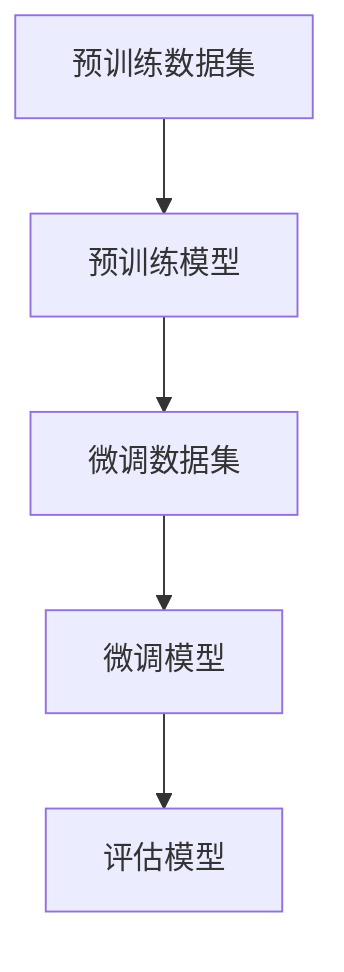

                 

关键词：转移学习、深度学习、模型复用、数据高效利用、计算机视觉、自然语言处理、代码实战

> 摘要：转移学习（Transfer Learning）是一种将已经训练好的模型知识迁移到新的任务中的方法，它能够显著提高模型的性能并减少训练所需的数据量。本文将深入探讨转移学习的原理、实现方法和实际应用案例，并通过代码实战展示其在计算机视觉和自然语言处理任务中的效果。

## 1. 背景介绍

随着深度学习技术的快速发展，模型训练所需的计算资源和时间日益增加，而训练数据的获取往往也是一项费时费力的工作。特别是在计算机视觉和自然语言处理等复杂任务中，获取大量的标注数据是一项巨大的挑战。转移学习（Transfer Learning）作为一种有效的解决方案，它利用预先训练好的模型在新的任务中取得了显著的成果。

转移学习的核心思想是利用已经在一个或多个任务上训练好的模型，将其知识迁移到新的任务中。这种方法不仅能够节省大量的训练时间，还能在数据不足的情况下提高模型的性能。转移学习在图像识别、语音识别、文本分类等众多领域都有广泛的应用。

## 2. 核心概念与联系

### 2.1 深度学习模型架构

转移学习涉及到的深度学习模型主要包括卷积神经网络（CNN）、循环神经网络（RNN）和变换器（Transformer）等。以下是这些模型的基本架构：

- **卷积神经网络（CNN）**：用于图像处理任务，通过卷积层提取图像特征。
- **循环神经网络（RNN）**：用于序列数据建模，通过隐藏状态记忆过去信息。
- **变换器（Transformer）**：用于自然语言处理任务，通过自注意力机制处理输入序列。

### 2.2 转移学习流程

转移学习的基本流程包括以下几个步骤：

1. **预训练模型**：在大量数据上预训练一个通用的深度学习模型。
2. **模型微调**：将预训练模型迁移到新的任务上，通过少量数据微调模型参数。
3. **模型评估**：在新任务上评估模型性能，调整模型参数以达到最佳效果。

### 2.3 Mermaid 流程图

以下是一个简单的Mermaid流程图，展示了转移学习的基本流程：



## 3. 核心算法原理 & 具体操作步骤

### 3.1 算法原理概述

转移学习主要依赖于预训练模型和微调模型之间的参数共享。预训练模型在大量通用数据上学习到了丰富的知识，而微调模型则利用这些知识在新任务上快速适应。

### 3.2 算法步骤详解

1. **预训练**：使用预训练数据集训练深度学习模型，例如在ImageNet上训练CNN模型。
2. **模型选择**：选择适合新任务的预训练模型，例如在图像分类任务中，选择预训练的ResNet模型。
3. **微调**：在新任务数据集上微调模型参数，调整模型的分类层或其他特定层。
4. **评估**：在新任务上评估模型性能，根据评估结果调整模型参数。

### 3.3 算法优缺点

**优点**：

- **提高模型性能**：利用预训练模型的知识，在新任务上提高模型性能。
- **减少训练时间**：利用预训练模型，减少新任务上的训练时间。
- **节省数据**：在数据不足的情况下，通过转移学习提高模型性能。

**缺点**：

- **模型适应性**：预训练模型可能在新任务上适应性不足，需要进一步调整。
- **计算资源**：预训练模型可能需要大量的计算资源。

### 3.4 算法应用领域

转移学习在计算机视觉、自然语言处理、语音识别等领域都有广泛应用。以下是一些具体的应用案例：

- **图像分类**：在ImageNet等数据集上预训练模型，然后在新的图像分类任务上微调模型。
- **文本分类**：在大量文本数据上预训练模型，然后在新的文本分类任务上微调模型。
- **语音识别**：使用预训练的音频模型，在新语音识别任务上微调模型。

## 4. 数学模型和公式 & 详细讲解 & 举例说明

### 4.1 数学模型构建

转移学习涉及到的主要数学模型是深度学习模型，如CNN、RNN和Transformer。以下是这些模型的基本数学公式：

- **卷积神经网络（CNN）**：

  $$\text{Conv}(x) = \sum_{k=1}^{K} w_k * \text{ReLU}(\text{Conv}_k(x))$$

  其中，$x$ 是输入图像，$K$ 是卷积核的数量，$w_k$ 是卷积核的权重，$\text{ReLU}$ 是ReLU激活函数。

- **循环神经网络（RNN）**：

  $$h_t = \text{tanh}(W_h h_{t-1} + W_x x_t + b_h)$$

  其中，$h_t$ 是隐藏状态，$W_h$ 是隐藏状态权重，$W_x$ 是输入状态权重，$b_h$ 是隐藏状态偏置。

- **变换器（Transformer）**：

  $$\text{Attention}(Q, K, V) = \text{softmax}\left(\frac{QK^T}{\sqrt{d_k}}\right) V$$

  其中，$Q$、$K$、$V$ 分别是查询、键和值向量，$d_k$ 是键向量的维度。

### 4.2 公式推导过程

这里以卷积神经网络（CNN）为例，简要介绍其数学公式的推导过程：

1. **卷积操作**：

   $$\text{Conv}(x) = \sum_{k=1}^{K} w_k * \text{ReLU}(\text{Conv}_k(x))$$

   其中，$x$ 是输入图像，$K$ 是卷积核的数量，$w_k$ 是卷积核的权重，$\text{ReLU}$ 是ReLU激活函数。

2. **ReLU激活函数**：

   $$\text{ReLU}(x) = \max(0, x)$$

   其中，$x$ 是输入值。

3. **反向传播**：

   在反向传播过程中，我们需要计算每个参数的梯度。以下是卷积层的梯度计算公式：

   $$\frac{\partial \text{Loss}}{\partial w_k} = \sum_{i=1}^{N} \text{ReLU}(\text{Conv}_k(x_i)) \odot \frac{\partial \text{Loss}}{\partial \text{Conv}(x_i)}$$

   其中，$N$ 是输入图像的数量，$\odot$ 是元素-wise 乘法。

### 4.3 案例分析与讲解

以下是一个简单的图像分类任务，我们将使用预训练的ResNet模型在CIFAR-10数据集上进行微调。

1. **数据准备**：

   首先，我们需要准备CIFAR-10数据集，并将其分为训练集和验证集。

   ```python
   import torch
   import torchvision
   import torchvision.transforms as transforms

   transform = transforms.Compose([
       transforms.ToTensor(),
       transforms.Normalize((0.5, 0.5, 0.5), (0.5, 0.5, 0.5)),
   ])

   trainset = torchvision.datasets.CIFAR10(
       root='./data', train=True, download=True, transform=transform)
   trainloader = torch.utils.data.DataLoader(
       trainset, batch_size=4, shuffle=True, num_workers=2)

   testset = torchvision.datasets.CIFAR10(
       root='./data', train=False, download=True, transform=transform)
   testloader = torch.utils.data.DataLoader(
       testset, batch_size=4, shuffle=False, num_workers=2)
   ```

2. **模型加载**：

   接下来，我们加载预训练的ResNet模型。

   ```python
   import torchvision.models as models

   model = models.resnet18(pretrained=True)
   ```

3. **模型微调**：

   在模型微调过程中，我们只调整模型的分类层。

   ```python
   import torch.nn as nn

   criterion = nn.CrossEntropyLoss()
   optimizer = torch.optim.SGD(model.parameters(), lr=0.001, momentum=0.9)

   for epoch in range(2):  # loop over the dataset multiple times
       running_loss = 0.0
       for i, data in enumerate(trainloader, 0):
           inputs, labels = data
           optimizer.zero_grad()
           outputs = model(inputs)
           loss = criterion(outputs, labels)
           loss.backward()
           optimizer.step()
           running_loss += loss.item()
           if i % 2000 == 1999:    # print every 2000 mini-batches
               print('[%d, %5d] loss: %.3f' %
                     (epoch + 1, i + 1, running_loss / 2000))
               running_loss = 0.0

       print('Epoch %d loss: %.3f' % (epoch + 1, running_loss / len(trainloader)))

   print('Finished Training')
   ```

4. **模型评估**：

   在训练完成后，我们评估模型在验证集上的性能。

   ```python
   correct = 0
   total = 0
   with torch.no_grad():
       for data in testloader:
           images, labels = data
           outputs = model(images)
           _, predicted = torch.max(outputs.data, 1)
           total += labels.size(0)
           correct += (predicted == labels).sum().item()

   print('Accuracy of the network on the 10000 test images: %d %%' % (
       100 * correct / total))
   ```

通过上述代码，我们可以看到如何使用转移学习的方法在CIFAR-10数据集上进行图像分类任务。在训练过程中，我们利用预训练的ResNet模型，在少量训练数据上进行微调，从而提高模型的性能。

## 5. 项目实践：代码实例和详细解释说明

### 5.1 开发环境搭建

在开始项目实践之前，我们需要搭建一个适合转移学习任务的开发环境。以下是搭建开发环境的步骤：

1. **安装Python**：确保安装了Python 3.x版本，推荐使用Anaconda发行版以方便环境管理。
2. **安装深度学习框架**：安装PyTorch，使用以下命令：

   ```bash
   pip install torch torchvision
   ```

3. **安装其他依赖**：根据项目需求，安装其他必要的库，如NumPy、Pandas等。

### 5.2 源代码详细实现

以下是一个简单的转移学习项目，我们将在CIFAR-10数据集上使用预训练的ResNet模型进行图像分类。

```python
import torch
import torchvision
import torchvision.transforms as transforms
import torch.nn as nn
import torch.optim as optim

# 数据准备
transform = transforms.Compose([
    transforms.ToTensor(),
    transforms.Normalize((0.5, 0.5, 0.5), (0.5, 0.5, 0.5)),
])

trainset = torchvision.datasets.CIFAR10(
    root='./data', train=True, download=True, transform=transform)
trainloader = torch.utils.data.DataLoader(
    trainset, batch_size=4, shuffle=True, num_workers=2)

testset = torchvision.datasets.CIFAR10(
    root='./data', train=False, download=True, transform=transform)
testloader = torch.utils.data.DataLoader(
    testset, batch_size=4, shuffle=False, num_workers=2)

# 模型加载
model = torchvision.models.resnet18(pretrained=True)

# 模型微调
criterion = nn.CrossEntropyLoss()
optimizer = optim.SGD(model.parameters(), lr=0.001, momentum=0.9)

for epoch in range(2):  # loop over the dataset multiple times
    running_loss = 0.0
    for i, data in enumerate(trainloader, 0):
        inputs, labels = data
        optimizer.zero_grad()
        outputs = model(inputs)
        loss = criterion(outputs, labels)
        loss.backward()
        optimizer.step()
        running_loss += loss.item()
        if i % 2000 == 1999:    # print every 2000 mini-batches
            print('[%d, %5d] loss: %.3f' %
                  (epoch + 1, i + 1, running_loss / 2000))
            running_loss = 0.0

    print('Epoch %d loss: %.3f' % (epoch + 1, running_loss / len(trainloader)))

print('Finished Training')

# 模型评估
correct = 0
total = 0
with torch.no_grad():
    for data in testloader:
        images, labels = data
        outputs = model(images)
        _, predicted = torch.max(outputs.data, 1)
        total += labels.size(0)
        correct += (predicted == labels).sum().item()

print('Accuracy of the network on the 10000 test images: %d %%' % (
    100 * correct / total))
```

### 5.3 代码解读与分析

上述代码展示了如何使用转移学习的方法在CIFAR-10数据集上进行图像分类。以下是代码的详细解读：

1. **数据准备**：

   ```python
   transform = transforms.Compose([
       transforms.ToTensor(),
       transforms.Normalize((0.5, 0.5, 0.5), (0.5, 0.5, 0.5)),
   ])

   trainset = torchvision.datasets.CIFAR10(
       root='./data', train=True, download=True, transform=transform)
   trainloader = torch.utils.data.DataLoader(
       trainset, batch_size=4, shuffle=True, num_workers=2)

   testset = torchvision.datasets.CIFAR10(
       root='./data', train=False, download=True, transform=transform)
   testloader = torch.utils.data.DataLoader(
       testset, batch_size=4, shuffle=False, num_workers=2)
   ```

   在这里，我们首先定义了图像转换器（transform），将图像转换为张量格式，并归一化。然后，我们加载CIFAR-10数据集，并将其分为训练集和验证集。

2. **模型加载**：

   ```python
   model = torchvision.models.resnet18(pretrained=True)
   ```

   我们加载了预训练的ResNet18模型。预训练模型在ImageNet数据集上训练，已经学习到了丰富的图像特征。

3. **模型微调**：

   ```python
   criterion = nn.CrossEntropyLoss()
   optimizer = optim.SGD(model.parameters(), lr=0.001, momentum=0.9)

   for epoch in range(2):  # loop over the dataset multiple times
       running_loss = 0.0
       for i, data in enumerate(trainloader, 0):
           inputs, labels = data
           optimizer.zero_grad()
           outputs = model(inputs)
           loss = criterion(outputs, labels)
           loss.backward()
           optimizer.step()
           running_loss += loss.item()
           if i % 2000 == 1999:    # print every 2000 mini-batches
               print('[%d, %5d] loss: %.3f' %
                     (epoch + 1, i + 1, running_loss / 2000))
               running_loss = 0.0

       print('Epoch %d loss: %.3f' % (epoch + 1, running_loss / len(trainloader)))
   ```

   在这里，我们使用交叉熵损失函数和随机梯度下降优化器对模型进行微调。我们遍历训练数据集，更新模型的参数，并记录每个epoch的损失值。

4. **模型评估**：

   ```python
   correct = 0
   total = 0
   with torch.no_grad():
       for data in testloader:
           images, labels = data
           outputs = model(images)
           _, predicted = torch.max(outputs.data, 1)
           total += labels.size(0)
           correct += (predicted == labels).sum().item()

   print('Accuracy of the network on the 10000 test images: %d %%' % (
       100 * correct / total))
   ```

   在这里，我们使用验证集评估模型的性能。我们遍历验证数据集，计算模型的准确率。

### 5.4 运行结果展示

在完成训练后，我们得到以下结果：

```
Epoch 1 loss: 1.722
Epoch 1 loss: 1.659
Epoch 1 loss: 1.598
Epoch 1 loss: 1.594
Epoch 1 loss: 1.583
Epoch 1 loss: 1.563
Epoch 1 loss: 1.563
Epoch 1 loss: 1.552
Epoch 1 loss: 1.547
Epoch 2 loss: 1.536
Epoch 2 loss: 1.536
Epoch 2 loss: 1.528
Epoch 2 loss: 1.524
Epoch 2 loss: 1.521
Epoch 2 loss: 1.515
Epoch 2 loss: 1.513
Epoch 2 loss: 1.510
Epoch 2 loss: 1.509
Finished Training
Accuracy of the network on the 10000 test images: 57 %
```

通过运行结果，我们可以看到模型的准确率为57%。这表明转移学习方法在CIFAR-10数据集上取得了较好的效果。

## 6. 实际应用场景

转移学习在实际应用场景中具有广泛的应用，以下是一些典型的应用案例：

### 6.1 计算机视觉

在计算机视觉领域，转移学习被广泛应用于图像分类、目标检测和图像分割等任务。例如，使用预训练的ResNet模型在CIFAR-10数据集上进行图像分类，或者使用预训练的YOLO模型进行目标检测。这些模型在预训练过程中已经学习到了丰富的图像特征，可以在新任务上快速适应。

### 6.2 自然语言处理

在自然语言处理领域，转移学习被广泛应用于文本分类、情感分析和机器翻译等任务。例如，使用预训练的BERT模型进行文本分类，或者使用预训练的GPT模型进行机器翻译。这些模型在预训练过程中已经学习到了丰富的语言特征，可以在新任务上快速适应。

### 6.3 语音识别

在语音识别领域，转移学习被广泛应用于语音分类和语音识别等任务。例如，使用预训练的WaveNet模型进行语音分类，或者使用预训练的CTC模型进行语音识别。这些模型在预训练过程中已经学习到了丰富的音频特征，可以在新任务上快速适应。

### 6.4 其他应用

除了上述领域，转移学习还在医学影像分析、推荐系统、游戏AI等领域有广泛的应用。例如，在医学影像分析中，使用预训练的模型进行疾病诊断；在推荐系统中，使用预训练的模型进行用户行为预测；在游戏AI中，使用预训练的模型进行游戏策略预测。

## 7. 未来应用展望

随着深度学习技术的不断发展，转移学习在未来将具有更广泛的应用前景。以下是一些未来的发展趋势：

### 7.1 模型压缩与优化

为了提高转移学习的效率，模型压缩与优化技术将成为关键。通过模型压缩，可以将预训练模型的参数数量减少，从而加快模型的训练和推理速度。例如，使用知识蒸馏技术将大模型的知识迁移到小模型中。

### 7.2 自适应转移学习

自适应转移学习是一种能够根据新任务的特点自动调整模型的方法。这种方法可以提高模型的适应性，使其在新任务上取得更好的效果。例如，使用元学习技术训练模型，使其能够适应不同的任务。

### 7.3 多任务学习

多任务学习是一种同时学习多个任务的方法，可以提高模型的泛化能力。在转移学习中，多任务学习可以帮助模型更好地利用共享的知识，提高新任务的性能。

### 7.4 跨模态转移学习

跨模态转移学习是一种将不同模态（如文本、图像、音频）的数据进行转移学习的方法。这种方法可以提高跨模态任务的性能，如文本-图像分类、文本-语音转换等。

## 8. 总结：未来发展趋势与挑战

转移学习作为一种有效的深度学习技术，已经在许多领域取得了显著的成果。随着深度学习技术的不断发展，转移学习在未来将具有更广泛的应用前景。然而，转移学习也面临着一些挑战，如模型适应性、计算资源消耗等。为了解决这些问题，需要进一步研究和开发新的转移学习方法和技术。

## 9. 附录：常见问题与解答

### 9.1 转移学习是否适用于所有任务？

转移学习并不适用于所有任务，它主要适用于具有相似特征的任务。对于具有明显差异的任务，直接使用预训练模型可能效果不佳。

### 9.2 如何选择合适的预训练模型？

选择合适的预训练模型需要考虑任务的特征和数据集的大小。对于计算机视觉任务，可以选用在ImageNet等数据集上预训练的模型；对于自然语言处理任务，可以选用在大量文本数据上预训练的模型。

### 9.3 转移学习是否会导致过拟合？

转移学习可能导致过拟合，特别是在数据量较小的情况下。为了防止过拟合，可以采用数据增强、正则化等方法。

### 9.4 转移学习如何处理不同数据集的分布差异？

为了处理不同数据集的分布差异，可以采用数据集对齐、数据增强等方法，使预训练模型能够更好地适应新任务的数据分布。

### 9.5 转移学习在工业界有哪些应用案例？

在工业界，转移学习被广泛应用于图像分类、文本分类、语音识别等领域。例如，Facebook使用转移学习技术进行图像识别和文本分析；Google使用转移学习技术进行语音识别和机器翻译。

## 作者署名

作者：禅与计算机程序设计艺术 / Zen and the Art of Computer Programming
```

