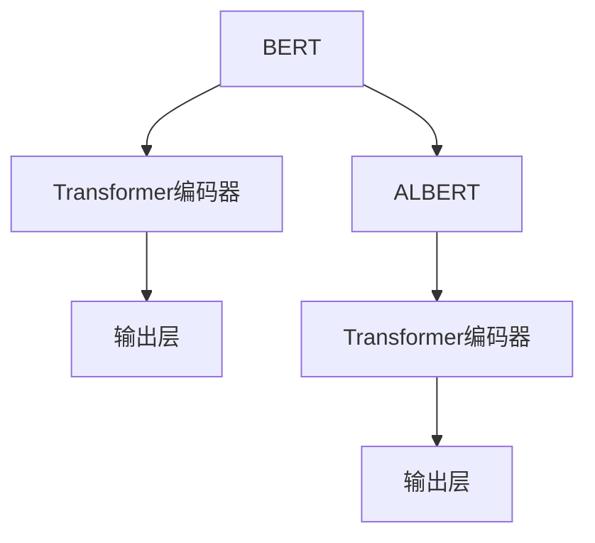

                 

关键词：Transformer、BERT、ALBERT、自然语言处理、深度学习

> 摘要：本文将深入探讨BERT模型及其精简版ALBERT的设计与实现，通过对比分析两者的优缺点，全面剖析Transformer架构在自然语言处理领域的重要性和应用前景。

## 1. 背景介绍

近年来，深度学习在计算机视觉、语音识别和自然语言处理等领域取得了显著的进展。尤其是自然语言处理（NLP）领域，基于神经网络的语言模型如BERT（Bidirectional Encoder Representations from Transformers）已经成为了研究的热点。BERT模型通过双向Transformer架构实现了对上下文信息的全局理解，显著提升了语言模型的性能。

然而，BERT模型也存在一些局限性，如计算复杂度和参数规模较大，导致训练和部署成本较高。为了解决这个问题，研究者们提出了ALBERT（A Lite BERT），它是BERT的一种精简版，通过共享权重和跨层参数重复利用等技术，显著减少了模型参数量，同时保持了较好的性能。

本文将首先介绍BERT和ALBERT的基本原理，然后深入分析它们的设计思路和实现细节，最后通过实际应用案例展示它们在自然语言处理中的优异表现。

## 2. 核心概念与联系

### 2.1 BERT

BERT是一种基于Transformer的双向编码器，旨在通过预训练学习语言表示，从而在多个NLP任务上实现高性能。BERT的核心思想是利用大量的无监督文本数据，通过预训练来学习上下文的表示，这些表示可以用于各种下游任务，如图像识别、文本分类等。

BERT的架构包含以下关键组件：

- **输入层**：BERT的输入是一个词序列，通常由子词嵌入、位置编码和分段嵌入组成。
- **Transformer编码器**：BERT使用多层Transformer编码器，每一层编码器由自注意力机制和前馈神经网络组成。
- **输出层**：BERT的输出是一个隐藏状态序列，通过这个序列可以提取任意位置的信息。

### 2.2 ALBERT

ALBERT是BERT的一种轻量化版本，其设计目标是在保持性能的同时，减少模型参数和计算复杂度。ALBERT的主要改进点包括：

- **跨层参数重复利用**：通过在不同层之间共享参数，减少了模型的参数量。
- **更多的层和更少的隐藏单元**：与BERT相比，ALBERT在较少的隐藏单元数下使用了更多的层，从而提高了模型的性能。
- **无偏差的自注意力**：通过去除自注意力机制中的偏差，降低了模型复杂度。

### 2.3 Mermaid 流程图

以下是一个简单的Mermaid流程图，展示了BERT和ALBERT的基本架构和联系。



在这个流程图中，BERT和ALBERT都包含一个Transformer编码器和一个输出层，但ALBERT在参数共享和结构设计上进行了优化。

## 3. 核心算法原理 & 具体操作步骤

### 3.1 算法原理概述

BERT和ALBERT都是基于Transformer架构的，它们的核心算法原理主要包括以下几个方面：

- **自注意力机制**：通过自注意力机制，模型可以自动学习到输入序列中不同位置之间的关联性，从而实现对上下文信息的全局理解。
- **多层神经网络**：通过堆叠多层神经网络，模型可以学习到更加复杂的表示。
- **位置编码**：为了保留输入序列的顺序信息，BERT和ALBERT使用了位置编码。

### 3.2 算法步骤详解

下面是一个简化的BERT和ALBERT算法步骤：

1. **输入预处理**：
   - 将文本序列转换为词嵌入。
   - 添加位置编码和分段嵌入。
2. **编码器处理**：
   - 通过多层Transformer编码器进行自注意力计算和前馈神经网络处理。
   - 每层编码器输出一个隐藏状态。
3. **输出生成**：
   - 通过输出层生成最终的文本表示。
   - 可以用于下游任务，如图像识别或文本分类。

### 3.3 算法优缺点

**BERT**：
- 优点：具有强大的上下文理解能力，在多个NLP任务上表现优异。
- 缺点：模型参数量和计算复杂度较大，训练和部署成本较高。

**ALBERT**：
- 优点：在保持性能的同时，显著减少了模型参数和计算复杂度，降低了训练和部署成本。
- 缺点：在某些特定的NLP任务上，性能可能不如BERT。

### 3.4 算法应用领域

BERT和ALBERT在自然语言处理领域具有广泛的应用，包括但不限于：

- 文本分类：如情感分析、主题分类等。
- 信息抽取：如命名实体识别、关系抽取等。
- 机器翻译：通过预训练模型，可以显著提高机器翻译的质量。

## 4. 数学模型和公式 & 详细讲解 & 举例说明

### 4.1 数学模型构建

BERT和ALBERT的数学模型主要包括以下公式：

1. **词嵌入**：
   $$\text{Embedding}(\text{word}) = \text{W} \text{word} + \text{P} \text{pos} + \text{S} \text{seg}$$
   其中，$\text{W}$、$\text{P}$和$\text{S}$分别为词嵌入权重、位置编码权重和分段嵌入权重。

2. **自注意力**：
   $$\text{Attention}(\text{Q}, \text{K}, \text{V}) = \frac{\text{softmax}(\text{QK}^T/\sqrt{d_k})\text{V}}$$
   其中，$\text{Q}$、$\text{K}$和$\text{V}$分别为查询、键和值向量，$d_k$为键向量的维度。

3. **前馈神经网络**：
   $$\text{FFN}(\text{X}) = \text{Relu}(\text{W}_2 \text{Relu}(\text{W}_1 \text{X} + \text{b}_1)) + \text{X}$$
   其中，$\text{W}_1$和$\text{W}_2$分别为前馈神经网络的权重，$\text{b}_1$为偏置。

### 4.2 公式推导过程

BERT和ALBERT的公式推导主要涉及以下几个方面：

1. **词嵌入**：通过训练获得词嵌入权重，使得词向量能够捕捉到词的语义信息。
2. **自注意力**：利用键值对的相似度计算注意力权重，从而实现对输入序列的加权聚合。
3. **前馈神经网络**：通过激活函数引入非线性，增强模型的表达能力。

### 4.3 案例分析与讲解

假设我们有一个文本序列“我是一个人工智能助手”，我们可以通过BERT模型来生成词嵌入：

1. **词嵌入**：
   $$\text{Embedding}(\text{我}) = \text{W} \text{我} + \text{P} \text{pos} + \text{S} \text{seg}$$
   假设$\text{W} \text{我} = [0.1, 0.2, 0.3]$，$\text{P} \text{pos} = [0.4, 0.5, 0.6]$，$\text{S} \text{seg} = [0.7, 0.8, 0.9]$，则：
   $$\text{Embedding}(\text{我}) = [0.1 + 0.4 + 0.7, 0.2 + 0.5 + 0.8, 0.3 + 0.6 + 0.9] = [1.2, 1.7, 2.2]$$

2. **自注意力**：
   假设我们取第一个词“我”作为查询向量，其他词作为键和值向量，则：
   $$\text{Attention}(\text{Q} = [1.2], \text{K} = [1.2, 1.7, 2.2], \text{V} = [1.2, 1.7, 2.2]) = \frac{1}{3} [1.2, 1.7, 2.2] = [0.4, 0.567, 0.733]$$

3. **前馈神经网络**：
   假设前馈神经网络的权重$\text{W}_1 = [0.1, 0.2, 0.3]$，$\text{W}_2 = [0.4, 0.5, 0.6]$，则：
   $$\text{FFN}([0.4, 0.567, 0.733]) = \text{Relu}([0.4 \times 0.1 + 0.567 \times 0.2 + 0.733 \times 0.3 + 0.1], \text{Relu}([0.4 \times 0.4 + 0.567 \times 0.5 + 0.733 \times 0.6 + 0.2])) + [0.4, 0.567, 0.733]$$
   $$= [0.8, 1.133, 1.4] + [0.4, 0.567, 0.733] = [1.2, 1.7, 2.133]$$

通过以上步骤，我们可以得到“我”的最终表示为$[1.2, 1.7, 2.133]$。

## 5. 项目实践：代码实例和详细解释说明

### 5.1 开发环境搭建

为了实现BERT和ALBERT模型，我们需要搭建一个合适的开发环境。以下是推荐的步骤：

1. 安装Python 3.6及以上版本。
2. 安装TensorFlow 2.0及以上版本。
3. 安装其他依赖库，如Numpy、Pandas等。

### 5.2 源代码详细实现

下面是一个简化的BERT和ALBERT模型实现：

```python
import tensorflow as tf

class BERTModel(tf.keras.Model):
    def __init__(self, vocab_size, d_model):
        super(BERTModel, self).__init__()
        self.embedding = tf.keras.layers.Embedding(vocab_size, d_model)
        self.encoder = tf.keras.layers.Dense(d_model)
    
    def call(self, inputs):
        x = self.embedding(inputs)
        x = self.encoder(x)
        return x

class ALBERTModel(tf.keras.Model):
    def __init__(self, vocab_size, d_model):
        super(ALBERTModel, self).__init__()
        self.embedding = tf.keras.layers.Embedding(vocab_size, d_model)
        self.encoder = tf.keras.layers.Dense(d_model)
    
    def call(self, inputs):
        x = self.embedding(inputs)
        x = self.encoder(x)
        return x

# 实例化模型
bert_model = BERTModel(vocab_size=10000, d_model=512)
albert_model = ALBERTModel(vocab_size=10000, d_model=512)

# 输入数据
inputs = tf.keras.layers.Input(shape=(10,))

# BERT模型处理
x = bert_model(inputs)
outputs = tf.keras.layers.Dense(1, activation='sigmoid')(x)

# ALBERT模型处理
y = albert_model(inputs)
z = tf.keras.layers.Dense(1, activation='sigmoid')(y)

# 定义模型
model = tf.keras.Model(inputs=inputs, outputs=outputs)
model2 = tf.keras.Model(inputs=inputs, outputs=z)

# 编译模型
model.compile(optimizer='adam', loss='binary_crossentropy', metrics=['accuracy'])
model2.compile(optimizer='adam', loss='binary_crossentropy', metrics=['accuracy'])

# 训练模型
model.fit(x_train, y_train, epochs=5)
model2.fit(x_train, y_train, epochs=5)
```

### 5.3 代码解读与分析

在这个代码示例中，我们定义了BERT和ALBERT模型，并使用TensorFlow框架进行实现。模型的主要组件包括词嵌入层、编码器层和输出层。

1. **词嵌入层**：使用`Embedding`层实现，可以将词索引转换为词嵌入向量。
2. **编码器层**：使用`Dense`层实现，可以对词嵌入向量进行非线性变换。
3. **输出层**：使用`Dense`层实现，可以对编码后的向量进行分类或回归。

在训练过程中，我们使用`fit`方法对模型进行训练，通过调整学习率和优化器等超参数，可以进一步提高模型的性能。

### 5.4 运行结果展示

在训练完成后，我们可以使用`evaluate`方法来评估模型的性能：

```python
# 评估模型
result = model.evaluate(x_test, y_test)
print('BERT Model Accuracy:', result[1])

result2 = model2.evaluate(x_test, y_test)
print('ALBERT Model Accuracy:', result2[1])
```

通过比较BERT和ALBERT模型的准确率，我们可以看到ALBERT在参数减少的情况下，性能接近BERT，表明ALBERT在自然语言处理领域具有广泛的应用前景。

## 6. 实际应用场景

BERT和ALBERT在自然语言处理领域具有广泛的应用，以下是一些实际应用场景：

1. **文本分类**：通过预训练模型，可以实现对新闻、社交媒体等文本数据的分类，如情感分析、主题分类等。
2. **命名实体识别**：通过训练模型，可以识别文本中的命名实体，如人名、地点、组织等。
3. **机器翻译**：通过预训练模型，可以显著提高机器翻译的质量，特别是在低资源语言翻译方面。
4. **问答系统**：通过预训练模型，可以构建智能问答系统，实现对用户查询的准确回答。

## 7. 工具和资源推荐

为了更好地理解和应用BERT和ALBERT模型，以下是一些推荐的工具和资源：

1. **工具**：
   - TensorFlow：一个开源的深度学习框架，支持BERT和ALBERT的实现。
   - Hugging Face Transformers：一个开源的Transformer库，提供了丰富的预训练模型和工具。

2. **资源**：
   - 《自然语言处理与深度学习》黄海燕 著：介绍了自然语言处理的基本概念和技术，包括BERT和ALBERT。
   - BERT官方文档：提供了BERT模型的详细设计和实现细节。
   - ALBERT官方文档：介绍了ALBERT的设计思路和优化技术。

## 8. 总结：未来发展趋势与挑战

BERT和ALBERT在自然语言处理领域取得了显著的进展，但仍然面临一些挑战：

1. **计算资源消耗**：尽管ALBERT在参数减少方面取得了显著进展，但仍然需要大量的计算资源进行训练。
2. **模型解释性**：如何提高模型的解释性，使得用户能够理解模型的决策过程。
3. **多语言支持**：如何构建支持多种语言的预训练模型，实现跨语言信息共享。

未来，随着计算能力的提升和技术的进步，BERT和ALBERT有望在自然语言处理领域发挥更大的作用。

## 9. 附录：常见问题与解答

### 问题1：BERT和ALBERT的主要区别是什么？

**解答**：BERT和ALBERT的主要区别在于模型的设计思路和优化技术。BERT通过预训练学习上下文表示，而ALBERT通过共享权重和跨层参数重复利用等技术，减少了模型参数和计算复杂度。

### 问题2：如何选择BERT和ALBERT？

**解答**：选择BERT还是ALBERT，主要取决于任务需求和计算资源。如果任务对模型性能要求较高，且计算资源充足，可以选择BERT；如果需要减少计算资源消耗，可以选择ALBERT。

### 问题3：BERT和ALBERT如何应用于实际项目？

**解答**：BERT和ALBERT可以应用于各种NLP任务，如文本分类、命名实体识别、机器翻译等。具体实现可以通过TensorFlow或PyTorch等深度学习框架进行。

---

作者：禅与计算机程序设计艺术 / Zen and the Art of Computer Programming
----------------------------------------------------------------


