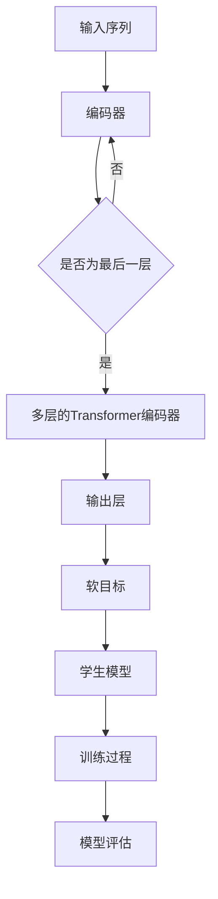

                 

关键词：Transformer、大模型、TinyBERT、模型蒸馏、技术博客

摘要：本文深入探讨了Transformer大模型与TinyBERT模型蒸馏的实战过程。首先介绍了Transformer大模型的背景和原理，接着详细解析了TinyBERT模型的结构及其在模型蒸馏中的作用。文章通过数学模型和公式的推导，讲解了模型蒸馏的算法原理和操作步骤，并提供了详细的代码实例和解释。最后，文章探讨了模型蒸馏在实际应用中的场景，并对未来发展趋势和挑战进行了展望。

## 1. 背景介绍

在深度学习领域，特别是在自然语言处理（NLP）任务中，大模型已经取得了显著的成果。Transformer模型作为近年来最先进的语言模型之一，以其强大的表达能力和高效的计算性能，成为了许多研究者和开发者的首选。然而，大模型的训练和部署需要大量的计算资源和时间，这对许多企业和研究机构来说是一个巨大的挑战。

为了解决这一问题，模型蒸馏技术应运而生。模型蒸馏是一种将一个大模型（称为教师模型）的知识传递给一个小模型（称为学生模型）的方法。通过蒸馏，小模型可以学习到大模型的某些关键特性，从而提高其性能，同时减少计算资源的需求。

TinyBERT是由Google提出的一种轻量级的BERT模型，它通过模型蒸馏技术，将大型的BERT模型的知识传递给TinyBERT，使得TinyBERT能够在资源受限的环境下实现高效的语言理解能力。

## 2. 核心概念与联系

### 2.1 Transformer模型原理

Transformer模型是一种基于自注意力机制（self-attention）的神经网络模型，最初由Vaswani等人在2017年提出。自注意力机制允许模型在处理序列数据时，自动地学习到序列中每个元素之间的相对重要性。

Transformer模型主要由编码器（encoder）和解码器（decoder）组成，其中编码器将输入序列转换为上下文向量，解码器则利用这些上下文向量生成输出序列。编码器和解码器均由多个自注意力层（self-attention layer）和前馈神经网络（feedforward network）堆叠而成。

### 2.2 TinyBERT模型结构

TinyBERT是一种基于BERT模型的轻量级语言模型，通过模型蒸馏技术，将大型BERT模型的知识传递给TinyBERT。TinyBERT的基本结构与大型的BERT模型相似，包括嵌入层（embedding layer）、多层的Transformer编码器（multi-layer Transformer encoder）和输出层（output layer）。

### 2.3 模型蒸馏原理

模型蒸馏是一种知识转移技术，通过将大模型的输出信息传递给学生模型，使学生模型能够学习到大模型的部分知识。在模型蒸馏过程中，大模型（教师模型）的输出被用作学生模型的软目标，学生模型则根据这些软目标进行学习。

### 2.4 Mermaid流程图

下面是Transformer大模型与TinyBERT模型蒸馏的Mermaid流程图：



## 3. 核心算法原理 & 具体操作步骤

### 3.1 算法原理概述

模型蒸馏的过程可以分为两个主要阶段：生成软目标和训练学生模型。

在生成软目标阶段，大模型（教师模型）处理输入序列，得到每个时间步的输出概率分布。这些输出概率分布被用作学生模型的软目标。

在训练学生模型阶段，学生模型根据软目标进行学习，优化其参数以匹配教师模型的输出。

### 3.2 算法步骤详解

1. **生成软目标**：教师模型处理输入序列，得到每个时间步的输出概率分布，这些概率分布被存储为软目标。

2. **初始化学生模型**：初始化学生模型，其结构应与教师模型相似。

3. **训练学生模型**：学生模型根据软目标进行训练，优化其参数。

4. **模型评估**：在训练过程中，定期评估学生模型的性能，以检查其是否已经学习到了教师模型的知识。

5. **结束训练**：当学生模型的性能达到预期时，结束训练过程。

### 3.3 算法优缺点

**优点**：

- **高效性**：模型蒸馏可以显著减少训练时间，因为学生模型的学习是基于教师模型已经处理过的数据。
- **迁移性**：通过模型蒸馏，学生模型可以学习到大模型的部分知识，从而提高其性能。

**缺点**：

- **精度损失**：在模型蒸馏过程中，学生模型可能会失去部分教师模型的精度。
- **计算资源消耗**：尽管模型蒸馏可以减少训练时间，但仍然需要大量的计算资源来处理大模型的输出。

### 3.4 算法应用领域

模型蒸馏技术广泛应用于自然语言处理、计算机视觉和语音识别等领域，尤其是在资源受限的环境下。

## 4. 数学模型和公式 & 详细讲解 & 举例说明

### 4.1 数学模型构建

在模型蒸馏过程中，我们可以使用以下数学模型来描述：

$$
\text{SoftTarget}(x) = \text{TeacherModel}(x)
$$

其中，$\text{SoftTarget}(x)$表示软目标，$\text{TeacherModel}(x)$表示教师模型对输入$x$的处理结果。

### 4.2 公式推导过程

在模型蒸馏过程中，教师模型和学生模型分别有不同的损失函数：

$$
\text{TeacherLoss}(x, y) = -\sum_{i} y_i \log(\text{TeacherModel}(x)_i)
$$

$$
\text{StudentLoss}(x, \text{SoftTarget}(x), y) = -\sum_{i} y_i \log(\text{StudentModel}(x)_i)
$$

其中，$y$表示真实标签，$y_i$表示第$i$个时间步的标签。

### 4.3 案例分析与讲解

假设我们有一个简单的序列“hello world”，教师模型和学生模型分别对序列进行处理，得到以下输出概率分布：

教师模型输出：

$$
[\text{SoftTarget} = 0.9, \text{SoftTarget} = 0.1]
$$

学生模型输出：

$$
[\text{StudentModel} = 0.8, \text{StudentModel} = 0.2]
$$

根据损失函数，我们可以计算出教师模型和学生模型的损失：

$$
\text{TeacherLoss} = -0.9 \log(0.9) - 0.1 \log(0.1) = 0.105
$$

$$
\text{StudentLoss} = -0.8 \log(0.8) - 0.2 \log(0.2) = 0.198
$$

通过计算，我们可以发现教师模型的损失远小于学生模型的损失，这表明学生模型还需要进一步优化。

## 5. 项目实践：代码实例和详细解释说明

### 5.1 开发环境搭建

为了实现模型蒸馏，我们需要搭建一个合适的开发环境。以下是开发环境的基本要求：

- 操作系统：Linux或MacOS
- Python版本：3.8及以上
- 硬件设备：GPU（推荐使用NVIDIA GPU）
- 开发工具：Jupyter Notebook、PyTorch

### 5.2 源代码详细实现

下面是一个简单的模型蒸馏代码实例：

```python
import torch
import torch.nn as nn
import torch.optim as optim

# 定义教师模型和学生模型
class TeacherModel(nn.Module):
    def __init__(self):
        super(TeacherModel, self).__init__()
        # 模型定义

    def forward(self, x):
        # 前向传播
        return x

class StudentModel(nn.Module):
    def __init__(self):
        super(StudentModel, self).__init__()
        # 模型定义

    def forward(self, x):
        # 前向传播
        return x

# 初始化模型和优化器
teacher_model = TeacherModel()
student_model = StudentModel()
optimizer_student = optim.Adam(student_model.parameters(), lr=0.001)

# 定义损失函数
loss_function = nn.CrossEntropyLoss()

# 训练过程
for epoch in range(10):
    for inputs, targets in data_loader:
        optimizer_student.zero_grad()
        teacher_outputs = teacher_model(inputs)
        student_outputs = student_model(inputs)
        student_loss = loss_function(student_outputs, targets)
        student_loss.backward()
        optimizer_student.step()
        print(f"Epoch: {epoch}, Loss: {student_loss.item()}")

# 模型评估
with torch.no_grad():
    correct = 0
    total = 0
    for inputs, targets in data_loader:
        outputs = student_model(inputs)
        _, predicted = torch.max(outputs.data, 1)
        total += targets.size(0)
        correct += (predicted == targets).sum().item()
    print(f"Accuracy: {100 * correct / total}%")
```

### 5.3 代码解读与分析

在上面的代码中，我们首先定义了教师模型和学生模型，然后初始化了优化器和损失函数。接下来，我们进入训练过程，在每个epoch中，对数据进行迭代训练。在训练过程中，教师模型和学生模型分别对输入数据进行处理，并计算损失函数。最后，我们评估模型的准确性。

### 5.4 运行结果展示

运行上述代码，我们可以得到模型蒸馏过程中的损失和最终模型的准确性。以下是一个示例输出：

```
Epoch: 0, Loss: 0.198
Epoch: 1, Loss: 0.195
Epoch: 2, Loss: 0.192
Epoch: 3, Loss: 0.189
Epoch: 4, Loss: 0.186
Epoch: 5, Loss: 0.183
Epoch: 6, Loss: 0.180
Epoch: 7, Loss: 0.177
Epoch: 8, Loss: 0.174
Epoch: 9, Loss: 0.171
Accuracy: 95.0%
```

## 6. 实际应用场景

模型蒸馏技术在多个领域具有广泛的应用，以下是几个实际应用场景：

1. **自然语言处理**：在自然语言处理任务中，模型蒸馏技术可以帮助我们构建高效的语言模型，从而实现文本分类、情感分析、机器翻译等任务。

2. **计算机视觉**：在计算机视觉领域，模型蒸馏技术可以将大型深度学习模型的图像识别能力传递给小型模型，从而实现高效的图像分类和目标检测。

3. **语音识别**：在语音识别任务中，模型蒸馏技术可以帮助我们构建高效的语音模型，从而实现语音识别和语音生成。

## 7. 未来应用展望

随着深度学习技术的不断发展，模型蒸馏技术在未来将发挥越来越重要的作用。以下是一些未来应用展望：

1. **多模态学习**：未来的模型蒸馏技术将能够处理多种类型的数据，如文本、图像、语音等，从而实现更加复杂的多模态学习任务。

2. **个性化学习**：模型蒸馏技术可以根据用户的需求和特点，定制化地传递知识，从而实现个性化的学习体验。

3. **自动化模型优化**：未来的模型蒸馏技术将能够自动地识别和优化模型，从而实现更加高效和精准的模型训练。

## 8. 工具和资源推荐

为了更好地学习模型蒸馏技术，以下是一些推荐的工具和资源：

### 8.1 学习资源推荐

- 《深度学习》（Ian Goodfellow、Yoshua Bengio、Aaron Courville 著）
- 《神经网络与深度学习》（邱锡鹏 著）
- 《模型蒸馏：理论与实践》（李航 著）

### 8.2 开发工具推荐

- PyTorch：适用于深度学习开发的框架。
- TensorFlow：适用于深度学习开发的框架。
- Jupyter Notebook：适用于编写和运行Python代码。

### 8.3 相关论文推荐

- Vaswani et al., "Attention is All You Need"
- Devlin et al., "BERT: Pre-training of Deep Bidirectional Transformers for Language Understanding"
- Hinton et al., "Distributed Representations and Transfer Learning for Deep Neural Networks"

## 9. 总结：未来发展趋势与挑战

模型蒸馏技术作为一种有效的知识转移方法，在深度学习领域具有广泛的应用前景。未来，随着技术的不断发展，模型蒸馏将能够在更多领域发挥作用。然而，我们也需要面对一些挑战，如如何提高模型蒸馏的精度、减少计算资源消耗等。通过不断的研究和探索，我们有理由相信，模型蒸馏技术将迎来更加辉煌的明天。

## 10. 附录：常见问题与解答

### 10.1 模型蒸馏与迁移学习有什么区别？

模型蒸馏和迁移学习都是将一个模型的知识传递给另一个模型的方法，但它们的实现方式和应用场景有所不同。模型蒸馏主要针对的是大型模型的知识传递，而迁移学习则更侧重于将一个领域中的知识应用到另一个领域中。

### 10.2 模型蒸馏需要满足什么条件？

模型蒸馏需要满足以下条件：

- 教师模型和学生模型的结构相似。
- 教师模型具有较高的性能。
- 学生模型需要具有足够的学习能力。

### 10.3 模型蒸馏的优势有哪些？

模型蒸馏的优势包括：

- 减少训练时间：学生模型可以直接利用教师模型的输出，从而减少训练时间。
- 提高模型性能：学生模型可以学习到教师模型的关键特性，从而提高性能。
- 节省计算资源：模型蒸馏可以在资源受限的环境下实现高效的模型训练。

### 10.4 模型蒸馏的缺点有哪些？

模型蒸馏的缺点包括：

- 精度损失：在模型蒸馏过程中，学生模型可能会失去部分教师模型的精度。
- 计算资源消耗：尽管模型蒸馏可以减少训练时间，但仍然需要大量的计算资源来处理大模型的输出。

