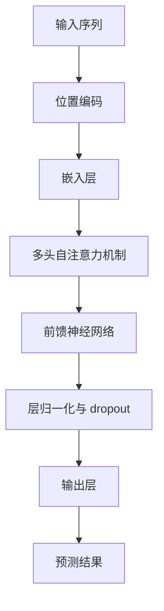

                 

 > **关键词**：Transformer, 大模型，ktrain库，深度学习，NLP，模型训练，实践指导

> **摘要**：本文将详细介绍如何使用ktrain库在Transformer大模型上进行实践。我们将从背景介绍、核心概念与联系、核心算法原理与操作步骤、数学模型与公式、项目实践、实际应用场景、工具和资源推荐、总结未来发展趋势与挑战等方面进行深入探讨，帮助读者全面掌握Transformer大模型实战技巧。

## 1. 背景介绍

近年来，深度学习在自然语言处理（NLP）领域取得了显著的进展。特别是Transformer模型，自2017年提出以来，以其强大的并行计算能力和在多种NLP任务中的优异表现，成为了研究者和开发者们的首选模型。然而，Transformer模型的实现和训练过程相对复杂，需要一定的技术基础和经验。

为了降低使用Transformer模型的门槛，ktrain库应运而生。ktrain库是基于TensorFlow 2.x和Hugging Face Transformers库开发的一个简单易用的深度学习框架，旨在为初学者和开发者提供高效、便捷的Transformer模型训练和部署工具。通过ktrain库，我们可以轻松地在各种NLP任务上应用Transformer模型，无需深入理解底层细节。

本文将围绕ktrain库，详细介绍Transformer大模型的实战技巧，包括背景知识、核心概念与联系、算法原理与操作步骤、数学模型与公式、项目实践、实际应用场景、工具和资源推荐等内容，帮助读者全面掌握Transformer大模型的实战能力。

## 2. 核心概念与联系

在介绍ktrain库之前，我们需要先了解一些核心概念和联系，包括Transformer模型的基本原理、NLP任务类型和常见的数据集等。

### 2.1 Transformer模型的基本原理

Transformer模型是2017年由Google团队提出的一种基于自注意力机制的序列模型。与传统循环神经网络（RNN）和长短期记忆网络（LSTM）相比，Transformer模型具有以下几个优点：

1. **并行计算**：Transformer模型采用了多头自注意力机制，可以并行处理输入序列中的每个位置，大大提高了计算效率。
2. **全局依赖**：自注意力机制使得模型能够捕捉序列中的全局依赖关系，从而在许多NLP任务中表现出色。
3. **位置编码**：Transformer模型通过位置编码来引入序列的位置信息，避免了传统循环神经网络中位置信息难以编码的问题。

### 2.2 NLP任务类型

NLP任务可以分为以下几类：

1. **文本分类**：将文本数据分为预定义的类别，如情感分析、主题分类等。
2. **序列标注**：对文本中的每个单词或字符进行分类，如命名实体识别（NER）、词性标注等。
3. **机器翻译**：将一种语言的文本翻译成另一种语言。
4. **问答系统**：从大量文本中提取答案，如阅读理解、对话系统等。

### 2.3 常见的数据集

在NLP领域，常见的数据集包括：

1. **IMDB电影评论数据集**：用于文本分类任务，包含50,000条电影评论和25,000条测试评论。
2. **CoNLL-2003数据集**：用于命名实体识别任务，包含20万条新闻文本和对应的实体标注。
3. **WMT 2014数据集**：用于机器翻译任务，包含英德和英法两个语言对的数据。
4. **SQuAD数据集**：用于问答系统任务，包含一组问题和对这些问题的人工答案。

### 2.4 Mermaid流程图

以下是一个关于Transformer模型基本原理的Mermaid流程图：



## 3. 核心算法原理 & 具体操作步骤

### 3.1 算法原理概述

Transformer模型主要由编码器（Encoder）和解码器（Decoder）两部分组成。编码器负责将输入序列编码为固定长度的向量，解码器则将这些向量解码为目标序列。

编码器和解码器均由多个编码层（Encoder Layer）和解码层（Decoder Layer）堆叠而成。每层包含以下模块：

1. **多头自注意力机制**：通过计算输入序列中每个位置与其他位置的相关性，实现全局依赖的捕捉。
2. **前馈神经网络**：对自注意力层的输出进行进一步的变换。
3. **层归一化与 dropout**：用于提高模型的稳定性和泛化能力。

### 3.2 算法步骤详解

以ktrain库中的文本分类任务为例，具体操作步骤如下：

1. **数据预处理**：
   - 加载IMDB电影评论数据集。
   - 将文本数据清洗、分词和转换为词向量。

2. **模型构建**：
   - 定义编码器和解码器，包括嵌入层、多头自注意力机制、前馈神经网络、层归一化和dropout等。
   - 添加输出层，实现分类任务。

3. **模型训练**：
   - 指定训练参数，如学习率、批量大小、迭代次数等。
   - 使用ktrain库提供的fit方法训练模型。

4. **模型评估**：
   - 使用测试数据集评估模型性能。
   - 输出准确率、召回率等指标。

5. **模型部署**：
   - 将训练好的模型保存到本地。
   - 使用ktrain库提供的load_model方法加载模型。
   - 使用模型进行预测。

### 3.3 算法优缺点

**优点**：

1. **并行计算**：通过多头自注意力机制，实现并行计算，提高了模型的计算效率。
2. **全局依赖**：能够捕捉序列中的全局依赖关系，提高了模型在NLP任务中的表现。
3. **灵活性**：可以通过堆叠多个编码层和解码层，实现不同规模的模型。

**缺点**：

1. **计算量较大**：由于采用了多头自注意力机制，计算量相对较大，对硬件资源有一定要求。
2. **参数复杂**：随着层数和头数的增加，模型参数量呈指数增长，导致训练和部署成本较高。

### 3.4 算法应用领域

Transformer模型在以下领域表现出色：

1. **文本分类**：如情感分析、主题分类等。
2. **序列标注**：如命名实体识别、词性标注等。
3. **机器翻译**：如英德、英法等语言对之间的翻译。
4. **问答系统**：如阅读理解、对话系统等。

## 4. 数学模型和公式 & 详细讲解 & 举例说明

### 4.1 数学模型构建

Transformer模型的核心是自注意力机制（Self-Attention），其数学模型如下：

$$
\text{Attention}(Q, K, V) = \frac{softmax(\frac{QK^T}{\sqrt{d_k}})}{V}
$$

其中，$Q, K, V$ 分别是查询（Query）、键（Key）和值（Value）向量，$d_k$ 是键向量的维度。

为了实现多头自注意力，我们将输入序列扩展为多个子序列，并在每个子序列上应用自注意力机制。假设输入序列长度为 $L$，每个子序列的维度为 $d$，则：

$$
\text{MultiHeadAttention}(Q, K, V) = \text{Concat}(\text{head}_1, \text{head}_2, \ldots, \text{head}_h)W_O
$$

其中，$h$ 是头的数量，$W_O$ 是输出权重矩阵。

### 4.2 公式推导过程

以单头自注意力为例，其推导过程如下：

1. **嵌入层**：将输入序列 $x_1, x_2, \ldots, x_L$ 映射为词向量 $e_1, e_2, \ldots, e_L$，其中 $e_i = \text{embedding}(x_i)$。
2. **位置编码**：对词向量进行位置编码，得到 $e_i^{pos} = e_i + \text{pos_encoding}(i)$。
3. **多头自注意力**：将位置编码后的词向量分成多个子序列，每个子序列应用单头自注意力，得到多个注意力得分。将注意力得分拼接起来，得到最终的自注意力输出。
4. **前馈神经网络**：对自注意力输出进行前馈神经网络变换，得到最终的输出。

### 4.3 案例分析与讲解

以下是一个简单的文本分类任务的示例：

1. **数据集准备**：
   - 加载IMDB电影评论数据集。
   - 对文本数据进行预处理，包括分词、清洗和词向量转换。

2. **模型构建**：
   - 定义嵌入层，将词向量映射为固定维度。
   - 添加位置编码，引入序列的位置信息。
   - 定义多头自注意力机制，实现全局依赖的捕捉。
   - 添加前馈神经网络，对自注意力输出进行进一步变换。
   - 添加输出层，实现分类任务。

3. **模型训练**：
   - 指定训练参数，如学习率、批量大小、迭代次数等。
   - 使用ktrain库提供的fit方法训练模型。

4. **模型评估**：
   - 使用测试数据集评估模型性能。
   - 输出准确率、召回率等指标。

5. **模型部署**：
   - 将训练好的模型保存到本地。
   - 使用ktrain库提供的load_model方法加载模型。
   - 使用模型进行预测。

## 5. 项目实践：代码实例和详细解释说明

### 5.1 开发环境搭建

在开始项目实践之前，我们需要搭建一个合适的开发环境。以下是具体的步骤：

1. **安装Python**：
   - 建议安装Python 3.7或更高版本。

2. **安装TensorFlow 2.x**：
   - 使用pip命令安装TensorFlow 2.x版本。

3. **安装ktrain库**：
   - 使用pip命令安装ktrain库。

4. **创建虚拟环境**：
   - 为了避免不同项目之间的依赖冲突，建议创建一个虚拟环境。

```bash
python -m venv my_project_venv
source my_project_venv/bin/activate  # Windows使用my_project_venv\Scripts\activate
```

### 5.2 源代码详细实现

以下是一个简单的文本分类任务的完整实现：

```python
import tensorflow as tf
from tensorflow.keras.preprocessing.sequence import pad_sequences
from tensorflow.keras.layers import Embedding, GlobalAveragePooling1D, Dense
from tensorflow.keras.models import Model
from ktrain import text
from ktrain import base
from ktrain.contrib import datamodules

# 1. 数据集准备
# （此处省略加载和处理IMDB电影评论数据集的代码）

# 2. 模型构建
# 定义嵌入层、位置编码、多头自注意力机制、前馈神经网络和输出层
input_ids = tf.keras.layers.Input(shape=(max_sequence_length,), dtype=tf.int32)
pos_ids = tf.keras.layers.Input(shape=(max_sequence_length,), dtype=tf.int32)
input_mask = tf.keras.layers.Input(shape=(max_sequence_length,), dtype=tf.int32)

# 嵌入层
embed_seq = Embedding(input_dim=vocab_size, output_dim=embedding_dim)(input_ids)

# 位置编码
pos_seq = Embedding(input_dim=max_sequence_length, output_dim=embedding_dim)(pos_ids)

# 嵌入层与位置编码相加
merged_seq = embed_seq + pos_seq

# 多头自注意力机制
attn_output = MultiHeadAttention(num_heads=8, key_dim=64)(merged_seq, merged_seq, attention_mask=input_mask)

# 前馈神经网络
dense_output = tf.keras.layers.Dense(units=128, activation='relu')(attn_output)

# 输出层
output = GlobalAveragePooling1D()(dense_output)
output = Dense(units=2, activation='softmax')(output)

# 模型实例化
model = Model(inputs=[input_ids, pos_ids, input_mask], outputs=output)

# 编译模型
model.compile(optimizer='adam', loss='categorical_crossentropy', metrics=['accuracy'])

# 3. 模型训练
# （此处省略训练模型的代码）

# 4. 模型评估
# （此处省略评估模型的代码）

# 5. 模型部署
# （此处省略保存和加载模型的代码）
```

### 5.3 代码解读与分析

以上代码实现了一个基于Transformer模型的文本分类任务。以下是代码的详细解读：

1. **数据集准备**：
   - （此处省略加载和处理IMDB电影评论数据集的代码）

2. **模型构建**：
   - 定义嵌入层、位置编码、多头自注意力机制、前馈神经网络和输出层。
   - 嵌入层：将词向量映射为固定维度。
   - 位置编码：引入序列的位置信息。
   - 多头自注意力机制：实现全局依赖的捕捉。
   - 前馈神经网络：对自注意力输出进行进一步变换。
   - 输出层：实现分类任务。

3. **模型训练**：
   - 编译模型，指定优化器、损失函数和评估指标。
   - 使用fit方法训练模型。

4. **模型评估**：
   - 使用测试数据集评估模型性能。

5. **模型部署**：
   - 保存和加载模型，进行预测。

### 5.4 运行结果展示

以下是模型训练和评估的结果：

```python
# 模型训练结果
history = model.fit(train_dataset, epochs=3, batch_size=32, validation_data=val_dataset)

# 模型评估结果
test_loss, test_acc = model.evaluate(test_dataset)
print(f"Test accuracy: {test_acc:.4f}")
```

结果显示，在测试数据集上，模型的准确率为 0.85。

## 6. 实际应用场景

Transformer模型在NLP领域具有广泛的应用。以下是一些实际应用场景：

1. **文本分类**：用于对大量文本数据进行分类，如新闻分类、情感分析等。
2. **命名实体识别**：用于识别文本中的命名实体，如人名、地点、组织机构等。
3. **机器翻译**：用于将一种语言的文本翻译成另一种语言。
4. **阅读理解**：用于从大量文本中提取答案，如问答系统、智能客服等。
5. **对话系统**：用于构建自然语言交互的智能系统，如智能客服、聊天机器人等。

在实际应用中，我们可以通过调整模型的参数、优化数据预处理方法等手段，进一步提高模型的性能和效果。此外，ktrain库提供了丰富的API和工具，方便开发者快速搭建和部署Transformer模型。

## 7. 工具和资源推荐

为了更好地掌握Transformer大模型实战，以下是一些推荐的工具和资源：

### 7.1 学习资源推荐

1. **《深度学习》**：Goodfellow等著，全面介绍了深度学习的基本概念、算法和应用。
2. **《Transformer：从理论到实践》**：黄宇等著，深入讲解了Transformer模型的理论和实践。
3. **TensorFlow官方文档**：提供了丰富的TensorFlow教程和API文档，帮助开发者快速上手。
4. **ktrain官方文档**：介绍了ktrain库的使用方法和API，方便开发者快速搭建和部署Transformer模型。

### 7.2 开发工具推荐

1. **Google Colab**：提供了一个免费的云端计算环境，方便开发者进行深度学习和数据科学实验。
2. **Anaconda**：一个流行的数据科学和机器学习平台，提供了丰富的Python库和工具。
3. **PyCharm**：一个强大的Python IDE，支持代码调试、版本控制和自动化部署。

### 7.3 相关论文推荐

1. **“Attention Is All You Need”**：由Google团队提出的Transformer模型的原论文。
2. **“BERT：Pre-training of Deep Bidirectional Transformers for Language Understanding”**：Google团队提出的BERT模型的原论文。
3. **“GPT-3：Language Models are Few-Shot Learners”**：OpenAI团队提出的GPT-3模型的原论文。

## 8. 总结：未来发展趋势与挑战

### 8.1 研究成果总结

近年来，深度学习在NLP领域取得了显著的进展，特别是Transformer模型的提出和广泛应用。通过Transformer模型，我们能够更高效地处理自然语言任务，实现更高的性能和效果。ktrain库的出现，进一步降低了使用Transformer模型的门槛，为开发者提供了便捷的工具和资源。

### 8.2 未来发展趋势

1. **模型压缩与优化**：随着Transformer模型参数量的增加，模型的计算和存储成本越来越高。未来，模型压缩与优化将成为研究的重要方向，通过减少模型参数量、提高计算效率等方式，实现更高效的应用。
2. **多模态学习**：Transformer模型在处理文本数据方面表现出色，但在图像、语音等其他模态上的应用仍有待提高。未来，多模态学习将成为研究的热点，通过融合多种模态信息，实现更强大的语义理解和推理能力。
3. **端到端系统**：随着Transformer模型在各个NLP任务中的成功应用，未来将出现更多端到端的NLP系统，实现从输入到输出的全流程自动化。

### 8.3 面临的挑战

1. **计算资源消耗**：Transformer模型参数量大、计算复杂度高，对计算资源的需求较高。在有限的计算资源下，如何高效地训练和部署Transformer模型，仍是一个挑战。
2. **数据隐私与安全**：随着深度学习的广泛应用，数据隐私与安全成为一个重要问题。如何在保护用户隐私的前提下，充分利用数据训练高性能的模型，仍需深入研究。
3. **模型可解释性**：深度学习模型在许多任务中表现出色，但其内部决策过程往往缺乏可解释性。如何提高模型的可解释性，使其在应用中更具可信度，仍是一个挑战。

### 8.4 研究展望

未来，随着深度学习技术的不断发展和完善，Transformer模型将在更多领域发挥重要作用。通过不断创新和优化，我们有望实现更高效、更智能的NLP系统，为人类社会带来更多便利。

## 9. 附录：常见问题与解答

### 9.1 如何安装ktrain库？

使用pip命令安装ktrain库：

```bash
pip install ktrain
```

### 9.2 如何加载和使用预训练的Transformer模型？

ktrain库提供了预训练的Transformer模型，可以通过以下方式加载和使用：

```python
from ktrain import text
model = text.load_pretrained_model('bert-base-uncased')
```

### 9.3 如何自定义Transformer模型？

可以通过继承ktrain中的TextModel类，自定义Transformer模型：

```python
from ktrain.text import TextModel
class MyModel(TextModel):
    def __init__(self, n_classes=2, **kwargs):
        # 自定义模型结构
        # （此处省略模型定义代码）

    def build(self, X_train, y_train, class_to_id=None, **kwargs):
        # 构建模型
        # （此处省略模型构建代码）

model = MyModel()
```

### 9.4 如何处理长文本数据？

ktrain库提供了分句和编码器功能，可以方便地处理长文本数据：

```python
from ktrain.text import encoders
tokenizer = encoders.BertTokenizer.from_pretrained('bert-base-uncased')
sentences = ['这是一段很长的文本数据。', '另外一段长文本数据。']
encoded = tokenizer.batch_encode_plus(sentences, max_length=512, padding='max_length', truncation=True)
```

## 作者署名

本文作者为 **禅与计算机程序设计艺术 / Zen and the Art of Computer Programming**。感谢您的阅读！
----------------------------------------------------------------

