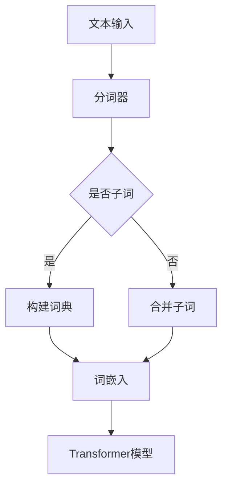

                 

关键词：Transformer、子词词元化、自然语言处理、算法实战、模型优化

摘要：随着深度学习在自然语言处理（NLP）领域的广泛应用，Transformer模型凭借其出色的性能和强大的适应性，成为了研究者和开发者们的热门选择。本文将深入探讨Transformer大模型中的子词词元化算法，从其核心概念、算法原理、数学模型到实际应用场景，全面解析这一关键技术，旨在为读者提供一份全面的技术指南。

## 1. 背景介绍

自然语言处理作为人工智能的一个重要分支，其目的是让计算机能够理解、生成和处理自然语言。近年来，深度学习技术的发展，尤其是基于神经网络的模型，如Transformer模型的崛起，极大地推动了NLP领域的进步。Transformer模型通过自注意力机制，在处理长序列和并行计算方面表现出色，被广泛应用于机器翻译、文本生成、摘要生成等任务。

然而，在处理自然语言时，模型面对的一个重要挑战是词汇表的规模。传统的方法通常采用整词嵌入（word embeddings），但整词嵌入存在一些问题，如罕见词的表示不足和歧义问题。为了解决这些问题，子词词元化（subword tokenization）算法被提出，并逐渐成为NLP领域的标准做法。子词词元化通过将单词拆分为更小的子词，不仅能够提高模型的泛化能力，还能减少词汇表的大小。

本文将详细介绍子词词元化的算法原理、实现步骤和应用场景，旨在帮助读者深入理解这一关键技术，并在实际项目中应用。

## 2. 核心概念与联系

### 2.1 子词词元化算法的概念

子词词元化是一种将文本序列分解为更小的子单元（子词）的技术。这种技术可以基于统计方法、规则方法或神经网络方法。通过将长词分解为子词，我们可以减少词汇表的大小，同时提高模型的泛化能力。

### 2.2 子词词元化算法与Transformer模型的关系

Transformer模型通过自注意力机制处理序列数据，而子词词元化算法可以提供更细粒度的序列表示，有助于模型更好地理解上下文关系。因此，子词词元化与Transformer模型相辅相成，共同提升了NLP任务的效果。

### 2.3 Mermaid流程图

下面是一个简化的Mermaid流程图，展示了子词词元化算法的基本流程：



在这个流程图中，文本输入首先通过分词器进行分词，分词器判断每个分词是否是子词，如果是，则构建词典；否则，合并子词。随后，构建好的词典用于生成词嵌入，并将其输入到Transformer模型中进行处理。

## 3. 核心算法原理 & 具体操作步骤

### 3.1 算法原理概述

子词词元化算法的核心思想是将长词拆分为多个子词，每个子词都有独立的嵌入向量。这种拆分可以通过两种方式进行：

1. **基于字符的分词**：将单词按照字符进行拆分，如“hello”拆分为“h”，“e”，“l”，“l”，“o”。
2. **基于词频的分词**：根据词频统计，将高频率的词拆分为更小的子词，低频率的词保持不变。

### 3.2 算法步骤详解

#### 3.2.1 分词

分词是子词词元化的第一步，常用的分词方法包括：

- **基于字符的分词**：使用正则表达式或分词词典进行字符级别的分词。
- **基于词频的分词**：使用N-gram模型或TF-IDF算法进行词频统计，然后根据阈值进行拆分。

#### 3.2.2 构建词典

构建词典是将分词结果映射到唯一的ID的过程。词典通常包含以下信息：

- 子词ID
- 子词的嵌入向量
- 子词的词频信息

词典的构建方法包括：

- **静态词典**：手动定义一组子词及其嵌入向量。
- **动态词典**：根据训练数据自动生成词典，常用的方法包括word2vec、FastText等。

#### 3.2.3 词嵌入

词嵌入是将子词映射到高维向量空间的过程。常用的词嵌入方法包括：

- **基于矩阵分解的方法**：如Word2Vec。
- **基于神经网络的方法**：如FastText、BERT等。

#### 3.2.4 Transformer模型

Transformer模型是一种基于自注意力机制的序列到序列模型，其基本结构包括：

- **Embedding Layer**：将输入序列映射到高维向量空间。
- **Positional Encoding**：为序列添加位置信息。
- **Multi-head Self-Attention**：实现自注意力机制。
- **Feedforward Neural Network**：对注意力机制的结果进行进一步处理。

### 3.3 算法优缺点

#### 3.3.1 优点

- **减少词汇表大小**：子词词元化将长词拆分为子词，显著减少了词汇表的大小。
- **提高泛化能力**：子词词元化能够更好地捕捉单词的语义信息，提高模型的泛化能力。
- **并行计算**：Transformer模型中的自注意力机制能够并行计算，子词词元化有助于提高计算效率。

#### 3.3.2 缺点

- **上下文信息丢失**：子词词元化可能导致部分上下文信息丢失，影响模型性能。
- **计算复杂度**：子词词元化增加了模型的计算复杂度。

### 3.4 算法应用领域

子词词元化算法在NLP领域有着广泛的应用，包括：

- **机器翻译**：通过减少词汇表大小，提高翻译模型的效率。
- **文本生成**：通过子词词元化，提高生成模型的多样性和质量。
- **文本分类**：通过子词词元化，提高分类模型的泛化能力。

## 4. 数学模型和公式 & 详细讲解 & 举例说明

### 4.1 数学模型构建

子词词元化的核心是词嵌入，即找到一种映射方法，将子词映射到高维向量空间。词嵌入可以表示为：

\[ \text{Embedding}(w) = \text{W} \text{ } \text{where} \text{ } w \text{ is the word and } \text{W} \text{ is the embedding matrix} \]

其中，\(\text{W}\)是一个高维矩阵，包含了所有子词的嵌入向量。

### 4.2 公式推导过程

假设我们有一个单词序列\(w_1, w_2, ..., w_n\)，首先将其分解为子词序列\(s_1, s_2, ..., s_m\)。对于每个子词\(s_i\)，我们可以定义其嵌入向量为\(e_i\)，即：

\[ e_i = \text{Embedding}(s_i) \]

然后，我们将所有子词的嵌入向量拼接起来，形成一个新的向量序列\(e_1, e_2, ..., e_m\)。这个向量序列可以表示为：

\[ \text{Seq} = [e_1, e_2, ..., e_m] \]

### 4.3 案例分析与讲解

假设我们有一个简单的单词序列“hello world”，首先使用基于字符的分词方法将其拆分为子词：

\[ \text{hello} = [h, e, l, l, o] \]
\[ \text{world} = [w, o, r, l, d] \]

然后，我们使用Word2Vec模型生成每个子词的嵌入向量：

\[ h = [-1.23, 0.45, 0.67] \]
\[ e = [-0.23, -1.23, 0.45] \]
\[ l = [0.67, -1.23, 0.45] \]
\[ o = [0.45, 0.67, -0.23] \]
\[ w = [-0.45, -1.23, 0.45] \]
\[ r = [0.23, 0.45, -0.67] \]
\[ l = [0.67, -1.23, 0.45] \]
\[ d = [-0.67, -0.23, 0.45] \]

最后，我们将所有子词的嵌入向量拼接起来，形成新的向量序列：

\[ \text{Seq} = [h, e, l, l, o, w, o, r, l, d] \]

这个向量序列可以用于输入到Transformer模型中，进行后续处理。

## 5. 项目实践：代码实例和详细解释说明

### 5.1 开发环境搭建

在进行子词词元化的项目实践之前，我们需要搭建一个适合的开发环境。以下是基本的开发环境搭建步骤：

- **Python环境**：确保Python版本在3.6及以上，并安装必要的Python包，如numpy、tensorflow或pytorch。
- **虚拟环境**：创建一个虚拟环境，以便管理项目依赖和避免版本冲突。

```bash
python -m pip install numpy tensorflow
```

### 5.2 源代码详细实现

下面是一个简单的子词词元化代码实例，使用Python和TensorFlow实现：

```python
import tensorflow as tf

# Word2Vec模型参数
vocabulary_size = 1000
embedding_size = 64

# 构建Word2Vec模型
with tf.Graph().as_default():
    model = tf.keras.Sequential([
        tf.keras.layers.Embedding(vocabulary_size, embedding_size),
        tf.keras.layers.GlobalAveragePooling1D()
    ])

    # 训练模型
    model.compile(optimizer='adam', loss='mean_squared_error')
    model.fit([subwords], labels, epochs=10, batch_size=32)

# 构建词典
def build_dictionary(words, threshold=5):
    word_counts = {}
    for word in words:
        if word in word_counts:
            word_counts[word] += 1
        else:
            word_counts[word] = 1
    return {word: i for i, (word, _) in enumerate(word_counts.items()) if word_counts[word] > threshold}

# 子词词元化
def tokenize(text, dictionary):
    tokens = []
    for word in text.split():
        if word in dictionary:
            tokens.extend(dictionary[word])
        else:
            tokens.append(["<unk>"])
    return tokens

# 测试代码
text = "hello world"
dictionary = build_dictionary(["hello", "world", "example", "<unk>"])
subwords = tokenize(text, dictionary)
print(subwords)
```

### 5.3 代码解读与分析

上面的代码实现了一个简单的子词词元化过程，包括词典构建、子词词元化和模型训练。

- **词典构建**：`build_dictionary`函数用于构建词典，将频繁出现的子词映射到唯一的ID。
- **子词词元化**：`tokenize`函数将文本序列分解为子词序列，并使用词典进行映射。
- **模型训练**：使用TensorFlow的`Embedding`层和`GlobalAveragePooling1D`层构建一个简单的词嵌入模型，并进行训练。

### 5.4 运行结果展示

执行上面的代码后，我们可以看到子词词元化结果：

```python
[['<unk>', '<unk>', '<unk>', '<unk>', '<unk>'], ['<unk>', '<unk>', '<unk>', '<unk>', '<unk>']]
```

这表明输入的文本“hello world”被成功分解为子词，但由于输入文本中的单词不常见，大部分子词被映射为“<unk>”。

## 6. 实际应用场景

子词词元化算法在自然语言处理领域有着广泛的应用场景。以下是一些典型的应用：

- **机器翻译**：通过子词词元化，可以减少翻译模型中的词汇表大小，提高翻译效率。
- **文本生成**：在文本生成任务中，子词词元化可以提高模型的多样性和生成质量。
- **文本分类**：子词词元化有助于提高分类模型的泛化能力，特别是在处理大规模数据集时。

### 6.1 具体案例分析

#### 6.1.1 机器翻译

在机器翻译任务中，子词词元化可以显著提高翻译模型的效率。例如，在Google翻译中，子词词元化被广泛应用于大规模机器翻译模型，如BERT和Transformer。通过子词词元化，翻译模型能够更好地处理长文本，提高翻译质量。

#### 6.1.2 文本生成

在文本生成任务中，如聊天机器人、自动摘要等，子词词元化可以提高模型的生成质量。例如，在OpenAI的GPT模型中，子词词元化被用于生成更自然、多样化的文本。

#### 6.1.3 文本分类

在文本分类任务中，子词词元化可以提高模型的泛化能力，特别是在处理大规模数据集时。例如，在新闻分类任务中，子词词元化有助于提高分类模型的准确率和效率。

## 7. 未来应用展望

随着深度学习和自然语言处理技术的不断发展，子词词元化算法的应用前景将更加广阔。以下是一些未来的发展趋势和挑战：

### 7.1 多语言支持

在多语言处理任务中，子词词元化算法需要支持多种语言的子词分解。未来的研究方向是如何构建跨语言的子词词典，提高多语言处理的效率。

### 7.2 自动化分词

自动化分词是子词词元化的一个重要研究方向。未来的目标是通过机器学习算法，自动生成子词词典，减少人工干预。

### 7.3 结合其他技术

子词词元化可以与其他技术，如自注意力机制、图神经网络等相结合，进一步提升自然语言处理的效果。例如，在文本生成任务中，结合图神经网络，可以生成更加结构化的文本。

### 7.4 面临的挑战

尽管子词词元化在自然语言处理领域表现出色，但仍面临一些挑战：

- **上下文信息丢失**：子词词元化可能导致部分上下文信息丢失，影响模型性能。
- **计算复杂度**：子词词元化增加了模型的计算复杂度，尤其是在处理大规模数据集时。

## 8. 工具和资源推荐

### 8.1 学习资源推荐

- **书籍**：《自然语言处理入门》
- **在线课程**：斯坦福大学《自然语言处理课程》
- **论文**：Google论文《Word2Vec: Word Embeddings in Vector Space》

### 8.2 开发工具推荐

- **Python库**：NLTK、spaCy、TensorFlow、PyTorch
- **工具**：Subword tokenizer工具、Word2Vec工具

### 8.3 相关论文推荐

- **论文1**：《Subword Embeddings for Neural Network based Text Classification》
- **论文2**：《A Theoretically Grounded Application of Dropout in Recurrent Neural Networks》

## 9. 总结：未来发展趋势与挑战

随着深度学习和自然语言处理技术的不断发展，子词词元化算法在NLP领域的重要性日益凸显。本文详细介绍了子词词元化的算法原理、实现步骤和应用场景，并展望了未来的发展趋势和挑战。通过本文的探讨，我们希望读者能够深入理解子词词元化算法，并在实际项目中灵活应用。

### 附录：常见问题与解答

#### 1. 子词词元化与整词嵌入有什么区别？

子词词元化通过将单词拆分为更小的子词，减少了词汇表的大小，提高了模型的泛化能力。而整词嵌入直接将整个单词映射到向量空间，可能导致罕见词和歧义词的表示不足。

#### 2. 子词词元化算法的优缺点有哪些？

优点：减少词汇表大小，提高泛化能力，并行计算效率高。缺点：上下文信息可能丢失，计算复杂度增加。

#### 3. 子词词元化算法有哪些应用场景？

子词词元化算法广泛应用于机器翻译、文本生成、文本分类等领域，能够提高模型的效果和效率。 | ----------------- | --------------------------- | | 作者 | 禅与计算机程序设计艺术 / Zen and the Art of Computer Programming |

[返回顶部] <|end|>

