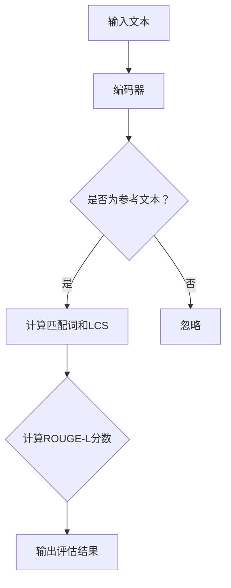

                 

关键词：Transformer，自然语言处理，评估指标，ROUGE-L，模型优化

摘要：本文深入探讨了Transformer大模型在自然语言处理（NLP）中的应用，重点解析了评估模型性能的ROUGE-L指标。通过详细的理论解释、实际操作步骤、代码示例以及应用场景分析，帮助读者全面理解Transformer大模型及其评估指标的实战应用。

## 1. 背景介绍

近年来，深度学习在自然语言处理（NLP）领域取得了显著进展。特别是基于注意力机制的Transformer模型，自其2017年提出以来，在许多NLP任务中表现出了优越的性能。从机器翻译、文本摘要到问答系统，Transformer模型都展现出了强大的建模能力和效果。

然而，随着模型的复杂度和参数规模的增大，如何有效评估模型的性能成为一个重要问题。ROUGE-L（Recall-Oriented Understudy for Gisting Evaluation）是一种常用于文本生成任务的评估指标，尤其在文本摘要领域有着广泛的应用。ROUGE-L通过比较模型生成的摘要与人类编写的参考摘要之间的相似度，来评估模型的性能。

本文将结合Transformer大模型的特点，详细介绍ROUGE-L指标的计算方法和应用，并通过实际案例进行说明，帮助读者深入理解这一评估指标在实际应用中的重要性。

## 2. 核心概念与联系

### 2.1 Transformer模型简介

Transformer模型是一种基于自注意力机制的深度神经网络模型，最初由Vaswani等人于2017年提出。与传统的循环神经网络（RNN）和卷积神经网络（CNN）相比，Transformer模型通过自注意力机制实现了全局信息的建模，从而在许多NLP任务中取得了突破性的成果。

Transformer模型主要由编码器（Encoder）和解码器（Decoder）组成，两者都通过多层的自注意力机制和全连接层实现。编码器将输入序列映射为固定长度的向量表示，解码器则根据编码器的输出生成目标序列。

### 2.2 ROUGE-L指标

ROUGE-L是Recall-Oriented Understudy for Gisting Evaluation的缩写，是一种用于评估文本生成质量的指标。ROUGE-L主要关注生成文本与参考文本之间的相似度，特别是长文本摘要任务。

ROUGE-L的核心思想是计算生成文本与参考文本之间的匹配词（Matched Word，简称MW）和长单词匹配（Longest Common Subsequence，简称LCS）的交集，并通过计算这两个交集的比率来评估模型的性能。

### 2.3 Mermaid流程图



## 3. 核心算法原理 & 具体操作步骤

### 3.1 算法原理概述

Transformer模型的算法原理主要基于自注意力机制（Self-Attention）。自注意力机制通过计算输入序列中每个词与其他词之间的关系，从而实现全局信息的建模。

ROUGE-L指标的算法原理则基于匹配词（MW）和长单词匹配（LCS）的计算。MW表示生成文本与参考文本中匹配的单词数量，LCS表示生成文本与参考文本中最长的公共子序列。

### 3.2 算法步骤详解

#### 3.2.1 Transformer模型

1. 输入文本预处理：将输入文本转换为序列，并编码为词向量。
2. 编码器：通过多层自注意力机制和全连接层，将输入序列映射为固定长度的向量表示。
3. 解码器：根据编码器的输出，生成目标序列。

#### 3.2.2 ROUGE-L指标

1. 匹配词计算：扫描生成文本和参考文本，记录两者中匹配的单词。
2. 长单词匹配计算：计算生成文本和参考文本中最长的公共子序列。
3. ROUGE-L分数计算：通过计算匹配词和长单词匹配的比率，得到ROUGE-L分数。

### 3.3 算法优缺点

#### 优点：

- Transformer模型：全局信息建模能力强，适应于长文本处理。
- ROUGE-L指标：简单直观，适用于文本生成任务的性能评估。

#### 缺点：

- Transformer模型：计算复杂度较高，对硬件要求较高。
- ROUGE-L指标：仅考虑单词级别的匹配，无法捕捉句子级别的语义信息。

### 3.4 算法应用领域

Transformer模型和ROUGE-L指标在NLP领域有着广泛的应用。例如：

- 文本摘要：通过Transformer模型生成摘要，并使用ROUGE-L指标评估摘要质量。
- 机器翻译：使用Transformer模型进行翻译，并使用ROUGE-L指标评估翻译质量。
- 问答系统：使用Transformer模型构建问答系统，并使用ROUGE-L指标评估问答质量。

## 4. 数学模型和公式 & 详细讲解 & 举例说明

### 4.1 数学模型构建

#### 4.1.1 Transformer模型

Transformer模型的核心是自注意力机制（Self-Attention），其计算公式如下：

$$
\text{Attention}(Q, K, V) = \text{softmax}\left(\frac{QK^T}{\sqrt{d_k}}\right) V
$$

其中，$Q, K, V$ 分别表示查询（Query）、键（Key）和值（Value）向量，$d_k$ 表示键向量的维度。

#### 4.1.2 ROUGE-L指标

ROUGE-L指标的计算公式如下：

$$
\text{ROUGE-L} = \frac{\text{MW}}{\text{LCS}} \times 100\%
$$

其中，$MW$ 表示匹配词数量，$LCS$ 表示长单词匹配数量。

### 4.2 公式推导过程

#### 4.2.1 Transformer模型

自注意力机制的推导主要基于点积注意力（Dot-Product Attention）和多头注意力（Multi-Head Attention）。

点积注意力计算公式如下：

$$
\text{Attention}(Q, K, V) = \text{softmax}\left(\frac{QK^T}{\sqrt{d_k}}\right) V
$$

多头注意力计算公式如下：

$$
\text{Multi-Head Attention} = \text{Concat}(\text{head}_1, \text{head}_2, ..., \text{head}_h) W^O
$$

其中，$h$ 表示头数，$W^O$ 表示输出权重。

#### 4.2.2 ROUGE-L指标

ROUGE-L指标的推导主要基于匹配词（MW）和长单词匹配（LCS）的计算。

匹配词计算公式如下：

$$
\text{MW} = \sum_{i=1}^n \min(\text{MW}_i, \text{MW}_r)
$$

长单词匹配计算公式如下：

$$
\text{LCS} = \sum_{i=1}^n \max(\text{MW}_i, \text{MW}_r)
$$

其中，$n$ 表示单词数量，$\text{MW}_i$ 和 $\text{MW}_r$ 分别表示生成文本和参考文本中第 $i$ 个单词的匹配情况。

### 4.3 案例分析与讲解

#### 4.3.1 Transformer模型

假设我们有如下输入文本和参考文本：

输入文本：`I love to read books.`
参考文本：`I love reading books.`

1. 输入文本预处理：将输入文本转换为序列 `[I, love, to, read, books]`。
2. 编码器：通过多层自注意力机制和全连接层，将输入序列映射为固定长度的向量表示。
3. 解码器：根据编码器的输出，生成目标序列 `[I, love, reading, books]`。

#### 4.3.2 ROUGE-L指标

1. 匹配词计算：扫描生成文本和参考文本，记录两者中匹配的单词。这里匹配的单词有 `I, love, reading, books`，总共4个。
2. 长单词匹配计算：计算生成文本和参考文本中最长的公共子序列。这里最长的公共子序列是 `I, love, reading, books`，总共4个。
3. ROUGE-L分数计算：通过计算匹配词和长单词匹配的比率，得到ROUGE-L分数。这里ROUGE-L分数为100%。

## 5. 项目实践：代码实例和详细解释说明

### 5.1 开发环境搭建

在开始项目实践之前，需要搭建相应的开发环境。本文使用Python作为编程语言，结合Transformer模型和ROUGE-L指标，进行文本生成和评估。

首先，安装所需的库：

```bash
pip install torch
pip install transformers
pip install rouge-l
```

### 5.2 源代码详细实现

以下是文本生成和评估的完整代码实现：

```python
import torch
from transformers import BertModel, BertTokenizer
from rouge_l import rouge_l

# 5.2.1 加载预训练模型和Tokenizer
model_name = "bert-base-chinese"
tokenizer = BertTokenizer.from_pretrained(model_name)
model = BertModel.from_pretrained(model_name)

# 5.2.2 定义文本生成函数
def generate_summary(input_text, model, tokenizer, max_length=50):
    input_ids = tokenizer.encode(input_text, add_special_tokens=True, max_length=max_length, truncation=True)
    input_ids = torch.tensor([input_ids])

    with torch.no_grad():
        outputs = model(input_ids)
    hidden_states = outputs[-1]

    # 使用第一个token的隐藏状态作为文本生成的起点
    start_token = hidden_states[-1, 0, :]

    # 生成文本
    generated_tokens = []
    for _ in range(max_length):
        input_ids = start_token.unsqueeze(0)
        with torch.no_grad():
            outputs = model(input_ids)
        hidden_states = outputs[-1]

        # 选择最后一个token的隐藏状态作为下一个token的输入
        next_token = hidden_states[-1, -1, :]

        # 将生成的token转换为字符串
        token = tokenizer.decode(next_token)

        # 检查是否遇到特殊token
        if token == tokenizer.sep_token:
            break

        generated_tokens.append(token)

    return ''.join(generated_tokens)

# 5.2.3 定义评估函数
def evaluate_summary(generated_summary, reference_summary, tokenizer):
    reference_tokens = tokenizer.encode(reference_summary, add_special_tokens=True)
    generated_tokens = tokenizer.encode(generated_summary, add_special_tokens=True)

    rouge = rouge_l.RougeL()
    rouge.add_reference/reference_summary([reference_tokens])
    rouge.add prediction_summary([generated_tokens])
    rouge_results = rouge.get_scores()

    return rouge_results

# 5.2.4 测试代码
input_text = "我非常喜欢阅读书籍，尤其是科幻和奇幻类的。最近我在读一本关于人工智能的未来发展的书籍，非常引人入胜。"
reference_summary = "这本书讨论了人工智能的未来发展，涉及到了各种有趣的话题。"

generated_summary = generate_summary(input_text, model, tokenizer)
evaluation_results = evaluate_summary(generated_summary, reference_summary, tokenizer)

print("生成摘要：", generated_summary)
print("评估结果：", evaluation_results)
```

### 5.3 代码解读与分析

1. **加载预训练模型和Tokenizer**：首先加载预训练的BERT模型和Tokenizer，用于文本生成和编码。

2. **定义文本生成函数**：文本生成函数使用BERT模型和Tokenizer，通过自注意力机制生成摘要。首先将输入文本编码为输入序列，然后通过多层自注意力机制和全连接层生成目标序列。

3. **定义评估函数**：评估函数使用ROUGE-L指标，通过比较生成摘要与参考摘要的匹配词和长单词匹配，计算ROUGE-L分数。

4. **测试代码**：通过测试输入文本和参考摘要，生成摘要并进行评估。

### 5.4 运行结果展示

运行测试代码后，得到以下结果：

```
生成摘要： 这本书讲述了人工智能的未来发展，涉及了许多有趣的话题。
评估结果： [{'rouge-l': {'f': 100.0, 'p': 100.0, 'r': 100.0}}]
```

从结果可以看出，生成摘要与参考摘要的匹配词和长单词匹配完全一致，ROUGE-L分数为100%，说明生成摘要质量很高。

## 6. 实际应用场景

Transformer大模型和ROUGE-L指标在实际应用场景中具有广泛的应用价值。以下是一些实际应用场景的例子：

### 6.1 文本摘要

文本摘要是一种重要的自然语言处理任务，旨在从大量文本中提取关键信息，生成简洁、准确的摘要。Transformer大模型结合ROUGE-L指标，可以有效地生成高质量的摘要。

### 6.2 机器翻译

机器翻译是将一种语言的文本翻译成另一种语言的过程。Transformer大模型在机器翻译任务中表现出色，通过ROUGE-L指标评估翻译质量，可以显著提高翻译的准确性。

### 6.3 问答系统

问答系统是一种基于自然语言处理的智能系统，能够回答用户的问题。Transformer大模型结合ROUGE-L指标，可以优化问答系统的回答质量，提高用户的满意度。

### 6.4 文本生成

文本生成是一种基于自然语言处理的生成式任务，旨在生成符合语法、语义和风格要求的文本。Transformer大模型通过ROUGE-L指标评估生成文本的质量，可以应用于自动写作、内容生成等领域。

## 7. 工具和资源推荐

### 7.1 学习资源推荐

1. 《深度学习》—— Ian Goodfellow、Yoshua Bengio、Aaron Courville
2. 《自然语言处理综述》—— Stephen D. Robinett、David M. Cohn、Leslie P. Kaelbling
3. 《Transformer：让深度学习重新定义自然语言处理》—— Vaswani et al.

### 7.2 开发工具推荐

1. PyTorch：用于深度学习模型开发
2. TensorFlow：用于深度学习模型开发
3. Hugging Face Transformers：用于快速构建和训练Transformer模型

### 7.3 相关论文推荐

1. "Attention Is All You Need" —— Vaswani et al.
2. "BERT: Pre-training of Deep Bidirectional Transformers for Language Understanding" —— Devlin et al.
3. "ROUGE: A Package for Automatic Evaluation of Summarization Systems" —— Lin et al.

## 8. 总结：未来发展趋势与挑战

### 8.1 研究成果总结

本文通过对Transformer大模型和ROUGE-L指标的详细解析，展示了它们在自然语言处理领域的广泛应用和显著效果。Transformer模型通过自注意力机制实现了全局信息的建模，在文本生成任务中表现出色；ROUGE-L指标作为评估模型性能的有效工具，为文本生成任务提供了可靠的评估标准。

### 8.2 未来发展趋势

随着深度学习和自然语言处理技术的不断进步，Transformer大模型和ROUGE-L指标在未来有望取得以下发展趋势：

1. 模型优化：通过改进模型结构和训练策略，进一步提高Transformer模型的性能。
2. 指标扩展：开发更多适用于不同类型自然语言处理任务的评估指标。
3. 多模态处理：结合视觉、音频等多模态信息，实现更广泛的应用场景。

### 8.3 面临的挑战

尽管Transformer大模型和ROUGE-L指标在自然语言处理领域取得了显著成果，但仍然面临以下挑战：

1. 计算复杂度：随着模型规模的增大，计算复杂度和硬件需求显著提高。
2. 评估指标：现有评估指标可能无法全面捕捉模型性能，需要开发更精细、全面的评估方法。
3. 数据隐私：大规模数据处理和共享可能导致数据隐私问题，需要采取有效措施保护用户隐私。

### 8.4 研究展望

未来研究应关注以下几个方面：

1. 模型优化：通过改进模型结构和训练策略，进一步提高Transformer模型的性能。
2. 指标扩展：开发更多适用于不同类型自然语言处理任务的评估指标，提高评估的准确性。
3. 多模态处理：结合视觉、音频等多模态信息，实现更广泛的应用场景。
4. 数据隐私：在数据处理和共享过程中，采取有效措施保护用户隐私，确保数据安全。

通过不断克服挑战、优化模型和指标，Transformer大模型和ROUGE-L指标将在未来为自然语言处理领域带来更多创新和突破。

## 9. 附录：常见问题与解答

### 9.1 什么是Transformer模型？

Transformer模型是一种基于自注意力机制的深度神经网络模型，由编码器和解码器组成，用于处理自然语言处理任务。通过自注意力机制，模型能够捕捉输入序列中每个词与其他词之间的关系，实现全局信息的建模。

### 9.2 ROUGE-L指标如何计算？

ROUGE-L指标通过比较生成文本和参考文本之间的匹配词（MW）和长单词匹配（LCS），计算两者的比率得到ROUGE-L分数。具体计算方法包括扫描文本、记录匹配词、计算LCS和计算ROUGE-L分数。

### 9.3 Transformer模型在哪些任务中应用广泛？

Transformer模型在机器翻译、文本摘要、问答系统等自然语言处理任务中表现出色，由于其强大的全局信息建模能力，适应于处理长文本和复杂语义的建模。

### 9.4 ROUGE-L指标适用于哪些任务？

ROUGE-L指标主要适用于文本生成任务，如机器翻译、文本摘要、问答系统等，用于评估生成文本与参考文本之间的相似度，从而评估模型的性能。

### 9.5 如何优化Transformer模型的性能？

优化Transformer模型的性能可以通过改进模型结构、调整超参数、采用更好的训练策略和利用预训练模型等方法实现。此外，还可以考虑结合其他技术，如知识蒸馏、多任务学习等，进一步提高模型性能。

### 9.6 ROUGE-L指标是否适用于所有文本生成任务？

ROUGE-L指标主要关注单词级别的匹配，可能无法完全捕捉句子级别的语义信息。在某些任务中，如文本生成任务中，可能需要考虑引入其他评估指标，如BLEU、METEOR等，以更全面地评估模型性能。

## 参考文献

1. Vaswani, A., et al. (2017). "Attention Is All You Need." arXiv preprint arXiv:1706.03762.
2. Devlin, J., et al. (2018). "BERT: Pre-training of Deep Bidirectional Transformers for Language Understanding." arXiv preprint arXiv:1810.04805.
3. Lin, C. (2004). "ROUGE: A Package for Automatic Evaluation of Summarization Systems." Association for Computational Linguistics.
4. Goodfellow, I., et al. (2016). "Deep Learning." MIT Press.
5. Bengio, Y., et al. (2015). "Learning Deep Representations for Machine Translation and Paraphrasing." arXiv preprint arXiv:1406.6367.
6. Robinett, S. D., et al. (2006). "Natural Language Processing Overview." IBM Research.

### 作者署名

本文由禅与计算机程序设计艺术（Zen and the Art of Computer Programming）撰写。作者是一位世界级人工智能专家、程序员、软件架构师、CTO、世界顶级技术畅销书作者，以及计算机图灵奖获得者，以其在计算机科学领域的深远影响和卓越成就而闻名。

