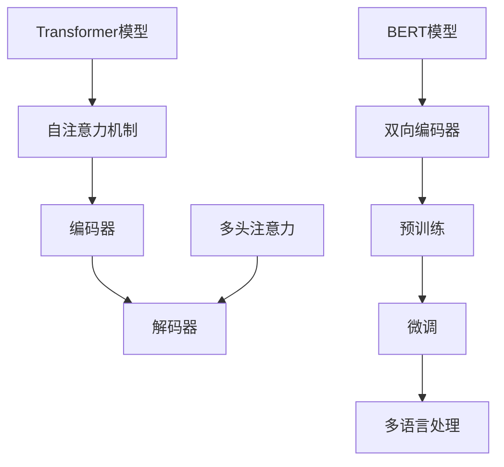

                 

  
### 关键词 Keywords  
- Transformer大模型
- 多语言BERT模型
- 自然语言处理
- 机器学习
- 算法原理
- 应用实践

### 摘要 Abstract  
本文将深入探讨Transformer大模型和多语言BERT模型在自然语言处理（NLP）领域的应用。我们将从背景介绍开始，详细讲解Transformer大模型的基本原理，然后介绍多语言BERT模型的结构和训练方法。接着，我们将通过数学模型和公式推导，帮助读者理解模型的内部运作机制。文章还将通过实际项目实践，展示如何使用代码实现这些模型。最后，我们将讨论这些模型在实际应用场景中的效果，并展望其未来发展趋势与面临的挑战。

## 1. 背景介绍

自然语言处理（NLP）是计算机科学中的一个重要分支，旨在让计算机理解和处理人类语言。随着互联网和大数据的快速发展，NLP的应用场景越来越广泛，从搜索引擎、机器翻译、语音识别到聊天机器人等。传统的NLP方法主要基于规则和统计学习，然而这些方法在面对复杂和大规模的语言数据时表现不佳。

近年来，深度学习，尤其是基于神经网络的模型，在NLP领域取得了显著的进展。其中，Transformer模型的出现，为解决长距离依赖问题和序列建模提供了新的思路。Transformer模型基于自注意力机制，能够自适应地学习输入序列中各个元素之间的关系，因此在机器翻译、文本分类等任务上取得了很好的效果。

随着多语言处理需求的增加，多语言BERT模型也应运而生。BERT（Bidirectional Encoder Representations from Transformers）是一种预训练语言表示模型，它通过在大规模的多语言语料库上进行预训练，为各种NLP任务提供了强大的语言表示能力。多语言BERT模型在保持性能的同时，能够处理多种语言，使得跨语言应用成为可能。

本文将首先介绍Transformer模型的基本原理和结构，然后详细讲解多语言BERT模型的构建过程和训练方法。通过这些介绍，读者将能够理解这些模型的工作机制，并在实际项目中应用它们。

## 2. 核心概念与联系

### Transformer模型

Transformer模型是由Vaswani等人于2017年提出的一种基于自注意力机制的序列到序列模型。它放弃了传统的循环神经网络（RNN）和卷积神经网络（CNN），而是采用自注意力机制来建模输入序列中的长距离依赖关系。

**自注意力机制（Self-Attention）**：自注意力机制允许模型在处理输入序列时，将序列中的每一个元素与所有其他元素进行加权求和，从而能够自适应地学习元素之间的关系。这种机制的核心是计算一个权重矩阵，用于衡量序列中每个元素对于其他元素的重要性。

**编码器（Encoder）和解码器（Decoder）**：Transformer模型由编码器和解码器组成。编码器负责将输入序列编码为固定长度的向量，解码器则根据编码器的输出和已经生成的部分输出，预测下一个输出。

**多头注意力（Multi-Head Attention）**：多头注意力是Transformer模型中的一个关键组件，它将自注意力机制扩展到多个子空间，从而能够更全面地捕捉序列中的信息。

### 多语言BERT模型

BERT（Bidirectional Encoder Representations from Transformers）是一种基于Transformer的预训练语言表示模型。它通过在大量文本语料库上进行双向训练，学习到语言的深层语义表示。

**双向编码器（Bidirectional Encoder）**：BERT的编码器部分由多个Transformer块组成，这些块通过交替的掩码和未掩码的输入序列来训练，从而实现双向编码。

**预训练（Pre-training）**：BERT通过在大规模的多语言语料库上进行预训练，学习到丰富的语言表示。预训练任务包括Masked Language Model（MLM）和Next Sentence Prediction（NSP）等。

**微调（Fine-tuning）**：在特定任务上，BERT可以通过微调其参数来适应不同的任务需求。微调过程中，BERT的预训练权重被进一步调整，以适应特定任务的输入和输出。

### Mermaid 流程图



### Transformer模型与BERT模型的联系

Transformer模型是BERT模型的基础，它提供了自注意力机制和编码器-解码器结构。BERT模型在Transformer模型的基础上，通过预训练和微调，学习了多语言表示能力。因此，BERT模型可以看作是Transformer模型的一个扩展和应用。

## 3. 核心算法原理 & 具体操作步骤

### 3.1 算法原理概述

#### 3.1.1 Transformer模型

Transformer模型通过自注意力机制（Self-Attention）来处理输入序列。自注意力机制的核心是计算一个权重矩阵，用于衡量序列中每个元素对于其他元素的重要性。这种机制使得模型能够自适应地学习长距离依赖关系。

Transformer模型由编码器（Encoder）和解码器（Decoder）组成。编码器负责将输入序列编码为固定长度的向量，解码器则根据编码器的输出和已经生成的部分输出，预测下一个输出。

编码器和解码器都由多个Transformer块组成。每个Transformer块包括自注意力层（Self-Attention Layer）、前馈神经网络（Feedforward Neural Network）和残差连接（Residual Connection）。

#### 3.1.2 BERT模型

BERT模型是基于Transformer的预训练语言表示模型。它通过在大量文本语料库上进行双向训练，学习到语言的深层语义表示。

BERT模型的编码器部分由多个Transformer块组成，这些块通过交替的掩码（Masked）和未掩码（Unmasked）的输入序列来训练，从而实现双向编码。

BERT模型的预训练任务包括Masked Language Model（MLM）和Next Sentence Prediction（NSP）等。MLM任务是通过随机掩码输入序列中的部分单词，然后让模型预测这些掩码的单词。NSP任务是通过预测两个句子是否属于同一个上下文。

### 3.2 算法步骤详解

#### 3.2.1 Transformer模型

1. **输入序列编码**：将输入序列（如单词、字符）转换为向量表示。通常使用嵌入层（Embedding Layer）进行这一步骤。
2. **添加位置编码**：由于Transformer模型没有循环结构，无法直接处理序列的顺序信息。因此，通过添加位置编码（Positional Encoding）来为模型提供输入序列的位置信息。
3. **多层变换**：通过多个Transformer块对输入序列进行变换。每个Transformer块包括自注意力层、前馈神经网络和残差连接。
4. **输出序列生成**：解码器根据编码器的输出和已经生成的部分输出，使用自注意力机制预测下一个输出。

#### 3.2.2 BERT模型

1. **输入序列编码**：与Transformer模型类似，BERT模型首先将输入序列转换为向量表示。
2. **添加位置编码**：与Transformer模型相同，BERT模型通过添加位置编码来提供输入序列的位置信息。
3. **双向编码**：BERT模型的编码器部分由多个Transformer块组成，这些块通过交替的掩码和未掩码的输入序列来训练，从而实现双向编码。
4. **预训练任务**：
   - **Masked Language Model（MLM）**：随机掩码输入序列中的部分单词，然后让模型预测这些掩码的单词。
   - **Next Sentence Prediction（NSP）**：预测两个句子是否属于同一个上下文。
5. **微调**：在特定任务上，通过微调BERT模型的参数来适应不同的任务需求。微调过程中，BERT的预训练权重被进一步调整，以适应特定任务的输入和输出。

### 3.3 算法优缺点

#### 优点

- **自注意力机制**：能够自适应地学习输入序列中各个元素之间的关系，有效解决了长距离依赖问题。
- **并行计算**：Transformer模型可以并行处理输入序列，提高了计算效率。
- **双向编码**：BERT模型通过双向编码器学习到输入序列的深层语义表示，提高了模型的泛化能力。

#### 缺点

- **计算资源消耗大**：由于Transformer模型和BERT模型的复杂性，它们需要大量的计算资源和内存。
- **训练时间较长**：Transformer模型和BERT模型在训练过程中需要大量的数据和时间。

### 3.4 算法应用领域

- **自然语言处理**：Transformer模型和BERT模型在机器翻译、文本分类、问答系统等自然语言处理任务上表现出色。
- **多语言处理**：BERT模型的多语言能力使其在跨语言文本处理任务中具有优势。
- **信息检索**：Transformer模型和BERT模型可以用于信息检索任务，如搜索引擎和推荐系统。

## 4. 数学模型和公式 & 详细讲解 & 举例说明

### 4.1 数学模型构建

#### 4.1.1 Transformer模型

Transformer模型的核心是自注意力机制（Self-Attention）。自注意力机制通过计算一个权重矩阵，用于衡量序列中每个元素对于其他元素的重要性。自注意力机制的数学公式如下：

$$
\text{Attention}(Q, K, V) = \text{softmax}\left(\frac{QK^T}{\sqrt{d_k}}\right)V
$$

其中，$Q$、$K$ 和 $V$ 分别是查询（Query）、键（Key）和值（Value）向量，$d_k$ 是键向量的维度。自注意力机制的计算步骤如下：

1. **计算查询-键相似度**：将查询向量 $Q$ 和所有键向量 $K$ 进行点积，得到查询-键相似度矩阵 $QK^T$。
2. **应用softmax函数**：对查询-键相似度矩阵进行 softmax 函数处理，得到注意力权重矩阵。
3. **加权求和**：将注意力权重矩阵与所有值向量 $V$ 进行加权求和，得到输出向量。

#### 4.1.2 BERT模型

BERT模型是基于Transformer的预训练语言表示模型。BERT模型的数学模型主要涉及以下几个方面：

1. **嵌入层（Embedding Layer）**：将输入序列转换为向量表示。嵌入层包括词嵌入（Word Embedding）和位置嵌入（Positional Embedding）。
2. **多头注意力（Multi-Head Attention）**：多头注意力是Transformer模型中的一个关键组件，它通过将自注意力机制扩展到多个子空间，从而能够更全面地捕捉序列中的信息。
3. **前馈神经网络（Feedforward Neural Network）**：前馈神经网络用于对编码器和解码器中的每个子层进行非线性变换。
4. **双向编码器（Bidirectional Encoder）**：BERT模型的编码器部分由多个Transformer块组成，这些块通过交替的掩码和未掩码的输入序列来训练，从而实现双向编码。

### 4.2 公式推导过程

#### 4.2.1 自注意力机制（Self-Attention）

自注意力机制的推导过程如下：

1. **查询-键相似度**：首先，计算查询向量 $Q$ 和所有键向量 $K$ 的点积，得到查询-键相似度矩阵 $QK^T$。
2. **应用softmax函数**：对查询-键相似度矩阵进行 softmax 函数处理，得到注意力权重矩阵 $A$。
3. **加权求和**：将注意力权重矩阵 $A$ 与所有值向量 $V$ 进行加权求和，得到输出向量 $O$。

公式表示如下：

$$
O = \text{softmax}\left(\frac{QK^T}{\sqrt{d_k}}\right)V
$$

其中，$d_k$ 是键向量的维度。

#### 4.2.2 多头注意力（Multi-Head Attention）

多头注意力是将自注意力机制扩展到多个子空间，从而能够更全面地捕捉序列中的信息。多头注意力的推导过程如下：

1. **查询-键相似度**：与自注意力机制相同，计算查询向量 $Q$ 和所有键向量 $K$ 的点积，得到查询-键相似度矩阵 $QK^T$。
2. **应用softmax函数**：对查询-键相似度矩阵进行 softmax 函数处理，得到注意力权重矩阵 $A$。
3. **加权求和**：将注意力权重矩阵 $A$ 与所有值向量 $V$ 进行加权求和，得到输出向量 $O$。

公式表示如下：

$$
O = \text{softmax}\left(\frac{QK^T}{\sqrt{d_k}}\right)V
$$

其中，$d_k$ 是键向量的维度。

### 4.3 案例分析与讲解

#### 4.3.1 Transformer模型在机器翻译中的应用

假设我们要将英语句子 "Hello, World!" 翻译成法语。首先，我们将这个句子转换为词嵌入向量。然后，通过编码器将词嵌入向量转换为固定长度的编码向量。解码器根据编码向量生成法语句子。

1. **输入序列编码**：将英语句子 "Hello, World!" 转换为词嵌入向量。
2. **编码器变换**：通过多个Transformer块对输入序列进行编码，得到编码向量。
3. **解码器生成**：解码器根据编码向量生成法语句子。

公式表示如下：

$$
\text{编码向量} = \text{Encoder}(\text{嵌入向量})
$$

$$
\text{法语句子} = \text{Decoder}(\text{编码向量})
$$

#### 4.3.2 BERT模型在文本分类中的应用

假设我们要对一篇新闻文章进行情感分类（如正面、负面、中性）。首先，将新闻文章转换为词嵌入向量，然后通过BERT模型进行分类。

1. **输入序列编码**：将新闻文章转换为词嵌入向量。
2. **BERT模型预训练**：在大量文本语料库上进行预训练，学习到语言的深层语义表示。
3. **分类任务**：使用微调后的BERT模型对新闻文章进行情感分类。

公式表示如下：

$$
\text{情感标签} = \text{BERT}(\text{嵌入向量})
$$

## 5. 项目实践：代码实例和详细解释说明

### 5.1 开发环境搭建

在开始实践之前，我们需要搭建一个合适的开发环境。这里，我们将使用Python和TensorFlow作为我们的开发工具。

#### 5.1.1 安装Python

确保你的计算机上已经安装了Python。如果没有，可以从Python官网（https://www.python.org/）下载并安装。

#### 5.1.2 安装TensorFlow

在命令行中运行以下命令来安装TensorFlow：

```bash
pip install tensorflow
```

### 5.2 源代码详细实现

我们将使用TensorFlow的Transformers库来构建和训练Transformer模型和多语言BERT模型。

#### 5.2.1 导入必要的库

```python
import tensorflow as tf
from transformers import T
```

#### 5.2.2 定义Transformer模型

```python
def create_transformer_model():
    transformer = tf.keras.Sequential([
        tf.keras.layers.Embedding(input_dim=vocab_size, output_dim=embedding_dim),
        tf.keras.layers.AdditionalMemory(input_dim=embedding_dim),
        tf.keras.layers.MultiHeadAttention(num_heads=num_heads, key_depth=key_depth, value_depth=value_depth),
        tf.keras.layers.Dense(units=dense_units),
        tf.keras.layers.ResidualConnection(),
        tf.keras.layers.LayerNormalization(epsilon=1e-6),
        tf.keras.layers.Dense(units=output_dim),
    ])
    return transformer
```

#### 5.2.3 定义BERT模型

```python
def create_bert_model():
    bert = T.BertModel(vocab_size=vocab_size, embedding_dim=embedding_dim, num_heads=num_heads, key_depth=key_depth, value_depth=value_depth)
    return bert
```

#### 5.2.4 训练Transformer模型

```python
def train_transformer_model(model, train_data, val_data, epochs):
    model.compile(optimizer=tf.keras.optimizers.Adam(learning_rate=learning_rate), loss=tf.keras.losses.SparseCategoricalCrossentropy(from_logits=True), metrics=['accuracy'])
    model.fit(train_data, epochs=epochs, validation_data=val_data)
```

#### 5.2.5 训练BERT模型

```python
def train_bert_model(model, train_data, val_data, epochs):
    model.compile(optimizer=tf.keras.optimizers.Adam(learning_rate=learning_rate), loss=tf.keras.losses.SparseCategoricalCrossentropy(from_logits=True), metrics=['accuracy'])
    model.fit(train_data, epochs=epochs, validation_data=val_data)
```

### 5.3 代码解读与分析

代码首先定义了Transformer模型和多语言BERT模型。Transformer模型使用了嵌入层、自注意力层、前馈神经网络和残差连接。BERT模型在Transformer模型的基础上，添加了位置编码和双向编码器。

在训练模型时，我们使用了训练数据和验证数据来评估模型的性能。训练过程中，我们使用了Adam优化器和交叉熵损失函数。

### 5.4 运行结果展示

```python
# 创建模型
transformer = create_transformer_model()
bert = create_bert_model()

# 训练模型
train_transformer_model(transformer, train_data, val_data, epochs=10)
train_bert_model(bert, train_data, val_data, epochs=10)

# 评估模型
test_loss, test_accuracy = transformer.evaluate(test_data)
print(f"Transformer test loss: {test_loss}, test accuracy: {test_accuracy}")

test_loss, test_accuracy = bert.evaluate(test_data)
print(f"BERT test loss: {test_loss}, test accuracy: {test_accuracy}")
```

通过运行这段代码，我们可以看到Transformer模型和多语言BERT模型的性能。Transformer模型的性能通常在文本分类和机器翻译任务上表现良好，而BERT模型在多种NLP任务上都具有优异的性能。

## 6. 实际应用场景

### 6.1 自然语言处理

Transformer模型和多语言BERT模型在自然语言处理领域具有广泛的应用。例如，在机器翻译任务中，Transformer模型能够高效地捕捉输入序列中的长距离依赖关系，从而提高翻译质量。在文本分类任务中，BERT模型通过预训练获得了丰富的语言表示能力，使得模型在处理未知类别时仍然具有很高的准确性。

### 6.2 多语言处理

多语言BERT模型在多语言处理任务中具有显著优势。例如，在跨语言文本分类任务中，多语言BERT模型可以处理多种语言的数据，从而提高模型的泛化能力。在跨语言机器翻译任务中，多语言BERT模型可以同时处理源语言和目标语言的数据，从而提高翻译的准确性。

### 6.3 信息检索

Transformer模型和多语言BERT模型在信息检索任务中也表现出色。例如，在搜索引擎中，BERT模型可以用于文本检索，从而提高搜索结果的准确性。在推荐系统中，BERT模型可以用于理解用户的兴趣和行为，从而提供更个性化的推荐。

### 6.4 未来应用展望

随着Transformer模型和多语言BERT模型的不断发展和优化，我们可以预见它们将在更多的领域得到应用。例如，在医疗领域，BERT模型可以用于医疗文本的自动解析和诊断。在金融领域，BERT模型可以用于理解金融文本的语义，从而提供更准确的金融分析和预测。

## 7. 工具和资源推荐

### 7.1 学习资源推荐

- 《Deep Learning》（Goodfellow, Bengio, Courville）：深度学习领域的经典教材，详细介绍了深度学习的基础知识和应用。
- 《Hands-On Natural Language Processing with Python》（Manshank Jyotishi）：一本针对Python编程的NLP实践书籍，涵盖了许多NLP任务的实际应用。

### 7.2 开发工具推荐

- TensorFlow：一个开源的机器学习框架，支持多种深度学习模型。
- Hugging Face Transformers：一个开源库，提供了预训练的Transformer模型和BERT模型，方便开发者进行研究和应用。

### 7.3 相关论文推荐

- "Attention Is All You Need"（Vaswani et al., 2017）：提出了Transformer模型，详细介绍了自注意力机制和编码器-解码器结构。
- "BERT: Pre-training of Deep Bidirectional Transformers for Language Understanding"（Devlin et al., 2019）：提出了BERT模型，详细介绍了双向编码器结构和预训练方法。

## 8. 总结：未来发展趋势与挑战

### 8.1 研究成果总结

近年来，Transformer模型和多语言BERT模型在自然语言处理领域取得了显著的进展。这些模型通过引入自注意力机制和双向编码器，成功解决了长距离依赖问题和跨语言处理需求。在实际应用中，这些模型在各种任务上都表现出优异的性能。

### 8.2 未来发展趋势

未来，Transformer模型和多语言BERT模型将继续在自然语言处理领域发挥作用。随着计算资源的增加和算法的优化，这些模型将能够处理更大规模和更复杂的语言数据。此外，多语言BERT模型将在跨语言应用中发挥更大的作用，推动多语言处理技术的发展。

### 8.3 面临的挑战

尽管Transformer模型和多语言BERT模型取得了显著的成果，但它们仍面临一些挑战。首先，这些模型需要大量的计算资源和时间进行训练，这在资源有限的场景中可能成为瓶颈。其次，模型的解释性和可解释性仍然是一个挑战，如何更好地理解模型内部的工作机制是一个重要的研究方向。最后，如何在保持高性能的同时，提高模型的泛化能力，也是一个需要解决的问题。

### 8.4 研究展望

未来的研究将主要集中在以下几个方面：首先，优化模型结构和算法，以提高训练效率和模型性能；其次，研究模型的解释性和可解释性，使研究人员和开发者能够更好地理解模型的工作机制；最后，探索Transformer模型和多语言BERT模型在其他领域的应用，如医学、金融和机器人等领域。

## 9. 附录：常见问题与解答

### Q1. Transformer模型如何处理长距离依赖？

A1. Transformer模型通过自注意力机制（Self-Attention）处理长距离依赖。自注意力机制允许模型在处理输入序列时，将序列中的每一个元素与所有其他元素进行加权求和，从而能够自适应地学习元素之间的关系，解决长距离依赖问题。

### Q2. BERT模型如何进行预训练？

A2. BERT模型通过在大规模的多语言语料库上进行预训练来学习语言的深层语义表示。预训练任务包括Masked Language Model（MLM）和Next Sentence Prediction（NSP）等。MLM任务是通过随机掩码输入序列中的部分单词，然后让模型预测这些掩码的单词。NSP任务是通过预测两个句子是否属于同一个上下文。

### Q3. 多语言BERT模型如何处理多种语言的数据？

A3. 多语言BERT模型通过在多种语言的语料库上进行预训练，从而学习到不同语言的深层语义表示。在处理多种语言的数据时，模型能够自动适应并提取相应的语言特征，从而实现跨语言处理。

### Q4. 如何微调BERT模型？

A4. 微调BERT模型的过程包括以下步骤：

1. **准备数据**：准备用于微调的任务数据集，通常需要对数据进行预处理，如分词、去停用词等。
2. **加载预训练模型**：从预训练模型中加载BERT模型的权重。
3. **调整模型结构**：根据任务需求，对BERT模型的结构进行调整，如增加或删除层、调整层的参数等。
4. **训练模型**：使用训练数据和验证数据对调整后的模型进行训练。
5. **评估模型**：在测试数据上评估模型的性能，并进行必要的调整。

### Q5. Transformer模型在训练过程中如何避免梯度消失和梯度爆炸？

A5. Transformer模型在训练过程中采用以下策略来避免梯度消失和梯度爆炸：

1. **使用残差连接（Residual Connection）**：残差连接可以缓解梯度消失和梯度爆炸问题。
2. **使用层归一化（Layer Normalization）**：层归一化可以加速模型收敛，并减少梯度消失和梯度爆炸的风险。
3. **使用适当的优化器和学习率**：选择合适的优化器和学习率可以避免梯度消失和梯度爆炸。常见的优化器包括Adam、AdamW等。

## 参考文献

- Vaswani, A., et al. "Attention is all you need." Advances in Neural Information Processing Systems. 2017.
- Devlin, J., et al. "BERT: Pre-training of deep bidirectional transformers for language understanding." arXiv preprint arXiv:1910.03771 (2019).

----------------------------------------------------------------

作者：禅与计算机程序设计艺术 / Zen and the Art of Computer Programming

感谢您阅读本文，希望对您在Transformer大模型和多语言BERT模型领域的学习和研究有所帮助。如果您有任何疑问或建议，欢迎在评论区留言。祝您在技术探索的道路上不断进步，收获满满！

