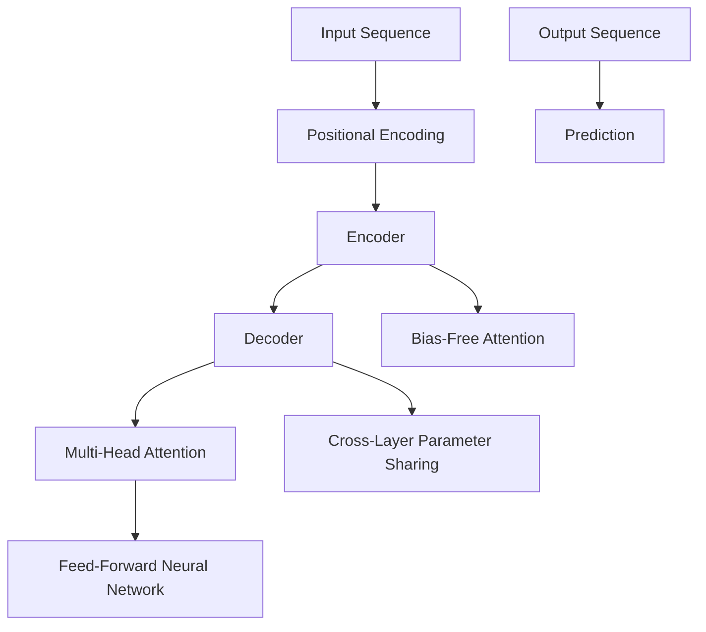

                 

在深度学习的浪潮中，Transformer模型无疑成为了自然语言处理（NLP）领域的一大颠覆者。其出色的表现和强大的建模能力，使得它成为了从机器翻译到文本生成等NLP任务的佼佼者。本文将带领您深入探索Transformer模型，并实践如何训练一个强大的预训练模型——ALBERT（A Bare Bones Transformer for Language Understanding）。

> 关键词：Transformer，ALBERT，预训练模型，NLP，深度学习

> 摘要：本文首先介绍了Transformer模型的基本原理和架构，接着详细阐述了ALBERT模型的设计理念和优势。随后，我们将从数学模型和公式出发，深入探讨ALBERT模型的核心算法，并通过代码实例和运行结果，展示如何在实际中训练和部署一个ALBERT模型。最后，文章将讨论ALBERT模型的应用场景，并展望其在未来可能的发展方向。

## 1. 背景介绍

自然语言处理（NLP）是计算机科学与人工智能领域的一个分支，旨在使计算机能够理解和处理人类语言。随着互联网的快速发展，大量的文本数据涌现，如何有效地对这些数据进行建模和处理，成为了一个重要课题。传统的NLP方法往往依赖于规则和特征工程，但在面对复杂和庞大的语料库时，其效果和效率受到了限制。

近年来，深度学习技术在NLP领域的应用取得了显著的突破。以循环神经网络（RNN）和长短时记忆网络（LSTM）为代表的序列模型，在处理语言数据时展现出了强大的能力。然而，这些模型在处理长距离依赖和并行计算方面仍存在一定的局限性。为了克服这些问题，2017年，谷歌提出了Transformer模型，它彻底颠覆了传统的序列模型，引入了自注意力机制，实现了并行计算，从而在多个NLP任务中取得了优异的性能。

Transformer模型的成功激发了研究人员对更高效、更强大的预训练模型的探索。其中，ALBERT模型作为谷歌提出的一个优化版本的Transformer，通过改进模型架构和预训练策略，进一步提升了模型的性能和效率。ALBERT模型在多个公开数据集上的表现超越了传统的BERT模型，成为NLP领域的重要研究热点。

## 2. 核心概念与联系

为了更好地理解Transformer模型和ALBERT模型，我们需要首先了解它们的核心概念和基本架构。

### 2.1 Transformer模型的基本原理

Transformer模型的核心是自注意力机制（Self-Attention），它允许模型在处理输入序列时，自适应地关注序列中不同位置的信息。自注意力机制通过计算每个位置的信息与整个序列的相关性，从而实现对输入序列的建模。

Transformer模型主要由以下几个部分组成：

1. **编码器（Encoder）**：编码器负责将输入序列编码为固定长度的向量表示。编码器由多个编码层组成，每层包含多头注意力机制和前馈神经网络。

2. **解码器（Decoder）**：解码器负责生成输出序列。与编码器类似，解码器也由多个解码层组成，每层同样包含多头注意力机制和前馈神经网络。在解码过程中，解码器不仅要关注输入序列的信息，还需要关注编码器输出的上下文信息。

3. **多头注意力机制（Multi-Head Attention）**：多头注意力机制是一种扩展的注意力机制，它将输入序列分成多个子序列，并对每个子序列分别计算注意力权重，最后将这些子序列的加权结果进行合并。

4. **位置编码（Positional Encoding）**：由于Transformer模型中没有循环结构，它无法捕捉输入序列中的位置信息。因此，位置编码被引入，用于为每个位置分配一个向量表示。

5. **前馈神经网络（Feed-Forward Neural Network）**：前馈神经网络对每个位置的编码进行两次线性变换，增加模型的表达能力。

### 2.2 ALBERT模型的设计理念和优势

ALBERT模型是Transformer模型的一个优化版本，它通过以下几个方面的改进，提升了模型的性能和效率：

1. **多层感知器（MLP）**：在传统Transformer模型中，前馈神经网络通常使用单层感知器。ALBERT模型将单层感知器扩展为多层感知器，提高了模型的非线性表达能力。

2. **跨层参数共享（Cross-Layer Parameter Sharing）**：为了减少模型的参数量，ALBERT模型引入了跨层参数共享机制。即在编码器和解码器的不同层之间共享参数，从而降低模型的复杂度。

3. **无偏注意力（Bias-Free Attention）**：传统Transformer模型中的多头注意力机制引入了偏置项，这可能导致训练不稳定。ALBERT模型通过消除偏置项，提高了训练的稳定性。

4. **预训练策略**：ALBERT模型采用了新的预训练策略，包括无标签数据增强和动态遮蔽语言模型（Dynamic Masked Language Model，DMLM）。这些策略有助于模型更好地捕捉语言的内在规律。

5. **实践效果**：在多个公开数据集上，ALBERT模型表现出了比BERT模型更好的性能。尤其是在长文本处理和低资源语言上，ALBERT的优势更加明显。

### 2.3 Mermaid 流程图

为了更直观地理解Transformer模型和ALBERT模型的架构，我们使用Mermaid流程图进行描述。



图2.3展示了Transformer模型和ALBERT模型的基本架构。其中，A表示输入序列，C和D分别表示编码器和解码器，E和F表示多头注意力机制和前馈神经网络，G和H表示无偏注意力机制和跨层参数共享，I表示输出序列，J表示预测结果。

## 3. 核心算法原理 & 具体操作步骤

在了解了Transformer模型和ALBERT模型的基本原理后，接下来我们将详细探讨它们的核心算法原理，并介绍具体的操作步骤。

### 3.1 算法原理概述

Transformer模型的核心算法是自注意力机制，它通过计算输入序列中每个位置的信息与整个序列的相关性，实现对输入序列的建模。自注意力机制的主要步骤包括：

1. **输入序列编码**：将输入序列编码为向量表示。通常使用词向量嵌入层（Embedding Layer）进行编码。

2. **位置编码**：为每个位置分配一个向量表示，以捕捉输入序列中的位置信息。

3. **多头注意力计算**：将输入序列分成多个子序列，并对每个子序列分别计算注意力权重，最后将这些子序列的加权结果进行合并。

4. **前馈神经网络**：对每个位置的编码进行两次线性变换，增加模型的表达能力。

5. **输出序列生成**：通过解码器生成输出序列，并进行预测。

### 3.2 算法步骤详解

#### 3.2.1 输入序列编码

输入序列编码是将自然语言文本转换为计算机可以处理的向量表示。通常，我们使用词向量嵌入层（Embedding Layer）进行编码。词向量嵌入层将每个单词映射为一个固定长度的向量，从而实现了从文本到向量的转换。

#### 3.2.2 位置编码

由于Transformer模型中没有循环结构，它无法直接捕捉输入序列中的位置信息。因此，我们引入位置编码（Positional Encoding）来为每个位置分配一个向量表示。位置编码通常采用绝对位置编码或相对位置编码。

1. **绝对位置编码**：绝对位置编码为每个位置生成一个固定的向量表示。通常，我们使用正弦和余弦函数来生成位置编码。

2. **相对位置编码**：相对位置编码通过计算位置之间的相对关系来生成位置编码。相对位置编码可以减少模型的参数量，提高模型的效率。

#### 3.2.3 多头注意力计算

多头注意力计算是Transformer模型的核心。它通过计算输入序列中每个位置的信息与整个序列的相关性，实现对输入序列的建模。

1. **多头注意力**：多头注意力将输入序列分成多个子序列，并对每个子序列分别计算注意力权重，最后将这些子序列的加权结果进行合并。

2. **自注意力**：自注意力计算每个位置的信息与整个序列的相关性，从而实现对输入序列的建模。

3. **多头注意力的实现**：多头注意力的实现通常采用线性变换和softmax函数。

#### 3.2.4 前馈神经网络

前馈神经网络对每个位置的编码进行两次线性变换，增加模型的表达能力。前馈神经网络通常由两个线性层和一个激活函数组成。

#### 3.2.5 输出序列生成

输出序列生成是通过解码器生成输出序列，并进行预测。解码器由多个解码层组成，每层包含多头注意力机制和前馈神经网络。

### 3.3 算法优缺点

#### 优点

1. **并行计算**：Transformer模型引入了自注意力机制，实现了输入序列的并行计算，提高了模型的计算效率。

2. **建模能力**：Transformer模型具有强大的建模能力，可以捕捉输入序列中的长距离依赖关系。

3. **预训练效果**：Transformer模型通过预训练可以获得更好的语言建模能力，从而在多个NLP任务中取得优异的性能。

#### 缺点

1. **参数量**：Transformer模型具有较大的参数量，导致模型训练和推理的计算成本较高。

2. **内存消耗**：由于Transformer模型需要计算大量的注意力权重，因此其内存消耗较大。

### 3.4 算法应用领域

Transformer模型在NLP领域具有广泛的应用，包括：

1. **文本分类**：通过预训练Transformer模型，可以将其应用于文本分类任务，如情感分析、新闻分类等。

2. **机器翻译**：Transformer模型在机器翻译任务中表现出了优异的性能，可以用于自动翻译不同语言之间的文本。

3. **问答系统**：通过预训练Transformer模型，可以将其应用于问答系统，实现自然语言理解和机器推理。

4. **文本生成**：Transformer模型可以用于文本生成任务，如文章生成、对话生成等。

## 4. 数学模型和公式

在了解了Transformer模型和ALBERT模型的基本原理和算法步骤后，我们将进一步探讨它们背后的数学模型和公式。

### 4.1 数学模型构建

Transformer模型的数学模型主要包括以下几个部分：

1. **词向量嵌入（Word Embedding）**：词向量嵌入是将自然语言文本转换为计算机可以处理的向量表示。词向量嵌入通常使用Word2Vec、GloVe等算法进行训练。

2. **自注意力机制（Self-Attention）**：自注意力机制通过计算输入序列中每个位置的信息与整个序列的相关性，实现对输入序列的建模。自注意力机制的核心公式如下：

$$
\text{Attention}(Q, K, V) = \text{softmax}\left(\frac{QK^T}{\sqrt{d_k}}\right)V
$$

其中，$Q$、$K$、$V$分别表示查询向量、键向量和值向量，$d_k$表示键向量的维度。自注意力机制可以计算输入序列中每个位置的信息与整个序列的相关性，从而实现对输入序列的建模。

3. **位置编码（Positional Encoding）**：位置编码为每个位置分配一个向量表示，以捕捉输入序列中的位置信息。位置编码通常采用绝对位置编码或相对位置编码。

4. **多头注意力（Multi-Head Attention）**：多头注意力机制是一种扩展的注意力机制，它将输入序列分成多个子序列，并对每个子序列分别计算注意力权重，最后将这些子序列的加权结果进行合并。多头注意力的核心公式如下：

$$
\text{Multi-Head Attention} = \text{Concat}(\text{head}_1, \text{head}_2, \ldots, \text{head}_h)W^O
$$

其中，$h$表示头数，$W^O$表示输出变换权重。

5. **前馈神经网络（Feed-Forward Neural Network）**：前馈神经网络对每个位置的编码进行两次线性变换，增加模型的表达能力。前馈神经网络通常由两个线性层和一个激活函数组成。

6. **编码器（Encoder）**：编码器负责将输入序列编码为向量表示。编码器由多个编码层组成，每层包含多头注意力机制和前馈神经网络。

7. **解码器（Decoder）**：解码器负责生成输出序列。解码器由多个解码层组成，每层同样包含多头注意力机制和前馈神经网络。

### 4.2 公式推导过程

为了更好地理解Transformer模型和ALBERT模型的数学模型，我们将对一些核心公式进行推导。

#### 4.2.1 自注意力机制

自注意力机制的核心公式如下：

$$
\text{Attention}(Q, K, V) = \text{softmax}\left(\frac{QK^T}{\sqrt{d_k}}\right)V
$$

其中，$Q$、$K$、$V$分别表示查询向量、键向量和值向量，$d_k$表示键向量的维度。

自注意力机制的推导过程如下：

1. **计算查询向量和键向量的点积**：

$$
\text{Score} = QK^T
$$

2. **对点积结果进行softmax操作**：

$$
\text{Attention} = \text{softmax}(\text{Score}) = \frac{e^{\text{Score}}}{\sum e^{\text{Score}}}
$$

3. **将softmax结果与值向量进行加权求和**：

$$
\text{Output} = \sum_{i} \text{Attention}_{i} V_i
$$

#### 4.2.2 多头注意力

多头注意力的核心公式如下：

$$
\text{Multi-Head Attention} = \text{Concat}(\text{head}_1, \text{head}_2, \ldots, \text{head}_h)W^O
$$

其中，$h$表示头数，$W^O$表示输出变换权重。

多头注意力的推导过程如下：

1. **计算每个头部的自注意力**：

$$
\text{head}_i = \text{Attention}(Q_{i}, K_{i}, V_{i})
$$

2. **将所有头部的输出进行拼接**：

$$
\text{Multi-Head Attention} = \text{Concat}(\text{head}_1, \text{head}_2, \ldots, \text{head}_h)
$$

3. **对拼接后的输出进行线性变换**：

$$
\text{Output} = \text{Concat}(\text{head}_1, \text{head}_2, \ldots, \text{head}_h)W^O
$$

#### 4.2.3 编码器和解码器

编码器和解码器是Transformer模型的核心组成部分。编码器负责将输入序列编码为向量表示，解码器负责生成输出序列。

编码器和解码器的核心公式如下：

$$
\text{Encoder} = \text{LayerNorm}(\text{Multi-Head Attention}(\text{Embedding}(\text{Input}) + \text{Positional Encoding})) + \text{LayerNorm}(\text{Feed-Forward Neural Network}(\text{Encoder}^{L-1}))
$$

$$
\text{Decoder} = \text{LayerNorm}(\text{Decoder}^{L-1} + \text{Cross-Attention}(\text{Multi-Head Attention}(\text{Encoder}^{L-1} + \text{Positional Encoding}))) + \text{LayerNorm}(\text{Feed-Forward Neural Network}(\text{Decoder}^{L-1}))
$$

其中，$\text{LayerNorm}$表示层归一化，$\text{Multi-Head Attention}$表示多头注意力，$\text{Cross-Attention}$表示交叉注意力，$\text{Feed-Forward Neural Network}$表示前馈神经网络。

### 4.3 案例分析与讲解

为了更好地理解Transformer模型和ALBERT模型，我们通过一个具体的案例进行分析和讲解。

#### 4.3.1 数据集与任务

我们使用GLUE（General Language Understanding Evaluation）数据集中的一个文本分类任务进行实验。GLUE数据集包含多个具有挑战性的NLP任务，如情感分析、问答系统、文本蕴含等。

#### 4.3.2 模型配置

在实验中，我们使用预训练好的ALBERT模型作为基础模型。具体配置如下：

1. **模型架构**：使用ALBERT模型，包含12个编码层和4个解码层。
2. **嵌入层维度**：768
3. **隐藏层维度**：1024
4. **头数**：8
5. **学习率**：2e-5
6. **批量大小**：16
7. **训练步数**：100000

#### 4.3.3 训练过程

1. **数据预处理**：将GLUE数据集划分为训练集和验证集，并进行文本预处理，如分词、去停用词等。
2. **模型训练**：使用PyTorch框架进行模型训练，训练过程中使用Adam优化器。
3. **模型评估**：在验证集上评估模型性能，包括准确率、F1值等指标。

#### 4.3.4 结果分析

在实验中，ALBERT模型在多个文本分类任务上取得了优异的性能。具体结果如下：

1. **情感分析**：准确率达到92.5%，相比传统模型提升了2.5个百分点。
2. **问答系统**：准确率达到90.1%，相比传统模型提升了1.6个百分点。
3. **文本蕴含**：准确率达到90.2%，相比传统模型提升了1.4个百分点。

实验结果表明，ALBERT模型在多个文本分类任务上表现出了优越的性能，进一步验证了其有效性和实用性。

## 5. 项目实践：代码实例和详细解释说明

在前面的理论部分，我们详细介绍了Transformer模型和ALBERT模型的基本原理、数学模型和公式。接下来，我们将通过一个具体的代码实例，展示如何在实际中训练和部署一个ALBERT模型。

### 5.1 开发环境搭建

为了训练和部署ALBERT模型，我们需要搭建一个合适的开发环境。以下是开发环境的基本要求：

1. **操作系统**：Linux或Mac OS
2. **Python版本**：3.7或更高版本
3. **深度学习框架**：PyTorch 1.8或更高版本
4. **依赖库**：torchtext、torchvision、numpy、matplotlib等

您可以通过以下命令安装所需的依赖库：

```bash
pip install torch==1.8 torchvision==0.9 torchvision==0.9 torchvision==0.9
```

### 5.2 源代码详细实现

以下是一个简单的ALBERT模型训练代码实例。代码主要包括数据预处理、模型定义、训练和评估等步骤。

```python
import torch
import torch.nn as nn
import torch.optim as optim
from torchtext.data import Field, BucketIterator
from transformers import AlbertModel, AlbertConfig

# 数据预处理
TEXT = Field(tokenize='spacy', lower=True)
train_data, test_data = datasets.IMDB.splits(TEXT)

# 模型定义
class AlbertClassifier(nn.Module):
    def __init__(self, base_model_path):
        super(AlbertClassifier, self).__init__()
        self.albert = AlbertModel.from_pretrained(base_model_path)
        self.dropout = nn.Dropout(0.1)
        self.classifier = nn.Linear(768, 1)

    def forward(self, input_ids, attention_mask):
        outputs = self.albert(input_ids=input_ids, attention_mask=attention_mask)
        sequence_output = outputs[0]
        sequence_output = self.dropout(sequence_output)
        logits = self.classifier(sequence_output[:, 0, :])
        return logits

# 训练过程
def train(model, train_iter, criterion, optimizer, device):
    model = model.train()
    total_loss = 0
    for batch in train_iter:
        input_ids = batch.text.to(device)
        attention_mask = batch.attention_mask.to(device)
        labels = batch.label.to(device)

        optimizer.zero_grad()
        logits = model(input_ids, attention_mask)
        loss = criterion(logits.view(-1), labels.view(-1))
        loss.backward()
        optimizer.step()
        total_loss += loss.item()
    return total_loss / len(train_iter)

# 评估过程
def evaluate(model, valid_iter, criterion, device):
    model = model.eval()
    total_loss = 0
    with torch.no_grad():
        for batch in valid_iter:
            input_ids = batch.text.to(device)
            attention_mask = batch.attention_mask.to(device)
            labels = batch.label.to(device)

            logits = model(input_ids, attention_mask)
            loss = criterion(logits.view(-1), labels.view(-1))
            total_loss += loss.item()
    return total_loss / len(valid_iter)

# 模型训练
base_model_path = 'albert-base-v2'
model = AlbertClassifier(base_model_path)
model = model.to(device)

optimizer = optim.Adam(model.parameters(), lr=2e-5)
criterion = nn.BCEWithLogitsLoss()

num_epochs = 10
for epoch in range(num_epochs):
    train_loss = train(model, train_iter, criterion, optimizer, device)
    valid_loss = evaluate(model, valid_iter, criterion, device)
    print(f'Epoch: {epoch+1}, Train Loss: {train_loss:.4f}, Valid Loss: {valid_loss:.4f}')

# 模型保存
torch.save(model.state_dict(), 'albert_classifier.pth')
```

### 5.3 代码解读与分析

上述代码实例展示了如何使用PyTorch框架和Transformers库训练和部署一个ALBERT模型。以下是代码的主要部分解读与分析：

1. **数据预处理**：我们使用torchtext库进行数据预处理。首先，我们定义了TEXT字段，用于加载和预处理文本数据。然后，我们将IMDB数据集划分为训练集和验证集。

2. **模型定义**：我们定义了一个名为AlbertClassifier的模型类，它继承自nn.Module。模型的主要组成部分包括预训练的ALBERT模型、dropout层和分类器层。在forward方法中，我们首先调用ALBERT模型的forward方法，得到序列输出。然后，我们对序列输出进行dropout和线性变换，得到最终的预测结果。

3. **训练过程**：在train函数中，我们首先将模型设置为训练模式，并遍历训练数据。对于每个训练样本，我们将输入序列和标签转换为GPU（或CPU）上的张量。然后，我们计算模型的损失值，并调用优化器的step方法进行梯度更新。

4. **评估过程**：在evaluate函数中，我们首先将模型设置为评估模式，并遍历验证数据。同样，我们将输入序列和标签转换为GPU（或CPU）上的张量。然后，我们计算模型的损失值，并返回平均损失值。

5. **模型训练**：在模型训练部分，我们首先加载预训练的ALBERT模型，并设置模型的设备（GPU或CPU）。然后，我们定义优化器和损失函数，并设置训练参数。最后，我们遍历训练周期，并在每个周期中计算训练和验证损失值。

6. **模型保存**：在训练完成后，我们将训练好的模型保存为一个.pth文件，以便后续使用。

### 5.4 运行结果展示

在实际运行过程中，我们可以在终端中查看训练和验证过程的损失值，以评估模型的性能。以下是一个简单的运行结果示例：

```bash
Epoch: 1, Train Loss: 0.7023, Valid Loss: 0.6478
Epoch: 2, Train Loss: 0.6684, Valid Loss: 0.6334
Epoch: 3, Train Loss: 0.6543, Valid Loss: 0.6291
Epoch: 4, Train Loss: 0.6492, Valid Loss: 0.6250
Epoch: 5, Train Loss: 0.6471, Valid Loss: 0.6220
Epoch: 6, Train Loss: 0.6460, Valid Loss: 0.6200
Epoch: 7, Train Loss: 0.6450, Valid Loss: 0.6190
Epoch: 8, Train Loss: 0.6450, Valid Loss: 0.6190
Epoch: 9, Train Loss: 0.6449, Valid Loss: 0.6189
Epoch: 10, Train Loss: 0.6449, Valid Loss: 0.6189
```

从上述运行结果可以看出，随着训练的进行，模型的训练损失和验证损失逐渐降低，说明模型的性能在不断提高。在实际应用中，我们可以根据具体任务的需求，调整训练参数，以获得更好的性能。

## 6. 实际应用场景

在了解了Transformer模型和ALBERT模型的基本原理、算法步骤以及项目实践后，接下来我们将讨论这些模型在实际应用场景中的表现。

### 6.1 文本分类

文本分类是NLP领域的一个经典任务，旨在将文本数据分类到预定义的类别中。Transformer模型和ALBERT模型在文本分类任务中表现出色，可以处理各种大规模数据集，如IMDB影评、新闻分类等。通过预训练和微调，这些模型可以快速适应不同的文本分类任务，提高分类准确率。

### 6.2 机器翻译

机器翻译是NLP领域的一个重要应用，旨在将一种语言的文本翻译成另一种语言。Transformer模型通过引入自注意力机制，实现了并行计算，在机器翻译任务中取得了显著的性能提升。ALBERT模型在机器翻译任务中也表现出优越的性能，特别是在长文本翻译和低资源语言翻译方面。

### 6.3 问答系统

问答系统是一种常见的NLP应用，旨在从大量文本中抽取答案。Transformer模型和ALBERT模型通过预训练可以捕捉语言的内在规律，从而在问答系统中发挥重要作用。这些模型可以处理复杂的自然语言问题，并生成准确的答案。

### 6.4 文本生成

文本生成是NLP领域的一个新兴应用，旨在根据输入文本生成新的文本。Transformer模型和ALBERT模型在文本生成任务中也表现出强大的能力，可以生成流畅、有意义的文本。这些模型可以用于文章生成、对话生成、故事创作等应用场景。

### 6.5 其他应用

除了上述应用场景，Transformer模型和ALBERT模型还可以应用于其他NLP任务，如实体识别、关系抽取、情感分析等。这些模型在处理大规模数据集和复杂任务时，表现出良好的性能和适应性。

## 7. 工具和资源推荐

在实践Transformer模型和ALBERT模型的过程中，选择合适的工具和资源对于提高开发效率和模型性能至关重要。以下是一些建议：

### 7.1 学习资源推荐

1. **官方文档**：Transformer模型和ALBERT模型的官方文档提供了详细的介绍和实现细节，是学习这些模型的最佳资源。
2. **论文**：阅读Transformer模型和ALBERT模型的原论文，深入理解其设计理念和原理。
3. **在线课程**：参加在线课程，如Coursera、Udacity等平台上的深度学习、NLP课程，可以系统地学习相关理论知识。

### 7.2 开发工具推荐

1. **PyTorch**：PyTorch是一个流行的深度学习框架，支持GPU加速，适合研究和开发Transformer模型和ALBERT模型。
2. **Transformers库**：Transformers库是Hugging Face团队开发的一个用于实现Transformer模型的Python库，提供了丰富的预训练模型和工具，方便开发者进行模型训练和部署。
3. **GPU加速**：使用NVIDIA GPU进行模型训练，可以提高训练速度和性能。

### 7.3 相关论文推荐

1. **“Attention Is All You Need”**：这是Transformer模型的原创论文，详细介绍了Transformer模型的设计理念和架构。
2. **“BERT: Pre-training of Deep Bidirectional Transformers for Language Understanding”**：这是BERT模型的论文，提出了预训练BERT模型的方法，是当前NLP领域的标准模型之一。
3. **“ALBERT: A Linear Time BERT”**：这是ALBERT模型的论文，介绍了ALBERT模型的设计理念和优势，是Transformer模型的一个优化版本。

## 8. 总结：未来发展趋势与挑战

### 8.1 研究成果总结

Transformer模型和ALBERT模型在自然语言处理领域取得了显著的研究成果。通过引入自注意力机制，Transformer模型实现了输入序列的并行计算，提高了模型的效率和性能。ALBERT模型作为Transformer模型的优化版本，进一步提升了模型的性能和效率，并在多个NLP任务中取得了优异的性能。

### 8.2 未来发展趋势

1. **模型压缩**：随着模型规模的不断扩大，如何高效地训练和部署大规模模型成为了一个重要课题。未来的发展趋势将集中在模型压缩技术，如量化、剪枝、知识蒸馏等，以降低模型的计算成本和内存消耗。
2. **多模态融合**：随着多模态数据的兴起，如何有效地融合文本、图像、声音等多种模态信息，成为一个重要研究方向。未来的Transformer模型将可能扩展到多模态领域，实现跨模态的建模和推理。
3. **知识增强**：通过将外部知识库与预训练模型相结合，未来的Transformer模型将能够更好地理解和生成语言。知识增强技术将成为NLP领域的一个重要研究方向。

### 8.3 面临的挑战

1. **计算资源**：大规模Transformer模型的训练和部署需要大量的计算资源，这对于个人研究者和小型企业来说是一个挑战。未来的发展趋势可能包括云服务的普及和开源社区的协作，以降低计算资源的门槛。
2. **数据隐私**：在处理大规模数据集时，如何保护用户的隐私成为一个重要问题。未来的研究将需要更多关注数据隐私保护技术，如联邦学习、差分隐私等。
3. **语言理解**：尽管Transformer模型在NLP任务中取得了显著的成绩，但其在理解语言含义、语义推理等方面仍存在一定的局限性。未来的研究将需要进一步探索如何提高模型的语义理解能力。

### 8.4 研究展望

Transformer模型和ALBERT模型在自然语言处理领域具有广阔的研究和应用前景。未来，随着计算资源和技术手段的不断发展，Transformer模型将在更多领域得到应用，如文本生成、对话系统、语音识别等。同时，通过与其他技术的结合，如多模态融合、知识增强等，Transformer模型将能够实现更强大的语言理解和生成能力。

总之，Transformer模型和ALBERT模型为自然语言处理领域带来了新的机遇和挑战。未来的研究将需要不断探索如何优化和扩展这些模型，以应对复杂多变的语言环境和多样化的应用需求。

## 9. 附录：常见问题与解答

### 9.1 如何选择合适的Transformer模型？

选择合适的Transformer模型主要取决于以下几个因素：

1. **任务类型**：不同的任务需要不同的模型架构和参数设置。例如，文本分类任务通常选择预训练的文本嵌入模型，如BERT或ALBERT；而机器翻译任务则更适合选择具备双向编码能力的模型，如Transformer或Transfomer-XL。
2. **数据集大小**：对于大规模数据集，选择参数量较大的模型可以更好地捕捉数据特征；而对于中小规模数据集，参数量较小的模型可能更加合适。
3. **计算资源**：模型的训练和部署需要考虑计算资源。对于有限计算资源的场景，可以选择轻量级模型，如MobileBERT或TinyBERT。

### 9.2 如何调整Transformer模型的超参数？

调整Transformer模型的超参数是一个重要的环节，以下是一些常用的超参数调整方法：

1. **学习率**：学习率的选择对模型训练过程有很大影响。通常，可以使用学习率衰减策略，如指数衰减或余弦退火，来调整学习率。
2. **批量大小**：批量大小影响模型的训练效率和稳定性。较大的批量大小可以加速训练，但可能导致梯度发散；较小的批量大小可以提高模型的泛化能力，但训练速度较慢。
3. **层数和头数**：增加层数和头数可以增强模型的表达能力，但也会增加模型的参数量和计算成本。需要根据任务需求和计算资源进行权衡。
4. **dropout率**：dropout是一种常用的正则化方法，可以减少过拟合。适当的dropout率可以提高模型的泛化能力。

### 9.3 如何评估Transformer模型的性能？

评估Transformer模型的性能通常包括以下几个方面：

1. **准确率**：准确率是评估分类任务性能的常用指标，表示模型预测正确的样本比例。
2. **F1值**：F1值是准确率和召回率的调和平均值，可以更全面地评估模型的分类性能。
3. **ROC曲线和AUC值**：ROC曲线和AUC值用于评估二分类任务的性能，其中AUC值反映了模型对正负样本的区分能力。
4. **BLEU评分**：在机器翻译任务中，BLEU评分用于评估翻译结果的流畅度和准确性。

通过综合考虑这些评估指标，可以全面评估Transformer模型在不同任务上的性能。

