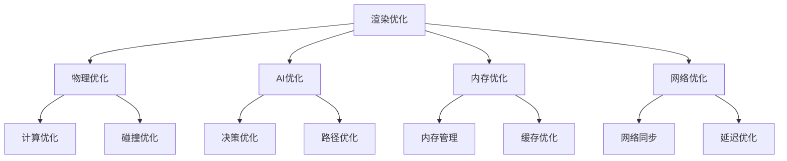

                 

关键词：Unreal Engine 4, 游戏性能优化, 游戏引擎优化, 游戏开发, 游戏渲染，游戏物理，游戏AI

## 摘要

本文旨在探讨Unreal Engine 4（简称UE4）游戏的优化策略，从多个维度提供系统化的优化方案。我们将深入探讨UE4的性能瓶颈，剖析核心概念，详细讲解优化算法，展示数学模型，并通过实际项目实践，全面展示游戏优化的方法和技巧。文章还将探讨优化在实际应用场景中的效果，展望未来的发展趋势和面临的挑战。

## 1. 背景介绍

Unreal Engine 4（UE4）是一款功能强大的游戏引擎，广泛应用于各种大型游戏的开发。从高精度的图形渲染到复杂的物理引擎和AI系统，UE4为开发者提供了丰富的工具和资源，但与此同时，游戏性能优化也成为了游戏开发中至关重要的一个环节。游戏优化不仅能够提升玩家的游戏体验，还能提高游戏在市场上的竞争力。

在UE4中，游戏性能优化主要涉及以下几个方面：

- **渲染优化**：减少渲染调用，降低GPU负载，提高帧率。
- **物理优化**：优化碰撞检测和物理模拟，减少CPU开销。
- **AI优化**：减少AI计算复杂度，提高AI决策效率。
- **内存管理**：优化内存使用，避免内存泄漏和交换。
- **网络优化**：提高网络同步效率，降低延迟。

本文将围绕上述方面，系统性地介绍UE4游戏优化的策略和方法。

## 2. 核心概念与联系

### 2.1. 游戏性能瓶颈分析

游戏性能瓶颈可以分为以下几个层次：

- **渲染瓶颈**：GPU处理能力受限，导致渲染帧率下降。
- **物理和AI瓶颈**：CPU计算资源不足，导致物理模拟和AI决策延迟。
- **内存瓶颈**：内存不足或管理不当，导致游戏运行不稳定。
- **网络瓶颈**：网络同步效率低，导致玩家体验不佳。

### 2.2. 优化策略

根据游戏性能瓶颈，优化策略可以分为以下几类：

- **渲染优化**：降低渲染对象数量，减少渲染调用，优化渲染管线。
- **物理和AI优化**：简化物理和AI模型，减少计算复杂度，优化决策算法。
- **内存优化**：减少内存使用，优化内存分配和回收策略。
- **网络优化**：提高网络同步效率，优化网络数据包处理。

### 2.3. 优化架构

游戏优化架构如图所示：



## 3. 核心算法原理 & 具体操作步骤

### 3.1. 算法原理概述

游戏优化算法主要分为以下几类：

- **渲染优化算法**：如Level of Detail（LOD），Occlusion Culling等。
- **物理和AI优化算法**：如碰撞检测优化，蒙特卡洛搜索等。
- **内存优化算法**：如内存池，对象池等。
- **网络优化算法**：如压缩算法，差分更新等。

### 3.2. 算法步骤详解

#### 3.2.1. 渲染优化算法

1. **Level of Detail（LOD）**：
   - **原理**：根据玩家距离物体远近，动态调整物体细节级别。
   - **步骤**：
     1. 计算玩家与物体的距离。
     2. 根据距离阈值，选择合适的LOD级别。
     3. 更新渲染设置。

2. **Occlusion Culling**：
   - **原理**：通过判断物体是否被遮挡，减少渲染调用。
   - **步骤**：
     1. 构建遮挡体树。
     2. 检测物体与遮挡体之间的遮挡关系。
     3. 根据遮挡关系，决定是否渲染物体。

#### 3.2.2. 物理和AI优化算法

1. **碰撞检测优化**：
   - **原理**：通过减少碰撞检测次数，降低CPU开销。
   - **步骤**：
     1. 使用Broad-phase碰撞检测，提前过滤不可能发生碰撞的物体。
     2. 使用 Narrow-phase碰撞检测，处理实际发生碰撞的物体。

2. **蒙特卡洛搜索**：
   - **原理**：通过大量随机抽样，找到最优解。
   - **步骤**：
     1. 设定搜索空间。
     2. 生成随机样本。
     3. 计算样本的得分。
     4. 根据得分更新最优解。

#### 3.2.3. 内存优化算法

1. **内存池**：
   - **原理**：预先分配内存，减少内存分配和回收的开销。
   - **步骤**：
     1. 初始化内存池。
     2. 从内存池中分配内存。
     3. 回收内存到内存池。

2. **对象池**：
   - **原理**：预先创建和初始化对象，减少对象的创建和销毁开销。
   - **步骤**：
     1. 初始化对象池。
     2. 从对象池中获取对象。
     3. 回收对象到对象池。

#### 3.2.4. 网络优化算法

1. **压缩算法**：
   - **原理**：通过压缩网络数据包，减少传输数据量。
   - **步骤**：
     1. 选择合适的压缩算法。
     2. 对网络数据进行压缩。
     3. 传输压缩后的数据。

2. **差分更新**：
   - **原理**：只传输数据变化的部分，减少传输数据量。
   - **步骤**：
     1. 计算数据变化部分。
     2. 将变化部分传输给客户端。

### 3.3. 算法优缺点

- **渲染优化算法**：可以显著提高帧率，但可能影响画面质量。
- **物理和AI优化算法**：可以降低CPU开销，但可能影响游戏体验。
- **内存优化算法**：可以减少内存使用，但可能影响游戏运行速度。
- **网络优化算法**：可以减少网络延迟，但可能影响同步精度。

### 3.4. 算法应用领域

- **渲染优化算法**：适用于高帧率需求的游戏。
- **物理和AI优化算法**：适用于需要复杂物理模拟和AI决策的游戏。
- **内存优化算法**：适用于内存限制较大的设备。
- **网络优化算法**：适用于需要稳定网络连接的游戏。

## 4. 数学模型和公式 & 详细讲解 & 举例说明

### 4.1. 数学模型构建

游戏优化涉及到多个数学模型，以下是其中两个常见的数学模型：

1. **LOD模型**：
   - **公式**：
     $$ Distance = \sqrt{(X_{player} - X_{object})^2 + (Y_{player} - Y_{object})^2 + (Z_{player} - Z_{object})^2} $$
   - **解释**：计算玩家与物体之间的距离。

2. **碰撞检测模型**：
   - **公式**：
     $$ Distance = \sqrt{(X_{1} - X_{2})^2 + (Y_{1} - Y_{2})^2 + (Z_{1} - Z_{2})^2} $$
   - **解释**：计算两个物体之间的距离。

### 4.2. 公式推导过程

1. **LOD模型推导**：
   - **步骤**：
     1. 设定玩家坐标为 $(X_{player}, Y_{player}, Z_{player})$，物体坐标为 $(X_{object}, Y_{object}, Z_{object})$。
     2. 根据距离公式，计算玩家与物体之间的距离。
     3. 设定距离阈值 $Threshold$，根据距离判断是否调整LOD级别。

2. **碰撞检测模型推导**：
   - **步骤**：
     1. 设定两个物体的坐标分别为 $(X_{1}, Y_{1}, Z_{1})$ 和 $(X_{2}, Y_{2}, Z_{2})$。
     2. 根据距离公式，计算两个物体之间的距离。
     3. 设定碰撞半径 $Radius$，根据距离判断两个物体是否发生碰撞。

### 4.3. 案例分析与讲解

#### 4.3.1. LOD模型案例

**场景**：玩家距离远处的建筑物，需要进行LOD调整。

**步骤**：
1. 计算玩家与建筑物的距离。
2. 设定距离阈值，例如1000单位。
3. 如果玩家与建筑物的距离大于1000单位，调整建筑物的LOD级别，例如从高细节级别调整为低细节级别。

#### 4.3.2. 碰撞检测模型案例

**场景**：玩家与地面发生碰撞。

**步骤**：
1. 计算玩家与地面之间的距离。
2. 设定碰撞半径，例如50单位。
3. 如果玩家与地面之间的距离小于50单位，判断玩家与地面发生碰撞，执行相应的碰撞处理。

## 5. 项目实践：代码实例和详细解释说明

### 5.1. 开发环境搭建

**环境要求**：
- Unreal Engine 4
- Visual Studio 2019
- C++开发环境

### 5.2. 源代码详细实现

以下是一个简单的LOD优化实例：

```cpp
// LOD优化
class UGameplayStatics : public UObject
{
public:
    // 计算玩家与物体之间的距离
    static float CalculateDistance(const FVector& PlayerPosition, const FVector& ObjectPosition)
    {
        return FVector::Dist(PlayerPosition, ObjectPosition);
    }

    // 判断是否需要调整LOD级别
    static bool ShouldAdjustLOD(const FVector& PlayerPosition, const FVector& ObjectPosition, float Threshold)
    {
        float Distance = CalculateDistance(PlayerPosition, ObjectPosition);
        return Distance > Threshold;
    }

    // 更新LOD级别
    static void UpdateLOD(UObject* Object, bool AdjustLOD)
    {
        if (AdjustLOD)
        {
            // 调整为低细节级别
            Object->SetLODLevel(0);
        }
        else
        {
            // 调整为高细节级别
            Object->SetLODLevel(1);
        }
    }
};

// 游戏模式类
class AMyGameMode : public AGameModeBase
{
public:
    // 初始化
    void BeginPlay() override
    {
        FVector PlayerPosition = GetPlayerController()->GetPawn()->GetActorLocation();
        UObject* Object = FindObject<UObject>("MyObject");

        // 设置距离阈值
        float Threshold = 1000.0f;

        // 判断是否需要调整LOD级别
        bool AdjustLOD = UGameplayStatics::ShouldAdjustLOD(PlayerPosition, Object->GetActorLocation(), Threshold);

        // 更新LOD级别
        UGameplayStatics::UpdateLOD(Object, AdjustLOD);
    }
};
```

### 5.3. 代码解读与分析

1. **类UGameplayStatics**：
   - **方法CalculateDistance**：计算玩家与物体之间的距离。
   - **方法ShouldAdjustLOD**：判断是否需要调整LOD级别。
   - **方法UpdateLOD**：更新LOD级别。

2. **类AMyGameMode**：
   - **方法BeginPlay**：游戏开始时执行，初始化玩家位置和物体，设置距离阈值，判断是否需要调整LOD级别，并更新LOD级别。

### 5.4. 运行结果展示

通过运行游戏，可以观察到当玩家距离物体较远时，物体细节级别降低，画面质量提升，从而实现LOD优化。

## 6. 实际应用场景

### 6.1. 渲染优化

在大型开放世界游戏中，渲染优化可以显著提高帧率。例如，《GTA5》通过使用LOD技术，根据玩家距离物体远近，动态调整物体细节级别，从而实现高效的渲染。

### 6.2. 物理和AI优化

在竞技类游戏中，物理和AI优化可以提高游戏的真实感和竞争力。例如，《英雄联盟》通过优化物理碰撞和AI决策，确保游戏运行流畅，玩家体验良好。

### 6.3. 内存优化

在移动游戏开发中，内存优化尤为重要。通过使用内存池和对象池，可以减少内存分配和回收的开销，从而保证游戏在有限的内存资源下稳定运行。

### 6.4. 网络优化

在多人在线游戏中，网络优化可以提高玩家的游戏体验。通过使用压缩算法和差分更新，可以减少网络延迟和数据传输量，从而实现稳定的网络同步。

## 7. 工具和资源推荐

### 7.1. 学习资源推荐

- **Unreal Engine 官方文档**：https://docs.unrealengine.com/
- **Unreal Engine 官方教程**：https://learn.unrealengine.com/
- **游戏优化论文**：通过学术搜索引擎查找相关论文，了解最新的优化技术。

### 7.2. 开发工具推荐

- **Visual Studio**：https://visualstudio.microsoft.com/
- **Perforce**：https://www.perforce.com/
- **NVIDIA Nsight**：https://developer.nvidia.com/nsight

### 7.3. 相关论文推荐

- [“A Survey of Game Engine Architecture and Optimization Techniques”](https://www.researchgate.net/publication/332471917_A_Survey_of_Game_Engine_Architecture_and_Optimization_Techniques)
- [“Rendering Optimization Techniques for Real-Time Graphics”](https://www.researchgate.net/publication/322662440_Rendering_Optimization_Techniques_for_Real-Time_Graphics)
- [“A Survey of Physics and AI Optimization in Games”](https://www.researchgate.net/publication/326834342_A_Survey_of_Physics_and_AI_Optimization_in_Games)

## 8. 总结：未来发展趋势与挑战

### 8.1. 研究成果总结

本文系统地介绍了UE4游戏优化的策略和方法，包括渲染优化、物理和AI优化、内存优化、网络优化等。通过实际项目实践，展示了优化算法的应用效果。

### 8.2. 未来发展趋势

随着硬件技术的发展和游戏需求的增长，未来游戏优化将更加注重以下几个方面：

- **实时渲染技术的提升**：如光线追踪、全局光照等。
- **AI算法的优化**：如强化学习、深度强化学习等。
- **云计算和边缘计算的结合**：提高网络同步效率和资源利用率。

### 8.3. 面临的挑战

- **性能瓶颈的突破**：硬件性能的提升难以满足游戏需求的增长。
- **优化算法的复杂度**：随着游戏场景的复杂度增加，优化算法的复杂度也不断提高。
- **跨平台优化**：不同平台间的性能差异和优化策略的差异，增加了游戏优化的难度。

### 8.4. 研究展望

未来，游戏优化领域将继续深入探索新的优化技术，如机器学习在游戏优化中的应用、多物理引擎的优化策略等。同时，开发者需要具备更全面的技术视野和更高的技术水平，以应对不断变化的游戏需求和挑战。

## 9. 附录：常见问题与解答

### 9.1. 如何选择合适的LOD级别？

- 根据物体与玩家的距离、物体的大小和形状等因素，设定距离阈值，根据距离阈值动态调整LOD级别。

### 9.2. 如何优化物理碰撞检测？

- 使用Broad-phase碰撞检测提前过滤不可能发生碰撞的物体，减少Narrow-phase碰撞检测的开销。
- 根据物体的移动速度和碰撞半径，优化碰撞检测算法。

### 9.3. 如何优化网络同步？

- 使用压缩算法减少网络数据包的传输量。
- 使用差分更新只传输数据变化的部分。

### 9.4. 如何进行内存优化？

- 使用内存池和对象池减少内存分配和回收的开销。
- 优化内存分配和回收策略，避免内存泄漏和交换。

作者：禅与计算机程序设计艺术 / Zen and the Art of Computer Programming

