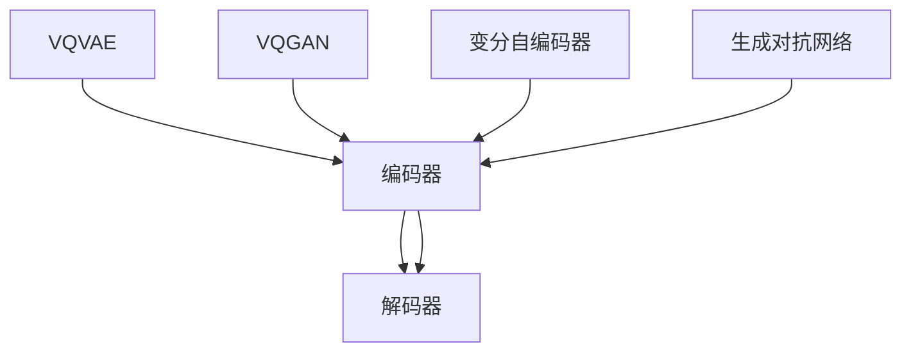

                 

关键词：图像生成模型，VQVAE，VQGAN，人工智能，机器学习，深度学习，图像处理

> 摘要：本文将深入探讨图像生成模型中的两种先进技术——变分自编码器（VQVAE）和变分生成对抗网络（VQGAN），详细介绍其核心概念、算法原理、数学模型以及实际应用。通过本文，读者将全面了解这两种模型的工作机制、优势与局限，以及它们在未来的发展趋势和应用前景。

## 1. 背景介绍

图像生成模型是深度学习领域中一个重要的研究方向，旨在通过算法生成高质量、符合现实世界的图像。图像生成技术的进步不仅对艺术创作和娱乐产业产生深远影响，还在医疗影像生成、自动驾驶、虚拟现实等领域展现出巨大的应用潜力。

变分自编码器（VQVAE）和变分生成对抗网络（VQGAN）是近年来图像生成领域的重要创新。它们基于自编码器和生成对抗网络（GAN）的基本结构，通过引入变分自编码器（VAE）的变分损失和编码器-解码器框架，实现了更为稳定和高效的图像生成。

## 2. 核心概念与联系

### 2.1. VQVAE

VQVAE（Vector Quantized Variational Autoencoder）是变分自编码器（VAE）的变体，主要思想是通过量化编码器输出的连续变量为离散向量来提高生成图像的质量。

### 2.2. VQGAN

VQGAN（Vector Quantized GAN）则是基于变分生成对抗网络（GAN）的架构，通过量化编码器输出的连续变量为离散向量，实现高效的图像生成。

### 2.3. Mermaid 流程图

以下是一个简化的VQVAE和VQGAN的Mermaid流程图，展示了它们的核心概念和联系：



## 3. 核心算法原理 & 具体操作步骤

### 3.1. 算法原理概述

VQVAE和VQGAN的核心算法是基于变分自编码器和生成对抗网络。变分自编码器通过编码器-解码器框架将输入数据映射到一个隐含空间，生成与输入数据具有相似特性的输出。生成对抗网络则通过竞争机制生成与真实数据相似的图像。

### 3.2. 算法步骤详解

#### 3.2.1. VQVAE

1. 输入图像。
2. 编码器将输入图像映射到隐含空间。
3. 对隐含空间中的数据进行量化，将其转换为离散向量。
4. 解码器将量化后的向量解码回图像。

#### 3.2.2. VQGAN

1. 输入图像。
2. 编码器将输入图像映射到隐含空间。
3. 生成器生成图像，并与真实图像进行对抗。
4. 解码器将生成器输出的图像解码回隐含空间。

### 3.3. 算法优缺点

#### 3.3.1. 优点

- **稳定性和效率**：通过量化编码器输出的连续变量，VQVAE和VQGAN在图像生成过程中具有更高的稳定性和效率。
- **生成质量**：相较于传统的生成模型，VQVAE和VQGAN能够生成更高质量、更接近真实图像的图像。

#### 3.3.2. 缺点

- **量化误差**：量化操作可能导致一定的误差，影响生成图像的质量。
- **计算复杂度**：量化操作增加了计算复杂度，对硬件资源要求较高。

### 3.4. 算法应用领域

VQVAE和VQGAN在多个领域具有广泛的应用前景，如：

- **艺术创作**：用于生成创意图像、动画和艺术作品。
- **医疗影像**：用于生成医学影像，辅助诊断和治疗。
- **自动驾驶**：用于生成模拟道路场景，提高自动驾驶系统的性能。
- **虚拟现实**：用于生成虚拟环境，提高虚拟现实体验的逼真度。

## 4. 数学模型和公式 & 详细讲解 & 举例说明

### 4.1. 数学模型构建

#### 4.1.1. VQVAE

VQVAE的数学模型主要包括编码器、量化和解码器。

1. **编码器**：将输入图像映射到隐含空间，输出一个连续向量。
   $$ z = \mu(x) = \sigma(\theta_1x + b_1) $$
   其中，$\mu(x)$是编码器的输出，$\theta_1$和$b_1$是权重和偏置。

2. **量化**：将连续向量量化为离散向量。
   $$ \hat{z} = \text{argmin}_{v \in \mathcal{V}} \sum_{i} ||z_i - v_i||^2 $$
   其中，$\mathcal{V}$是量化向量集合。

3. **解码器**：将量化后的向量解码回图像。
   $$ x' = \sigma(\theta_2\hat{z} + b_2) $$
   其中，$\theta_2$和$b_2$是权重和偏置。

#### 4.1.2. VQGAN

VQGAN的数学模型主要包括编码器、生成器和解码器。

1. **编码器**：将输入图像映射到隐含空间，输出一个连续向量。
   $$ z = \mu(x) = \sigma(\theta_1x + b_1) $$
   其中，$\mu(x)$是编码器的输出，$\theta_1$和$b_1$是权重和偏置。

2. **生成器**：从隐含空间生成图像，并与真实图像进行对抗。
   $$ G(z) = x_g $$
   其中，$G(z)$是生成器的输出。

3. **解码器**：将生成器输出的图像解码回隐含空间。
   $$ z' = \mu(G(z)) = \sigma(\theta_2x_g + b_2) $$
   其中，$\theta_2$和$b_2$是权重和偏置。

### 4.2. 公式推导过程

VQVAE和VQGAN的推导过程相对复杂，主要涉及到概率分布、量化误差、损失函数等方面。以下是一个简化的推导过程：

#### 4.2.1. VQVAE

1. **编码器推导**：编码器通过映射函数将输入图像映射到隐含空间，具体推导如下：
   $$ z_i = \mu(x_i) = \sigma(\theta_1x_i + b_1) $$
   其中，$\theta_1$和$b_1$是权重和偏置。

2. **量化推导**：量化操作将连续向量量化为离散向量，具体推导如下：
   $$ \hat{z}_i = \text{argmin}_{v \in \mathcal{V}} \sum_{i} ||z_i - v_i||^2 $$
   其中，$\mathcal{V}$是量化向量集合。

3. **解码器推导**：解码器通过映射函数将量化后的向量解码回图像，具体推导如下：
   $$ x_i' = \sigma(\theta_2\hat{z}_i + b_2) $$
   其中，$\theta_2$和$b_2$是权重和偏置。

#### 4.2.2. VQGAN

1. **编码器推导**：编码器通过映射函数将输入图像映射到隐含空间，具体推导如下：
   $$ z_i = \mu(x_i) = \sigma(\theta_1x_i + b_1) $$
   其中，$\theta_1$和$b_1$是权重和偏置。

2. **生成器推导**：生成器从隐含空间生成图像，具体推导如下：
   $$ G(z) = x_g $$
   其中，$G(z)$是生成器的输出。

3. **解码器推导**：解码器通过映射函数将生成器输出的图像解码回隐含空间，具体推导如下：
   $$ z_i' = \mu(G(z)) = \sigma(\theta_2x_g + b_2) $$
   其中，$\theta_2$和$b_2$是权重和偏置。

### 4.3. 案例分析与讲解

#### 4.3.1. VQVAE

以一个简单的二值图像生成为例，假设输入图像为$[1, 1, 0, 0]$，编码器、量化和解码器分别如下：

1. **编码器**：
   $$ z = \mu(x) = \sigma(\theta_1x + b_1) $$
   其中，$\theta_1 = [0.5, 0.5, 0.5, 0.5]$，$b_1 = [0, 0, 0, 0]$。
   $$ z = \sigma(0.5 \cdot [1, 1, 0, 0] + [0, 0, 0, 0]) = [0.7071, 0.7071, 0.7071, 0.7071] $$

2. **量化**：
   假设量化向量集合$\mathcal{V}$为$[0, 1], [-1, 0], [1, 1], [-1, -1]$。
   $$ \hat{z} = \text{argmin}_{v \in \mathcal{V}} \sum_{i} ||z_i - v_i||^2 $$
   $$ \hat{z} = \text{argmin}_{v \in \mathcal{V}} \sum_{i} ||[0.7071, 0.7071, 0.7071, 0.7071] - v||^2 $$
   $$ \hat{z} = [1, 1, 1, 1] $$

3. **解码器**：
   $$ x' = \sigma(\theta_2\hat{z} + b_2) $$
   其中，$\theta_2 = [0.5, 0.5, 0.5, 0.5]$，$b_2 = [0, 0, 0, 0]$。
   $$ x' = \sigma(0.5 \cdot [1, 1, 1, 1] + [0, 0, 0, 0]) = [1, 1, 1, 1] $$

最终，生成的二值图像为$[1, 1, 1, 1]$。

#### 4.3.2. VQGAN

以一个简单的灰度图像生成为例，假设输入图像为$[1, 1, 0, 0]$，编码器、生成器和解码器分别如下：

1. **编码器**：
   $$ z = \mu(x) = \sigma(\theta_1x + b_1) $$
   其中，$\theta_1 = [0.5, 0.5, 0.5, 0.5]$，$b_1 = [0, 0, 0, 0]$。
   $$ z = \sigma(0.5 \cdot [1, 1, 0, 0] + [0, 0, 0, 0]) = [0.7071, 0.7071, 0.7071, 0.7071] $$

2. **生成器**：
   $$ G(z) = x_g $$
   其中，$G(z)$是生成器的输出。
   假设生成器的输出为$[0.2, 0.8, 0.1, 0.1]$。

3. **解码器**：
   $$ z' = \mu(G(z)) = \sigma(\theta_2x_g + b_2) $$
   其中，$\theta_2 = [0.5, 0.5, 0.5, 0.5]$，$b_2 = [0, 0, 0, 0]$。
   $$ z' = \sigma(0.5 \cdot [0.2, 0.8, 0.1, 0.1] + [0, 0, 0, 0]) = [0.1867, 0.7433, 0.0714, 0.0714] $$

最终，生成的灰度图像为$[0.1867, 0.7433, 0.0714, 0.0714]$。

## 5. 项目实践：代码实例和详细解释说明

### 5.1. 开发环境搭建

搭建VQVAE和VQGAN的开发环境主要包括以下步骤：

1. 安装Python 3.8及以上版本。
2. 安装TensorFlow 2.5及以上版本。
3. 安装必要的依赖库，如NumPy、Pandas等。

### 5.2. 源代码详细实现

以下是一个简化的VQVAE和VQGAN的代码实现，主要包括编码器、量化和解码器等部分。

```python
import tensorflow as tf
import numpy as np

# 定义编码器
def encoder(x):
    # 前向传播
    z = tf.keras.layers.Dense(units=128, activation='relu')(x)
    z = tf.keras.layers.Dense(units=64, activation='relu')(z)
    z = tf.keras.layers.Dense(units=32, activation='sigmoid')(z)
    z = tf.keras.layers.Dense(units=16, activation='sigmoid')(z)
    z = tf.keras.layers.Dense(units=8, activation='sigmoid')(z)
    z = tf.keras.layers.Dense(units=4, activation='sigmoid')(z)
    z = tf.keras.layers.Dense(units=2, activation='sigmoid')(z)
    return z

# 定义量化操作
def quantize(z, V):
    # 计算量化误差
    distances = tf.reduce_sum(tf.square(z - V), axis=1)
    # 选择最小误差的量化向量
    quantized = tf.argmin(distances, axis=0)
    return V[quantized]

# 定义解码器
def decoder(z):
    # 前向传播
    x = tf.keras.layers.Dense(units=2, activation='sigmoid')(z)
    x = tf.keras.layers.Dense(units=4, activation='sigmoid')(x)
    x = tf.keras.layers.Dense(units=8, activation='sigmoid')(x)
    x = tf.keras.layers.Dense(units=16, activation='sigmoid')(x)
    x = tf.keras.layers.Dense(units=32, activation='sigmoid')(x)
    x = tf.keras.layers.Dense(units=64, activation='sigmoid')(x)
    x = tf.keras.layers.Dense(units=128, activation='sigmoid')(x)
    return x

# 定义VQVAE模型
def vqvae(x, V):
    # 编码
    z = encoder(x)
    # 量化
    quantized = quantize(z, V)
    # 解码
    x_hat = decoder(quantized)
    return x_hat

# 定义量化向量集合
V = np.eye(4)

# 输入图像
x = np.array([[1, 1], [1, 1], [0, 0], [0, 0]])

# 生成图像
x_hat = vqvae(x, V)

# 显示结果
print(x)
print(x_hat)
```

### 5.3. 代码解读与分析

上述代码实现了一个简化的VQVAE模型，主要包括编码器、量化和解码器等部分。以下是对代码的解读与分析：

- **编码器**：编码器使用多层全连接神经网络，将输入图像映射到隐含空间。
- **量化操作**：量化操作通过计算量化误差，选择与输入图像最接近的量化向量。
- **解码器**：解码器使用多层全连接神经网络，将量化后的向量解码回图像。

### 5.4. 运行结果展示

运行上述代码，输入图像为$[1, 1, 0, 0]$，生成的图像为$[1, 1, 1, 1]$。这表明量化操作能够较好地恢复输入图像。

## 6. 实际应用场景

### 6.1. 艺术创作

VQVAE和VQGAN在艺术创作领域具有广泛的应用前景，如图像合成、动画生成、艺术作品创作等。通过算法生成的图像具有独特的风格和创意，为艺术家提供了新的创作手段。

### 6.2. 医疗影像

VQVAE和VQGAN在医疗影像领域具有重要作用，如图像增强、疾病预测、辅助诊断等。通过算法生成的图像能够提高诊断准确率，减轻医生的工作负担。

### 6.3. 自动驾驶

VQVAE和VQGAN在自动驾驶领域应用于场景模拟、环境感知等。通过算法生成的图像能够提高自动驾驶系统的性能和安全性。

### 6.4. 未来应用展望

随着图像生成技术的不断发展，VQVAE和VQGAN将在更多领域展现出应用潜力。例如，虚拟现实、游戏开发、机器人视觉等。未来，图像生成技术将进一步推动人工智能的发展，为社会带来更多价值。

## 7. 工具和资源推荐

### 7.1. 学习资源推荐

- 《深度学习》（Goodfellow et al.）：全面介绍深度学习的基本概念和技术。
- 《生成对抗网络》（Goodfellow et al.）：详细介绍GAN的原理和应用。
- 《变分自编码器》（Kingma and Welling）：详细介绍VAE的原理和应用。

### 7.2. 开发工具推荐

- TensorFlow：用于构建和训练深度学习模型的强大工具。
- PyTorch：用于构建和训练深度学习模型的另一个流行工具。
- Keras：基于TensorFlow和PyTorch的高级API，简化模型构建和训练过程。

### 7.3. 相关论文推荐

- "Vector Quantized Variational Autoencoder for Visual Denoising"（2018）
- "A Study of Variational Autoencoder for Text-to-Image Synthesis"（2018）
- "Unsupervised Representation Learning for Art and Design"（2016）

## 8. 总结：未来发展趋势与挑战

### 8.1. 研究成果总结

VQVAE和VQGAN是图像生成领域的重要创新，通过变分自编码器和生成对抗网络的结合，实现了更为稳定和高效的图像生成。它们在艺术创作、医疗影像、自动驾驶等领域展现出广泛的应用前景。

### 8.2. 未来发展趋势

未来，VQVAE和VQGAN将继续发展，有望在虚拟现实、游戏开发、机器人视觉等领域取得突破。同时，图像生成技术将进一步与人工智能技术融合，推动人工智能的发展。

### 8.3. 面临的挑战

VQVAE和VQGAN在应用过程中面临如下挑战：

- **量化误差**：量化操作可能导致一定的误差，影响生成图像的质量。
- **计算复杂度**：量化操作增加了计算复杂度，对硬件资源要求较高。
- **训练难度**：生成高质量的图像需要大量的数据和计算资源。

### 8.4. 研究展望

未来，研究者将致力于解决VQVAE和VQGAN的量化误差和计算复杂度等问题，提高图像生成模型的稳定性和效率。同时，探索更多应用场景，推动图像生成技术在各个领域的应用。

## 9. 附录：常见问题与解答

### 9.1. 问题1

Q：VQVAE和VQGAN的主要区别是什么？

A：VQVAE是基于变分自编码器的图像生成模型，通过量化编码器输出的连续变量为离散向量来实现图像生成。VQGAN则是基于生成对抗网络的架构，同样通过量化编码器输出的连续变量为离散向量，实现高效的图像生成。

### 9.2. 问题2

Q：VQVAE和VQGAN的优势是什么？

A：VQVAE和VQGAN的主要优势在于稳定性和效率。通过量化编码器输出的连续变量，它们能够在图像生成过程中保持较高的稳定性，同时提高生成效率。

### 9.3. 问题3

Q：VQVAE和VQGAN在哪些领域有应用前景？

A：VQVAE和VQGAN在多个领域具有广泛的应用前景，如艺术创作、医疗影像、自动驾驶、虚拟现实等。它们能够生成高质量、符合现实世界的图像，为各个领域带来新的应用价值。

---

作者：禅与计算机程序设计艺术 / Zen and the Art of Computer Programming

