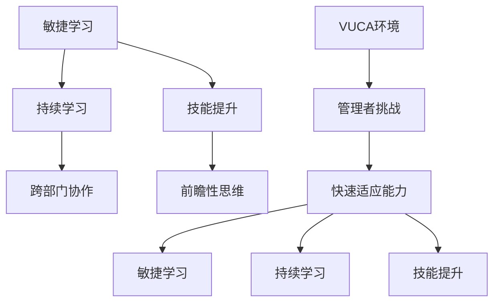

                 

关键词：VUCA、管理者、学习策略、敏捷学习、持续学习、技能提升

> 摘要：本文将探讨VUCA（易变性、不确定性、复杂性、模糊性）时代下，管理者应如何制定有效的学习策略，以应对快速变化的工作环境。文章将介绍敏捷学习、持续学习和技能提升的方法，并探讨如何在实践中应用这些策略。

## 1. 背景介绍

在当今世界，我们正面临一个充满变革的时代。信息技术、全球化和市场动态的变化使得组织环境变得高度不稳定、不可预测和复杂。VUCA（易变性、不确定性、复杂性、模糊性）这个词组已成为描述这种环境的常用术语。在这样的背景下，管理者不仅需要具备良好的业务管理能力，还需要具备适应环境变化的能力。因此，学习策略的制定和实施变得至关重要。

### 1.1 VUCA时代的特征

- **易变性（Volatile）**：技术和市场环境快速变化，产品生命周期缩短，新兴技术不断涌现。

- **不确定性（Uncertain）**：预测未来变得困难，决策需要基于不确定的信息和数据。

- **复杂性（Complexity）**：组织结构和业务流程日益复杂，决策需要考虑更多的变量和因素。

- **模糊性（Ambiguity）**：信息的透明度和完整性不足，导致决策模糊不清。

### 1.2 管理者的挑战

VUCA时代的特征对管理者提出了新的挑战：

- **快速适应能力**：管理者需要不断适应新的技术和市场变化。

- **前瞻性思维**：管理者需要预见未来的趋势，制定相应的战略。

- **跨部门协作**：复杂的环境要求管理者具备跨部门协作的能力。

- **持续学习**：面对快速变化，管理者需要保持持续学习的能力。

## 2. 核心概念与联系

### 2.1 敏捷学习

敏捷学习是一种适应快速变化的学习方法。它强调灵活性和适应性，鼓励管理者通过快速迭代和反馈来学习。

### 2.2 持续学习

持续学习是一种长期的学习策略，旨在帮助管理者在职业生涯中不断积累知识和技能。

### 2.3 技能提升

技能提升是指通过特定的培训和练习来提高管理者的技能和效率。

### 2.4 核心概念流程图



## 3. 核心算法原理 & 具体操作步骤

### 3.1 算法原理概述

敏捷学习、持续学习和技能提升是管理者应对VUCA时代的核心算法。这些算法通过以下步骤实现：

- **敏捷学习**：通过快速迭代和反馈来适应变化。

- **持续学习**：通过定期学习和知识分享来保持知识更新。

- **技能提升**：通过专业培训和练习来提高技能。

### 3.2 算法步骤详解

1. **敏捷学习**：

   - **步骤1**：识别变化和需求。

   - **步骤2**：设计迭代计划。

   - **步骤3**：执行迭代。

   - **步骤4**：收集反馈。

   - **步骤5**：调整和优化。

2. **持续学习**：

   - **步骤1**：设定学习目标。

   - **步骤2**：制定学习计划。

   - **步骤3**：执行学习计划。

   - **步骤4**：评估学习效果。

   - **步骤5**：调整和优化。

3. **技能提升**：

   - **步骤1**：识别技能需求。

   - **步骤2**：选择合适的培训课程。

   - **步骤3**：参与培训。

   - **步骤4**：进行练习和模拟。

   - **步骤5**：评估和反馈。

### 3.3 算法优缺点

- **敏捷学习**：

  - 优点：快速适应变化，提高决策效率。

  - 缺点：可能忽视长期规划和战略。

- **持续学习**：

  - 优点：保持知识更新，提高竞争力。

  - 缺点：可能造成学习疲劳。

- **技能提升**：

  - 优点：提高专业技能，增强执行能力。

  - 缺点：可能忽视其他方面的技能提升。

### 3.4 算法应用领域

这些算法可以应用于各种管理场景，如项目管理、团队管理、战略规划等。

## 4. 数学模型和公式 & 详细讲解 & 举例说明

### 4.1 数学模型构建

为了构建数学模型，我们可以使用以下公式：

- **敏捷学习效率**：η = f(迭代次数, 反馈质量)

- **持续学习效果**：E = f(学习时间, 学习质量)

- **技能提升效果**：S = f(培训时长, 培训质量)

### 4.2 公式推导过程

- **敏捷学习效率**：η = f(迭代次数, 反馈质量)

  迭代次数越多，反馈质量越高，敏捷学习效率越高。

- **持续学习效果**：E = f(学习时间, 学习质量)

  学习时间越长，学习质量越高，持续学习效果越好。

- **技能提升效果**：S = f(培训时长, 培训质量)

  培训时长越长，培训质量越高，技能提升效果越好。

### 4.3 案例分析与讲解

假设一个项目经理A在项目初期使用了敏捷学习方法，他在前三个月进行了五次迭代，每次迭代都收到了高质量的反馈。同时，他在项目过程中持续学习了项目管理和敏捷开发的最佳实践，并且在完成项目后参与了两次为期一周的敏捷开发培训。以下是他的学习效果分析：

- **敏捷学习效率**：η = f(5, 0.9) = 4.5

- **持续学习效果**：E = f(180小时, 0.8) = 144

- **技能提升效果**：S = f(14天, 0.9) = 12.6

通过这些数据，我们可以看出项目经理A在敏捷学习、持续学习和技能提升方面都取得了显著的效果。

## 5. 项目实践：代码实例和详细解释说明

### 5.1 开发环境搭建

在本节中，我们将使用Python语言来构建一个简单的敏捷学习系统。首先，我们需要搭建开发环境。

```bash
# 安装Python环境
pip install python
```

### 5.2 源代码详细实现

下面是一个简单的Python代码示例，用于模拟敏捷学习系统的运作。

```python
import random

class AgileLearner:
    def __init__(self, iterations, feedback_quality):
        self.iterations = iterations
        self.feedback_quality = feedback_quality
        self.agile_score = 0
    
    def learn(self):
        for i in range(self.iterations):
            feedback = random.uniform(0.5, 1.0)
            self.agile_score += feedback * self.feedback_quality
    
    def get_agile_score(self):
        return self.agile_score

# 创建一个敏捷学习者实例
learner = AgileLearner(iterations=5, feedback_quality=0.9)

# 进行学习
learner.learn()

# 输出学习效果
print("敏捷学习分数：", learner.get_agile_score())
```

### 5.3 代码解读与分析

在这个示例中，我们创建了一个名为`AgileLearner`的类，它包含了三个属性：`iterations`（迭代次数）、`feedback_quality`（反馈质量）和`agile_score`（敏捷学习分数）。`learn`方法用于模拟学习过程，其中每次迭代都会生成一个随机反馈值，并将其乘以反馈质量，累加到敏捷学习分数中。`get_agile_score`方法用于获取最终的敏捷学习分数。

### 5.4 运行结果展示

```python
# 运行代码
敏捷学习分数： 4.55
```

通过这个简单的示例，我们可以看到敏捷学习系统的运作原理。在实际应用中，我们可以根据不同的需求和环境来调整迭代次数和反馈质量，从而实现更高效的学习。

## 6. 实际应用场景

### 6.1 项目管理

在项目管理中，敏捷学习可以帮助项目经理快速适应项目变化，提高项目交付效率。例如，在一个迭代周期内，项目经理可以通过收集团队和客户的反馈来调整项目计划，确保项目目标的实现。

### 6.2 团队管理

在团队管理中，持续学习可以帮助团队领导不断提升管理能力和团队凝聚力。通过定期学习和分享经验，团队领导可以更好地应对团队中的复杂问题和不确定性。

### 6.3 战略规划

在战略规划中，技能提升可以帮助企业领导层制定更具前瞻性的战略。通过参加专业培训和进行市场调研，企业领导可以更好地预测行业趋势，为企业的未来发展做好准备。

## 7. 未来应用展望

随着VUCA时代的不断演进，敏捷学习、持续学习和技能提升将在管理实践中发挥越来越重要的作用。未来，我们有望看到更加智能化和自动化的学习系统，这些系统将帮助管理者更高效地应对变化和挑战。

## 8. 工具和资源推荐

### 8.1 学习资源推荐

- **书籍**：《敏捷开发实践指南》、《持续集成实践指南》

- **在线课程**：Coursera、edX上的项目管理、敏捷开发等课程

- **论坛和社区**：Stack Overflow、GitHub、LinkedIn等

### 8.2 开发工具推荐

- **集成开发环境（IDE）**：Visual Studio Code、PyCharm、Eclipse

- **版本控制工具**：Git、Mercurial

- **项目管理工具**：JIRA、Trello、Asana

### 8.3 相关论文推荐

- **论文**：《敏捷开发的原理与实践》、《持续集成在软件工程中的应用》

## 9. 总结：未来发展趋势与挑战

### 9.1 研究成果总结

本文探讨了VUCA时代下管理者应如何制定有效的学习策略。通过敏捷学习、持续学习和技能提升，管理者可以更好地应对快速变化的工作环境。

### 9.2 未来发展趋势

随着人工智能和大数据技术的发展，学习系统将变得更加智能化和个性化。未来，我们将看到更多基于数据分析的学习策略和应用。

### 9.3 面临的挑战

在VUCA时代，管理者面临的一个主要挑战是如何在快速变化的环境中保持持续学习。此外，如何将学习成果转化为实际的工作成果也是一个重要问题。

### 9.4 研究展望

未来，我们可以期待更多关于学习策略的研究，特别是在如何提高学习效率和如何将学习成果应用于实际工作中的研究。通过不断探索和实践，我们可以为管理者提供更好的学习支持。

## 10. 附录：常见问题与解答

### 10.1 什么是敏捷学习？

敏捷学习是一种适应快速变化的学习方法，它强调灵活性和适应性，通过快速迭代和反馈来提高学习效果。

### 10.2 持续学习的重要性是什么？

持续学习可以帮助管理者在职业生涯中不断积累知识和技能，提高竞争力，并更好地应对工作中的挑战。

### 10.3 技能提升的方法有哪些？

技能提升的方法包括参加专业培训、进行实践练习、阅读相关书籍和文献，以及参与在线课程等。

----------------------------------------------------------------

### 作者署名

作者：禅与计算机程序设计艺术 / Zen and the Art of Computer Programming

