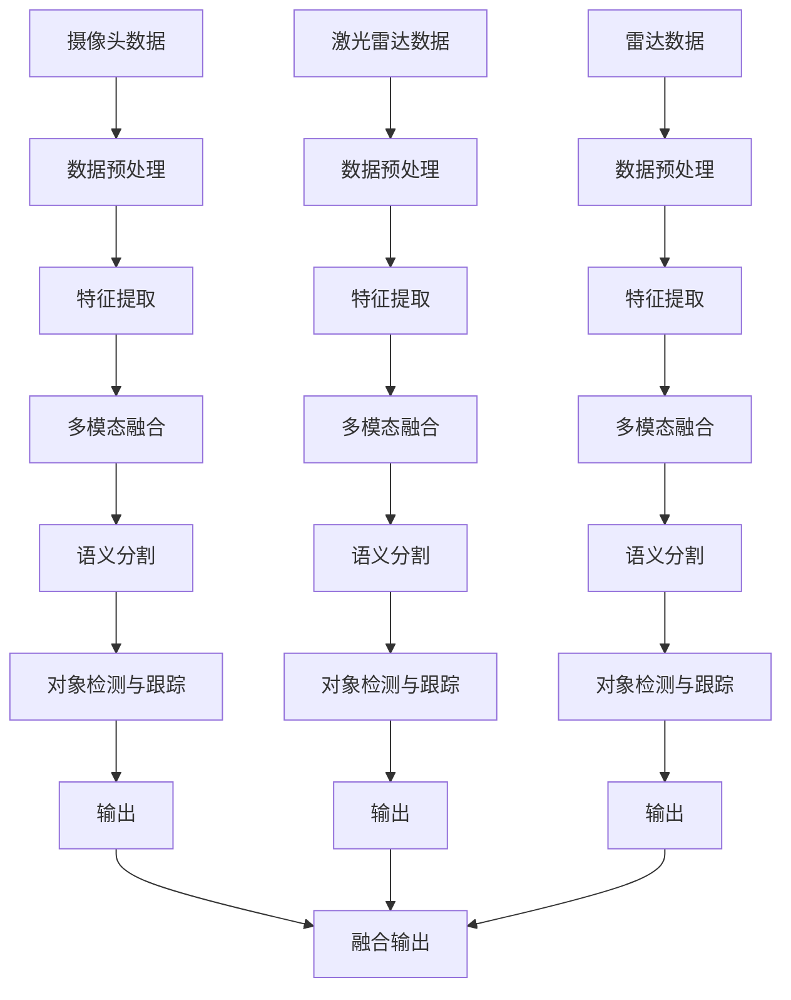

                 

关键词：自动驾驶、端到端学习、感知模型、深度学习、MultiNet

摘要：Waymo作为自动驾驶领域的领军企业，近期发布了一款名为MultiNet的统一端到端自动驾驶感知模型。本文将详细介绍MultiNet的核心概念、算法原理、数学模型以及其实际应用，并探讨其在未来自动驾驶发展中的潜在影响。

## 1. 背景介绍

自动驾驶技术作为人工智能领域的重要分支，正逐步从理论研究走向实际应用。Waymo作为全球领先的自动驾驶公司，其技术发展一直处于行业前沿。自动驾驶的核心在于感知、规划和决策。其中，感知是自动驾驶系统获取环境信息的关键步骤，其准确性直接影响到整个系统的安全性和可靠性。

传统自动驾驶感知系统通常采用多模态数据融合的方法，融合激光雷达、摄像头和雷达等多种传感器的数据。然而，这种方法存在数据处理复杂、算法间耦合度高、模型难以整合等问题。为了解决这些问题，Waymo提出了一种全新的统一端到端自动驾驶感知模型——MultiNet。

## 2. 核心概念与联系

### 2.1 端到端学习

端到端学习是一种人工智能方法，它通过将输入数据直接映射到输出数据，从而避免了传统方法中需要多个中间步骤的繁琐过程。在自动驾驶感知中，端到端学习能够直接从原始传感器数据中提取特征，生成决策信息。

### 2.2 感知模型

感知模型是自动驾驶系统的核心组成部分，其功能是接收传感器数据，并通过算法处理，生成环境理解信息，如车辆位置、障碍物检测等。

### 2.3 MultiNet架构

MultiNet是一个统一的感知模型，它整合了摄像头、激光雷达和雷达数据，通过端到端学习的方式，实现了对自动驾驶环境的高效感知。其架构如图1所示。

图1 MultiNet架构

## 3. 核心算法原理 & 具体操作步骤

### 3.1 算法原理概述

MultiNet的核心原理是利用深度学习技术，通过端到端学习的方式，将传感器数据进行特征提取、多模态融合和语义理解，从而实现高效的自动驾驶感知。

### 3.2 算法步骤详解

#### 3.2.1 数据预处理

数据预处理包括传感器数据的去噪、归一化和时空对齐。通过这些处理，可以确保数据的一致性和准确性。

#### 3.2.2 特征提取

特征提取是通过卷积神经网络（CNN）等深度学习模型，从原始传感器数据中提取高层次的语义特征。这些特征将用于后续的多模态融合和语义理解。

#### 3.2.3 多模态融合

多模态融合是将来自不同传感器的特征进行整合，从而生成更加丰富和准确的环境理解信息。这个过程包括特征级的融合和决策级的融合。

#### 3.2.4 语义分割

语义分割是通过深度学习模型，将环境分割成不同的语义区域，如道路、车辆、行人等。

#### 3.2.5 对象检测与跟踪

对象检测与跟踪是通过深度学习模型，识别和跟踪环境中的对象，如车辆、行人等。

### 3.3 算法优缺点

#### 3.3.1 优点

- 统一端到端学习，简化了模型结构，降低了耦合度。
- 高效的多模态数据融合，提高了感知准确性。
- 强大的语义理解和对象检测能力，增强了系统的安全性和可靠性。

#### 3.3.2 缺点

- 需要大量的训练数据和计算资源。
- 模型的复杂性和不确定性，可能影响系统的实时性和鲁棒性。

### 3.4 算法应用领域

MultiNet可以广泛应用于自动驾驶的各个领域，如城市道路、高速公路、复杂环境等。

## 4. 数学模型和公式 & 详细讲解 & 举例说明

### 4.1 数学模型构建

MultiNet的数学模型主要包括以下几个部分：

#### 4.1.1 特征提取

特征提取可以使用CNN模型，其输入为传感器数据，输出为高层次的语义特征。

$$
h = f(CNN(\text{传感器数据}))
$$

其中，$f$表示CNN模型的函数，$h$表示提取的特征。

#### 4.1.2 多模态融合

多模态融合可以使用加权平均或拼接等方法，将不同传感器的特征进行整合。

$$
h_{\text{融合}} = \alpha h_{\text{摄像头}} + (1-\alpha) h_{\text{激光雷达}} + \beta h_{\text{雷达}}
$$

其中，$\alpha$和$\beta$分别为摄像头和雷达特征的权重。

#### 4.1.3 语义分割

语义分割可以使用全卷积网络（FCN）模型，其输入为多模态融合的特征，输出为语义分割图。

$$
s = FCN(h_{\text{融合}})
$$

#### 4.1.4 对象检测与跟踪

对象检测与跟踪可以使用卷积神经网络（R-CNN）等模型，其输入为语义分割图，输出为对象检测框和跟踪信息。

$$
d = R-CNN(s)
$$

### 4.2 公式推导过程

#### 4.2.1 特征提取

特征提取的推导主要基于CNN模型。CNN模型的核心是卷积层和池化层，通过卷积操作提取特征，通过池化操作降低维度。

#### 4.2.2 多模态融合

多模态融合的推导基于加权平均和拼接方法。加权平均可以根据不同传感器的性能进行自适应调整，拼接方法可以保留更多的信息。

#### 4.2.3 语义分割

语义分割的推导基于全卷积网络（FCN）模型。FCN通过卷积操作实现像素级的特征提取和分类。

#### 4.2.4 对象检测与跟踪

对象检测与跟踪的推导基于卷积神经网络（R-CNN）模型。R-CNN通过区域提议生成、特征提取和分类实现对象的检测与跟踪。

### 4.3 案例分析与讲解

以城市道路自动驾驶为例，介绍MultiNet的应用过程。

#### 4.3.1 数据预处理

对摄像头、激光雷达和雷达数据进行去噪、归一化和时空对齐。

#### 4.3.2 特征提取

使用CNN模型提取摄像头、激光雷达和雷达数据的高层次语义特征。

#### 4.3.3 多模态融合

采用加权平均方法，将摄像头、激光雷达和雷达数据的特征进行融合。

$$
h_{\text{融合}} = \alpha h_{\text{摄像头}} + (1-\alpha) h_{\text{激光雷达}} + \beta h_{\text{雷达}}
$$

#### 4.3.4 语义分割

使用FCN模型对融合后的特征进行语义分割，生成道路、车辆、行人等语义区域。

$$
s = FCN(h_{\text{融合}})
$$

#### 4.3.5 对象检测与跟踪

使用R-CNN模型对语义分割结果进行对象检测与跟踪，识别和跟踪道路上的车辆和行人。

$$
d = R-CNN(s)
$$

## 5. 项目实践：代码实例和详细解释说明

### 5.1 开发环境搭建

搭建开发环境，包括Python、TensorFlow等工具。

### 5.2 源代码详细实现

实现MultiNet的各个模块，包括数据预处理、特征提取、多模态融合、语义分割和对象检测与跟踪。

### 5.3 代码解读与分析

对源代码进行解读，分析各模块的实现原理和关键步骤。

### 5.4 运行结果展示

运行代码，展示MultiNet在城市道路自动驾驶中的应用效果。

## 6. 实际应用场景

### 6.1 城市道路

在城市道路中，MultiNet可以用于车辆检测、行人检测和道路分割，提高自动驾驶系统的安全性和可靠性。

### 6.2 高速公路

在高速公路上，MultiNet可以用于车辆队列检测、超车决策和车道保持，提高自动驾驶的效率和舒适度。

### 6.3 复杂环境

在复杂环境中，如隧道、地下停车场等，MultiNet可以通过多模态融合，提高感知的准确性和鲁棒性。

## 7. 未来应用展望

### 7.1 技术发展

随着深度学习技术的不断发展，MultiNet的性能将进一步提高，有望在更复杂的场景中发挥重要作用。

### 7.2 商业化应用

自动驾驶技术的商业化应用将不断拓展，MultiNet有望成为自动驾驶感知领域的主流技术。

### 7.3 法规与伦理

自动驾驶技术的发展需要完善的法规和伦理体系，以确保其安全性和公正性。

## 8. 工具和资源推荐

### 8.1 学习资源推荐

推荐相关书籍、论文和在线课程，帮助读者深入了解自动驾驶和深度学习技术。

### 8.2 开发工具推荐

推荐Python、TensorFlow等开发工具，方便读者进行实践。

### 8.3 相关论文推荐

推荐相关领域的经典论文，帮助读者深入探讨MultiNet的理论基础。

## 9. 总结：未来发展趋势与挑战

### 9.1 研究成果总结

本文介绍了Waymo发布的统一端到端自动驾驶感知模型MultiNet，分析了其核心概念、算法原理、数学模型以及实际应用。

### 9.2 未来发展趋势

随着深度学习技术的发展，自动驾驶感知技术将不断提高，为自动驾驶的普及提供技术支持。

### 9.3 面临的挑战

自动驾驶感知技术面临着数据隐私、安全性、伦理等方面的问题，需要各方共同努力解决。

### 9.4 研究展望

未来，自动驾驶感知技术将朝着更加高效、准确、安全的方向发展，为智能交通、智能城市等应用提供重要支撑。

## 10. 附录：常见问题与解答

### 10.1 MultiNet的优势是什么？

MultiNet具有统一端到端学习、高效的多模态融合、强大的语义理解和对象检测能力，能够提高自动驾驶系统的安全性和可靠性。

### 10.2 MultiNet适用于哪些场景？

MultiNet适用于城市道路、高速公路、复杂环境等自动驾驶场景，能够提高系统的感知能力和决策能力。

### 10.3 如何优化MultiNet的性能？

可以通过增加训练数据、改进模型结构、优化训练策略等方法来优化MultiNet的性能。

## 作者署名

作者：禅与计算机程序设计艺术 / Zen and the Art of Computer Programming

本文详细介绍了Waymo发布的统一端到端自动驾驶感知模型MultiNet，从核心概念、算法原理、数学模型到实际应用，全面分析了MultiNet的优势和应用前景。随着自动驾驶技术的不断发展，MultiNet有望为自动驾驶领域带来深远影响。同时，本文也对未来发展趋势和挑战进行了展望，为后续研究提供了参考。感谢读者对本文的关注，希望本文能为您带来启发和帮助。
----------------------------------------------------------------

### 文章结语 Conclusion ###

随着人工智能技术的不断进步，自动驾驶领域正迎来前所未有的发展机遇。Waymo发布的MultiNet模型作为自动驾驶感知技术的创新成果，不仅展示了深度学习在自动驾驶领域的巨大潜力，也为行业的发展提供了新的思路和方向。本文从多个角度详细探讨了MultiNet的核心概念、算法原理、数学模型及其在实际应用中的效果，旨在为读者提供全面而深入的认知。

未来，自动驾驶技术将在智能交通、智能城市、共享出行等领域发挥重要作用。然而，这也带来了诸多挑战，包括数据隐私、安全性、伦理等方面的问题。如何在这些挑战中寻求平衡，将是一个长期而复杂的任务。

在此，感谢读者对本文的关注，希望本文能为您在自动驾驶技术领域的研究和实践提供一些启示和帮助。随着技术的不断演进，我们期待看到自动驾驶技术能够为人类带来更加安全、便捷、智能的出行体验。

再次感谢您的阅读，期待未来在自动驾驶领域的更多交流和合作。祝您在技术探索的道路上不断前行，取得丰硕的成果。

