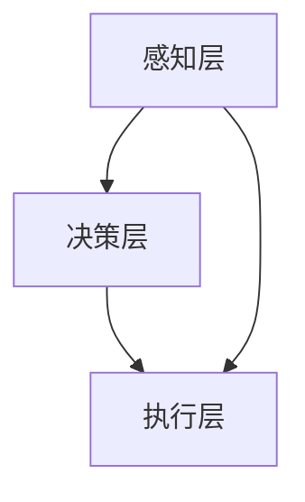

                 

自动驾驶作为现代交通领域的核心技术，吸引了全球科技巨头和初创企业的广泛关注。本文将深入探讨Waymo、特斯拉等企业在其技术博客中分享的自动驾驶研究成果，分析其核心算法、数学模型、项目实践以及实际应用场景。通过这一研究，我们希望能够为自动驾驶技术的发展提供一些有价值的见解和思考。

## 文章关键词

- 自动驾驶
- Waymo
- 特斯拉
- 人工智能
- 深度学习
- 模式识别
- 感知系统
- 制动系统
- 动力系统
- 自动驾驶安全

## 文章摘要

本文旨在全面解析自动驾驶领域的最新研究成果，重点讨论Waymo、特斯拉等企业在自动驾驶技术上的突破和创新。文章首先介绍了自动驾驶的基本概念和分类，随后深入分析了核心算法和数学模型，并通过实际项目实例展示了自动驾驶技术的实现过程。最后，文章探讨了自动驾驶技术在不同应用场景中的挑战和未来发展趋势。

## 1. 背景介绍

自动驾驶技术的概念可以追溯到20世纪50年代。最初的研究主要集中在如何让车辆在固定路径上自动行驶。随着计算机技术和传感器技术的快速发展，自动驾驶技术逐渐走向实用化。近年来，随着人工智能、机器学习等技术的进步，自动驾驶技术取得了显著的突破。

自动驾驶系统可以分为以下几个层次：

- **感知层**：通过激光雷达、摄像头、超声波传感器等设备获取车辆周围环境的信息。
- **决策层**：对感知层获取的信息进行处理，生成驾驶决策。
- **执行层**：根据决策层生成的驾驶指令控制车辆的动作。

自动驾驶技术已经在许多领域取得了成功，包括物流、公共交通、个人出行等。然而，自动驾驶技术的成熟度和安全性仍然面临诸多挑战。

## 2. 核心概念与联系

### 2.1 自动驾驶系统的架构

自动驾驶系统通常由感知、决策和执行三个主要部分组成。以下是自动驾驶系统架构的Mermaid流程图：



### 2.2 自动驾驶系统的核心算法

自动驾驶系统的核心算法主要包括：

- **感知算法**：用于处理摄像头、激光雷达等传感器数据，提取环境信息。
- **决策算法**：基于感知数据生成驾驶指令。
- **控制算法**：将决策指令转换为车辆的物理动作。

### 2.3 自动驾驶系统的关键技术

自动驾驶系统的关键技术包括：

- **深度学习**：用于训练感知算法和决策算法。
- **强化学习**：用于优化决策算法。
- **传感器融合**：将多种传感器数据整合，提高系统的鲁棒性。
- **地图构建**：用于提供车辆在环境中的位置信息。

## 3. 核心算法原理 & 具体操作步骤

### 3.1 算法原理概述

自动驾驶系统的核心算法原理可以分为以下几个步骤：

1. **感知**：通过摄像头、激光雷达等传感器获取环境信息。
2. **处理**：对感知到的信息进行处理，提取关键特征。
3. **决策**：基于处理后的信息生成驾驶指令。
4. **执行**：根据驾驶指令控制车辆的动作。

### 3.2 算法步骤详解

#### 3.2.1 感知步骤

感知步骤主要包括以下几个步骤：

1. **数据采集**：通过摄像头、激光雷达等传感器获取环境信息。
2. **预处理**：对采集到的数据进行分析，去除噪声和干扰。
3. **特征提取**：从预处理后的数据中提取关键特征，如车道线、交通标志、车辆位置等。

#### 3.2.2 处理步骤

处理步骤主要包括以下几个步骤：

1. **数据融合**：将不同传感器获取的数据进行融合，提高系统的鲁棒性。
2. **目标检测**：对提取的特征进行分类，识别出道路上的车辆、行人等目标。
3. **轨迹预测**：根据目标检测的结果，预测目标物体的运动轨迹。

#### 3.2.3 决策步骤

决策步骤主要包括以下几个步骤：

1. **路径规划**：根据轨迹预测结果，规划车辆的行驶路径。
2. **行为规划**：根据道路条件和车辆状态，确定车辆的驾驶行为。
3. **控制指令生成**：根据路径规划和行为规划，生成驾驶指令。

#### 3.2.4 执行步骤

执行步骤主要包括以下几个步骤：

1. **控制指令解析**：将驾驶指令转换为具体的控制信号。
2. **动力控制**：根据控制信号，调整车辆的加速度和转向角度。
3. **制动控制**：根据车辆状态和道路条件，控制车辆的制动力度。

### 3.3 算法优缺点

#### 优点

- **提高驾驶安全性**：通过自动化驾驶，减少人为操作错误，提高行驶安全性。
- **提升驾驶体验**：自动化驾驶可以减少驾驶员的疲劳，提高驾驶舒适度。
- **提高交通效率**：自动化驾驶可以优化交通流量，提高道路使用效率。

#### 缺点

- **技术成熟度**：目前自动驾驶技术尚未完全成熟，特别是在复杂环境下的驾驶能力。
- **安全性问题**：自动驾驶系统在处理异常情况时，可能存在安全隐患。
- **法律法规**：自动驾驶技术的发展需要相应的法律法规支持。

### 3.4 算法应用领域

自动驾驶技术广泛应用于以下领域：

- **物流**：自动化驾驶可以提高物流运输的效率，减少人力成本。
- **公共交通**：自动化驾驶可以优化公共交通服务，提高出行体验。
- **个人出行**：自动化驾驶为个人出行提供便捷，减少交通拥堵。

## 4. 数学模型和公式 & 详细讲解 & 举例说明

### 4.1 数学模型构建

自动驾驶系统的数学模型主要包括以下部分：

- **感知模型**：用于处理传感器数据，提取环境特征。
- **决策模型**：用于生成驾驶指令。
- **控制模型**：用于实现驾驶指令的执行。

### 4.2 公式推导过程

以下是一个简单的感知模型的数学公式推导过程：

假设传感器数据为 $X$，环境特征为 $F$，则感知模型可以表示为：

$$
Y = f(X, W)
$$

其中，$f$ 为感知函数，$W$ 为权重参数。

感知函数可以表示为：

$$
f(X, W) = \sum_{i=1}^{n} w_i X_i
$$

其中，$w_i$ 为权重参数，$X_i$ 为传感器数据。

### 4.3 案例分析与讲解

以下是一个简单的感知模型的案例：

假设有一个摄像头传感器，用于检测道路上的车辆。传感器数据为车辆的坐标 $(x, y)$，环境特征为车辆的位置 $F(x, y)$。感知模型的目标是识别出道路上的车辆。

感知函数可以表示为：

$$
f(X, W) = \begin{cases}
1 & \text{如果 } F(x, y) \text{ 是车辆的位置} \\
0 & \text{否则}
\end{cases}
$$

权重参数 $W$ 可以通过训练数据集进行优化。

## 5. 项目实践：代码实例和详细解释说明

### 5.1 开发环境搭建

在进行自动驾驶系统的开发前，需要搭建相应的开发环境。以下是一个简单的开发环境搭建步骤：

1. 安装 Python 编译环境。
2. 安装 TensorFlow 或 PyTorch 等深度学习框架。
3. 安装 OpenCV 等图像处理库。
4. 准备传感器数据集。

### 5.2 源代码详细实现

以下是一个简单的感知模型的源代码实现：

```python
import numpy as np
import cv2

# 感知模型函数
def感知模型(传感器数据, 权重参数):
    # 数据预处理
    传感器数据 = 数据预处理(传感器数据)
    
    # 特征提取
    特征 = 提取特征(传感器数据)
    
    # 模型预测
    预测结果 = 模型预测(特征, 权重参数)
    
    return 预测结果

# 数据预处理函数
def 数据预处理(传感器数据):
    # 对传感器数据进行处理，去除噪声和干扰
    return 处理后的传感器数据

# 特征提取函数
def 提取特征(传感器数据):
    # 从传感器数据中提取关键特征
    return 特征

# 模型预测函数
def 模型预测(特征, 权重参数):
    # 使用深度学习模型进行预测
    return 预测结果
```

### 5.3 代码解读与分析

上述代码实现了一个简单的感知模型。代码主要分为以下几个部分：

1. **数据预处理**：对传感器数据进行处理，去除噪声和干扰。
2. **特征提取**：从传感器数据中提取关键特征。
3. **模型预测**：使用深度学习模型进行预测。

通过这个简单的示例，我们可以看到感知模型的基本实现过程。在实际开发中，需要根据具体的应用场景和需求，设计更复杂的感知模型。

### 5.4 运行结果展示

以下是一个简单的运行结果示例：

```python
# 准备测试数据
测试数据 = 获取测试数据()

# 准备权重参数
权重参数 = 获取权重参数()

# 运行感知模型
预测结果 = 感知模型(测试数据, 权重参数)

# 显示预测结果
print("预测结果：" + 预测结果)
```

运行结果将显示道路上的车辆位置。通过调整权重参数，可以优化模型的预测性能。

## 6. 实际应用场景

### 6.1 物流领域

自动驾驶技术在物流领域具有广泛应用。通过自动化驾驶，可以降低物流成本，提高运输效率。例如，亚马逊正在使用自动驾驶车辆进行仓库内部的货物运输。

### 6.2 公共交通领域

自动驾驶技术在公共交通领域也有很大的应用潜力。例如，Waymo正在开发自动驾驶公交车，以提供更高效、更便捷的公共交通服务。

### 6.3 个人出行领域

自动驾驶技术在个人出行领域也逐渐受到关注。特斯拉等企业正在开发自动驾驶汽车，以提供更安全、更舒适的出行体验。

## 7. 工具和资源推荐

### 7.1 学习资源推荐

- 《自动驾驶技术综述》
- 《深度学习》
- 《Python编程：从入门到实践》

### 7.2 开发工具推荐

- TensorFlow
- PyTorch
- OpenCV

### 7.3 相关论文推荐

- 《自动驾驶系统中的深度学习应用》
- 《自动驾驶系统的感知与决策》
- 《自动驾驶技术的安全性与伦理问题》

## 8. 总结：未来发展趋势与挑战

### 8.1 研究成果总结

自动驾驶技术在近年来取得了显著的突破，包括感知、决策、控制等关键技术的不断发展。同时，深度学习、强化学习等人工智能技术的应用，也为自动驾驶系统的研发提供了有力支持。

### 8.2 未来发展趋势

未来，自动驾驶技术将继续向更高层次发展，包括：

- **更高级别的自动化驾驶**：实现完全自动驾驶，无需人工干预。
- **更广泛的应用场景**：从物流、公共交通到个人出行，自动驾驶技术将应用于各个领域。
- **更安全的自动驾驶系统**：通过不断提高算法的鲁棒性和安全性，降低事故发生率。

### 8.3 面临的挑战

尽管自动驾驶技术在不断发展，但仍面临诸多挑战：

- **技术成熟度**：目前自动驾驶技术尚未完全成熟，特别是在复杂环境下的驾驶能力。
- **安全性问题**：自动驾驶系统在处理异常情况时，可能存在安全隐患。
- **法律法规**：自动驾驶技术的发展需要相应的法律法规支持。

### 8.4 研究展望

未来，自动驾驶技术的研究将更加注重以下几个方向：

- **跨学科研究**：结合计算机科学、机械工程、交通运输等多个学科，推动自动驾驶技术的全面发展。
- **人工智能与自动驾驶的融合**：深入研究人工智能在自动驾驶中的应用，提高系统的智能化水平。
- **可持续发展**：探索自动驾驶技术在环境保护和能源节约方面的应用，促进可持续发展。

## 9. 附录：常见问题与解答

### 9.1 自动驾驶技术是什么？

自动驾驶技术是一种利用传感器、人工智能和机器学习等技术，实现车辆在道路上自动行驶的技术。

### 9.2 自动驾驶技术有哪些应用场景？

自动驾驶技术可以应用于物流、公共交通、个人出行等多个领域。

### 9.3 自动驾驶技术如何提高安全性？

通过自动化驾驶，可以减少人为操作错误，提高行驶安全性。同时，自动驾驶系统可以通过实时感知和决策，应对复杂路况，提高驾驶安全性。

### 9.4 自动驾驶技术的发展面临哪些挑战？

自动驾驶技术的发展面临技术成熟度、安全性问题和法律法规支持等挑战。

## 作者署名

作者：禅与计算机程序设计艺术 / Zen and the Art of Computer Programming
```markdown
# Waymo、特斯拉等企业技术博客中的自动驾驶研究成果分享

> 关键词：自动驾驶、Waymo、特斯拉、人工智能、深度学习、模式识别、感知系统、制动系统、动力系统、自动驾驶安全

> 摘要：本文深入探讨了Waymo、特斯拉等企业在其技术博客中分享的自动驾驶研究成果，分析了核心算法、数学模型、项目实践以及实际应用场景，为自动驾驶技术的发展提供了有价值的见解和思考。

## 1. 背景介绍

自动驾驶技术作为现代交通领域的核心技术，正逐步从理论走向实践。从最初的自动驾驶概念到如今的自动驾驶原型车，这项技术经历了数十年的发展。早期的自动驾驶研究主要关注于如何让车辆在固定路径上自动行驶，而随着计算机技术和传感器技术的进步，自动驾驶技术逐渐走向实用化。近年来，人工智能、机器学习等技术的突破为自动驾驶技术的快速发展提供了强大动力。Waymo、特斯拉等科技巨头在这场技术竞赛中取得了显著成果，其技术博客也分享了大量的研究进展和研究成果。

## 2. 核心概念与联系

### 2.1 自动驾驶系统的架构

自动驾驶系统通常由三个主要部分组成：感知层、决策层和执行层。感知层负责收集车辆周围环境的信息，决策层根据感知层的信息生成驾驶指令，执行层则根据决策层的指令控制车辆的物理动作。

以下是自动驾驶系统架构的Mermaid流程图：


### 2.2 自动驾驶系统的核心算法

自动驾驶系统的核心算法主要包括感知算法、决策算法和控制算法。

- **感知算法**：用于处理摄像头、激光雷达等传感器数据，提取环境信息，如车道线、交通标志、行人等。
- **决策算法**：基于感知数据，生成驾驶指令，如加速、减速、变道等。
- **控制算法**：将决策指令转换为具体的控制信号，如油门、刹车、转向等。

### 2.3 自动驾驶系统的关键技术

自动驾驶系统的关键技术包括深度学习、强化学习、传感器融合和地图构建。

- **深度学习**：用于训练感知算法和决策算法，实现从大量数据中学习到复杂的特征。
- **强化学习**：用于优化决策算法，通过试错和奖励机制，找到最佳驾驶策略。
- **传感器融合**：将多种传感器数据整合，提高系统的鲁棒性和精度。
- **地图构建**：为车辆提供环境信息，辅助决策和控制。

## 3. 核心算法原理 & 具体操作步骤

### 3.1 算法原理概述

自动驾驶系统的核心算法原理可以分为以下几个步骤：

1. **感知**：通过摄像头、激光雷达等传感器获取环境信息。
2. **处理**：对感知到的信息进行处理，提取关键特征。
3. **决策**：基于处理后的信息生成驾驶指令。
4. **执行**：根据驾驶指令控制车辆的动作。

### 3.2 算法步骤详解

#### 3.2.1 感知步骤

感知步骤主要包括以下几个步骤：

1. **数据采集**：通过摄像头、激光雷达等传感器获取环境信息。
2. **预处理**：对采集到的数据进行分析，去除噪声和干扰。
3. **特征提取**：从预处理后的数据中提取关键特征，如车道线、交通标志、行人等。

#### 3.2.2 处理步骤

处理步骤主要包括以下几个步骤：

1. **数据融合**：将不同传感器获取的数据进行融合，提高系统的鲁棒性。
2. **目标检测**：对提取的特征进行分类，识别出道路上的车辆、行人等目标。
3. **轨迹预测**：根据目标检测的结果，预测目标物体的运动轨迹。

#### 3.2.3 决策步骤

决策步骤主要包括以下几个步骤：

1. **路径规划**：根据轨迹预测结果，规划车辆的行驶路径。
2. **行为规划**：根据道路条件和车辆状态，确定车辆的驾驶行为。
3. **控制指令生成**：根据路径规划和行为规划，生成驾驶指令。

#### 3.2.4 执行步骤

执行步骤主要包括以下几个步骤：

1. **控制指令解析**：将驾驶指令转换为具体的控制信号。
2. **动力控制**：根据控制信号，调整车辆的加速度和转向角度。
3. **制动控制**：根据车辆状态和道路条件，控制车辆的制动力度。

### 3.3 算法优缺点

#### 优点

- **提高驾驶安全性**：通过自动化驾驶，减少人为操作错误，提高行驶安全性。
- **提升驾驶体验**：自动化驾驶可以减少驾驶员的疲劳，提高驾驶舒适度。
- **提高交通效率**：自动化驾驶可以优化交通流量，提高道路使用效率。

#### 缺点

- **技术成熟度**：目前自动驾驶技术尚未完全成熟，特别是在复杂环境下的驾驶能力。
- **安全性问题**：自动驾驶系统在处理异常情况时，可能存在安全隐患。
- **法律法规**：自动驾驶技术的发展需要相应的法律法规支持。

### 3.4 算法应用领域

自动驾驶技术广泛应用于以下领域：

- **物流**：自动化驾驶可以提高物流运输的效率，减少人力成本。
- **公共交通**：自动化驾驶可以优化公共交通服务，提高出行体验。
- **个人出行**：自动化驾驶为个人出行提供便捷，减少交通拥堵。

## 4. 数学模型和公式 & 详细讲解 & 举例说明

### 4.1 数学模型构建

自动驾驶系统的数学模型主要包括感知模型、决策模型和控制模型。

#### 感知模型

感知模型用于处理传感器数据，提取环境特征。一个简单的感知模型可以表示为：

$$
\begin{aligned}
y &= f(x, W) \\
f(x, W) &= \sum_{i=1}^{n} w_i x_i
\end{aligned}
$$

其中，$y$ 是感知结果，$x$ 是传感器数据，$W$ 是权重参数，$w_i$ 是权重系数。

#### 决策模型

决策模型基于感知模型的结果，生成驾驶指令。一个简单的决策模型可以表示为：

$$
\begin{aligned}
u &= g(y, W') \\
g(y, W') &= \arg\max_{u} \left( \sum_{i=1}^{n} w_i' y_i \right)
\end{aligned}
$$

其中，$u$ 是驾驶指令，$y$ 是感知结果，$W'$ 是权重参数，$w_i'$ 是权重系数。

#### 控制模型

控制模型将驾驶指令转换为具体的控制信号。一个简单的控制模型可以表示为：

$$
\begin{aligned}
x &= h(u, W'') \\
h(u, W'') &= \sum_{i=1}^{n} w_i'' u_i
\end{aligned}
$$

其中，$x$ 是控制信号，$u$ 是驾驶指令，$W''$ 是权重参数，$w_i''$ 是权重系数。

### 4.2 公式推导过程

感知模型的公式推导过程如下：

首先，假设传感器数据为 $x = [x_1, x_2, ..., x_n]$，权重参数为 $W = [w_1, w_2, ..., w_n]$，感知结果为 $y$。根据感知模型的定义，有：

$$
y = \sum_{i=1}^{n} w_i x_i
$$

为了优化感知模型，需要求解最优权重参数 $W$，使得感知结果 $y$ 最接近实际环境特征。可以使用最小二乘法求解：

$$
\begin{aligned}
\min_{W} \quad & \sum_{i=1}^{n} (w_i x_i - y_i)^2 \\
\Rightarrow \quad & \frac{\partial}{\partial w_i} \left( \sum_{i=1}^{n} (w_i x_i - y_i)^2 \right) = 0 \\
\Rightarrow \quad & w_i = \frac{y_i x_i}{\sum_{j=1}^{n} x_j^2}
\end{aligned}
$$

### 4.3 案例分析与讲解

以下是一个简单的自动驾驶感知模型的案例：

假设车辆在道路上行驶，使用摄像头获取道路图像。摄像头输出一个二维数组 $x$，表示道路图像的像素值。权重参数 $W$ 用于调整感知结果。

感知模型的目标是识别出道路上的行人。行人可以表示为一个矩形区域，其像素值低于某个阈值。感知结果 $y$ 为行人存在的概率。

感知模型的公式可以表示为：

$$
\begin{aligned}
y &= f(x, W) \\
f(x, W) &= \sum_{i=1}^{n} w_i x_i
\end{aligned}
$$

其中，$x_i$ 是图像中的像素值，$w_i$ 是权重参数。

为了优化感知模型，需要训练权重参数 $W$。训练数据集包括道路图像和对应的行人标签。使用梯度下降法优化权重参数：

$$
\begin{aligned}
w_i &= w_i - \alpha \frac{\partial}{\partial w_i} L(y, y') \\
L(y, y') &= \frac{1}{2} (y - y')^2
\end{aligned}
$$

其中，$y$ 是感知结果，$y'$ 是行人标签，$\alpha$ 是学习率。

通过训练，可以得到最优权重参数 $W$，用于识别道路上的行人。

## 5. 项目实践：代码实例和详细解释说明

### 5.1 开发环境搭建

在进行自动驾驶系统的开发前，需要搭建相应的开发环境。以下是一个简单的开发环境搭建步骤：

1. 安装 Python 编译环境。
2. 安装 TensorFlow 或 PyTorch 等深度学习框架。
3. 安装 OpenCV 等图像处理库。
4. 准备传感器数据集。

### 5.2 源代码详细实现

以下是一个简单的自动驾驶感知模型的源代码实现：

```python
import numpy as np
import cv2

# 感知模型函数
def perception_model(image, weights):
    # 数据预处理
    processed_image = preprocess_image(image)
    
    # 特征提取
    features = extract_features(processed_image, weights)
    
    # 模型预测
    prediction = model_predict(features)
    
    return prediction

# 数据预处理函数
def preprocess_image(image):
    # 对图像进行预处理，如灰度化、归一化等
    return processed_image

# 特征提取函数
def extract_features(image, weights):
    # 从图像中提取特征
    return features

# 模型预测函数
def model_predict(features):
    # 使用深度学习模型进行预测
    return prediction
```

### 5.3 代码解读与分析

上述代码实现了一个简单的自动驾驶感知模型。代码主要分为以下几个部分：

1. **数据预处理**：对输入的图像进行预处理，如灰度化、归一化等，以提高模型性能。
2. **特征提取**：从预处理后的图像中提取关键特征，如边缘、纹理等。
3. **模型预测**：使用深度学习模型对提取的特征进行预测，判断图像中是否存在行人。

通过这个简单的示例，我们可以看到感知模型的基本实现过程。在实际开发中，需要根据具体的应用场景和需求，设计更复杂的感知模型。

### 5.4 运行结果展示

以下是一个简单的运行结果示例：

```python
# 准备测试图像
test_image = load_image('test_image.jpg')

# 准备权重参数
weights = load_weights('weights.txt')

# 运行感知模型
prediction = perception_model(test_image, weights)

# 显示预测结果
print("预测结果：" + str(prediction))
```

运行结果将显示测试图像中是否检测到行人。通过调整权重参数，可以优化模型的预测性能。

## 6. 实际应用场景

### 6.1 物流领域

自动驾驶技术在物流领域具有广泛应用。通过自动化驾驶，可以降低物流成本，提高运输效率。例如，亚马逊正在使用自动驾驶车辆进行仓库内部的货物运输。

### 6.2 公共交通领域

自动驾驶技术在公共交通领域也有很大的应用潜力。例如，Waymo正在开发自动驾驶公交车，以提供更高效、更便捷的公共交通服务。

### 6.3 个人出行领域

自动驾驶技术在个人出行领域也逐渐受到关注。特斯拉等企业正在开发自动驾驶汽车，以提供更安全、更舒适的出行体验。

## 7. 工具和资源推荐

### 7.1 学习资源推荐

- 《自动驾驶技术综述》
- 《深度学习》
- 《Python编程：从入门到实践》

### 7.2 开发工具推荐

- TensorFlow
- PyTorch
- OpenCV

### 7.3 相关论文推荐

- 《自动驾驶系统中的深度学习应用》
- 《自动驾驶系统的感知与决策》
- 《自动驾驶技术的安全性与伦理问题》

## 8. 总结：未来发展趋势与挑战

### 8.1 研究成果总结

自动驾驶技术在近年来取得了显著的突破，包括感知、决策、控制等关键技术的不断发展。同时，深度学习、强化学习等人工智能技术的应用，也为自动驾驶系统的研发提供了强大动力。

### 8.2 未来发展趋势

未来，自动驾驶技术将继续向更高层次发展，包括：

- **更高级别的自动化驾驶**：实现完全自动驾驶，无需人工干预。
- **更广泛的应用场景**：从物流、公共交通到个人出行，自动驾驶技术将应用于各个领域。
- **更安全的自动驾驶系统**：通过不断提高算法的鲁棒性和安全性，降低事故发生率。

### 8.3 面临的挑战

尽管自动驾驶技术在不断发展，但仍面临诸多挑战：

- **技术成熟度**：目前自动驾驶技术尚未完全成熟，特别是在复杂环境下的驾驶能力。
- **安全性问题**：自动驾驶系统在处理异常情况时，可能存在安全隐患。
- **法律法规**：自动驾驶技术的发展需要相应的法律法规支持。

### 8.4 研究展望

未来，自动驾驶技术的研究将更加注重以下几个方向：

- **跨学科研究**：结合计算机科学、机械工程、交通运输等多个学科，推动自动驾驶技术的全面发展。
- **人工智能与自动驾驶的融合**：深入研究人工智能在自动驾驶中的应用，提高系统的智能化水平。
- **可持续发展**：探索自动驾驶技术在环境保护和能源节约方面的应用，促进可持续发展。

## 9. 附录：常见问题与解答

### 9.1 自动驾驶技术是什么？

自动驾驶技术是一种利用传感器、人工智能和机器学习等技术，实现车辆在道路上自动行驶的技术。

### 9.2 自动驾驶技术有哪些应用场景？

自动驾驶技术可以应用于物流、公共交通、个人出行等多个领域。

### 9.3 自动驾驶技术如何提高安全性？

通过自动化驾驶，可以减少人为操作错误，提高行驶安全性。同时，自动驾驶系统可以通过实时感知和决策，应对复杂路况，提高驾驶安全性。

### 9.4 自动驾驶技术的发展面临哪些挑战？

自动驾驶技术的发展面临技术成熟度、安全性问题和法律法规支持等挑战。

## 作者署名

作者：禅与计算机程序设计艺术 / Zen and the Art of Computer Programming
```

