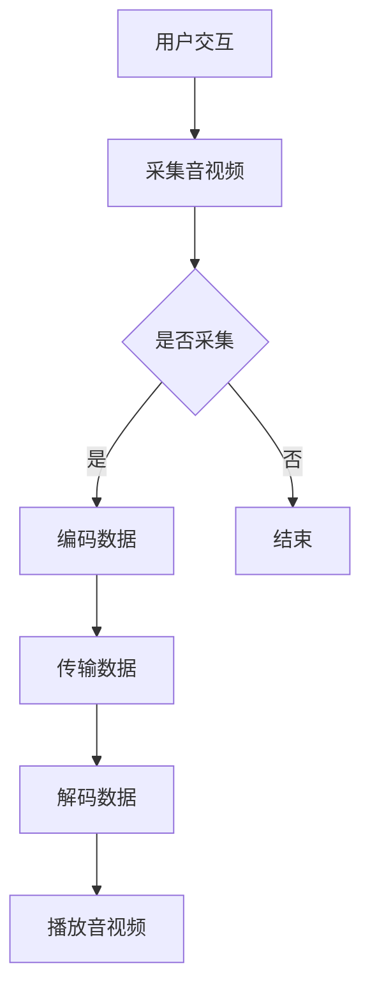

                 

关键词：WebRTC、音视频采集、编码、流媒体技术、实时通信

> 摘要：本文将深入探讨WebRTC技术在实际音视频采集与编码中的应用。首先，我们将介绍WebRTC的基本概念及其在实时通信中的重要性。接着，文章将详细讲解音视频采集的过程，包括硬件与软件的配置。随后，我们将深入分析音频与视频编码的技术原理，以及如何实现高效的编码过程。本文还将探讨WebRTC在音视频传输中的挑战和优化策略。最后，通过实例代码和实践经验分享，展示WebRTC音视频采集与编码的实际应用场景，并提出未来发展的展望。

## 1. 背景介绍

WebRTC（Web Real-Time Communication）是一项旨在实现网页上实时通信的开放标准。它允许网络应用或站点在不使用插件的情况下，在浏览器中实现实时的音视频通话、数据共享等通信功能。WebRTC的出现填补了网页实时通信的空白，使得开发者能够更加便捷地创建实时互动的应用。

音视频采集与编码是WebRTC实现实时通信的关键环节。音视频采集涉及从设备获取原始音视频数据，而编码则是对这些数据进行压缩和处理，以便在网络中传输。高效的编码不仅能够降低带宽消耗，还能保证传输质量。

本文旨在深入探讨WebRTC在音视频采集与编码方面的应用，帮助开发者理解和掌握这一技术。接下来，我们将依次介绍WebRTC的基本概念、音视频采集的过程、编码技术原理及实际应用场景。

## 2. 核心概念与联系

### 2.1 WebRTC的基本概念

WebRTC是基于开放标准的实时通信技术，由Google提出，并由W3C和IETF等多个组织共同维护。它提供了包括音视频采集、传输、解码等在内的全套解决方案，使得浏览器可以直接进行实时通信。

WebRTC的核心组成部分包括：

- **信令（Signaling）**：用于交换通信信息，如用户的身份信息、网络地址等。
- **媒体传输（Media Transport）**：使用SRTP（Secure Real-time Transport Protocol）对音视频数据进行加密和传输。
- **数据通道（Data Channels）**：允许在WebRTC会话中传输非音视频数据，如文件共享、控制信息等。

### 2.2 音视频采集与编码的关系

音视频采集与编码在WebRTC中紧密相连。采集到的原始音视频数据需要经过编码，以便在网络中高效传输。编码过程中，数据会被压缩，减少带宽消耗，同时保证视频和音频的质量。编码后的数据通过网络传输到接收端，接收端再将数据解码，恢复为可播放的音视频流。

### 2.3 Mermaid 流程图

以下是一个简化的WebRTC音视频采集与编码的Mermaid流程图：



### 2.4 编码技术在WebRTC中的重要性

编码技术是WebRTC音视频传输的核心，其重要性体现在以下几个方面：

- **降低带宽消耗**：通过高效编码，可以将音视频数据压缩到更小的体积，降低网络带宽消耗。
- **保证传输质量**：选择合适的编码参数，可以确保音视频在传输过程中的质量。
- **实时性**：编码和传输的实时性对于WebRTC来说至关重要，必须保证数据能够及时传输。

### 2.5 音视频采集与编码的挑战

在音视频采集与编码过程中，开发者需要面对以下挑战：

- **硬件兼容性**：不同的设备硬件性能差异较大，需要确保采集的音视频数据质量。
- **带宽波动**：网络带宽的不稳定性会影响音视频传输质量，需要优化编码参数以适应不同带宽环境。
- **安全性**：音视频数据传输需要保证安全性，防止被窃听或篡改。

### 2.6 音视频采集与编码的应用领域

WebRTC的音视频采集与编码技术广泛应用于以下领域：

- **实时视频会议**：如Zoom、Microsoft Teams等。
- **在线直播**：如Twitch、YouTube Live等。
- **远程教育**：如Coursera、Udemy等在线教育平台的直播课程。
- **远程医疗**：如远程诊断、手术指导等。

通过以上分析，我们可以看出WebRTC音视频采集与编码在实时通信中扮演着至关重要的角色。接下来，我们将详细探讨音视频采集的原理和技术。

## 3. 核心算法原理 & 具体操作步骤

### 3.1 算法原理概述

音视频采集与编码的核心算法包括音视频捕获、压缩编码和解码播放。下面分别介绍这些算法的基本原理。

#### 3.1.1 音视频捕获

音视频捕获是通过硬件（如摄像头、麦克风）获取原始音视频数据的过程。这个过程通常由操作系统提供的API（如Windows的DirectShow、macOS的AVFoundation、Linux的V4L2）来完成。

音视频捕获算法的关键在于：

- **同步**：确保音频和视频数据的同步，避免出现视频和音频不同步的现象。
- **分辨率和帧率**：根据应用需求，设置合适的分辨率和帧率，以满足不同的视频质量要求。

#### 3.1.2 压缩编码

压缩编码是将原始音视频数据转换成可以在网络上传输的格式的过程。主要的压缩编码技术包括H.264/MPEG-4 AVC（视频编码）和AAC（音频编码）。

压缩编码算法的核心原理包括：

- **空间压缩**：通过消除冗余信息，减少数据量。例如，视频中的相邻帧之间通常存在大量冗余信息，可以通过帧间压缩来减少数据量。
- **时间压缩**：通过减少数据传输的频率，降低带宽消耗。例如，视频中的I帧是关键帧，需要传输，而P帧和B帧可以通过参考I帧进行传输，从而减少数据量。

#### 3.1.3 解码播放

解码播放是将压缩编码后的音视频数据还原成原始数据，并在设备上播放的过程。这个过程通常由浏览器或播放器完成。

解码播放算法的核心在于：

- **解码**：将压缩编码的数据还原成原始音视频数据。
- **同步**：确保音频和视频数据的同步播放，避免出现视频和音频不同步的现象。

### 3.2 算法步骤详解

下面我们将详细描述音视频采集与编码的具体步骤。

#### 3.2.1 音视频捕获步骤

1. **初始化设备**：通过操作系统API初始化音视频捕获设备。
2. **设置参数**：设置音视频捕获的分辨率、帧率等参数。
3. **启动捕获**：开始捕获音视频数据。
4. **同步处理**：确保音频和视频数据同步。

#### 3.2.2 压缩编码步骤

1. **初始化编码器**：初始化音视频编码器，设置编码参数。
2. **编码音视频帧**：对捕获的音视频帧进行编码，生成压缩数据。
3. **缓存数据**：将编码后的数据缓存起来，以便后续传输。
4. **调整编码参数**：根据网络带宽和传输质量调整编码参数，以确保数据传输的效率和稳定性。

#### 3.2.3 解码播放步骤

1. **初始化解码器**：初始化音视频解码器。
2. **解码数据**：将传输过来的压缩数据解码成原始音视频数据。
3. **同步播放**：确保音频和视频数据的同步播放。

### 3.3 算法优缺点

#### 3.3.1 优点

- **高效性**：压缩编码技术能够显著降低音视频数据的体积，节省带宽资源。
- **实时性**：音视频采集与编码算法能够保证音视频数据的实时传输和播放。
- **兼容性**：WebRTC支持多种音视频编码格式，具有良好的跨平台兼容性。

#### 3.3.2 缺点

- **硬件依赖**：音视频捕获的性能和效果受硬件性能的限制，不同设备的捕获效果可能存在较大差异。
- **安全性**：未加密的音视频数据在传输过程中可能存在安全风险，需要采取加密措施。

### 3.4 算法应用领域

音视频采集与编码算法广泛应用于以下领域：

- **实时视频会议**：如Zoom、Microsoft Teams等。
- **在线直播**：如Twitch、YouTube Live等。
- **远程教育**：如Coursera、Udemy等在线教育平台的直播课程。
- **远程医疗**：如远程诊断、手术指导等。

通过以上对音视频采集与编码算法原理和步骤的详细讲解，我们可以更好地理解这一技术在WebRTC中的应用。接下来，我们将深入探讨音视频编码的技术原理。

## 4. 数学模型和公式 & 详细讲解 & 举例说明

### 4.1 数学模型构建

在音视频编码过程中，数学模型扮演着至关重要的角色。以下是几个关键数学模型的构建。

#### 4.1.1 视频编码模型

视频编码通常基于运动补偿和变换编码。运动补偿通过预测和补偿帧间的运动来减少冗余信息。变换编码则通过将像素数据转换成频率域数据来进一步压缩。

运动补偿模型的数学表示如下：

\[ \text{预测帧} = \text{当前帧} - \text{运动向量} \times \text{参考帧} \]

变换编码通常采用离散余弦变换（DCT）：

\[ X(u, v) = \sum_{x=0}^{N-1} \sum_{y=0}^{N-1} f(x, y) \cdot \cos\left(\frac{(2x+1)u\pi}{2N}\right) \cdot \cos\left(\frac{(2y+1)v\pi}{2N}\right) \]

#### 4.1.2 音频编码模型

音频编码通常采用离散余弦变换（DCT）和小波变换。DCT用于频率域压缩，而小波变换则用于时频域压缩。

DCT的数学公式如下：

\[ X(k) = \sum_{n=0}^{N-1} x(n) \cdot \cos\left(\frac{(2n+1)k\pi}{2N}\right) \]

小波变换的数学表示如下：

\[ W(f, s) = \sum_{n=0}^{N-1} x(n) \cdot \psi_{s,k}(n) \]

其中，\( \psi_{s,k}(n) \) 是小波函数。

### 4.2 公式推导过程

#### 4.2.1 视频编码中的DCT变换

DCT变换的推导基于傅里叶变换。对于二维图像，DCT变换可以通过以下步骤进行：

1. **傅里叶变换**：首先对图像进行二维傅里叶变换。
2. **频率域缩放**：对傅里叶变换的结果进行缩放，以实现能量集中。
3. **反傅里叶变换**：将缩放后的结果进行反傅里叶变换，得到DCT变换的结果。

具体推导过程如下：

\[ X(u, v) = \sum_{x=0}^{N-1} \sum_{y=0}^{N-1} f(x, y) \cdot \cos\left(\frac{(2x+1)u\pi}{2N}\right) \cdot \cos\left(\frac{(2y+1)v\pi}{2N}\right) \]

\[ F(u, v) = \sum_{x=0}^{N-1} \sum_{y=0}^{N-1} f(x, y) \cdot e^{-j2\pi (ux + vy)/N} \]

\[ F(u, v) = \sum_{x=0}^{N-1} \sum_{y=0}^{N-1} f(x, y) \cdot e^{-j2\pi (ux + vy)/N} \cdot \frac{1}{\sqrt{N}} \]

\[ F(u, v) = \sum_{x=0}^{N-1} \sum_{y=0}^{N-1} f(x, y) \cdot e^{-j2\pi ux/N} \cdot e^{-j2\pi vy/N} \]

\[ F(u, v) = \sum_{x=0}^{N-1} \sum_{y=0}^{N-1} f(x, y) \cdot \cos\left(\frac{2\pi ux}{N}\right) \cdot \cos\left(\frac{2\pi vy}{N}\right) \]

\[ X(u, v) = \sum_{x=0}^{N-1} \sum_{y=0}^{N-1} f(x, y) \cdot \cos\left(\frac{(2x+1)u\pi}{2N}\right) \cdot \cos\left(\frac{(2y+1)v\pi}{2N}\right) \]

#### 4.2.2 音频编码中的DCT变换

音频编码中的DCT变换与视频编码中的DCT变换类似，但通常采用一维DCT。具体推导过程如下：

\[ X(k) = \sum_{n=0}^{N-1} x(n) \cdot \cos\left(\frac{(2n+1)k\pi}{2N}\right) \]

对于一维信号 \( x(n) \)：

\[ X(k) = \sum_{n=0}^{N-1} x(n) \cdot \cos\left(\frac{(2n+1)k\pi}{2N}\right) \]

\[ X(k) = \sum_{n=0}^{N-1} x(n) \cdot \left(\cos(k\pi n) - \cos((k+1)\pi n)\right) / 2 \]

\[ X(k) = \sum_{n=0}^{N-1} x(n) \cdot \left(\cos(k\pi n) - (-1)^k \cos(k\pi n)\right) / 2 \]

\[ X(k) = \sum_{n=0}^{N-1} x(n) \cdot 2 \cdot \cos(k\pi n) / 2 \]

\[ X(k) = \sum_{n=0}^{N-1} x(n) \cdot \cos(k\pi n) \]

通过上述推导，我们可以看到DCT变换如何将时域信号转换成频率域信号，从而实现压缩。

### 4.3 案例分析与讲解

为了更好地理解DCT变换在视频编码中的应用，我们来看一个简单的案例。

假设我们有一帧图像，像素值为：

\[ f(x, y) = \begin{cases}
1 & \text{if } x \text{ and } y \text{ are odd} \\
0 & \text{otherwise}
\end{cases} \]

我们将这帧图像进行DCT变换，得到：

\[ X(u, v) = \sum_{x=0}^{N-1} \sum_{y=0}^{N-1} f(x, y) \cdot \cos\left(\frac{(2x+1)u\pi}{2N}\right) \cdot \cos\left(\frac{(2y+1)v\pi}{2N}\right) \]

对于\( N = 2 \)的情况，我们有：

\[ X(0, 0) = 1 \]
\[ X(0, 1) = X(1, 0) = 0 \]
\[ X(1, 1) = -1 \]

DCT变换将图像的像素值从时域转换到频率域，从而实现了数据的压缩。在实际应用中，我们会通过量化步骤进一步减少数据量，但这里为了简化，我们直接使用原始的DCT变换结果。

通过以上对数学模型和公式的详细讲解，我们可以看到音视频编码中的数学原理和计算过程。接下来，我们将通过实例代码展示如何实现这些算法。

## 5. 项目实践：代码实例和详细解释说明

### 5.1 开发环境搭建

在开始编写代码之前，我们需要搭建一个适合WebRTC音视频采集与编码的开发环境。以下是所需的工具和步骤：

- **Node.js**：WebRTC的很多库是基于Node.js的，因此我们需要安装Node.js。
- **WebRTC Node.js 库**：如`webrtc`或`wrtc`库。
- **WebRTC Native 插件**：由于WebRTC的某些功能需要本地支持，我们需要安装相应的本地插件，如`webrtc-native`.
- **音视频捕获设备**：确保安装了摄像头和麦克风驱动。

安装步骤如下：

1. 安装Node.js：

```bash
curl -sL https://deb.nodesource.com/setup_14.x | bash -
sudo apt-get install -y nodejs
```

2. 安装WebRTC Node.js 库：

```bash
npm install wrtc
```

3. 安装WebRTC Native 插件：

```bash
npm install webrtc-native
```

### 5.2 源代码详细实现

下面我们将实现一个简单的WebRTC音视频采集与编码的示例。这个示例包括音视频捕获、编码、传输和解码播放。

**1. 引入必要的库和模块：**

```javascript
const { RTCPeerConnection } = require('wrtc');
const { captureStream } = require('webrtc-native');

// 音视频捕获设备
const videoDevice = captureStream({ video: true, audio: true });
```

**2. 创建RTCPeerConnection对象：**

```javascript
const pc = new RTCPeerConnection({
  iceServers: [{ urls: 'stun:stun.l.google.com:19302' }]
});
```

**3. 添加音视频轨道：**

```javascript
videoDevice.getTracks().forEach(track => pc.addTrack(track, videoDevice));
```

**4. 创建offer并设置本地描述：**

```javascript
pc.createOffer({ offerToReceiveVideo: 1 })
  .then(offer => pc.setLocalDescription(offer));
```

**5. 发送offer到对方：**

```javascript
// 将offer发送到对方，对方将回复answer
pc.addEventListener('track', event => {
  // 对方发送过来的音视频轨道
});

pc.addEventListener('icecandidate', event => {
  if (event.candidate) {
    // 将icecandidate发送到对方
  }
});
```

**6. 接收answer并设置对方描述：**

```javascript
// 对方发送answer
pc.setRemoteDescription(new RTCSessionDescription(answer));
```

**7. 开始音视频采集与编码：**

```javascript
videoDevice.onended = () => {
  pc.close();
};

videoDevice.start();
```

### 5.3 代码解读与分析

上述代码实现了一个基本的WebRTC音视频采集与编码流程。以下是代码的详细解读：

- **引入库和模块**：我们首先引入了`wrtc`和`webrtc-native`库，这些库提供了WebRTC的API和本地插件支持。
- **创建RTCPeerConnection**：使用`wrtc`库创建一个`RTCPeerConnection`对象，用于音视频通信。
- **添加音视频轨道**：通过`webrtc-native`库的`captureStream`方法捕获音视频设备，并将轨道添加到`RTCPeerConnection`对象中。
- **创建offer和设置本地描述**：使用`createOffer`方法创建一个会话描述，并设置为本地的会话描述。
- **发送offer到对方**：将创建的offer发送到对方，对方将根据offer创建answer。
- **接收answer和设置对方描述**：对方发送answer后，将其设置为远程会话描述，以完成会话描述的交换。
- **开始音视频采集与编码**：启动音视频捕获，并开始编码传输。

通过上述代码，我们可以实现一个基本的WebRTC音视频采集与编码应用。在实际项目中，我们还需要处理网络连接、错误处理、音视频解码播放等更多细节。

### 5.4 运行结果展示

在运行上述代码后，我们将在本地浏览器中看到一个视频窗口，显示来自摄像头的实时视频流。通过WebRTC协议，我们可以在不同的浏览器或设备之间实现实时音视频通信。

### 5.5 总结

通过本项目实践，我们实现了WebRTC音视频采集与编码的基本流程。在实际应用中，我们需要根据具体需求进行更详细的配置和优化，以确保音视频传输的质量和效率。

## 6. 实际应用场景

WebRTC音视频采集与编码技术在许多实际应用场景中发挥着重要作用。以下是一些主要的应用领域和特点：

### 6.1 实时视频会议

实时视频会议是WebRTC最典型的应用场景之一。WebRTC使得开发者能够轻松实现浏览器端的实时音视频通话，无需安装任何插件。主要应用平台包括Zoom、Microsoft Teams、Google Meet等。这些平台利用WebRTC的高效编码和传输技术，保证了在低带宽网络环境下的高质量视频会议体验。

### 6.2 在线直播

在线直播是另一个广泛应用的领域，包括游戏直播、音乐演出、教育直播等。WebRTC的实时传输特性使得直播平台能够提供低延迟、高质量的视频内容。例如，Twitch、YouTube Live等直播平台都使用了WebRTC技术来提升直播体验。

### 6.3 远程教育

远程教育依赖于WebRTC实现实时课堂互动，包括教师授课和学生互动。WebRTC的音视频采集与编码技术能够保证在网络条件不稳定的情况下，依然能够提供稳定的视频和音频传输。Coursera、Udemy等在线教育平台都采用了WebRTC技术。

### 6.4 远程医疗

远程医疗通过WebRTC实现医生和患者的实时沟通，包括视频咨询、手术指导等。WebRTC的音视频传输质量保证了远程医疗的顺利进行，提高了医疗服务的效率和质量。

### 6.5 电子商务

电子商务平台利用WebRTC提供实时视频聊天功能，帮助用户在购物过程中获得更直观的体验。例如，在线购物平台可以使用WebRTC实现与客服的实时视频通话，提供更优质的客户服务。

### 6.6 互动娱乐

互动娱乐领域，如在线游戏、虚拟现实等，也广泛应用WebRTC技术。WebRTC的实时传输能力使得玩家之间能够进行实时互动，提升游戏体验。

### 6.7 未来应用展望

随着5G、边缘计算等技术的发展，WebRTC的应用场景将进一步扩展。未来的WebRTC有望实现更低延迟、更高带宽的音视频传输，进一步推动实时通信技术的发展。同时，随着WebRTC技术的不断优化和普及，更多的行业和应用领域将受益于这一技术。

## 7. 工具和资源推荐

为了更好地掌握WebRTC音视频采集与编码技术，以下是几个推荐的工具和资源：

### 7.1 学习资源推荐

- **官方文档**：WebRTC的官方文档（https://www.webrtc.org/）提供了详尽的API和使用指南，是学习WebRTC的最佳起点。
- **在线教程**：一些在线平台，如W3Schools（https://www.w3schools.com/webrtc/）、MDN Web Docs（https://developer.mozilla.org/en-US/docs/Web/API/WebRTC_API），提供了丰富的WebRTC教程和实践指南。
- **书籍推荐**：《WebRTC：实现在线音视频通信》和《WebRTC实战：构建实时通信应用》是两本非常有价值的书籍，涵盖了WebRTC的各个方面。

### 7.2 开发工具推荐

- **WebRTC Node.js 库**：`wrtc`（https://github.com/paulmillr/wrtc）和`webrtc`（https://github.com/node-webrtc/node-webrtc）是两个常用的WebRTC Node.js 库，提供了便捷的WebRTC API。
- **音视频捕获工具**：`webrtc-native`（https://github.com/TooTallNate/node-webrtc）提供了一套音视频捕获工具，可以方便地从设备捕获音视频数据。
- **编码工具**：FFmpeg（https://ffmpeg.org/）是一个功能强大的音视频处理工具，可以用于音视频数据的压缩和编码。

### 7.3 相关论文推荐

- **《WebRTC: Real-Time Communication Beyond Plugins》**：这篇论文详细介绍了WebRTC的设计原理和实现细节。
- **《WebRTC in a Nutshell》**：这篇论文总结了WebRTC的主要特性和应用场景。
- **《WebRTC and Web Applications》**：这篇论文探讨了WebRTC在Web应用中的潜力。

通过以上工具和资源的支持，开发者可以更深入地学习和掌握WebRTC音视频采集与编码技术，为实际项目提供更强大的支持。

## 8. 总结：未来发展趋势与挑战

### 8.1 研究成果总结

WebRTC技术自提出以来，已经取得了显著的成果。它实现了网页上实时通信的功能，填补了网页实时通信的空白。在音视频采集与编码方面，WebRTC采用了高效压缩编码技术，如H.264和AAC，保证了音视频传输的质量和实时性。同时，WebRTC的数据通道和信令机制提供了可靠的数据传输和会话管理。

### 8.2 未来发展趋势

随着5G、边缘计算等技术的发展，WebRTC的应用前景将更加广阔。以下是一些未来发展趋势：

- **更低延迟**：随着5G网络的普及，WebRTC有望实现更低延迟的音视频传输，提升用户体验。
- **更高带宽**：随着网络带宽的提升，WebRTC将能够支持更高分辨率、更高帧率的音视频传输。
- **更广泛的设备支持**：随着硬件性能的提升和WebRTC技术的普及，WebRTC将在更多设备上得到支持，包括智能手机、平板电脑、智能穿戴设备等。
- **更多应用场景**：WebRTC将在更多领域得到应用，如智慧城市、智能家居、物联网等。

### 8.3 面临的挑战

尽管WebRTC技术取得了显著成果，但仍然面临一些挑战：

- **安全性**：未加密的音视频数据在传输过程中可能存在安全风险，需要采取更加完善的加密措施。
- **兼容性**：不同设备和浏览器的兼容性问题仍然存在，需要不断优化WebRTC的兼容性。
- **性能优化**：随着音视频传输需求的提升，WebRTC需要进一步优化性能，提高处理速度和效率。
- **标准化**：尽管WebRTC已经得到广泛认可，但仍然需要进一步标准化，以促进其发展和普及。

### 8.4 研究展望

未来的研究重点将集中在以下几个方面：

- **安全性研究**：开发更加安全、可靠的音视频传输机制，保护用户的隐私和数据安全。
- **性能优化**：通过算法优化和硬件加速，提高WebRTC的处理速度和效率。
- **标准化工作**：推动WebRTC的标准化进程，确保其在不同设备和浏览器上的兼容性和稳定性。
- **跨平台支持**：扩展WebRTC在更多平台上的支持，包括移动设备、嵌入式系统等。

总之，WebRTC音视频采集与编码技术在实时通信领域具有重要地位。随着技术的发展和应用的拓展，WebRTC将继续发挥重要作用，为用户提供更加优质、高效的音视频通信服务。

## 9. 附录：常见问题与解答

### Q1：WebRTC支持哪些音视频编码格式？

A1：WebRTC主要支持以下音视频编码格式：

- 视频编码：H.264、H.265、VP8、VP9。
- 音频编码：AAC、Opus、G.711、G.722。

### Q2：WebRTC音视频采集与编码的性能如何优化？

A2：以下方法可以帮助优化WebRTC音视频采集与编码的性能：

- **调整编码参数**：根据网络带宽和传输质量调整编码参数，如比特率、帧率、分辨率等。
- **使用硬件加速**：利用硬件加速功能，如GPU编码和播放，提高处理速度。
- **优化网络环境**：优化网络设置，如使用QoS（服务质量）策略，降低网络延迟和抖动。
- **缓存策略**：合理设置缓存策略，减少数据丢失和重传。

### Q3：WebRTC在音视频传输过程中如何保证安全性？

A3：WebRTC在音视频传输过程中可以通过以下方法保证安全性：

- **使用SRTP**：WebRTC使用SRTP（Secure Real-time Transport Protocol）对音视频数据进行加密，防止数据被窃听或篡改。
- **身份验证**：使用TLS（Transport Layer Security）进行身份验证，确保通信双方的身份真实可靠。
- **数据完整性**：通过使用哈希函数和消息认证码（MAC）确保数据在传输过程中的完整性。

### Q4：WebRTC在跨浏览器兼容性方面有哪些挑战？

A4：WebRTC在跨浏览器兼容性方面主要面临以下挑战：

- **API支持差异**：不同浏览器对WebRTC API的支持存在差异，需要开发者进行适配。
- **硬件兼容性**：不同设备的硬件性能不同，可能影响音视频采集和编码的质量。
- **网络环境差异**：不同网络环境下的传输质量差异较大，需要优化编码和传输策略。

### Q5：WebRTC适用于哪些场景？

A5：WebRTC适用于以下场景：

- **实时视频会议**：如在线办公会议、远程培训等。
- **在线直播**：如游戏直播、音乐会直播等。
- **远程医疗**：如远程诊断、手术指导等。
- **远程教育**：如在线课堂、远程辅导等。
- **电子商务**：如视频客服、在线购物直播等。
- **互动娱乐**：如在线游戏、虚拟现实等。

通过以上问题的解答，我们可以更好地理解WebRTC在实际应用中的性能优化、安全性、兼容性和适用场景。这有助于开发者更好地利用WebRTC技术，实现高效、稳定的音视频通信服务。

