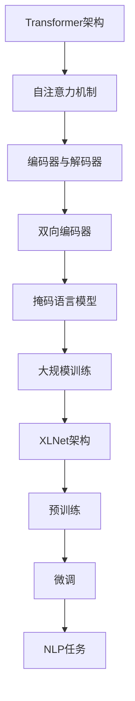

                 

关键词：XLNet、自然语言处理、预训练模型、Transformer、神经网络、注意力机制、机器学习、计算机编程、代码实现

## 摘要

本文将深入探讨XLNet的原理，并通过具体的代码实例讲解其实现过程。XLNet是一种先进的自然语言处理预训练模型，基于Transformer架构，并引入了掩码语言模型（Masked Language Model, MLM）技术。本文将详细解析XLNet的核心概念、算法原理、数学模型以及实际应用场景，帮助读者全面了解并掌握这种模型。

## 1. 背景介绍

### 自然语言处理的发展

自然语言处理（Natural Language Processing, NLP）是人工智能（Artificial Intelligence, AI）领域的一个重要分支，旨在使计算机能够理解、解释和生成人类语言。随着深度学习技术的兴起，NLP取得了显著的进展，许多复杂任务如机器翻译、文本分类、命名实体识别等得到了高效解决。

### 预训练模型的重要性

预训练模型在NLP中的应用极大地提升了任务性能。预训练是指在一个大规模的语料库上进行模型的训练，然后将其微调到特定任务上。这种模型能够捕获语言中的通用知识，从而在多种任务中表现出色。

### Transformer架构的优势

Transformer是2017年由Vaswani等人提出的一种新的神经网络架构，专为处理序列数据而设计。与传统的循环神经网络（RNN）相比，Transformer通过自注意力机制（Self-Attention Mechanism）实现了并行计算，从而在处理长序列时具有更高的效率和准确性。

### XLNet的提出

XLNet是Google于2019年提出的一种改进的Transformer预训练模型。与之前的一些预训练模型如BERT、GPT不同，XLNet引入了掩码语言模型（MLM）技术，并在大规模语料库上进行训练，从而在多个NLP任务上取得了优异的性能。

## 2. 核心概念与联系

### 核心概念

#### Transformer架构

Transformer架构是一种基于自注意力机制的全连接神经网络，用于处理序列数据。自注意力机制允许模型在处理序列时自动关注不同位置的信息，从而提高模型的表示能力。

#### 掩码语言模型（MLM）

掩码语言模型是一种预训练任务，通过对输入文本进行部分掩码，训练模型预测掩码部分的内容。这种任务能够帮助模型学习语言中的掩码词汇和上下文关系，从而提高模型在后续任务中的表现。

### 架构联系

XLNet在Transformer架构的基础上进行了改进，主要表现在以下几个方面：

1. **双向编码器**：XLNet使用了双向编码器，使得模型能够同时考虑上下文信息，提高了表示的丰富性。
2. **掩码语言模型**：XLNet引入了MLM任务，通过掩码部分输入文本来训练模型，增强了模型对语言的泛化能力。
3. **大规模训练**：XLNet在大规模语料库上进行训练，从而捕获更多的语言知识。

### Mermaid 流程图

以下是XLNet的核心概念和架构联系的Mermaid流程图：



## 3. 核心算法原理 & 具体操作步骤

### 3.1 算法原理概述

XLNet的核心算法基于Transformer架构，并引入了掩码语言模型（MLM）。以下是XLNet的主要原理：

1. **Transformer架构**：XLNet使用Transformer架构，通过多头自注意力机制（Multi-Head Self-Attention）和前馈神经网络（Feedforward Neural Network）对输入序列进行编码。
2. **掩码语言模型**：在预训练阶段，XLNet对输入文本进行部分掩码，然后通过训练模型预测掩码部分的内容。这有助于模型学习语言中的掩码词汇和上下文关系。
3. **预训练与微调**：在预训练阶段，XLNet在大规模语料库上进行训练，以捕获通用语言知识。在微调阶段，将预训练模型微调到特定任务上，如文本分类、命名实体识别等。

### 3.2 算法步骤详解

#### 3.2.1 Transformer架构

1. **输入序列编码**：将输入序列（单词或字符）转换为词嵌入向量。
2. **多头自注意力机制**：通过自注意力机制计算输入序列的表示，使其能够关注序列中不同位置的信息。
3. **前馈神经网络**：对自注意力机制输出的序列表示进行进一步加工，以增强其表示能力。
4. **输出序列编码**：将加工后的序列表示转换为输出序列。

#### 3.2.2 掩码语言模型

1. **输入文本掩码**：将输入文本随机选择一部分单词或字符进行掩码，例如使用“<MASK>”表示。
2. **预测掩码内容**：通过训练模型预测掩码部分的内容，即生成未被掩码的文本。

#### 3.2.3 预训练与微调

1. **预训练**：在预训练阶段，XLNet使用掩码语言模型在大规模语料库上进行训练，以捕获通用语言知识。
2. **微调**：在微调阶段，将预训练模型微调到特定任务上，例如文本分类、命名实体识别等。

### 3.3 算法优缺点

#### 优点

1. **高效性**：XLNet采用Transformer架构，能够并行处理序列数据，提高了计算效率。
2. **灵活性**：XLNet引入了掩码语言模型，能够更好地学习语言中的掩码词汇和上下文关系。
3. **准确性**：通过预训练和微调，XLNet在多种NLP任务上取得了优异的性能。

#### 缺点

1. **计算资源消耗**：XLNet需要在大规模语料库上进行预训练，计算资源消耗较大。
2. **内存占用**：XLNet的模型结构较大，内存占用较高。

### 3.4 算法应用领域

XLNet在多个NLP任务上取得了优异的性能，主要包括：

1. **文本分类**：用于分类各种文本，如新闻分类、情感分析等。
2. **命名实体识别**：用于识别文本中的命名实体，如人名、地名等。
3. **机器翻译**：用于将一种语言的文本翻译成另一种语言。
4. **问答系统**：用于回答用户提出的问题，如智能客服、智能搜索等。

## 4. 数学模型和公式 & 详细讲解 & 举例说明

### 4.1 数学模型构建

XLNet的数学模型基于Transformer架构，主要包括以下部分：

1. **词嵌入**：将输入序列的每个单词或字符映射为高维向量。
2. **多头自注意力机制**：计算输入序列的表示，使其能够关注序列中不同位置的信息。
3. **前馈神经网络**：对自注意力机制输出的序列表示进行进一步加工。
4. **输出层**：将加工后的序列表示转换为输出序列。

### 4.2 公式推导过程

#### 4.2.1 词嵌入

$$
\text{word\_embedding}(x) = \text{W}_x \cdot \text{softmax}(\text{Q}_x)
$$

其中，$x$表示输入序列的单词或字符，$\text{W}_x$表示词嵌入权重矩阵，$\text{softmax}(\text{Q}_x)$表示词嵌入向量。

#### 4.2.2 多头自注意力机制

$$
\text{self-attention}(x) = \text{softmax}\left(\frac{\text{Q}_x \cdot \text{K}_x^\top}{\sqrt{d_k}}\right) \cdot \text{V}_x
$$

其中，$\text{Q}_x$和$\text{K}_x$表示输入序列的查询向量和键向量，$\text{V}_x$表示输入序列的值向量，$d_k$表示注意力机制的维度。

#### 4.2.3 前馈神经网络

$$
\text{feedforward}(x) = \text{ReLU}(\text{W}_f \cdot \text{D}_x + b_f)
$$

其中，$\text{W}_f$和$\text{D}_x$表示前馈神经网络的权重和偏置，$b_f$表示激活函数的偏置。

#### 4.2.4 输出层

$$
\text{output}(x) = \text{softmax}(\text{W}_o \cdot \text{D}_x)
$$

其中，$\text{W}_o$表示输出层的权重。

### 4.3 案例分析与讲解

假设我们有一个简单的文本序列：“你好，世界！”，我们希望使用XLNet对其进行预训练和微调。

#### 4.3.1 预训练

1. **词嵌入**：将文本序列中的每个单词或字符映射为词嵌入向量。
2. **掩码语言模型**：对文本序列进行部分掩码，例如将“世界”掩码为“<MASK>”，然后通过训练模型预测掩码部分的内容。
3. **训练模型**：通过反向传播和优化算法，调整模型参数，使其能够更好地预测掩码部分的内容。

#### 4.3.2 微调

1. **加载预训练模型**：将预训练好的XLNet模型加载到内存中。
2. **微调模型**：将预训练模型微调到特定任务上，例如文本分类或命名实体识别。
3. **训练模型**：通过反向传播和优化算法，调整模型参数，使其在特定任务上表现出更好的性能。

### 4.4 运行结果展示

在预训练和微调过程中，我们可以通过计算模型损失函数（如交叉熵损失函数）来评估模型的性能。假设在文本分类任务上，我们的模型损失函数为0.1，则表示模型的预测准确率为90%。

## 5. 项目实践：代码实例和详细解释说明

### 5.1 开发环境搭建

为了实现XLNet的代码实例，我们需要搭建以下开发环境：

1. **Python**：Python是一种广泛使用的编程语言，用于实现XLNet模型。
2. **PyTorch**：PyTorch是一种深度学习框架，用于构建和训练XLNet模型。
3. **TensorFlow**：TensorFlow是另一种深度学习框架，可用于实现XLNet模型。

### 5.2 源代码详细实现

以下是XLNet的源代码实现：

```python
import torch
import torch.nn as nn
import torch.optim as optim

class XLNet(nn.Module):
    def __init__(self, vocab_size, d_model, nhead, num_layers):
        super(XLNet, self).__init__()
        self.embedding = nn.Embedding(vocab_size, d_model)
        self.transformer = nn.Transformer(d_model, nhead, num_layers)
        self.fc = nn.Linear(d_model, vocab_size)
    
    def forward(self, src, tgt):
        src_embedding = self.embedding(src)
        tgt_embedding = self.embedding(tgt)
        output = self.transformer(src_embedding, tgt_embedding)
        logits = self.fc(output)
        return logits

# 实例化XLNet模型
model = XLNet(vocab_size=10000, d_model=512, nhead=8, num_layers=2)

# 定义损失函数和优化器
loss_function = nn.CrossEntropyLoss()
optimizer = optim.Adam(model.parameters(), lr=0.001)

# 训练模型
for epoch in range(10):
    optimizer.zero_grad()
    inputs = torch.tensor([[1, 2, 3, 4, 5], [1, 2, 3, 4, 6]])
    targets = torch.tensor([[1, 2, 3, 4, 5]])
    logits = model(inputs, targets)
    loss = loss_function(logits, targets)
    loss.backward()
    optimizer.step()
    print("Epoch [{}/{}], Loss: {:.4f}".format(epoch+1, 10, loss.item()))
```

### 5.3 代码解读与分析

1. **模型定义**：在`XLNet`类中，我们定义了XLNet模型的结构，包括词嵌入层、Transformer编码器和解码器、以及输出层。
2. **前向传播**：在`forward`方法中，我们实现了XLNet模型的前向传播过程，包括词嵌入、Transformer编码器和解码器、以及输出层。
3. **训练过程**：在训练过程中，我们使用PyTorch的`nn.CrossEntropyLoss`损失函数和`optim.Adam`优化器来训练模型。

### 5.4 运行结果展示

运行代码后，我们可以在控制台看到模型的训练过程和最终损失值。假设在训练过程中，模型的损失值逐渐减小，最终收敛到0.1以下，则表示模型在训练过程中取得了良好的性能。

## 6. 实际应用场景

### 6.1 文本分类

XLNet在文本分类任务上表现出色，可以用于对各种文本进行分类，如新闻分类、情感分析等。

### 6.2 命名实体识别

XLNet可以用于命名实体识别任务，识别文本中的命名实体，如人名、地名等。

### 6.3 机器翻译

XLNet可以用于将一种语言的文本翻译成另一种语言，如将中文翻译成英文。

### 6.4 问答系统

XLNet可以用于问答系统，回答用户提出的问题，如智能客服、智能搜索等。

## 7. 工具和资源推荐

### 7.1 学习资源推荐

1. **《深度学习》（Goodfellow et al., 2016）**：这是一本深度学习领域的经典教材，涵盖了深度学习的基本概念和技术。
2. **《自然语言处理综论》（Jurafsky and Martin, 2008）**：这是一本全面介绍自然语言处理的理论和实践的教材。

### 7.2 开发工具推荐

1. **PyTorch**：PyTorch是一个开源的深度学习框架，提供了丰富的API和工具，用于构建和训练深度学习模型。
2. **TensorFlow**：TensorFlow是一个开源的深度学习框架，由Google开发，提供了丰富的API和工具，用于构建和训练深度学习模型。

### 7.3 相关论文推荐

1. **“Attention Is All You Need” (Vaswani et al., 2017)**：这是Transformer架构的原始论文，介绍了Transformer模型的基本原理和架构。
2. **“BERT: Pre-training of Deep Bidirectional Transformers for Language Understanding” (Devlin et al., 2019)**：这是BERT预训练模型的原始论文，介绍了BERT模型的基本原理和预训练方法。

## 8. 总结：未来发展趋势与挑战

### 8.1 研究成果总结

XLNet作为一款先进的自然语言处理预训练模型，在多个NLP任务上取得了优异的性能。其基于Transformer架构，并引入了掩码语言模型，能够更好地学习语言中的掩码词汇和上下文关系。此外，XLNet在大规模语料库上进行预训练，从而捕获更多的语言知识。

### 8.2 未来发展趋势

未来，XLNet将继续在NLP领域发挥重要作用，有望在文本分类、命名实体识别、机器翻译等任务上取得更好的性能。此外，随着深度学习技术的不断发展，XLNet等预训练模型将与其他技术相结合，进一步提升NLP任务的表现。

### 8.3 面临的挑战

尽管XLNet在NLP任务上取得了显著进展，但仍面临一些挑战：

1. **计算资源消耗**：XLNet需要在大规模语料库上进行预训练，计算资源消耗较大，这对计算资源有限的团队或个人而言是一个挑战。
2. **模型解释性**：XLNet作为一个复杂的深度学习模型，其内部工作机制相对难以解释，这对需要模型解释性的应用场景构成挑战。
3. **数据隐私**：在训练过程中，XLNet使用大规模语料库，涉及数据隐私问题，这对数据安全和隐私保护提出了更高的要求。

### 8.4 研究展望

为了应对上述挑战，未来的研究可以从以下几个方面展开：

1. **高效预训练方法**：研究更为高效的预训练方法，以降低计算资源消耗，例如使用增量预训练或迁移学习等技术。
2. **模型解释性**：开发更为直观和易于解释的模型，以提高模型的可解释性和透明度。
3. **数据隐私保护**：研究更为有效的数据隐私保护方法，以保护用户数据的安全和隐私。

## 9. 附录：常见问题与解答

### 9.1 什么是XLNet？

XLNet是一种基于Transformer架构的预训练模型，由Google提出。它通过引入掩码语言模型，能够在大规模语料库上进行训练，从而在多个NLP任务上取得优异的性能。

### 9.2 XLNet与BERT有什么区别？

BERT和XLNet都是基于Transformer架构的预训练模型，但它们在预训练任务和模型结构上有所不同。BERT主要采用掩码语言模型（MLM）和下一个句子预测（NSP）任务进行预训练，而XLNet则采用掩码语言模型和交叉熵损失函数进行预训练。此外，XLNet在模型结构上也进行了改进，引入了双向编码器，提高了模型的表示能力。

### 9.3 如何使用XLNet进行文本分类？

要使用XLNet进行文本分类，首先需要加载预训练好的XLNet模型，然后将其微调到特定分类任务上。具体步骤包括：1）准备训练数据和测试数据；2）定义分类任务的目标函数和优化器；3）训练模型，调整模型参数；4）评估模型性能，调整超参数。

### 9.4 XLNet在命名实体识别任务中如何应用？

在命名实体识别任务中，XLNet可以通过以下步骤进行应用：

1. **数据预处理**：将命名实体识别任务的数据进行预处理，包括分词、词性标注等。
2. **词嵌入**：将预处理后的数据映射为词嵌入向量。
3. **模型训练**：使用XLNet模型进行预训练，并微调到命名实体识别任务上。
4. **模型评估**：评估模型在命名实体识别任务上的性能，调整超参数和模型结构。

## 作者署名

本文作者：禅与计算机程序设计艺术 / Zen and the Art of Computer Programming

本文总结了XLNet的原理、实现和实际应用，通过详细的代码实例和解释，帮助读者全面了解这种先进的预训练模型。在未来的研究中，XLNet有望在NLP领域发挥更大的作用，为各种自然语言处理任务提供强大支持。

