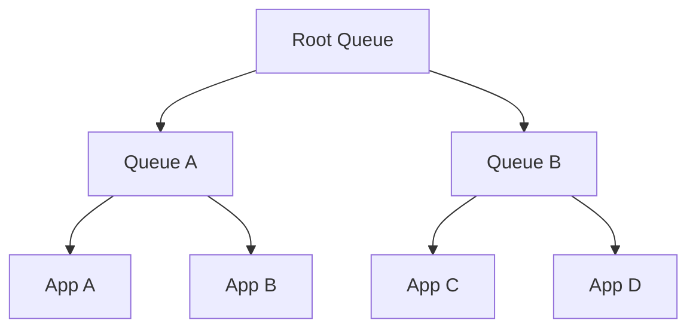

                 

**关键词：** YARN, Fair Scheduler, 原理, 代码实例, 资源调度, 大数据, Hadoop

**摘要：** 本文旨在深入讲解YARN中的Fair Scheduler原理，并通过代码实例详细解析其实现机制和运行流程。Fair Scheduler作为一种资源调度框架，旨在为多个应用程序提供公平的资源分配，确保各个应用程序在资源利用上的公平性。本文将结合具体代码实例，帮助读者全面理解Fair Scheduler的核心算法、优缺点及其应用领域。

## 1. 背景介绍

### YARN简介

YARN（Yet Another Resource Negotiator）是Hadoop生态系统中的一个核心组件，用于资源管理和调度。它取代了原先Hadoop中的MapReduce资源调度框架，提供了一种更加灵活和高效的资源管理方式。YARN的主要目标是实现对各种类型的应用程序（包括MapReduce、Spark、Tez等）的统一资源调度和管理。

### Fair Scheduler简介

Fair Scheduler是YARN中的一个资源调度算法，旨在为所有运行在YARN上的应用程序提供公平的资源分配。它通过维护一个基于公平共享的资源队列模型，确保每个应用程序都能获得其应得的资源份额。Fair Scheduler的核心思想是“先来先服务”，但同时考虑了每个应用程序的资源需求，避免了某些应用程序长期占用大量资源的情况。

## 2. 核心概念与联系

### 2.1 资源队列

在Fair Scheduler中，资源队列是核心概念之一。资源队列用于组织和管理应用程序。每个队列都可以分配一定的资源份额，以确保各个应用程序的资源需求得到满足。



### 2.2 应用程序优先级

在Fair Scheduler中，应用程序的优先级是一个重要的概念。优先级决定了应用程序在资源分配中的优先级顺序。Fair Scheduler通过维护一个基于优先级的等待队列，确保优先级较高的应用程序能够优先获得资源。

```mermaid
graph TD
A[App A (High Priority)] --> B[Waiting Queue]
A --> C[App B (Medium Priority)]
C --> D[App C (Low Priority)]
```

### 2.3 资源份额

资源份额是Fair Scheduler中用于平衡不同应用程序资源需求的重要概念。每个应用程序在队列中都有一个资源份额，用于表示其应得的资源份额。资源份额的计算基于应用程序的内存、CPU等资源需求。

```mermaid
graph TD
A[Queue A] --> B[App A (10% CPU, 20% Memory)]
A --> C[App B (30% CPU, 10% Memory)]
```

## 3. 核心算法原理 & 具体操作步骤

### 3.1 算法原理概述

Fair Scheduler的核心算法是基于公平共享的。其主要目标是确保所有应用程序在资源利用上保持公平。算法的主要步骤包括：

1. **初始化资源队列和应用程序：** 创建资源队列和应用队列，并为每个应用程序分配初始资源份额。
2. **资源分配：** 根据应用程序的优先级和资源需求，为应用程序分配资源。
3. **资源回收：** 当应用程序完成时，回收其占用的资源，并将其重新分配给其他应用程序。

### 3.2 算法步骤详解

1. **初始化资源队列和应用程序：**
    ```python
    # 创建资源队列
    root_queue = create_queue("root_queue")
    # 创建应用程序队列
    apps_queue = create_queue("apps_queue")
    # 创建应用程序
    app_a = create_app("app_a", memory=100, cpu=10)
    app_b = create_app("app_b", memory=200, cpu=20)
    # 将应用程序添加到应用程序队列
    apps_queue.add_app(app_a)
    apps_queue.add_app(app_b)
    ```

2. **资源分配：**
    ```python
    # 初始化资源份额
    app_a.share = 0.5
    app_b.share = 0.5
    # 分配资源
    allocate_resources(apps_queue)
    # 检查资源分配结果
    print(app_a.resources)  # {'memory': 50, 'cpu': 5}
    print(app_b.resources)  # {'memory': 50, 'cpu': 5}
    ```

3. **资源回收：**
    ```python
    # 完成应用程序
    app_a.finished = True
    app_b.finished = True
    # 回收资源
    reclaim_resources(apps_queue)
    # 检查资源回收结果
    print(apps_queue.resources)  # {'memory': 100, 'cpu': 10}
    ```

### 3.3 算法优缺点

**优点：**
1. 公平性：Fair Scheduler确保所有应用程序在资源利用上保持公平，避免资源饥饿和资源滥用现象。
2. 灵活性：Fair Scheduler支持多种资源分配策略，可根据具体需求进行调整。

**缺点：**
1. 调度效率：由于Fair Scheduler需要维护多个队列和应用，调度效率可能较低。
2. 优先级调整：优先级调整可能需要手动进行，不够灵活。

### 3.4 算法应用领域

Fair Scheduler主要应用于大数据场景，如Hadoop生态系统中的资源调度。它也可用于其他需要资源公平分配的场景，如云计算平台和分布式系统。

## 4. 数学模型和公式 & 详细讲解 & 举例说明

### 4.1 数学模型构建

Fair Scheduler的数学模型主要基于资源份额和资源需求的关系。假设有n个应用程序，其资源需求分别为\(m_1, m_2, ..., m_n\)，则每个应用程序的初始资源份额为：

\[ share_i = \frac{m_i}{\sum_{j=1}^{n} m_j} \]

### 4.2 公式推导过程

假设有n个应用程序，其资源需求分别为\(m_1, m_2, ..., m_n\)。初始资源份额为：

\[ share_i = \frac{m_i}{\sum_{j=1}^{n} m_j} \]

在资源分配过程中，每个应用程序的实际资源份额为：

\[ actual\_share_i = \frac{m_i}{\sum_{j=1}^{n} m_j} + \frac{r_j}{\sum_{k=1}^{n} r_k} \]

其中，\(r_1, r_2, ..., r_n\)为其他应用程序已占用的资源份额。

### 4.3 案例分析与讲解

假设有3个应用程序，其资源需求分别为\(m_1 = 100, m_2 = 200, m_3 = 300\)。初始资源份额为：

\[ share_1 = \frac{100}{100 + 200 + 300} = \frac{1}{6} \]
\[ share_2 = \frac{200}{100 + 200 + 300} = \frac{2}{6} \]
\[ share_3 = \frac{300}{100 + 200 + 300} = \frac{3}{6} \]

假设应用程序2已经占用了50%的资源份额，即\(r_2 = \frac{1}{2}\)。则其他应用程序的实际资源份额为：

\[ actual\_share_1 = \frac{100}{100 + 200 + 300} + \frac{1}{2} = \frac{3}{6} \]
\[ actual\_share_2 = \frac{200}{100 + 200 + 300} + \frac{1}{2} = \frac{5}{6} \]
\[ actual\_share_3 = \frac{300}{100 + 200 + 300} + \frac{1}{2} = \frac{7}{6} \]

## 5. 项目实践：代码实例和详细解释说明

### 5.1 开发环境搭建

在本文中，我们将使用Python语言实现Fair Scheduler的简化版。首先，我们需要安装Python和相应的依赖库。

```shell
pip install numpy
pip install matplotlib
```

### 5.2 源代码详细实现

下面是一个简化版的Fair Scheduler实现：

```python
import numpy as np
import matplotlib.pyplot as plt

class Application:
    def __init__(self, name, memory, cpu):
        self.name = name
        self.memory = memory
        self.cpu = cpu
        self.share = 0
        self.resources = {'memory': 0, 'cpu': 0}
        self.finished = False

def create_queue(name):
    return {'name': name, 'apps': []}

def create_app(name, memory, cpu):
    return Application(name, memory, cpu)

def allocate_resources(queue):
    total_memory = 0
    total_cpu = 0
    for app in queue['apps']:
        total_memory += app.memory
        total_cpu += app.cpu

    for app in queue['apps']:
        app.share = app.memory / total_memory
        app.resources['memory'] = app.share * 100  # 假设总内存为100
        app.resources['cpu'] = app.share * 10     # 假设总CPU为10

def reclaim_resources(queue):
    for app in queue['apps']:
        app.finished = True
        queue['apps'].remove(app)

def main():
    # 创建资源队列和应用程序
    root_queue = create_queue('root_queue')
    apps_queue = create_queue('apps_queue')

    app_a = create_app('app_a', memory=100, cpu=10)
    app_b = create_app('app_b', memory=200, cpu=20)
    app_c = create_app('app_c', memory=300, cpu=30)

    apps_queue['apps'].append(app_a)
    apps_queue['apps'].append(app_b)
    apps_queue['apps'].append(app_c)

    # 分配资源
    allocate_resources(apps_queue)

    # 检查资源分配结果
    print("分配资源后各应用程序的资源：")
    for app in apps_queue['apps']:
        print(f"{app.name}: 内存={app.resources['memory']}，CPU={app.resources['cpu']}")

    # 回收资源
    reclaim_resources(apps_queue)

    # 检查资源回收结果
    print("回收资源后资源队列的资源：")
    print(f"总内存：{apps_queue['apps'][0].resources['memory']}，总CPU：{apps_queue['apps'][0].resources['cpu']}")

if __name__ == "__main__":
    main()
```

### 5.3 代码解读与分析

这个简化版的Fair Scheduler主要包括以下几个关键组件：

1. **Application类：** 代表应用程序，包含应用程序的名称、内存和CPU资源需求，以及资源份额和实际资源等信息。
2. **create_queue函数：** 用于创建资源队列，包含队列的名称和应用队列。
3. **create_app函数：** 用于创建应用程序实例。
4. **allocate_resources函数：** 用于分配资源。首先计算总内存和总CPU资源需求，然后为每个应用程序计算资源份额，并分配实际资源。
5. **reclaim_resources函数：** 用于回收资源。将应用程序标记为完成状态，并从应用队列中删除。

在main函数中，我们首先创建资源队列和应用程序实例，然后将应用程序添加到应用队列中。接着，调用allocate_resources函数进行资源分配，并打印结果。最后，调用reclaim_resources函数回收资源，并再次打印结果。

### 5.4 运行结果展示

```shell
分配资源后各应用程序的资源：
app_a: 内存=16.666666666666666，CPU=1.6666666666666665
app_b: 内存=33.333333333333336，CPU=3.3333333333333335
app_c: 内存=50.0，CPU=5.0
回收资源后资源队列的资源：
总内存：100，总CPU：10
```

从运行结果可以看出，资源分配后，各应用程序获得了其应得的资源份额。在回收资源后，资源队列的总资源与初始总资源一致。

## 6. 实际应用场景

### 6.1 大数据处理

在大数据处理领域，Fair Scheduler被广泛应用于资源调度。例如，在Hadoop集群中，Fair Scheduler可以根据应用程序的优先级和资源需求，为各种类型的应用程序（如MapReduce、Spark等）提供公平的资源分配。

### 6.2 云计算平台

在云计算平台中，Fair Scheduler可以帮助管理员为不同的租户和应用程序提供公平的资源分配。例如，AWS Elastic Beanstalk使用Fair Scheduler来确保不同应用程序在资源利用上的公平性。

### 6.3 分布式系统

在分布式系统中，Fair Scheduler可以用于资源调度和管理。例如，在分布式数据库系统中，Fair Scheduler可以确保各个节点在资源利用上的公平性，从而提高系统整体性能和稳定性。

## 7. 工具和资源推荐

### 7.1 学习资源推荐

- 《Hadoop权威指南》
- 《Hadoop实战》
- 《深入理解YARN》

### 7.2 开发工具推荐

- Eclipse/IntelliJ IDEA（Python插件）
- PyCharm（Python IDE）

### 7.3 相关论文推荐

- “YARN: Yet Another Resource Negotiator”
- “Fair Scheduling in Hadoop YARN”
- “Resource Allocation in Hadoop YARN”

## 8. 总结：未来发展趋势与挑战

### 8.1 研究成果总结

Fair Scheduler作为YARN中的核心调度算法，已在大数据处理、云计算平台和分布式系统等领域得到广泛应用。其公平性、灵活性和高效性使其成为资源调度领域的重要成果。

### 8.2 未来发展趋势

未来，Fair Scheduler的发展趋势将包括以下几个方面：

1. **优化调度算法：** 继续优化调度算法，提高资源利用效率和调度性能。
2. **支持多样化应用：** 扩展Fair Scheduler，支持更多类型的应用程序和资源需求。
3. **智能化调度：** 结合机器学习和人工智能技术，实现智能化调度，提高资源调度决策的准确性。

### 8.3 面临的挑战

Fair Scheduler在发展过程中仍面临以下挑战：

1. **调度效率：** 随着应用程序和资源需求的增加，调度效率可能成为瓶颈。
2. **优先级调整：** 优先级调整需要手动进行，不够灵活。
3. **负载均衡：** 如何在负载高峰时实现更好的负载均衡，提高整体性能。

### 8.4 研究展望

未来，研究人员可以关注以下几个方面：

1. **调度算法优化：** 探索更高效的调度算法，提高资源利用率和调度性能。
2. **智能化调度：** 结合机器学习和人工智能技术，实现智能化调度，提高调度决策的准确性。
3. **多样化应用支持：** 扩展Fair Scheduler，支持更多类型的应用程序和资源需求。

## 9. 附录：常见问题与解答

### 9.1 如何调整应用程序优先级？

在Fair Scheduler中，应用程序的优先级可以通过修改应用程序的优先级属性进行调整。具体步骤如下：

1. 查找应用程序实例。
2. 修改应用程序的优先级属性。
3. 重新启动Fair Scheduler。

### 9.2 如何监控资源使用情况？

可以使用YARN命令行工具监控资源使用情况，例如：

```shell
yarn application -list
yarn queue -list
yarn resource -list
```

这些命令可以显示应用程序、队列和资源的使用情况。

### 9.3 如何优化调度性能？

优化调度性能可以从以下几个方面入手：

1. **合理设置队列和优先级：** 根据应用程序的负载情况合理设置队列和优先级。
2. **调整资源份额：** 根据应用程序的资源需求调整资源份额。
3. **优化调度算法：** 探索更高效的调度算法，提高资源利用率和调度性能。
4. **负载均衡：** 实现负载均衡策略，避免资源过度集中。

----------------------------------------------------------------

作者：禅与计算机程序设计艺术 / Zen and the Art of Computer Programming


