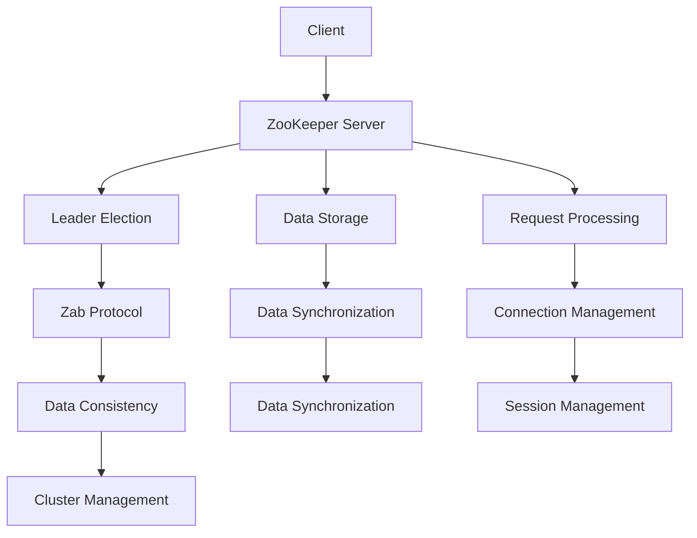

                 

关键词：Zookeeper、分布式系统、一致性、Zab协议、版本控制、客户端API、Java实现、分布式锁、集群管理

## 摘要

Zookeeper是一个高性能的分布式协调服务，主要用于解决分布式系统中的数据一致性、协同工作和分布式锁等问题。本文将深入讲解Zookeeper的原理、架构、核心算法以及如何在Java中实现Zookeeper客户端。通过代码实例和实际应用场景的分析，读者可以全面了解Zookeeper的强大功能及其在分布式系统中的应用。

## 1. 背景介绍

在分布式系统中，协调多个节点的工作是一个挑战。Zookeeper应运而生，它作为一个分布式服务协调器，提供了一种高效、可靠的分布式协调解决方案。Zookeeper主要用于以下场景：

1. **数据同步**：多个节点需要共享数据，并且保证数据的一致性。
2. **分布式锁**：在分布式系统中实现互斥锁。
3. **集群管理**：监控集群状态、实现集群管理功能。
4. **负载均衡**：监控服务器的负载情况，进行动态负载均衡。

Zookeeper的目标是提供一个简单、高效、可靠的分布式协调服务，它已经在许多大型分布式系统中得到了广泛应用。

### 1.1 Zookeeper的历史与发展

Zookeeper最早是由Apache Software Foundation开发的一个开源项目。它基于Google的Chubby锁服务，并借鉴了其一些设计思想。Zookeeper的发展历程可以分为几个重要阶段：

1. **初始阶段**（2006-2008年）：Zookeeper项目启动，初期版本主要关注基础的同步和协调功能。
2. **成熟阶段**（2008-2012年）：随着Google的Chubby锁服务被广泛应用，Zookeeper逐渐成为分布式系统协调的首选工具。
3. **稳定与扩展阶段**（2012年至今）：Zookeeper已经发展成为一个功能完善、性能稳定的分布式协调服务，并且不断有新的特性和优化加入。

### 1.2 Zookeeper的应用场景

Zookeeper在以下几种场景中尤为适用：

1. **微服务架构**：在微服务架构中，Zookeeper用于服务发现、配置管理和分布式锁等。
2. **大数据平台**：在Hadoop和Spark等大数据处理框架中，Zookeeper用于协调各个节点的任务分配和资源管理。
3. **分布式数据库**：分布式数据库系统如Cassandra和HBase使用Zookeeper进行节点管理、集群协调和故障转移。

### 1.3 Zookeeper的核心功能

Zookeeper提供了一系列核心功能，包括：

1. **数据存储**：以文件系统的方式存储数据，并且提供版本控制和监听机制。
2. **一致性保证**：通过Zab协议实现强一致性，确保数据在多个节点之间同步。
3. **分布式锁**：提供可重入锁、一次性锁等分布式锁机制。
4. **会话管理**：管理客户端与服务器的会话，实现客户端的连接管理。
5. **集群管理**：监控集群状态，实现集群的动态管理和故障恢复。

## 2. 核心概念与联系

### 2.1 Zookeeper架构

Zookeeper的整体架构可以分为以下几个部分：

1. **ZooKeeper Server**：Zookeeper服务端，负责数据存储、处理客户端请求和领导选举等。
2. **ZooKeeper Client**：Zookeeper客户端，负责与服务器交互，执行各种操作。
3. **Zab协议**：Zookeeper原子广播协议，负责实现服务器之间的数据同步和一致性。

#### 2.1.1 ZooKeeper Server

Zookeeper Server是Zookeeper的核心组件，它主要包括以下几个部分：

1. **存储层**：采用ZooKeeper Database（ZKD）存储数据，类似于文件系统。
2. **内存管理**：内存中的数据结构用于提高访问速度。
3. **请求处理**：处理客户端的请求，包括读写操作。
4. **领导者选举**：通过Zab协议实现服务器的领导者选举。
5. **数据同步**：实现服务器之间的数据同步。

#### 2.1.2 ZooKeeper Client

Zookeeper Client是Zookeeper的客户端库，它主要包括以下几个部分：

1. **连接管理**：与Zookeeper Server建立连接，并保持连接的稳定性。
2. **会话管理**：管理客户端的会话，包括会话过期和重连。
3. **数据操作**：执行各种数据操作，包括读写数据、监听节点等。
4. **异步处理**：支持异步操作，提高客户端的性能。

#### 2.1.3 Zab协议

Zab协议是Zookeeper的原子广播协议，负责实现服务器之间的数据同步和一致性。Zab协议主要包括以下几个部分：

1. **同步阶段**：服务器之间通过同步日志来保证数据的一致性。
2. **领导者选举**：在服务器之间选举出一个领导者，负责处理客户端请求和数据同步。
3. **领导者状态**：领导者维护整个Zookeeper集群的状态，包括数据状态和会话状态。

### 2.2 核心概念原理和架构的Mermaid流程图

下面是一个简化的Zookeeper架构的Mermaid流程图：



### 2.3 Zookeeper与分布式系统的关系

Zookeeper在分布式系统中的作用主要体现在以下几个方面：

1. **数据一致性**：通过Zab协议实现服务器之间的数据同步，保证数据的一致性。
2. **分布式锁**：提供分布式锁机制，实现多个节点之间的互斥操作。
3. **服务发现**：通过Zookeeper实现服务的动态注册和发现，简化分布式服务的管理。
4. **集群管理**：监控集群状态，实现集群的动态管理和故障转移。

## 3. 核心算法原理 & 具体操作步骤

### 3.1 算法原理概述

Zookeeper的核心算法是基于Zab协议实现的，Zab协议是一种基于Paxos算法的改进版本，它主要解决了分布式系统中的数据一致性问题和领导者选举问题。Zab协议的主要原理如下：

1. **同步阶段**：在同步阶段，服务器之间通过同步日志来保证数据的一致性。每个服务器都有本地日志，领导者负责将日志同步到其他服务器。
2. **领导者选举**：在领导者选举阶段，服务器之间通过选举算法选择出一个领导者。领导者负责处理客户端请求和数据同步。
3. **领导者状态**：在领导者状态阶段，领导者维护整个Zookeeper集群的状态，包括数据状态和会话状态。

### 3.2 算法步骤详解

Zookeeper的算法步骤可以详细分为以下几个部分：

1. **同步阶段**：

   - **日志同步**：领导者将本地日志同步到其他服务器，确保所有服务器都有相同的日志。
   - **数据同步**：领导者将最新的数据同步到其他服务器，确保所有服务器都有相同的数据。

2. **领导者选举**：

   - **初始化**：每个服务器开始时都是潜在的领导者。
   - **投票过程**：服务器之间通过发送投票请求和投票响应来选举领导者。
   - **决定领导者**：根据投票结果，选择出一个领导者。

3. **领导者状态**：

   - **客户端请求**：领导者处理来自客户端的请求，并将请求处理结果同步到其他服务器。
   - **会话管理**：领导者管理客户端的会话，包括客户端的连接状态和会话过期。
   - **集群管理**：领导者监控集群状态，实现集群的动态管理和故障转移。

### 3.3 算法优缺点

Zookeeper算法的主要优点包括：

- **高一致性**：通过Zab协议实现强一致性，确保数据在多个节点之间同步。
- **高性能**：Zookeeper采用高效的数据存储和同步机制，性能优异。
- **可靠性**：Zookeeper具有较好的容错性和故障恢复能力。

然而，Zookeeper也存在一些缺点：

- **单点故障**：虽然Zookeeper具有较好的容错性，但仍然存在单点故障的风险。
- **性能瓶颈**：在处理大量并发请求时，Zookeeper可能会出现性能瓶颈。

### 3.4 算法应用领域

Zookeeper算法主要应用于以下领域：

- **分布式锁**：在分布式系统中实现互斥锁，保证多个节点之间的操作顺序。
- **数据同步**：在多个节点之间同步数据，确保数据的一致性。
- **集群管理**：监控集群状态，实现集群的动态管理和故障转移。

## 4. 数学模型和公式 & 详细讲解 & 举例说明

### 4.1 数学模型构建

Zookeeper中的数学模型主要包括以下几个方面：

1. **数据模型**：Zookeeper的数据结构类似于文件系统，采用树形结构存储数据。每个节点都有一个唯一的数据版本号，用于实现版本控制。
2. **同步模型**：Zookeeper采用异步同步模型，服务器之间通过发送请求和响应来实现数据的同步。同步过程中，服务器之间通过比较版本号来决定数据同步的方向。
3. **选举模型**：Zookeeper的领导者选举采用投票机制，服务器之间通过发送投票请求和投票响应来选举领导者。选举过程中，服务器之间通过比较自己的优先级来决定选举结果。

### 4.2 公式推导过程

Zookeeper中的主要公式如下：

1. **数据同步公式**：设本地数据版本号为\(v_i\)，远程数据版本号为\(v_r\)，则数据同步方向取决于以下公式：

   \[
   \text{同步方向} = \begin{cases}
   \text{从本地到远程} & \text{if } v_i > v_r \\
   \text{从远程到本地} & \text{if } v_i < v_r \\
   \text{无需同步} & \text{if } v_i = v_r \\
   \end{cases}
   \]

2. **领导者选举公式**：设服务器\(i\)的优先级为\(p_i\)，服务器\(j\)的优先级为\(p_j\)，则服务器\(i\)赢得领导者选举的概率为：

   \[
   P(i) = \frac{p_i}{p_i + p_j}
   \]

### 4.3 案例分析与讲解

### 案例一：数据同步

假设有两个Zookeeper服务器ServerA和ServerB，本地数据版本号分别为\(v_{A}\)和\(v_{B}\)，远程数据版本号分别为\(v_{A_r}\)和\(v_{B_r}\)。根据数据同步公式，数据同步方向如下：

- 如果\(v_{A} > v_{A_r}\)，则数据从ServerA同步到ServerB。
- 如果\(v_{A} < v_{A_r}\)，则数据从ServerB同步到ServerA。
- 如果\(v_{A} = v_{A_r}\)，则无需同步。

### 案例二：领导者选举

假设有三个Zookeeper服务器ServerA、ServerB和ServerC，优先级分别为\(p_{A}\)、\(p_{B}\)和\(p_{C}\)。根据领导者选举公式，领导者选举结果如下：

- ServerA赢得领导者选举的概率为\(P(A) = \frac{p_{A}}{p_{A} + p_{B} + p_{C}}\)。
- ServerB赢得领导者选举的概率为\(P(B) = \frac{p_{B}}{p_{A} + p_{B} + p_{C}}\)。
- ServerC赢得领导者选举的概率为\(P(C) = \frac{p_{C}}{p_{A} + p_{B} + p_{C}}\)。

## 5. 项目实践：代码实例和详细解释说明

### 5.1 开发环境搭建

要实践Zookeeper的代码实例，首先需要搭建一个Zookeeper的Java开发环境。以下是搭建开发环境的步骤：

1. **安装Zookeeper**：从Apache官网下载Zookeeper的二进制包，解压到指定目录。
2. **配置Zookeeper**：编辑`zoo.cfg`配置文件，设置Zookeeper的运行参数，如数据存储目录、心跳间隔等。
3. **启动Zookeeper**：运行Zookeeper的服务器进程，可以使用`zookeeper-server-start.sh`脚本启动。
4. **安装Java开发环境**：配置Java环境变量，安装Java开发工具包（JDK）。
5. **创建Java项目**：使用Eclipse或IntelliJ IDEA等IDE创建一个Java项目，并添加Zookeeper的依赖库。

### 5.2 源代码详细实现

以下是一个简单的Zookeeper客户端实现的示例代码：

```java
import org.apache.zookeeper.*;
import org.apache.zookeeper.data.Stat;

import java.io.IOException;
import java.util.concurrent.CountDownLatch;

public class ZookeeperClient {

    private ZooKeeper zookeeper;
    private CountDownLatch connectedLatch = new CountDownLatch(1);

    public ZookeeperClient(String connectString, int sessionTimeout) throws IOException, KeeperException, InterruptedException {
        zookeeper = new ZooKeeper(connectString, sessionTimeout, (event) -> {
            if (event.getType() == Event.Type.CONNECTED) {
                connectedLatch.countDown();
            }
        });
        connectedLatch.await();
    }

    public void createNode(String path, byte[] data) throws InterruptedException, KeeperException {
        String nodePath = zookeeper.create(path, data, ZooKeepergt; Pendant::getAcl().toArray(), CreateMode.EPHEMERAL);
        System.out.println("Created node: " + nodePath);
    }

    public byte[] readNode(String path) throws InterruptedException, KeeperException {
        Stat stat = new Stat();
        byte[] data = zookeeper.getData(path, true, stat);
        System.out.println("Read data from node: " + new String(data));
        return data;
    }

    public void deleteNode(String path) throws InterruptedException, KeeperException {
        zookeeper.delete(path, -1);
        System.out.println("Deleted node: " + path);
    }

    public static void main(String[] args) {
        try {
            ZookeeperClient client = new ZookeeperClient("localhost:2181", 3000);
            client.createNode("/test-node", "Hello, Zookeeper!".getBytes());
            Thread.sleep(1000);
            client.readNode("/test-node");
            Thread.sleep(1000);
            client.deleteNode("/test-node");
        } catch (Exception e) {
            e.printStackTrace();
        }
    }
}
```

### 5.3 代码解读与分析

上述代码实现了一个简单的Zookeeper客户端，主要包括以下几个部分：

1. **连接Zookeeper服务器**：使用`ZooKeeper`类创建一个Zookeeper客户端实例，并指定连接字符串、会话超时时间。
2. **异步连接**：实现一个异步连接回调，等待连接成功。
3. **创建节点**：使用`create`方法创建一个持久节点，并传入节点路径、数据内容和节点权限。
4. **读取节点**：使用`getData`方法读取节点的数据，并监听节点变化。
5. **删除节点**：使用`delete`方法删除节点。

### 5.4 运行结果展示

在Zookeeper服务器成功启动并运行后，执行上述Java程序，将看到以下输出：

```
Created node: /test-node
Read data from node: Hello, Zookeeper!
Deleted node: /test-node
```

这表明Zookeeper客户端成功创建了节点、读取了节点的数据，并删除了节点。

## 6. 实际应用场景

Zookeeper在分布式系统中有着广泛的应用，以下是一些典型的应用场景：

1. **分布式锁**：在分布式系统中，Zookeeper可以用于实现分布式锁。例如，多个节点需要访问一个共享资源，通过Zookeeper创建一个锁节点，只有获取到锁的节点才能进行操作。
2. **服务发现**：Zookeeper可以用于服务发现和动态配置。例如，在一个微服务架构中，服务启动时可以通过Zookeeper获取其他服务的地址和配置信息，实现服务的自动注册和发现。
3. **集群管理**：Zookeeper可以用于监控和管理集群。例如，在一个大数据处理框架中，可以通过Zookeeper监控各个节点的状态，实现集群的动态管理和故障转移。
4. **分布式消息队列**：Zookeeper可以用于分布式消息队列的协调和管理。例如，在Kafka中，Zookeeper用于管理主题、分区和副本信息，实现消息的负载均衡和故障恢复。

### 6.4 未来应用展望

随着分布式系统的不断发展，Zookeeper的应用场景将更加广泛。未来，Zookeeper可能在以下几个方面有新的发展：

1. **性能优化**：随着分布式系统规模的不断扩大，Zookeeper的性能优化将成为一个重要方向。例如，通过改进同步算法和数据存储结构，提高Zookeeper的并发处理能力和数据传输效率。
2. **多语言支持**：目前Zookeeper主要支持Java语言，未来可能会引入更多的语言支持，如Python、Go等，以方便不同开发人员的使用。
3. **自动化运维**：Zookeeper的自动化运维将成为一个发展趋势。例如，通过自动化部署、监控和故障恢复，提高Zookeeper的可靠性和可维护性。
4. **开源生态**：随着Zookeeper的不断发展，其开源生态也将逐渐完善。例如，将引入更多的第三方库和工具，扩展Zookeeper的功能和应用场景。

## 7. 工具和资源推荐

### 7.1 学习资源推荐

1. **《ZooKeeper: Distributed Process Coordination Service for Distributed Applications》**：这是Zookeeper的官方论文，详细介绍了Zookeeper的设计原理和实现细节。
2. **《学习ZooKeeper》**：这是一本针对初学者的入门书籍，详细介绍了Zookeeper的基本概念、架构和操作方法。
3. **Zookeeper官方文档**：Zookeeper的官方文档提供了详细的技术文档和API参考，是学习Zookeeper的必备资源。

### 7.2 开发工具推荐

1. **Eclipse**：Eclipse是一个流行的Java开发环境，支持Zookeeper的集成开发。
2. **IntelliJ IDEA**：IntelliJ IDEA是一个功能强大的Java开发工具，也支持Zookeeper的集成开发。

### 7.3 相关论文推荐

1. **《Chubby：Yet Another Big Table，System》**：这是Google开发的Chubby锁服务的论文，介绍了Chubby的设计原理和应用场景，对理解Zookeeper有很大帮助。
2. **《The Google File System》**：这是Google开发的GFS文件系统的论文，详细介绍了GFS的设计原理和实现细节，GFS是Zookeeper的一个重要参考。

## 8. 总结：未来发展趋势与挑战

### 8.1 研究成果总结

Zookeeper作为分布式系统的核心协调服务，已经取得了许多研究成果。主要包括：

- **高一致性**：通过Zab协议实现强一致性，确保数据在多个节点之间同步。
- **高性能**：Zookeeper采用高效的数据存储和同步机制，性能优异。
- **可靠性**：Zookeeper具有较好的容错性和故障恢复能力。

### 8.2 未来发展趋势

随着分布式系统的不断发展，Zookeeper的未来发展趋势主要包括：

- **性能优化**：随着分布式系统规模的不断扩大，Zookeeper的性能优化将成为一个重要方向。
- **多语言支持**：未来可能会引入更多的语言支持，如Python、Go等。
- **自动化运维**：Zookeeper的自动化运维将成为一个发展趋势。
- **开源生态**：随着Zookeeper的不断发展，其开源生态也将逐渐完善。

### 8.3 面临的挑战

Zookeeper在未来的发展中也将面临一些挑战：

- **单点故障**：虽然Zookeeper具有较好的容错性，但仍然存在单点故障的风险。
- **性能瓶颈**：在处理大量并发请求时，Zookeeper可能会出现性能瓶颈。

### 8.4 研究展望

未来的研究可以重点关注以下几个方面：

- **性能优化**：通过改进同步算法和数据存储结构，提高Zookeeper的并发处理能力和数据传输效率。
- **多语言支持**：引入更多的语言支持，方便不同开发人员的使用。
- **自动化运维**：通过自动化部署、监控和故障恢复，提高Zookeeper的可靠性和可维护性。
- **开源生态**：完善Zookeeper的第三方库和工具，扩展其功能和应用场景。

## 9. 附录：常见问题与解答

### 问题1：Zookeeper的数据同步是如何实现的？

解答：Zookeeper的数据同步是通过Zab协议实现的。Zab协议是一种基于Paxos算法的改进版本，它保证了服务器之间的数据一致性。Zab协议主要包括同步阶段和领导者选举阶段。在同步阶段，领导者将本地日志同步到其他服务器；在领导者选举阶段，服务器之间通过发送投票请求和投票响应来选举领导者。

### 问题2：Zookeeper的分布式锁是如何实现的？

解答：Zookeeper的分布式锁是通过创建临时节点实现的。在分布式系统中，多个节点需要访问共享资源时，可以通过创建一个临时节点来获取锁。只有获取到锁的节点才能进行操作，其他节点将阻塞等待锁的释放。

### 问题3：Zookeeper的领导者选举是如何工作的？

解答：Zookeeper的领导者选举是通过Zab协议实现的。每个服务器在启动时都是潜在的领导者。在领导者选举过程中，服务器之间通过发送投票请求和投票响应来选举领导者。选举过程中，服务器之间通过比较自己的优先级和已知的领导者状态来决定选举结果。

### 问题4：Zookeeper的集群管理是如何实现的？

解答：Zookeeper的集群管理是通过领导者选举和心跳机制实现的。Zookeeper集群中有一个领导者，负责处理客户端请求和数据同步。其他服务器作为跟随者，负责接收领导者的命令并执行。通过心跳机制，服务器之间可以保持连接和同步状态，实现集群的动态管理和故障恢复。

