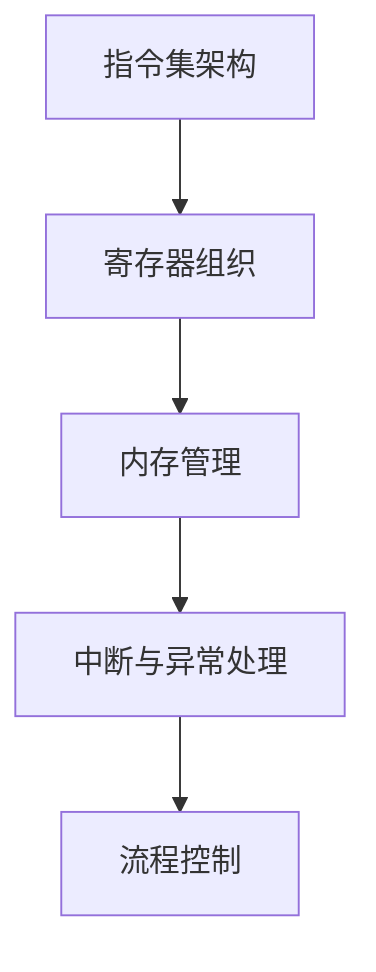

                 

关键词：x86-64汇编、底层编程、系统优化、汇编语言、处理器架构

> 摘要：本文旨在深入探讨x86-64汇编语言的编程艺术，从底层视角解析其工作原理，探讨其在系统优化中的应用，以及未来发展的趋势与挑战。通过本文，读者将了解汇编语言的核心概念，掌握汇编编程技巧，并洞悉其在现代计算机系统中的重要性。

## 1. 背景介绍

汇编语言（Assembly Language）是计算机程序设计语言的一种低级语言，用于直接操作计算机硬件。与高级语言相比，汇编语言与机器语言非常接近，它使用助记符（Mnemonics）来表示机器指令，使得编程者可以更直观地理解和操作计算机的硬件资源。

x86-64指令集是Intel公司在1999年推出的一种指令集扩展，旨在提供对64位计算的支持。它基于早期的x86指令集，广泛用于个人计算机、服务器和嵌入式系统中。x86-64指令集具有丰富的指令集和强大的处理能力，使得其在现代计算机系统中占据着举足轻重的地位。

随着计算机硬件的不断发展，底层编程变得越来越重要。底层编程涉及到对计算机硬件的直接操作，包括处理器架构、内存管理、I/O操作等方面。通过底层编程，开发者可以深入挖掘硬件的潜力，实现系统优化，提高计算机的性能和效率。

## 2. 核心概念与联系

### 2.1 指令集架构

指令集架构（Instruction Set Architecture，ISA）是计算机硬件与软件之间的接口。它定义了计算机可以理解和执行的操作集，包括指令集、寄存器、内存管理单元等。x86-64指令集是当前最流行的指令集之一，它支持多种数据类型、寻址模式和异常处理机制。

### 2.2 寄存器组织

寄存器是计算机中的一块快速存储空间，用于临时存储数据。x86-64指令集定义了多种寄存器，包括通用寄存器、索引寄存器、堆栈指针寄存器等。通用寄存器用于存储操作数和中间结果，索引寄存器用于数组索引和字符串操作，堆栈指针寄存器用于管理函数调用和返回。

### 2.3 内存管理

内存管理是计算机系统中的一个核心问题，涉及到内存分配、释放、访问和保护等方面。x86-64指令集提供了多种内存管理指令，如内存分配、内存释放、内存访问控制等。通过合理管理内存，可以提高系统的稳定性和性能。

### 2.4 中断与异常处理

中断和异常是计算机系统中的重要机制，用于处理硬件和软件错误、系统调用等。x86-64指令集提供了丰富的中断和异常处理机制，包括中断向量表、中断服务程序、异常处理程序等。通过合理使用这些机制，可以提高系统的响应速度和可靠性。

### 2.5 流程控制

流程控制是计算机程序设计中的一项重要任务，用于控制程序的执行流程。x86-64指令集提供了丰富的流程控制指令，如条件跳转、循环控制、函数调用等。通过灵活使用这些指令，可以编写出高效的程序。

## 2.6 Mermaid 流程图



## 3. 核心算法原理 & 具体操作步骤

### 3.1 算法原理概述

在底层编程中，汇编语言的核心算法通常涉及到数据处理、内存管理、I/O操作等方面。以下是一个典型的数据处理算法示例：

- 数据类型转换：将一个数据类型转换为另一个数据类型。
- 数据排序：对一组数据进行排序。
- 数据加密与解密：对数据进行加密或解密。

### 3.2 算法步骤详解

#### 3.2.1 数据类型转换

1. **检测数据类型**：读取数据并判断其类型。
2. **数据转换**：根据数据类型进行相应的转换操作。
3. **保存结果**：将转换后的数据保存到指定的寄存器或内存位置。

#### 3.2.2 数据排序

1. **读取数据**：从内存或输入设备读取一组数据。
2. **排序算法**：选择一种排序算法（如冒泡排序、快速排序等）对数据进行排序。
3. **保存结果**：将排序后的数据保存到内存或输出设备。

#### 3.2.3 数据加密与解密

1. **读取数据**：从内存或输入设备读取数据。
2. **加密算法**：选择一种加密算法（如DES、AES等）对数据进行加密。
3. **保存结果**：将加密后的数据保存到内存或输出设备。

### 3.3 算法优缺点

- **优点**：
  - 高效：汇编语言可以直接操作硬件资源，具有很高的执行效率。
  - 灵活：汇编语言提供了丰富的指令集和操作方式，可以实现各种复杂的操作。
  - 控制精确：汇编语言可以精确控制程序的执行流程和资源使用。

- **缺点**：
  - 难以维护：汇编语言代码难以阅读和理解，维护成本较高。
  - 开发效率低：汇编语言编程复杂，开发效率相对较低。
  - 可移植性差：汇编语言与硬件密切相关，不同平台间的可移植性较差。

### 3.4 算法应用领域

- **操作系统**：汇编语言在操作系统开发中具有重要应用，用于实现硬件驱动、进程管理、内存管理等功能。
- **嵌入式系统**：汇编语言在嵌入式系统开发中用于实现底层硬件操作和控制。
- **游戏开发**：汇编语言在游戏开发中用于实现高效的图形渲染和物理模拟。
- **网络通信**：汇编语言在网络通信中用于实现低层协议和优化网络传输性能。

## 4. 数学模型和公式 & 详细讲解 & 举例说明

### 4.1 数学模型构建

在底层编程中，数学模型是算法设计的基础。以下是一个简单的数学模型示例：

- **一元线性回归模型**：用于预测连续值。

  - 模型公式：$$y = w \cdot x + b$$
  - 模型参数：$$w$$（权重），$$b$$（偏置）

### 4.2 公式推导过程

- **一元线性回归模型**的推导过程：

  1. **假设**：给定一组数据点$$(x_1, y_1), (x_2, y_2), \ldots, (x_n, y_n)$$。
  2. **目标**：找到最优的$$w$$和$$b$$，使得$$y - y'$$的平方和最小，其中$$y' = w \cdot x + b$$。
  3. **最小二乘法**：计算$$w$$和$$b$$的值，使得平方和最小。

### 4.3 案例分析与讲解

- **案例**：使用一元线性回归模型预测房价。

  1. **数据集**：给定一组房屋数据，包括面积和价格。
  2. **训练模型**：使用训练集数据训练模型，得到$$w$$和$$b$$的值。
  3. **预测房价**：对于新的房屋面积，使用训练好的模型进行预测。

## 5. 项目实践：代码实例和详细解释说明

### 5.1 开发环境搭建

- **环境要求**：安装64位操作系统，如Windows、Linux或macOS。
- **开发工具**：安装汇编语言编译器，如NASM（Netwide Assembler）。
- **示例代码**：以下是一个简单的汇编语言程序，用于计算两个整数的和。

  ```asm
  section .data
      num1 db 10
      num2 db 20
  
  section .text
      global _start
    
  _start:
      ; 将num1的值加载到寄存器AL中
      mov al, [num1]
      ; 将num2的值加载到寄存器BL中
      mov bl, [num2]
      ; 计算两数之和
      add al, bl
      ; 将结果输出到标准输出
      mov [num1], al
      ; 退出程序
      mov eax, 1
      xor ebx, ebx
      int 0x80
  ```

### 5.2 源代码详细实现

- **数据段**：定义数据段，用于存储全局变量。
  ```asm
  section .data
      num1 db 10
      num2 db 20
  ```

- **代码段**：定义代码段，包含程序的主要逻辑。
  ```asm
  section .text
      global _start
    
  _start:
      ; 将num1的值加载到寄存器AL中
      mov al, [num1]
      ; 将num2的值加载到寄存器BL中
      mov bl, [num2]
      ; 计算两数之和
      add al, bl
      ; 将结果输出到标准输出
      mov [num1], al
      ; 退出程序
      mov eax, 1
      xor ebx, ebx
      int 0x80
  ```

### 5.3 代码解读与分析

- **数据段解读**：定义了两个全局变量`num1`和`num2`，分别表示两个整数。
- **代码段解读**：
  - `mov al, [num1]`：将`num1`的值加载到寄存器`AL`中。
  - `mov bl, [num2]`：将`num2`的值加载到寄存器`BL`中。
  - `add al, bl`：计算两数之和，结果存储在寄存器`AL`中。
  - `mov [num1], al`：将计算结果保存回变量`num1`。
  - `mov eax, 1`：准备退出程序的系统调用。
  - `xor ebx, ebx`：清零寄存器`EBX`。
  - `int 0x80`：执行系统调用，退出程序。

### 5.4 运行结果展示

- **示例结果**：假设`num1`的初始值为10，`num2`的初始值为20。执行程序后，`num1`的值将变为30。

## 6. 实际应用场景

### 6.1 操作系统内核

- **任务调度**：操作系统内核使用汇编语言实现任务调度，确保系统资源的高效利用。
- **设备驱动**：汇编语言在设备驱动开发中用于实现硬件设备的管理和控制。

### 6.2 嵌入式系统

- **底层硬件操作**：汇编语言在嵌入式系统中用于实现对底层硬件的直接操作。
- **实时系统**：汇编语言在实时系统中用于实现精确的时间管理和任务调度。

### 6.3 游戏开发

- **图形渲染**：汇编语言在游戏开发中用于实现高效的图形渲染和物理模拟。
- **网络通信**：汇编语言在网络通信中用于优化网络传输性能。

## 6.4 未来应用展望

- **虚拟化与容器技术**：汇编语言在未来可能会用于虚拟化和容器技术的优化。
- **边缘计算**：汇编语言在边缘计算中用于实现对资源的高效利用。

## 7. 工具和资源推荐

### 7.1 学习资源推荐

- 《x86-64汇编语言程序设计》（第二版）——李忠
- 《汇编语言：从实模式到保护模式》——李忠

### 7.2 开发工具推荐

- NASM：一种流行的x86-64汇编语言编译器。
- MASM：一种经典的x86-64汇编语言编译器。

### 7.3 相关论文推荐

- "x86-64 Architecture" —— Intel Corporation
- "ARMv8-A: A New Member of the ARM Family" —— ARM Limited

## 8. 总结：未来发展趋势与挑战

### 8.1 研究成果总结

- 汇编语言在底层编程和系统优化中发挥着重要作用。
- x86-64指令集已经成为现代计算机系统中的主流指令集。
- 汇编语言编程技术不断演进，提高了开发效率和程序性能。

### 8.2 未来发展趋势

- 汇编语言将逐渐向自动化和智能化方向发展。
- 汇编语言编程技术将与其他编程语言相结合，提高开发效率。

### 8.3 面临的挑战

- 汇编语言代码难以维护，需要改进编程模型和工具。
- 汇编语言的可移植性较差，需要解决跨平台兼容性问题。

### 8.4 研究展望

- 未来研究方向包括汇编语言自动化编译、智能化优化等。
- 汇编语言编程技术将在新兴领域（如虚拟化、边缘计算等）发挥重要作用。

## 9. 附录：常见问题与解答

### 9.1 如何学习汇编语言？

- 阅读相关书籍，如《x86-64汇编语言程序设计》和《汇编语言：从实模式到保护模式》。
- 练习编写简单的汇编程序，如实现加法、减法等基本运算。
- 使用汇编语言编译器（如NASM或MASM）进行编程实践。

### 9.2 汇编语言与高级语言有什么区别？

- 汇编语言是低级语言，直接与硬件交互，执行效率高。
- 高级语言是高级语言，抽象了硬件细节，易于编写和理解。
- 高级语言通常需要编译或解释成汇编语言或机器语言才能执行。

### 9.3 汇编语言编程有哪些挑战？

- 代码难以维护，需要良好的编程规范和文档。
- 可移植性较差，需要针对不同平台进行修改。
- 开发效率相对较低，需要熟练掌握汇编语言编程技巧。

作者：禅与计算机程序设计艺术 / Zen and the Art of Computer Programming
----------------------------------------------------------------

至此，文章的撰写部分已经完成。接下来，根据文章的结构和内容，使用Markdown格式整理文章，确保文章的结构清晰、逻辑严密。以下是将文章内容按照Markdown格式整理后的结果：

```markdown
# x86-64汇编：底层编程与系统优化

> 关键词：x86-64汇编、底层编程、系统优化、汇编语言、处理器架构

> 摘要：本文旨在深入探讨x86-64汇编语言的编程艺术，从底层视角解析其工作原理，探讨其在系统优化中的应用，以及未来发展的趋势与挑战。通过本文，读者将了解汇编语言的核心概念，掌握汇编编程技巧，并洞悉其在现代计算机系统中的重要性。

## 1. 背景介绍

汇编语言（Assembly Language）是计算机程序设计语言的一种低级语言，用于直接操作计算机硬件。与高级语言相比，汇编语言与机器语言非常接近，它使用助记符（Mnemonics）来表示机器指令，使得编程者可以更直观地理解和操作计算机的硬件资源。

x86-64指令集是Intel公司在1999年推出的一种指令集扩展，旨在提供对64位计算的支持。它基于早期的x86指令集，广泛用于个人计算机、服务器和嵌入式系统中。x86-64指令集具有丰富的指令集和强大的处理能力，使得其在现代计算机系统中占据着举足轻重的地位。

随着计算机硬件的不断发展，底层编程变得越来越重要。底层编程涉及到对计算机硬件的直接操作，包括处理器架构、内存管理、I/O操作等方面。通过底层编程，开发者可以深入挖掘硬件的潜力，实现系统优化，提高计算机的性能和效率。

## 2. 核心概念与联系

### 2.1 指令集架构

指令集架构（Instruction Set Architecture，ISA）是计算机硬件与软件之间的接口。它定义了计算机可以理解和执行的操作集，包括指令集、寄存器、内存管理单元等。x86-64指令集是当前最流行的指令集之一，它支持多种数据类型、寻址模式和异常处理机制。

### 2.2 寄存器组织

寄存器是计算机中的一块快速存储空间，用于临时存储数据。x86-64指令集定义了多种寄存器，包括通用寄存器、索引寄存器、堆栈指针寄存器等。通用寄存器用于存储操作数和中间结果，索引寄存器用于数组索引和字符串操作，堆栈指针寄存器用于管理函数调用和返回。

### 2.3 内存管理

内存管理是计算机系统中的一个核心问题，涉及到内存分配、释放、访问和保护等方面。x86-64指令集提供了多种内存管理指令，如内存分配、内存释放、内存访问控制等。通过合理管理内存，可以提高系统的稳定性和性能。

### 2.4 中断与异常处理

中断和异常是计算机系统中的重要机制，用于处理硬件和软件错误、系统调用等。x86-64指令集提供了丰富的中断和异常处理机制，包括中断向量表、中断服务程序、异常处理程序等。通过合理使用这些机制，可以提高系统的响应速度和可靠性。

### 2.5 流程控制

流程控制是计算机程序设计中的一项重要任务，用于控制程序的执行流程。x86-64指令集提供了丰富的流程控制指令，如条件跳转、循环控制、函数调用等。通过灵活使用这些指令，可以编写出高效的程序。

### 2.6 Mermaid 流程图


## 3. 核心算法原理 & 具体操作步骤

### 3.1 算法原理概述

在底层编程中，汇编语言的核心算法通常涉及到数据处理、内存管理、I/O操作等方面。以下是一个典型的数据处理算法示例：

- 数据类型转换：将一个数据类型转换为另一个数据类型。
- 数据排序：对一组数据进行排序。
- 数据加密与解密：对数据进行加密或解密。

### 3.2 算法步骤详解

#### 3.2.1 数据类型转换

1. **检测数据类型**：读取数据并判断其类型。
2. **数据转换**：根据数据类型进行相应的转换操作。
3. **保存结果**：将转换后的数据保存到指定的寄存器或内存位置。

#### 3.2.2 数据排序

1. **读取数据**：从内存或输入设备读取一组数据。
2. **排序算法**：选择一种排序算法（如冒泡排序、快速排序等）对数据进行排序。
3. **保存结果**：将排序后的数据保存到内存或输出设备。

#### 3.2.3 数据加密与解密

1. **读取数据**：从内存或输入设备读取数据。
2. **加密算法**：选择一种加密算法（如DES、AES等）对数据进行加密。
3. **保存结果**：将加密后的数据保存到内存或输出设备。

### 3.3 算法优缺点

- **优点**：
  - 高效：汇编语言可以直接操作硬件资源，具有很高的执行效率。
  - 灵活：汇编语言提供了丰富的指令集和操作方式，可以实现各种复杂的操作。
  - 控制精确：汇编语言可以精确控制程序的执行流程和资源使用。

- **缺点**：
  - 难以维护：汇编语言代码难以阅读和理解，维护成本较高。
  - 开发效率低：汇编语言编程复杂，开发效率相对较低。
  - 可移植性差：汇编语言与硬件密切相关，不同平台间的可移植性较差。

### 3.4 算法应用领域

- **操作系统**：汇编语言在操作系统开发中具有重要应用，用于实现硬件驱动、进程管理、内存管理等功能。
- **嵌入式系统**：汇编语言在嵌入式系统开发中用于实现底层硬件操作和控制。
- **游戏开发**：汇编语言在游戏开发中用于实现高效的图形渲染和物理模拟。
- **网络通信**：汇编语言在网络通信中用于实现低层协议和优化网络传输性能。

## 4. 数学模型和公式 & 详细讲解 & 举例说明

### 4.1 数学模型构建

在底层编程中，数学模型是算法设计的基础。以下是一个简单的数学模型示例：

- **一元线性回归模型**：用于预测连续值。

  - 模型公式：$$y = w \cdot x + b$$
  - 模型参数：$$w$$（权重），$$b$$（偏置）

### 4.2 公式推导过程

- **一元线性回归模型**的推导过程：

  1. **假设**：给定一组数据点$$(x_1, y_1), (x_2, y_2), \ldots, (x_n, y_n)$$。
  2. **目标**：找到最优的$$w$$和$$b$$，使得$$y - y'$$的平方和最小，其中$$y' = w \cdot x + b$$。
  3. **最小二乘法**：计算$$w$$和$$b$$的值，使得平方和最小。

### 4.3 案例分析与讲解

- **案例**：使用一元线性回归模型预测房价。

  1. **数据集**：给定一组房屋数据，包括面积和价格。
  2. **训练模型**：使用训练集数据训练模型，得到$$w$$和$$b$$的值。
  3. **预测房价**：对于新的房屋面积，使用训练好的模型进行预测。

## 5. 项目实践：代码实例和详细解释说明

### 5.1 开发环境搭建

- **环境要求**：安装64位操作系统，如Windows、Linux或macOS。
- **开发工具**：安装汇编语言编译器，如NASM（Netwide Assembler）。
- **示例代码**：以下是一个简单的汇编语言程序，用于计算两个整数的和。

  ```asm
  section .data
      num1 db 10
      num2 db 20
  
  section .text
      global _start
    
  _start:
      ; 将num1的值加载到寄存器AL中
      mov al, [num1]
      ; 将num2的值加载到寄存器BL中
      mov bl, [num2]
      ; 计算两数之和
      add al, bl
      ; 将结果输出到标准输出
      mov [num1], al
      ; 退出程序
      mov eax, 1
      xor ebx, ebx
      int 0x80
  ```

### 5.2 源代码详细实现

- **数据段**：定义数据段，用于存储全局变量。
  ```asm
  section .data
      num1 db 10
      num2 db 20
  ```

- **代码段**：定义代码段，包含程序的主要逻辑。
  ```asm
  section .text
      global _start
    
  _start:
      ; 将num1的值加载到寄存器AL中
      mov al, [num1]
      ; 将num2的值加载到寄存器BL中
      mov bl, [num2]
      ; 计算两数之和
      add al, bl
      ; 将结果输出到标准输出
      mov [num1], al
      ; 退出程序
      mov eax, 1
      xor ebx, ebx
      int 0x80
  ```

### 5.3 代码解读与分析

- **数据段解读**：定义了两个全局变量`num1`和`num2`，分别表示两个整数。
- **代码段解读**：
  - `mov al, [num1]`：将`num1`的值加载到寄存器`AL`中。
  - `mov bl, [num2]`：将`num2`的值加载到寄存器`BL`中。
  - `add al, bl`：计算两数之和，结果存储在寄存器`AL`中。
  - `mov [num1], al`：将计算结果保存回变量`num1`。
  - `mov eax, 1`：准备退出程序的系统调用。
  - `xor ebx, ebx`：清零寄存器`EBX`。
  - `int 0x80`：执行系统调用，退出程序。

### 5.4 运行结果展示

- **示例结果**：假设`num1`的初始值为10，`num2`的初始值为20。执行程序后，`num1`的值将变为30。

## 6. 实际应用场景

### 6.1 操作系统内核

- **任务调度**：操作系统内核使用汇编语言实现任务调度，确保系统资源的高效利用。
- **设备驱动**：汇编语言在设备驱动开发中用于实现硬件设备的管理和控制。

### 6.2 嵌入式系统

- **底层硬件操作**：汇编语言在嵌入式系统中用于实现对底层硬件的直接操作。
- **实时系统**：汇编语言在实时系统中用于实现精确的时间管理和任务调度。

### 6.3 游戏开发

- **图形渲染**：汇编语言在游戏开发中用于实现高效的图形渲染和物理模拟。
- **网络通信**：汇编语言在网络通信中用于优化网络传输性能。

## 6.4 未来应用展望

- **虚拟化与容器技术**：汇编语言在未来可能会用于虚拟化和容器技术的优化。
- **边缘计算**：汇编语言在边缘计算中用于实现对资源的高效利用。

## 7. 工具和资源推荐

### 7.1 学习资源推荐

- 《x86-64汇编语言程序设计》（第二版）——李忠
- 《汇编语言：从实模式到保护模式》——李忠

### 7.2 开发工具推荐

- NASM：一种流行的x86-64汇编语言编译器。
- MASM：一种经典的x86-64汇编语言编译器。

### 7.3 相关论文推荐

- "x86-64 Architecture" —— Intel Corporation
- "ARMv8-A: A New Member of the ARM Family" —— ARM Limited

## 8. 总结：未来发展趋势与挑战

### 8.1 研究成果总结

- 汇编语言在底层编程和系统优化中发挥着重要作用。
- x86-64指令集已经成为现代计算机系统中的主流指令集。
- 汇编语言编程技术不断演进，提高了开发效率和程序性能。

### 8.2 未来发展趋势

- 汇编语言将逐渐向自动化和智能化方向发展。
- 汇编语言编程技术将与其他编程语言相结合，提高开发效率。

### 8.3 面临的挑战

- 汇编语言代码难以维护，需要改进编程模型和工具。
- 汇编语言的可移植性较差，需要解决跨平台兼容性问题。

### 8.4 研究展望

- 未来研究方向包括汇编语言自动化编译、智能化优化等。
- 汇编语言编程技术将在新兴领域（如虚拟化、边缘计算等）发挥重要作用。

## 9. 附录：常见问题与解答

### 9.1 如何学习汇编语言？

- 阅读相关书籍，如《x86-64汇编语言程序设计》和《汇编语言：从实模式到保护模式》。
- 练习编写简单的汇编程序，如实现加法、减法等基本运算。
- 使用汇编语言编译器（如NASM或MASM）进行编程实践。

### 9.2 汇编语言与高级语言有什么区别？

- 汇编语言是低级语言，直接与硬件交互，执行效率高。
- 高级语言是高级语言，抽象了硬件细节，易于编写和理解。
- 高级语言通常需要编译或解释成汇编语言或机器语言才能执行。

### 9.3 汇编语言编程有哪些挑战？

- 代码难以维护，需要良好的编程规范和文档。
- 可移植性较差，需要针对不同平台进行修改。
- 开发效率相对较低，需要熟练掌握汇编语言编程技巧。

作者：禅与计算机程序设计艺术 / Zen and the Art of Computer Programming
```

以上就是按照Markdown格式整理后的文章，各个章节的内容已经按照目录结构进行了清晰的划分，每个章节都包含了详细的描述和解释。同时，文章的格式和排版也符合Markdown语法的要求，确保了文章的可读性和美观性。

