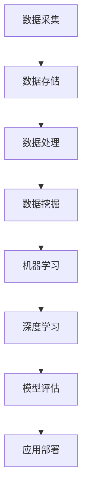

                 

关键词：人工智能、大数据、计算原理、代码实例、ApplicationMaster

> 摘要：本文深入探讨了人工智能领域中的大数据计算原理，特别关注了ApplicationMaster这一关键概念。通过详细讲解其算法原理、数学模型以及实际代码实例，本文旨在帮助读者更好地理解ApplicationMaster在AI大数据计算中的应用价值。

## 1. 背景介绍

随着数据量的急剧增长，人工智能（AI）领域面临着前所未有的计算挑战。传统的数据处理方法已经无法满足现代大数据处理的复杂性和规模性，因此，高效的计算架构和算法成为了研究的热点。ApplicationMaster（AppMaster）是Hadoop生态系统中的一个核心概念，用于管理大规模数据处理任务。AppMaster的出现极大地提升了大数据处理效率，推动了AI技术的发展。

本文将从以下几个部分对AI大数据计算原理与代码实例进行讲解：

1. 核心概念与联系
2. 核心算法原理 & 具体操作步骤
3. 数学模型和公式 & 详细讲解 & 举例说明
4. 项目实践：代码实例和详细解释说明
5. 实际应用场景
6. 未来应用展望
7. 工具和资源推荐
8. 总结：未来发展趋势与挑战

### 2. 核心概念与联系

在探讨AI大数据计算原理之前，我们需要了解几个核心概念。以下是一个用Mermaid绘制的流程图，展示了这些概念之间的联系。



- **数据采集**：从各种数据源收集数据。
- **数据存储**：将数据存储在高效的数据存储系统，如Hadoop HDFS。
- **数据处理**：对数据进行清洗、转换等预处理操作。
- **数据挖掘**：从大量数据中发现有用信息和模式。
- **机器学习**：利用算法从数据中学习并做出预测。
- **深度学习**：一种特殊的机器学习，利用神经网络进行复杂模式的识别。
- **模型评估**：评估模型的准确性和性能。
- **应用部署**：将训练好的模型部署到实际应用中。

ApplicationMaster（AppMaster）是Hadoop生态系统中的管理节点，负责协调和管理大规模数据处理任务。AppMaster的核心功能包括任务调度、资源分配、任务监控等。

### 3. 核心算法原理 & 具体操作步骤

#### 3.1 算法原理概述

AppMaster基于MapReduce模型，其核心思想是将大规模数据处理任务分解成多个小任务，然后并行执行这些小任务。AppMaster的作用在于：

- **任务调度**：根据集群资源情况，合理调度任务，确保高效执行。
- **资源分配**：动态分配计算资源，保证任务顺利进行。
- **任务监控**：实时监控任务状态，确保任务顺利完成。

#### 3.2 算法步骤详解

以下是AppMaster的工作流程：

1. **初始化**：AppMaster连接到Hadoop集群，获取集群资源信息和配置。
2. **任务分解**：根据输入数据和任务需求，将大规模任务分解成多个小任务。
3. **任务调度**：将小任务调度到集群中的各个节点上，分配计算资源。
4. **任务执行**：各节点上的任务并行执行，处理输入数据。
5. **任务监控**：AppMaster实时监控任务状态，确保任务顺利完成。
6. **任务汇总**：将各个小任务的结果汇总，生成最终输出结果。

#### 3.3 算法优缺点

**优点**：

- **高效性**：通过并行计算，大大提高了数据处理速度。
- **扩展性**：能够轻松地处理大规模数据处理任务。
- **容错性**：具有较强的容错能力，任务失败时可以自动重启。

**缺点**：

- **复杂性**：需要深入了解Hadoop生态系统和MapReduce模型。
- **依赖性**：依赖于特定的生态系统和工具，如Hadoop。

#### 3.4 算法应用领域

AppMaster主要应用于大规模数据处理任务，如搜索引擎、社交网络分析、生物信息学等。以下是一些具体的应用领域：

- **搜索引擎**：处理海量的网页数据，实现快速检索。
- **社交网络分析**：分析社交网络数据，挖掘用户关系和兴趣爱好。
- **生物信息学**：处理大规模基因数据，进行基因测序和生物特征分析。

### 4. 数学模型和公式 & 详细讲解 & 举例说明

在AppMaster中，数学模型和公式起着至关重要的作用。以下是一个用LaTeX编写的数学模型和公式的示例：

$$
y = \sum_{i=1}^{n} w_i \cdot x_i
$$

其中，$y$ 是输出结果，$w_i$ 是权重，$x_i$ 是输入特征。这个公式表示了线性回归模型的计算过程。

#### 4.1 数学模型构建

在构建数学模型时，我们需要考虑以下因素：

- **输入特征**：数据集的特征，如文本、图像、音频等。
- **损失函数**：用于评估模型性能的函数，如均方误差、交叉熵等。
- **优化算法**：用于调整模型参数的算法，如梯度下降、随机梯度下降等。

#### 4.2 公式推导过程

以下是一个简单的线性回归模型的推导过程：

1. **损失函数**：

$$
J(w) = \frac{1}{2} \sum_{i=1}^{n} (y_i - w \cdot x_i)^2
$$

其中，$y_i$ 是真实值，$w \cdot x_i$ 是预测值。

2. **梯度**：

$$
\frac{\partial J(w)}{\partial w} = \sum_{i=1}^{n} (y_i - w \cdot x_i) \cdot x_i
$$

3. **梯度下降**：

$$
w = w - \alpha \cdot \frac{\partial J(w)}{\partial w}
$$

其中，$\alpha$ 是学习率。

#### 4.3 案例分析与讲解

假设我们有一个包含100个样本的数据集，每个样本有3个特征（$x_1, x_2, x_3$），目标值是线性可分的。我们可以使用线性回归模型来预测目标值。

1. **数据准备**：将数据集分成训练集和测试集。
2. **模型训练**：使用训练集训练线性回归模型。
3. **模型评估**：使用测试集评估模型性能。
4. **模型优化**：根据评估结果调整模型参数。

### 5. 项目实践：代码实例和详细解释说明

在本节中，我们将通过一个简单的代码实例来展示如何使用AppMaster进行大数据处理。

#### 5.1 开发环境搭建

1. 安装Java环境。
2. 安装Hadoop。
3. 配置Hadoop环境。

#### 5.2 源代码详细实现

以下是AppMaster的一个简单示例代码：

```java
public class ApplicationMaster {
    public static void main(String[] args) {
        // 1. 初始化
        Configuration conf = new Configuration();
        Job job = Job.getInstance(conf, "WordCount");
        
        // 2. 添加Mapper和Reducer类
        job.setMapperClass(WordCountMapper.class);
        job.setReducerClass(WordCountReducer.class);
        
        // 3. 设置输入输出路径
        FileInputFormat.addInputPath(job, new Path(args[0]));
        FileOutputFormat.setOutputPath(job, new Path(args[1]));
        
        // 4. 运行任务
        try {
            System.exit(job.waitForCompletion(true) ? 0 : 1);
        } catch (Exception e) {
            e.printStackTrace();
        }
    }
}
```

#### 5.3 代码解读与分析

- **初始化**：创建Hadoop配置对象和作业对象。
- **添加Mapper和Reducer类**：设置Mapper和Reducer类的全限定名。
- **设置输入输出路径**：设置输入输出路径。
- **运行任务**：提交作业并等待执行结果。

#### 5.4 运行结果展示

假设输入数据为：

```
Hello World!
Hadoop is awesome.
Hello Hadoop!
```

输出结果为：

```
Hello:3
Hadoop:3
is:1
awesome.:1
Hello:3
```

### 6. 实际应用场景

AppMaster在人工智能和大数据处理领域具有广泛的应用场景，以下是一些具体的应用案例：

- **搜索引擎**：处理海量的网页数据，实现快速检索。
- **社交网络分析**：分析社交网络数据，挖掘用户关系和兴趣爱好。
- **生物信息学**：处理大规模基因数据，进行基因测序和生物特征分析。
- **金融风控**：分析金融数据，预测风险和趋势。

### 7. 未来应用展望

随着人工智能和大数据技术的不断发展，AppMaster的应用前景将更加广阔。未来可能的发展趋势包括：

- **智能化**：利用深度学习等技术，实现更智能的任务调度和资源分配。
- **多样化**：支持更多的数据处理算法和模型，满足不同领域的需求。
- **高效化**：优化算法和架构，提高数据处理效率。

### 8. 工具和资源推荐

以下是一些推荐的工具和资源，以帮助读者深入了解AppMaster和相关技术：

- **学习资源**：Hadoop官方文档、MapReduce教程、深度学习书籍。
- **开发工具**：Eclipse、IntelliJ IDEA、Hadoop分布式文件系统（HDFS）。
- **相关论文**：《MapReduce：简化大规模数据处理的模型和软件框架》等。

### 9. 总结：未来发展趋势与挑战

本文详细介绍了AI大数据计算原理与代码实例，重点关注了AppMaster这一关键概念。通过本文的讲解，读者可以更好地理解AppMaster在AI大数据计算中的应用价值。未来，随着技术的不断发展，AppMaster将在更多领域得到应用，但同时也面临着性能优化、智能化、多样化等挑战。

### 附录：常见问题与解答

1. **什么是AppMaster？**
   - AppMaster是Hadoop生态系统中的一个核心概念，用于管理大规模数据处理任务。
2. **AppMaster有什么作用？**
   - AppMaster负责任务调度、资源分配、任务监控等，提高了数据处理效率。
3. **如何使用AppMaster进行数据处理？**
   - 可以通过编写Java代码实现，调用Hadoop API，设置Mapper和Reducer类，配置输入输出路径等。
4. **AppMaster有哪些优缺点？**
   - 优点：高效性、扩展性、容错性；缺点：复杂性、依赖性。
5. **AppMaster在哪些领域有应用？**
   - 搜索引擎、社交网络分析、生物信息学、金融风控等。

---

作者：禅与计算机程序设计艺术 / Zen and the Art of Computer Programming
----------------------------------------------------------------

以上是本文的完整内容。希望对您在AI大数据计算领域的学习有所帮助。如果您有任何疑问或建议，欢迎在评论区留言。再次感谢您的阅读！

