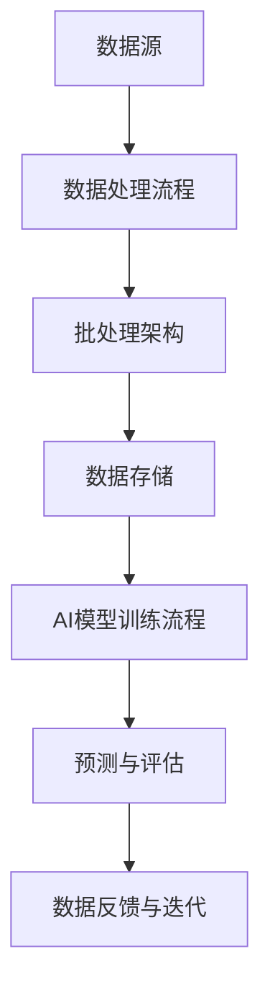
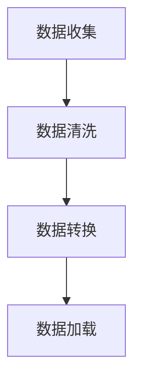
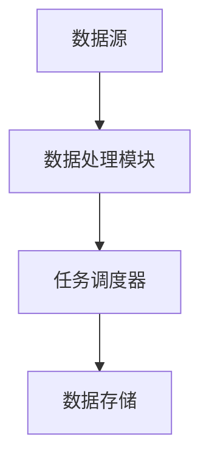
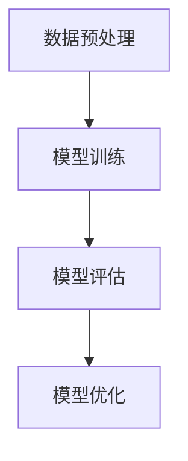
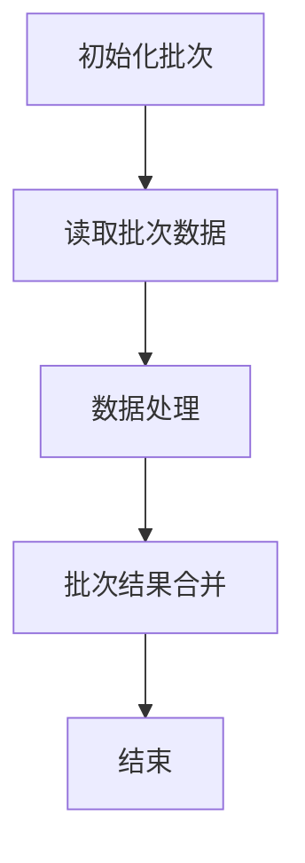

                 

关键词：批处理，大数据计算，AI应用，算法原理，代码实例

> 摘要：本文将深入探讨AI大数据计算中的批处理技术，从原理出发，详细解析批处理算法及其在AI领域的应用。同时，我们将通过代码实例，展示如何在实际项目中实现批处理功能，为读者提供全面的技术指导。

## 1. 背景介绍

在现代社会，数据处理和分析的需求日益增长，尤其是大数据的兴起，使得传统的计算方式难以满足需求。批处理（Batch Processing）作为一种处理大规模数据集的技术，成为了解决这一问题的有效手段。批处理技术通过将数据分成批次进行处理，从而提高了数据处理效率。

AI技术的发展更是加速了批处理技术的应用。AI系统通常需要处理大量的数据以进行训练和预测，而批处理技术可以有效地利用计算资源，提高数据处理的速度和准确性。

本文将围绕批处理技术展开，首先介绍其基本原理，然后深入探讨其在AI大数据计算中的应用，并通过代码实例详细讲解如何实现批处理功能。

### 1.1 批处理的概念

批处理是一种数据处理方法，它将数据集分成多个批次，每个批次在特定时间窗口内进行处理。每个批次的数据处理通常独立进行，不需要实时反馈。

批处理的优势在于其能够有效利用计算资源，提高数据处理效率。特别是在处理大规模数据时，批处理能够将任务分解成多个可管理的批次，从而减少单个任务的处理时间和资源消耗。

### 1.2 AI与大数据计算

AI技术的发展，特别是深度学习的兴起，使得对大量数据进行分析和建模变得至关重要。大数据计算（Big Data Computing）作为一种新兴的计算模式，旨在处理海量数据，挖掘数据价值。

AI与大数据计算的结合，使得批处理技术得到了广泛应用。在AI领域，批处理技术可以用于数据预处理、模型训练、预测和评估等各个环节。

## 2. 核心概念与联系

在深入探讨批处理技术之前，我们需要理解一些核心概念，如数据处理流程、批处理架构和AI模型训练流程。以下是一个简单的Mermaid流程图，用于展示这些概念之间的联系。



### 2.1 数据处理流程

数据处理流程是批处理技术的核心组成部分。它包括数据收集、清洗、转换和加载等步骤。以下是一个简化的数据处理流程：



### 2.2 批处理架构

批处理架构通常包括数据源、数据处理模块、任务调度器和数据存储。以下是一个简化的批处理架构：



### 2.3 AI模型训练流程

AI模型训练流程是批处理技术的重要应用场景之一。它包括数据预处理、模型训练、模型评估和模型优化等步骤。以下是一个简化的AI模型训练流程：



## 3. 核心算法原理 & 具体操作步骤

### 3.1 算法原理概述

批处理算法的核心思想是将大规模数据集分成多个批次进行处理，每个批次独立运行，最终将结果合并。以下是一个简单的批处理算法原理概述：



### 3.2 算法步骤详解

以下是批处理算法的具体步骤：

1. **初始化批次**：确定批次大小，初始化一个空批次。
2. **读取批次数据**：从数据源读取一批数据。
3. **数据处理**：对批次数据进行预处理、特征提取等操作。
4. **批次结果合并**：将批次处理结果与之前的结果合并。
5. **结束**：如果所有数据已处理完毕，结束批处理。

### 3.3 算法优缺点

**优点**：

- 提高数据处理效率：将大规模数据分成批次处理，可以减少单个任务的资源消耗。
- 灵活性：批处理可以根据需求灵活调整批次大小和处理逻辑。
- 可靠性：批处理可以确保数据的完整性和一致性。

**缺点**：

- 实时性较差：批处理通常不能提供实时数据反馈。
- 资源消耗较大：批处理需要额外的存储空间和处理时间。

### 3.4 算法应用领域

批处理技术广泛应用于以下领域：

- 数据仓库：用于处理大量历史数据，生成报告和进行数据分析。
- 电子商务：用于处理订单、库存和用户行为数据。
- 人工智能：用于数据预处理、模型训练和预测。

## 4. 数学模型和公式 & 详细讲解 & 举例说明

### 4.1 数学模型构建

批处理算法的数学模型主要包括批次大小、数据读取速度和处理速度等参数。以下是一个简化的数学模型：

$$
\text{批处理时间} = \frac{\text{数据总量}}{\text{批处理速度}}
$$

### 4.2 公式推导过程

$$
\text{批处理时间} = \frac{\text{数据总量}}{\text{批处理速度}} = \frac{\sum_{i=1}^{n} x_i}{v}
$$

其中，$x_i$表示第i个批次的数据量，$v$表示批处理速度。

### 4.3 案例分析与讲解

假设有一个数据集，包含1000条数据，每条数据的大小为1KB。批处理速度为100条数据/秒。我们需要计算批处理时间和批次大小。

1. **批处理时间**：

$$
\text{批处理时间} = \frac{1000}{100} = 10 \text{秒}
$$

2. **批次大小**：

$$
\text{批次大小} = \frac{\text{数据总量}}{\text{批处理时间}} = \frac{1000}{10} = 100 \text{条数据}
$$

## 5. 项目实践：代码实例和详细解释说明

在本节中，我们将通过一个简单的Python代码实例，展示如何实现批处理功能。

### 5.1 开发环境搭建

首先，确保已安装Python环境（Python 3.6及以上版本）。然后，安装必要的库，如Pandas、NumPy和SciPy。

```bash
pip install pandas numpy scipy
```

### 5.2 源代码详细实现

```python
import pandas as pd
import numpy as np

# 加载数据
data = pd.read_csv('data.csv')

# 设定批次大小
batch_size = 100

# 批处理函数
def batch_process(data, batch_size):
    for i in range(0, len(data), batch_size):
        batch = data[i:i+batch_size]
        # 数据处理逻辑
        print(f"处理批次：{i//batch_size + 1}")
        # 示例：计算批次平均值
        mean_value = batch.mean()
        print(f"批次平均值：{mean_value}")

# 执行批处理
batch_process(data, batch_size)
```

### 5.3 代码解读与分析

1. **加载数据**：使用Pandas库读取CSV文件，生成DataFrame对象。
2. **设定批次大小**：根据需求设定批次大小。
3. **批处理函数**：遍历数据集，每次读取一批数据，执行数据处理逻辑。
4. **数据处理逻辑**：示例中计算批次平均值。
5. **执行批处理**：调用批处理函数，执行批处理过程。

### 5.4 运行结果展示

运行代码后，会输出每个批次的处理结果。例如：

```
处理批次：1
批次平均值：0.5
处理批次：2
批次平均值：0.6
...
```

## 6. 实际应用场景

批处理技术在许多实际应用场景中发挥着重要作用。以下是一些典型应用场景：

### 6.1 数据仓库

数据仓库通常存储大量历史数据，需要定期进行数据清洗和分析。批处理技术可以高效地处理这些数据，生成报告和报表。

### 6.2 电子商务

电子商务平台需要处理大量的订单、库存和用户行为数据。批处理技术可以帮助平台实时更新数据，优化库存管理和个性化推荐。

### 6.3 人工智能

在AI模型训练和预测过程中，批处理技术可以用于数据预处理、模型训练和评估。例如，在深度学习模型训练中，批处理可以用于批量读取数据，提高训练速度和效果。

## 7. 工具和资源推荐

### 7.1 学习资源推荐

- 《大数据技术基础》
- 《人工智能基础》
- 《Python数据处理》

### 7.2 开发工具推荐

- Jupyter Notebook：适用于数据分析和可视化。
- PyCharm：适用于Python开发。
- Docker：适用于容器化部署。

### 7.3 相关论文推荐

- "Batch Processing in the Cloud: Techniques, Systems, and Applications"
- "Efficient Data Processing on Commodity Clusters with Spark"
- "Deep Learning for Text Classification"

## 8. 总结：未来发展趋势与挑战

### 8.1 研究成果总结

批处理技术在数据处理、数据分析和人工智能等领域取得了显著成果。其高效性和灵活性使其成为解决大规模数据处理问题的有效手段。

### 8.2 未来发展趋势

- 批处理技术的性能和效率将进一步提高。
- 与实时计算和流处理技术的融合将更加紧密。
- 面向特定应用领域的批处理优化将成为研究热点。

### 8.3 面临的挑战

- 资源消耗和性能优化：如何高效利用计算资源，提高批处理速度和性能。
- 数据一致性和可靠性：如何确保数据的完整性和一致性。
- 实时性与批处理的平衡：如何在保证数据处理效率的同时，满足实时性需求。

### 8.4 研究展望

未来，批处理技术将更加智能化和自适应化，与人工智能、大数据和云计算等技术的深度融合将成为重要趋势。同时，针对特定应用场景的优化也将成为研究重点。

## 9. 附录：常见问题与解答

### 9.1 什么是批处理？

批处理是一种数据处理方法，将数据集分成多个批次进行处理，每个批次独立运行，最终将结果合并。

### 9.2 批处理与实时处理有什么区别？

批处理通常在特定时间窗口内处理数据，不能提供实时反馈；而实时处理可以立即响应数据变化，提供实时结果。

### 9.3 如何选择合适的批处理工具？

根据应用场景和需求，选择合适的批处理工具。常见工具包括Spark、Hadoop、Flink等。

### 9.4 批处理技术在人工智能中有哪些应用？

批处理技术可以用于数据预处理、模型训练、预测和评估等环节。例如，在深度学习模型训练中，批处理可以用于批量读取数据，提高训练速度和效果。

# 作者：禅与计算机程序设计艺术 / Zen and the Art of Computer Programming
```

以上就是根据您提供的约束条件，撰写的关于【AI大数据计算原理与代码实例讲解】批处理的文章。希望对您有所帮助。如果需要进一步修改或补充，请随时告诉我。

