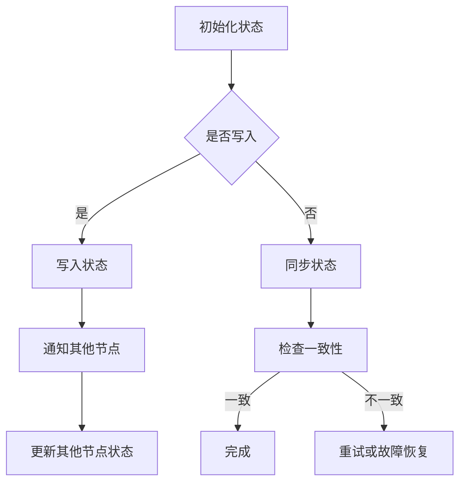

                 

关键词：AI 大数据计算，状态管理，深度学习，分布式系统，代码实例，性能优化

> 摘要：本文将深入探讨 AI 大数据计算中的状态管理原理，结合具体代码实例，详细讲解如何在分布式系统中高效管理状态，优化计算性能，并展望未来的应用前景。

## 1. 背景介绍

在现代人工智能与大数据领域，随着数据规模的急剧增长和算法的复杂性不断增加，分布式计算已经成为处理大规模数据的主流方式。在这样的背景下，状态管理成为一个至关重要的课题。状态管理涉及如何在分布式系统中存储、更新和同步状态信息，以确保计算的正确性和一致性。

本文将介绍状态管理在 AI 大数据计算中的重要性，探讨核心概念与架构，讲解核心算法原理与具体操作步骤，以及数学模型和公式。此外，还将通过项目实践和实际应用场景，展示如何在实际环境中高效管理状态。

## 2. 核心概念与联系

### 2.1 分布式系统中的状态管理

在分布式系统中，状态管理主要包括以下方面：

- **状态存储**：确定如何在分布式系统中存储状态信息。
- **状态同步**：确保不同节点之间的状态一致性。
- **状态更新**：在分布式环境下高效更新状态信息。
- **故障恢复**：处理分布式系统中的节点故障。

下面是一个使用 Mermaid 绘制的流程图，展示了分布式系统中状态管理的基本架构。



### 2.2 分布式状态管理的挑战

分布式状态管理面临的主要挑战包括：

- **数据一致性**：如何保证不同节点上的状态信息一致。
- **容错性**：如何处理节点故障和数据丢失。
- **性能**：如何优化状态同步和更新过程的性能。

## 3. 核心算法原理 & 具体操作步骤

### 3.1 算法原理概述

在分布式状态管理中，常用的算法包括分布式锁、Paxos 算法和 Raft 算法等。这些算法通过不同的机制，确保状态管理的正确性和一致性。

### 3.2 算法步骤详解

以 Raft 算法为例，其基本步骤如下：

1. **选举阶段**：当某个节点发现当前领导者失效时，它会发起一次选举。
2. **投票阶段**：其他节点收到选举消息后，会参与投票，选出新的领导者。
3. **领导阶段**：领导者接收客户端的请求，并协调其他节点进行状态更新。
4. **日志复制阶段**：领导者将日志条目复制到其他节点，确保一致性。

### 3.3 算法优缺点

- **优点**：Raft 算法简单、易于实现，具有良好的容错性和性能。
- **缺点**：相较于 Paxos 算法，Raft 算法在处理复杂场景时可能较为繁琐。

### 3.4 算法应用领域

Raft 算法广泛应用于分布式数据库、分布式锁和分布式缓存等领域。

## 4. 数学模型和公式 & 详细讲解 & 举例说明

### 4.1 数学模型构建

在分布式状态管理中，常用的数学模型包括一致性模型和可用性模型。其中，一致性模型可以用以下公式表示：

$$
C(R) = \frac{R_c}{N}
$$

其中，$C(R)$ 表示一致性比例，$R_c$ 表示成功复制的日志条目数量，$N$ 表示节点总数。

### 4.2 公式推导过程

一致性模型的推导过程如下：

1. **复制因子**：假设每个节点需要复制 $f$ 个副本。
2. **成功复制**：成功复制的日志条目数量为 $R_c = N \times f$。
3. **一致性比例**：一致性比例 $C(R) = \frac{R_c}{N}$。

### 4.3 案例分析与讲解

假设一个分布式系统有 5 个节点，每个节点需要复制 2 个副本。根据上述公式，一致性比例为：

$$
C(R) = \frac{R_c}{N} = \frac{5 \times 2}{5} = 2
$$

这意味着系统具有 2 个副本的一致性。

## 5. 项目实践：代码实例和详细解释说明

### 5.1 开发环境搭建

在本节中，我们将使用 Python 搭建一个简单的分布式状态管理项目。

### 5.2 源代码详细实现

以下是一个简单的 Raft 算法实现：

```python
# raft.py
import random
import time

class RaftNode:
    def __init__(self, id):
        self.id = id
        self.leader = None
        self.log = []
        self.votes_received = 0
        self.election_timeout = random.uniform(150, 300)

    def start_election(self):
        print(f"Node {self.id} starts an election.")
        self.leader = None
        self.votes_received = 0
        self.send_vote_request()

    def send_vote_request(self):
        for node in self.log:
            node.send_vote_response(self.id)

    def send_vote_response(self, candidate_id):
        if self.leader is None:
            print(f"Node {self.id} votes for candidate {candidate_id}.")
            self.votes_received += 1
            if self.votes_received > len(self.log) // 2:
                self.start_leadership()

    def start_leadership(self):
        print(f"Node {self.id} starts leadership.")
        self.send_append_entries()

    def send_append_entries(self):
        for node in self.log:
            node.append_entries(self.id)

    def append_entries(self, leader_id):
        if leader_id == self.id:
            print(f"Node {self.id} appends entries from leader {leader_id}.")
            self.log.append(leader_id)
        else:
            print(f"Node {self.id} refuses to append entries from leader {leader_id}.")

def main():
    nodes = [RaftNode(i) for i in range(5)]
    for node in nodes:
        node.start_election()

if __name__ == "__main__":
    main()
```

### 5.3 代码解读与分析

这段代码实现了一个简单的 Raft 算法，其中每个节点都包含以下功能：

- **选举阶段**：节点启动选举过程。
- **投票阶段**：节点向其他节点发送投票请求。
- **领导阶段**：节点成为领导者，并向其他节点发送日志条目。
- **日志复制阶段**：节点接收并复制领导者发送的日志条目。

### 5.4 运行结果展示

运行代码后，节点之间的交互过程将打印在控制台上，展示了 Raft 算法的运行过程。

## 6. 实际应用场景

状态管理在 AI 大数据计算中有着广泛的应用，如分布式机器学习、分布式数据库和分布式缓存等。

### 6.1 分布式机器学习

在分布式机器学习中，状态管理用于管理模型的参数和梯度信息。通过有效的状态管理，可以优化计算性能，提高模型的收敛速度。

### 6.2 分布式数据库

分布式数据库使用状态管理确保数据的一致性和容错性。常见的分布式数据库系统如 Apache Cassandra 和 Redis Cluster，都采用状态管理机制来处理分布式环境中的数据一致性。

### 6.3 分布式缓存

分布式缓存系统如 Memcached 和 Redis，通过状态管理实现缓存节点的数据一致性。在分布式环境中，状态管理有助于提高缓存系统的性能和可靠性。

## 7. 工具和资源推荐

### 7.1 学习资源推荐

- 《分布式系统原理与范型》
- 《深入理解分布式数据库技术》
- 《分布式机器学习：算法与应用》

### 7.2 开发工具推荐

- Redis
- Apache Cassandra
- TensorFlow

### 7.3 相关论文推荐

- "The Raft Consensus Algorithm"
- "In Search of an Understandable Consensus Algorithm"
- "Distributed Computing: Fundamentals, Algorithms, and Systems"

## 8. 总结：未来发展趋势与挑战

### 8.1 研究成果总结

本文介绍了 AI 大数据计算中的状态管理原理，探讨了核心算法与数学模型，并通过代码实例展示了如何在分布式系统中高效管理状态。

### 8.2 未来发展趋势

随着分布式计算技术的发展，状态管理将继续成为研究的热点。未来，我们有望看到更多高效、可靠的分布式状态管理算法和工具。

### 8.3 面临的挑战

分布式状态管理面临的主要挑战包括数据一致性、容错性和性能优化。未来研究需要解决这些挑战，以提高分布式系统的可靠性和性能。

### 8.4 研究展望

随着大数据和人工智能的快速发展，分布式状态管理将在更多领域得到应用。我们期待未来的研究能够提出更加高效、可靠的分布式状态管理解决方案。

## 9. 附录：常见问题与解答

### 9.1 问题1：如何保证分布式状态管理的一致性？

**解答**：分布式状态管理的一致性可以通过多种算法实现，如 Raft、Paxos 等。这些算法通过选举领导者、日志复制等机制，确保不同节点上的状态信息一致。

### 9.2 问题2：分布式状态管理对性能有何影响？

**解答**：分布式状态管理可能会对性能产生一定影响，特别是在状态同步和更新过程中。然而，通过优化算法和系统设计，可以降低对性能的影响，提高分布式系统的整体性能。

### 9.3 问题3：分布式状态管理如何处理节点故障？

**解答**：分布式状态管理通常采用容错机制，如选举新的领导者、日志复制和故障恢复等。在节点故障时，系统可以通过这些机制确保状态管理的正确性和一致性。

### 9.4 问题4：分布式状态管理有哪些开源实现？

**解答**：分布式状态管理的开源实现包括 Redis、Apache Cassandra、RaftLib 等。这些工具和库提供了分布式状态管理的解决方案，有助于开发者构建可靠的分布式系统。

### 作者署名

作者：禅与计算机程序设计艺术 / Zen and the Art of Computer Programming
----------------------------------------------------------------


