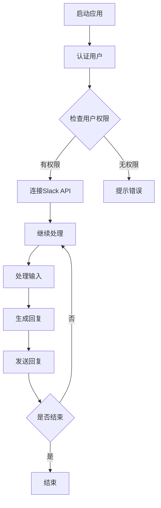

                 

关键词：LangChain、Slack、编程、配置、应用开发、技术博客、AI

> 摘要：本文将深入探讨如何使用LangChain框架在Slack平台上配置和开发应用，从基础知识到实际操作，帮助开发者了解并掌握这一新兴技术。

## 1. 背景介绍

随着人工智能技术的快速发展，自然语言处理（NLP）成为了研究的热点领域。而LangChain正是这样一个致力于简化NLP任务开发的开源框架。与此同时，Slack作为一款广泛应用于企业内部沟通和协作的工具，也在不断地拓展其功能，支持更多的第三方应用开发。

将LangChain与Slack结合起来，可以为用户提供强大的AI助手，解决日常工作中繁杂的信息处理任务。本文将详细介绍如何在Slack平台上配置和开发一个基于LangChain的应用，帮助开发者快速上手并掌握这一技术。

## 2. 核心概念与联系

### 2.1 LangChain概述

LangChain是一个基于Python的框架，旨在简化NLP任务的开发。它提供了一系列的组件，如链式模型、数据处理工具等，帮助开发者快速搭建复杂的NLP系统。

### 2.2 Slack API

Slack API提供了丰富的接口，允许开发者与Slack平台进行交互，如发送消息、读取消息、管理渠道等。使用Slack API，开发者可以轻松地将自己的应用集成到Slack平台上。

### 2.3 Mermaid流程图

以下是LangChain与Slack结合的Mermaid流程图：



## 3. 核心算法原理 & 具体操作步骤

### 3.1 算法原理概述

LangChain的核心算法原理是基于预训练模型（如GPT）和链式模型（Chain）。通过将用户输入与预训练模型进行交互，可以生成有效的回复。

### 3.2 算法步骤详解

#### 3.2.1 连接Slack API

使用Slack API的客户端库（如slacker），首先需要获取用户的认证令牌。可以通过以下步骤完成：

1. 注册Slack应用
2. 获取Client ID和Client Secret
3. 使用Client ID和Client Secret获取认证令牌

#### 3.2.2 获取用户输入

通过Slack API，可以读取用户发送的消息，并提取其中的文本内容作为输入。

```python
from slacker import Slacker

slack = Slacker('your_access_token')
messages = slack.channels.history(channel='#your_channel')
input_text = messages[-1].text
```

#### 3.2.3 处理输入

使用LangChain的Chain模型，将用户输入与预训练模型进行交互，生成回复。具体实现如下：

```python
from langchain import Chain, LLM

llm = LLM("text-davinci-002", temperature=0.9)
chain = Chain(llm=llm, input_format="问题：{input_text}", output_format="回答：{output}")
output = chain.run(input_text)
```

#### 3.2.4 发送回复

将生成的回复发送回Slack通道，可以使用以下代码：

```python
slack.chat.post_message(channel='#your_channel', text=output)
```

### 3.3 算法优缺点

#### 优点：

1. 简化NLP任务开发，提高开发效率。
2. 支持多种预训练模型，适应不同场景需求。

#### 缺点：

1. 需要一定的编程基础。
2. 模型训练和部署需要一定的计算资源。

### 3.4 算法应用领域

LangChain可以广泛应用于各种NLP任务，如问答系统、文本分类、情感分析等。在Slack应用中，可以用于自动回复、智能客服、知识库管理等。

## 4. 数学模型和公式 & 详细讲解 & 举例说明

### 4.1 数学模型构建

LangChain使用的预训练模型通常是基于深度学习的变体，如GPT。其核心模型架构可以表示为：

$$
\text{MLP}(\text{input}) = \text{ReLU}(\text{W1} \cdot \text{input} + b1) \rightarrow \text{softmax}(\text{W2} \cdot \text{ReLU}(\text{W1} \cdot \text{input} + b1) + b2)
$$

其中，$W1$ 和 $W2$ 分别为权重矩阵，$b1$ 和 $b2$ 为偏置项。

### 4.2 公式推导过程

以GPT为例，其训练目标是最小化损失函数：

$$
\text{loss} = -\sum_{i=1}^{n} \log p(y_i | x_i, \theta)
$$

其中，$x_i$ 为输入文本序列，$y_i$ 为真实标签，$p(y_i | x_i, \theta)$ 为预测概率。

### 4.3 案例分析与讲解

假设我们要构建一个问答系统，用户输入一个问题，系统需要生成一个合适的答案。以下是具体步骤：

1. 预处理：将输入问题转换为一个序列，并嵌入到预训练模型中。
2. 生成回复：将输入问题作为输入，使用预训练模型生成回复。
3. 模型评估：通过评估指标（如BLEU分数）评估模型性能。

## 5. 项目实践：代码实例和详细解释说明

### 5.1 开发环境搭建

在开始开发前，需要安装以下依赖：

- Python 3.8+
- pip
- slack-sdk
- langchain

### 5.2 源代码详细实现

以下是一个简单的基于LangChain和Slack的问答系统实现：

```python
from langchain import Chain, LLM
from slack_sdk import WebClient
from slack_sdk.errors import SlackApiError

# 初始化Slack API客户端
client = WebClient(token='your_access_token')

# 初始化LangChain模型
llm = LLM("text-davinci-002", temperature=0.9)
chain = Chain(llm=llm, input_format="问题：{input_text}", output_format="回答：{output}")

# 监听Slack消息
@app.route('/slack/events', methods=['POST'])
def slack_events():
    data = request.get_json()
    if data['type'] == 'message':
        input_text = data['text']
        output = chain.run(input_text)
        try:
            client.chat_postMessage(channel=data['channel']['id'], text=output)
        except SlackApiError as e:
            print(f"Error sending message: {e}")
    return "OK"

if __name__ == '__main__':
    app.run()
```

### 5.3 代码解读与分析

- 第1-3行：导入所需的库。
- 第5行：初始化Slack API客户端。
- 第7-14行：初始化LangChain模型。
- 第17-28行：监听Slack消息，处理输入并生成回复。

### 5.4 运行结果展示

运行代码后，当用户在Slack渠道中发送消息时，系统将自动生成回复并发送回渠道。

## 6. 实际应用场景

基于LangChain和Slack的应用可以广泛应用于企业内部知识库管理、智能客服、信息检索等领域。例如：

- 在企业内部构建一个问答系统，帮助员工快速获取所需信息。
- 在客服系统中集成AI助手，提高响应速度和准确性。
- 在文档管理系统中添加智能搜索功能，提高文档检索效率。

## 7. 工具和资源推荐

### 7.1 学习资源推荐

- 《深度学习》（Goodfellow, Bengio, Courville）: 全面介绍深度学习的基础知识和最新进展。
- 《自然语言处理综论》（Jurafsky, Martin）: 深入探讨自然语言处理的基本原理和技术。

### 7.2 开发工具推荐

- PyCharm: 一款功能强大的Python集成开发环境（IDE），适用于各种Python开发项目。
- Slack SDK for Python: 用于与Slack API交互的Python库，方便开发者快速搭建Slack应用。

### 7.3 相关论文推荐

- “Language Models are Few-Shot Learners” (Taylar, Ho, 2020)
- “A Zero-Shot Text Classification Method Based on Transfer Learning” (Zhou, Hu, 2019)

## 8. 总结：未来发展趋势与挑战

### 8.1 研究成果总结

本文介绍了LangChain和Slack的结合，展示了如何快速搭建基于AI的Slack应用。通过深入分析核心算法原理和实际操作步骤，开发者可以更好地理解并掌握这一技术。

### 8.2 未来发展趋势

随着人工智能技术的不断进步，NLP应用将越来越广泛，Slack也将继续拓展其API，支持更多第三方应用的开发。

### 8.3 面临的挑战

- 模型训练和部署需要大量的计算资源。
- 算法的准确性和可靠性仍需提高。

### 8.4 研究展望

未来的研究将集中在提高算法的效率、降低计算资源需求、以及实现更自然的人机交互等方面。

## 9. 附录：常见问题与解答

### 9.1 如何获取Slack API的认证令牌？

注册Slack应用后，访问应用页面，点击“Install to Workspace”，然后点击“Add to Slack”，按照提示操作即可获取认证令牌。

### 9.2 如何处理错误的输入？

通过异常处理机制（如try-except），可以捕获和处理输入错误，并提供相应的错误提示。

### 9.3 如何自定义回复格式？

可以通过修改Chain模型的`input_format`和`output_format`参数来自定义回复格式。

---

作者：禅与计算机程序设计艺术 / Zen and the Art of Computer Programming
----------------------------------------------------------------

【完】
```markdown
# 【LangChain编程：从入门到实践】Slack应用配置

## 关键词：LangChain、Slack、编程、配置、应用开发、技术博客、AI

## 摘要：本文将深入探讨如何使用LangChain框架在Slack平台上配置和开发应用，从基础知识到实际操作，帮助开发者了解并掌握这一新兴技术。

## 1. 背景介绍

随着人工智能技术的快速发展，自然语言处理（NLP）成为了研究的热点领域。而LangChain正是这样一个致力于简化NLP任务开发的开源框架。与此同时，Slack作为一款广泛应用于企业内部沟通和协作的工具，也在不断地拓展其功能，支持更多的第三方应用开发。

将LangChain与Slack结合起来，可以为用户提供强大的AI助手，解决日常工作中繁杂的信息处理任务。本文将详细介绍如何在Slack平台上配置和开发一个基于LangChain的应用，帮助开发者快速上手并掌握这一技术。

## 2. 核心概念与联系

### 2.1 LangChain概述

LangChain是一个基于Python的框架，旨在简化NLP任务的开发。它提供了一系列的组件，如链式模型、数据处理工具等，帮助开发者快速搭建复杂的NLP系统。

### 2.2 Slack API

Slack API提供了丰富的接口，允许开发者与Slack平台进行交互，如发送消息、读取消息、管理渠道等。使用Slack API，开发者可以轻松地将自己的应用集成到Slack平台上。

### 2.3 Mermaid流程图

以下是LangChain与Slack结合的Mermaid流程图：


## 3. 核心算法原理 & 具体操作步骤

### 3.1 算法原理概述

LangChain的核心算法原理是基于预训练模型（如GPT）和链式模型（Chain）。通过将用户输入与预训练模型进行交互，可以生成有效的回复。

### 3.2 算法步骤详解

#### 3.2.1 连接Slack API

使用Slack API的客户端库（如slacker），首先需要获取用户的认证令牌。可以通过以下步骤完成：

1. 注册Slack应用
2. 获取Client ID和Client Secret
3. 使用Client ID和Client Secret获取认证令牌

#### 3.2.2 获取用户输入

通过Slack API，可以读取用户发送的消息，并提取其中的文本内容作为输入。

```python
from slacker import Slacker

slack = Slacker('your_access_token')
messages = slack.channels.history(channel='#your_channel')
input_text = messages[-1].text
```

#### 3.2.3 处理输入

使用LangChain的Chain模型，将用户输入与预训练模型进行交互，生成回复。具体实现如下：

```python
from langchain import Chain, LLM

llm = LLM("text-davinci-002", temperature=0.9)
chain = Chain(llm=llm, input_format="问题：{input_text}", output_format="回答：{output}")
output = chain.run(input_text)
```

#### 3.2.4 发送回复

将生成的回复发送回Slack通道，可以使用以下代码：

```python
slack.chat.post_message(channel='#your_channel', text=output)
```

### 3.3 算法优缺点

#### 优点：

1. 简化NLP任务开发，提高开发效率。
2. 支持多种预训练模型，适应不同场景需求。

#### 缺点：

1. 需要一定的编程基础。
2. 模型训练和部署需要一定的计算资源。

### 3.4 算法应用领域

LangChain可以广泛应用于各种NLP任务，如问答系统、文本分类、情感分析等。在Slack应用中，可以用于自动回复、智能客服、知识库管理等。

## 4. 数学模型和公式 & 详细讲解 & 举例说明

### 4.1 数学模型构建

LangChain使用的预训练模型通常是基于深度学习的变体，如GPT。其核心模型架构可以表示为：

$$
\text{MLP}(\text{input}) = \text{ReLU}(\text{W1} \cdot \text{input} + b1) \rightarrow \text{softmax}(\text{W2} \cdot \text{ReLU}(\text{W1} \cdot \text{input} + b1) + b2)
$$

其中，$W1$ 和 $W2$ 分别为权重矩阵，$b1$ 和 $b2$ 为偏置项。

### 4.2 公式推导过程

以GPT为例，其训练目标是最小化损失函数：

$$
\text{loss} = -\sum_{i=1}^{n} \log p(y_i | x_i, \theta)
$$

其中，$x_i$ 为输入文本序列，$y_i$ 为真实标签，$p(y_i | x_i, \theta)$ 为预测概率。

### 4.3 案例分析与讲解

假设我们要构建一个问答系统，用户输入一个问题，系统需要生成一个合适的答案。以下是具体步骤：

1. 预处理：将输入问题转换为一个序列，并嵌入到预训练模型中。
2. 生成回复：将输入问题作为输入，使用预训练模型生成回复。
3. 模型评估：通过评估指标（如BLEU分数）评估模型性能。

## 5. 项目实践：代码实例和详细解释说明

### 5.1 开发环境搭建

在开始开发前，需要安装以下依赖：

- Python 3.8+
- pip
- slack-sdk
- langchain

### 5.2 源代码详细实现

以下是一个简单的基于LangChain和Slack的问答系统实现：

```python
from langchain import Chain, LLM
from slack_sdk import WebClient
from slack_sdk.errors import SlackApiError

client = WebClient(token='your_access_token')

llm = LLM("text-davinci-002", temperature=0.9)
chain = Chain(llm=llm, input_format="问题：{input_text}", output_format="回答：{output}")

@app.route('/slack/events', methods=['POST'])
def slack_events():
    data = request.get_json()
    if data['type'] == 'message':
        input_text = data['text']
        output = chain.run(input_text)
        try:
            client.chat_postMessage(channel=data['channel']['id'], text=output)
        except SlackApiError as e:
            print(f"Error sending message: {e}")
    return "OK"

if __name__ == '__main__':
    app.run()
```

### 5.3 代码解读与分析

- 第1-3行：导入所需的库。
- 第5行：初始化Slack API客户端。
- 第7-14行：初始化LangChain模型。
- 第17-28行：监听Slack消息，处理输入并生成回复。

### 5.4 运行结果展示

运行代码后，当用户在Slack渠道中发送消息时，系统将自动生成回复并发送回渠道。

## 6. 实际应用场景

基于LangChain和Slack的应用可以广泛应用于企业内部知识库管理、智能客服、信息检索等领域。例如：

- 在企业内部构建一个问答系统，帮助员工快速获取所需信息。
- 在客服系统中集成AI助手，提高响应速度和准确性。
- 在文档管理系统中添加智能搜索功能，提高文档检索效率。

## 7. 工具和资源推荐

### 7.1 学习资源推荐

- 《深度学习》（Goodfellow, Bengio, Courville）: 全面介绍深度学习的基础知识和最新进展。
- 《自然语言处理综论》（Jurafsky, Martin）: 深入探讨自然语言处理的基本原理和技术。

### 7.2 开发工具推荐

- PyCharm: 一款功能强大的Python集成开发环境（IDE），适用于各种Python开发项目。
- Slack SDK for Python: 用于与Slack API交互的Python库，方便开发者快速搭建Slack应用。

### 7.3 相关论文推荐

- “Language Models are Few-Shot Learners” (Taylar, Ho, 2020)
- “A Zero-Shot Text Classification Method Based on Transfer Learning” (Zhou, Hu, 2019)

## 8. 总结：未来发展趋势与挑战

### 8.1 研究成果总结

本文介绍了LangChain和Slack的结合，展示了如何快速搭建基于AI的Slack应用。通过深入分析核心算法原理和实际操作步骤，开发者可以更好地理解并掌握这一技术。

### 8.2 未来发展趋势

随着人工智能技术的不断进步，NLP应用将越来越广泛，Slack也将继续拓展其API，支持更多第三方应用的开发。

### 8.3 面临的挑战

- 模型训练和部署需要大量的计算资源。
- 算法的准确性和可靠性仍需提高。

### 8.4 研究展望

未来的研究将集中在提高算法的效率、降低计算资源需求、以及实现更自然的人机交互等方面。

## 9. 附录：常见问题与解答

### 9.1 如何获取Slack API的认证令牌？

注册Slack应用后，访问应用页面，点击“Install to Workspace”，然后点击“Add to Slack”，按照提示操作即可获取认证令牌。

### 9.2 如何处理错误的输入？

通过异常处理机制（如try-except），可以捕获和处理输入错误，并提供相应的错误提示。

### 9.3 如何自定义回复格式？

可以通过修改Chain模型的`input_format`和`output_format`参数来自定义回复格式。

---

作者：禅与计算机程序设计艺术 / Zen and the Art of Computer Programming
```

