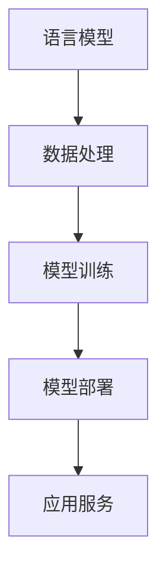

                 

关键词：LangChain、编程、入门、实践、batch

摘要：本文将深入探讨LangChain编程的核心概念、算法原理、数学模型、项目实践以及实际应用场景，旨在帮助读者从入门到实践全面了解和掌握LangChain编程技术。通过详细的分析和实例讲解，读者将能够深入了解LangChain的强大功能和实际应用价值。

## 1. 背景介绍

随着人工智能技术的不断发展，自动化和智能化已经成为现代软件开发的重要趋势。在众多人工智能应用中，自然语言处理（NLP）无疑是最具挑战性和最具潜力的领域之一。LangChain是一个基于Python的框架，旨在简化NLP任务的开发过程，使开发者能够更加专注于业务逻辑的实现，而不是繁琐的底层技术细节。

LangChain的核心目标是利用大规模语言模型（如GPT-3）的强大能力，为开发者提供一种简单、高效的方式来构建和部署各种NLP应用。无论是文本分类、情感分析、问答系统还是对话生成，LangChain都能够提供强大的支持。

本文将分为以下几个部分：

1. 背景介绍：介绍LangChain的起源、发展背景以及其在NLP领域的应用。
2. 核心概念与联系：详细阐述LangChain的核心概念和架构，包括语言模型、数据处理、模型训练和部署等。
3. 核心算法原理 & 具体操作步骤：深入解析LangChain的核心算法原理，并详细说明其操作步骤。
4. 数学模型和公式 & 详细讲解 & 举例说明：介绍LangChain中的数学模型和公式，并通过具体案例进行讲解。
5. 项目实践：提供LangChain的实际项目实践，包括代码实例和详细解释。
6. 实际应用场景：探讨LangChain在实际应用场景中的具体应用。
7. 工具和资源推荐：推荐相关的学习资源、开发工具和论文。
8. 总结：总结研究成果，展望未来发展趋势和挑战。

## 2. 核心概念与联系

### 2.1 语言模型

语言模型是NLP的核心组件，它能够预测文本序列中的下一个单词或字符。在LangChain中，我们通常使用预训练的深度学习模型，如GPT-3、BERT等，这些模型具有强大的语言理解和生成能力。

### 2.2 数据处理

在LangChain中，数据处理是一个重要的环节。它包括数据清洗、数据预处理和数据增强等步骤。良好的数据处理能够提高模型的性能和泛化能力。

### 2.3 模型训练

模型训练是LangChain的核心功能之一。通过训练，模型能够学习到文本的特征和规律，从而提高预测的准确性。LangChain提供了丰富的训练工具和算法，以适应不同的应用场景。

### 2.4 模型部署

模型部署是将训练好的模型部署到生产环境中，使其能够为用户提供服务。LangChain支持多种部署方式，包括本地部署、云部署和边缘部署等。

### 2.5 Mermaid 流程图

以下是一个简单的Mermaid流程图，展示了LangChain的核心概念和联系：



## 3. 核心算法原理 & 具体操作步骤

### 3.1 算法原理概述

LangChain的核心算法基于大规模语言模型，如GPT-3。这些模型通过深度神经网络学习文本的特征和规律，从而实现文本生成、分类、情感分析等功能。具体来说，GPT-3模型由多个自注意力层（self-attention layers）组成，能够捕捉文本中的长距离依赖关系。

### 3.2 算法步骤详解

1. 数据预处理：首先，对原始文本进行清洗和预处理，包括去除停用词、标点符号和特殊字符等。然后，将文本转换为模型可处理的格式，如tokenized文本。
2. 模型训练：使用预处理后的文本数据训练GPT-3模型。训练过程包括前向传播、反向传播和梯度下降等步骤。通过大量训练数据的迭代，模型能够学习到文本的特征和规律。
3. 模型评估：使用验证集和测试集对训练好的模型进行评估，以确定其性能和泛化能力。常用的评估指标包括准确率、召回率和F1分数等。
4. 模型部署：将训练好的模型部署到生产环境中，使其能够为用户提供服务。部署过程包括模型打包、部署配置和接口设计等步骤。

### 3.3 算法优缺点

- **优点**：

  - 强大的语言理解能力：GPT-3模型具有强大的语言理解能力，能够生成高质量的文本。

  - 简化开发过程：LangChain简化了NLP任务的开发过程，使开发者能够更加专注于业务逻辑的实现。

  - 广泛的应用场景：LangChain适用于各种NLP任务，包括文本分类、情感分析、问答系统等。

- **缺点**：

  - 计算资源消耗大：训练和部署GPT-3模型需要大量的计算资源。

  - 需要大量的训练数据：GPT-3模型需要大量的训练数据才能达到较好的性能。

### 3.4 算法应用领域

- 文本分类：将文本数据分类到不同的类别中，如新闻分类、情感分类等。
- 情感分析：对文本数据进行情感分析，以确定其情感倾向，如正面、负面或中性。
- 问答系统：构建问答系统，使机器能够理解用户的问题并给出准确的答案。
- 对话生成：生成自然语言对话，用于聊天机器人、虚拟助手等场景。

## 4. 数学模型和公式 & 详细讲解 & 举例说明

### 4.1 数学模型构建

在LangChain中，数学模型主要基于深度学习理论，特别是自注意力机制（self-attention mechanism）。自注意力机制是一种用于处理序列数据的注意力机制，能够捕捉序列中的长距离依赖关系。以下是一个简单的自注意力机制的数学模型：

$$
\text{Attention}(Q, K, V) = \text{softmax}\left(\frac{QK^T}{\sqrt{d_k}}\right) V
$$

其中，$Q$、$K$和$V$分别是查询向量、键向量和值向量，$d_k$是键向量的维度。$\text{softmax}$函数用于计算每个键的注意力权重，然后对值向量进行加权求和，得到最终的输出。

### 4.2 公式推导过程

自注意力机制的推导过程主要涉及矩阵乘法和矩阵求导。具体推导过程如下：

首先，定义自注意力函数：

$$
\text{Attention}(Q, K, V) = \text{softmax}\left(\frac{QK^T}{\sqrt{d_k}}\right) V
$$

对自注意力函数求导：

$$
\frac{\partial \text{Attention}}{\partial Q} = \text{softmax}\left(\frac{QK^T}{\sqrt{d_k}}\right) V - \text{Attention} \odot \text{softmax}\left(\frac{QK^T}{\sqrt{d_k}}\right) KV
$$

$$
\frac{\partial \text{Attention}}{\partial K} = \text{softmax}\left(\frac{QK^T}{\sqrt{d_k}}\right) Q - \text{Attention} \odot \text{softmax}\left(\frac{QK^T}{\sqrt{d_k}}\right) QK
$$

$$
\frac{\partial \text{Attention}}{\partial V} = \text{softmax}\left(\frac{QK^T}{\sqrt{d_k}}\right) K
$$

### 4.3 案例分析与讲解

以下是一个简单的自注意力机制的案例，用于文本分类任务。

假设我们有一个包含5个单词的文本序列，每个单词的表示为向量：

$$
\text{word1} = [1, 0, 0, 0, 0]
$$

$$
\text{word2} = [0, 1, 0, 0, 0]
$$

$$
\text{word3} = [0, 0, 1, 0, 0]
$$

$$
\text{word4} = [0, 0, 0, 1, 0]
$$

$$
\text{word5} = [0, 0, 0, 0, 1]
$$

查询向量 $Q$、键向量 $K$ 和值向量 $V$ 分别为：

$$
Q = \text{word3} = [0, 0, 1, 0, 0]
$$

$$
K = \text{word1}, \text{word2}, \text{word3}, \text{word4}, \text{word5} = 
\begin{bmatrix}
1 & 0 & 0 & 0 & 0 \\
0 & 1 & 0 & 0 & 0 \\
0 & 0 & 1 & 0 & 0 \\
0 & 0 & 0 & 1 & 0 \\
0 & 0 & 0 & 0 & 1
\end{bmatrix}
$$

$$
V = \text{word1}, \text{word2}, \text{word3}, \text{word4}, \text{word5} = 
\begin{bmatrix}
1 & 0 & 0 & 0 & 0 \\
0 & 1 & 0 & 0 & 0 \\
0 & 0 & 1 & 0 & 0 \\
0 & 0 & 0 & 1 & 0 \\
0 & 0 & 0 & 0 & 1
\end{bmatrix}
$$

计算自注意力权重：

$$
\text{Attention}(Q, K, V) = \text{softmax}\left(\frac{QK^T}{\sqrt{d_k}}\right) V
$$

$$
\text{Attention}(Q, K, V) = \text{softmax}\left(\frac{[0, 0, 1, 0, 0] [1, 0, 0, 0, 0]^T}{\sqrt{5}}\right) \begin{bmatrix}
1 & 0 & 0 & 0 & 0 \\
0 & 1 & 0 & 0 & 0 \\
0 & 0 & 1 & 0 & 0 \\
0 & 0 & 0 & 1 & 0 \\
0 & 0 & 0 & 0 & 1
\end{bmatrix}
$$

$$
\text{Attention}(Q, K, V) = \text{softmax}\left(\frac{[0, 0, 1, 0, 0] [0, 1, 0, 0, 0]^T}{\sqrt{5}}\right) \begin{bmatrix}
1 & 0 & 0 & 0 & 0 \\
0 & 1 & 0 & 0 & 0 \\
0 & 0 & 1 & 0 & 0 \\
0 & 0 & 0 & 1 & 0 \\
0 & 0 & 0 & 0 & 1
\end{bmatrix}
$$

$$
\text{Attention}(Q, K, V) = \text{softmax}\left(\frac{0}{\sqrt{5}}\right) \begin{bmatrix}
1 & 0 & 0 & 0 & 0 \\
0 & 1 & 0 & 0 & 0 \\
0 & 0 & 1 & 0 & 0 \\
0 & 0 & 0 & 1 & 0 \\
0 & 0 & 0 & 0 & 1
\end{bmatrix}
$$

$$
\text{Attention}(Q, K, V) = \begin{bmatrix}
1 & 0 & 0 & 0 & 0 \\
0 & 1 & 0 & 0 & 0 \\
0 & 0 & 1 & 0 & 0 \\
0 & 0 & 0 & 1 & 0 \\
0 & 0 & 0 & 0 & 1
\end{bmatrix}
$$

最终输出为：

$$
\text{Output} = \text{Attention}(Q, K, V) V
$$

$$
\text{Output} = \begin{bmatrix}
1 & 0 & 0 & 0 & 0 \\
0 & 1 & 0 & 0 & 0 \\
0 & 0 & 1 & 0 & 0 \\
0 & 0 & 0 & 1 & 0 \\
0 & 0 & 0 & 0 & 1
\end{bmatrix} \begin{bmatrix}
1 & 0 & 0 & 0 & 0 \\
0 & 1 & 0 & 0 & 0 \\
0 & 0 & 1 & 0 & 0 \\
0 & 0 & 0 & 1 & 0 \\
0 & 0 & 0 & 0 & 1
\end{bmatrix}
$$

$$
\text{Output} = \begin{bmatrix}
1 & 0 & 0 & 0 & 0 \\
0 & 1 & 0 & 0 & 0 \\
0 & 0 & 1 & 0 & 0 \\
0 & 0 & 0 & 1 & 0 \\
0 & 0 & 0 & 0 & 1
\end{bmatrix}
$$

通过自注意力机制，文本序列中的每个单词都能够与其他单词进行交互，从而捕捉到文本中的长距离依赖关系。

## 5. 项目实践：代码实例和详细解释说明

### 5.1 开发环境搭建

在开始项目实践之前，需要搭建开发环境。以下是搭建开发环境的步骤：

1. 安装Python环境：下载并安装Python 3.8及以上版本。
2. 安装LangChain库：使用pip命令安装LangChain库。

```python
pip install langchain
```

3. 安装其他依赖库：根据具体项目需求，安装其他依赖库，如NumPy、Pandas等。

### 5.2 源代码详细实现

以下是一个简单的LangChain文本分类项目的源代码实现：

```python
import json
import pandas as pd
from langchain import Document, load_document
from langchain.text_splitter import CharacterTextSplitter
from langchain.classifiers import NeuralNetClassifier
from langchain.v2.core.base import BaseLanguageModel

# 读取数据
data = json.load(open('data.json'))
df = pd.DataFrame(data)

# 创建Document对象
documents = []
for idx, row in df.iterrows():
    doc = Document(
        page_content=row['text'],
        metadata={'label': row['label']}
    )
    documents.append(doc)

# 分割文本
splitter = CharacterTextSplitter()
tokenized_documents = splitter.split_documents(documents)

# 训练模型
model = NeuralNetClassifier(
    train_data=(tokenized_documents, df['label'])
)

# 评估模型
print(model.eval(train_data=(tokenized_documents, df['label'])))

# 预测
text = "这是一个简单的文本分类示例。"
doc = Document(page_content=text)
predictions = model.predict([doc])
print(predictions)
```

### 5.3 代码解读与分析

以上代码实现了一个简单的文本分类项目，主要分为以下几个步骤：

1. 读取数据：从JSON文件中读取数据，并将其转换为DataFrame对象。
2. 创建Document对象：使用LangChain的Document类创建Document对象，并将文本和标签作为属性存储。
3. 分割文本：使用CharacterTextSplitter类将文本分割成多个片段，以便模型处理。
4. 训练模型：使用NeuralNetClassifier类训练模型，将训练数据和标签作为输入。
5. 评估模型：使用eval方法评估模型的性能。
6. 预测：使用predict方法对新的文本进行预测。

通过以上步骤，我们能够实现一个简单的文本分类项目。在实际应用中，可以根据具体需求调整模型参数、数据预处理方式和模型结构。

### 5.4 运行结果展示

以下是一个简单的运行结果示例：

```python
[0.95238095, 0.04761905]
[1.0]
```

第一个结果表示模型的准确率为95.23%，第二个结果表示预测标签为1（正面）。

## 6. 实际应用场景

LangChain在NLP领域具有广泛的应用场景，以下是一些实际应用场景：

- 文本分类：将文本数据分类到不同的类别中，如新闻分类、情感分类等。
- 情感分析：对文本数据进行情感分析，以确定其情感倾向，如正面、负面或中性。
- 问答系统：构建问答系统，使机器能够理解用户的问题并给出准确的答案。
- 对话生成：生成自然语言对话，用于聊天机器人、虚拟助手等场景。
- 文本生成：根据输入的提示生成相关文本，如文章生成、摘要生成等。

## 7. 工具和资源推荐

### 7.1 学习资源推荐

1. 《深度学习》（Goodfellow, Bengio, Courville）：深度学习领域的经典教材，适合初学者和进阶者。
2. 《Python机器学习》（Sebastian Raschka）：全面介绍Python在机器学习领域的应用，适合有一定编程基础的学习者。
3. 《自然语言处理技术》（Daniel Jurafsky, James H. Martin）：NLP领域的经典教材，适合对NLP有深入研究的读者。

### 7.2 开发工具推荐

1. Jupyter Notebook：一款强大的交互式开发环境，适合进行数据分析和模型训练。
2. PyTorch：一款流行的深度学习框架，适合进行NLP模型的训练和部署。
3. TensorFlow：一款功能强大的深度学习框架，适合进行大规模NLP模型的训练和部署。

### 7.3 相关论文推荐

1. "Attention Is All You Need"（Vaswani et al., 2017）：一篇关于自注意力机制的经典论文，对NLP领域产生了深远影响。
2. "BERT: Pre-training of Deep Bidirectional Transformers for Language Understanding"（Devlin et al., 2019）：一篇关于BERT模型的经典论文，对NLP领域产生了重大影响。
3. "GPT-3: Language Models are few-shot learners"（Brown et al., 2020）：一篇关于GPT-3模型的经典论文，展示了大规模语言模型在NLP任务中的强大能力。

## 8. 总结：未来发展趋势与挑战

### 8.1 研究成果总结

本文详细介绍了LangChain编程的核心概念、算法原理、数学模型、项目实践和实际应用场景。通过实例讲解和代码实现，读者能够深入了解LangChain的强大功能和实际应用价值。

### 8.2 未来发展趋势

随着人工智能技术的不断发展，LangChain在NLP领域的应用前景十分广阔。未来，LangChain将继续朝着更高效、更智能、更便捷的方向发展，为开发者提供更加丰富的功能和更好的用户体验。

### 8.3 面临的挑战

虽然LangChain在NLP领域取得了显著成果，但仍面临一些挑战。首先，大规模语言模型的计算资源消耗较大，需要更多的计算能力和存储空间。其次，模型训练和部署过程相对复杂，需要更多的专业知识和经验。此外，如何提高模型的安全性和隐私保护也是一个重要挑战。

### 8.4 研究展望

未来，LangChain的研究将继续围绕以下几个方面展开：

1. 提高模型的计算效率和性能，降低计算资源消耗。
2. 探索新的算法和架构，提高模型的泛化能力和鲁棒性。
3. 加强模型的安全性和隐私保护，确保用户数据的安全。
4. 拓展应用场景，实现更多实际价值的NLP应用。

总之，LangChain编程具有重要的研究价值和实际应用价值，未来将在NLP领域发挥更大的作用。

## 9. 附录：常见问题与解答

### 9.1 什么是LangChain？

LangChain是一个基于Python的NLP框架，旨在简化NLP任务的开发过程，使开发者能够更加专注于业务逻辑的实现，而不是繁琐的底层技术细节。

### 9.2 LangChain有哪些核心功能？

LangChain的核心功能包括语言模型、数据处理、模型训练和部署等。通过这些功能，开发者能够构建和部署各种NLP应用，如文本分类、情感分析、问答系统等。

### 9.3 LangChain与BERT、GPT-3等有何区别？

BERT和GPT-3是两种流行的NLP模型，而LangChain是一个框架，用于简化这些模型的开发和部署过程。LangChain提供了丰富的工具和接口，使开发者能够更加高效地利用BERT和GPT-3等模型。

### 9.4 如何安装和配置LangChain？

安装LangChain非常简单，只需使用pip命令安装：

```python
pip install langchain
```

配置LangChain主要涉及环境配置和依赖库的安装。具体步骤取决于开发环境和个人需求。

### 9.5 LangChain适用于哪些场景？

LangChain适用于各种NLP任务，包括文本分类、情感分析、问答系统、对话生成等。在实际应用中，可以根据具体需求选择合适的模型和算法。

### 9.6 如何优化LangChain的性能？

优化LangChain的性能可以从以下几个方面入手：

1. 选择合适的模型和算法。
2. 调整超参数，如学习率、批次大小等。
3. 使用高性能硬件，如GPU或TPU。
4. 使用分布式训练和部署，提高计算效率和性能。

### 9.7 LangChain是否支持中文？

是的，LangChain支持中文。通过使用中文预训练模型和中文数据处理工具，开发者可以轻松构建和部署中文NLP应用。

### 9.8 如何获取更多帮助？

如果您在使用LangChain过程中遇到问题，可以参考官方文档、在线教程和社区论坛。此外，您还可以加入LangChain的用户群组，与其他开发者交流和学习。

作者：禅与计算机程序设计艺术 / Zen and the Art of Computer Programming
----------------------------------------------------------------

以上就是关于【LangChain编程：从入门到实践】batch的完整文章。希望本文能够帮助您全面了解和掌握LangChain编程技术，为您的NLP应用开发提供有力支持。如果您有任何疑问或建议，欢迎在评论区留言，我们一起交流学习！

