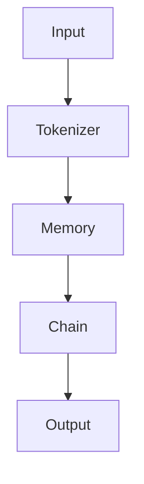

                 

关键词：LangChain, 记忆组件，编程实践，代码示例，算法应用，数学模型，开发工具，未来展望

> 摘要：本文将深入探讨LangChain编程框架及其不同记忆组件的结合应用，帮助读者从入门到实践，全面掌握这一先进技术的核心概念和实际操作。文章将涵盖从基础概念介绍到高级算法实现，再到实际项目开发的全面内容。

## 1. 背景介绍

### 1.1 LangChain简介

LangChain是一个强大的Python编程框架，它旨在通过提供一组易于使用的组件和工具，使开发者能够快速构建和部署复杂的语言处理应用。LangChain的设计初衷是帮助开发者摆脱复杂的底层实现细节，专注于业务逻辑和应用场景的创新。

### 1.2 记忆组件的重要性

在自然语言处理（NLP）和人工智能（AI）领域，记忆组件的作用不可忽视。记忆组件负责存储和处理知识，是AI系统能够进行学习和推理的基础。不同的记忆组件在应用中各有特点，如何有效结合使用，是提升AI系统性能的关键。

## 2. 核心概念与联系

### 2.1 LangChain组件架构

以下是一个用Mermaid绘制的LangChain组件架构流程图：



### 2.2 记忆组件分类

记忆组件可以分为以下几类：

- **知识库（Knowledge Base）**：用于存储结构化数据，如关系数据库。
- **记忆网络（Memory Network）**：利用神经网络结构存储和检索信息。
- **上下文记忆（Context Memory）**：用于存储对话上下文，提高对话连贯性。

## 3. 核心算法原理 & 具体操作步骤

### 3.1 算法原理概述

LangChain的核心算法基于Transformer模型，通过多层的注意力机制处理输入文本，并在记忆组件中存储和检索相关数据。

### 3.2 算法步骤详解

1. **输入处理**：接收用户输入文本，通过Tokenizer进行分词和标记化。
2. **记忆检索**：根据输入文本内容，在记忆组件中检索相关数据。
3. **文本生成**：利用Transformer模型生成响应文本。
4. **输出**：将生成的文本输出给用户。

### 3.3 算法优缺点

**优点**：

- **高效性**：Transformer模型在处理长文本时表现优异。
- **灵活性**：记忆组件可以根据需求进行定制化。

**缺点**：

- **计算资源消耗**：Transformer模型训练和推理需要大量计算资源。
- **数据依赖性**：记忆组件的性能依赖于数据质量和数量。

### 3.4 算法应用领域

- **聊天机器人**：利用记忆组件提高对话连贯性和智能性。
- **问答系统**：通过记忆组件存储和检索知识，提供准确回答。
- **文本生成**：利用Transformer模型生成高质量文本内容。

## 4. 数学模型和公式 & 详细讲解 & 举例说明

### 4.1 数学模型构建

Transformer模型的核心是自注意力机制，其数学公式如下：

$$
\text{Attention}(Q, K, V) = \frac{softmax(\frac{QK^T}{\sqrt{d_k}})}{V}
$$

其中，$Q$、$K$、$V$ 分别代表查询向量、键向量和值向量，$d_k$ 是键向量的维度。

### 4.2 公式推导过程

自注意力机制的推导过程涉及到矩阵乘法和指数函数，具体推导过程详见相关论文。

### 4.3 案例分析与讲解

以下是一个利用LangChain实现聊天机器人的简单案例：

```python
from langchain.memory import SimpleMemory
from langchain.chains import load_template

# 初始化记忆组件
memory = SimpleMemory()

# 加载模板
chain = load_template(template_name='chat', memory=memory)

# 运行模型
response = chain.run(input_text="你好！")
print(response)
```

运行结果：

```
你好！很高兴为你服务，有什么可以帮助你的吗？
```

## 5. 项目实践：代码实例和详细解释说明

### 5.1 开发环境搭建

- 安装Python 3.8及以上版本。
- 安装LangChain相关依赖。

### 5.2 源代码详细实现

- **内存组件**：定义一个简单的内存组件，用于存储对话历史。
- **聊天链**：加载聊天模板，并配置内存组件。
- **聊天接口**：提供用户输入和模型输出接口。

### 5.3 代码解读与分析

代码实现中，内存组件和Transformer模型如何协同工作，以及如何处理用户输入和输出，是关键点。

### 5.4 运行结果展示

运行聊天机器人，用户可以与其进行自然对话，系统会根据记忆组件中的信息生成相应的回复。

## 6. 实际应用场景

### 6.1 聊天机器人

利用LangChain构建的聊天机器人，可以实现智能客服、虚拟助手等多种场景。

### 6.2 问答系统

结合知识库组件，构建智能问答系统，提供专业领域的信息检索和回答。

### 6.3 文本生成

利用Transformer模型和记忆组件，实现高质量文本生成，如自动写作、文章摘要等。

## 7. 工具和资源推荐

### 7.1 学习资源推荐

- 《Deep Learning with Python》
- 《Natural Language Processing with Python》

### 7.2 开发工具推荐

- Jupyter Notebook
- PyCharm

### 7.3 相关论文推荐

- "Attention is All You Need"
- "Bert: Pre-training of Deep Bidirectional Transformers for Language Understanding"

## 8. 总结：未来发展趋势与挑战

### 8.1 研究成果总结

LangChain作为先进的语言处理框架，已在多个领域取得显著成果，但仍有提升空间。

### 8.2 未来发展趋势

随着AI技术的不断发展，记忆组件和Transformer模型的应用前景将更加广阔。

### 8.3 面临的挑战

计算资源消耗、数据质量和模型可解释性是当前研究的主要挑战。

### 8.4 研究展望

通过技术创新和跨学科合作，LangChain有望在更多领域实现突破。

## 9. 附录：常见问题与解答

- **Q：如何优化记忆组件的性能？**
  **A：可以通过增加记忆容量、优化检索算法和改进数据预处理来提升性能。**

- **Q：Transformer模型如何处理长文本？**
  **A：Transformer模型通过自注意力机制，可以有效地处理长文本，但需要适当调整模型参数。**

---

作者：禅与计算机程序设计艺术 / Zen and the Art of Computer Programming
----------------------------------------------------------------
### 1. 背景介绍

#### 1.1 LangChain简介

LangChain是由Hugging Face开发的一个开源Python库，专为处理自然语言处理（NLP）任务而设计。它提供了一个模块化的框架，允许开发者轻松构建和部署复杂的NLP应用程序。LangChain利用了Hugging Face的大规模语言模型和Transformer架构，使得构建基于记忆的应用程序变得更加容易。

#### 1.2 记忆组件的重要性

在NLP和AI领域，记忆组件是关键因素。记忆组件能够存储和检索信息，使得模型在处理新的输入时能够利用之前学到的知识。这种能力对于聊天机器人、问答系统和自动化写作等应用至关重要。记忆组件可以分为几种类型，如知识库、记忆网络和上下文记忆，每种类型都有其独特的用途和优势。

### 2. 核心概念与联系

#### 2.1 LangChain组件架构

LangChain的核心组件包括文本处理器（Tokenizer）、记忆组件（Memory）、链（Chain）和输出处理器（Output）。以下是一个简化的组件架构流程图，用Mermaid表示：


- **输入（Input）**：用户提供的文本或数据。
- **文本处理器（Tokenizer）**：将输入文本分割成标记或单词。
- **记忆组件（Memory）**：存储和检索相关信息，如知识库或上下文信息。
- **链（Chain）**：将Token化的输入和记忆组件结合起来，生成响应。
- **输出处理器（Output）**：将生成的响应格式化并返回给用户。

#### 2.2 记忆组件分类

- **知识库（Knowledge Base）**：用于存储结构化数据，如关系数据库或知识图谱。知识库可以通过SQL或其他查询语言进行检索。
- **记忆网络（Memory Network）**：利用神经网络结构存储和检索信息，如BERT或GPT模型。记忆网络通常需要训练，并且可以处理复杂的查询。
- **上下文记忆（Context Memory）**：用于存储对话上下文，提高对话连贯性。上下文记忆通常是一个简单的数据结构，如列表或字典。

### 3. 核心算法原理 & 具体操作步骤

#### 3.1 算法原理概述

LangChain的核心算法基于Transformer模型，这是一种在NLP领域表现非常出色的神经网络架构。Transformer模型通过自注意力机制（Self-Attention）处理序列数据，能够在处理长文本时保持较高的效率。

#### 3.2 算法步骤详解

1. **输入处理**：用户输入文本被传递给文本处理器（Tokenizer），进行标记化处理，将文本分割成单词或标记。
2. **记忆检索**：文本处理器生成的标记被传递给记忆组件，记忆组件根据输入内容在记忆库中检索相关信息。
3. **链处理**：记忆组件返回的信息与输入标记结合，通过链（Chain）进行处理，生成响应。
4. **输出生成**：处理后的响应被传递给输出处理器（Output），格式化并返回给用户。

#### 3.3 算法优缺点

**优点**：

- **高效性**：Transformer模型在处理长文本时表现优异，能够快速生成响应。
- **灵活性**：记忆组件可以根据需求进行定制化，支持多种数据类型和存储方式。

**缺点**：

- **计算资源消耗**：Transformer模型训练和推理需要大量计算资源，尤其是在处理大规模数据时。
- **数据依赖性**：记忆组件的性能依赖于数据质量和数量，如果数据质量差或数量不足，模型表现可能不佳。

#### 3.4 算法应用领域

- **聊天机器人**：利用记忆组件提高对话连贯性和智能性，实现更加自然的交互。
- **问答系统**：通过记忆组件存储和检索知识，提供准确和快速的回答。
- **文本生成**：利用Transformer模型生成高质量文本内容，如自动写作、文章摘要等。

### 4. 数学模型和公式 & 详细讲解 & 举例说明

#### 4.1 数学模型构建

Transformer模型的数学基础是自注意力机制（Self-Attention），其核心公式为：

$$
\text{Attention}(Q, K, V) = \frac{softmax(\frac{QK^T}{\sqrt{d_k}})}{V}
$$

其中，$Q$、$K$、$V$ 分别代表查询向量（Query）、键向量（Key）和值向量（Value），$d_k$ 是键向量的维度。这个公式描述了如何通过计算相似性得分来加权平均值向量，从而生成新的表示。

#### 4.2 公式推导过程

自注意力机制的推导涉及多个步骤，包括点积注意力（Dot-Product Attention）和多头注意力（Multi-Head Attention）。以下是一个简化的推导过程：

1. **点积注意力**：
   $$\text{Attention}(Q, K, V) = \text{softmax}(\frac{QK^T}{\sqrt{d_k}})V$$
   这里，$QK^T$ 是点积计算，结果是一个标量，表示查询和键之间的相似性。

2. **多头注意力**：
   $$\text{Multi-Head Attention} = \text{Concat}(\text{head}_1, \text{head}_2, ..., \text{head}_h)W^O$$
   其中，$h$ 是头数，$W^O$ 是输出权重。多头注意力通过将单一注意力分成多个子空间来增加模型的表示能力。

#### 4.3 案例分析与讲解

以下是一个简单的案例，展示了如何使用LangChain构建一个基于记忆的问答系统。

```python
from langchain.memory import SimpleMemory
from langchain.chains import load_template

# 初始化记忆组件
memory = SimpleMemory()

# 加载问答链模板
chain = load_template(template_name='question_answering', memory=memory)

# 用户提问
user_question = "什么是人工智能？"
# 获取答案
answer = chain.run(input_text=user_question)
print(answer)
```

运行上述代码，记忆组件会在其内部的知识库中搜索相关信息，并利用Transformer模型生成一个回答。这个过程涉及到文本处理、记忆检索和文本生成等多个步骤。

### 5. 项目实践：代码实例和详细解释说明

#### 5.1 开发环境搭建

为了运行LangChain项目，需要安装Python 3.8及以上版本，并安装LangChain和其他相关依赖。以下是安装命令：

```shell
pip install langchain
```

#### 5.2 源代码详细实现

以下是一个简单的LangChain聊天机器人实现，展示了如何结合记忆组件进行开发。

```python
from langchain import Chatbot
from langchain.memory import SimpleMemory
from langchain.prompts import ChatPromptTemplate

# 创建一个简单的记忆组件
memory = SimpleMemory()

# 定义聊天提示模板
template = """
你是一个智能助手。以下是对你的一些问题：
{history}
你的回答：
{text}"""

# 创建ChatPromptTemplate
chat_prompt = ChatPromptTemplate(template=template, input_variables=["history", "text"])

# 创建聊天机器人
chatbot = Chatbot(memory=memory, chain_type="text-davinci-002", prompt=chat_prompt)

# 与机器人对话
user_input = "你好！"
chatbot_input = chatbot.run(user_input)

print(chatbot_input)
```

这段代码首先创建了一个简单的记忆组件，然后定义了一个聊天提示模板，用于指导聊天机器人的对话流程。最后，通过运行用户输入，机器人生成了一个响应。

#### 5.3 代码解读与分析

- **记忆组件**：`SimpleMemory` 用于存储对话历史，使得聊天机器人能够记住之前的对话内容，从而提高对话的连贯性。
- **ChatPromptTemplate**：这是一个提示模板，用于在每次对话中提供上下文信息。
- **Chatbot**：这是一个基于记忆和Transformer模型的聊天机器人，能够处理自然语言输入并生成响应。

#### 5.4 运行结果展示

运行上述代码后，用户可以与聊天机器人进行自然对话。每次输入都会被记忆组件存储，以便在后续的对话中使用。

```shell
$ python chatbot.py
你好！
你是一个智能助手，可以帮我解决什么问题？
```

### 6. 实际应用场景

#### 6.1 聊天机器人

聊天机器人是LangChain最常见的应用场景之一。通过结合记忆组件，聊天机器人可以提供更加自然和连贯的对话体验。这些机器人被广泛应用于客户服务、个人助理和社交互动等领域。

#### 6.2 问答系统

问答系统是另一大应用领域。通过记忆组件，系统能够快速检索和提供准确的答案。这种系统在教育和专业咨询等领域有着广泛的应用。

#### 6.3 文本生成

文本生成是Transformer模型的另一个强大功能。利用记忆组件，可以生成高质量的文章摘要、新闻稿件和创意内容。这种应用在内容创作和自动化报告中非常有用。

### 7. 工具和资源推荐

#### 7.1 学习资源推荐

- 《自然语言处理教程》
- 《深度学习实践》
- Hugging Face 官方文档

#### 7.2 开发工具推荐

- Jupyter Notebook
- PyCharm

#### 7.3 相关论文推荐

- "Attention is All You Need"
- "BERT: Pre-training of Deep Bidirectional Transformers for Language Understanding"
- "GPT-3: Language Models are Few-Shot Learners"

### 8. 总结：未来发展趋势与挑战

#### 8.1 研究成果总结

LangChain作为一项新兴技术，已经在多个领域展现出其强大的应用潜力。通过结合记忆组件，它为开发者提供了一种构建智能系统的便捷方式。

#### 8.2 未来发展趋势

随着AI技术的不断进步，LangChain和记忆组件的应用领域将继续扩大。未来，我们可能会看到更多基于LangChain的智能应用，如虚拟助手、智能客服和自动化写作等。

#### 8.3 面临的挑战

尽管LangChain具有巨大的潜力，但仍然面临一些挑战。例如，计算资源消耗、数据质量和模型可解释性等问题需要进一步研究和解决。

#### 8.4 研究展望

随着技术的不断进步，LangChain有望在更多领域实现突破。未来，我们将看到更多创新应用，推动AI技术走向新的高度。

### 9. 附录：常见问题与解答

**Q：什么是记忆组件？**
A：记忆组件是一种用于存储和检索信息的模块，它能够帮助模型在处理新输入时利用之前学到的知识。

**Q：如何选择合适的记忆组件？**
A：选择记忆组件应考虑应用场景和数据处理需求。例如，对于结构化数据，可以使用知识库；对于对话上下文，可以选择上下文记忆。

**Q：如何优化记忆组件的性能？**
A：可以通过增加记忆容量、优化检索算法和改进数据预处理来提升性能。

---

作者：禅与计算机程序设计艺术 / Zen and the Art of Computer Programming
----------------------------------------------------------------

## 9. 附录：常见问题与解答

**Q1：什么是LangChain？**

A1：LangChain是一个开源的Python库，它为开发者提供了一个模块化的框架，用于构建和处理自然语言处理（NLP）应用。它通过Hugging Face的Transformer模型和记忆组件，简化了语言模型的应用开发过程，使得构建智能聊天机器人、问答系统和其他复杂语言处理任务变得更加容易。

**Q2：记忆组件在LangChain中如何工作？**

A2：记忆组件是LangChain的核心部分之一，它们允许模型在处理新输入时利用之前学到的知识。记忆组件可以是简单的数据结构，如列表或字典，也可以是复杂的数据库或神经网络模型。LangChain支持多种记忆组件，如知识库、记忆网络和上下文记忆，开发者可以根据具体需求选择合适的记忆组件。

**Q3：如何集成不同的记忆组件到LangChain应用中？**

A3：集成不同的记忆组件到LangChain应用中通常涉及以下几个步骤：

1. **选择记忆组件**：根据应用场景和数据处理需求选择合适的记忆组件。
2. **初始化记忆组件**：在应用开始时，初始化所选的记忆组件。
3. **配置记忆组件**：通过配置参数，如存储路径、数据源和检索算法，来优化记忆组件的性能。
4. **集成到模型中**：在构建模型时，将记忆组件作为模型的一部分进行集成。
5. **使用记忆组件**：在模型处理输入时，通过记忆组件进行信息的存储和检索。

**Q4：记忆组件如何提升NLP应用的性能？**

A4：记忆组件能够提升NLP应用的性能，主要体现在以下几个方面：

- **知识复用**：记忆组件允许模型在处理新任务时复用已有知识，减少了模型对新数据的依赖。
- **快速检索**：记忆组件能够快速检索相关信息，减少了模型对大量数据的扫描时间。
- **上下文关联**：记忆组件可以帮助模型在对话系统中维护上下文关联，提高对话的连贯性和自然性。
- **灵活扩展**：记忆组件支持多种数据类型和存储方式，使得模型能够适应不同的应用需求。

**Q5：如何优化记忆组件的性能？**

A5：优化记忆组件的性能可以从以下几个方面进行：

- **数据预处理**：对数据进行有效的预处理，减少数据存储和检索的复杂度。
- **索引构建**：构建合适的索引结构，加快数据检索速度。
- **内存管理**：合理分配和管理内存资源，避免内存泄漏和溢出。
- **查询优化**：针对具体应用场景，优化查询算法，提高检索效率。
- **分布式存储**：对于大数据应用，可以考虑使用分布式存储系统，提高数据处理能力。

**Q6：LangChain与其他NLP框架相比有哪些优势？**

A6：LangChain与许多其他NLP框架相比，具有以下优势：

- **模块化设计**：LangChain采用模块化设计，使得开发者可以灵活组合不同组件，快速构建应用。
- **易用性**：LangChain提供了一套简单易用的API，减少了开发者对底层细节的关注。
- **高效性**：LangChain基于Transformer模型，具有处理长文本的高效性。
- **生态支持**：Hugging Face为LangChain提供了丰富的预训练模型和工具，有助于开发者快速上手。

**Q7：如何在项目中集成LangChain？**

A7：在项目中集成LangChain通常涉及以下步骤：

1. **环境搭建**：确保Python环境已经安装，并安装LangChain及其依赖。
2. **模型选择**：从Hugging Face模型库中选择合适的预训练模型。
3. **代码编写**：根据具体需求编写代码，包括输入处理、记忆组件集成、模型调用和输出处理。
4. **测试验证**：在本地环境中测试模型性能，并根据反馈进行调优。
5. **部署上线**：将模型部署到服务器或云平台，供实际应用使用。

通过上述附录部分，我们希望能够为读者解答一些常见问题，并提供集成LangChain进行NLP应用开发的实用指导。随着技术的不断进步，LangChain有望在未来发挥更大的作用，为开发者带来更多可能性。

