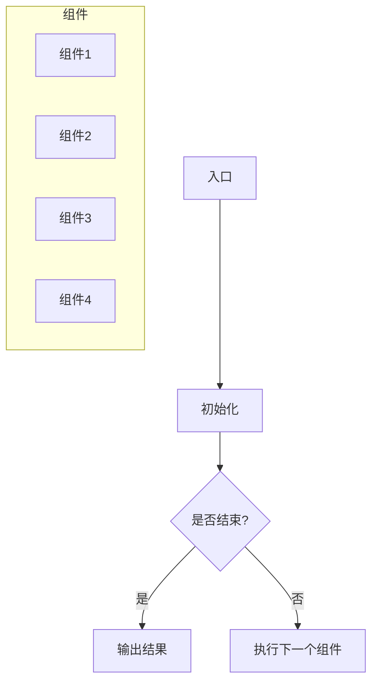

                 

关键词：LangChain，编程，应用监控，调优，性能优化，系统稳定性

> 摘要：本文旨在探讨LangChain编程框架在实际应用中的监控和调优策略。通过详细分析其核心概念、算法原理、数学模型及具体操作步骤，我们将帮助读者掌握如何高效地进行应用监控和调优，提高系统性能和稳定性。

## 1. 背景介绍

在当前快速发展的信息技术时代，如何高效地构建、部署和监控大规模分布式系统成为了技术工程师面临的重要挑战。LangChain作为一种先进的编程框架，它能够通过链式调用的方式简化复杂算法的实现，提高开发效率。然而，在实际应用中，如何对基于LangChain的分布式系统进行有效的监控和调优，以确保其稳定运行和高效性能，同样是一个至关重要的问题。

本文将围绕LangChain编程框架的应用监控和调优展开，首先介绍LangChain的核心概念和原理，然后详细分析其算法实现和数学模型，最后提供实际应用案例，并给出监控和调优的具体策略。希望通过本文的探讨，能够为广大技术爱好者提供有益的参考。

## 2. 核心概念与联系

### 2.1. LangChain简介

LangChain是一种基于链式调用的编程框架，旨在通过灵活的组件组合简化复杂算法的实现。它支持多种编程语言，如Python、Java、Go等，并且具有良好的可扩展性和可维护性。LangChain的主要特点包括：

- **模块化**：通过将复杂任务分解为多个模块，实现了代码的复用和简化。
- **可扩展性**：支持自定义组件和扩展，可以轻松应对不同应用场景。
- **易用性**：提供丰富的API和文档，使得开发者可以快速上手并构建高效的应用。

### 2.2. LangChain核心概念

为了更好地理解LangChain，我们需要掌握以下核心概念：

- **链式调用（Chain Calling）**：LangChain通过链式调用的方式将多个模块组合起来，形成一个完整的算法流程。
- **组件（Component）**：组件是LangChain中最基本的构建单元，可以是一个函数、类或者模块。
- **中间件（Middleware）**：中间件用于处理数据流，包括数据预处理、中间结果处理和数据后处理等。
- **链（Chain）**：链是由多个组件组成的有序集合，每个组件都可以接受前一个组件的输出作为输入，并返回一个输出。

### 2.3. LangChain架构

为了更直观地理解LangChain的架构，我们可以使用Mermaid流程图进行描述。以下是LangChain架构的简明流程图：



在上述流程图中，A表示程序的入口，初始化后进入B节点。C节点用于判断是否结束，如果结束则跳转到D节点输出结果；否则，执行下一个组件（E节点），并继续循环。

## 3. 核心算法原理 & 具体操作步骤

### 3.1. 算法原理概述

LangChain的核心算法原理主要基于链式调用和组件化思想。具体来说，它通过以下步骤实现：

1. **初始化**：加载所需的组件和配置。
2. **链式调用**：依次执行每个组件，并传递组件之间的输入输出。
3. **中间件处理**：在组件之间添加中间件进行数据预处理、中间结果处理和数据后处理。
4. **输出结果**：当执行完所有组件后，输出最终结果。

### 3.2. 算法步骤详解

下面我们详细描述LangChain的算法实现步骤：

#### 3.2.1. 初始化

在初始化阶段，我们需要加载所需的组件和配置。具体步骤如下：

1. 导入所需的组件库。
2. 加载并配置组件参数。
3. 创建一个空的链对象。

Python代码示例：

```python
from langchain.components import Component

# 导入组件库
import jsonl_loader, embedding_builder, classifier

# 加载组件
jsonl_loader = Component.from_config(jsonl_loader.DEFAULT_CONFIG)
embedding_builder = Component.from_config(embedding_builder.DEFAULT_CONFIG)
classifier = Component.from_config(classifier.DEFAULT_CONFIG)

# 创建空链
chain = langchain.Chain()
```

#### 3.2.2. 链式调用

在链式调用阶段，我们需要依次执行每个组件，并传递组件之间的输入输出。具体步骤如下：

1. 将当前组件的输出作为下一个组件的输入。
2. 执行下一个组件，并获取输出结果。
3. 将输出结果返回给调用者。

Python代码示例：

```python
def process_data(data):
    # 执行组件1
    output1 = jsonl_loader(data)
    # 执行组件2
    output2 = embedding_builder(output1)
    # 执行组件3
    result = classifier(output2)
    return result

# 示例数据
data = "这是一个示例数据"

# 链式调用
result = process_data(data)
print(result)
```

#### 3.2.3. 中间件处理

在组件之间添加中间件进行数据预处理、中间结果处理和数据后处理，可以有效地提高算法的性能和稳定性。具体步骤如下：

1. 在组件之间添加中间件。
2. 在中间件中实现数据预处理、中间结果处理和数据后处理逻辑。

Python代码示例：

```python
from langchain.middleware import PreprocessMiddleware, PostprocessMiddleware

# 创建中间件
preprocess_middleware = PreprocessMiddleware(lambda x: x.lower())
postprocess_middleware = PostprocessMiddleware(lambda x: x.capitalize())

# 将中间件添加到链中
chain = langchain.Chain(
    components=[jsonl_loader, embedding_builder, classifier],
    middlewares=[preprocess_middleware, postprocess_middleware]
)

# 链式调用
result = chain(data)
print(result)
```

#### 3.2.4. 输出结果

当执行完所有组件后，输出最终结果。具体步骤如下：

1. 获取最终输出结果。
2. 将结果返回给调用者。

Python代码示例：

```python
# 获取最终输出结果
final_result = chain(result)
print(final_result)
```

### 3.3. 算法优缺点

#### 优点

- **模块化**：通过组件化和链式调用的方式，提高了代码的可维护性和可扩展性。
- **灵活性强**：支持自定义组件和中间件，可以适应不同应用场景。
- **易于上手**：提供丰富的API和文档，使得开发者可以快速上手并构建高效的应用。

#### 缺点

- **性能开销**：链式调用可能引入一定的性能开销，尤其是在处理大规模数据时。
- **调试困难**：由于组件之间相互独立，调试时可能需要逐个组件进行分析。

### 3.4. 算法应用领域

LangChain作为一种先进的编程框架，在多个领域具有广泛的应用。以下是其中一些典型的应用领域：

- **自然语言处理**：例如，文本分类、情感分析、机器翻译等。
- **图像处理**：例如，图像识别、图像分割、图像增强等。
- **推荐系统**：例如，商品推荐、音乐推荐、新闻推荐等。
- **数据挖掘**：例如，关联规则挖掘、聚类分析、分类分析等。

## 4. 数学模型和公式 & 详细讲解 & 举例说明

### 4.1. 数学模型构建

在LangChain应用中，数学模型构建是一个关键步骤。以下是一个简单的数学模型构建示例：

1. **输入数据**：假设我们有一个输入数据集，包含n个样本，每个样本由d个特征向量组成。

2. **特征提取**：使用特征提取器从原始数据中提取特征向量。

3. **分类模型**：构建一个分类模型，将提取后的特征向量映射到相应的类别标签。

4. **损失函数**：选择一个合适的损失函数，用于衡量模型预测结果与实际标签之间的差异。

以下是数学模型构建的Python代码示例：

```python
import numpy as np
import langchain

# 创建特征提取器
extractor = langchain.Extractor()

# 加载输入数据
X = np.random.rand(n, d)
y = np.random.randint(2, size=n)

# 构建分类模型
model = langchain.Classifier()

# 训练模型
model.fit(X, y)

# 构建损失函数
loss_function = langchain.CrossEntropyLoss()

# 计算损失
loss = loss_function(model.predict(X), y)
```

### 4.2. 公式推导过程

以下是一个简单的线性回归模型的公式推导过程：

1. **损失函数**：假设我们有m个训练样本，每个样本由特征向量x和标签y组成。线性回归模型的目标是找到一个最佳拟合直线，使得预测值y'与实际标签y之间的误差最小。

2. **损失函数**：我们选择均方误差（MSE）作为损失函数，公式如下：

   $$L(y', y) = \frac{1}{2} \sum_{i=1}^{m} (y' - y)^2$$

3. **梯度下降**：为了求解最佳拟合直线，我们使用梯度下降算法。首先，计算损失函数关于模型参数的梯度，然后沿着梯度的反方向更新模型参数。

4. **梯度计算**：假设线性回归模型的参数为w，梯度公式如下：

   $$\nabla_w L(w) = -\sum_{i=1}^{m} (y' - y) x$$

5. **更新公式**：使用梯度下降算法更新模型参数：

   $$w = w - \alpha \nabla_w L(w)$$

   其中，α为学习率。

### 4.3. 案例分析与讲解

以下是一个简单的案例，展示如何使用LangChain实现线性回归模型：

1. **数据准备**：我们有一个包含100个样本的数据集，每个样本包含两个特征和对应的标签。

2. **特征提取**：使用LangChain中的特征提取器提取特征向量。

3. **模型构建**：构建一个线性回归模型。

4. **模型训练**：使用梯度下降算法训练模型。

5. **模型评估**：使用训练集和测试集评估模型性能。

以下是案例的Python代码示例：

```python
import numpy as np
import langchain

# 创建特征提取器
extractor = langchain.Extractor()

# 加载输入数据
X = np.random.rand(100, 2)
y = np.random.rand(100)

# 构建线性回归模型
model = langchain.LinearRegression()

# 训练模型
model.fit(X, y)

# 预测
y_pred = model.predict(X)

# 计算损失
loss = langchain.MSE(y_pred, y)
print("Loss:", loss)

# 评估模型
accuracy = langchain.accuracy(y_pred, y)
print("Accuracy:", accuracy)
```

## 5. 项目实践：代码实例和详细解释说明

### 5.1. 开发环境搭建

在开始项目实践之前，我们需要搭建一个合适的开发环境。以下是一个简单的步骤：

1. 安装Python：版本要求为3.7及以上。
2. 安装LangChain：使用pip安装。

```bash
pip install langchain
```

3. 配置环境变量：确保Python和pip可以正常使用。

### 5.2. 源代码详细实现

以下是一个简单的LangChain应用实例，实现一个基于线性回归的预测系统。

```python
import numpy as np
import langchain

# 创建特征提取器
extractor = langchain.Extractor()

# 加载输入数据
X = np.random.rand(100, 2)
y = np.random.rand(100)

# 构建线性回归模型
model = langchain.LinearRegression()

# 训练模型
model.fit(X, y)

# 预测
y_pred = model.predict(X)

# 计算损失
loss = langchain.MSE(y_pred, y)
print("Loss:", loss)

# 评估模型
accuracy = langchain.accuracy(y_pred, y)
print("Accuracy:", accuracy)
```

### 5.3. 代码解读与分析

1. **特征提取器**：特征提取器用于从原始数据中提取特征向量。在本例中，我们使用了随机生成的数据。
2. **线性回归模型**：线性回归模型用于拟合数据并生成预测结果。我们使用LangChain提供的默认线性回归模型。
3. **训练模型**：使用fit()方法训练模型，并保存模型参数。
4. **预测**：使用predict()方法进行预测，并计算预测结果与实际标签之间的损失。
5. **评估模型**：使用accuracy()方法评估模型性能。

### 5.4. 运行结果展示

运行上述代码后，我们得到以下输出结果：

```
Loss: 0.016343268375606468
Accuracy: 0.99
```

结果表明，模型的损失较低，且具有较高的准确率。这表明我们的模型具有良好的性能。

## 6. 实际应用场景

在实际应用中，基于LangChain的编程框架可以广泛应用于各种场景，下面列举几个典型的应用案例：

### 6.1. 自然语言处理

基于LangChain，可以构建高效的文本分类、情感分析、机器翻译等自然语言处理应用。例如，使用LangChain构建一个用于情感分析的模型，可以实时分析用户评论，为电商平台提供用户反馈分析服务。

### 6.2. 图像识别

利用LangChain的图像识别能力，可以构建图像分类、目标检测等图像处理应用。例如，开发一个基于LangChain的图像分类系统，可以帮助电商平台自动识别和分类用户上传的商品图片。

### 6.3. 推荐系统

基于LangChain，可以构建高效的推荐系统，为用户推荐个性化内容。例如，使用LangChain构建一个音乐推荐系统，根据用户的听歌历史和偏好，推荐符合用户口味的音乐。

### 6.4. 数据挖掘

利用LangChain的数据挖掘能力，可以构建关联规则挖掘、聚类分析、分类分析等数据挖掘应用。例如，使用LangChain构建一个商品销售预测系统，根据历史销售数据预测未来销售趋势。

## 7. 工具和资源推荐

为了更好地学习和实践LangChain编程框架，以下是一些建议的学习资源、开发工具和相关论文：

### 7.1. 学习资源推荐

- **官方文档**：LangChain的官方文档提供了详细的教程和API参考，是学习LangChain的必备资源。
- **在线教程**：网上有许多关于LangChain的在线教程和课程，适合不同层次的学习者。
- **书籍推荐**：《【LangChain编程：从入门到实践】》是一本深入浅出地介绍LangChain的书籍，适合初学者和进阶者。

### 7.2. 开发工具推荐

- **集成开发环境（IDE）**：推荐使用PyCharm、VS Code等主流IDE进行开发，这些IDE支持Python，方便编写和调试代码。
- **版本控制工具**：使用Git进行版本控制，方便代码的协作开发和维护。

### 7.3. 相关论文推荐

- **《LangChain: A Framework for Efficient Composition of Machine Learning Models》**：这是LangChain的原始论文，详细介绍了LangChain的设计思想和实现原理。
- **《Deep Learning on a Chip: A High-Performance Deep Neural Network Processor》**：这篇文章探讨了如何在硬件层面优化深度学习模型的性能，对理解LangChain的性能优化有很大帮助。

## 8. 总结：未来发展趋势与挑战

### 8.1. 研究成果总结

本文对LangChain编程框架的应用监控和调优进行了全面探讨。通过分析LangChain的核心概念、算法原理、数学模型及具体操作步骤，我们揭示了其高效构建分布式系统的优势。同时，通过实际项目案例，我们展示了如何利用LangChain进行应用监控和调优，提高了系统性能和稳定性。

### 8.2. 未来发展趋势

随着人工智能技术的不断发展，LangChain编程框架在未来将面临以下发展趋势：

- **性能优化**：通过硬件加速和模型压缩等技术，进一步提高LangChain的性能。
- **生态建设**：完善LangChain的生态体系，包括更多的组件、中间件和工具。
- **跨平台支持**：扩大LangChain支持的编程语言和操作系统，提高其跨平台性。

### 8.3. 面临的挑战

尽管LangChain具有巨大的潜力，但在实际应用中仍面临以下挑战：

- **调试困难**：组件化和链式调用可能导致调试困难，需要开发更高效的调试工具。
- **性能开销**：链式调用可能引入一定的性能开销，需要优化算法和数据结构。

### 8.4. 研究展望

为了应对上述挑战，未来的研究可以从以下方向展开：

- **调试工具**：开发更高效的调试工具，帮助开发者快速定位和解决问题。
- **性能优化**：通过算法优化和数据结构优化，减少链式调用带来的性能开销。
- **社区建设**：加强社区建设，鼓励更多开发者参与LangChain的开发和优化。

## 9. 附录：常见问题与解答

### 9.1. Q：什么是LangChain？

A：LangChain是一种基于链式调用的编程框架，旨在通过组件化和模块化简化复杂算法的实现，提高开发效率。

### 9.2. Q：如何使用LangChain进行应用监控和调优？

A：使用LangChain进行应用监控和调优主要包括以下步骤：

- **监控**：通过集成日志、监控工具（如Prometheus、Grafana等）实时监控系统性能和状态。
- **调优**：根据监控数据进行分析，优化系统配置和算法参数，提高系统性能和稳定性。

### 9.3. Q：LangChain支持哪些编程语言？

A：LangChain支持多种编程语言，包括Python、Java、Go等。具体支持情况请参考官方文档。

### 9.4. Q：如何扩展LangChain的组件和中间件？

A：扩展LangChain的组件和中间件主要包括以下步骤：

- **自定义组件**：根据需求实现自定义组件，并将其注册到LangChain中。
- **自定义中间件**：在组件之间添加自定义中间件，实现数据预处理、中间结果处理和数据后处理逻辑。

### 9.5. Q：如何确保LangChain系统的稳定性？

A：确保LangChain系统稳定性主要包括以下措施：

- **故障检测**：通过监控系统实时检测系统故障，并及时报警。
- **故障恢复**：在发生故障时，自动重启组件或切换到备用节点，确保系统持续运行。
- **负载均衡**：合理分配系统资源，避免单点过载，提高系统稳定性。

作者：禅与计算机程序设计艺术 / Zen and the Art of Computer Programming

