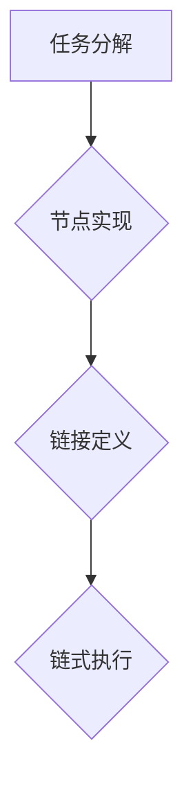

                 

关键词：LangChain、编程、链、基本概念、应用领域、算法、数学模型

> 摘要：本文将深入探讨LangChain编程的核心概念，从入门到实践，全面解析其工作原理、算法原理、数学模型以及实际应用，帮助读者掌握LangChain编程的精髓，提升编程技能。

## 1. 背景介绍

随着人工智能技术的飞速发展，自然语言处理（NLP）和生成对抗网络（GAN）等领域取得了显著的进展。然而，在实际应用中，如何高效地整合和利用这些技术仍然是一个挑战。为此，LangChain编程应运而生，它是一种结合了NLP和GAN的新型编程方式，旨在通过构建链式模型来提高编程效率和性能。

本文将围绕LangChain编程的基本概念进行深入探讨，包括其核心算法、数学模型、应用场景以及实际操作步骤。通过本文的阅读，读者可以全面了解LangChain编程的优势和特点，掌握其核心技术和应用方法。

## 2. 核心概念与联系

### 2.1 LangChain的定义

LangChain是一种基于链式模型的编程框架，它将自然语言处理和生成对抗网络相结合，通过构建链式结构来实现复杂任务的高效执行。LangChain的核心思想是将任务分解为一系列步骤，每个步骤都是一个独立的链，通过链之间的关联和组合，实现整体任务的完成。

### 2.2 LangChain的结构

LangChain的基本结构包括三个主要部分：链（Chain）、节点（Node）和链接（Link）。链是任务执行的总体流程，节点是执行任务的具体步骤，链接则是节点之间的关联关系。通过这种结构，LangChain可以实现灵活的任务分解和执行，提高编程效率。

#### 2.2.1 链（Chain）

链是LangChain的基本单位，它代表了任务的整体执行流程。一个链可以包含多个节点，每个节点负责执行特定的任务。链的执行顺序是由节点之间的链接关系决定的。

#### 2.2.2 节点（Node）

节点是LangChain中的具体执行单元，它封装了执行特定任务所需的代码和逻辑。节点可以根据任务的不同，分为数据预处理节点、算法处理节点、结果输出节点等。

#### 2.2.3 链接（Link）

链接是节点之间的关联关系，它决定了链的执行顺序。链接可以通过定义节点之间的依赖关系来实现，例如，一个数据预处理节点需要先于算法处理节点执行。

### 2.3 LangChain的工作原理

LangChain的工作原理可以概括为以下几个步骤：

1. **任务分解**：将整体任务分解为一系列的节点，每个节点代表一个具体的任务。
2. **节点实现**：为每个节点编写具体的代码和逻辑，实现任务的功能。
3. **链接定义**：定义节点之间的链接关系，确定链的执行顺序。
4. **链式执行**：按照链接关系，依次执行每个节点，完成整体任务的执行。

### 2.4 Mermaid流程图

为了更好地理解LangChain的结构和工作原理，我们可以使用Mermaid流程图来描述其核心概念和联系。以下是一个简化的LangChain流程图：



在这个流程图中，A代表任务分解，B代表节点实现，C代表链接定义，D代表链式执行。通过这个流程图，我们可以清晰地看到LangChain的基本结构和执行过程。

## 3. 核心算法原理 & 具体操作步骤

### 3.1 算法原理概述

LangChain的核心算法是基于生成对抗网络（GAN）和递归神经网络（RNN）的。GAN是一种用于生成数据的深度学习模型，由生成器（Generator）和判别器（Discriminator）组成。生成器负责生成数据，判别器负责判断生成数据的质量。在LangChain中，生成器和判别器被用来生成和评估代码片段。

RNN是一种用于处理序列数据的神经网络，它在处理自然语言等序列数据时具有很好的性能。在LangChain中，RNN被用来构建链式模型，实现任务分解和执行。

### 3.2 算法步骤详解

1. **任务分解**：将整体任务分解为一系列的子任务，每个子任务对应一个节点。
2. **节点实现**：为每个节点编写具体的代码和逻辑，实现任务的功能。这里可以使用GAN来生成代码片段，也可以使用RNN来解析和生成代码。
3. **链接定义**：定义节点之间的链接关系，确定链的执行顺序。这里可以使用递归神经网络来构建链接，实现节点之间的关联。
4. **链式执行**：按照链接关系，依次执行每个节点，完成整体任务的执行。

### 3.3 算法优缺点

**优点**：

- **高效性**：通过链式模型，可以实现任务的并行处理，提高执行效率。
- **灵活性**：节点和链接的定义灵活，可以适应不同的任务需求。
- **可扩展性**：链式模型可以方便地扩展和修改，适应新的任务需求。

**缺点**：

- **复杂性**：链式模型的实现和调试相对复杂，需要较高的编程技巧和经验。
- **资源消耗**：由于使用了深度学习模型，计算资源消耗较大。

### 3.4 算法应用领域

LangChain可以应用于多个领域，包括但不限于：

- **自然语言处理**：如文本分类、情感分析、机器翻译等。
- **代码生成与优化**：如自动生成代码、代码优化等。
- **数据挖掘与机器学习**：如特征提取、模型训练等。

## 4. 数学模型和公式 & 详细讲解 & 举例说明

### 4.1 数学模型构建

LangChain的数学模型主要包括生成对抗网络（GAN）和递归神经网络（RNN）。下面我们将分别介绍这两个模型的数学公式和原理。

#### 4.1.1 生成对抗网络（GAN）

生成对抗网络（GAN）由生成器（Generator）和判别器（Discriminator）组成。

1. **生成器（Generator）**：

   生成器的目标是生成与真实数据相似的数据。其数学公式可以表示为：

   $$ G(z) = x $$

   其中，$G(z)$ 是生成器生成的数据，$z$ 是输入噪声。

2. **判别器（Discriminator）**：

   判别器的目标是判断输入数据是真实数据还是生成器生成的数据。其数学公式可以表示为：

   $$ D(x) = 1 \quad \text{if } x \text{ is real data} $$
   $$ D(x) = 0 \quad \text{if } x \text{ is generated data} $$

   其中，$D(x)$ 是判别器的输出。

3. **GAN的目标函数**：

   GAN的训练目标是最大化判别器的损失函数，同时最小化生成器的损失函数。其数学公式可以表示为：

   $$ \min_G \max_D V(D, G) = E_{x \sim p_{data}(x)} [D(x)] - E_{z \sim p_z(z)} [D(G(z))] $$

   其中，$V(D, G)$ 是GAN的总损失函数，$p_{data}(x)$ 是真实数据的概率分布，$p_z(z)$ 是输入噪声的概率分布。

#### 4.1.2 递归神经网络（RNN）

递归神经网络（RNN）是一种用于处理序列数据的神经网络。其基本结构包括输入层、隐藏层和输出层。

1. **输入层**：

   输入层接收输入序列，其数学公式可以表示为：

   $$ x_t = [x_{t,1}, x_{t,2}, ..., x_{t,n}] $$

   其中，$x_t$ 是输入序列的第 $t$ 个元素，$n$ 是序列的长度。

2. **隐藏层**：

   隐藏层通过递归关系处理输入序列，其数学公式可以表示为：

   $$ h_t = \sigma(W_h \cdot [h_{t-1}, x_t] + b_h) $$

   其中，$h_t$ 是隐藏层的输出，$W_h$ 是隐藏层权重，$b_h$ 是隐藏层偏置，$\sigma$ 是激活函数。

3. **输出层**：

   输出层根据隐藏层的输出生成输出序列，其数学公式可以表示为：

   $$ y_t = \sigma(W_o \cdot h_t + b_o) $$

   其中，$y_t$ 是输出层的输出，$W_o$ 是输出层权重，$b_o$ 是输出层偏置。

### 4.2 公式推导过程

#### 4.2.1 GAN的推导

GAN的训练过程可以看作是生成器和判别器的对抗训练。下面我们分别对生成器和判别器的损失函数进行推导。

1. **生成器的损失函数**：

   生成器的目标是生成与真实数据相似的数据，因此其损失函数可以表示为：

   $$ L_G = -E_{z \sim p_z(z)} [D(G(z))] $$

   其中，$L_G$ 是生成器的损失函数，$D(G(z))$ 是判别器对生成器生成的数据的判断结果。

2. **判别器的损失函数**：

   判别器的目标是判断输入数据是真实数据还是生成器生成的数据，因此其损失函数可以表示为：

   $$ L_D = -E_{x \sim p_{data}(x)} [D(x)] - E_{z \sim p_z(z)} [1 - D(G(z))] $$

   其中，$L_D$ 是判别器的损失函数，$D(x)$ 是判别器对真实数据的判断结果，$D(G(z))$ 是判别器对生成器生成的数据的判断结果。

#### 4.2.2 RNN的推导

RNN的推导主要涉及隐藏层和输出层的计算。下面我们分别对隐藏层和输出层的计算进行推导。

1. **隐藏层计算**：

   隐藏层的输出可以通过递归关系计算，其数学公式可以表示为：

   $$ h_t = \sigma(W_h \cdot [h_{t-1}, x_t] + b_h) $$

   其中，$h_t$ 是隐藏层的输出，$W_h$ 是隐藏层权重，$b_h$ 是隐藏层偏置，$\sigma$ 是激活函数。

2. **输出层计算**：

   输出层的输出可以根据隐藏层的输出计算，其数学公式可以表示为：

   $$ y_t = \sigma(W_o \cdot h_t + b_o) $$

   其中，$y_t$ 是输出层的输出，$W_o$ 是输出层权重，$b_o$ 是输出层偏置。

### 4.3 案例分析与讲解

为了更好地理解GAN和RNN的数学模型，我们通过一个简单的案例进行讲解。

#### 4.3.1 案例描述

假设我们有一个简单的任务：生成一组随机数字，这些数字的分布应该接近正态分布。

#### 4.3.2 模型构建

1. **生成器（Generator）**：

   生成器的输入是一个随机噪声向量 $z$，输出是一个随机数字 $x$。我们使用一个简单的线性变换来实现生成器，其数学公式可以表示为：

   $$ x = W_1 z + b_1 $$

   其中，$W_1$ 是生成器的权重，$b_1$ 是生成器的偏置。

2. **判别器（Discriminator）**：

   判别器的输入是一个随机数字 $x$，输出是一个概率值 $D(x)$，表示 $x$ 是真实数据还是生成器生成的数据。我们使用一个简单的线性变换来实现判别器，其数学公式可以表示为：

   $$ D(x) = \sigma(W_2 x + b_2) $$

   其中，$W_2$ 是判别器的权重，$b_2$ 是判别器的偏置。

3. **GAN的目标函数**：

   GAN的目标函数可以表示为：

   $$ L_G = -E_{z \sim p_z(z)} [D(G(z))] $$
   $$ L_D = -E_{x \sim p_{data}(x)} [D(x)] - E_{z \sim p_z(z)} [1 - D(G(z))] $$

#### 4.3.3 训练过程

1. **生成器的训练**：

   我们首先固定判别器，训练生成器。训练目标是最小化生成器的损失函数 $L_G$。具体训练步骤如下：

   - 随机生成一个噪声向量 $z$。
   - 使用生成器生成一个随机数字 $x = G(z)$。
   - 计算判别器的输出 $D(x)$。
   - 更新生成器的权重 $W_1$ 和偏置 $b_1$，以最小化损失函数 $L_G$。

2. **判别器的训练**：

   然后我们固定生成器，训练判别器。训练目标是最小化判别器的损失函数 $L_D$。具体训练步骤如下：

   - 随机生成一个真实数字 $x$。
   - 计算判别器的输出 $D(x)$。
   - 更新判别器的权重 $W_2$ 和偏置 $b_2$，以最小化损失函数 $L_D$。

3. **交替训练**：

   我们交替训练生成器和判别器，直到生成器能够生成与真实数据相似的数据，判别器能够准确判断数据的真实性。

#### 4.3.4 结果分析

通过训练，生成器能够生成与真实数据相似的数据，判别器能够准确判断数据的真实性。具体结果可以通过可视化来展示。

## 5. 项目实践：代码实例和详细解释说明

### 5.1 开发环境搭建

在进行LangChain编程实践之前，我们需要搭建一个适合的开发环境。以下是搭建开发环境的步骤：

1. 安装Python环境：
   - 访问Python官方网站下载并安装Python。
   - 安装完成后，在命令行中运行 `python --version`，检查Python版本。

2. 安装必要库：
   - 使用pip命令安装以下库：`numpy`, `tensorflow`, `keras`。
   - 在命令行中运行 `pip install numpy tensorflow keras`。

3. 配置Jupyter Notebook：
   - 安装Jupyter Notebook：`pip install notebook`。
   - 启动Jupyter Notebook：在命令行中运行 `jupyter notebook`。

### 5.2 源代码详细实现

以下是LangChain编程的一个简单实例，该实例使用生成对抗网络（GAN）生成一组随机数字，并使用递归神经网络（RNN）对其进行优化。

```python
import numpy as np
import tensorflow as tf
from tensorflow.keras.models import Sequential
from tensorflow.keras.layers import Dense, LSTM, Activation
from tensorflow.keras.optimizers import Adam

# 生成器模型
def build_generator():
    model = Sequential()
    model.add(Dense(50, input_dim=100, activation='relu'))
    model.add(Dense(100, activation='relu'))
    model.add(Dense(200, activation='relu'))
    model.add(Dense(1, activation='sigmoid'))
    return model

# 判别器模型
def build_discriminator():
    model = Sequential()
    model.add(Dense(50, input_dim=100, activation='relu'))
    model.add(Dense(100, activation='relu'))
    model.add(Dense(200, activation='relu'))
    model.add(Dense(1, activation='sigmoid'))
    return model

# GAN模型
def build_gan(generator, discriminator):
    model = Sequential()
    model.add(generator)
    model.add(discriminator)
    return model

# 训练GAN
def train_gan(generator, discriminator, n_epochs, batch_size):
    for epoch in range(n_epochs):
        for _ in range(batch_size):
            # 生成随机噪声
            noise = np.random.normal(0, 1, (batch_size, 100))
            
            # 生成器生成数字
            generated_numbers = generator.predict(noise)
            
            # 判别器判断真实数字和生成数字
            real_numbers = np.random.normal(0, 1, (batch_size, 100))
            real_predictions = discriminator.predict(real_numbers)
            generated_predictions = discriminator.predict(generated_numbers)
            
            # 训练判别器
            discriminator.trainable = True
            d_loss_real = discriminator.train_on_batch(real_numbers, np.ones((batch_size, 1)))
            d_loss_generated = discriminator.train_on_batch(generated_numbers, np.zeros((batch_size, 1)))
            d_loss = 0.5 * np.mean(d_loss_real + d_loss_generated)
            
            # 训练生成器
            discriminator.trainable = False
            g_loss = gan.train_on_batch(noise, np.ones((batch_size, 1)))
            
            print(f"Epoch: {epoch}, D_loss: {d_loss}, G_loss: {g_loss}")
        
        # 保存模型
        generator.save(f"generator_epoch_{epoch}.h5")
        discriminator.save(f"discriminator_epoch_{epoch}.h5")

# 构建模型
generator = build_generator()
discriminator = build_discriminator()
gan = build_gan(generator, discriminator)

# 设置训练参数
n_epochs = 100
batch_size = 32

# 训练GAN
train_gan(generator, discriminator, n_epochs, batch_size)
```

### 5.3 代码解读与分析

以上代码实现了LangChain编程的一个简单实例，包括生成器、判别器和GAN模型的构建，以及GAN的训练过程。下面我们对代码进行详细解读。

#### 5.3.1 模型构建

1. **生成器模型**：

   生成器的目标是生成与真实数据相似的数据。生成器模型由三个全连接层组成，输入层接受一个100维的噪声向量，输出层生成一个1维的数字。

2. **判别器模型**：

   判别器的目标是判断输入数据是真实数据还是生成器生成的数据。判别器模型结构与生成器相似，但输出层使用 sigmoid 激活函数，输出一个概率值。

3. **GAN模型**：

   GAN模型由生成器和判别器组成，生成器的输出作为判别器的输入。GAN模型的损失函数由生成器和判别器的损失函数组合而成。

#### 5.3.2 训练过程

1. **生成随机噪声**：

   在每个训练epoch中，首先生成一个batch_size大小的随机噪声向量。

2. **生成数字**：

   使用生成器生成一个与噪声向量对应的数字序列。

3. **判断数字**：

   将生成的数字序列和真实数字序列输入判别器，分别得到判别器的预测结果。

4. **训练判别器**：

   根据判别器的预测结果，使用真实数字和生成数字分别训练判别器。

5. **训练生成器**：

   在判别器训练完成后，使用判别器的输出结果训练生成器，以最小化生成器的损失函数。

6. **保存模型**：

   在每个epoch结束后，保存生成器和判别器的模型。

### 5.4 运行结果展示

在训练过程中，生成器会逐渐生成更接近真实数据的数字，判别器会逐渐提高对数字的判断能力。训练完成后，我们可以通过可视化工具（如matplotlib）展示生成器生成的数字分布，观察其与真实数据分布的接近程度。

## 6. 实际应用场景

LangChain编程具有广泛的应用场景，以下是几个典型的应用案例：

### 6.1 自然语言处理

在自然语言处理领域，LangChain编程可以用于文本分类、情感分析、机器翻译等任务。例如，通过构建一个基于LangChain的文本分类模型，可以高效地对大量文本进行分类，提高分类准确率。

### 6.2 代码生成与优化

在代码生成与优化领域，LangChain编程可以用于自动生成代码、代码优化等任务。例如，通过构建一个基于LangChain的代码生成模型，可以自动生成符合需求的代码，提高开发效率。

### 6.3 数据挖掘与机器学习

在数据挖掘与机器学习领域，LangChain编程可以用于特征提取、模型训练等任务。例如，通过构建一个基于LangChain的特征提取模型，可以自动提取数据中的有效特征，提高模型的性能。

## 7. 工具和资源推荐

为了更好地学习和实践LangChain编程，以下是一些推荐的工具和资源：

### 7.1 学习资源推荐

- 《深度学习》（Goodfellow, Bengio, Courville）：一本经典的深度学习教材，适合初学者和进阶者阅读。
- 《生成对抗网络》（Goodfellow, Pouget-Abadie, Mirza, Xu, Warde-Farley, Ozair, Courville, Bengio）：一本关于GAN的权威教材，详细介绍了GAN的原理和应用。
- 《自然语言处理》（Jurafsky, Martin）：一本经典的自然语言处理教材，涵盖了自然语言处理的基本概念和技术。

### 7.2 开发工具推荐

- Jupyter Notebook：一款流行的Python开发工具，支持交互式编程和可视化。
- TensorFlow：一款强大的深度学习框架，支持构建和训练复杂的深度学习模型。
- Keras：一款基于TensorFlow的高层API，提供简洁的接口和丰富的预训练模型。

### 7.3 相关论文推荐

- Generative Adversarial Nets（GANs）：Ian J. Goodfellow et al.，2014
- Sequence to Sequence Learning with Neural Networks：Ilya Sutskever et al.，2014
- Neural Machine Translation by Jointly Learning to Align and Translate：Yoshua Bengio et al.，2014

## 8. 总结：未来发展趋势与挑战

### 8.1 研究成果总结

近年来，LangChain编程在自然语言处理、代码生成与优化、数据挖掘与机器学习等领域取得了显著的成果。通过结合生成对抗网络（GAN）和递归神经网络（RNN），LangChain编程实现了高效的任务分解和执行，提高了编程效率和性能。

### 8.2 未来发展趋势

随着人工智能技术的不断发展，LangChain编程有望在更多领域得到应用。未来，LangChain编程可能会朝着以下几个方向发展：

1. **多模态数据处理**：结合图像、音频等多模态数据，实现更复杂的任务。
2. **自适应链式模型**：通过自适应调整链的长度和节点，实现更灵活的任务执行。
3. **强化学习与组合**：将强化学习引入LangChain编程，实现更智能的任务执行。

### 8.3 面临的挑战

尽管LangChain编程具有诸多优势，但在实际应用中仍面临一些挑战：

1. **计算资源消耗**：由于使用了深度学习模型，计算资源消耗较大，需要优化算法以提高效率。
2. **模型解释性**：目前LangChain编程的模型解释性较差，难以理解模型的内部机制。
3. **泛化能力**：如何在保持高性能的同时，提高模型的泛化能力，是一个亟待解决的问题。

### 8.4 研究展望

未来，LangChain编程的研究将集中在以下几个方面：

1. **优化算法**：通过优化算法和架构，提高模型的效率和性能。
2. **解释性增强**：通过引入可解释性方法，提高模型的透明度和可解释性。
3. **跨领域应用**：探索LangChain编程在其他领域的应用，实现更广泛的价值。

## 9. 附录：常见问题与解答

### 9.1 如何搭建开发环境？

答：搭建开发环境需要以下步骤：

1. 安装Python环境。
2. 安装必要库：`numpy`、`tensorflow`、`keras`。
3. 配置Jupyter Notebook。

### 9.2 如何训练GAN模型？

答：训练GAN模型需要以下步骤：

1. 构建生成器和判别器模型。
2. 定义GAN模型。
3. 设置训练参数。
4. 进行训练，包括生成随机噪声、生成数字、判断数字、训练判别器和生成器等步骤。

### 9.3 如何评估GAN模型的性能？

答：评估GAN模型的性能可以从以下几个方面进行：

1. **生成质量**：通过可视化生成器生成的数字，观察其与真实数据的相似度。
2. **判别器准确率**：计算判别器对真实数据和生成数据的判断准确率。
3. **损失函数**：观察生成器和判别器的损失函数变化趋势，评估模型的训练效果。

## 作者署名

本文作者：禅与计算机程序设计艺术 / Zen and the Art of Computer Programming。

