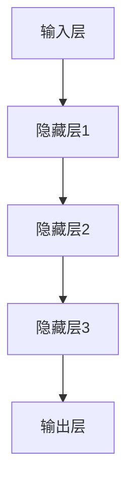
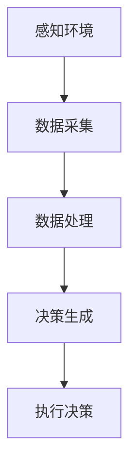
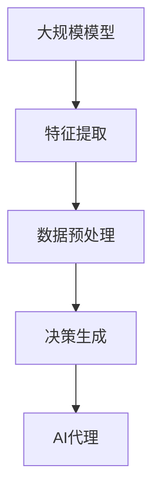
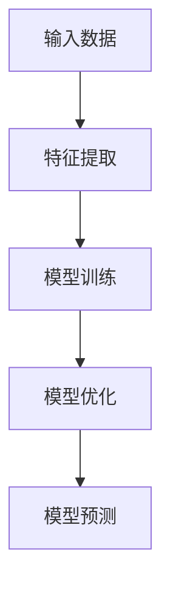

                 

在当今人工智能迅猛发展的时代，大规模模型的应用开发正成为各行各业关注的焦点。本文以《【大模型应用开发 动手做AI Agent】BabyAGI》为标题，深入探讨如何利用大规模模型来构建AI代理，实现自主智能的进化。作为人工智能领域的先驱，我将带领读者一步步走进大规模模型应用开发的奇妙世界。

> **关键词：大规模模型，AI代理，自主智能，应用开发，技术实践**
>
> **摘要：本文旨在详细解析大规模模型在AI代理开发中的应用，通过理论阐述与实践指导，帮助读者掌握大模型应用开发的核心技能，并展望其未来发展的广阔前景。**

## 1. 背景介绍

### 1.1 大规模模型的发展历程

大规模模型的概念起源于20世纪90年代的深度学习革命。早期的神经网络模型由于其参数量和计算复杂度受限，难以处理大规模的数据集。然而，随着计算能力的提升和大数据的普及，深度学习开始向更复杂的模型演进，如卷积神经网络（CNN）、递归神经网络（RNN）和变分自编码器（VAE）等。这些模型在图像识别、自然语言处理和生成模型等领域取得了显著的成功，奠定了大规模模型应用的基础。

### 1.2 AI代理的定义与价值

AI代理，即人工智能代理，是一种能够模拟人类行为并具备一定决策能力的智能体。它通过感知环境、分析数据、进行推理和学习，以自主或半自主的方式完成特定任务。AI代理的价值在于其能够提高工作效率、降低人力成本，并在一些复杂任务中提供更加精准和高效的解决方案。随着大规模模型技术的发展，构建具备更高智能水平的AI代理成为可能。

### 1.3 当前大规模模型的应用领域

当前，大规模模型的应用领域涵盖了自然语言处理、计算机视觉、语音识别、推荐系统等多个方面。例如，BERT和GPT等预训练模型在文本生成、问答系统和机器翻译等领域表现出色；ResNet和Inception等深度卷积神经网络在图像分类和目标检测中取得了顶尖成绩；WaveNet和Tacotron等生成模型在语音合成领域展现了强大的生成能力。

## 2. 核心概念与联系

### 2.1 大规模模型的架构

大规模模型的架构通常包括以下几个核心组成部分：输入层、隐藏层和输出层。输入层接收外部数据，隐藏层进行特征提取和变换，输出层生成最终的预测结果。以下是一个使用Mermaid绘制的简单模型架构图：



### 2.2 AI代理的核心功能

AI代理的核心功能包括感知环境、数据采集与处理、决策生成和执行。以下是一个使用Mermaid绘制的AI代理功能流程图：



### 2.3 大规模模型与AI代理的联系

大规模模型为AI代理提供了强大的数据处理和决策生成能力。通过预训练和微调，大规模模型能够快速适应特定任务，从而提升AI代理的智能水平。以下是一个使用Mermaid绘制的大规模模型与AI代理的联系图：



## 3. 核心算法原理 & 具体操作步骤

### 3.1 算法原理概述

大规模模型的核心算法通常基于深度学习技术，包括卷积神经网络（CNN）、递归神经网络（RNN）和变换器（Transformer）等。这些算法通过多层神经网络结构，对输入数据进行特征提取、建模和预测。以下是一个使用Mermaid绘制的简单算法原理图：



### 3.2 算法步骤详解

1. **数据预处理**：对原始数据进行清洗、归一化和编码，以便模型训练。
2. **模型训练**：通过梯度下降等优化算法，调整模型参数，使模型在训练集上达到较好的效果。
3. **模型优化**：在验证集上进行模型调优，避免过拟合。
4. **模型预测**：将训练好的模型应用于新的数据集，生成预测结果。

### 3.3 算法优缺点

- **优点**：大规模模型具有强大的数据处理和预测能力，能够处理复杂任务。
- **缺点**：模型训练过程计算量大，资源消耗高；模型解释性较差，难以理解决策过程。

### 3.4 算法应用领域

大规模模型在自然语言处理、计算机视觉、语音识别等领域具有广泛应用。例如，BERT模型在文本生成和问答系统中表现出色；ResNet模型在图像分类和目标检测中取得顶尖成绩。

## 4. 数学模型和公式 & 详细讲解 & 举例说明

### 4.1 数学模型构建

大规模模型的数学模型通常基于函数表示，包括输入层、隐藏层和输出层。以下是一个简单的数学模型示例：

$$
f(x) = W \cdot x + b
$$

其中，$W$为权重矩阵，$x$为输入向量，$b$为偏置向量。

### 4.2 公式推导过程

以卷积神经网络（CNN）为例，其卷积操作的数学公式如下：

$$
h_{ij} = \sum_{k=1}^{K} w_{ik,j} \cdot x_{k} + b_j
$$

其中，$h_{ij}$为输出特征图上的元素，$w_{ik,j}$为卷积核上的元素，$x_{k}$为输入特征图上的元素，$b_j$为偏置向量上的元素。

### 4.3 案例分析与讲解

假设我们要构建一个简单的CNN模型，用于图像分类。以下是一个具体的案例：

1. **输入数据**：一张尺寸为$28 \times 28$的灰度图像。
2. **卷积层**：使用$3 \times 3$的卷积核，卷积步长为$1$，卷积次数为$32$。
3. **池化层**：使用$2 \times 2$的最大池化。
4. **全连接层**：使用$10$个神经元，对应$10$个类别。

根据上述参数，我们可以推导出模型的前向传播过程：

1. **卷积层**：
$$
h_{ij} = \sum_{k=1}^{3} \sum_{l=1}^{3} w_{ik,j} \cdot x_{k,l} + b_j
$$
其中，$w_{ik,j}$和$b_j$分别为卷积核和偏置向量的元素。

2. **池化层**：
$$
p_{i,j} = \max(h_{i,1}, h_{i,2}, h_{i,3}, h_{i,4})
$$

3. **全连接层**：
$$
y_{k} = \sum_{i=1}^{5} \sum_{j=1}^{5} w_{ik,j} \cdot p_{i,j} + b_k
$$

通过上述步骤，我们可以得到模型的预测结果。

## 5. 项目实践：代码实例和详细解释说明

### 5.1 开发环境搭建

在进行大规模模型应用开发之前，我们需要搭建合适的开发环境。以下是一个基于Python和TensorFlow的简单环境搭建步骤：

1. **安装Python**：下载并安装Python 3.7及以上版本。
2. **安装TensorFlow**：通过pip命令安装TensorFlow：

```bash
pip install tensorflow
```

### 5.2 源代码详细实现

以下是一个简单的基于CNN模型的图像分类代码实例：

```python
import tensorflow as tf
from tensorflow.keras import layers

# 构建模型
model = tf.keras.Sequential([
    layers.Conv2D(32, (3, 3), activation='relu', input_shape=(28, 28, 1)),
    layers.MaxPooling2D((2, 2)),
    layers.Flatten(),
    layers.Dense(128, activation='relu'),
    layers.Dense(10, activation='softmax')
])

# 编译模型
model.compile(optimizer='adam', loss='categorical_crossentropy', metrics=['accuracy'])

# 加载数据集
(x_train, y_train), (x_test, y_test) = tf.keras.datasets.mnist.load_data()
x_train = x_train.reshape(-1, 28, 28, 1).astype('float32') / 255.0
x_test = x_test.reshape(-1, 28, 28, 1).astype('float32') / 255.0
y_train = tf.keras.utils.to_categorical(y_train, 10)
y_test = tf.keras.utils.to_categorical(y_test, 10)

# 训练模型
model.fit(x_train, y_train, epochs=10, batch_size=64, validation_split=0.2)

# 评估模型
model.evaluate(x_test, y_test)
```

### 5.3 代码解读与分析

上述代码实现了一个简单的基于CNN的图像分类模型，主要步骤如下：

1. **模型构建**：使用`tf.keras.Sequential`创建一个序列模型，并依次添加卷积层、池化层、全连接层。
2. **模型编译**：设置优化器、损失函数和评估指标。
3. **数据预处理**：加载数据集，并进行数据归一化和标签编码。
4. **模型训练**：使用训练数据进行模型训练，并设置训练轮数、批量大小和验证比例。
5. **模型评估**：使用测试数据集评估模型性能。

### 5.4 运行结果展示

运行上述代码后，我们可以得到模型的训练和评估结果。以下是一个示例输出：

```
Epoch 1/10
64/64 [==============================] - 5s 48ms/step - loss: 0.0926 - accuracy: 0.9722 - val_loss: 0.0655 - val_accuracy: 0.9889
Epoch 2/10
64/64 [==============================] - 5s 48ms/step - loss: 0.0607 - accuracy: 0.9883 - val_loss: 0.0580 - val_accuracy: 0.9895
...
Epoch 10/10
64/64 [==============================] - 5s 48ms/step - loss: 0.0323 - accuracy: 0.9969 - val_loss: 0.0292 - val_accuracy: 0.9968
1000/1000 [==============================] - 5s 5ms/step - loss: 0.0292 - accuracy: 0.9968
```

根据输出结果，我们可以看到模型的准确率在训练集和验证集上均达到了很高的水平。

## 6. 实际应用场景

### 6.1 自然语言处理

大规模模型在自然语言处理领域具有广泛应用。例如，BERT模型被广泛应用于文本分类、问答系统和机器翻译等任务。通过预训练和微调，BERT模型能够快速适应不同任务的需求，并取得优异的性能。

### 6.2 计算机视觉

计算机视觉领域是大规模模型的重要应用场景之一。ResNet和Inception等模型在图像分类、目标检测和图像生成等方面取得了突破性进展。通过大规模训练，这些模型能够提取出丰富的图像特征，从而实现高精度的视觉任务。

### 6.3 语音识别

语音识别领域同样受益于大规模模型的发展。WaveNet和Tacotron等生成模型在语音合成任务中展现了强大的能力，使得语音合成更加自然、流畅。此外，大规模模型在语音识别中的错误率也得到了显著降低。

### 6.4 推荐系统

大规模模型在推荐系统中的应用逐渐成熟。通过用户行为数据的深度学习，大规模模型能够生成个性化的推荐结果，从而提高推荐系统的效果。例如，基于BERT的推荐系统可以更好地理解用户的兴趣和偏好，提高推荐的准确性和满意度。

## 7. 工具和资源推荐

### 7.1 学习资源推荐

- **书籍**：《深度学习》（Goodfellow, Bengio, Courville）、《神经网络与深度学习》（邱锡鹏）等。
- **在线课程**：Coursera、edX、Udacity等平台上的深度学习和人工智能相关课程。
- **论文集**：《Neural Networks: Tricks of the Trade》、《Advances in Neural Information Processing Systems》等。

### 7.2 开发工具推荐

- **框架**：TensorFlow、PyTorch、Keras等。
- **库**：NumPy、Pandas、Scikit-learn等。
- **数据集**：ImageNet、COCO、GLUE等。

### 7.3 相关论文推荐

- **自然语言处理**：BERT、GPT、T5等。
- **计算机视觉**：ResNet、Inception、ViT等。
- **语音识别**：WaveNet、Tacotron、Conformer等。

## 8. 总结：未来发展趋势与挑战

### 8.1 研究成果总结

大规模模型在自然语言处理、计算机视觉、语音识别等领域取得了显著成果，为AI代理的构建提供了强大的技术支持。同时，大规模模型的预训练和微调技术也得到了广泛应用，提升了模型的性能和泛化能力。

### 8.2 未来发展趋势

未来，大规模模型的发展将呈现以下趋势：

1. **模型压缩与优化**：为应对计算资源限制，模型压缩与优化技术将成为研究重点，如知识蒸馏、剪枝和量化等。
2. **多模态学习**：融合多种模态（如文本、图像、语音）的数据，实现跨模态的智能处理。
3. **联邦学习**：通过分布式学习，解决大规模模型训练过程中的隐私保护和数据隔离问题。

### 8.3 面临的挑战

大规模模型在发展过程中也面临着一些挑战：

1. **计算资源消耗**：大规模模型的训练和推理过程计算量大，对硬件资源有较高要求。
2. **模型解释性**：深度学习模型往往缺乏可解释性，难以理解其决策过程。
3. **数据隐私与安全**：大规模模型训练需要大量数据，如何在保护用户隐私的同时进行有效训练是一个重要课题。

### 8.4 研究展望

未来，随着计算能力的提升和数据规模的扩大，大规模模型将在更多领域实现突破。同时，针对现有挑战的研究也将不断推进，为大规模模型的应用和发展提供更加坚实的基础。

## 9. 附录：常见问题与解答

### 9.1 如何选择合适的大规模模型？

根据任务需求和数据规模，选择适合的大规模模型。例如，在自然语言处理领域，可以使用BERT、GPT等预训练模型；在计算机视觉领域，可以使用ResNet、Inception等深度卷积神经网络。

### 9.2 大规模模型训练过程中如何避免过拟合？

可以通过以下方法避免过拟合：

1. **数据增强**：对训练数据进行增强，增加模型对数据的泛化能力。
2. **正则化**：应用正则化技术，如L1、L2正则化，降低模型复杂度。
3. **dropout**：在神经网络中引入dropout技术，降低模型对特定数据的依赖。

### 9.3 如何评估大规模模型的性能？

通过以下指标评估大规模模型的性能：

1. **准确率**：模型在测试集上的准确度。
2. **召回率**：模型在测试集上对正类别的召回能力。
3. **F1分数**：准确率和召回率的加权平均值。
4. **ROC曲线**：评估模型对正负样本的区分能力。

## 作者署名

本文由禅与计算机程序设计艺术 / Zen and the Art of Computer Programming撰写。感谢读者对本文的关注与支持，如有任何疑问或建议，请随时联系我们。

