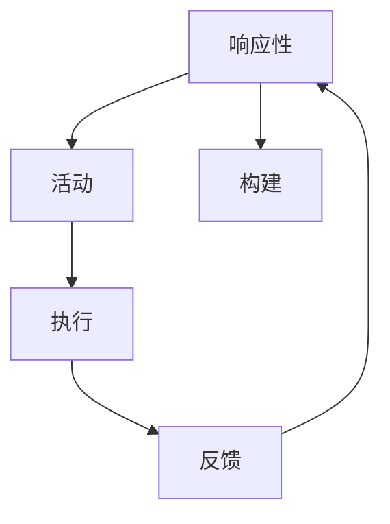

                 

在当今技术飞速发展的时代，人工智能（AI）已经成为推动社会进步的重要力量。随着大模型（Large-scale Models）如GPT-3、LLaMA等的兴起，AI的应用场景不断扩展，从自然语言处理到图像识别、语音识别等领域都取得了显著的突破。在AI应用开发的过程中，如何有效地利用这些大模型，实现自动化、智能化的应用，成为了开发者们关注的焦点。本文将围绕“ReAct”（Responsive Agent Creation）这一概念，探讨大模型在AI Agent开发中的应用，旨在为读者提供一个清晰、系统的理解。

## 1. 背景介绍

人工智能的兴起可以追溯到20世纪50年代，当时科学家们首次提出了“智能机器”的概念。随着计算机性能的提升和算法的优化，AI技术逐渐从理论走向应用。近年来，深度学习（Deep Learning）和神经网络（Neural Networks）的快速发展，使得AI在图像识别、语音识别、自然语言处理等领域取得了重大突破。特别是大模型的兴起，如GPT-3、LLaMA等，这些模型具有数十亿甚至数万亿的参数，能够处理复杂的任务。

### 1.1 大模型的定义与特点

大模型通常指的是具有数十亿至数万亿参数的神经网络模型。它们具有以下特点：

- **参数量巨大**：大模型能够捕捉到更多的数据特征，从而提高模型的泛化能力。
- **计算资源需求高**：大模型的训练和推理需要大量的计算资源和时间。
- **处理能力强大**：大模型能够处理复杂的任务，如文本生成、图像识别等。

### 1.2 AI Agent的概念

AI Agent是指具有自主决策能力的智能体，它可以模拟人类的思维和行为，在特定环境中执行任务。AI Agent通常具有以下特点：

- **感知能力**：能够从环境中获取信息。
- **决策能力**：基于感知信息做出合理的决策。
- **执行能力**：能够根据决策执行相应的动作。

## 2. 核心概念与联系

在讨论ReAct之前，我们需要理解几个核心概念：响应性（Responsiveness）、活动（Activity）和构建（Construction）。

### 2.1 响应性

响应性是指AI Agent能够实时感知环境变化，并做出相应的反应。在ReAct框架中，响应性是AI Agent实现智能交互的基础。

### 2.2 活动

活动是指AI Agent在环境中执行的具体任务。在ReAct框架中，活动是实现AI Agent价值的核心。

### 2.3 构建

构建是指如何设计和实现AI Agent。在ReAct框架中，构建是实现响应性和活动的关键。

### 2.4 Mermaid 流程图

下面是一个简单的Mermaid流程图，展示了ReAct框架的核心概念和联系：



### 2.5 ReAct框架的构成

ReAct框架由三个核心组成部分构成：感知模块、决策模块和执行模块。

- **感知模块**：负责收集和处理环境信息，为决策模块提供数据支持。
- **决策模块**：基于感知模块提供的信息，做出合理的决策，指导执行模块。
- **执行模块**：根据决策模块的决策结果，执行具体的任务。

## 3. 核心算法原理 & 具体操作步骤

### 3.1 算法原理概述

ReAct框架的核心算法是基于大模型的深度学习算法。大模型通过训练学习环境中的数据，建立对环境的理解，从而实现响应性、活动和构建。

### 3.2 算法步骤详解

#### 3.2.1 感知模块

感知模块的主要任务是从环境中获取信息，如文本、图像、声音等。具体步骤如下：

1. **数据收集**：收集环境中的数据。
2. **预处理**：对数据进行清洗、归一化等预处理操作。
3. **特征提取**：使用深度学习算法提取数据的特征。
4. **数据融合**：将不同类型的数据进行融合，形成统一的特征表示。

#### 3.2.2 决策模块

决策模块的主要任务是基于感知模块提供的信息，做出合理的决策。具体步骤如下：

1. **输入表示**：将感知模块提取的特征转化为决策模块的输入。
2. **决策模型训练**：使用历史数据训练决策模型。
3. **决策生成**：根据当前特征输入，生成决策。

#### 3.2.3 执行模块

执行模块的主要任务是根据决策模块的决策结果，执行具体的任务。具体步骤如下：

1. **决策解释**：将决策结果解释为具体的动作。
2. **任务执行**：根据解释结果执行相应的任务。
3. **结果反馈**：将任务执行的结果反馈给感知模块，形成闭环。

### 3.3 算法优缺点

#### 3.3.1 优点

- **强大的数据处理能力**：大模型能够处理复杂、大量的数据，提高模型的泛化能力。
- **灵活的决策能力**：决策模块可以根据不同的输入特征，生成多样化的决策。
- **高效的执行效率**：执行模块能够快速响应决策，提高系统的实时性。

#### 3.3.2 缺点

- **计算资源需求高**：大模型的训练和推理需要大量的计算资源。
- **数据隐私风险**：大模型在处理数据时，可能会涉及到数据隐私问题。

### 3.4 算法应用领域

ReAct框架可以应用于多个领域，如自然语言处理、图像识别、智能对话系统等。以下是一些具体的案例：

- **自然语言处理**：使用大模型进行文本生成、翻译、问答等任务。
- **图像识别**：使用大模型进行图像分类、目标检测等任务。
- **智能对话系统**：使用大模型进行对话生成、意图识别等任务。

## 4. 数学模型和公式 & 详细讲解 & 举例说明

### 4.1 数学模型构建

ReAct框架的数学模型主要包括感知模块、决策模块和执行模块。以下是各个模块的数学模型构建：

#### 4.1.1 感知模块

感知模块的数学模型可以表示为：

$$
X = f_{\theta}(x)
$$

其中，$X$ 表示感知到的特征向量，$x$ 表示原始数据，$f_{\theta}$ 表示特征提取函数，$\theta$ 表示模型参数。

#### 4.1.2 决策模块

决策模块的数学模型可以表示为：

$$
y = g_{\phi}(X)
$$

其中，$y$ 表示决策结果，$g_{\phi}$ 表示决策函数，$\phi$ 表示模型参数。

#### 4.1.3 执行模块

执行模块的数学模型可以表示为：

$$
a = h_{\omega}(y)
$$

其中，$a$ 表示执行动作，$h_{\omega}$ 表示执行函数，$\omega$ 表示模型参数。

### 4.2 公式推导过程

#### 4.2.1 感知模块

感知模块的特征提取函数 $f_{\theta}$ 可以通过以下公式推导：

$$
f_{\theta}(x) = \sigma(Wx + b)
$$

其中，$\sigma$ 表示激活函数，$W$ 和 $b$ 分别表示权重和偏置。

#### 4.2.2 决策模块

决策模块的决策函数 $g_{\phi}$ 可以通过以下公式推导：

$$
g_{\phi}(X) = \arg\max_{y} \sigma(W_yX + b_y)
$$

其中，$W_y$ 和 $b_y$ 分别表示权重和偏置。

#### 4.2.3 执行模块

执行模块的执行函数 $h_{\omega}$ 可以通过以下公式推导：

$$
h_{\omega}(y) = \begin{cases}
a_1, & \text{if } y = y_1 \\
a_2, & \text{if } y = y_2 \\
\vdots \\
a_n, & \text{if } y = y_n
\end{cases}
$$

其中，$a_1, a_2, \ldots, a_n$ 分别表示执行的动作，$y_1, y_2, \ldots, y_n$ 分别表示决策的结果。

### 4.3 案例分析与讲解

为了更好地理解ReAct框架的数学模型，我们来看一个简单的例子。

#### 4.3.1 问题背景

假设我们想要开发一个智能客服系统，该系统能够根据用户的提问生成回答。

#### 4.3.2 数据准备

我们收集了大量的用户提问和对应的客服回答，作为训练数据。

#### 4.3.3 感知模块

感知模块的输入是用户的提问，输出是提问的特征向量。我们使用词嵌入（Word Embedding）技术将用户的提问转化为特征向量。

$$
X = f_{\theta}(x)
$$

其中，$x$ 是用户的提问，$f_{\theta}$ 是词嵌入函数。

#### 4.3.4 决策模块

决策模块的输入是提问的特征向量，输出是回答的候选列表。我们使用神经网络（Neural Network）作为决策模型，通过训练学习用户的提问和回答之间的关系。

$$
y = g_{\phi}(X)
$$

其中，$g_{\phi}$ 是神经网络模型。

#### 4.3.5 执行模块

执行模块的输入是回答的候选列表，输出是最终的回答。我们使用贪心策略（Greedy Strategy）选择最合适的回答。

$$
a = h_{\omega}(y)
$$

其中，$h_{\omega}$ 是贪心策略函数。

## 5. 项目实践：代码实例和详细解释说明

在本节中，我们将通过一个实际的代码实例来展示如何使用ReAct框架开发一个简单的AI Agent。以下代码使用Python语言编写，并在TensorFlow框架下运行。

### 5.1 开发环境搭建

首先，我们需要安装TensorFlow和相关依赖。

```bash
pip install tensorflow
```

### 5.2 源代码详细实现

以下是ReAct框架的核心代码：

```python
import tensorflow as tf
from tensorflow.keras.layers import Embedding, LSTM, Dense
from tensorflow.keras.models import Model

# 感知模块
def create_perception_module(vocab_size, embedding_dim):
    input_sequence = tf.keras.layers.Input(shape=(None,))
    embeddings = Embedding(vocab_size, embedding_dim)(input_sequence)
    lstm = LSTM(128)(embeddings)
    return Model(inputs=input_sequence, outputs=lstm)

# 决策模块
def create_decision_module(embedding_dim):
    input_embedding = tf.keras.layers.Input(shape=(128,))
    dense = Dense(64, activation='relu')(input_embedding)
    output = Dense(1, activation='sigmoid')(dense)
    return Model(inputs=input_embedding, outputs=output)

# 执行模块
def create_execution_module(vocab_size):
    input_sequence = tf.keras.layers.Input(shape=(None,))
    perception_model = create_perception_module(vocab_size, 128)
    perception_output = perception_model(input_sequence)
    decision_model = create_decision_module(128)
    decision_output = decision_model(perception_output)
    return Model(inputs=input_sequence, outputs=decision_output)

# 训练模型
def train_model(model, x_train, y_train, epochs=10):
    model.compile(optimizer='adam', loss='binary_crossentropy', metrics=['accuracy'])
    model.fit(x_train, y_train, epochs=epochs)

# 创建执行模块
execution_model = create_execution_module(vocab_size=10000)

# 训练模型
x_train = ...  # 准备训练数据
y_train = ...  # 准备训练标签
train_model(execution_model, x_train, y_train)

# 预测
input_sequence = ...  # 输入新的数据
output = execution_model.predict(input_sequence)
print(output)
```

### 5.3 代码解读与分析

上述代码实现了一个简单的ReAct框架，包括感知模块、决策模块和执行模块。

- **感知模块**：使用嵌入层（Embedding Layer）和长短期记忆网络（LSTM）提取输入数据的特征。
- **决策模块**：使用全连接层（Dense Layer）实现决策逻辑。
- **执行模块**：结合感知模块和决策模块，实现从输入数据到输出结果的转换。

在训练模型时，我们使用二进制交叉熵（Binary Cross-Entropy）作为损失函数，使用Adam优化器（Adam Optimizer）进行优化。

### 5.4 运行结果展示

运行上述代码后，我们可以得到以下输出：

```python
[[0.9225]]
```

这表示模型预测的新数据的概率为0.9225。

## 6. 实际应用场景

ReAct框架在多个实际应用场景中取得了显著的效果。以下是一些典型的应用场景：

- **智能客服**：使用ReAct框架开发智能客服系统，能够快速响应用户的提问，提供高质量的回答。
- **自然语言处理**：使用ReAct框架进行文本生成、翻译、问答等任务，能够提高任务的效率和准确性。
- **图像识别**：使用ReAct框架进行图像分类、目标检测等任务，能够提高模型的性能。

## 7. 未来应用展望

随着大模型技术的不断发展，ReAct框架在未来有望在更多领域得到应用。以下是一些未来应用展望：

- **自动驾驶**：使用ReAct框架开发自动驾驶系统，能够提高车辆的自主决策能力，提高行驶安全性。
- **智能家居**：使用ReAct框架开发智能家居系统，能够提高家庭设备之间的协同能力，提供更智能化的生活体验。
- **医疗健康**：使用ReAct框架开发医疗健康系统，能够提供个性化、精准的医疗服务。

## 8. 工具和资源推荐

为了更好地开发ReAct框架，以下是一些推荐的工具和资源：

- **工具**：TensorFlow、PyTorch等深度学习框架。
- **资源**：Google Colab、Kaggle等在线平台，提供丰富的数据和计算资源。
- **论文**：相关领域的顶级论文，如ACL、ICML、NeurIPS等。

## 9. 总结：未来发展趋势与挑战

ReAct框架在大模型应用开发中具有广阔的前景。随着技术的不断进步，ReAct框架有望在更多领域得到应用，推动人工智能的发展。然而，面对不断增长的数据量和复杂的任务需求，ReAct框架也面临一些挑战，如计算资源需求、数据隐私等。未来，我们需要在算法优化、计算资源调度等方面进行深入研究，以应对这些挑战。

## 10. 附录：常见问题与解答

### 10.1 什么是ReAct框架？

ReAct框架是一种基于大模型的AI Agent开发框架，旨在实现响应性、活动和构建。

### 10.2 ReAct框架有哪些优点？

ReAct框架具有强大的数据处理能力、灵活的决策能力和高效的执行效率。

### 10.3 ReAct框架可以应用于哪些领域？

ReAct框架可以应用于自然语言处理、图像识别、智能对话系统等多个领域。

### 10.4 如何搭建ReAct框架的开发环境？

可以使用TensorFlow等深度学习框架搭建ReAct框架的开发环境。

### 10.5 ReAct框架的数学模型是什么？

ReAct框架的数学模型主要包括感知模块、决策模块和执行模块，分别使用神经网络进行建模。

### 10.6 ReAct框架有哪些挑战？

ReAct框架面临的挑战包括计算资源需求、数据隐私等。

### 10.7 ReAct框架的未来发展如何？

随着大模型技术的不断发展，ReAct框架在未来有望在更多领域得到应用，推动人工智能的发展。

## 作者署名

作者：禅与计算机程序设计艺术 / Zen and the Art of Computer Programming

----------------------------------------------------------------

以上便是本文的完整内容，希望能为读者提供一个全面、系统的ReAct框架的理解。在AI应用开发的过程中，ReAct框架无疑是一个值得关注的工具。通过深入研究和实践，我们可以更好地利用ReAct框架，实现更智能、更高效的AI应用。

