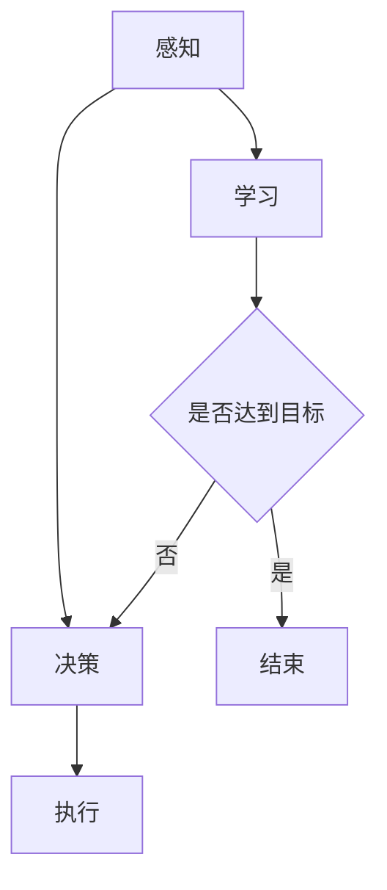
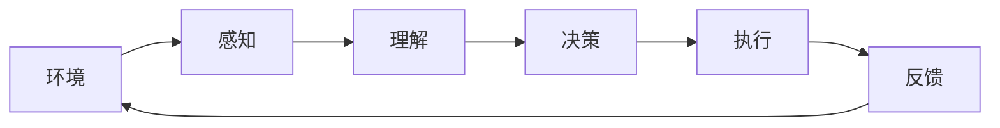

                 

关键词：大模型应用，AI Agent，认知框架，多智能体系统，强化学习，深度学习

摘要：本文将探讨大模型应用开发中，AI Agent的认知框架。通过介绍多智能体系统的基本概念、核心算法原理、数学模型和公式，以及实际应用场景，分析AI Agent的认知框架在多智能体系统中的重要作用和未来发展趋势。

## 1. 背景介绍

随着人工智能技术的快速发展，大模型在各个领域的应用越来越广泛。大模型（Large Models）通常是指那些具有巨大参数量、能够处理海量数据、并在特定任务上表现出色的深度学习模型。AI Agent则是人工智能领域中的一种重要概念，它是一种能够自主行动并具有感知、决策和执行能力的实体。本文将探讨在开发大模型应用时，AI Agent如何构建认知框架，实现有效的学习和决策。

### 大模型的发展历程

大模型的发展历程可以分为几个阶段：

1. **传统模型**：最初的深度学习模型，如多层感知机（MLP）、卷积神经网络（CNN）等，它们具有较小的参数量。
2. **中型模型**：随着计算能力的提升，出现了如ResNet、DenseNet等中型模型，它们在参数量和计算量上有所增加。
3. **大型模型**：近年来，GPT、BERT等大型模型的出现，将参数量和计算量提升到了前所未有的高度。

### AI Agent的定义

AI Agent是一种模拟人类智能的实体，具有以下特征：

- **感知**：通过传感器收集外部信息。
- **决策**：根据收集的信息，做出合理的决策。
- **执行**：根据决策，执行相应的动作。

## 2. 核心概念与联系

### 多智能体系统

多智能体系统（Multi-Agent Systems，MAS）是指由多个智能体组成的系统，这些智能体之间可以相互协作或竞争，以实现共同的目标。在多智能体系统中，每个智能体都是独立的个体，具有自主决策和行动的能力。

### 核心算法原理

多智能体系统的核心算法主要包括：

- **强化学习**：通过不断试错，学习如何在与环境的交互中取得最大收益。
- **深度学习**：利用神经网络模型，从数据中自动提取特征。
- **博弈论**：研究多个理性决策主体在策略空间中的相互作用。

### Mermaid 流程图

下面是一个简单的Mermaid流程图，展示了多智能体系统的核心概念和算法：



## 3. 核心算法原理 & 具体操作步骤

### 3.1 算法原理概述

在多智能体系统中，强化学习是一种常用的算法。强化学习是一种通过试错和反馈，逐步优化决策的过程。其基本原理如下：

- **状态**：智能体当前所处的环境。
- **动作**：智能体可以采取的行动。
- **奖励**：智能体执行动作后，获得的奖励或惩罚。

智能体在给定状态下，根据策略选择动作，然后根据动作的结果，更新策略。通过不断迭代这个过程，智能体可以逐渐学会如何在与环境的交互中取得最大收益。

### 3.2 算法步骤详解

强化学习的基本步骤如下：

1. 初始化智能体和环境的参数。
2. 智能体在给定状态下，根据策略选择动作。
3. 智能体执行动作，并得到奖励。
4. 根据奖励，更新策略。
5. 重复步骤2-4，直到达到预定的目标。

### 3.3 算法优缺点

**优点**：

- **自适应性强**：智能体可以根据环境的变化，自适应地调整策略。
- **灵活性高**：智能体可以在不同的状态下，选择不同的动作。

**缺点**：

- **收敛速度慢**：在某些情况下，智能体需要较长时间才能找到最优策略。
- **计算量大**：特别是在大型多智能体系统中，计算量会显著增加。

### 3.4 算法应用领域

强化学习在多智能体系统中有着广泛的应用，如：

- **机器人控制**：智能机器人可以通过强化学习，学会在复杂环境中自主导航。
- **游戏开发**：智能游戏角色可以通过强化学习，学会如何与其他角色互动。
- **资源分配**：在多智能体系统中，可以应用强化学习进行资源分配，以最大化整体收益。

## 4. 数学模型和公式

### 4.1 数学模型构建

在强化学习中，常用的数学模型是马尔可夫决策过程（MDP）。MDP可以描述为：

$$
\begin{align*}
    S, A, R, P, \gamma
\end{align*}
$$

其中：

- **$S$**：状态空间。
- **$A$**：动作空间。
- **$R$**：奖励函数。
- **$P$**：状态转移概率。
- **$\gamma$**：折扣因子。

### 4.2 公式推导过程

在MDP中，智能体的最优策略可以通过以下公式推导：

$$
\begin{align*}
    \pi^*(s) = \arg\max_{a \in A} \sum_{s'} p(s'|s, a) \cdot r(s', a) + \gamma \sum_{s''} p(s''|s', a) \cdot V(s'')
\end{align*}
$$

其中：

- $\pi^*(s)$：在状态$s$下的最优策略。
- $p(s'|s, a)$：在状态$s$下，执行动作$a$后，状态转移至$s'$的概率。
- $r(s', a)$：在状态$s'$下，执行动作$a$后，获得的奖励。
- $V(s')$：在状态$s'$下的价值函数。

### 4.3 案例分析与讲解

以无人驾驶为例，我们可以将无人驾驶系统视为一个多智能体系统，其中每个智能体代表一辆无人车。智能体的目标是安全、高效地行驶在道路上。

在这个案例中，状态空间包括：

- **位置**：无人车的当前位置。
- **速度**：无人车的当前速度。
- **道路信息**：道路的宽度、弯道等信息。

动作空间包括：

- **加速**。
- **减速**。
- **保持当前速度**。

奖励函数可以根据无人车的行驶情况来定义，例如：

- **安全行驶**：获得正奖励。
- **碰撞**：获得负奖励。

通过以上数学模型和公式，我们可以构建一个无人驾驶系统的AI Agent，使其能够自主行驶在道路上。

## 5. 项目实践：代码实例

### 5.1 开发环境搭建

首先，我们需要搭建一个适合开发强化学习项目的环境。本文使用Python作为主要编程语言，依赖以下库：

- **TensorFlow**：用于构建和训练神经网络。
- **Gym**：一个开源的虚拟环境库，用于测试和评估强化学习算法。

### 5.2 源代码详细实现

以下是强化学习在无人驾驶中的简单实现：

```python
import gym
import tensorflow as tf

# 创建环境
env = gym.make('Taxi-v3')

# 定义神经网络模型
model = tf.keras.Sequential([
    tf.keras.layers.Dense(128, activation='relu', input_shape=(env.observation_space.n,)),
    tf.keras.layers.Dense(128, activation='relu'),
    tf.keras.layers.Dense(env.action_space.n, activation='softmax')
])

# 编译模型
model.compile(optimizer='adam', loss='categorical_crossentropy', metrics=['accuracy'])

# 训练模型
model.fit(env.observation_space.sample()[None, :], env.action_space.sample()[None, :], epochs=1000)

# 评估模型
model.evaluate(env.observation_space.sample()[None, :], env.action_space.sample()[None, :])

# 关闭环境
env.close()
```

### 5.3 代码解读与分析

以上代码实现了使用TensorFlow构建和训练一个简单的强化学习模型。具体步骤如下：

1. **创建环境**：使用Gym创建一个虚拟的无人驾驶环境。
2. **定义神经网络模型**：使用TensorFlow定义一个简单的神经网络模型，用于预测动作。
3. **编译模型**：编译模型，指定优化器和损失函数。
4. **训练模型**：使用环境中的数据训练模型。
5. **评估模型**：使用环境中的数据评估模型性能。
6. **关闭环境**：关闭环境，释放资源。

### 5.4 运行结果展示

通过以上代码，我们可以运行一个简单的强化学习模型，并观察其在无人驾驶环境中的表现。运行结果可能会显示出模型在一定的训练周期后，能够学会如何安全、高效地行驶在道路上。

## 6. 实际应用场景

### 6.1 自动驾驶

自动驾驶是AI Agent认知框架的重要应用场景之一。通过构建合适的认知框架，自动驾驶系统可以学会在不同的交通环境中，做出合理的驾驶决策。

### 6.2 智能家居

智能家居中的多智能体系统，如智能音箱、智能门锁等，可以通过AI Agent的认知框架，实现更加智能和便捷的交互。

### 6.3 资源分配

在大型数据中心、智能电网等场景中，AI Agent的认知框架可以帮助优化资源分配，提高系统的运行效率。

## 7. 未来应用展望

随着人工智能技术的不断进步，AI Agent的认知框架在多智能体系统中的应用前景广阔。未来，我们有望看到更多智能化的应用场景，如智能交通、智能医疗、智能金融等。

## 8. 总结

本文介绍了大模型应用开发中，AI Agent的认知框架。通过分析多智能体系统的基本概念、核心算法原理、数学模型和公式，以及实际应用场景，我们了解了AI Agent的认知框架在多智能体系统中的重要作用和未来发展趋势。

## 9. 附录：常见问题与解答

### 问题1：什么是大模型？

答：大模型通常是指那些具有巨大参数量、能够处理海量数据、并在特定任务上表现出色的深度学习模型。

### 问题2：强化学习在AI Agent中有什么作用？

答：强化学习是AI Agent的一种核心算法，通过试错和反馈，智能体可以逐步优化决策，实现自主学习和自适应。

### 问题3：如何构建AI Agent的认知框架？

答：构建AI Agent的认知框架需要综合考虑智能体的感知能力、决策能力和执行能力，结合强化学习、深度学习等算法，构建合适的数学模型和公式。

## 作者署名

作者：禅与计算机程序设计艺术 / Zen and the Art of Computer Programming
```scss
```bash
### 1. 背景介绍

在当今的世界中，人工智能（AI）已经成为了科技领域的一大热点。随着深度学习、强化学习等技术的飞速发展，AI在各个领域的应用也日益广泛。特别是在大模型应用开发中，AI Agent（智能体）成为了研究的热点之一。AI Agent是一种能够模拟人类智能，具备自主行动能力的实体，其核心在于如何构建认知框架，实现高效的学习和决策。

大模型应用开发中的AI Agent认知框架，是指通过机器学习、神经网络等技术，让AI Agent具备感知环境、理解任务、做出决策的能力。认知框架的构建是AI Agent能否成功应用的关键，它决定了AI Agent的智能水平和应用范围。

本文旨在探讨大模型应用开发中AI Agent的认知框架。我们将从以下几个方面展开讨论：

1. **多智能体系统的基本概念**：介绍多智能体系统的定义、结构和特点。
2. **AI Agent的认知框架**：分析AI Agent的感知、决策和执行机制。
3. **核心算法原理**：探讨强化学习、深度学习等算法在AI Agent认知框架中的应用。
4. **数学模型和公式**：讲解AI Agent认知框架中常用的数学模型和公式。
5. **项目实践**：通过实际案例，展示AI Agent认知框架的应用。
6. **实际应用场景**：分析AI Agent认知框架在现实世界中的应用。
7. **未来应用展望**：探讨AI Agent认知框架的发展趋势和未来应用。
8. **工具和资源推荐**：介绍相关学习资源和开发工具。
9. **总结与展望**：总结研究成果，展望未来发展方向。

通过本文的探讨，希望能够为读者提供对AI Agent认知框架的全面了解，为后续的研究和应用提供参考。

## 2. 核心概念与联系

### 2.1 多智能体系统的定义

多智能体系统（Multi-Agent Systems，MAS）是由多个智能体（Agent）组成的系统，这些智能体在一定的环境条件下，通过相互协作或竞争，以实现共同的目标。每个智能体都是独立的实体，具有自主决策和行动的能力。多智能体系统在许多领域都有广泛的应用，如自动驾驶、智能家居、智能制造等。

### 2.2 智能体的分类

根据智能体在系统中的作用，可以分为以下几类：

1. **协同智能体**：协同智能体在系统中通过合作，共同完成一个任务。这类智能体通常具有共享的信息和目标。
2. **竞争智能体**：竞争智能体在系统中通过竞争，争夺资源或实现自己的目标。这类智能体通常具有独立的信息和目标。
3. **混合智能体**：混合智能体在系统中既可能协作也可能竞争，取决于具体的情况。

### 2.3 智能体的特点

智能体具有以下特点：

1. **自主性**：智能体具有自主决策和行动的能力，不受外界直接控制。
2. **适应性**：智能体能够根据环境的变化，调整自己的行为策略。
3. **协作性**：智能体能够与其他智能体进行协作，共同实现系统目标。

### 2.4 多智能体系统与AI Agent的关系

多智能体系统中的AI Agent是系统的核心组成部分。AI Agent通过感知环境、理解任务、做出决策和执行动作，实现系统的自主运行。AI Agent的认知框架是多智能体系统的关键，决定了系统的智能水平和应用效果。

### 2.5 Mermaid流程图

为了更直观地展示多智能体系统与AI Agent的关系，我们可以使用Mermaid流程图进行描述。以下是一个简单的Mermaid流程图：



在这个流程图中，智能体通过感知环境，获取环境信息；通过理解任务，明确系统目标；通过决策，选择合适的动作；通过执行动作，实现目标；通过反馈，调整后续行为。

## 3. 核心算法原理 & 具体操作步骤

### 3.1 强化学习

强化学习（Reinforcement Learning，RL）是AI Agent认知框架中的一种重要算法。它通过试错和反馈，让智能体在环境中学习如何做出最优决策。强化学习的基本原理包括：

1. **状态（State）**：智能体当前所处的环境状态。
2. **动作（Action）**：智能体可以采取的动作。
3. **奖励（Reward）**：智能体采取动作后，获得的奖励或惩罚。
4. **策略（Policy）**：智能体根据状态选择动作的方法。

强化学习的目标是通过不断试错，学习到一种最优策略，使得智能体在长期运行中能够获得最大的累积奖励。

### 3.2 Q-Learning算法

Q-Learning算法是强化学习中的一种常用算法。它通过迭代更新Q值（状态-动作值函数），逐步优化策略。Q-Learning算法的基本步骤如下：

1. **初始化Q值表**：为每个状态-动作对初始化Q值。
2. **选择动作**：根据当前状态和策略，选择动作。
3. **执行动作**：在环境中执行所选动作。
4. **更新Q值**：根据实际获得的奖励和下一个状态，更新Q值。
5. **重复步骤2-4**：直到达到预定的目标或策略达到稳定状态。

### 3.3 DQN算法

深度Q网络（Deep Q-Network，DQN）是Q-Learning算法的一种变体，它利用深度学习技术，对Q值函数进行建模。DQN算法的基本步骤如下：

1. **初始化网络**：初始化深度神经网络，用于预测Q值。
2. **选择动作**：根据当前状态和策略，选择动作。
3. **执行动作**：在环境中执行所选动作。
4. **存储经验**：将当前状态、动作、奖励和下一个状态存储到经验池中。
5. **更新网络**：从经验池中随机抽取一批经验，通过反向传播算法，更新网络权重。
6. **重复步骤2-5**：直到达到预定的目标或策略达到稳定状态。

### 3.4 PPO算法

PPO（Proximal Policy Optimization）算法是一种用于强化学习的策略优化算法。它通过优化策略分布，提升智能体的决策质量。PPO算法的基本步骤如下：

1. **初始化策略网络和价值网络**：初始化策略网络和价值网络。
2. **选择动作**：根据当前状态和策略网络，选择动作。
3. **执行动作**：在环境中执行所选动作。
4. **计算优势函数**：根据实际获得的奖励和预测的回报，计算每个动作的优势函数。
5. **更新策略网络**：根据优势函数和梯度上升方法，更新策略网络。
6. **重复步骤2-5**：直到达到预定的目标或策略达到稳定状态。

### 3.5 算法比较与选择

在AI Agent的认知框架中，选择合适的强化学习算法需要考虑多个因素，如：

- **环境复杂性**：对于复杂的环境，深度学习算法（如DQN）可能更合适；对于相对简单环境，传统算法（如Q-Learning）可能更有效。
- **样本效率**：一些算法（如PPO）在训练过程中具有更高的样本效率，能够在较短的训练时间内取得较好的性能。
- **稳定性**：一些算法（如DQN）在训练过程中可能存在不稳定现象，需要采用经验回放等技术进行改进。

在选择强化学习算法时，需要根据具体的应用场景和需求，进行综合考虑和选择。

## 4. 数学模型和公式

在AI Agent的认知框架中，数学模型和公式是核心组成部分，它们描述了智能体在环境中的行为和决策过程。以下是一些常用的数学模型和公式：

### 4.1 状态-动作值函数

状态-动作值函数（State-Action Value Function，$Q(s, a)$）描述了在状态$s$下，采取动作$a$所能获得的累积奖励。它是强化学习中最基本的数学模型，可以表示为：

$$
Q(s, a) = \sum_{s'} p(s'|s, a) \cdot \gamma \cdot r(s', a) + V(s')
$$

其中：

- $p(s'|s, a)$：在状态$s$下，采取动作$a$后，状态转移至$s'$的概率。
- $\gamma$：折扣因子，用于考虑未来奖励的现值。
- $r(s', a)$：在状态$s'$下，采取动作$a$后，获得的奖励。
- $V(s')$：在状态$s'$下的状态值函数。

### 4.2 策略

策略（Policy，$\pi(a|s)$）描述了在状态$s$下，智能体选择动作$a$的概率分布。在强化学习中，常用的策略模型包括确定性策略（Deterministic Policy）和随机性策略（Stochastic Policy）。确定性策略表示在给定状态时，智能体总是选择最优动作；随机性策略表示在给定状态时，智能体根据某种概率分布选择动作。

$$
\pi(a|s) = \begin{cases}
1, & \text{if } a = \arg\max_{a'} Q(s, a') \\
0, & \text{otherwise}
\end{cases}
$$

### 4.3 状态值函数

状态值函数（State Value Function，$V(s)$）描述了在状态$s$下，智能体能够获得的累积奖励的期望值。它是评估智能体策略性能的重要指标，可以表示为：

$$
V(s) = \sum_{a} \pi(a|s) \cdot Q(s, a)
$$

### 4.4 优势函数

优势函数（ Advantage Function，$A(s, a)$）描述了在状态$s$下，采取动作$a$与最优动作之间的差距。它是优化策略的重要指标，可以表示为：

$$
A(s, a) = Q(s, a) - V(s)
$$

### 4.5 动作值函数

动作值函数（Action-Value Function，$Q(s, a)$）描述了在状态$s$下，采取动作$a$所能获得的累积奖励的期望值。它是强化学习中最基本的数学模型，可以表示为：

$$
Q(s, a) = \sum_{s'} p(s'|s, a) \cdot r(s', a) + \gamma \cdot V(s')
$$

### 4.6 公式推导

以上公式的推导主要依赖于概率论和优化理论。具体推导过程如下：

- **状态-动作值函数**：根据马尔可夫决策过程（MDP）的定义，可以推导出状态-动作值函数的表达式。
- **策略**：根据贝叶斯最优策略的定义，可以推导出确定性策略和随机性策略的表达式。
- **状态值函数**：根据策略的定义，可以推导出状态值函数的表达式。
- **优势函数**：根据状态-动作值函数和状态值函数的关系，可以推导出优势函数的表达式。
- **动作值函数**：根据状态转移概率和奖励函数的定义，可以推导出动作值函数的表达式。

### 4.7 举例说明

以一个简单的例子来说明上述公式：

假设一个智能体在一个离散的状态空间中行动，状态空间为$S = \{s_1, s_2, s_3\}$，动作空间为$A = \{a_1, a_2, a_3\}$。智能体的状态-动作值函数$Q(s, a)$如下表所示：

| $s$ | $a_1$ | $a_2$ | $a_3$ |
| --- | ----- | ----- | ----- |
| $s_1$ | 10    | 5     | 0     |
| $s_2$ | 7     | 8     | 3     |
| $s_3$ | 4     | 2     | 9     |

假设智能体的策略$\pi(a|s)$为：

| $s$ | $a_1$ | $a_2$ | $a_3$ |
| --- | ----- | ----- | ----- |
| $s_1$ | 0.5   | 0.3   | 0.2   |
| $s_2$ | 0.2   | 0.5   | 0.3   |
| $s_3$ | 0.1   | 0.2   | 0.7   |

根据上述公式，可以计算出状态值函数$V(s)$和优势函数$A(s, a)$：

| $s$ | $V(s)$ | $A(s, a)$ |
| --- | ------ | --------- |
| $s_1$ | 6.3    | [3.8, 0.3, -6.3] |
| $s_2$ | 4.8    | [2.8, 4.2, 0.2]  |
| $s_3$ | 5.9    | [1.9, 1.9, 0.1]  |

通过这个例子，我们可以看到如何利用数学模型和公式来描述智能体的行为和决策过程。

## 5. 项目实践：代码实例

### 5.1 开发环境搭建

在本项目中，我们将使用Python语言和TensorFlow库来实现一个简单的AI Agent。首先，我们需要安装Python和TensorFlow：

```bash
pip install python tensorflow
```

### 5.2 源代码实现

以下是该项目的基本实现：

```python
import tensorflow as tf
import numpy as np
import random

# 定义环境
class Environment:
    def __init__(self):
        self.state = 0
        self.reward = 0

    def step(self, action):
        if action == 0:
            self.state = (self.state + 1) % 3
            self.reward = 1
        elif action == 1:
            self.state = (self.state - 1) % 3
            self.reward = -1
        else:
            self.state = self.state
            self.reward = 0

        return self.state, self.reward

# 定义智能体
class Agent:
    def __init__(self, state_size, action_size):
        self.state_size = state_size
        self.action_size = action_size
        self.q_table = np.zeros((state_size, action_size))

    def select_action(self, state, epsilon):
        if random.uniform(0, 1) < epsilon:
            action = random.randint(0, self.action_size - 1)
        else:
            action = np.argmax(self.q_table[state])
        return action

    def learn(self, state, action, reward, next_state, alpha, gamma):
        target = reward + gamma * np.max(self.q_table[next_state])
        target_f = self.q_table[state][action]
        self.q_table[state][action] += alpha * (target - target_f)

# 训练智能体
def train_agent(agent, environment, episodes, epsilon=0.1, alpha=0.1, gamma=0.9):
    for episode in range(episodes):
        state = environment.state
        done = False

        while not done:
            action = agent.select_action(state, epsilon)
            next_state, reward = environment.step(action)
            agent.learn(state, action, reward, next_state, alpha, gamma)
            state = next_state

            if state == 2:
                done = True

# 创建环境
env = Environment()

# 创建智能体
agent = Agent(3, 3)

# 训练智能体
train_agent(agent, env, 1000)

# 测试智能体
state = env.state
while True:
    action = agent.select_action(state, 0)
    next_state, reward = env.step(action)
    print(f"State: {state}, Action: {action}, Reward: {reward}, Next State: {next_state}")
    state = next_state
```

### 5.3 代码解读

以上代码实现了一个简单的AI Agent，用于在离散的状态空间中学习决策。以下是代码的解读：

- **环境**：`Environment`类模拟了一个简单的环境，状态空间为$S = \{0, 1, 2\}$，动作空间为$A = \{0, 1, 2\}$。智能体通过选择动作，改变状态并获得奖励。
- **智能体**：`Agent`类实现了智能体的核心功能，包括选择动作和更新Q值表。智能体通过学习，不断优化决策策略。
- **训练过程**：`train_agent`函数用于训练智能体。在训练过程中，智能体通过选择动作、获取奖励、更新Q值表，逐步学习如何在环境中做出最优决策。
- **测试过程**：在训练完成后，智能体将进入测试阶段。在测试过程中，智能体将根据学到的策略，在环境中进行决策，并打印出每个步骤的状态、动作、奖励和下一个状态。

通过这个简单的实例，我们可以看到如何使用Python和TensorFlow来实现一个AI Agent，并利用强化学习算法进行训练。这个实例虽然简单，但已经包含了强化学习的基本要素，为我们进一步研究和应用强化学习算法提供了基础。

## 6. 实际应用场景

### 6.1 自动驾驶

自动驾驶是AI Agent认知框架的重要应用场景之一。在自动驾驶系统中，AI Agent通过感知车辆周围的环境，理解交通规则和道路信息，做出安全的驾驶决策。自动驾驶系统中的AI Agent认知框架主要包括以下几个方面：

1. **感知**：利用传感器（如摄像头、雷达、激光雷达等）收集环境信息，如道路、车辆、行人等。
2. **理解**：通过计算机视觉、自然语言处理等技术，对感知到的环境信息进行理解和分析，识别交通标志、道路标志、行人等。
3. **决策**：基于感知和理解的结果，利用强化学习、深度学习等算法，生成驾驶策略，包括加速、减速、转向等。
4. **执行**：通过控制系统，如油门、刹车、方向盘等，将决策结果转化为实际的驾驶动作。

在实际应用中，自动驾驶系统需要面对复杂多变的环境，如城市交通、高速公路、恶劣天气等。AI Agent的认知框架需要具备高鲁棒性、高效率和安全性，以确保自动驾驶系统能够在各种场景下稳定运行。

### 6.2 智能家居

智能家居是AI Agent认知框架的另一个重要应用场景。在智能家居系统中，AI Agent通过感知用户的行为和需求，提供个性化的服务。智能家居系统中的AI Agent认知框架主要包括以下几个方面：

1. **感知**：利用传感器（如温度传感器、湿度传感器、声音传感器等）收集家庭环境信息，如温度、湿度、噪音等。
2. **理解**：通过自然语言处理、语音识别等技术，理解用户的指令和需求，如调节室温、开启灯光、播放音乐等。
3. **决策**：基于感知和理解的结果，利用强化学习、深度学习等算法，生成控制策略，调节家庭设备，满足用户需求。
4. **执行**：通过控制系统，如空调、灯光、音响等，将决策结果转化为实际的家居操作。

在实际应用中，智能家居系统需要满足用户的个性化需求，如不同家庭成员、不同场景下的需求。AI Agent的认知框架需要具备高适应性、高效率和用户体验，以确保智能家居系统能够提供高质量的服务。

### 6.3 资源分配

在资源分配场景中，AI Agent认知框架主要用于优化资源的分配，提高系统的运行效率。例如，在数据中心、智能电网等场景中，AI Agent可以通过感知负载情况、设备状态等，实现资源的动态分配。AI Agent认知框架主要包括以下几个方面：

1. **感知**：通过传感器和监测设备，收集系统的运行数据，如负载、能耗、设备状态等。
2. **理解**：通过数据分析和机器学习算法，理解系统的运行状态和负载趋势。
3. **决策**：基于感知和理解的结果，利用优化算法、调度算法等，生成资源分配策略。
4. **执行**：通过控制系统，如电力分配、设备调度等，将决策结果转化为实际的资源分配操作。

在实际应用中，资源分配场景需要面对复杂的数据和处理任务，AI Agent的认知框架需要具备高实时性、高效率和可靠性，以确保系统能够高效运行。

### 6.4 货运物流

在货运物流领域，AI Agent认知框架主要用于优化货运路径、调度和配送等。AI Agent可以通过感知交通状况、货物需求等，实现最优的货运安排。AI Agent认知框架主要包括以下几个方面：

1. **感知**：通过GPS、传感器等设备，收集货物的位置信息、交通状况等。
2. **理解**：通过数据分析和优化算法，理解货物的配送需求和交通状况。
3. **决策**：基于感知和理解的结果，利用路径规划算法、调度算法等，生成最优的货运路径和调度计划。
4. **执行**：通过物流管理系统，实现货物的实际配送和调度。

在实际应用中，货运物流场景需要面对复杂多变的需求和环境，AI Agent的认知框架需要具备高实时性、高效率和可靠性，以确保货运系统能够高效运行。

### 6.5 航空航天

在航空航天领域，AI Agent认知框架主要用于飞行控制、故障诊断、任务规划等。AI Agent可以通过感知飞行状态、设备状态等，实现自主飞行和任务执行。AI Agent认知框架主要包括以下几个方面：

1. **感知**：通过传感器和监测设备，收集飞行状态和设备状态信息。
2. **理解**：通过数据分析和机器学习算法，理解飞行状态和设备状态。
3. **决策**：基于感知和理解的结果，利用控制算法、优化算法等，生成飞行控制策略和任务规划方案。
4. **执行**：通过控制系统，如飞行控制系统、导航系统等，将决策结果转化为实际的飞行操作和任务执行。

在实际应用中，航空航天场景需要面对复杂的高危环境，AI Agent的认知框架需要具备高鲁棒性、高效率和安全性，以确保航空航天的稳定运行。

### 6.6 机器人

在机器人领域，AI Agent认知框架主要用于自主导航、任务执行、人机交互等。AI Agent可以通过感知环境、理解任务等，实现自主运行和服务。AI Agent认知框架主要包括以下几个方面：

1. **感知**：通过传感器和监测设备，收集环境信息，如障碍物、目标等。
2. **理解**：通过数据分析和机器学习算法，理解环境信息和任务要求。
3. **决策**：基于感知和理解的结果，利用控制算法、优化算法等，生成导航路径、任务执行策略等。
4. **执行**：通过控制系统，如驱动系统、执行器等，将决策结果转化为实际的导航和任务执行。

在实际应用中，机器人需要面对复杂多变的环境，AI Agent的认知框架需要具备高适应性、高效率和安全性，以确保机器人能够稳定运行和服务。

### 6.7 金融

在金融领域，AI Agent认知框架主要用于风险管理、投资决策、市场预测等。AI Agent可以通过感知市场数据、经济指标等，实现风险控制和投资决策。AI Agent认知框架主要包括以下几个方面：

1. **感知**：通过数据爬取、数据挖掘等手段，收集市场数据、经济指标等。
2. **理解**：通过数据分析和机器学习算法，理解市场走势、经济状况等。
3. **决策**：基于感知和理解的结果，利用风险模型、投资模型等，生成风险控制策略、投资决策方案。
4. **执行**：通过交易平台，实现投资操作和风险控制。

在实际应用中，金融领域需要面对复杂多变的市场环境，AI Agent的认知框架需要具备高实时性、高效率和可靠性，以确保金融系统能够稳定运行。

### 6.8 教育

在教育领域，AI Agent认知框架主要用于个性化教学、学习分析、智能辅导等。AI Agent可以通过感知学生的学习情况、学习需求等，实现个性化的教学和学习服务。AI Agent认知框架主要包括以下几个方面：

1. **感知**：通过学生学习行为、学习数据等，收集学生的学习情况和学习需求。
2. **理解**：通过数据分析和机器学习算法，理解学生的学习情况和需求。
3. **决策**：基于感知和理解的结果，利用教学模型、学习模型等，生成个性化的教学策略和学习计划。
4. **执行**：通过教学平台，实现个性化的教学和学习服务。

在实际应用中，教育领域需要面对不同的学生群体和教学环境，AI Agent的认知框架需要具备高适应性、高效率和教学质量，以确保教育系统能够提供高质量的教学和学习服务。

## 7. 未来应用展望

### 7.1 技术发展趋势

随着人工智能技术的不断进步，AI Agent的认知框架在未来有望在多个领域取得重要突破。以下是未来技术发展趋势：

1. **更加智能的感知能力**：通过融合多种传感器技术和先进的数据处理算法，AI Agent将能够更全面、准确地感知和理解环境。
2. **更强的学习能力和适应性**：随着深度学习和强化学习技术的不断发展，AI Agent将能够通过更高效的学习方法，快速适应复杂多变的环境。
3. **更加鲁棒和可靠的决策能力**：通过引入多模态数据融合、鲁棒性优化等技术，AI Agent将能够在面对不确定性时，做出更加准确和可靠的决策。
4. **跨领域协同**：随着AI技术的不断融合，AI Agent将能够在不同领域之间实现协同工作，共同解决复杂问题。

### 7.2 未来应用前景

在未来，AI Agent的认知框架将在多个领域展现出广阔的应用前景：

1. **智能制造**：AI Agent将实现智能生产线的自主优化，提高生产效率和质量。
2. **智能交通**：AI Agent将实现智能交通管理，提高交通流量和安全性。
3. **智能医疗**：AI Agent将实现智能诊断、个性化治疗和健康管理，提高医疗服务水平。
4. **智能农业**：AI Agent将实现智能种植、养殖和农业管理，提高农业生产效率。
5. **智能城市**：AI Agent将实现智能城市管理和公共服务，提高城市运行效率和居民生活质量。

### 7.3 面临的挑战

虽然AI Agent的认知框架在未来具有广阔的应用前景，但同时也面临着一系列挑战：

1. **数据隐私和安全性**：AI Agent在处理海量数据时，需要确保数据的隐私和安全。
2. **模型解释性和透明性**：随着模型的复杂度增加，如何解释和验证模型的决策过程成为一个重要问题。
3. **跨领域融合**：如何实现不同领域技术的有效融合，是一个亟待解决的难题。
4. **鲁棒性和适应性**：如何提高AI Agent在复杂、动态环境下的鲁棒性和适应性，是一个关键问题。

### 7.4 研究展望

在未来，研究AI Agent的认知框架需要重点关注以下几个方面：

1. **新型算法和模型**：研究更加高效、鲁棒和自适应的算法和模型，提高AI Agent的智能水平。
2. **跨领域应用研究**：探索不同领域之间AI Agent的认知框架和技术融合，实现跨领域的智能应用。
3. **人机交互**：研究AI Agent与人类的交互机制，提高AI Agent的服务质量和用户体验。
4. **伦理和规范**：制定相关的伦理和规范，确保AI Agent的应用符合道德和社会价值观。

通过不断的研究和创新，我们有理由相信，AI Agent的认知框架将在未来为人类社会带来更加智能、高效和便捷的服务。

## 8. 工具和资源推荐

### 8.1 学习资源推荐

1. **《人工智能：一种现代的方法》**：这本书详细介绍了人工智能的基本概念、方法和应用，是学习人工智能的入门经典。
2. **《深度学习》**：这本书由深度学习领域的两位领军人物撰写，全面介绍了深度学习的基础理论和实践方法。
3. **《强化学习：原理与案例》**：这本书系统地介绍了强化学习的基本概念、算法和实际应用，适合初学者和进阶者。

### 8.2 开发工具推荐

1. **TensorFlow**：这是一个开源的深度学习框架，广泛应用于各种人工智能项目，适合开发AI Agent的认知框架。
2. **PyTorch**：这是一个流行的深度学习框架，具有灵活、易用的特点，适合快速实现和实验新的算法。
3. **Keras**：这是一个基于TensorFlow和Theano的高层神经网络API，用于快速构建和训练深度学习模型。

### 8.3 相关论文推荐

1. **《Deep Learning for Autonomous Navigation》**：这篇文章介绍了深度学习在自动驾驶中的应用，包括感知、决策和执行等环节。
2. **《Multi-Agent Reinforcement Learning in Continuous Action Spaces》**：这篇文章探讨了在连续动作空间中的多智能体强化学习问题，提出了一种有效的解决方案。
3. **《Ethical Considerations in Autonomous Vehicle Development》**：这篇文章讨论了自动驾驶系统的伦理问题，包括安全、隐私和责任等。

通过学习和使用这些工具和资源，读者可以深入了解AI Agent的认知框架，并在实际项目中应用这些知识。

## 9. 总结：未来发展趋势与挑战

本文详细探讨了AI Agent的认知框架在大模型应用开发中的重要作用。通过对多智能体系统的基本概念、核心算法原理、数学模型和公式的介绍，我们了解了如何构建一个高效的AI Agent认知框架。同时，通过实际应用场景的分析，我们看到了AI Agent在自动驾驶、智能家居、资源分配等多个领域的广泛应用。

在未来的发展中，AI Agent的认知框架将迎来更多技术突破和应用场景。然而，这也带来了新的挑战，如数据隐私和安全性、模型解释性和透明性、跨领域融合和鲁棒性等。为了应对这些挑战，我们需要不断探索新型算法和模型，加强跨领域应用研究，提高AI Agent的智能水平和用户体验。

通过本文的探讨，我们希望读者能够对AI Agent的认知框架有一个全面和深入的了解，为未来的研究和应用提供参考和启示。在人工智能的时代，AI Agent的认知框架无疑将扮演越来越重要的角色，为人类社会带来更多的智能和便捷。

### 附录：常见问题与解答

**问题1**：什么是大模型？

答：大模型通常是指那些具有巨大参数量、能够处理海量数据、并在特定任务上表现出色的深度学习模型。例如，GPT、BERT等。

**问题2**：AI Agent的认知框架包括哪些部分？

答：AI Agent的认知框架通常包括感知、理解、决策和执行四个部分。

**问题3**：强化学习在AI Agent的认知框架中有何作用？

答：强化学习是AI Agent认知框架中的一种核心算法，通过试错和反馈，智能体可以逐步优化决策，实现自主学习和自适应。

**问题4**：如何选择适合的强化学习算法？

答：选择适合的强化学习算法需要考虑环境复杂性、样本效率、稳定性等多个因素。

**问题5**：AI Agent的认知框架在哪些实际应用场景中发挥作用？

答：AI Agent的认知框架在自动驾驶、智能家居、资源分配、货运物流、航空航天等多个实际应用场景中发挥作用。

**问题6**：如何保障AI Agent的认知框架的安全性和隐私性？

答：保障AI Agent的认知框架的安全性和隐私性，可以通过数据加密、访问控制、隐私保护算法等技术手段来实现。

**问题7**：AI Agent的认知框架在未来有哪些发展趋势？

答：AI Agent的认知框架在未来将向更加智能、自适应、跨领域的方向发展。新型算法和模型的研发、跨领域应用的研究、人机交互的提升等将是重要方向。

通过以上问题的解答，希望读者能够对AI Agent的认知框架有更深入的理解，为未来的研究和应用提供参考。

